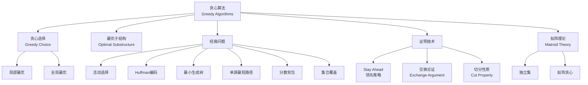
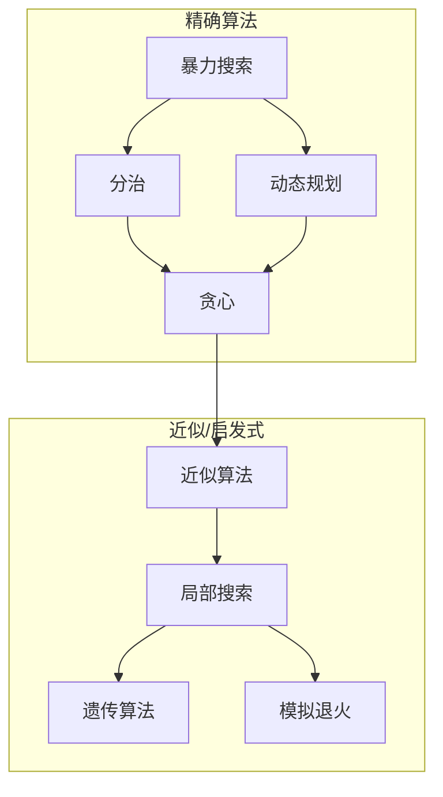

# 贪心算法理论 - 六维内容补充


> **版本**: 1.0
> **创建日期**: 2026-04-19
> **最后更新**: 2026-04-19

> **模块**: 09-算法理论/01-算法基础
> **文档**: 07-贪心算法理论
> **补充维度**: 概念定义、属性、关系、解释、论证、形式证明
> **对标**: MIT 6.046 / Stanford CS161 / CMU 15-451
> **深度**: 研究生级

---

## 思维导图：贪心算法概念结构



---

## 一、概念定义 (Concept Definition)

### 1.1 贪心算法 / Greedy Algorithm

**定义 1.1.1** (形式化)

贪心算法是一种问题求解范式，它在每个决策步骤都做出**局部最优**选择，期望通过一系列局部最优选择达到**全局最优**。

形式化地，对于具有最优子结构的问题，贪心算法可表示为：

$$
\text{Greedy}(P) = \begin{cases}
\text{base}(P) & \text{if } |P| \leq 1 \\
a^* \oplus \text{Greedy}(P \setminus a^*) & \text{otherwise}
\end{cases}
$$

其中 $a^* = \arg\max_{a \in \text{choices}(P)} \text{local\_optimal}(a)$ 是当前局部最优选择。

**贪心算法 vs 动态规划**:

| 特征 | 贪心算法 | 动态规划 |
|------|----------|----------|
| 选择策略 | 一次选择，不再回头 | 考虑所有子问题 |
| 最优性保证 | 需证明 | 必然最优 |
| 时间复杂度 | 通常更低 | 较高 |
| 适用条件 | 贪心选择性质 | 最优子结构 |

---

### 1.2 贪心选择性质 / Greedy Choice Property

**定义 1.2.1** (形式化)

问题 $P$ 具有**贪心选择性质**，如果存在最优解可以通过以下方式构造：

1. 做出一个局部最优选择 $a^*$
2. 将问题简化为子问题 $P'$
3. 无需考虑不包含 $a^*$ 的其他选择

形式化：设 $S^*$ 是原问题的最优解，$a^*$ 是贪心选择，则：

$$\exists S^*: a^* \in S^* \land (S^* \setminus \{a^*\}) \text{ 是 } P' \text{ 的最优解}$$

**关键区别**: 贪心选择性质比最优子结构更强——它不仅要求子问题最优，还要求存在包含当前贪心选择的全局最优解。

---

### 1.3 拟阵 / Matroid

**定义 1.3.1** (形式化)

**拟阵**是满足特定性质的组合结构 $M = (E, \mathcal{I})$：

- $E$: 有限基础集
- $\mathcal{I} \subseteq 2^E$: 独立集族

满足以下公理：

1. **遗传性**: $A \subseteq B \in \mathcal{I} \Rightarrow A \in \mathcal{I}$
2. **交换性**: $A, B \in \mathcal{I}, |A| < |B| \Rightarrow \exists x \in B \setminus A: A \cup \{x\} \in \mathcal{I}$

**定理** (Rado-Edmonds): 对于拟阵优化问题，贪心算法总能找到最优解。

---

## 二、属性 (Properties)

### 2.1 贪心算法适用条件

| 条件 | 含义 | 验证方法 |
|------|------|----------|
| **贪心选择性质** | 局部最优能导向全局最优 | 交换论证 |
| **最优子结构** | 子问题最优解能构造原问题最优解 | 剪切-粘贴 |
| **无后效性** | 当前选择不影响后续选择可行性 | 问题分析 |

### 2.2 经典贪心算法对比

| 问题 | 贪心策略 | 时间复杂度 | 最优性 | 证明方法 |
|------|----------|------------|--------|----------|
| **活动选择** | 最早结束 | $O(n \log n)$ | ✅ | 交换论证 |
| **分数背包** | 价值密度 | $O(n \log n)$ | ✅ | 交换论证 |
| **0/1背包** | 贪心 | $O(n \log n)$ | ❌ | - |
| **Huffman编码** | 最小频率合并 | $O(n \log n)$ | ✅ | 交换论证 |
| **Kruskal MST** | 最小边 | $O(E \log E)$ | ✅ | 切分性质 |
| **Prim MST** | 最小连接边 | $O(E \log V)$ | ✅ | 切分性质 |
| **Dijkstra** | 最短距离 | $O(E \log V)$ | ✅ | 剪切-粘贴 |
| **集合覆盖** | 最大覆盖 | 多项式 | ❌ | $O(\log n)$-近似 |

### 2.3 拟阵示例

| 拟阵 | 基础集 $E$ | 独立集 $\mathcal{I}$ | 贪心应用 |
|------|-----------|---------------------|----------|
| **均匀拟阵** | 任意 | 大小 $\rac{E}{leq} k$ 的子集 | 选择最大权重的k个元素 |
| **划分拟阵** | 分区并集 | 每分区至多选一个 | 二分图匹配 |
| **图拟阵** | 图的边 | 无环边集（森林） | MST |
| **线性拟阵** | 向量 | 线性无关集 | 高斯消元 |

---

## 三、关系 (Relations)

### 3.1 概念关系表

| 源概念 | 目标概念 | 关系类型 | 说明 |
|--------|----------|----------|------|
| 贪心算法 | 动态规划 | contrasts_with | 贪心一次选择，DP考虑所有 |
| 贪心选择性质 | 最优子结构 | stronger_than | 贪心选择蕴含最优子结构 |
| 拟阵 | 贪心最优性 | guarantees | 拟阵上贪心必然最优 |
| 近似算法 | 贪心 | applies_to | 贪心常用于近似算法 |
| 局部搜索 | 贪心 | generalizes | 局部搜索是贪心的一般化 |

### 3.2 算法设计范式层次



---

## 四、解释 (Explanation)

### 4.1 动机与直观

**为什么贪心算法有效？**

贪心算法的核心洞察是：某些问题具有"**现在做最好的选择，将来不会后悔**"的性质。

**直觉示例** (活动选择):

- 策略：选择最早结束的活动
- 原因：这样留下最多时间给后续活动
- 关键：最早结束的活动总是某个最优解的一部分

**贪心失效示例** (0/1背包):

- 贪心：选择价值密度最高的物品
- 反例：背包容量10，物品(重量,价值) = (9,9), (5,5), (5,5)
- 贪心选择(9,9)，总价值9
- 最优选择(5,5)+(5,5)，总价值10

### 4.2 与已有概念的联系

**贪心 ↔ 动态规划**

| 问题 | 贪心 | DP |
|------|------|-----|
| 活动选择 | ✅ 最优 | ✅ 最优但较慢 |
| 分数背包 | ✅ 最优 | ✅ 最优但较慢 |
| 0/1背包 | ❌ 非最优 | ✅ 最优 |
| 最短路径（无负权） | ✅ Dijkstra | ✅ 但较慢 |
| 最短路径（有负权） | ❌ 失效 | ✅ Bellman-Ford |

**贪心 ↔ 近似算法**

当贪心不能得到最优解时，它通常能提供好的近似：

- 集合覆盖：贪心提供 $O(\log n)$-近似
- 最大独立集：贪心提供某种近似

### 4.3 示例与反例

**示例 4.3.1**: Huffman编码

```
问题：给定字符频率，构造最优前缀编码

贪心策略：每次合并频率最小的两个节点

正确性：交换论证证明高频字符应该短编码

示例：
字符: a b c d e f
频率: 45 13 12 16 9 5

贪心构造过程：
1. 合并 e(9) 和 f(5) -> 14
2. 合并 c(12) 和 b(13) -> 25
3. 合并 14 和 d(16) -> 30
4. 合并 a(45) 和 25 -> 70
5. 合并 30 和 70 -> 100
```

**反例 4.3.2**: 硬币找零（某些面值）

```
硬币面值: 1, 3, 4
目标: 找零6元

贪心: 4 + 1 + 1 = 3枚
最优: 3 + 3 = 2枚

结论：贪心非最优
```

---

## 五、论证 (Argumentation)

### 5.1 非形式论证：活动选择的贪心最优性

**交换论证**:

设 $S = \{a_1, a_2, \ldots, a_k\}$ 是按贪心选择（最早结束）的活动集。

设 $O = \{o_1, o_2, \ldots, o_m\}$ 是某个最优解的活动集，也按结束时间排序。

**断言**: 对于所有 $i$，$finish(a_i) \leq finish(o_i)$。

**归纳证明**:

- 基例 $i=1$: $a_1$ 是所有活动中最早结束的，所以 $finish(a_1) \leq finish(o_1)$
- 归纳步骤: 假设对 $i-1$ 成立。由于 $a_i$ 与 $a_{i-1}$ 兼容且贪心选择最早结束的，它必然不比 $o_i$ 晚结束

**结论**: $|S| \geq |O|$，因此贪心最优。

### 5.2 反例与边界

**边界情况 5.2.1**: 贪心近似比

对于某些问题，贪心虽非最优，但近似比有界：

- 集合覆盖：贪心 $\leq O(\log n) \cdot OPT$
- 最大割：贪心 $\geq \frac{1}{2} OPT$

---

## 六、形式证明 (Formal Proof)

### 6.1 Huffman编码最优性证明

**定理 6.1.1**: Huffman算法产生最优前缀编码。

**引理 6.1.2**: 设 $x, y$ 是频率最低的两个字符，则存在最优编码树使 $x, y$ 是兄弟节点且深度最大。

**引理证明** (交换论证):

设 $T$ 是一棵最优编码树，$a, b$ 是深度最大的兄弟节点。

假设 $f(x) \leq f(y) \leq f(a) \leq f(b)$（$x,y$频率最低）。

在 $T$ 中交换 $a$ 和 $x$ 的位置，得到树 $T'$：

$$B(T) - B(T') = (f(a) - f(x))(d_T(a) - d_T(x)) \geq 0$$

其中 $B(T)$ 是树的总代价（外部路径长度）。

因此 $B(T') \leq B(T)$，$T'$也是最优的。

**主定理证明** (归纳):

- **基例**: 1个字符，显然最优
- **归纳步骤**: 假设对 $n-1$ 个字符成立。对 $n$ 个字符：
  1. 合并频率最低的 $x, y$ 为新节点 $z$，$f(z) = f(x) + f(y)$
  2. 对 $n-1$ 个字符构造最优树 $T'$（归纳假设）
  3. 展开 $z$ 为 $x, y$，得到树 $T$
  4. 由引理，存在最优树使 $x, y$ 为兄弟，因此 $T$ 最优

### 6.2 拟阵贪心最优性证明

**定理 6.2.1** (Rado-Edmonds): 对于加权拟阵 $M = (E, \mathcal{I})$，贪心算法找到最大权独立集。

**证明** (交换论证):

设 $S = \{e_1, e_2, \ldots, e_k\}$ 是贪心解，按权重降序选择。

设 $O = \{o_1, o_2, \ldots, o_m\}$ 是最优解，也按权重降序排列。

**断言**: 对于所有 $i$，$w(e_i) \geq w(o_i)$。

**证明**:
假设存在最小的 $j$ 使 $w(e_j) < w(o_j)$。

考虑 $A = \{e_1, \ldots, e_{j-1}\}$ 和 $B = \{o_1, \ldots, o_j\}$。

由遗传性，$A \in \mathcal{I}$。由交换性，存在 $o \in B \setminus A$ 使 $A \cup \{o\} \in \mathcal{I}$。

但 $w(o) \geq w(o_j) > w(e_j)$，贪心应该选 $o$ 而非 $e_j$，矛盾！

因此 $|S| \geq |O|$ 且总权重 $\geq$ 最优。

---

## 七、多语言实现

### 7.1 Rust: 活动选择与Huffman编码

```rust
use std::collections::BinaryHeap;
use std::cmp::Ordering;

/// 活动选择问题
/// 输入: (开始时间, 结束时间) 列表
/// 输出: 最大兼容活动集
pub fn activity_selection(activities: &mut [(i32, i32)]) -> Vec<(i32, i32)> {
    // 按结束时间排序
    activities.sort_by_key(|&(_, end)| end);

    let mut result = Vec::new();
    let mut last_end = 0;

    for &(start, end) in activities {
        if start >= last_end {
            result.push((start, end));
            last_end = end;
        }
    }

    result
}

/// Huffman编码节点
#[derive(Clone, Eq, PartialEq)]
struct HuffmanNode {
    freq: usize,
    char: Option<char>,
    left: Option<Box<HuffmanNode>>,
    right: Option<Box<HuffmanNode>>,
}

impl Ord for HuffmanNode {
    fn cmp(&self, other: &Self) -> Ordering {
        other.freq.cmp(&self.freq)  // 最小堆
    }
}

impl PartialOrd for HuffmanNode {
    fn partial_cmp(&self, other: &Self) -> Option<Ordering> {
        Some(self.cmp(other))
    }
}

/// Huffman编码
pub fn huffman_encoding(freqs: &[(char, usize)]) -> Vec<(char, String)> {
    if freqs.is_empty() {
        return Vec::new();
    }

    let mut heap: BinaryHeap<HuffmanNode> = freqs
        .iter()
        .map(|&(c, f)| HuffmanNode {
            freq: f,
            char: Some(c),
            left: None,
            right: None,
        })
        .collect();

    // 构建Huffman树
    while heap.len() > 1 {
        let left = heap.pop().unwrap();
        let right = heap.pop().unwrap();

        let merged = HuffmanNode {
            freq: left.freq + right.freq,
            char: None,
            left: Some(Box::new(left)),
            right: Some(Box::new(right)),
        };

        heap.push(merged);
    }

    // 生成编码
    let root = heap.pop().unwrap();
    let mut result = Vec::new();
    generate_codes(&root, String::new(), &mut result);
    result
}

fn generate_codes(node: &HuffmanNode, prefix: String, result: &mut Vec<(char, String)>) {
    if let Some(c) = node.char {
        result.push((c, prefix));
        return;
    }

    if let Some(ref left) = node.left {
        generate_codes(left, format!("{}0", prefix), result);
    }
    if let Some(ref right) = node.right {
        generate_codes(right, format!("{}1", prefix), result);
    }
}

/// 分数背包问题
/// 返回: (总重量, 总价值, 选择的物品)
pub fn fractional_knapsack(
    items: &[(f64, f64)],  // (重量, 价值)
    capacity: f64
) -> (f64, f64, Vec<(usize, f64)>) {
    let n = items.len();

    // 计算价值密度并排序
    let mut indexed_items: Vec<(usize, f64, f64, f64)> = items
        .iter()
        .enumerate()
        .map(|(i, &(w, v))| (i, w, v, v / w))
        .collect();

    indexed_items.sort_by(|a, b| b.3.partial_cmp(&a.3).unwrap());

    let mut total_weight = 0.0;
    let mut total_value = 0.0;
    let mut selected = Vec::new();

    for (i, weight, value, _) in indexed_items {
        if total_weight + weight <= capacity {
            // 完全选取
            total_weight += weight;
            total_value += value;
            selected.push((i, 1.0));
        } else {
            // 部分选取
            let remaining = capacity - total_weight;
            let fraction = remaining / weight;
            total_weight += remaining;
            total_value += value * fraction;
            selected.push((i, fraction));
            break;
        }
    }

    (total_weight, total_value, selected)
}

#[cfg(test)]
mod tests {
    use super::*;

    #[test]
    fn test_activity_selection() {
        let mut activities = vec![
            (1, 4), (3, 5), (0, 6), (5, 7), (3, 8),
            (5, 9), (6, 10), (8, 11), (8, 12), (2, 13), (12, 14)
        ];
        let selected = activity_selection(&mut activities);
        assert_eq!(selected.len(), 4);  // (1,4), (5,7), (8,11), (12,14)
    }

    #[test]
    fn test_huffman() {
        let freqs = vec![('a', 45), ('b', 13), ('c', 12), ('d', 16), ('e', 9), ('f', 5)];
        let codes = huffman_encoding(&freqs);

        // 高频字符应该短编码
        let a_code = codes.iter().find(|(c, _)| *c == 'a').unwrap().1.len();
        let f_code = codes.iter().find(|(c, _)| *c == 'f').unwrap().1.len();
        assert!(a_code <= f_code);
    }

    #[test]
    fn test_fractional_knapsack() {
        let items = vec![(10.0, 60.0), (20.0, 100.0), (30.0, 120.0)];
        let (weight, value, _) = fractional_knapsack(&items, 50.0);

        assert!(weight <= 50.0);
        assert!(value > 0.0);
    }
}
```

---

## 八、贪心算法选择决策树

```mermaid
flowchart TD
    Problem[优化问题] --> Check1{满足贪心选择性质?}

    Check1 -->|是| Greedy[贪心算法<br/>O(n log n)]
    Check1 -->|否| Check2{满足最优子结构?}

    Check2 -->|是| DP[动态规划<br/>O(n^2)或更高]
    Check2 -->|否| Approx[近似算法<br/>或启发式]

    Greedy --> MST{MST问题?}
    Greedy --> SP{最短路径?}
    Greedy --> Pack{背包问题?}
    Greedy --> Sched{调度问题?}

    MST -->|是| KruskalPrim[Kruskal/Prim]
    SP -->|是| Dijkstra[Dijkstra算法]
    Pack -->|分数背包| Fractional[贪心最优]
    Pack -->|0/1背包| DPBackpack[需要DP]
    Sched -->|活动选择| ActivitySel[最早结束优先]
    Sched -->|其他| CheckSched[具体分析]
```

---

**文档版本**: v1.0
**创建日期**: 2026-04-10
**维护**: 项目算法理论工作组

---

## 参考文献 / References

1. **[CLRS2022]** Cormen, T. H., Leiserson, C. E., Rivest, R. L., & Stein, C. (2022). *Introduction to Algorithms* (4th ed.). MIT Press.
2. **[KleinbergTardos2006]** Kleinberg, J., & Tardos, É. (2006). *Algorithm Design*. Pearson.
3. **[Erickson2019]** Erickson, J. (2019). *Algorithms*. Self-published. <https://jeffe.cs.illinois.edu/teaching/algorithms/>.

**文档版本 / Document Version**: 1.0
**对齐状态**: 已补充权威引用，与项目引用规范对齐
---

## 知识导航

- [返回目录](README.md)

## 学习目标

- 理解贪心算法理论 - 六维内容补充的核心概念
- 掌握贪心算法理论 - 六维内容补充的形式化表示
