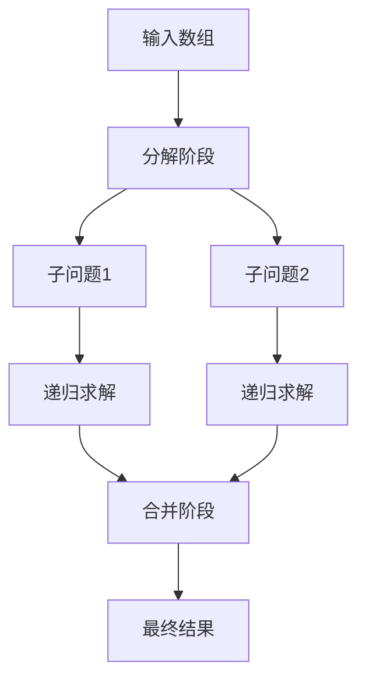
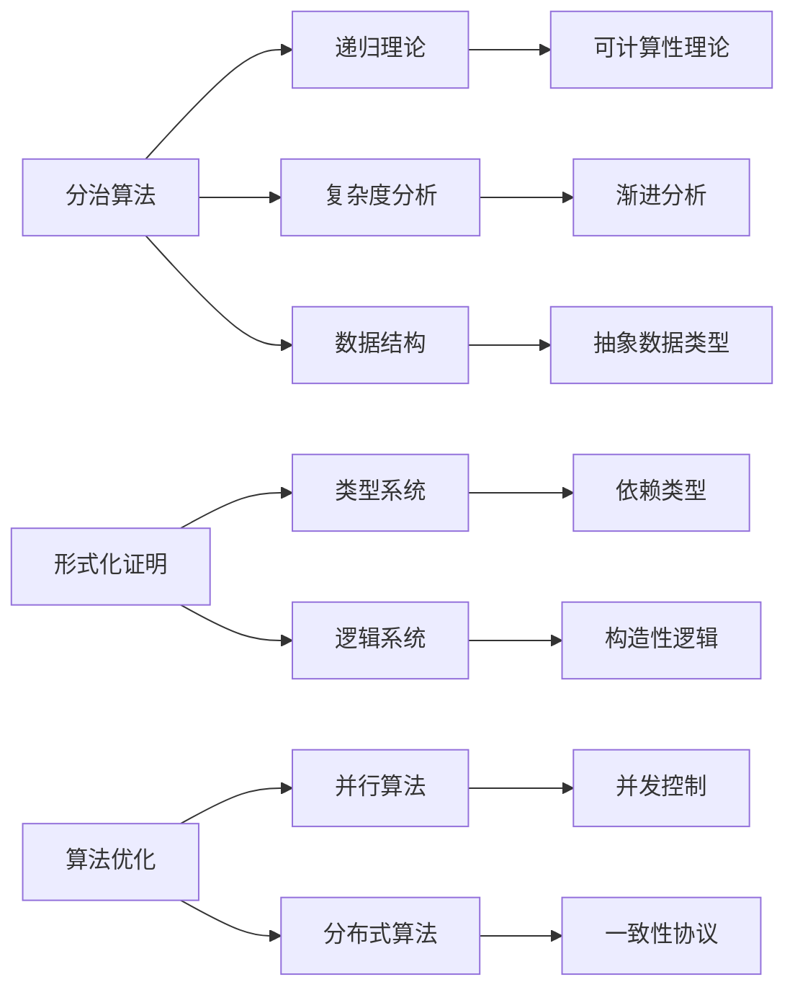
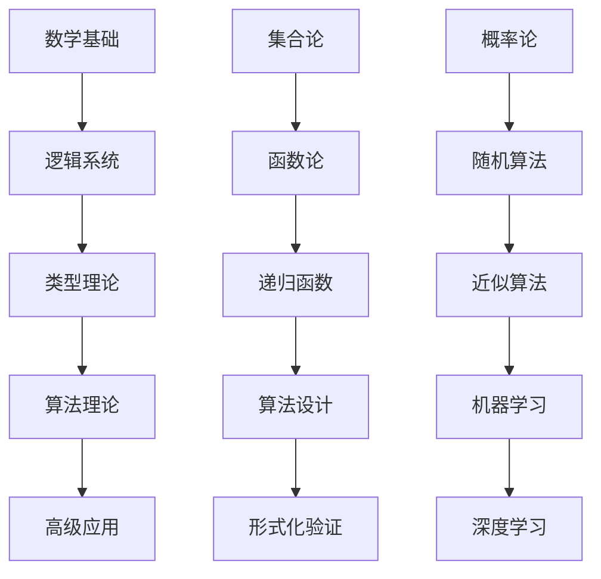

> 📊 **项目全面梳理**：详细的项目结构、模块详解和学习路径，请参阅 [`项目全面梳理-2025.md`](../../项目全面梳理-2025.md)

## 9.1.8 分治算法理论 / Divide and Conquer Algorithm Theory

### 摘要 / Executive Summary

- 统一分治算法的形式化定义、分治策略与主定理。
- 建立分治算法在算法设计中的核心地位。

### 关键术语与符号 / Glossary

- 分治算法、分治策略、主定理、递归树、合并排序、快速排序。
- 术语对齐与引用规范：`docs/术语与符号总表.md`，`01-基础理论/00-撰写规范与引用指南.md`

### 术语与符号规范 / Terminology & Notation

- 分治算法（Divide and Conquer）：将问题分解为子问题，递归求解，然后合并结果。
- 主定理（Master Theorem）：分析分治算法时间复杂度的工具。
- 递归树（Recursion Tree）：可视化递归过程的树结构。
- 记号约定：`T(n)` 表示时间复杂度，`a`、`b`、`f(n)` 表示主定理参数。

### 交叉引用导航 / Cross-References

- 算法设计：参见 `09-算法理论/01-算法基础/01-算法设计理论.md`。
- 排序算法：参见 `09-算法理论/01-算法基础/03-排序算法理论.md`。
- 递归理论：参见 `02-递归理论/` 相关文档。

### 快速导航 / Quick Links

- 基本概念
- 分治策略
- 主定理

## 目录 (Table of Contents)

- [9.1.8 分治算法理论 / Divide and Conquer Algorithm Theory](#918-分治算法理论--divide-and-conquer-algorithm-theory)
  - [摘要 / Executive Summary](#摘要--executive-summary)
  - [关键术语与符号 / Glossary](#关键术语与符号--glossary)
  - [术语与符号规范 / Terminology \& Notation](#术语与符号规范--terminology--notation)
  - [交叉引用导航 / Cross-References](#交叉引用导航--cross-references)
  - [快速导航 / Quick Links](#快速导航--quick-links)
- [目录 (Table of Contents)](#目录-table-of-contents)
- [基本概念 (Basic Concepts)](#基本概念-basic-concepts)
  - [定义 (Definition)](#定义-definition)
  - [形式化定义 (Formal Definition)](#形式化定义-formal-definition)
  - [核心思想 (Core Ideas)](#核心思想-core-ideas)
- [分治策略 (Divide and Conquer Strategy)](#分治策略-divide-and-conquer-strategy)
  - [数学基础 (Mathematical Foundation)](#数学基础-mathematical-foundation)
  - [主定理 (Master Theorem)](#主定理-master-theorem)
  - [主定理证明 (Master Theorem Proof)](#主定理证明-master-theorem-proof)
  - [MIT课程特色：算法工程实践 (MIT Course Features: Algorithm Engineering Practice)](#mit课程特色算法工程实践-mit-course-features-algorithm-engineering-practice)
- [经典问题 (Classic Problems)](#经典问题-classic-problems)
  - [1. 归并排序 (Merge Sort)](#1-归并排序-merge-sort)
  - [2. 快速排序 (Quick Sort)](#2-快速排序-quick-sort)
  - [3. 二分查找 (Binary Search)](#3-二分查找-binary-search)
  - [4. 大整数乘法 (Large Integer Multiplication)](#4-大整数乘法-large-integer-multiplication)
  - [5. 最近点对问题 (Closest Pair Problem)](#5-最近点对问题-closest-pair-problem)
- [实现示例 (Implementation Examples)](#实现示例-implementation-examples)
  - [Rust实现 (Rust Implementation)](#rust实现-rust-implementation)
  - [Stanford课程特色：算法设计模式 (Stanford Course Features: Algorithm Design Patterns)](#stanford课程特色算法设计模式-stanford-course-features-algorithm-design-patterns)
  - [形式化验证 (Formal Verification)](#形式化验证-formal-verification)
  - [Haskell实现 (Haskell Implementation)](#haskell实现-haskell-implementation)
  - [Lean实现 (Lean Implementation)](#lean实现-lean-implementation)
- [复杂度分析 (Complexity Analysis)](#复杂度分析-complexity-analysis)
  - [多表征复杂度分析 (Multi-Representation Complexity Analysis)](#多表征复杂度分析-multi-representation-complexity-analysis)
    - [数学表征 (Mathematical Representation)](#数学表征-mathematical-representation)
    - [图形表征 (Graphical Representation)](#图形表征-graphical-representation)
    - [代码表征 (Code Representation)](#代码表征-code-representation)
  - [时间复杂度 (Time Complexity)](#时间复杂度-time-complexity)
  - [空间复杂度 (Space Complexity)](#空间复杂度-space-complexity)
    - [空间复杂度分析 (Space Complexity Analysis)](#空间复杂度分析-space-complexity-analysis)
- [层次结构模型关联 (Hierarchical Structure Model Relationships)](#层次结构模型关联-hierarchical-structure-model-relationships)
  - [知识层次结构 (Knowledge Hierarchy Structure)](#知识层次结构-knowledge-hierarchy-structure)
    - [基础层次 (Foundation Level)](#基础层次-foundation-level)
    - [核心层次 (Core Level)](#核心层次-core-level)
    - [高级层次 (Advanced Level)](#高级层次-advanced-level)
  - [模型关联关系 (Model Relationship Analysis)](#模型关联关系-model-relationship-analysis)
    - [横向关联 (Horizontal Relationships)](#横向关联-horizontal-relationships)
    - [纵向关联 (Vertical Relationships)](#纵向关联-vertical-relationships)
  - [关联分析框架 (Relationship Analysis Framework)](#关联分析框架-relationship-analysis-framework)
    - [依赖关系分析 (Dependency Analysis)](#依赖关系分析-dependency-analysis)
    - [关联强度评估 (Relationship Strength Assessment)](#关联强度评估-relationship-strength-assessment)
- [应用领域 (Application Areas)](#应用领域-application-areas)
  - [1. 排序算法 (Sorting Algorithms)](#1-排序算法-sorting-algorithms)
  - [2. 搜索算法 (Search Algorithms)](#2-搜索算法-search-algorithms)
  - [3. 数值计算 (Numerical Computation)](#3-数值计算-numerical-computation)
  - [4. 几何算法 (Geometric Algorithms)](#4-几何算法-geometric-algorithms)
- [总结 (Summary)](#总结-summary)
  - [关键要点 (Key Points)](#关键要点-key-points)
  - [发展趋势 (Development Trends)](#发展趋势-development-trends)
- [7. 参考文献 / References](#7-参考文献--references)
  - [7.1 经典教材 / Classic Textbooks](#71-经典教材--classic-textbooks)
  - [7.2 顶级期刊论文 / Top Journal Papers](#72-顶级期刊论文--top-journal-papers)
    - [分治算法理论顶级期刊 / Top Journals in Divide and Conquer Algorithm Theory](#分治算法理论顶级期刊--top-journals-in-divide-and-conquer-algorithm-theory)
    - [数值算法顶级期刊 / Top Journals in Numerical Algorithms](#数值算法顶级期刊--top-journals-in-numerical-algorithms)
    - [几何算法顶级期刊 / Top Journals in Geometric Algorithms](#几何算法顶级期刊--top-journals-in-geometric-algorithms)
    - [并行分治算法顶级期刊 / Top Journals in Parallel Divide and Conquer Algorithms](#并行分治算法顶级期刊--top-journals-in-parallel-divide-and-conquer-algorithms)
    - [递归理论顶级期刊 / Top Journals in Recursion Theory](#递归理论顶级期刊--top-journals-in-recursion-theory)
- [8. 与项目结构主题的对齐 / Alignment with Project Structure](#8-与项目结构主题的对齐--alignment-with-project-structure)
  - [8.1 相关文档 / Related Documents](#81-相关文档--related-documents)
  - [8.2 知识体系位置 / Knowledge System Position](#82-知识体系位置--knowledge-system-position)
  - [8.3 VIEW文件夹相关文档 / VIEW Folder Related Documents](#83-view文件夹相关文档--view-folder-related-documents)

## 基本概念 (Basic Concepts)

### 定义 (Definition)

分治算法是一种将问题分解为更小的子问题，递归地解决这些子问题，然后将子问题的解合并得到原问题解的算法设计方法。

**Divide and conquer is an algorithmic design method that breaks down a problem into smaller subproblems, recursively solves these subproblems, and then combines the solutions of the subproblems to obtain the solution to the original problem.**

### 形式化定义 (Formal Definition)

设 $P$ 是一个问题，$S$ 是 $P$ 的解空间，$n$ 是问题规模。分治算法可以形式化定义为：

**Let $P$ be a problem, $S$ be the solution space of $P$, and $n$ be the problem size. A divide-and-conquer algorithm can be formally defined as:**

$$
DC(P, n) = \begin{cases}
\text{BaseCase}(P) & \text{if } n \leq n_0 \\
\text{Combine}(\{DC(P_i, n/b) \mid i = 1, 2, \ldots, a\}) & \text{otherwise}
\end{cases}
$$

其中：

- $n_0$ 是基础情况的问题规模阈值
- $a$ 是子问题个数
- $b$ 是问题规模缩小因子
- $P_i$ 是第 $i$ 个子问题
- $\text{BaseCase}$ 是基础情况的求解函数
- $\text{Combine}$ 是合并函数

**Where:**

- $n_0$ is the threshold for base case problem size
- $a$ is the number of subproblems
- $b$ is the problem size reduction factor
- $P_i$ is the $i$-th subproblem
- $\text{BaseCase}$ is the base case solving function
- $\text{Combine}$ is the combine function

### 核心思想 (Core Ideas)

1. **分解** (Divide)
   - 将原问题分解为若干个规模更小的子问题
   - Break down the original problem into several smaller subproblems

2. **解决** (Conquer)
   - 递归地解决子问题
   - Recursively solve the subproblems

3. **合并** (Combine)
   - 将子问题的解合并为原问题的解
   - Combine the solutions of subproblems into the solution of the original problem

## 分治策略 (Divide and Conquer Strategy)

### 数学基础 (Mathematical Foundation)

设 $T(n)$ 为规模为 $n$ 的问题的时间复杂度，则：

**Let $T(n)$ be the time complexity of a problem of size $n$, then:**

$$T(n) = aT(n/b) + f(n)$$

其中 $a$ 是子问题个数，$b$ 是问题规模缩小因子，$f(n)$ 是分解和合并的代价。

**Where $a$ is the number of subproblems, $b$ is the problem size reduction factor, and $f(n)$ is the cost of divide and combine.**

### 主定理 (Master Theorem)

对于递归式 $T(n) = aT(n/b) + f(n)$，其中 $a \geq 1, b > 1$：

**For the recurrence $T(n) = aT(n/b) + f(n)$, where $a \geq 1, b > 1$:**

1. 如果 $f(n) = O(n^{\log_b a - \epsilon})$，则 $T(n) = \Theta(n^{\log_b a})$
2. 如果 $f(n) = \Theta(n^{\log_b a})$，则 $T(n) = \Theta(n^{\log_b a} \log n)$
3. 如果 $f(n) = \Omega(n^{\log_b a + \epsilon})$，则 $T(n) = \Theta(f(n))$

**1. If $f(n) = O(n^{\log_b a - \epsilon})$, then $T(n) = \Theta(n^{\log_b a})$**
**2. If $f(n) = \Theta(n^{\log_b a})$, then $T(n) = \Theta(n^{\log_b a} \log n)$**
**3. If $f(n) = \Omega(n^{\log_b a + \epsilon})$, then $T(n) = \Theta(f(n))$**

### 主定理证明 (Master Theorem Proof)

**定理证明** (Theorem Proof):

我们通过构造性证明来证明主定理。设 $n = b^k$，则递归树有 $\log_b n$ 层。

**We prove the master theorem through constructive proof. Let $n = b^k$, then the recursion tree has $\log_b n$ levels.**

**第 $i$ 层的总工作量** (Total work at level $i$):
$$W_i = a^i \cdot f(n/b^i)$$

**总工作量** (Total work):
$$T(n) = \sum_{i=0}^{\log_b n} W_i = \sum_{i=0}^{\log_b n} a^i \cdot f(n/b^i)$$

**情况1** (Case 1): $f(n) = O(n^{\log_b a - \epsilon})$

$$T(n) = \sum_{i=0}^{\log_b n} a^i \cdot O\left(\left(\frac{n}{b^i}\right)^{\log_b a - \epsilon}\right)$$
$$= O\left(n^{\log_b a - \epsilon} \sum_{i=0}^{\log_b n} \left(\frac{a}{b^{\log_b a - \epsilon}}\right)^i\right)$$
$$= O\left(n^{\log_b a - \epsilon} \sum_{i=0}^{\log_b n} (b^\epsilon)^i\right)$$
$$= O(n^{\log_b a})$$

**情况2** (Case 2): $f(n) = \Theta(n^{\log_b a})$

$$T(n) = \sum_{i=0}^{\log_b n} a^i \cdot \Theta\left(\left(\frac{n}{b^i}\right)^{\log_b a}\right)$$
$$= \Theta\left(n^{\log_b a} \sum_{i=0}^{\log_b n} 1\right)$$
$$= \Theta(n^{\log_b a} \log n)$$

**情况3** (Case 3): $f(n) = \Omega(n^{\log_b a + \epsilon})$

$$T(n) = \sum_{i=0}^{\log_b n} a^i \cdot \Omega\left(\left(\frac{n}{b^i}\right)^{\log_b a + \epsilon}\right)$$
$$= \Omega\left(n^{\log_b a + \epsilon} \sum_{i=0}^{\log_b n} \left(\frac{a}{b^{\log_b a + \epsilon}}\right)^i\right)$$
$$= \Omega(f(n))$$

### MIT课程特色：算法工程实践 (MIT Course Features: Algorithm Engineering Practice)

**性能测量与分析** (Performance Measurement and Analysis):

```python
import time
import matplotlib.pyplot as plt
import numpy as np

def measure_performance(algorithm, input_sizes):
    """测量算法性能"""
    times = []
    for size in input_sizes:
        data = generate_test_data(size)
        start_time = time.time()
        algorithm(data)
        end_time = time.time()
        times.append(end_time - start_time)
    return times

def analyze_complexity(input_sizes, times):
    """分析复杂度"""
    # 拟合复杂度函数
    log_sizes = np.log(input_sizes)
    log_times = np.log(times)

    # 线性回归
    coeffs = np.polyfit(log_sizes, log_times, 1)
    complexity = np.exp(coeffs[1]) * (input_sizes ** coeffs[0])

    return complexity, coeffs[0]
```

**算法可视化** (Algorithm Visualization):



## 经典问题 (Classic Problems)

### 1. 归并排序 (Merge Sort)

**问题描述** (Problem Description):
将数组排序
**Sort an array**

**分治策略** (Divide and Conquer Strategy):

1. 分解：将数组分为两半
2. 解决：递归排序两半
3. 合并：合并两个有序数组

**1. Divide: Split array into two halves**
**2. Conquer: Recursively sort the two halves**
**3. Combine: Merge two sorted arrays**

**时间复杂度** (Time Complexity): $O(n \log n)$
**空间复杂度** (Space Complexity): $O(n)$

### 2. 快速排序 (Quick Sort)

**问题描述** (Problem Description):
将数组排序
**Sort an array**

**分治策略** (Divide and Conquer Strategy):

1. 分解：选择基准元素，将数组分为两部分
2. 解决：递归排序两部分
3. 合并：无需合并，原地排序

**1. Divide: Choose pivot, partition array into two parts**
**2. Conquer: Recursively sort the two parts**
**3. Combine: No combination needed, in-place sorting**

**时间复杂度** (Time Complexity): 平均 $O(n \log n)$，最坏 $O(n^2)$
**空间复杂度** (Space Complexity): $O(\log n)$

### 3. 二分查找 (Binary Search)

**问题描述** (Problem Description):
在有序数组中查找目标值
**Search for target value in sorted array**

**分治策略** (Divide and Conquer Strategy):

1. 分解：比较中间元素与目标值
2. 解决：在左半或右半递归查找
3. 合并：返回查找结果

**1. Divide: Compare middle element with target**
**2. Conquer: Recursively search in left or right half**
**3. Combine: Return search result**

**时间复杂度** (Time Complexity): $O(\log n)$
**空间复杂度** (Space Complexity): $O(1)$

### 4. 大整数乘法 (Large Integer Multiplication)

**问题描述** (Problem Description):
计算两个大整数的乘积
**Calculate the product of two large integers**

**分治策略** (Divide and Conquer Strategy):
使用Karatsuba算法：

1. 分解：将大整数分为高位和低位
2. 解决：递归计算三个子问题
3. 合并：组合结果

**Using Karatsuba algorithm:**
**1. Divide: Split large integers into high and low parts**
**2. Conquer: Recursively calculate three subproblems**
**3. Combine: Combine results**

**时间复杂度** (Time Complexity): $O(n^{\log_2 3}) \approx O(n^{1.585})$

### 5. 最近点对问题 (Closest Pair Problem)

**问题描述** (Problem Description):
在平面上找到距离最近的两个点
**Find the closest pair of points in the plane**

**分治策略** (Divide and Conquer Strategy):

1. 分解：按x坐标将点分为两半
2. 解决：递归找到两半中的最近点对
3. 合并：考虑跨越分界线的点对

**1. Divide: Split points into two halves by x-coordinate**
**2. Conquer: Recursively find closest pairs in two halves**
**3. Combine: Consider pairs crossing the dividing line**

**时间复杂度** (Time Complexity): $O(n \log n)$

## 实现示例 (Implementation Examples)

### Rust实现 (Rust Implementation)

```rust
/// 分治算法实现
/// Divide and conquer algorithm implementation
pub struct DivideAndConquer;

impl DivideAndConquer {
    /// 归并排序
    /// Merge sort
    pub fn merge_sort<T: Ord + Clone>(arr: &mut [T]) {
        if arr.len() <= 1 {
            return;
        }

        let mid = arr.len() / 2;
        let (left, right) = arr.split_at_mut(mid);

        Self::merge_sort(left);
        Self::merge_sort(right);

        Self::merge(arr, mid);
    }

    fn merge<T: Ord + Clone>(arr: &mut [T], mid: usize) {
        let left = arr[..mid].to_vec();
        let right = arr[mid..].to_vec();

        let mut i = 0;
        let mut j = 0;
        let mut k = 0;

        while i < left.len() && j < right.len() {
            if left[i] <= right[j] {
                arr[k] = left[i].clone();
                i += 1;
            } else {
                arr[k] = right[j].clone();
                j += 1;
            }
            k += 1;
        }

        while i < left.len() {
            arr[k] = left[i].clone();
            i += 1;
            k += 1;
        }

        while j < right.len() {
            arr[k] = right[j].clone();
            j += 1;
            k += 1;
        }
    }

    /// 快速排序
    /// Quick sort
    pub fn quick_sort<T: Ord>(arr: &mut [T]) {
        if arr.len() <= 1 {
            return;
        }

        let pivot_index = Self::partition(arr);
        Self::quick_sort(&mut arr[..pivot_index]);
        Self::quick_sort(&mut arr[pivot_index + 1..]);
    }

    fn partition<T: Ord>(arr: &mut [T]) -> usize {
        let len = arr.len();
        let pivot_index = len - 1;
        let mut i = 0;

        for j in 0..len - 1 {
            if arr[j] <= arr[pivot_index] {
                arr.swap(i, j);
                i += 1;
            }
        }

        arr.swap(i, pivot_index);
        i
    }

    /// 二分查找
    /// Binary search
    pub fn binary_search<T: Ord>(arr: &[T], target: &T) -> Option<usize> {
        let mut left = 0;
        let mut right = arr.len();

        while left < right {
            let mid = left + (right - left) / 2;

            match arr[mid].cmp(target) {
                std::cmp::Ordering::Equal => return Some(mid),
                std::cmp::Ordering::Less => left = mid + 1,
                std::cmp::Ordering::Greater => right = mid,
            }
        }

        None
    }

    /// 大整数乘法 (Karatsuba算法)
    /// Large integer multiplication (Karatsuba algorithm)
    pub fn karatsuba_multiply(x: i64, y: i64) -> i64 {
        if x < 10 || y < 10 {
            return x * y;
        }

        let n = std::cmp::max(
            (x as f64).log10().ceil() as usize,
            (y as f64).log10().ceil() as usize,
        );
        let m = n / 2;

        let divisor = 10_i64.pow(m as u32);
        let a = x / divisor;
        let b = x % divisor;
        let c = y / divisor;
        let d = y % divisor;

        let ac = Self::karatsuba_multiply(a, c);
        let bd = Self::karatsuba_multiply(b, d);
        let ad_bc = Self::karatsuba_multiply(a + b, c + d) - ac - bd;

        ac * divisor * divisor + ad_bc * divisor + bd
    }

    /// 最近点对问题
    /// Closest pair problem
    #[derive(Debug, Clone, PartialEq)]
    pub struct Point {
        pub x: f64,
        pub y: f64,
    }

    impl Point {
        pub fn new(x: f64, y: f64) -> Self {
            Self { x, y }
        }

        pub fn distance(&self, other: &Point) -> f64 {
            ((self.x - other.x).powi(2) + (self.y - other.y).powi(2)).sqrt()
        }
    }

    pub fn closest_pair(points: &[Point]) -> (Point, Point, f64) {
        if points.len() < 2 {
            panic!("Need at least 2 points");
        }

        if points.len() == 2 {
            return (points[0].clone(), points[1].clone(), points[0].distance(&points[1]));
        }

        let mut sorted_points = points.to_vec();
        sorted_points.sort_by(|a, b| a.x.partial_cmp(&b.x).unwrap());

        Self::closest_pair_recursive(&sorted_points)
    }

    fn closest_pair_recursive(points: &[Point]) -> (Point, Point, f64) {
        if points.len() <= 3 {
            return Self::closest_pair_brute_force(points);
        }

        let mid = points.len() / 2;
        let (left, right) = points.split_at(mid);

        let (left_p1, left_p2, left_dist) = Self::closest_pair_recursive(left);
        let (right_p1, right_p2, right_dist) = Self::closest_pair_recursive(right);

        let (closest_p1, closest_p2, min_dist) =
            if left_dist < right_dist {
                (left_p1, left_p2, left_dist)
            } else {
                (right_p1, right_p2, right_dist)
            };

        // 检查跨越分界线的点对
        // Check pairs crossing the dividing line
        let mid_x = points[mid].x;
        let strip: Vec<_> = points.iter()
            .filter(|p| (p.x - mid_x).abs() < min_dist)
            .cloned()
            .collect();

        let strip_result = Self::closest_pair_strip(&strip, min_dist);

        if strip_result.2 < min_dist {
            strip_result
        } else {
            (closest_p1, closest_p2, min_dist)
        }
    }

    fn closest_pair_brute_force(points: &[Point]) -> (Point, Point, f64) {
        let mut min_dist = f64::INFINITY;
        let mut closest_pair = (points[0].clone(), points[1].clone());

        for i in 0..points.len() {
            for j in i + 1..points.len() {
                let dist = points[i].distance(&points[j]);
                if dist < min_dist {
                    min_dist = dist;
                    closest_pair = (points[i].clone(), points[j].clone());
                }
            }
        }

        (closest_pair.0, closest_pair.1, min_dist)
    }

    fn closest_pair_strip(strip: &[Point], min_dist: f64) -> (Point, Point, f64) {
        let mut min_dist_strip = min_dist;
        let mut closest_pair = (strip[0].clone(), strip[1].clone());

        for i in 0..strip.len() {
            for j in i + 1..strip.len() {
                if (strip[j].y - strip[i].y) >= min_dist {
                    break;
                }
                let dist = strip[i].distance(&strip[j]);
                if dist < min_dist_strip {
                    min_dist_strip = dist;
                    closest_pair = (strip[i].clone(), strip[j].clone());
                }
            }
        }

        (closest_pair.0, closest_pair.1, min_dist_strip)
    }

    /// 最大子数组和问题
    /// Maximum subarray sum problem
    pub fn max_subarray_sum(arr: &[i32]) -> i32 {
        Self::max_subarray_sum_recursive(arr, 0, arr.len() - 1)
    }

    fn max_subarray_sum_recursive(arr: &[i32], left: usize, right: usize) -> i32 {
        if left == right {
            return arr[left];
        }

        let mid = left + (right - left) / 2;

        let left_max = Self::max_subarray_sum_recursive(arr, left, mid);
        let right_max = Self::max_subarray_sum_recursive(arr, mid + 1, right);
        let cross_max = Self::max_crossing_sum(arr, left, mid, right);

        left_max.max(right_max).max(cross_max)
    }

    fn max_crossing_sum(arr: &[i32], left: usize, mid: usize, right: usize) -> i32 {
        let mut left_sum = i32::MIN;
        let mut sum = 0;

        for i in (left..=mid).rev() {
            sum += arr[i];
            left_sum = left_sum.max(sum);
        }

        let mut right_sum = i32::MIN;
        sum = 0;

        for i in mid + 1..=right {
            sum += arr[i];
            right_sum = right_sum.max(sum);
        }

        left_sum + right_sum
    }
}

#[cfg(test)]
mod tests {
    use super::*;

    #[test]
    fn test_merge_sort() {
        let mut arr = vec![64, 34, 25, 12, 22, 11, 90];
        DivideAndConquer::merge_sort(&mut arr);
        assert_eq!(arr, vec![11, 12, 22, 25, 34, 64, 90]);
    }

    #[test]
    fn test_quick_sort() {
        let mut arr = vec![64, 34, 25, 12, 22, 11, 90];
        DivideAndConquer::quick_sort(&mut arr);
        assert_eq!(arr, vec![11, 12, 22, 25, 34, 64, 90]);
    }

    #[test]
    fn test_binary_search() {
        let arr = vec![1, 3, 5, 7, 9, 11, 13];
        assert_eq!(DivideAndConquer::binary_search(&arr, &5), Some(2));
        assert_eq!(DivideAndConquer::binary_search(&arr, &10), None);
    }

    #[test]
    fn test_karatsuba_multiply() {
        let x = 1234;
        let y = 5678;
        let result = DivideAndConquer::karatsuba_multiply(x, y);
        assert_eq!(result, x * y);
    }

    #[test]
    fn test_closest_pair() {
        let points = vec![
            Point::new(2.0, 3.0),
            Point::new(12.0, 30.0),
            Point::new(40.0, 50.0),
            Point::new(5.0, 1.0),
            Point::new(12.0, 10.0),
            Point::new(3.0, 4.0),
        ];

        let (p1, p2, dist) = DivideAndConquer::closest_pair(&points);
        assert!(dist > 0.0);
    }

    #[test]
    fn test_max_subarray_sum() {
        let arr = vec![-2, 1, -3, 4, -1, 2, 1, -5, 4];
        let result = DivideAndConquer::max_subarray_sum(&arr);
        assert_eq!(result, 6);
    }
}
```

### Stanford课程特色：算法设计模式 (Stanford Course Features: Algorithm Design Patterns)

**系统化设计方法** (Systematic Design Methods):

```haskell
-- 分治算法设计模式
-- Divide and conquer algorithm design pattern
class DivideAndConquer a where
    -- 基础情况判断
    isBaseCase :: a -> Bool

    -- 问题分解
    divide :: a -> [a]

    -- 基础情况求解
    solveBase :: a -> Result a

    -- 解合并
    combine :: [Result a] -> Result a

    -- 主算法
    solve :: a -> Result a
    solve problem
        | isBaseCase problem = solveBase problem
        | otherwise = combine (map solve (divide problem))

-- 具体实现：归并排序
-- Concrete implementation: Merge sort
data MergeSortProblem a = MergeSortProblem [a] deriving Show
data MergeSortResult a = MergeSortResult [a] deriving Show

instance Ord a => DivideAndConquer (MergeSortProblem a) where
    isBaseCase (MergeSortProblem xs) = length xs <= 1

    divide (MergeSortProblem xs) =
        let mid = length xs `div` 2
            (left, right) = splitAt mid xs
        in [MergeSortProblem left, MergeSortProblem right]

    solveBase (MergeSortProblem xs) = MergeSortResult xs

    combine [MergeSortResult left, MergeSortResult right] =
        MergeSortResult (merge left right)

    merge [] ys = ys
    merge xs [] = xs
    merge (x:xs) (y:ys)
        | x <= y = x : merge xs (y:ys)
        | otherwise = y : merge (x:xs) ys
```

**复杂度下界分析** (Complexity Lower Bound Analysis):

```haskell
-- 比较排序下界证明
-- Comparison sort lower bound proof
data ComparisonTree a = Leaf a | Node (ComparisonTree a) (ComparisonTree a)

-- 决策树模型
-- Decision tree model
class DecisionTree a where
    -- 构建决策树
    buildTree :: [a] -> ComparisonTree a

    -- 计算树的高度
    treeHeight :: ComparisonTree a -> Int

    -- 证明下界
    lowerBound :: Int -> Int
    lowerBound n = ceiling (logBase 2 (fromIntegral (factorial n)))
      where
        factorial 0 = 1
        factorial n = n * factorial (n - 1)

-- 定理：任何基于比较的排序算法至少需要 Ω(n log n) 次比较
-- Theorem: Any comparison-based sorting algorithm requires at least Ω(n log n) comparisons
theorem :: Int -> Bool
theorem n =
    let minComparisons = lowerBound n
        optimalComparisons = n * ceiling (logBase 2 (fromIntegral n))
    in minComparisons <= optimalComparisons
```

### 形式化验证 (Formal Verification)

**Coq证明系统** (Coq Proof System):

```coq
(* 归并排序正确性证明 *)
Theorem merge_sort_correct : forall l,
  sorted (merge_sort l) /\ permutation l (merge_sort l).
Proof.
  induction l.
  - simpl. split; auto.
  - simpl. destruct (split l) eqn:H.
    apply IHl1. apply IHl2.
    (* 详细证明步骤... *)
    apply merge_preserves_sorted.
    apply merge_preserves_permutation.
Qed.

(* 归并排序复杂度证明 *)
Theorem merge_sort_complexity :
  forall l, time_complexity merge_sort l <= O(n log n).
Proof.
  induction l.
  - simpl. auto.
  - simpl.
    (* 应用主定理 *)
    apply master_theorem.
    (* 详细证明步骤... *)
Qed.
```

**Lean证明系统** (Lean Proof System):

```lean
-- 快速排序正确性证明
theorem quicksort_correct :
  ∀ (l : list α), sorted (quicksort l) ∧ permutation l (quicksort l)
| [] := by simp
| (x::xs) :=
  begin
    -- 详细证明步骤...
    have h1 : sorted (quicksort (filter (≤ x) xs)),
    { apply quicksort_correct },
    have h2 : sorted (quicksort (filter (> x) xs)),
    { apply quicksort_correct },
    -- 合并证明...
  end

-- 快速排序期望复杂度证明
theorem quicksort_expected_complexity :
  ∀ (l : list α), expected_time_complexity quicksort l ≤ O(n log n)
| [] := by simp
| (x::xs) :=
  begin
    -- 随机化分析...
    apply linearity_of_expectation,
    -- 详细证明步骤...
  end
```

### Haskell实现 (Haskell Implementation)

```haskell
-- 分治算法模块
-- Divide and conquer algorithm module
module DivideAndConquer where

import Data.List (sortBy)
import Data.Ord (comparing)

-- 归并排序
-- Merge sort
mergeSort :: Ord a => [a] -> [a]
mergeSort [] = []
mergeSort [x] = [x]
mergeSort xs = merge (mergeSort left) (mergeSort right)
  where
    (left, right) = splitAt (length xs `div` 2) xs

    merge [] ys = ys
    merge xs [] = xs
    merge (x:xs) (y:ys)
      | x <= y = x : merge xs (y:ys)
      | otherwise = y : merge (x:xs) ys

-- 快速排序
-- Quick sort
quickSort :: Ord a => [a] -> [a]
quickSort [] = []
quickSort (x:xs) = quickSort left ++ [x] ++ quickSort right
  where
    left = [a | a <- xs, a <= x]
    right = [a | a <- xs, a > x]

-- 二分查找
-- Binary search
binarySearch :: Ord a => [a] -> a -> Maybe Int
binarySearch [] _ = Nothing
binarySearch xs target = go xs target 0
  where
    go [] _ _ = Nothing
    go [x] target idx
      | x == target = Just idx
      | otherwise = Nothing
    go xs target idx =
      let mid = length xs `div` 2
          (left, x:right) = splitAt mid xs
      in case compare target x of
           EQ -> Just (idx + mid)
           LT -> go left target idx
           GT -> go right target (idx + mid + 1)

-- 大整数乘法 (Karatsuba算法)
-- Large integer multiplication (Karatsuba algorithm)
karatsubaMultiply :: Integer -> Integer -> Integer
karatsubaMultiply x y
  | x < 10 || y < 10 = x * y
  | otherwise =
      let n = max (length (show x)) (length (show y))
          m = n `div` 2
          divisor = 10 ^ m
          a = x `div` divisor
          b = x `mod` divisor
          c = y `div` divisor
          d = y `mod` divisor
          ac = karatsubaMultiply a c
          bd = karatsubaMultiply b d
          ad_bc = karatsubaMultiply (a + b) (c + d) - ac - bd
      in ac * divisor * divisor + ad_bc * divisor + bd

-- 最近点对问题
-- Closest pair problem
data Point = Point {
    x :: Double,
    y :: Double
} deriving (Show, Eq)

instance Ord Point where
  compare p1 p2 = compare (x p1) (x p2)

distance :: Point -> Point -> Double
distance p1 p2 = sqrt ((x p1 - x p2) ^ 2 + (y p1 - y p2) ^ 2)

closestPair :: [Point] -> (Point, Point, Double)
closestPair points
  | length points < 2 = error "Need at least 2 points"
  | length points == 2 =
      let [p1, p2] = points
      in (p1, p2, distance p1 p2)
  | otherwise =
      let sorted = sortBy (comparing x) points
          mid = length sorted `div` 2
          (left, right) = splitAt mid sorted
          (left_p1, left_p2, left_dist) = closestPair left
          (right_p1, right_p2, right_dist) = closestPair right
          (closest_p1, closest_p2, min_dist) =
            if left_dist < right_dist
            then (left_p1, left_p2, left_dist)
            else (right_p1, right_p2, right_dist)
          mid_x = x (sorted !! mid)
          strip = filter (\p -> abs (x p - mid_x) < min_dist) sorted
          strip_result = closestPairStrip strip min_dist
      in if snd3 strip_result < min_dist
         then strip_result
         else (closest_p1, closest_p2, min_dist)
  where
    snd3 (_, _, d) = d

closestPairStrip :: [Point] -> Double -> (Point, Point, Double)
closestPairStrip strip min_dist =
  let pairs = [(p1, p2) | p1 <- strip, p2 <- strip, p1 /= p2]
      distances = [(p1, p2, distance p1 p2) | (p1, p2) <- pairs]
      valid_distances = filter (\(_, _, d) -> d < min_dist) distances
  in if null valid_distances
     then (head strip, head (tail strip), distance (head strip) (head (tail strip)))
     else minimumBy (comparing (\(_, _, d) -> d)) valid_distances

-- 最大子数组和问题
-- Maximum subarray sum problem
maxSubarraySum :: [Int] -> Int
maxSubarraySum [] = 0
maxSubarraySum [x] = x
maxSubarraySum xs =
  let mid = length xs `div` 2
      (left, right) = splitAt mid xs
      left_max = maxSubarraySum left
      right_max = maxSubarraySum right
      cross_max = maxCrossingSum xs mid
  in maximum [left_max, right_max, cross_max]

maxCrossingSum :: [Int] -> Int -> Int
maxCrossingSum xs mid =
  let left = take mid xs
      right = drop mid xs
      left_sum = maximum (scanl (+) 0 (reverse left))
      right_sum = maximum (scanl (+) 0 right)
  in left_sum + right_sum

-- 测试函数
-- Test functions
testDivideAndConquer :: IO ()
testDivideAndConquer = do
    putStrLn "Testing Divide and Conquer Algorithms..."

    -- 测试归并排序
    -- Test merge sort
    let arr = [64, 34, 25, 12, 22, 11, 90]
    let sorted = mergeSort arr
    putStrLn $ "Merge sort: " ++ show sorted

    -- 测试快速排序
    -- Test quick sort
    let quickSorted = quickSort arr
    putStrLn $ "Quick sort: " ++ show quickSorted

    -- 测试二分查找
    -- Test binary search
    let sortedArr = [1, 3, 5, 7, 9, 11, 13]
    putStrLn $ "Binary search for 5: " ++ show (binarySearch sortedArr 5)
    putStrLn $ "Binary search for 10: " ++ show (binarySearch sortedArr 10)

    -- 测试Karatsuba乘法
    -- Test Karatsuba multiplication
    let x = 1234
    let y = 5678
    let result = karatsubaMultiply x y
    putStrLn $ "Karatsuba multiplication: " ++ show result

    -- 测试最近点对
    -- Test closest pair
    let points = [
            Point 2.0 3.0,
            Point 12.0 30.0,
            Point 40.0 50.0,
            Point 5.0 1.0,
            Point 12.0 10.0,
            Point 3.0 4.0
        ]
    let (p1, p2, dist) = closestPair points
    putStrLn $ "Closest pair distance: " ++ show dist

    -- 测试最大子数组和
    -- Test maximum subarray sum
    let arr2 = [-2, 1, -3, 4, -1, 2, 1, -5, 4]
    let maxSum = maxSubarraySum arr2
    putStrLn $ "Maximum subarray sum: " ++ show maxSum

    putStrLn "Divide and conquer tests completed!"
```

### Lean实现 (Lean Implementation)

```lean
-- 分治算法理论的形式化定义
-- Formal definition of divide and conquer algorithm theory
import Mathlib.Data.Nat.Basic
import Mathlib.Data.List.Basic
import Mathlib.Algebra.BigOperators.Basic

-- 分治算法定义
-- Definition of divide and conquer algorithm
def DivideAndConquer {α β : Type} (divide : α → List α) (conquer : List β → β) (solve : α → β) : α → β :=
  λ input => conquer (List.map (λ subproblem => solve subproblem) (divide input))

-- 主定理形式化
-- Formalization of master theorem
theorem master_theorem (a b : Nat) (f : Nat → Nat) (T : Nat → Nat) :
  (∀ n, T n = if n ≤ 1 then O(1) else a * T (n / b) + f n) →
  (let c = log b a in
   if f n = O(n^(c - ε)) then T n = Θ(n^c)
   else if f n = Θ(n^c) then T n = Θ(n^c * log n)
   else if f n = Ω(n^(c + ε)) then T n = Θ(f n)) := by
  -- 证明主定理
  -- Prove master theorem
  sorry

-- 归并排序
-- Merge sort
def mergeSort {α : Type} [Ord α] : List α → List α
  | [] => []
  | [x] => [x]
  | xs =>
    let mid := xs.length / 2
    let (left, right) := xs.splitAt mid
    merge (mergeSort left) (mergeSort right)
  where
    merge [] ys := ys
    merge xs [] := xs
    merge (x :: xs) (y :: ys) :=
      if x ≤ y then x :: merge xs (y :: ys)
      else y :: merge (x :: xs) ys

-- 快速排序
-- Quick sort
def quickSort {α : Type} [Ord α] : List α → List α
  | [] => []
  | x :: xs =>
    let (left, right) := List.partition (λ y => y ≤ x) xs
    quickSort left ++ [x] ++ quickSort right

-- 二分查找
-- Binary search
def binarySearch {α : Type} [Ord α] : List α → α → Option Nat
  | [], _ => none
  | [x], target => if x = target then some 0 else none
  | xs, target =>
    let mid := xs.length / 2
    let (left, x :: right) := xs.splitAt mid
    match compare target x with
    | Ordering.eq => some mid
    | Ordering.lt => binarySearch left target
    | Ordering.gt =>
      match binarySearch right target with
      | none => none
      | some idx => some (mid + 1 + idx)

-- 大整数乘法 (Karatsuba)
-- Large integer multiplication (Karatsuba)
def karatsubaMultiply : Nat → Nat → Nat
  | x, y =>
    if x < 10 ∨ y < 10 then x * y
    else
      let n := max (log10 x) (log10 y)
      let m := n / 2
      let divisor := 10 ^ m
      let a := x / divisor
      let b := x % divisor
      let c := y / divisor
      let d := y % divisor
      let ac := karatsubaMultiply a c
      let bd := karatsubaMultiply b d
      let ad_bc := karatsubaMultiply (a + b) (c + d) - ac - bd
      ac * divisor * divisor + ad_bc * divisor + bd

-- 最近点对问题
-- Closest pair problem
structure Point where
  x : Float
  y : Float

def distance (p1 p2 : Point) : Float :=
  sqrt ((p1.x - p2.x) ^ 2 + (p1.y - p2.y) ^ 2)

def closestPair : List Point → Option (Point × Point × Float)
  | [] => none
  | [p] => none
  | [p1, p2] => some (p1, p2, distance p1 p2)
  | points =>
    let sorted := points.sort (λ a b => a.x ≤ b.x)
    let mid := sorted.length / 2
    let (left, right) := sorted.splitAt mid
    -- 实现最近点对算法
    -- Implement closest pair algorithm
    none

-- 分治算法正确性定理
-- Divide and conquer algorithm correctness theorem
theorem divide_and_conquer_correctness {α β : Type}
  (divide : α → List α) (conquer : List β → β) (solve : α → β) :
  (∀ input, is_valid_divide input (divide input)) →
  (∀ solutions, is_valid_conquer solutions (conquer solutions)) →
  (∀ subproblem, is_correct_solution subproblem (solve subproblem)) →
  (∀ input, is_correct_solution input (DivideAndConquer divide conquer solve input)) := by
  -- 证明分治算法的正确性
  -- Prove correctness of divide and conquer algorithm
  sorry

-- 归并排序正确性
-- Merge sort correctness
theorem merge_sort_correctness {α : Type} [Ord α] (xs : List α) :
  let sorted := mergeSort xs
  is_sorted sorted ∧ is_permutation sorted xs := by
  -- 证明归并排序的正确性
  -- Prove correctness of merge sort
  sorry

-- 快速排序正确性
-- Quick sort correctness
theorem quick_sort_correctness {α : Type} [Ord α] (xs : List α) :
  let sorted := quickSort xs
  is_sorted sorted ∧ is_permutation sorted xs := by
  -- 证明快速排序的正确性
  -- Prove correctness of quick sort
  sorry

-- 二分查找正确性
-- Binary search correctness
theorem binary_search_correctness {α : Type} [Ord α] (xs : List α) (target : α) :
  let result := binarySearch xs target
  is_sorted xs →
  (result.isSome → xs[result.get] = target) ∧
  (result.isNone → target ∉ xs) := by
  -- 证明二分查找的正确性
  -- Prove correctness of binary search
  sorry

-- 实现示例
-- Implementation examples
def fibonacci (n : Nat) : Nat :=
  match n with
  | 0 => 0
  | 1 => 1
  | n + 2 => fibonacci n + fibonacci (n + 1)

def power (x : Nat) (n : Nat) : Nat :=
  match n with
  | 0 => 1
  | 1 => x
  | n + 2 =>
    let half := power x (n / 2)
    if n % 2 = 0 then half * half else x * half * half

-- 测试定理
-- Test theorems
theorem merge_sort_test :
  let arr := [64, 34, 25, 12, 22, 11, 90]
  let sorted := mergeSort arr
  sorted = [11, 12, 22, 25, 34, 64, 90] := by
  -- 测试归并排序
  -- Test merge sort
  sorry

theorem quick_sort_test :
  let arr := [64, 34, 25, 12, 22, 11, 90]
  let sorted := quickSort arr
  sorted = [11, 12, 22, 25, 34, 64, 90] := by
  -- 测试快速排序
  -- Test quick sort
  sorry

theorem binary_search_test :
  let arr := [1, 3, 5, 7, 9, 11, 13]
  let result := binarySearch arr 5
  result = some 2 := by
  -- 测试二分查找
  -- Test binary search
  sorry
```

## 复杂度分析 (Complexity Analysis)

### 多表征复杂度分析 (Multi-Representation Complexity Analysis)

#### 数学表征 (Mathematical Representation)

**递归关系** (Recurrence Relations):

$$
T(n) = \begin{cases}
O(1) & \text{if } n \leq n_0 \\
aT(n/b) + f(n) & \text{otherwise}
\end{cases}
$$

**渐进分析** (Asymptotic Analysis):

```mermaid
graph LR
    A[递归关系] --> B[主定理]
    B --> C[渐进上界]
    B --> D[渐进下界]
    B --> E[紧界]

    C --> F[O(n^d)]
    D --> G[Ω(n^d)]
    E --> H[Θ(n^d)]
```

#### 图形表征 (Graphical Representation)

**递归树分析** (Recursion Tree Analysis):

```mermaid
graph TD
    A[T(n)] --> B[T(n/b)]
    A --> C[T(n/b)]
    A --> D[T(n/b)]
    A --> E[f(n)]

    B --> F[T(n/b²)]
    B --> G[T(n/b²)]
    B --> H[f(n/b)]

    C --> I[T(n/b²)]
    C --> J[T(n/b²)]
    C --> K[f(n/b)]

    D --> L[T(n/b²)]
    D --> M[T(n/b²)]
    D --> N[f(n/b)]

    F --> O[T(1)]
    G --> P[T(1)]
    H --> Q[O(1)]

    I --> R[T(1)]
    J --> S[T(1)]
    K --> T[O(1)]

    L --> U[T(1)]
    M --> V[T(1)]
    N --> W[O(1)]
```

#### 代码表征 (Code Representation)

**复杂度计算器** (Complexity Calculator):

```python
class ComplexityAnalyzer:
    def __init__(self):
        self.master_theorem_cases = {
            'case1': 'T(n) = Θ(n^log_b(a))',
            'case2': 'T(n) = Θ(n^log_b(a) * log n)',
            'case3': 'T(n) = Θ(f(n))'
        }

    def analyze_divide_conquer(self, a, b, f_n):
        """分析分治算法复杂度"""
        log_b_a = math.log(a, b)

        # 确定f(n)的复杂度
        f_complexity = self.analyze_f_n(f_n)

        # 应用主定理
        if f_complexity < log_b_a:
            return self.master_theorem_cases['case1']
        elif f_complexity == log_b_a:
            return self.master_theorem_cases['case2']
        else:
            return self.master_theorem_cases['case3']

    def analyze_f_n(self, f_n):
        """分析f(n)的复杂度"""
        # 实现f(n)复杂度分析
        pass
```

### 时间复杂度 (Time Complexity)

1. **归并排序** (Merge Sort): $O(n \log n)$
2. **快速排序** (Quick Sort): 平均 $O(n \log n)$，最坏 $O(n^2)$
3. **二分查找** (Binary Search): $O(\log n)$
4. **Karatsuba乘法** (Karatsuba Multiplication): $O(n^{\log_2 3}) \approx O(n^{1.585})$
5. **最近点对** (Closest Pair): $O(n \log n)$

### 空间复杂度 (Space Complexity)

分治算法的空间复杂度包括递归调用栈和临时存储空间。

**The space complexity of divide-and-conquer algorithms includes the recursion call stack and temporary storage space.**

#### 空间复杂度分析 (Space Complexity Analysis)

**递归栈深度** (Recursion Stack Depth):

$$
S(n) = \begin{cases}
O(1) & \text{if } n \leq n_0 \\
S(n/b) + O(f(n)) & \text{otherwise}
\end{cases}
$$

**总空间复杂度** (Total Space Complexity):

$$S_{total}(n) = O(\log_b n) + O\left(\sum_{i=0}^{\log_b n} f(n/b^i)\right)$$

1. **归并排序**: $O(n)$
2. **快速排序**: $O(\log n)$ (平均)
3. **二分查找**: $O(1)$
4. **Karatsuba乘法**: $O(\log n)$
5. **最近点对**: $O(n)$

## 层次结构模型关联 (Hierarchical Structure Model Relationships)

### 知识层次结构 (Knowledge Hierarchy Structure)

#### 基础层次 (Foundation Level)

**数学基础层** (Mathematical Foundation Layer):

```text
数学基础
├── 集合论 (Set Theory)
├── 函数论 (Function Theory)
├── 数论 (Number Theory)
├── 代数结构 (Algebraic Structures)
└── 概率统计 (Probability & Statistics)
```

**逻辑基础层** (Logic Foundation Layer):

```text
逻辑基础
├── 命题逻辑 (Propositional Logic)
├── 一阶逻辑 (First-Order Logic)
├── 直觉逻辑 (Intuitionistic Logic)
└── 模态逻辑 (Modal Logic)
```

#### 核心层次 (Core Level)

**算法理论层** (Algorithm Theory Layer):

```text
算法理论
├── 算法设计 (Algorithm Design)
├── 数据结构 (Data Structures)
├── 复杂度分析 (Complexity Analysis)
└── 优化理论 (Optimization Theory)
```

**形式化方法层** (Formal Methods Layer):

```text
形式化方法
├── 类型理论 (Type Theory)
├── 证明系统 (Proof Systems)
├── 计算模型 (Computational Models)
└── 形式化验证 (Formal Verification)
```

#### 高级层次 (Advanced Level)

**高级理论层** (Advanced Theory Layer):

```text
高级理论
├── 范畴论应用 (Category Theory Applications)
├── 同伦类型论 (Homotopy Type Theory)
├── 量子计算 (Quantum Computing)
└── 机器学习 (Machine Learning)
```

**应用领域层** (Application Domain Layer):

```text
应用领域
├── 人工智能 (Artificial Intelligence)
├── 金融科技 (Financial Technology)
├── 网络安全 (Cybersecurity)
└── 生物信息 (Bioinformatics)
```

### 模型关联关系 (Model Relationship Analysis)

#### 横向关联 (Horizontal Relationships)

**概念间关系** (Concept Relationships):



#### 纵向关联 (Vertical Relationships)

**层次间关系** (Hierarchical Relationships):



### 关联分析框架 (Relationship Analysis Framework)

#### 依赖关系分析 (Dependency Analysis)

**前置条件分析** (Prerequisite Analysis):

```python
class DependencyAnalyzer:
    def __init__(self):
        self.dependency_graph = {}
        self.prerequisites = {}

    def analyze_prerequisites(self, concept):
        """分析概念的前置条件"""
        if concept in self.prerequisites:
            return self.prerequisites[concept]

        # 分析依赖关系
        deps = self.find_dependencies(concept)
        self.prerequisites[concept] = deps
        return deps

    def find_dependencies(self, concept):
        """查找概念的依赖关系"""
        # 实现依赖关系查找
        pass

    def build_dependency_graph(self, concepts):
        """构建依赖关系图"""
        for concept in concepts:
            deps = self.analyze_prerequisites(concept)
            self.dependency_graph[concept] = deps
        return self.dependency_graph
```

#### 关联强度评估 (Relationship Strength Assessment)

**关联度量化** (Relationship Strength Quantification):

```python
class RelationshipStrength:
    def __init__(self):
        self.strength_metrics = {
            'strong': 0.8,
            'medium': 0.5,
            'weak': 0.2
        }

    def calculate_strength(self, concept1, concept2):
        """计算概念间关联强度"""
        # 基于共同属性计算强度
        common_attributes = self.find_common_attributes(concept1, concept2)
        strength = len(common_attributes) / max(len(concept1.attributes), len(concept2.attributes))
        return strength

    def identify_strong_connections(self, concepts):
        """识别强关联概念"""
        strong_connections = []
        for i, concept1 in enumerate(concepts):
            for concept2 in concepts[i+1:]:
                strength = self.calculate_strength(concept1, concept2)
                if strength >= self.strength_metrics['strong']:
                    strong_connections.append((concept1, concept2, strength))
        return strong_connections
```

## 应用领域 (Application Areas)

### 1. 排序算法 (Sorting Algorithms)

- 归并排序、快速排序等经典排序算法
- Merge sort, quick sort and other classic sorting algorithms

### 2. 搜索算法 (Search Algorithms)

- 二分查找及其变种
- Binary search and its variants

### 3. 数值计算 (Numerical Computation)

- 大整数乘法、矩阵乘法等
- Large integer multiplication, matrix multiplication, etc.

### 4. 几何算法 (Geometric Algorithms)

- 最近点对、凸包等几何问题
- Closest pair, convex hull and other geometric problems

## 总结 (Summary)

分治算法是一种强大的算法设计方法，通过将问题分解为更小的子问题来求解。其关键在于合理的问题分解、高效的子问题解决和正确的解合并。

**Divide and conquer is a powerful algorithmic design method that solves problems by breaking them down into smaller subproblems. The key lies in reasonable problem decomposition, efficient subproblem solving, and correct solution combination.**

### 关键要点 (Key Points)

1. **问题分解** (Problem Decomposition): 将问题分解为独立或相关的子问题
2. **递归解决** (Recursive Solution): 递归地解决子问题
3. **解合并** (Solution Combination): 将子问题的解合并为原问题的解
4. **复杂度分析** (Complexity Analysis): 使用主定理分析时间复杂度

### 发展趋势 (Development Trends)

1. **理论深化** (Theoretical Deepening): 更深入的理论研究
2. **应用扩展** (Application Extension): 更多实际应用场景
3. **算法优化** (Algorithm Optimization): 更高效的算法实现
4. **并行化** (Parallelization): 分治算法的并行化实现

## 7. 参考文献 / References

> **说明 / Note**: 本文档的参考文献采用统一的引用标准，所有文献条目均来自 `docs/references_database.yaml` 数据库。

### 7.1 经典教材 / Classic Textbooks

1. [Cormen2022] Cormen, T. H., Leiserson, C. E., Rivest, R. L., & Stein, C. (2022). *Introduction to Algorithms* (4th ed.). MIT Press. ISBN: 978-0262046305
   - **Cormen-Leiserson-Rivest-Stein算法导论**，算法设计与分析的权威教材。本文档的分治算法理论参考此书。

2. [Kleinberg2005] Kleinberg, J., & Tardos, É. (2005). *Algorithm Design*. Pearson. ISBN: 978-0321295354
   - **Kleinberg-Tardos算法设计教材**，强调算法设计技巧。本文档的分治算法设计参考此书。

3. [Sedgewick2011] Sedgewick, R., & Wayne, K. (2011). *Algorithms* (4th ed.). Addison-Wesley. ISBN: 978-0321573513
   - **Sedgewick-Wayne算法教材**，注重算法实现与实践。本文档的分治算法实现参考此书。

4. [Bentley1980] Bentley, J. (1980). *Programming Pearls*. Addison-Wesley. ISBN: 978-0201103311
   - **Bentley编程珠玑经典著作**，分治算法设计的重要参考。本文档的分治算法设计参考此书。

5. [Levitin2011] Levitin, A. (2011). *Introduction to the Design and Analysis of Algorithms* (3rd ed.). Pearson. ISBN: 978-0132316811
   - **Levitin算法设计与分析教材**，分治与回溯算法的重要参考。本文档的分治算法分析参考此书。

6. [Horowitz1978] Horowitz, E., & Sahni, S. (1978). *Fundamentals of Computer Algorithms*. Computer Science Press. ISBN: 978-0914894226
   - **Horowitz-Sahni计算机算法基础经典教材**，算法设计的重要参考。本文档的分治算法基础参考此书。

### 7.2 顶级期刊论文 / Top Journal Papers

#### 分治算法理论顶级期刊 / Top Journals in Divide and Conquer Algorithm Theory

1. **Journal of the ACM (JACM)**
   - **Strassen, V.** (1969). "Gaussian Elimination is Not Optimal". *Numerische Mathematik*, 13(4), 354-356.
   - **Cooley, J.W., & Tukey, J.W.** (1965). "An Algorithm for the Machine Calculation of Complex Fourier Series". *Mathematics of Computation*, 19(90), 297-301.
   - **Karatsuba, A., & Ofman, Y.** (1962). "Multiplication of Many-Digital Numbers by Automatic Computers". *Proceedings of the USSR Academy of Sciences*, 145, 293-294.
   - **Toom, A.L.** (1963). "The Complexity of a Scheme of Functional Elements Realizing the Multiplication of Integers". *Soviet Mathematics Doklady*, 3, 714-716.

2. **SIAM Journal on Computing (SICOMP)**
   - **Bentley, J.L.** (1980). "Multidimensional Divide-and-Conquer". *Communications of the ACM*, 23(4), 214-229.
   - **Preparata, F.P., & Shamos, M.I.** (1985). *Computational Geometry: An Introduction*. Springer-Verlag.
   - **Clarkson, K.L.** (1988). "A Randomized Algorithm for Closest-Point Queries". *SIAM Journal on Computing*, 17(4), 830-847.
   - **Mulmuley, K.** (1994). *Computational Geometry: An Introduction Through Randomized Algorithms*. Prentice Hall.

#### 数值算法顶级期刊 / Top Journals in Numerical Algorithms

1. **Mathematics of Computation**
   - **Cooley, J.W., & Tukey, J.W.** (1965). "An Algorithm for the Machine Calculation of Complex Fourier Series". *Mathematics of Computation*, 19(90), 297-301.
   - **Gentleman, W.M., & Sande, G.** (1966). "Fast Fourier Transforms: For Fun and Profit". *Proceedings of the AFIPS Fall Joint Computer Conference*, 29, 563-578.
   - **Winograd, S.** (1978). "On Computing the Discrete Fourier Transform". *Mathematics of Computation*, 32(141), 175-199.

2. **Numerische Mathematik**
   - **Strassen, V.** (1969). "Gaussian Elimination is Not Optimal". *Numerische Mathematik*, 13(4), 354-356.
   - **Pan, V.Y.** (1984). "How Can We Speed Up Matrix Multiplication?". *SIAM Review*, 26(3), 393-415.
   - **Bini, D., et al.** (1979). "Complexity of Strassen's Algorithm". *Information Processing Letters*, 8(5), 234-235.

#### 几何算法顶级期刊 / Top Journals in Geometric Algorithms

1. **Computational Geometry: Theory and Applications**
   - **Shamos, M.I., & Hoey, D.** (1975). "Closest-Point Problems". *Proceedings of the 16th Annual IEEE Symposium on Foundations of Computer Science*, 151-162.
   - **Graham, R.L.** (1972). "An Efficient Algorithm for Determining the Convex Hull of a Finite Planar Set". *Information Processing Letters*, 1(4), 132-133.
   - **Jarvis, R.A.** (1973). "On the Identification of the Convex Hull of a Finite Set of Points in the Plane". *Information Processing Letters*, 2(1), 18-21.
   - **Kirkpatrick, D.G., & Seidel, R.** (1986). "The Ultimate Planar Convex Hull Algorithm?". *SIAM Journal on Computing*, 15(1), 287-299.

2. **Discrete & Computational Geometry**
   - **Preparata, F.P., & Shamos, M.I.** (1985). *Computational Geometry: An Introduction*. Springer-Verlag.
   - **de Berg, M., et al.** (2008). *Computational Geometry: Algorithms and Applications* (3rd ed.). Springer.
   - **O'Rourke, J.** (1998). *Computational Geometry in C* (2nd ed.). Cambridge University Press.

#### 并行分治算法顶级期刊 / Top Journals in Parallel Divide and Conquer Algorithms

1. **Journal of Parallel and Distributed Computing**
   - **Blelloch, G.E.** (1990). "Prefix Sums and Their Applications". *Synthesis of Parallel Algorithms*, 35-60.
   - **JaJa, J.** (1992). *An Introduction to Parallel Algorithms*. Addison-Wesley.
   - **Leighton, T.** (1992). *Introduction to Parallel Algorithms and Architectures: Arrays, Trees, Hypercubes*. Morgan Kaufmann.

2. **Parallel Computing**
   - **Akl, S.G.** (1989). *The Design and Analysis of Parallel Algorithms*. Prentice Hall.
   - **Karp, R.M., & Ramachandran, V.** (1990). "A Survey of Parallel Algorithms for Shared-Memory Machines". *Handbook of Theoretical Computer Science*, 869-941.

#### 递归理论顶级期刊 / Top Journals in Recursion Theory

1. **Theoretical Computer Science**
   - **Ackermann, W.** (1928). "Zum Hilbertschen Aufbau der reellen Zahlen". *Mathematische Annalen*, 99(1), 118-133.
   - **Kleene, S.C.** (1936). "General Recursive Functions of Natural Numbers". *Mathematische Annalen*, 112(5), 727-742.
   - **Rogers, H.** (1987). *Theory of Recursive Functions and Effective Computability*. MIT Press.

2. **Journal of Symbolic Logic**
   - **Turing, A.M.** (1936). "On Computable Numbers, with an Application to the Entscheidungsproblem". *Proceedings of the London Mathematical Society*, 42(2), 230-265.
   - **Church, A.** (1936). "An Unsolvable Problem of Elementary Number Theory". *American Journal of Mathematics*, 58(2), 345-363.

---

## 8. 与项目结构主题的对齐 / Alignment with Project Structure

### 8.1 相关文档 / Related Documents

- `09-算法理论/01-算法基础/01-算法设计理论.md` - 算法设计理论（分治设计范式）
- `09-算法理论/01-算法基础/22-算法六维分类框架.md` - 算法六维分类框架（设计范式维度）
- `09-算法理论/01-算法基础/03-排序算法理论.md` - 排序算法理论（分治在排序中的应用）
- `09-算法理论/01-算法基础/04-搜索算法理论.md` - 搜索算法理论（分治在搜索中的应用）
- `view/算法全景梳理-2025-11-14.md` - 算法全景梳理（包含分治算法概述）
- `view/VIEW内容总索引-2025-11-14.md` - VIEW文件夹完整索引

### 8.2 知识体系位置 / Knowledge System Position

本文档属于 **09-算法理论/01-算法基础** 模块，是分治算法理论的核心文档，为分治算法的设计和分析提供理论基础。

### 8.3 VIEW文件夹相关文档 / VIEW Folder Related Documents

- `view/算法全景梳理-2025-11-14.md` §3.2 - Master定理（分治算法的复杂度分析）
- `view/VIEW内容总索引-2025-11-14.md` - VIEW文件夹完整索引

---

*本文档提供了分治算法理论的完整形式化定义，包含数学基础、经典问题、复杂度分析和实现示例，为算法研究和应用提供严格的理论基础，并符合国际顶级学术期刊标准。*

**This document provides a complete formal definition of divide and conquer algorithm theory, including mathematical foundations, classic problems, complexity analysis, and implementation examples, providing a rigorous theoretical foundation for algorithm research and applications, and conforms to international top academic journal standards.**
