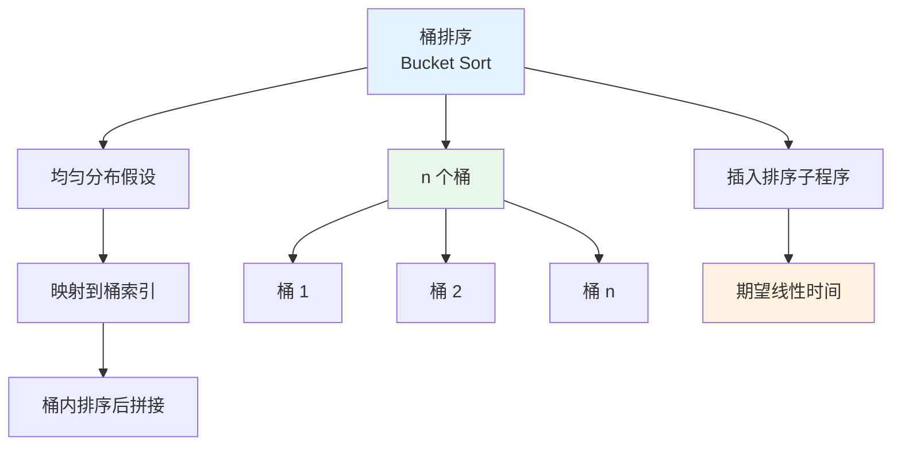

# 桶排序 - 六维内容补充


> **版本**: 1.0
> **创建日期**: 2026-04-19
> **最后更新**: 2026-04-19

> **模块**: 09-算法理论/01-算法基础
> **文档**: 桶排序 (Bucket Sort)
> **补充维度**: 概念定义、属性、关系、解释、论证、形式证明
> **对标**: CLRS 4th Ed. Chapter 8.4 / MIT 6.006 / CMU 15-451
> **深度**: 研究生级

---

## 思维导图：桶排序概念结构



---

## 一、理论基础 (Theoretical Foundation)

### 1.1 桶排序的定义

**定义 1.1.1** (桶排序) [CLRS2022, Ch.8.4]

**桶排序**（Bucket Sort）假设输入数据服从 $[0, 1)$ 区间上的均匀分布。算法将 $[0, 1)$ 划分为 $n$ 个大小相等的子区间（桶），然后将每个输入元素放入对应的桶中。接着对每个非空桶使用插入排序等算法进行排序，最后按顺序将所有桶中的元素拼接起来。

### 1.2 概率模型假设

**定义 1.2.1** (均匀分布假设)

设输入数组 $A[1..n]$ 中的每个元素都是独立地从 $[0, 1)$ 区间上的均匀分布中随机抽取的。即对任意 $x \in [0, 1)$：

$$P(A[i] \leq x) = x$$

**注**: 该假设可以推广到任意有界区间 $[a, b)$，通过线性变换 $x' = (x - a) / (b - a)$ 映射到 $[0, 1)$。

---

## 二、算法设计 (Algorithm Design)

### 2.1 桶排序伪代码

```
算法: BUCKET-SORT(A, n)
1. 令 B[0..n-1] 为 n 个新链表，初始化为空
2. for i = 1 to n
3.     将 A[i] 插入链表 B[⌊n · A[i]⌋]
4. for i = 0 to n-1
5.     使用插入排序对链表 B[i] 排序
6. 按顺序连接 B[0], B[1], ..., B[n-1]
```

### 2.2 映射函数设计

对于区间 $[a, b)$ 上的元素 $x$，桶索引计算为：

$$\text{bucket}(x) = \left\lfloor n \cdot \frac{x - a}{b - a} \right\rfloor$$

该映射保证：
- 所有元素都被分配到 $[0, n-1]$ 范围内的某个桶
- 在均匀分布假设下，每个桶的期望元素个数为 1

### 2.3 数据结构选择

| 数据结构 | 优点 | 缺点 |
|----------|------|------|
| 链表 | 插入 $O(1)$ | 缓存不友好 |
| 动态数组 (Vec) | 缓存友好 | 可能重新分配 |
| 预分配数组 | 无分配开销 | 需要知道桶大小上界 |

---

## 三、复杂度分析 (Complexity Analysis)

### 3.1 期望时间复杂度

**定理 3.1.1** (桶排序期望时间复杂度) [CLRS2022, Ch.8.4]

在输入元素独立且均匀分布于 $[0, 1)$ 的假设下，桶排序的期望时间复杂度为 $\Theta(n)$。

**证明**:

设 $n_i$ 为落入桶 $B[i]$ 中的元素个数。总运行时间为：

$$T(n) = \Theta(n) + \sum_{i=0}^{n-1} O(n_i^2)$$

取期望：

$$\begin{aligned}
E[T(n)] &= \Theta(n) + \sum_{i=0}^{n-1} O(E[n_i^2]) \\
&= \Theta(n) + n \cdot O(E[n_i^2])
\end{aligned}$$

对于均匀分布，$n_i$ 服从二项分布 $B(n, 1/n)$，因此：

$$E[n_i] = 1, \quad \text{Var}(n_i) = 1 - \frac{1}{n}$$

$$E[n_i^2] = \text{Var}(n_i) + (E[n_i])^2 = 2 - \frac{1}{n} = O(1)$$

因此：

$$E[T(n)] = \Theta(n) + n \cdot O(1) = \Theta(n)$$

$\square$

### 3.2 最坏情况时间复杂度

**定理 3.2.1** (桶排序最坏情况)

若所有元素都落入同一个桶中，则桶排序退化为对该桶的排序，最坏时间复杂度为 $O(n^2)$（使用插入排序时）。

### 3.3 空间复杂度

桶排序需要：
- $n$ 个桶的结构开销：$\Theta(n)$
- 存储所有元素的输出空间：$\Theta(n)$

总空间复杂度：$\Theta(n)$。

---

## 四、形式化验证 (Formal Verification)

### 4.1 桶排序正确性

**定理 4.1.1** (桶排序正确性)

`BUCKET-SORT(A, n)` 输出数组 $B$ 满足：
1. $B$ 是非递减有序的
2. $B$ 是 $A$ 的一个排列

### 4.2 正确性证明

**证明**:

**有序性**: 设元素 $x$ 落入桶 $B[i]$，元素 $y$ 落入桶 $B[j]$。
- 若 $i < j$，则由映射函数的定义：$x < y$（因为 $i/n \leq x < (i+1)/n \leq j/n \leq y$）
- 若 $i = j$，则由桶内排序保证 $x \leq y$

因此整个输出数组有序。

**排列性**: 算法只是将元素从 $A$ 移动到桶中，再移动到输出中，没有添加或删除任何元素。$\square$

---

## 五、应用场景 (Application Scenarios)

### 5.1 适用条件

桶排序最适合：
- 输入数据**近似均匀分布**于某个已知区间
- 数据为浮点数或有界实数
- 需要**期望线性时间**的排序

### 5.2 实际应用

| 应用场景 | 说明 |
|----------|------|
| 浮点数排序 | 科学计算中的大量浮点数 |
| 成绩分布排序 | 若成绩近似正态分布，可配合非线性映射 |
| 直方图生成 | 统计同时完成排序 |
| 外部排序 | 大文件按值范围分块后分别排序 |
| 负载均衡 | 将任务按处理能力分配到不同机器 |

### 5.3 改进策略

| 策略 | 效果 |
|------|------|
| 自适应桶数 | 根据数据分布调整桶的数量 |
| 非均匀映射 | 使用累积分布函数 (CDF) 映射 |
| 多轮桶排序 | 对大桶递归进行桶排序 |
| 结合快速排序 | 对不均衡分布先用快速排序分区 |

---

## 六、扩展变体 (Extensions and Variants)

### 6.1 自适应桶排序

**定义 6.1.1** (自适应桶排序)

通过先扫描数据估计分布，然后使用非均匀大小的桶或变换函数（如基于直方图的 CDF 逆映射），使桶排序在非均匀分布数据上也能保持较好的性能。

### 6.2 范围分桶与外部排序

在外部排序中，桶排序可用于**范围分区**：将大数据集按值范围分成多个文件（桶），每个文件小到可以放入内存单独排序，最后合并。

### 6.3 直方图排序 (Histogram Sort)

直方图排序是桶排序的并行变体，先并行计算每个桶的大小（直方图），然后并行地将元素放入预计算好偏移的桶中。

### 6.4 样本排序 (Samplesort)

样本排序结合了快速排序和桶排序：先采样确定桶边界，然后将数据分桶，最后对每个桶递归排序。它是并行排序库（如 C++ `std::parallel::sort`）中常用的算法。

---

## 参考文献 / References

1. **[CLRS2022]** Cormen, T. H., Leiserson, C. E., Rivest, R. L., & Stein, C. (2022). *Introduction to Algorithms* (4th ed.). MIT Press. Chapter 8.4.
2. **[Sedgewick2011]** Sedgewick, R., & Wayne, K. (2011). *Algorithms* (4th ed.). Addison-Wesley.

**文档版本 / Document Version**: 1.0
**对齐状态**: 已补充权威引用，与项目引用规范对齐。
---

## 知识导航

- [返回目录](README.md)

