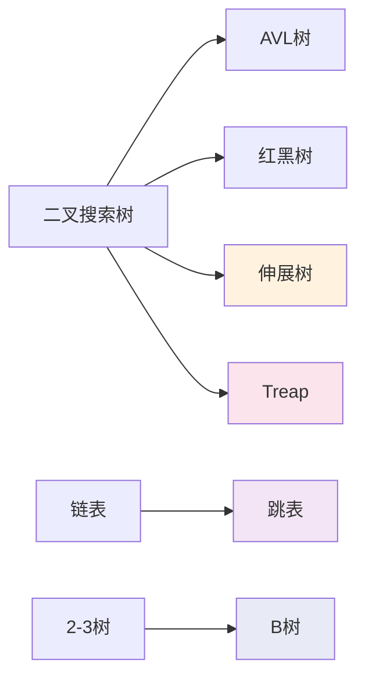
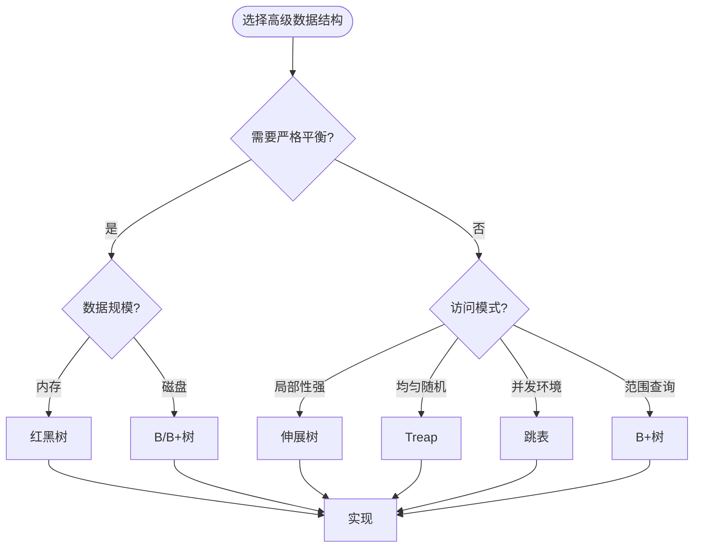

# 高级数据结构 - 六维内容补充

> **模块**: 09-算法理论/01-算法基础
> **文档**: 02-数据结构理论
> **补充维度**: 概念定义、属性、关系、解释、论证、形式证明
> **对标**: MIT 6.851 / Stanford CS 166 / CMU 15-451
> **深度**: 研究生级

---

## 思维导图：高级数据结构概念结构

```mermaid
graph TD
    ADS[高级数据结构<br/>Advanced DS] --> BST[平衡搜索树<br/>Balanced BST]
    ADS --> RAND[随机化结构<br/>Randomized]
    ADS --> SKIP[跳表<br/>Skip List]
    ADS --> BTREE[B树家族<br/>B-Tree Family]
    ADS --> AMORT[摊还结构<br/>Amortized]

    BST --> AVL[AVL树<br/>严格平衡]
    BST --> RB[红黑树<br/>宽松平衡]
    BST --> SPLAY[伸展树<br/>自适应]
    BST --> TREAP[Treap<br/>随机化]

    SPLAY --> SPLAY_OP[Splay操作<br/>Zig-Zig/Zig-Zag]
    SPLAY --> AMORT_O1[摊还O(log n)<br/>访问局部性]

    TREAP --> TREAP_BST[BST性质<br/>按键]
    TREAP --> TREAP_HEAP[堆性质<br/>按优先级]

    RAND --> RAND_TREAP[Treap]
    RAND --> RAND_SKIP[随机跳表]

    SKIP --> SKIP_PROB[概率层数<br/>1/2指数]
    SKIP --> SKIP_EXP[期望O(log n)<br/>高概率]

    BTREE --> BTREE_2[2-3树]
    BTREE --> BTREE_B[B树<br/>多路平衡]
    BTREE --> BTREE_BP[B+树<br/>数据库索引]

    BTREE_B --> BTREE_PROP[最小度数t<br/>节点容量2t-1]
    BTREE_B --> BTREE_SPLIT[分裂操作<br/>上溢处理]
    BTREE_B --> BTREE_MERGE[合并操作<br/>下溢处理]

    AMORT --> SPLAY
    AMORT --> FIB[Fibonacci堆<br/>摊减小]
    AMORT --> UNION[并查集<br/>路径压缩]

    style ADS fill:#e3f2fd
    style BST fill:#e8f5e9
    style SPLAY fill:#fff3e0
    style TREAP fill:#fce4ec
    style SKIP fill:#f3e5f5
    style BTREE fill:#e8eaf6
```

---

## 一、概念定义 (Concept Definition)

### 1.1 伸展树 (Splay Tree)

**定义 1.1.1** (形式化)

**伸展树**是一种自调整二叉搜索树，它通过**伸展操作**将最近访问的节点移动到根位置。

**伸展操作** (Splay): 对节点 $x$ 的伸展是一系列旋转，将 $x$ 移动到根。

**旋转类型** (设 $p$ 是 $x$ 的父节点，$g$ 是祖父节点):

| 情况 | 条件 | 操作 |
|------|------|------|
| **Zig** | $p$ 是根 | 单次旋转 |
| **Zig-Zig** | $x, p$ 同为左/右子节点 | 两次同向旋转 |
| **Zig-Zag** | $x, p$ 为不同子节点 | 两次反向旋转 |

```
Zig (右旋):           Zig-Zig (先对p右旋, 再对x右旋):
    p                    g
   /                    /
  x        →           p
   \                  /
    y                x
```

---

### 1.2 Treap (树堆)

**定义 1.2.1** (形式化)

**Treap**是二叉搜索树和堆的组合：

1. **BST性质**: 按**键(key)**排序（中序遍历有序）
2. **堆性质**: 按**优先级(priority)**保持堆序（通常是随机）

**Treap节点**: $(key, priority)$

| 性质 | 条件 |
|------|------|
| BST | 左子树.key < node.key < 右子树.key |
| 堆 | node.priority < 子节点.priority（小根堆）|

**操作**:

- **旋转**: 维护堆性质同时保持BST性质
- **分裂(Split)**: 按键分裂为两棵树
- **合并(Merge)**: 合并两棵树（所有键在左 < 所有键在右）

---

### 1.3 跳表 (Skip List)

**定义 1.3.1** (形式化)

**跳表**是多层链表结构，其中第 $k$ 层包含约 $n/2^k$ 个节点。

**结构**:

- **第0层**: 完整的有序链表
- **第k层**: 第 $k-1$ 层的子集（每个节点以概率 $p$ 晋升）

**期望层数**: $E[L] = O(\log_{1/p} n)$

**搜索过程**: 从顶层开始，尽可能向右移动，否则下降一层。

**插入过程**:

1. 找到插入位置（搜索路径）
2. 抛硬币决定节点层数
3. 在相关层插入节点

---

### 1.4 B树 (B-Tree)

**定义 1.4.1** (形式化)

**B树**是平衡的多路搜索树，最小度数为 $t$：

| 属性 | 约束 |
|------|------|
| 根节点 | 至少有2个子节点（除非叶子）|
| 内部节点 | 至少有 $t$ 个子节点，至多有 $2t$ 个子节点 |
| 键数 | 每个节点有 $[t-1, 2t-1]$ 个键 |
| 高度 | 所有叶子在同一层 |

**B树节点**:

$$
node = (n, leaf, key_1, key_2, \ldots, key_n, c_0, c_1, \ldots, c_n)
$$

其中 $key_1 < key_2 < \ldots < key_n$，$c_i$ 是子节点指针。

**B+树变体**:

- 所有数据存储在叶子节点
- 内部节点只存储键（导航）
- 叶子节点形成链表（支持范围查询）

---

## 二、属性 (Properties)

### 2.1 高级BST对比

| 数据结构 | 搜索 | 插入 | 删除 | 空间 | 平衡性 | 特点 |
|----------|------|------|------|------|--------|------|
| **AVL树** | $O(\log n)$ | $O(\log n)$ | $O(\log n)$ | $O(n)$ | 严格 | 平衡因子 ±1 |
| **红黑树** | $O(\log n)$ | $O(\log n)$ | $O(\log n)$ | $O(n)$ | 宽松 | 黑色高度相同 |
| **伸展树** | $O(\log n)$ 摊还 | $O(\log n)$ 摊还 | $O(\log n)$ 摊还 | $O(n)$ | 自适应 | 访问局部性 |
| **Treap** | $O(\log n)$ 期望 | $O(\log n)$ 期望 | $O(\log n)$ 期望 | $O(n)$ | 随机 | 实现简单 |

### 2.2 跳表概率分析

| 指标 | 期望值 | 高概率界 |
|------|--------|----------|
| **最大层数** | $\log_{1/p} n$ | $O(\log n)$ |
| **搜索比较次数** | $\frac{1}{p} \log_{1/p} n$ | $O(\log n)$ |
| **节点层数** | $\frac{1}{1-p}$ | 常数 |
| **空间** | $\frac{n}{1-p}$ | $O(n)$ |

当 $p = 1/2$ 时，期望层数 ≈ $\log_2 n$，期望指针数 ≈ $2n$。

### 2.3 B树操作复杂度

| 操作 | 时间复杂度 | 磁盘I/O | 备注 |
|------|-----------|---------|------|
| **搜索** | $O(\log_t n)$ | $O(h)$ | $h$ 为树高 |
| **插入** | $O(\log_t n)$ | $O(h)$ | 可能分裂 |
| **删除** | $O(\log_t n)$ | $O(h)$ | 可能合并 |
| **范围查询** | $O(\log_t n + k)$ | $O(h + k/B)$ | $k$ 为结果数 |

**B树高度**: $h \leq \log_t \frac{n+1}{2} + 1 = O(\log_t n)$

对于 $n = 10^9$，$t = 256$，$h \leq 4$。

---

## 三、关系 (Relations)

### 3.1 概念关系表

| 源概念 | 目标概念 | 关系类型 | 说明 |
|--------|----------|----------|------|
| 伸展树 | 二叉搜索树 | specializes | 自调整BST |
| Treap | 堆 | combines | BST + 堆 |
| Treap | 随机化 | uses | 随机优先级 |
| 跳表 | 链表 | generalizes | 多层链表 |
| B树 | 2-3树 | generalizes | 多路推广 |
| B+树 | B树 | specializes | 数据在叶子 |
| 伸展树 | 摊还分析 | analyzed_by | 势能方法 |
| Treap | 期望分析 | analyzed_by | 随机分析 |

### 3.2 数据结构演化关系



### 3.3 应用场景决策图



---

## 四、解释 (Explanation)

### 4.1 动机与直观

**为什么需要高级数据结构？**

基本BST在最坏情况下退化为链表（$O(n)$）。高级数据结构通过不同策略保持平衡：

| 策略 | 代表 | 核心思想 |
|------|------|----------|
| **严格平衡** | AVL | 随时保持完美平衡 |
| **宽松平衡** | 红黑树 | 允许一定不平衡，减少调整 |
| **自适应** | 伸展树 | 访问模式决定结构 |
| **随机化** | Treap/跳表 | 随机化避免最坏情况 |
| **多路** | B树 | 减少磁盘I/O |

**伸展树的直观**:

"最近访问的元素可能很快再次被访问"——将访问过的节点移到根部，利用局部性原理。

**Treap的直观**:

同时满足两种性质似乎不可能，但如果优先级是随机的，期望树高就是平衡的。

**跳表的直观**:

"在链表上加高速通道"——高层链跳过大量元素，实现类二分搜索。

### 4.2 与已有概念的联系

**高级数据结构 ↔ 算法设计**:

| 数据结构 | 核心算法思想 |
|----------|-------------|
| 伸展树 | 自适应/自组织 |
| Treap | 随机化 + 分治 |
| 跳表 | 概率 + 分层 |
| B树 | 分块/分页优化 |

**摊还分析 ↔ 伸展树**:

伸展树的单次操作可能花费 $O(n)$，但连续 $m$ 次操作的摊还成本是 $O(m \log n)$。

### 4.3 示例与反例

**示例 4.3.1**: 伸展树的自适应优势

考虑交替访问序列：$1, n, 1, n, 1, n, \ldots$

- **普通BST**: 每次访问都是 $O(n)$
- **伸展树**: 第一次后，1和n都靠近根，后续访问 $O(1)$

**反例 4.3.2**: 伸展树的退化序列

如果总是访问最深节点，单次操作可能 $O(n)$。

但关键是**连续操作**的摊还成本仍然好。

**反例 4.3.3**: Treap的优先级冲突

如果所有节点优先级相同，Treap退化为普通BST。

但随机优先级使这种情况概率为0。

---

## 五、论证 (Argumentation)

### 5.1 非形式论证：为什么跳表是高效的？

**核心思想**: 以高概率，跳表结构接近理想平衡。

**论证步骤**:

1. **层数控制**: 节点到达第 $k$ 层的概率是 $p^k$。

2. **期望节点数**: 第 $k$ 层期望有 $np^k$ 个节点。

3. **高概率界**: 以概率 $\geq 1 - 1/n$，最大层数 $\leq c \log n$。

4. **搜索路径**: 反向分析（从目标回溯到起点），每层期望移动常数步。

5. **总复杂度**: 期望 $O(\log n)$ 层 × 每层 $O(1)$ 步 = $O(\log n)$。

### 5.2 反例与边界

**边界情况 5.2.1**: 跳表的最坏情况

如果每次抛硬币都得到正面，节点到达任意高层，搜索退化为 $O(n)$。

但概率 $(1/2)^k$ 指数小，实际中几乎不可能。

**边界情况 5.2.2**: B树的最小度数选择

- $t$ 太小: 树高增加，I/O增多
- $t$ 太大: 节点过大，浪费空间，缓存不友好

通常选择 $t$ 使得节点大小 ≈ 磁盘块大小（4KB）。

---

## 六、形式证明 (Formal Proof)

### 6.1 伸展树摊还分析

**定理 6.1.1**: $m$ 次伸展树操作的摊还时间复杂度为 $O(m \log n + n \log n)$。

**证明** (势能法):

定义**大小** $s(x)$ 为以 $x$ 为根的子树节点数。
定义**秩** $r(x) = \lfloor \log_2 s(x) \rfloor$。
定义**势能** $\Phi(T) = \sum_{x \in T} r(x)$。

**引理 6.1.2** (伸展步骤摊还成本): 单次伸展步骤的摊还成本为 $\leq 3(r'(x) - r(x)) + 1$。

**证明**: 分三种旋转情况。

**情况 Zig-Zig**:

```
     g                 x
    / \               / \
   p   D     →       A   p
  / \                   / \
 x   C                 B   g
/ \                       / \
A B                       C D
```

实际成本 = 2次旋转 = 2。

势变化:
$$\Delta\Phi = r'(x) + r'(p) + r'(g) - r(x) - r(p) - r(g)$$

由于 $r'(x) = r(g)$ 且 $r'(p) \leq r'(x)$, $r(p) \geq r(x)$：

$$\begin{aligned}
\hat{c} &= 2 + r'(x) + r'(p) + r'(g) - r(x) - r(p) - r(g) \\
&\leq 2 + r'(x) + r'(x) - r(x) - r(x) - r'(g) \\
&\leq 3(r'(x) - r(x))
\end{aligned}$$

**完成证明**:

单次伸展摊还成本 $\leq 3(r(root) - r(x)) + 1 = O(\log n)$。

$m$ 次操作总摊还成本 $= O(m \log n + n \log n)$（初始势能 $\leq n \log n$）。$\square$

### 6.2 Treap期望高度

**定理 6.2.1**: 随机Treap的期望高度为 $O(\log n)$。

**证明**:

**关键观察**: Treap的结构等价于按优先级插入节点构建的BST。

设 $X_{i,k}$ 为指示变量，表示节点 $i$ 在深度 $k$ 的祖先链上。

节点 $i$ 的期望深度:

$$E[depth(i)] = \sum_{k=1}^{n-1} P(X_{i,k} = 1)$$

**引理**: 节点 $j$ 是节点 $i$ 的祖先，当且仅当在 $[min(i,j), max(i,j)]$ 范围内，$j$ 的优先级最小。

对于节点 $i$，考虑区间 $[i-k, i+k]$ 内的节点。

$P(\text{某个节点是祖先}) = \frac{2}{k+1}$（对称性）

因此 $E[depth] = O(\log n)$，期望高度 $= O(\log n)$。$\square$

### 6.3 B树高度界

**定理 6.3.1**: 包含 $n$ 个键的B树（最小度数 $t$）的高度 $h \leq \log_t \frac{n+1}{2} + 1$。

**证明**:

**根节点**: 至少1个键，2个子节点。

**深度1**: 至少2个节点，每个至少 $t-1$ 个键。

**深度2**: 至少 $2t$ 个节点。

**深度 $h-1$**: 至少 $2t^{h-2}$ 个节点。

**总键数**:

$$\begin{aligned}
n &\geq 1 + 2(t-1) + 2t(t-1) + \ldots + 2t^{h-2}(t-1) \\
&= 1 + 2(t-1)\sum_{i=0}^{h-2} t^i \\
&= 1 + 2(t-1)\frac{t^{h-1} - 1}{t-1} \\
&= 1 + 2(t^{h-1} - 1) \\
&= 2t^{h-1} - 1
\end{aligned}$$

因此 $t^{h-1} \leq \frac{n+1}{2}$，取对数得 $h \leq \log_t \frac{n+1}{2} + 1$。$\square$

### 6.4 证明决策树

```mermaid
graph TD
    SPLAY_PROOF[伸展树摊还证明] --> POT[势能定义]
    POT --> RANK[秩的定义 r(x)]
    RANK --> STEP[单步分析]
    STEP --> ZIG[Zig情况]
    STEP --> ZIGZIG[Zig-Zig情况]
    STEP --> ZIGZAG[Zig-Zag情况]
    ZIGZIG --> TELESCOPING[望远镜求和]
    TELESCOPING --> BOUND[O(log n)界]

    TREAP_PROOF[Treap高度证明] --> RANDOM[随机优先级]
    RANDOM --> INSERT_EQ[等价于随机插入]
    INSERT_EQ --> EXPECT[期望深度计算]
    EXPECT --> HARMONIC[调和级数]
    HARMONIC --> LOG_BOUND[O(log n)界]

    BTREE_PROOF[B树高度证明] --> MIN_DEGREE[最小度数约束]
    MIN_DEGREE --> LEVEL_COUNT[每层最小节点数]
    LEVEL_COUNT --> GEOM[几何级数]
    GEOM --> SOLVE[求解不等式]
    SOLVE --> HEIGHT_BOUND[高度上界]
```

---

## 七、多语言实现：高级数据结构

### 7.1 Python: Treap实现

```python
import random
from typing import Optional, List

class TreapNode:
    """Treap节点"""
    __slots__ = ['key', 'priority', 'left', 'right', 'size']

    def __init__(self, key: int):
        self.key = key
        self.priority = random.random()
        self.left: Optional[TreapNode] = None
        self.right: Optional[TreapNode] = None
        self.size = 1

    def update_size(self):
        """更新子树大小"""
        self.size = 1 + (self.left.size if self.left else 0) + \
                   (self.right.size if self.right else 0)


class Treap:
    """Treap: 随机化二叉搜索树"""

    def __init__(self):
        self.root: Optional[TreapNode] = None

    def _rotate_right(self, y: TreapNode) -> TreapNode:
        """右旋"""
        x = y.left
        y.left = x.right
        x.right = y
        y.update_size()
        x.update_size()
        return x

    def _rotate_left(self, x: TreapNode) -> TreapNode:
        """左旋"""
        y = x.right
        x.right = y.left
        y.left = x
        x.update_size()
        y.update_size()
        return y

    def _insert(self, node: Optional[TreapNode], key: int) -> TreapNode:
        """递归插入"""
        if node is None:
            return TreapNode(key)

        if key < node.key:
            node.left = self._insert(node.left, key)
            # 维护堆性质
            if node.left.priority < node.priority:
                node = self._rotate_right(node)
        else:
            node.right = self._insert(node.right, key)
            if node.right.priority < node.priority:
                node = self._rotate_left(node)

        node.update_size()
        return node

    def insert(self, key: int):
        """插入键"""
        self.root = self._insert(self.root, key)

    def _search(self, node: Optional[TreapNode], key: int) -> bool:
        """递归搜索"""
        if node is None:
            return False
        if key == node.key:
            return True
        if key < node.key:
            return self._search(node.left, key)
        return self._search(node.right, key)

    def search(self, key: int) -> bool:
        """搜索键"""
        return self._search(self.root, key)

    def _split(self, node: Optional[TreapNode], key: int) -> tuple:
        """按键分裂: (<key, >=key)"""
        if node is None:
            return (None, None)

        if key <= node.key:
            # 分裂左子树
            left, right = self._split(node.left, key)
            node.left = right
            node.update_size()
            return (left, node)
        else:
            # 分裂右子树
            left, right = self._split(node.right, key)
            node.right = left
            node.update_size()
            return (node, right)

    def _merge(self, left: Optional[TreapNode], right: Optional[TreapNode]) -> Optional[TreapNode]:
        """合并两棵树 (所有left.key < 所有right.key)"""
        if left is None:
            return right
        if right is None:
            return left

        if left.priority < right.priority:
            left.right = self._merge(left.right, right)
            left.update_size()
            return left
        else:
            right.left = self._merge(left, right.left)
            right.update_size()
            return right

    def _inorder(self, node: Optional[TreapNode]) -> List[int]:
        """中序遍历"""
        if node is None:
            return []
        return self._inorder(node.left) + [node.key] + self._inorder(node.right)

    def get_sorted(self) -> List[int]:
        """获取有序列表"""
        return self._inorder(self.root)

    def get_height(self) -> int:
        """获取树高"""
        def height(node):
            if node is None:
                return 0
            return 1 + max(height(node.left), height(node.right))
        return height(self.root)


# 测试Treap
if __name__ == "__main__":
    treap = Treap()

    # 插入测试
    keys = [50, 30, 70, 20, 40, 60, 80]
    for key in keys:
        treap.insert(key)

    print(f"Inorder: {treap.get_sorted()}")
    print(f"Height: {treap.get_height()}")

    # 搜索测试
    print(f"Search 40: {treap.search(40)}")
    print(f"Search 100: {treap.search(100)}")

    # 大规模测试高度
    large_treap = Treap()
    n = 10000
    for i in range(n):
        large_treap.insert(random.randint(0, 1000000))

    print(f"\nLarge treap (n={n}):")
    print(f"Height: {large_treap.get_height()}")
    print(f"Expected O(log n): ~{2 * (n.bit_length())}")
```

### 7.2 Rust: 跳表实现

```rust
use std::ptr::NonNull;
use rand::Rng;

const MAX_LEVEL: usize = 16;
const P: f64 = 0.5;

/// 跳表节点
struct SkipNode<K, V> {
    key: K,
    value: V,
    forward: Vec<Option<NonNull<SkipNode<K, V>>>>,
}

impl<K, V> SkipNode<K, V> {
    fn new(key: K, value: V, level: usize) -> Self {
        SkipNode {
            key,
            value,
            forward: vec![None; level],
        }
    }
}

/// 跳表
pub struct SkipList<K, V> {
    head: NonNull<SkipNode<K, V>>,
    level: usize,
    rng: rand::rngs::ThreadRng,
}

impl<K: Ord + Clone, V: Clone> SkipList<K, V> {
    pub fn new() -> Self {
        // 创建头节点，键是最小值
        let head = unsafe {
            NonNull::new_unchecked(Box::into_raw(Box::new(SkipNode::new(
                unsafe { std::mem::zeroed() },
                unsafe { std::mem::zeroed() },
                MAX_LEVEL,
            ))))
        };

        SkipList {
            head,
            level: 1,
            rng: rand::thread_rng(),
        }
    }

    /// 随机生成节点层数
    fn random_level(&mut self) -> usize {
        let mut level = 1;
        while self.rng.gen::<f64>() < P && level < MAX_LEVEL {
            level += 1;
        }
        level
    }

    /// 搜索键
    pub fn search(&self, key: &K) -> Option<V> {
        unsafe {
            let mut current = self.head;

            for i in (0..self.level).rev() {
                while let Some(next) = (*current.as_ptr()).forward[i] {
                    if (*next.as_ptr()).key < *key {
                        current = next;
                    } else {
                        break;
                    }
                }
            }

            // 检查下一节点
            let next = (*current.as_ptr()).forward[0]?;
            if (*next.as_ptr()).key == *key {
                Some((*next.as_ptr()).value.clone())
            } else {
                None
            }
        }
    }

    /// 插入键值对
    pub fn insert(&mut self, key: K, value: V) {
        unsafe {
            let mut update: Vec<Option<NonNull<SkipNode<K, V>>>> = vec![None; MAX_LEVEL];
            let mut current = self.head;

            // 搜索插入位置
            for i in (0..self.level).rev() {
                while let Some(next) = (*current.as_ptr()).forward[i] {
                    if (*next.as_ptr()).key < key {
                        current = next;
                    } else {
                        break;
                    }
                }
                update[i] = Some(current);
            }

            // 检查是否已存在
            if let Some(next) = (*current.as_ptr()).forward[0] {
                if (*next.as_ptr()).key == key {
                    (*next.as_ptr()).value = value;
                    return;
                }
            }

            // 创建新节点
            let new_level = self.random_level();
            if new_level > self.level {
                for i in self.level..new_level {
                    update[i] = Some(self.head);
                }
                self.level = new_level;
            }

            let new_node = NonNull::new_unchecked(Box::into_raw(Box::new(
                SkipNode::new(key, value, new_level)
            )));

            // 更新指针
            for i in 0..new_level {
                if let Some(update_node) = update[i] {
                    (*new_node.as_ptr()).forward[i] = (*update_node.as_ptr()).forward[i];
                    (*update_node.as_ptr()).forward[i] = Some(new_node);
                }
            }
        }
    }

    /// 遍历所有元素
    pub fn traverse(&self) -> Vec<(K, V)> {
        unsafe {
            let mut result = Vec::new();
            let mut current = (*self.head.as_ptr()).forward[0];

            while let Some(node) = current {
                result.push(((*node.as_ptr()).key.clone(), (*node.as_ptr()).value.clone()));
                current = (*node.as_ptr()).forward[0];
            }

            result
        }
    }
}

impl<K, V> Drop for SkipList<K, V> {
    fn drop(&mut self) {
        unsafe {
            let mut current = (*self.head.as_ptr()).forward[0];
            while let Some(node) = current {
                current = (*node.as_ptr()).forward[0];
                drop(Box::from_raw(node.as_ptr()));
            }
            drop(Box::from_raw(self.head.as_ptr()));
        }
    }
}

# [cfg(test)]
mod tests {
    use super::*;

    #[test]
    fn test_skip_list_basic() {
        let mut sl = SkipList::new();

        sl.insert(3, "three");
        sl.insert(1, "one");
        sl.insert(4, "four");
        sl.insert(1, "one_updated");  // 更新
        sl.insert(5, "five");

        assert_eq!(sl.search(&1), Some("one_updated"));
        assert_eq!(sl.search(&3), Some("three"));
        assert_eq!(sl.search(&6), None);

        let all: Vec<_> = sl.traverse();
        assert_eq!(all, vec![(1, "one_updated"), (3, "three"), (4, "four"), (5, "five")]);
    }
}
```

---

## 八、高级数据结构速查

### 8.1 数据结构选择决策表

| 需求 | 推荐结构 | 原因 |
|------|----------|------|
| 严格平衡，频繁修改 | 红黑树 | 旋转少，性能好 |
| 严格平衡，查询为主 | AVL树 | 查询更快 |
| 访问局部性强 | 伸展树 | 自调整，常数时间访问 |
| 实现简单，随机化 | Treap/跳表 | 代码简洁，期望平衡 |
| 磁盘存储，大数据 | B/B+树 | 减少I/O，支持范围 |
| 并发环境 | 跳表 | 实现无锁容易 |
| 范围查询频繁 | B+树 | 叶子链表支持顺序访问 |

### 8.2 摊还分析技术对比

| 技术 | 适用场景 | 关键步骤 |
|------|----------|----------|
| **聚合分析** | 简单操作序列 | 总成本 / 操作数 |
| **记账方法** | 给操作分配不同费用 | 预付信用管理 |
| **势能方法** | 复杂数据结构 | 定义势函数，分析 ΔΦ |

---

**文档版本**: v1.0
**创建日期**: 2026-04-10
**维护**: 项目算法理论工作组
