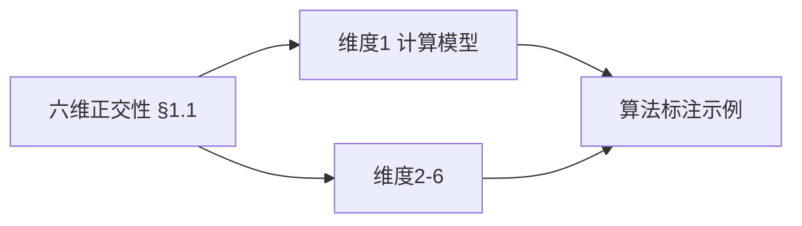
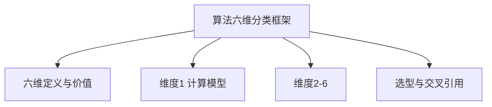
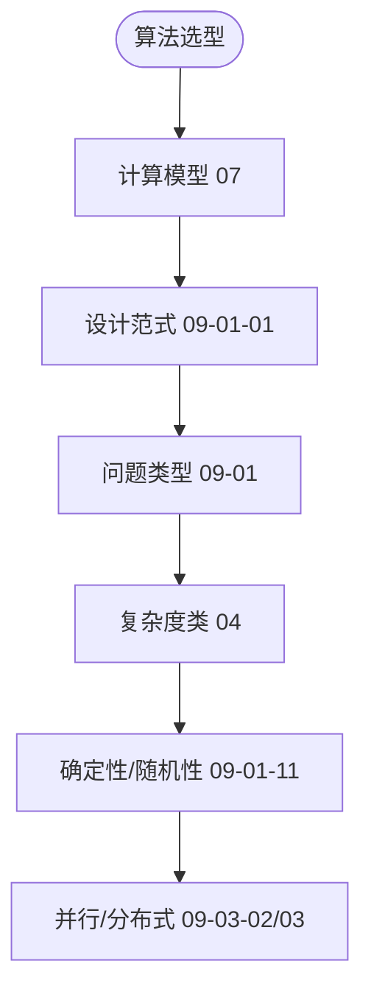
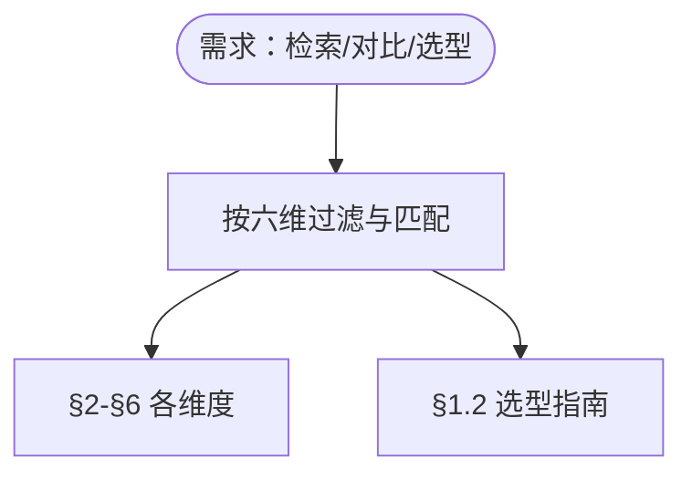

# 算法六维分类框架

> 📊 **项目全面梳理**：详细的项目结构、模块详解和学习路径，请参阅 [`项目全面梳理-2025.md`](../../项目全面梳理-2025.md)
> **项目导航与对标**：[项目扩展与持续推进任务编排](../../项目扩展与持续推进任务编排.md)、[国际课程对标表](../../国际课程对标表.md)
> **文档版本**: v1.0
> **最后更新**: 2025年1月11日
> **对齐状态**: ✅ 已对齐 Wikipedia 标准、著名大学课程、经典教材

## 概述

算法六维分类框架是从形式科学（数学、逻辑、信息论）视角对算法进行系统化分类的理论框架。该框架将算法按照六个正交维度进行分类，形成完整的算法知识体系。

### 国际课程参考 / International Course References

算法分类与设计范式可与 **MIT 6.006/6.046**、**CMU 15-451**、**Stanford CS 161**、**Berkeley CS 170** 等课程对标。课程与模块映射见 [国际课程对标表](../../国际课程对标表.md)。

## 目录

- [算法六维分类框架](#算法六维分类框架)
  - [概述](#概述)
    - [国际课程参考 / International Course References](#国际课程参考--international-course-references)
  - [目录](#目录)
  - [1. 分类框架总览](#1-分类框架总览)
    - [1.1 六维正交性](#11-六维正交性)
    - [1.2 分类框架的价值](#12-分类框架的价值)
    - [1.3 内容补充与思维表征 / Content Supplement and Thinking Representation](#13-内容补充与思维表征--content-supplement-and-thinking-representation)
      - [解释与直观 / Explanation and Intuition](#解释与直观--explanation-and-intuition)
      - [概念属性表 / Concept Attribute Table](#概念属性表--concept-attribute-table)
      - [概念关系 / Concept Relations](#概念关系--concept-relations)
      - [概念依赖图 / Concept Dependency Graph](#概念依赖图--concept-dependency-graph)
      - [论证与证明衔接 / Argumentation and Proof Link](#论证与证明衔接--argumentation-and-proof-link)
      - [思维导图：本章概念结构 / Mind Map](#思维导图本章概念结构--mind-map)
      - [多维矩阵：六维取值与代表算法 / Multi-Dimensional Comparison](#多维矩阵六维取值与代表算法--multi-dimensional-comparison)
      - [决策树：按六维选型 / Decision Tree](#决策树按六维选型--decision-tree)
      - [公理定理推理证明决策树 / Axiom-Theorem-Proof Tree](#公理定理推理证明决策树--axiom-theorem-proof-tree)
      - [应用决策建模树 / Application Decision Modeling Tree](#应用决策建模树--application-decision-modeling-tree)
  - [2. 维度一：计算模型](#2-维度一计算模型)
    - [2.1 计算模型分类](#21-计算模型分类)
    - [2.2 计算模型等价性](#22-计算模型等价性)
    - [2.3 复杂度等价性](#23-复杂度等价性)
  - [3. 维度二：设计范式](#3-维度二设计范式)
    - [3.1 设计范式分类](#31-设计范式分类)
    - [3.2 关键形式化定理](#32-关键形式化定理)
      - [3.2.1 Master 定理](#321-master-定理)
      - [3.2.2 贪心选择性定理](#322-贪心选择性定理)
      - [3.2.3 动态规划最优子结构](#323-动态规划最优子结构)
  - [4. 维度三：问题类型](#4-维度三问题类型)
    - [4.1 问题类型分类](#41-问题类型分类)
    - [4.2 信息论下界](#42-信息论下界)
  - [5. 维度四：复杂度类](#5-维度四复杂度类)
    - [5.1 复杂度类分类](#51-复杂度类分类)
    - [5.2 关键定理](#52-关键定理)
      - [5.2.1 Cook-Levin 定理](#521-cook-levin-定理)
      - [5.2.2 Savitch 定理](#522-savitch-定理)
      - [5.2.3 时间层级定理](#523-时间层级定理)
  - [6. 维度五：确定性 vs 随机性](#6-维度五确定性-vs-随机性)
    - [6.1 确定性分类](#61-确定性分类)
    - [6.2 随机化算法的优势](#62-随机化算法的优势)
    - [6.3 错误放大技术](#63-错误放大技术)
  - [7. 维度六：并行/分布式特性](#7-维度六并行分布式特性)
    - [7.1 并行/分布式分类](#71-并行分布式分类)
    - [7.2 并行算法分析](#72-并行算法分析)
      - [7.2.1 PRAM 模型](#721-pram-模型)
      - [7.2.2 Brent's 定理](#722-brents-定理)
  - [8. 多维矩阵分析](#8-多维矩阵分析)
    - [8.1 算法多维矩阵示例](#81-算法多维矩阵示例)
    - [8.2 矩阵使用指南](#82-矩阵使用指南)
  - [9. 应用场景](#9-应用场景)
    - [9.1 教学场景](#91-教学场景)
    - [9.2 科研场景](#92-科研场景)
    - [9.3 工程场景](#93-工程场景)
  - [10. 参考文献](#10-参考文献)
    - [10.1 经典教材](#101-经典教材)
    - [10.2 著名大学课程](#102-著名大学课程)
    - [10.3 Wikipedia 参考](#103-wikipedia-参考)
  - [11. 与项目结构主题的对齐](#11-与项目结构主题的对齐)
    - [11.1 相关文档](#111-相关文档)
    - [11.2 知识体系位置](#112-知识体系位置)
    - [11.3 VIEW文件夹相关文档](#113-view文件夹相关文档)

---

## 1. 分类框架总览

### 1.1 六维正交性

算法的六维分类框架基于以下六个**正交维度**：

| 维度 | 说明 | 关键特征 |
|------|------|----------|
| **① 计算模型** | 算法运行的计算环境 | 图灵机、λ演算、RAM、PRAM等 |
| **② 设计范式** | 算法的设计方法论 | 分治、动态规划、贪心等 |
| **③ 问题类型** | 算法解决的具体问题 | 排序、搜索、图论等 |
| **④ 复杂度类** | 算法的复杂度类别 | P、NP、PSPACE等 |
| **⑤ 确定性 vs 随机性** | 算法的随机性特征 | 确定性、非确定性、随机化 |
| **⑥ 并行/分布式特性** | 算法的并行化特征 | 串行、并行、分布式、量子 |

> **正交性说明**：上述六个维度是 **正交** 的——同一个算法可以在每个维度上都有对应的标记。例如，**并行快速排序**属于：计算模型 = PRAM，设计范式 = 分治，问题类型 = 排序，复杂度类 = P，确定性 = 确定，特性 = 并行。

### 1.2 分类框架的价值

1. **系统化组织**：将算法知识按照统一框架组织
2. **交叉引用**：支持多维度的算法检索和对比
3. **理论支撑**：每个维度都有对应的形式化理论
4. **实践指导**：帮助算法设计和选型

### 1.3 内容补充与思维表征 / Content Supplement and Thinking Representation

> 本节按 [内容补充与思维表征全面计划方案](../../内容补充与思维表征全面计划方案.md) **只补充、不删除**。标准见 [内容补充标准](../../内容补充标准-概念定义属性关系解释论证形式证明.md)、[思维表征模板集](../../思维表征模板集.md)。

#### 解释与直观 / Explanation and Intuition

六维分类框架用计算模型、设计范式、问题类型、复杂度类、确定性/随机性、并行/分布式六个正交维度系统组织算法知识，支持交叉引用与选型；与 04-复杂度类、07-计算模型、09-01 各专题一致。

#### 概念属性表 / Concept Attribute Table

| 维度 | 含义 | 依据文档 | 典型取值 |
|------|------|----------|----------|
| ①计算模型 | 计算抽象 | 07-计算模型 | 图灵机/随机存取/量子等 |
| ②设计范式 | 算法范式 | 09-01-01 | 分治/DP/贪心/回溯等 |
| ③问题类型 | 问题类 | 09-01 各专题 | 排序/搜索/图/优化等 |
| ④复杂度类 | 时间/空间类 | 04-复杂度 | P/NP/BQP 等 |
| ⑤确定性/随机性 | 随机与否 | 09-01-11 | 确定性/随机 |
| ⑥并行/分布式 | 执行模型 | 09-03-02/03 | 串行/并行/分布式 |

#### 概念关系 / Concept Relations

| 源概念 | 目标概念 | 关系类型 | 说明 |
|--------|----------|----------|------|
| 六维框架 | 04-复杂度类、07-计算模型 | depends_on | 维度依据 |
| 六维框架 | 09-01-01、09-01-02 | depends_on | 设计范式与结构 |
| 六维框架 | 09-01 各专题 | applies_to | 每专题可标注六维 |
| 六维框架 | 23-数据结构多维分析 | 对照 | 数据结构六维 |

#### 概念依赖图 / Concept Dependency Graph

#### 论证与证明衔接 / Argumentation and Proof Link

正交性说明见 §1.1；各维度形式化依据见 04、07、09-01 对应文档；选型由各维度组合决定（见 §1.2）。

#### 思维导图：本章概念结构 / Mind Map

#### 多维矩阵：六维取值与代表算法 / Multi-Dimensional Comparison

| 维度 | 取值示例 | 代表算法 |
|------|----------|----------|
| 计算模型 | 图灵机/随机存取/量子 | 见 07 |
| 设计范式 | 分治/DP/贪心/回溯 | 见 09-01-01 |
| 问题类型 | 排序/搜索/图/优化 | 见 09-01 各专题 |
| 复杂度类 | P/NP/BQP | 见 04 |
| 确定性/随机性 | 确定性/随机 | 见 09-01-11 |
| 并行/分布式 | 串行/并行/分布式 | 见 09-03-02/03 |

#### 决策树：按六维选型 / Decision Tree

#### 公理定理推理证明决策树 / Axiom-Theorem-Proof Tree

#### 应用决策建模树 / Application Decision Modeling Tree

---

## 2. 维度一：计算模型

### 2.1 计算模型分类

| 计算模型 | 特征 | 形式理论依据 | 代表算法 |
|----------|------|--------------|----------|
| **图灵机（TM）** | 状态转移、读写头、无限带 | Church-Turing 等价 | 任意可计算函数 |
| **λ演算** | 函数抽象、β归约 | Church-Turing 等价 | 函数式编程 |
| **RAM / PRAM** | 随机访问、并行处理 | 模型转换定理 | 实际算法分析、并行算法 |
| **有限自动机 / 正则表达式** | 状态有限、正则语言 | 形式语言理论 | 文本匹配、词法分析 |
| **布尔电路** | 组合逻辑、并行计算 | 电路复杂度理论 | 并行算法、硬件实现 |

### 2.2 计算模型等价性

**定理**：主要计算模型（图灵机、λ演算、μ递归函数、RAM）在可计算性上等价。

**证明要点**：参见 `07-计算模型/08-计算模型等价性理论.md`

### 2.3 复杂度等价性

**定理**：在多项式时间层级，RAM 与图灵机等价，这为 **P、NP** 等复杂度类的统一提供理论支撑。

---

## 3. 维度二：设计范式

### 3.1 设计范式分类

| 设计范式 | 特征 | 形式理论依据 | 代表算法 |
|----------|------|--------------|----------|
| **递归 / 迭代** | 递归调用、循环结构 | 递归方程、循环不变式 | 归并排序、快速幂 |
| **分治（Divide-and-Conquer）** | 问题分解、子问题求解 | Master 定理、递归树 | 快速排序、Strassen 矩阵乘法 |
| **动态规划（DP）** | 最优子结构、重叠子问题 | 状态转移方程、Bellman 最优性原理 | 最短路（Bellman-Ford）、背包问题 |
| **贪心（Greedy）** | 局部最优选择 | 贪心选择性定理、Cut Property | 最小生成树（Kruskal、Prim） |
| **随机化（Randomized）** | 随机选择、概率分析 | Chernoff Bound、错误放大 | Miller-Rabin 素性检测 |
| **近似 / 启发式** | 近似解、性能保证 | 近似比分析 | 2-近似 Vertex-Cover |
| **并行 / 分布式** | 并行处理、分布式计算 | PRAM 模型、Brent's 定理 | MapReduce、Fork-Join |

### 3.2 关键形式化定理

#### 3.2.1 Master 定理

**定理**：若递归关系满足 `T(n) = a·T(n/b) + f(n)`（`a ≥ 1, b > 1`），则：

| 情形 | 条件 | 结论 |
|------|------|------|
| 1 | `f(n) = O(n^{log_b a - ε})`（ε>0） | `T(n) = Θ(n^{log_b a})` |
| 2 | `f(n) = Θ(n^{log_b a}·log^k n)` | `T(n) = Θ(n^{log_b a}·log^{k+1} n)` |
| 3 | `f(n) = Ω(n^{log_b a + ε})` 且 `a·f(n/b) ≤ c·f(n)`（c<1）| `T(n) = Θ(f(n))` |

#### 3.2.2 贪心选择性定理

**定理**：若问题满足 **贪心选择性** 与 **最优子结构**，则贪心算法可产生全局最优解。

**应用**：最小生成树的 Kruskal 和 Prim 算法。

#### 3.2.3 动态规划最优子结构

**定理**：动态规划的正确性依赖于 **最优子结构** 与 **无后效性**。

**应用**：Bellman-Ford 最短路径算法。

---

## 4. 维度三：问题类型

### 4.1 问题类型分类

| 问题类型 | 特征 | 形式理论依据 | 代表算法 |
|----------|------|--------------|----------|
| **排序** | 元素重排 | 信息论下界（`Ω(n log n)`） | 快速排序、堆排序、计数排序 |
| **搜索** | 元素查找 | 信息论下界（`Ω(log n)`） | 二分搜索、哈希查找 |
| **图论** | 图结构操作 | 图论、网络流理论 | Dijkstra、Bellman-Ford、Kruskal、最大流 |
| **数值/线性代数** | 数值计算 | 数值分析、误差分析 | 高斯消元、FFT、共轭梯度 |
| **组合优化** | 优化问题 | 运筹学、NP 完全性理论 | 背包问题、旅行商问题（TSP） |
| **机器学习** | 模式识别 | 统计学习理论（VC 维、PAC） | 线性回归、SVM、深度神经网络 |
| **密码学** | 信息安全 | 数论、代数几何、复杂度假设 | RSA、ECC、Diffie-Hellman |
| **形式验证** | 程序正确性 | Hoare 逻辑、模型检查 | Hoare 逻辑、模型检查 |

### 4.2 信息论下界

**定理**：许多问题类型都有对应的信息论下界：

- **排序**：`Ω(n log n)` 比较（决策树模型）
- **搜索**：`Ω(log n)` 比较（二分查找下界）
- **数据压缩**：`L ≥ H(X)`（Shannon 第一本源编码定理）

---

## 5. 维度四：复杂度类

### 5.1 复杂度类分类

| 复杂度类 | 特征 | 形式理论依据 | 代表问题 |
|----------|------|--------------|----------|
| **P（多项式时间）** | 多项式时间可解 | 时间复杂度理论 | 排序、最短路（Dijkstra） |
| **NP** | 非确定性多项式时间 | Cook-Levin 定理 | SAT、旅行商（判定版） |
| **NP-Complete** | NP 完全问题 | 归约技术 | 3-SAT、顶点覆盖、子集和 |
| **NP-Hard** | 至少和 NP-Complete 一样难 | 归约技术 | 整数规划的最优解 |
| **PSPACE** | 多项式空间 | Savitch 定理 | QBF、图灵机的空间限制 |
| **EXP / EXPSPACE** | 指数时间/空间 | 时间层级定理 | 某些递归函数的求值 |
| **BPP / RP / ZPP** | 随机化多项式时间 | 概率论、错误放大 | 随机化图着色、Miller-Rabin |
| **FPT（固定参数可判定）** | 参数化算法 | 参数化复杂度理论 | 参数化的 k-路径 |

### 5.2 关键定理

#### 5.2.1 Cook-Levin 定理

**定理**：SAT 是 NP-Complete 问题。

**意义**：为 NP-Complete 分类提供统一标准。

#### 5.2.2 Savitch 定理

**定理**：`NSPACE(s(n)) ⊆ DSPACE(s(n)²)`

**意义**：说明 PSPACE 与 NPSPACE 幂等。

#### 5.2.3 时间层级定理

**定理**：若 `f(n)` 可增长快于 `g(n)·log g(n)`，则 `DTIME(f(n)) ⊊ DTIME(g(n))`。

**意义**：确保更高时间资源能解决严格更强的问题。

---

## 6. 维度五：确定性 vs 随机性

### 6.1 确定性分类

| 类型 | 特征 | 形式理论依据 | 代表算法 |
|------|------|--------------|----------|
| **确定性（Deterministic）** | 相同输入总是相同输出 | 确定性图灵机 | Dijkstra、快速排序 |
| **非确定性（Nondeterministic）** | 存在选择分支 | 非确定性图灵机 | NP 验证、SAT 求解 |
| **随机化（Monte-Carlo / Las-Vegas）** | 使用随机数、概率分析 | 概率论、Chernoff Bound | Miller-Rabin、随机化快速排序 |

### 6.2 随机化算法的优势

**定理**：随机化往往可以突破 **确定性信息下界**：

- **哈希表**：把 `Θ(log n)` 期望查询降为 `Θ(1)`
- **Bloom Filter**：常数时间成员测试（有误报）
- **随机化快速排序**：期望 `O(n log n)`，避免最坏情况

### 6.3 错误放大技术

**定理**：若单次 Monte-Carlo 算法错误概率 ≤ 1/4，则执行独立重复 `t` 次并取多数票，错误概率 ≤ `e^{-t/12}`。

**应用**：BPP 类算法的实用性保障。

---

## 7. 维度六：并行/分布式特性

### 7.1 并行/分布式分类

| 类型 | 特征 | 形式理论依据 | 代表算法 |
|------|------|--------------|----------|
| **串行** | 单线程执行 | 串行算法理论 | 单线程 QuickSort |
| **并行（多核、GPU）** | 多处理器并行 | PRAM 模型、Brent's 定理 | 并行归并排序、GPU 矩阵乘法 |
| **分布式（集群、云）** | 多机器协作 | MapReduce 模型、通信复杂度 | MapReduce 词频统计 |
| **量子** | 量子并行性 | 量子计算模型（BQP） | Shor 算法、Grover 搜索 |

### 7.2 并行算法分析

#### 7.2.1 PRAM 模型

**定义**：PRAM（Parallel Random Access Machine）是共享内存的并行计算模型。

**复杂度度量**：

- **工作量 W**：总操作数
- **深度 D**：最长依赖链

#### 7.2.2 Brent's 定理

**定理**：设并行算法在无限处理器下的工作量 `W` 和深度 `D`，则在 `p` 台处理器上执行的时间 `T_p` 满足

`T_p ≤ D + ⌈W/p⌉`

**意义**：说明并行加速受工作与深度双重限制。

---

## 8. 多维矩阵分析

### 8.1 算法多维矩阵示例

| # | 算法族 | 计算模型 | 设计范式 | 典型问题 | 代表算法 | 最坏时间复杂度 | 所属复杂度类 | 关键证明技术 |
|---|--------|----------|----------|----------|----------|----------------|--------------|---------------|
| 1 | 排序 | TM / RAM | 分治 | 排序 | 快速排序、归并排序 | `O(n log n)`（最坏）| P | **Master 定理**、**比较决策树下界** (`Ω(n log n)`) |
| 2 | 大规模矩阵乘法 | PRAM | 并行分治 | 矩阵乘法 | 并行 Strassen | `O(n^{log₂7}/p + log n)` | P | **Brent's Theorem**、**工作-深度模型** |
| 3 | 图最短路 | TM / RAM | 动态规划 | 单源最短路（负权） | Bellman-Ford | `O(V·E)` | P | **最优子结构**、**归纳证明** |
| 4 | 最小生成树 | TM / RAM | 贪心 | 最小生成树 | Kruskal、Prim | `O(E log V)` | P | **Cut Property**、**交换论证** |
| 5 | 素数检测 | TM | 随机化 | 素性检测 | Miller-Rabin | `O(k·log³ n)` (Monte-Carlo) | BPP / RP | **Chernoff Bound**、**错误放大** |
| 6 | 近似组合优化 | TM | 近似/启发式 | Vertex-Cover、TSP | 2-近似 Vertex-Cover、Christofides | `O(E)` / `O(n³)` | NP-Complete (近似) | **近似比证明**、**双重匹配** |
| 7 | NP-Complete 归约 | TM | 归约 | 3-SAT → Vertex-Cover | 归约构造 | 多项式 `O(\|Φ\|)` | NP-Complete | **多项式归约**、**结构保留** |
| 8 | 随机化并行算法 | PRAM | 随机化 + 并行 | 大数据排序 | Parallel Sample Sort | `O(log n)` depth, `O(n log n)` work | BPP (并行) | **Chernoff + Brent** |
| 9 | 量子因式分解 | 量子图灵机 | 量子算法 | 整数因式分解 | Shor | `O((log n)³)` 量子时间 | BQP ⊂? EXP | **量子 Fourier 变换**、**周期找寻** |
| 10 | 参数化算法 | TM | 参数化 | k-路径 | Bounded-search tree | `O(2^{k}·n)` | FPT | **核化**、**参数化归约** |

### 8.2 矩阵使用指南

1. **定位需求**：根据问题类型和复杂度要求定位算法
2. **对比权衡**：比较不同算法在多个维度上的表现
3. **理论支撑**：查看关键证明技术，理解算法正确性

---

## 9. 应用场景

### 9.1 教学场景

**操作步骤**：

1. 以六维框架为章节结构
2. 每章挑选代表算法作案例
3. 用思维导图展示章节关联

**预期收益**：学生能够从宏观到微观系统化理解算法。

### 9.2 科研场景

**操作步骤**：

1. 用多维矩阵列举已有工作在每个维度的分布
2. 标记空白/热点（如量子-DP、分布式-近似）
3. 发现研究空缺，制定创新点

**预期收益**：快速发现研究空缺，制定创新点。

### 9.3 工程场景

**操作步骤**：

1. 为项目需求映射到问题类型与复杂度类
2. 依据设计范式选取合适的计算模型与实现技术
3. 明确技术选型与性能预估

**预期收益**：明确技术选型与性能预估。

---

## 10. 参考文献

### 10.1 经典教材

1. **《算法导论》（Introduction to Algorithms）** - Thomas H. Cormen, Charles E. Leiserson, Ronald L. Rivest, Clifford Stein
   - ISBN: 978-0262046305
   - 第 4 章：分治策略、Master 定理
   - 第 15 章：动态规划
   - 第 16 章：贪心算法
   - 第 34 章：NP 完全性

2. **《计算理论导论》（Introduction to the Theory of Computation）** - Michael Sipser
   - ISBN: 978-1133187790
   - 第 7-8 章：时间复杂度、空间复杂度
   - 第 9 章：难解性

### 10.2 著名大学课程

1. **MIT 6.006 - Introduction to Algorithms**
   - 参考资源：<https://ocw.mit.edu/courses/6-006-introduction-to-algorithms-fall-2011/>
   - 核心内容：Master 定理、贪心选择性、动态规划

2. **Stanford CS161 - Design and Analysis of Algorithms**
   - 参考资源：<https://web.stanford.edu/class/cs161/>
   - 核心内容：随机化算法、NP 完全性、近似算法

3. **CMU 15-451 - Algorithm Design and Analysis**
   - 核心内容：并行算法、参数化算法

### 10.3 Wikipedia 参考

- [Algorithm](https://en.wikipedia.org/wiki/Algorithm)
- [Algorithm Paradigm](https://en.wikipedia.org/wiki/Algorithm_paradigm)
- [Computational Complexity Theory](https://en.wikipedia.org/wiki/Computational_complexity_theory)
- [Church-Turing Thesis](https://en.wikipedia.org/wiki/Church%E2%80%93Turing_thesis)

---

## 11. 与项目结构主题的对齐

### 11.1 相关文档

- `09-算法理论/01-算法基础/01-算法设计理论.md` - 算法设计理论
- `09-算法理论/01-算法基础/02-数据结构理论.md` - 数据结构理论
- `09-算法理论/01-算法基础/23-数据结构多维分析.md` - 数据结构多维分析
- `07-计算模型/08-计算模型等价性理论.md` - 计算模型等价性
- `04-算法复杂度/04-复杂度类.md` - 复杂度类理论
- 相关内容已整合到本文档（原 `view/算法全景梳理-2025-01-11.md` §2）

### 11.2 知识体系位置

本文档属于 **09-算法理论/01-算法基础** 模块，是算法分类体系的核心文档，为其他算法理论文档提供分类框架。

### 11.3 VIEW文件夹相关文档

- 相关内容已整合到本文档（原 `view/算法全景梳理-2025-01-11.md` §2）

---

**文档版本**: v1.0
**最后更新**: 2025年1月11日
**对齐状态**: ✅ 已对齐 Wikipedia 标准、著名大学课程、经典教材
