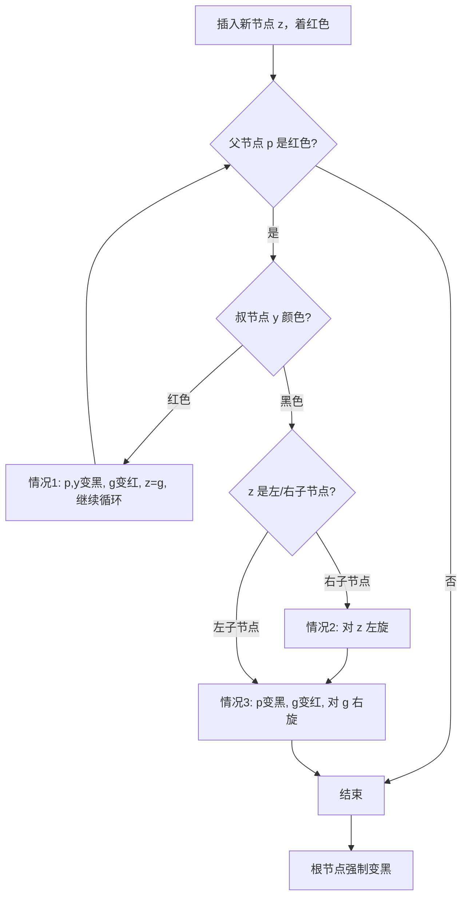

> 📊 **项目全面梳理**：详细的项目结构、模块详解和学习路径，请参阅 [`项目全面梳理-2025.md`](../../项目全面梳理-2025.md)
> **项目导航与对标**：[项目扩展与持续推进任务编排](../../项目扩展与持续推进任务编排.md)、[国际课程对标表](../../国际课程对标表.md)

## 9.1.27 红黑树 / Red-Black Tree

### 摘要 / Executive Summary

红黑树（Red-Black Tree）是一种自平衡二叉搜索树，通过在节点上附加颜色属性（红或黑）并维护五条不变性质，保证在最坏情况下查找、插入与删除操作的时间复杂度均为 $O(\log n)$。相较于 AVL 树的严格高度平衡，红黑树采用更宽松的平衡策略，使得插入和删除所需的旋转次数更少，因而在频繁更新的场景中具有更低的常数开销。本文档系统阐述红黑树的理论基础、插入与删除算法（含旋转与重新着色）、复杂度分析、形式化正确性论证，以及与 AVL 树的对比。文档对齐 CLRS 第 13 章 [CLRS2022] 与项目 Rust 实现 `examples/algorithms/src/red_black_tree.rs`。

### 国际课程参考 / International Course References

- **MIT 6.006**: Introduction to Algorithms — Balanced Search Trees, Red-Black Trees
- **Stanford CS 166**: Data Structures — Red-Black Trees, 2-3-4 Trees, Left-Leaning Red-Black Trees
- **Princeton COS 226**: Algorithms and Data Structures — Balanced Search Trees

---

## 目录 / Table of Contents

- [9.1.27 红黑树 / Red-Black Tree](#9127-红黑树--red-black-tree)
  - [摘要 / Executive Summary](#摘要--executive-summary)
  - [国际课程参考 / International Course References](#国际课程参考--international-course-references)
- [目录 / Table of Contents](#目录--table-of-contents)
- [1. 理论基础](#1-理论基础)
  - [1.1 定义与五个性质](#11-定义与五个性质)
  - [1.2 黑高与高度上界](#12-黑高与高度上界)
  - [1.3 与 2-3-4 树的等价关系](#13-与-2-3-4-树的等价关系)
- [2. 算法设计](#2-算法设计)
  - [2.1 基本操作框架](#21-基本操作框架)
  - [2.2 插入算法](#22-插入算法)
  - [2.3 删除算法](#23-删除算法)
  - [2.4 Rust 实现映射](#24-rust-实现映射)
- [3. 复杂度分析](#3-复杂度分析)
- [4. 形式化验证](#4-形式化验证)
  - [4.1 不变式归纳](#41-不变式归纳)
  - [4.2 插入正确性论证](#42-插入正确性论证)
  - [4.3 删除正确性论证](#43-删除正确性论证)
- [5. 应用场景](#5-应用场景)
- [6. 扩展变体](#6-扩展变体)
  - [6.1 与 AVL 树的系统对比](#61-与-avl-树的系统对比)
- [参考文献 / References](#参考文献--references)
- [**Rust 实现引用**: `examples/algorithms/src/red_black_tree.rs`](#rust-实现引用-examplesalgorithmssrcred_black_treers)
- [知识导航](#知识导航)
- [学习目标](#学习目标)

---

## 1. 理论基础

### 1.1 定义与五个性质

**定义 1.1.1** (红黑树 [CLRS2022])

红黑树是一棵满足以下五条性质的二叉搜索树，其中每个节点包含一个颜色属性 $color \in \{RED, BLACK\}$：

| 编号 | 性质 | 形式化描述 |
|:--:|:---|:---|
| 1 | **节点着色** | 每个节点或是红色，或是黑色。 |
| 2 | **根节点黑色** | 根节点 $root$ 的颜色为黑色，即 $color(root) = BLACK$。 |
| 3 | **叶子节点黑色** | 所有叶子节点（NIL 外部节点）均为黑色。 |
| 4 | **红色约束** | 若某节点为红色，则其两个子节点均为黑色。形式化地，$color(x) = RED \Rightarrow color(left(x)) = color(right(x)) = BLACK$。 |
| 5 | **黑高相等** | 从任意节点 $x$ 到其所有后代叶子节点的路径上，黑色节点的数目相同。该数目称为节点 $x$ 的**黑高**（black-height），记为 $bh(x)$。 |

**黑高**（Black-Height）$bh(x)$：从节点 $x$（不含 $x$ 自身）到任一后代叶子节点路径上的黑色节点总数。由性质 5，该值是唯一确定的。

```mermaid
graph TD
    RB[红黑树<br/>Red-Black Tree] --> P1[性质1: 节点着色]
    RB --> P2[性质2: 根黑]
    RB --> P3[性质3: 叶子NIL为黑]
    RB --> P4[性质4: 红色节点子必黑]
    RB --> P5[性质5: 黑高相等]
    P5 --> BH[黑高 bh(x)]
    P4 --> NO_RED_RED[无连续红节点]
```

### 1.2 黑高与高度上界

**引理 1.2.1** (节点数下界)

以任意节点 $x$ 为根的子树至少包含 $2^{bh(x)} - 1$ 个内部节点。

**证明** (对 $x$ 的高度进行归纳)：

- **基础步**：若 $x$ 的高度为 0，则 $x$ 为 NIL 叶子节点，$bh(x) = 0$，子树包含 $0 = 2^0 - 1$ 个内部节点。
- **归纳步**：设 $x$ 为内部节点，其两个子节点 $left(x)$ 与 $right(x)$ 的黑高至少为 $bh(x) - 1$（若子节点为红色则黑高与 $x$ 相同，若为黑色则黑高减 1，因此下界为 $bh(x)-1$）。由归纳假设，每个子树至少包含 $2^{bh(x)-1} - 1$ 个节点。因此：
  $$
  \begin{aligned}
  n(x) &\geq 1 + 2\left(2^{bh(x)-1} - 1\right) \\
       &= 1 + 2^{bh(x)} - 2 \\
       &= 2^{bh(x)} - 1
  \end{aligned}
  $$
  ∎

**定理 1.2.2** (高度上界)

含有 $n$ 个内部节点的红黑树的高度 $h$ 满足：
$$h \leq 2\log_2(n+1)$$

**证明**：由性质 4，从根到任一叶子的路径上，红色节点数不超过黑色节点数，故 $h \leq 2 \cdot bh(root)$。由引理 1.2.1：
$$n \geq 2^{bh(root)} - 1 \Rightarrow bh(root) \leq \log_2(n+1)$$
因此 $h \leq 2\log_2(n+1) = O(\log n)$。∎

### 1.3 与 2-3-4 树的等价关系

红黑树与 2-3-4 树（阶数为 4 的 B 树）具有深刻的结构等价性 [Sedgewick2008]：

- **黑色节点**对应 2-3-4 树中的节点主体；
- **红色边（红色子节点）**对应与父节点属于同一多键节点的内部连接；
- 一个黑色节点及其红色子节点的集合，恰好对应 2-3-4 树中的一个 2-节点、3-节点或 4-节点。

这一等价性为理解左倾红黑树（Left-Leaning Red-Black Tree, LLRB）的插入与删除算法提供了直观基础：红黑树的旋转与颜色翻转操作，本质上对应 2-3-4 树中节点的分裂与合并。

---

## 2. 算法设计

### 2.1 基本操作框架

红黑树的核心操作——查找、前驱、后继、最值——与普通二叉搜索树完全一致。维持五条颜色不变性的关键在于**插入**与**删除**后的重新平衡。平衡手段仅三类：

1. **左旋**（Left Rotation）
2. **右旋**（Right Rotation）
3. **颜色翻转**（Color Flip / Recoloring）

**左旋**（以 $x$ 为轴）：

```
     x                 y
    / \               / \
   α   y    →        x   γ
      / \           / \
     β   γ         α   β
```

伪代码：

```
LEFT-ROTATE(T, x)
    y = x.right
    x.right = y.left
    if y.left ≠ T.nil
        y.left.p = x
    y.p = x.p
    if x.p == T.nil
        T.root = y
    elseif x == x.p.left
        x.p.left = y
    else
        x.p.right = y
    y.left = x
    x.p = y
```

### 2.2 插入算法

**RB-INSERT**($T, z$) 的执行流程 [CLRS2022, §13.3]：

1. **标准 BST 插入**：将新节点 $z$ 着色为**红色**并插入。着红色是为了不破坏性质 5（黑高相等）。
2. **修复循环**（`RB-INSERT-FIXUP`）：若 $z$ 的父节点为红色，则违反性质 4。通过循环分三种情况修复：

设 $z$ 的父节点为 $p$（红色），祖父节点为 $g$（必为黑色），叔节点为 $y$。

**情况 1**：$z$ 的叔节点 $y$ 为红色。

- 将 $p$ 和 $y$ 重新着色为黑色，$g$ 重新着色为红色；
- 将 $z$ 上移到 $g$，继续循环。

**情况 2**：$z$ 的叔节点 $y$ 为黑色，且 $z$ 是右子节点。

- 对 $z$ 执行左旋，转化为情况 3。

**情况 3**：$z$ 的叔节点 $y$ 为黑色，且 $z$ 是左子节点。

- 将 $p$ 重新着色为黑色，$g$ 重新着色为红色；
- 对 $g$ 执行右旋；循环终止。

1. **根节点强制变黑**：循环结束后，将 $T.root$ 设为黑色，确保性质 2。



### 2.3 删除算法

删除算法是红黑树中最复杂的部分。其核心思想是：若被删除节点或其后继为红色，则直接删除并用黑色替代即可；若被删除节点为黑色，则删除后会破坏性质 5（黑高减 1），需通过双重黑色节点的传递与旋转来恢复平衡 [CLRS2022, §13.4]。

**RB-DELETE**($T, z$) 流程：

1. 找到实际被删除的节点 $y$（$z$ 本身或其后继）。
2. 用 $y$ 的子节点 $x$ 替换 $y$。
3. 若 $y$ 原为黑色，执行 `RB-DELETE-FIXUP`($T, x$)。

**RB-DELETE-FIXUP**($T, x$) 修复双重黑色：

设 $x$ 的兄弟节点为 $w$。

**情况 1**：$w$ 为红色。

- 将 $w$ 重新着色为黑色，$x.p$ 重新着色为红色；
- 对 $x.p$ 左旋；$w$ 更新为 $x$ 的新兄弟（必为黑色）。转化为情况 2、3 或 4。

**情况 2**：$w$ 为黑色，且 $w$ 的两个子节点均为黑色。

- 将 $w$ 重新着色为红色；
- 将双重黑色上移到 $x.p$；$x = x.p$，继续循环。

**情况 3**：$w$ 为黑色，$w$ 的左子节点为红色，右子节点为黑色。

- 将 $w$ 重新着色为红色，$w.left$ 重新着色为黑色；
- 对 $w$ 右旋；转化为情况 4。

**情况 4**：$w$ 为黑色，$w$ 的右子节点为红色。

- 将 $w$ 重新着色为 $x.p$ 的颜色，$x.p$ 重新着色为黑色，$w.right$ 重新着色为黑色；
- 对 $x.p$ 左旋；循环终止。

### 2.4 Rust 实现映射

项目现有实现位于 `examples/algorithms/src/red_black_tree.rs`，采用了 **左倾红黑树**（Left-Leaning Red-Black Tree, LLRB）的简化风格 [Sedgewick2008]，使用 `Box<Node<K, V>>` 进行递归所有权管理：

| 理论操作 | Rust 实现对应 |
|:---|:---|
| 节点颜色 | `enum Color { Red, Black }` |
| 新插入节点 | `Node::new` 默认着色为 `Red` |
| 左旋 | `RedBlackTree::rotate_left` |
| 右旋 | `RedBlackTree::rotate_right` |
| 颜色翻转 | `RedBlackTree::flip_colors` |
| 插入修复 | `insert_recursive` 中自底向上调用 rotate_left / rotate_right / flip_colors |
| 删除修复 | `fix_up`、`move_red_left`、`move_red_right` 的组合 |
| 黑高验证 | `validate` / `validate_recursive`（仅测试可用）|

**代码映射细节**：

- `rotate_left` 与 `rotate_right` 严格遵循 CLRS 的指针重连语义，同时更新子树大小 `size`（用于支持顺序统计的扩展）。
- `flip_colors` 将当前节点变红、两子节点变黑，对应 2-3-4 树中 4-节点的**向上分裂**操作。
- 插入算法在递归返回路径上执行三段修复：
  1. 若右子红而左子不红 → 左旋（消除右倾红链接）；
  2. 若左子红且左左子也红 → 右旋（消除连续左倾红链接）；
  3. 若左右子均红 → 颜色翻转（分裂 4-节点）。
- 删除算法采用 `move_red_left` / `move_red_right` 技巧，确保在沿搜索路径下降时，当前节点或其子节点中至少有一个红色链接，从而避免产生无法修复的双重黑色节点。

---

## 3. 复杂度分析

**定理 3.1** (红黑树操作复杂度)

对于含有 $n$ 个内部节点的红黑树，各操作的时间复杂度如下：

| 操作 | 最坏时间复杂度 | 旋转次数（最坏） | 空间复杂度 |
|:---|:---:|:---:|:---:|
| 查找（Search） | $O(\log n)$ | 0 | $O(1)$ 辅助空间 |
| 插入（Insert） | $O(\log n)$ | $\leq 2$ | $O(1)$ 辅助空间 |
| 删除（Delete） | $O(\log n)$ | $\leq 3$ | $O(1)$ 辅助空间 |
| 最值查询（Min/Max） | $O(\log n)$ | 0 | $O(1)$ 辅助空间 |
| 中序遍历 | $O(n)$ | 0 | $O(h)$ 栈空间 |
| 建树（$n$ 次插入） | $O(n \log n)$ | $O(n)$ | $O(n)$ |

**分析要点**：

- 高度上界 $h \leq 2\log_2(n+1)$ 保证所有基于树高遍历的操作均为 $O(\log n)$。
- 插入修复中，情况 1 可能沿树向上传播 $O(\log n)$ 次，但仅涉及重新着色；情况 2 和 3 各需常数次旋转即可终止。因此插入最多进行 2 次旋转。
- 删除修复中，情况 2 可能将双重黑色向上传播 $O(\log n)$ 次；情况 1、3、4 各需常数次旋转即可终止。因此删除最多进行 3 次旋转。
- 所有操作均为**原地操作**（in-place），除递归栈外不额外分配与 $n$ 成正比的辅助空间。

---

## 4. 形式化验证

### 4.1 不变式归纳

红黑树的正确性依赖于五条不变式的持久维持。我们将其归纳为三个层次：

**结构不变式**（Structural Invariants）：

- I-S1: 二叉搜索树性质 —— 对任意节点 $x$，左子树所有键 $< key(x)$，右子树所有键 $> key(x)$。
- I-S2: 每个节点均有且仅有 0、1 或 2 个子节点（NIL 视为外部叶子）。

**颜色不变式**（Color Invariants）：

- I-C1: 根节点为黑色。
- I-C2: 不存在两个相邻的红色节点（红色节点的父节点和子节点均为黑色）。
- I-C3: 所有 NIL 叶子节点视为黑色。

**黑高不变式**（Black-Height Invariant）：

- I-BH: 从任意节点到其所有后代 NIL 叶子的路径上，黑色节点数目相等。

### 4.2 插入正确性论证

**定理 4.2.1** (RB-INSERT-FIXUP 维持不变式)

设插入前红黑树 $T$ 满足所有不变式，执行 `RB-INSERT` 和 `RB-INSERT-FIXUP` 后，$T$ 仍满足所有不变式。

**证明概要**：

1. **BST 性质**：插入位置由 BST 搜索决定，不改变其他节点的相对位置，故 I-S1 保持。
2. **黑高不变式**：新节点 $z$ 着红色，不增加任何路径上的黑色节点数，因此 I-BH 未被破坏。
3. **根节点黑色**：`RB-INSERT-FIXUP` 的最后一步将根强制设为黑色，确保 I-C1。
4. **红色约束修复**：循环仅当 $z.p$ 为红色时执行。
   - **情况 1**（叔红）：将 $p$、$y$ 变黑，$g$ 变红。$g$ 到其各子树路径上的黑节点数不变（一子树 +1 来自 $p$，另一子树 +1 来自 $y$，而 $g$ 本身由黑变红抵消），因此 I-BH 保持。将 $z$ 上移至 $g$ 继续检查上层红色约束。
   - **情况 2+3**（叔黑）：通过旋转和重新着色，将包含 $z$ 的子树调整为一棵合法的红黑子树，且不改变子树根到外部路径的黑高。循环终止。
5. 循环终止时，$z$ 无红色父节点或 $z$ 已为根，红色约束恢复。∎

### 4.3 删除正确性论证

**定理 4.3.1** (RB-DELETE-FIXUP 维持不变式)

设删除前红黑树 $T$ 满足所有不变式，执行 `RB-DELETE` 和 `RB-DELETE-FIXUP` 后，$T$ 仍满足所有不变式。

**证明概要**：

设被删节点 $y$ 为黑色，其替代节点 $x$ 携带**额外一重黑色**（double black），即 $x$ 所在子树路径上的黑高比兄弟子树多 1。`RB-DELETE-FIXUP` 的目标是将这重额外黑色向上传递或消解，同时保持 I-BH 对其他路径的约束。

- **情况 1**（兄红）：通过旋转和着色，将兄节点 $w$ 变为黑色，进入情况 2、3 或 4，且不改变任何路径的黑高。
- **情况 2**（兄黑，两侄均黑）：将 $w$ 变红，使 $w$ 子树黑高减 1，与 $x$ 子树（含双重黑色）抵消。此时 $x.p$ 子树整体黑高正确，但若 $x.p$ 原为黑色，则 $x.p$ 变为新的双重黑色节点，循环继续。
- **情况 3**（兄黑，左侄红右侄黑）：通过右旋 $w$ 并交换颜色，将 $w.left$ 变为新的兄节点，进入情况 4。
- **情况 4**（兄黑，右侄红）：通过左旋 $x.p$ 并重新着色，使 $x.p$ 子树的黑高恢复正常，同时不破坏其他路径的黑高。额外黑色被完全消解，循环终止。

最终，根节点的额外黑色可通过将根保持为黑色来吸收，所有不变式恢复。∎

---

## 5. 应用场景

红黑树凭借其稳定的 $O(\log n)$ 操作复杂度与较少的旋转开销，广泛应用于系统软件与工程实践中：

| 应用领域 | 典型实现/系统 | 选型原因 |
|:---|:---|:---|
| **有序关联容器** | C++ `std::map` / `std::set` (libstdc++) | 标准规范要求 $O(\log n)$ 的查找/插入/删除；红黑树旋转少，更新成本低。 |
| **进程调度** | Linux 内核 Completely Fair Scheduler (CFS) | 使用红黑树维护虚拟运行时间（vruntime），支持 $O(\log n)$ 的进程选择。 |
| **内存管理** | Linux 内核 VMA（Virtual Memory Area）管理 | 按地址区间组织内存映射，支持高效的范围查询与插入删除。 |
| **文件系统** | ext3/ext4 文件系统的块组描述符索引 | 需要持久化的有序键值管理。 |
| **数据库索引** | PostgreSQL GIN 索引、部分 B-Tree 变体 | 红黑树变种用于内存中的临时有序结构。 |
| **网络协议栈** | Nginx 定时器管理 | 按超时时间有序组织事件，支持快速的最小值提取。 |
| **编译器** | Java `TreeMap` / `TreeSet` | JDK 标准库采用红黑树实现有序映射与集合。 |

**选型决策**：当应用场景以**查询与修改混合**为主，且对常数因子敏感时，红黑树通常优于 AVL 树；当场景为**纯查询密集**（如静态数据或极少更新），AVL 树更矮的高度可带来稍快的查询速度。

---

## 6. 扩展变体

### 6.1 与 AVL 树的系统对比

AVL 树是另一种经典的自平衡二叉搜索树，其核心不变式为：任意节点的左右子树高度差绝对值不超过 1（$|BF| \leq 1$）。下表从理论与工程两个维度对红黑树与 AVL 树进行系统对比：

| 对比维度 | 红黑树（RB Tree） | AVL 树 |
|:---|:---|:---|
| **平衡条件** | 黑高相等（宽松平衡） | 高度差 $\leq 1$（严格平衡） |
| **高度上界** | $h \leq 2\log_2(n+1)$ | $h < 1.44\log_2(n+2) - 0.328$ |
| **查找复杂度** | $O(\log n)$ | $O(\log n)$（常数更优，约低 20%-30%） |
| **插入旋转次数** | $\leq 2$ | $\leq 2$（单旋或双旋） |
| **删除旋转次数** | $\leq 3$ | $O(\log n)$（可能需要自底向上旋转至根） |
| **维护开销** | 低（着色为主，旋转少） | 高（频繁触发旋转） |
| **额外空间** | 1 bit（颜色标记） | 1-2 bits（平衡因子：$-1, 0, +1$） |
| **实现复杂度** | 中等（删除较复杂） | 中等（旋转逻辑更直观） |
| **典型应用** | C++ STL、Linux 内核、Java TreeMap | 早期数据库索引、查询密集系统 |
| **2-3-4 树等价性** | 有（直观） | 无 |

**工程建议**：

- **读多写少**（查询次数远大于更新次数）：优先考虑 AVL 树，以获得更优的查询常数。
- **读写均衡**或**写多读少**：优先选择红黑树，删除操作的高效性（常数次旋转）使其在频繁更新的场景中表现更稳定。
- **教学与形式化验证**：LLRB（左倾红黑树）因其与 2-3 树的直接对应关系，更适合用于教学和简洁的正确性证明。

---

## 参考文献 / References

1. **[CLRS2022]** Cormen, T. H., Leiserson, C. E., Rivest, R. L., & Stein, C. (2022). *Introduction to Algorithms* (4th ed.). MIT Press. — 第 13 章：红黑树。
2. **[Sedgewick2008]** Sedgewick, R. (2008). "Left-leaning Red-Black Trees". *Dagstuhl Workshop on Data Structures*. — 左倾红黑树的简化实现与教学阐释。
3. **[Tarjan1983]** Tarjan, R. E. (1983). *Data Structures and Network Algorithms*. SIAM. — 平衡搜索树的摊还分析与网络应用。
4. **[Knuth1997]** Knuth, D. E. (1997). *The Art of Computer Programming, Vol. 3: Sorting and Searching* (2nd ed.). Addison-Wesley. — 6.2.3 节关于平衡树的历史与变体。

**文档版本 / Document Version**: 1.0
**最后更新 / Last Updated**: 2026-04-15
**状态 / Status**: maintained
**Rust 实现引用**: `examples/algorithms/src/red_black_tree.rs`
---

## 知识导航

- [返回目录](README.md)

## 学习目标

- 理解27-红黑树的核心概念
- 掌握27-红黑树的形式化表示
