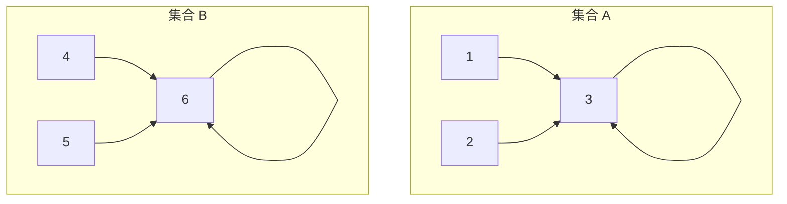

> 📊 **项目全面梳理**：详细的项目结构、模块详解和学习路径，请参阅 [`项目全面梳理-2025.md`](../../项目全面梳理-2025.md)
> **项目导航与对标**：[项目扩展与持续推进任务编排](../../项目扩展与持续推进任务编排.md)、[国际课程对标表](../../国际课程对标表.md)

## 9.1.28 并查集 / Disjoint Set Union (Union-Find)

### 摘要 / Executive Summary

并查集（Disjoint Set Union, DSU），又称 Union-Find，是一种维护**不相交集合族**（collection of disjoint sets）的数据结构。它支持两种核心操作：查找元素所在集合的代表元（`find`），以及合并两个集合（`union`）。通过引入**路径压缩**（Path Compression）与**按秩合并**（Union by Rank）两种启发式策略，并查集的单次操作摊还时间复杂度被优化到近似常数 $O(\alpha(m, n))$，其中 $\alpha$ 为反阿克曼函数（inverse Ackermann function），在一切可想象的实际应用中其值均小于 5。本文档系统阐述并查集的理论基础、算法设计、基于反阿克曼函数的摊还复杂度证明、形式化正确性验证、典型应用场景及其扩展变体。文档对齐 CLRS 第 21 章 [CLRS2022] 与项目 Rust 实现 `examples/algorithms/src/union_find.rs`。

### 国际课程参考 / International Course References

- **MIT 6.006**: Introduction to Algorithms — Graph Search, Minimum Spanning Trees, Union-Find
- **Princeton COS 226**: Algorithms and Data Structures — Percolation, Kruskal, Union-Find
- **CMU 15-451**: Algorithm Design and Analysis — Amortized Analysis, Inverse Ackermann

---

## 目录 / Table of Contents

- [9.1.28 并查集 / Disjoint Set Union (Union-Find)](#9128-并查集--disjoint-set-union-union-find)
  - [摘要 / Executive Summary](#摘要--executive-summary)
  - [国际课程参考 / International Course References](#国际课程参考--international-course-references)
- [目录 / Table of Contents](#目录--table-of-contents)
- [1. 理论基础](#1-理论基础)
  - [1.1 不相交集合的形式化定义](#11-不相交集合的形式化定义)
  - [1.2 森林表示与指针结构](#12-森林表示与指针结构)
- [2. 算法设计](#2-算法设计)
  - [2.1 MAKE-SET](#21-make-set)
  - [2.2 FIND-SET](#22-find-set)
  - [2.3 UNION](#23-union)
  - [2.4 路径压缩](#24-路径压缩)
  - [2.5 按秩合并](#25-按秩合并)
  - [2.6 Rust 实现映射](#26-rust-实现映射)
- [3. 复杂度分析](#3-复杂度分析)
  - [3.1 反阿克曼函数](#31-反阿克曼函数)
  - [3.2 摊还分析证明概要](#32-摊还分析证明概要)
- [4. 形式化验证](#4-形式化验证)
  - [4.1 不变式](#41-不变式)
  - [4.2 正确性论证](#42-正确性论证)
- [5. 应用场景](#5-应用场景)
- [6. 扩展变体](#6-扩展变体)
  - [6.1 带权并查集（Weighted / Extended Union-Find）](#61-带权并查集weighted--extended-union-find)
  - [6.2 可撤销并查集（Undoable Union-Find）](#62-可撤销并查集undoable-union-find)
  - [6.3 部分持久化并查集（Partially Persistent Union-Find）](#63-部分持久化并查集partially-persistent-union-find)
  - [6.4 并行并查集（Concurrent Union-Find）](#64-并行并查集concurrent-union-find)
- [参考文献 / References](#参考文献--references)

---

## 1. 理论基础

### 1.1 不相交集合的形式化定义

**定义 1.1.1** (不相交集合族)

设 $S = \{S_1, S_2, \ldots, S_k\}$ 为全集 $U$ 上的一个子集族。若对任意 $i \neq j$ 都有 $S_i \cap S_j = \emptyset$，则称 $S$ 为**不相交集合族**（disjoint-set family）。每个集合 $S_i$ 拥有一个唯一的**代表元**（representative）$rep(S_i) \in S_i$。

并查集维护的操作接口定义为：

- $\text{MAKE-SET}(x)$：创建一个新的只包含元素 $x$ 的集合，$rep(\{x\}) = x$。
- $\text{FIND-SET}(x)$：返回元素 $x$ 所在集合的代表元，即 $rep(S_i)$ 其中 $x \in S_i$。
- $\text{UNION}(x, y)$：合并包含 $x$ 和 $y$ 的两个集合，形成新的不相交集合族 $S' = (S \setminus \{S_x, S_y\}) \cup \{S_x \cup S_y\}$。

### 1.2 森林表示与指针结构

并查集最常用且最高效的实现是**有根树森林**（forest of rooted trees）表示：

- 每个集合对应一棵树；
- 树的根节点即为该集合的代表元；
- 每个非根节点维护一个指向其父节点的指针 $parent[x]$；
- 根节点的父指针指向自身，即 $parent[root] = root$。



在该表示下：

- $\text{MAKE-SET}(x)$：创建一棵单节点树，$parent[x] = x$。
- $\text{FIND-SET}(x)$：沿父指针向上遍历至根节点。
- $\text{UNION}(x, y)$：找到 $x$ 和 $y$ 的根 $r_x$、$r_y$，令 $parent[r_x] = r_y$（或反之）。

在最坏情况下（如总是将较高的树接在较矮的树上），树可能退化为链，单次 `find` 时间达到 $O(n)$。为此引入两种经典启发式优化。

---

## 2. 算法设计

### 2.1 MAKE-SET

创建仅含一个元素的新集合，时间复杂度 $O(1)$。

```
MAKE-SET(x)
    parent[x] = x
    rank[x]   = 0
```

### 2.2 FIND-SET

返回元素 $x$ 所在集合的代表元（根节点）。

**基础版本**（无路径压缩）：

```
FIND-SET(x)
    while x ≠ parent[x]
        x = parent[x]
    return x
```

### 2.3 UNION

合并两个集合。基础版本直接将一棵树的根接到另一棵树的根下：

```
UNION(x, y)
    rx = FIND-SET(x)
    ry = FIND-SET(y)
    if rx ≠ ry
        parent[rx] = ry
```

### 2.4 路径压缩

**路径压缩**（Path Compression）是一种在 `FIND-SET` 过程中 flatten 树结构的启发式策略：在从 $x$ 到根节点的路径上，将每个访问过的节点的父指针直接指向根节点。

**递归版本**（与按秩合并配合最常用）：

```
FIND-SET(x)
    if x ≠ parent[x]
        parent[x] = FIND-SET(parent[x])
    return parent[x]
```

路径压缩使得被查询过的节点在后续查询中具有 $O(1)$ 的访问时间，显著降低了树的高度。但它会改变树的结构，导致节点的高度信息失效，因此不能直接与按高度合并（严格版）混用，而应与**按秩合并**配合。

### 2.5 按秩合并

**按秩合并**（Union by Rank）通过比较两棵树的秩（rank）来决定合并方向，将秩较小的树的根接到秩较大的树的根下，从而控制树高的增长。

**秩的定义**：

- 初始时 $\text{MAKE-SET}(x)$ 设置 $rank[x] = 0$。
- 当合并两棵秩不同的树时，高秩树的根保持为根，低秩树的根的父指针指向高秩树的根，高秩树的秩不变。
- 当合并两棵秩相等的树时，任选一根作为新根，其秩加 1。

```
LINK(rx, ry)
    if rank[rx] > rank[ry]
        parent[ry] = rx
    else
        parent[rx] = ry
        if rank[rx] == rank[ry]
            rank[ry] = rank[ry] + 1
```

**按秩合并 vs 按大小合并**：

- 按秩合并的 $rank$ 是树高的上界（由于路径压缩会改变实际高度，$rank$ 不再等于实际高度）。
- 按大小合并（Union by Size）将节点数较少的树接到节点数较多的树下，同样能保证 $O(\log n)$ 的树高上界。
- 在实际工程中，两者性能几乎无差异；按秩合并与路径压缩的组合是理论分析的标准模型 [CLRS2022]。

### 2.6 Rust 实现映射

项目现有实现位于 `examples/algorithms/src/union_find.rs`，完整实现了带路径压缩与按秩合并的并查集：

| 理论操作 | Rust 实现对应 |
|:---|:---|
| $parent$ 数组 | `Vec<usize> parent` |
| $rank$ 数组 | `Vec<usize> rank` |
| MAKE-SET | `UnionFind::new(n)` 中对 $0..n$ 初始化 |
| FIND-SET | `UnionFind::find(&mut self, x)` —— 递归路径压缩 |
| UNION | `UnionFind::union(&mut self, x, y)` —— 按秩合并 |
| 连通性查询 | `UnionFind::connected(&mut self, x, y)` |
| 连通分量计数 | `UnionFind::count(&self)` |
| 集合大小 | `UnionFind::set_size(&mut self, x)` |

**代码映射细节**：

```rust
pub fn find(&mut self, x: usize) -> usize {
    if self.parent[x] != x {
        self.parent[x] = self.find(self.parent[x]);  // 路径压缩
    }
    self.parent[x]
}
```

这段递归实现与 CLRS 中 `FIND-SET` 的伪代码语义完全一致：在递归返回的过程中，将路径上所有节点的父指针直接指向根节点。

```rust
pub fn union(&mut self, x: usize, y: usize) -> bool {
    let px = self.find(x);
    let py = self.find(y);
    if px == py { return false; }

    if self.rank[px] < self.rank[py] {
        self.parent[px] = py;
    } else if self.rank[px] > self.rank[py] {
        self.parent[py] = px;
    } else {
        self.parent[py] = px;
        self.rank[px] += 1;
    }
    self.count -= 1;
    true
}
```

上述 `union` 实现严格遵循按秩合并规则，并在发生实际合并时更新连通分量计数 `count`。

---

## 3. 复杂度分析

### 3.1 反阿克曼函数

**阿克曼函数**（Ackermann function）$A_k(j)$ 是一个增长极其迅速的递归函数：

$$
\begin{aligned}
A_0(j) &= j + 1 \\
A_1(j) &= j + 2 \\
A_2(j) &= 2j + 3 \\
A_3(j) &= 2^{j+3} - 3 \\
A_4(j) &= \underbrace{2^{2^{\cdot^{\cdot^{2}}}}}_{j+3\text{ 个 }2} - 3 \quad \text{(迭代幂次塔)}
\end{aligned}
$$

对于 $k \geq 1$：
$$A_k(j) = \begin{cases} A_{k-1}^{(j+1)}(j) & \text{if } k \geq 1, j \geq 1 \\ A_{k-1}^{(2)}(1) & \text{if } k \geq 1, j = 0 \end{cases}$$

其中 $A_{k-1}^{(t)}(j)$ 表示函数 $A_{k-1}$ 对 $j$ 迭代应用 $t$ 次。

**反阿克曼函数** $\alpha(n)$ 定义为：
$$\alpha(n) = \min\{k : A_k(1) \geq n\}$$

由于 $A_4(1)$ 已经是 $2^{65536} - 3$，一个远超宇宙原子总数的数量级，因此对于任何实际可处理的输入规模（$n \leq 2^{65536}$），都有 $\alpha(n) \leq 4$。这意味着并查集的操作在实际运行中可视为**常数时间**。

### 3.2 摊还分析证明概要

**定理 3.2.1** (带路径压缩与按秩合并的并查集操作复杂度) [CLRS2022, §21.4]

对于任意包含 $m$ 个 `MAKE-SET`、`UNION`、`FIND-SET` 操作的序列，其中 $n$ 个为 `MAKE-SET` 操作，则总运行时间为 $O(m \cdot \alpha(n))$。因此单次操作的摊还时间复杂度为 $O(\alpha(n))$。

**证明概要**（基于势能分析，Tarjan 1975）：

**定义势函数**：为每个节点 $x$ 分配一个势 $\phi_q(x)$，它依赖于 $x$ 的秩 $rank[x]$ 和在操作序列第 $q$ 步时的子树大小。

**关键观察**：

1. **按秩合并保证树高上界**：不进行路径压缩时，按秩合并保证任何节点的秩为 $r$ 的子树至少包含 $2^r$ 个节点。因此 $rank[x] \leq \lfloor\log_2 n\rfloor$。
2. **路径压缩的效果**：每次 `FIND-SET` 将路径上节点的父指针直接指向根，这只会**降低**这些节点的深度，不会增加任何节点的秩。
3. **节点分组**：将所有节点按秩分组。定义 $level(x)$ 为满足 $A_{level(x)}(rank[parent[x]]) \geq rank[x]$ 的最小整数 $k$。
4. **迭代计数**：定义 $iter(x)$ 为使得 $A_{level(x)}^{(t)}(rank[parent[x]]) \geq rank[x]$ 的最小迭代次数 $t$。

**势函数构造**：

- 若 $x$ 是根节点或 $rank[x] = 0$，则 $\phi_q(x) = \alpha(n) \cdot rank[x]$。
- 若 $x$ 非根且存在某个 $k$ 使得 $A_k(rank[x]) \leq rank[parent[x]] < A_{k+1}(rank[x])$，则：
  $$\phi_q(x) = \left(\alpha(n) - level(x)\right) \cdot rank[x] - iter(x)$$

**摊还成本分析**：

- `MAKE-SET`：势增量为 $O(1)$。
- `LINK`（按秩合并）：仅改变两个根节点的势，势变化被 $O(\alpha(n))$ 控制。
- `FIND-SET`（含路径压缩）：设查找路径上有 $s$ 个节点。路径压缩使这些节点的父指针上移。
  - 对于路径上大部分节点，路径压缩使 $level$ 或 $iter$ 增加，从而抵消实际操作成本；
  - 只有少数"高势能"节点的势可能增加，其总增量被 $O(\alpha(n))$ 界限制。

通过精细的势函数分析，可以证明：任意操作序列的总实际成本加上总势变化被 $O(m \cdot \alpha(n))$ 控制。∎

**注**：若仅使用按秩合并（无路径压缩），则单次操作最坏时间复杂度为 $O(\log n)$；若仅使用路径压缩（无按秩合并），摊还复杂度为 $O(\log n)$（Hopcroft 与 Ullman, 1973）。两种启发式策略的**组合**才能达到近乎常数的反阿克曼界（Tarjan, 1975）。

---

## 4. 形式化验证

### 4.1 不变式

并查集的正确性由以下三个不变式保证：

**I-1. 父指针无环**（Acyclicity）：
对任意元素 $x$，反复追踪 $parent[x]$ 最终会到达一个满足 $parent[r] = r$ 的根节点 $r$。即父指针图是一片有根树森林，不存在环。

**I-2. 代表元唯一性**（Unique Representative）：
每个集合有且仅有一个代表元（根节点）。对任意 $x \in S_i$，$\text{FIND-SET}(x) = rep(S_i)$，且该值在同一集合的所有元素间保持一致。

**I-3. 不相交性保持**（Disjointness Preservation）：
若两个元素 $x, y$ 初始属于不同集合，则 `UNION(x, y)` 后它们属于同一集合；若它们初始属于同一集合，则 `UNION(x, y)` 不改变集合结构。

### 4.2 正确性论证

**定理 4.2.1** (MAKE-SET 正确性)

执行 `MAKE-SET(x)` 后，$x$ 构成一个独立的单节点集合，$rep(\{x\}) = x$。

**证明**：`MAKE-SET` 设置 $parent[x] = x$，根据 I-1，$x$ 是自身所在的根节点。该集合仅含 $x$ 一个元素，故 $x$ 是其唯一代表元。∎

**定理 4.2.2** (FIND-SET 正确性)

`FIND-SET(x)` 返回 $x$ 所在集合的代表元，且路径压缩后 I-1、I-2 仍然保持。

**证明**：

- `FIND-SET` 沿父指针递归上升至根节点 $r$（满足 $parent[r] = r$），由 I-1 知该根必存在且唯一。
- 返回 $r$ 即为代表元，满足 I-2。
- 路径压缩仅将路径上各节点的父指针直接指向 $r$，不改变各节点与 $r$ 的连通关系，因此 I-1 保持（仍为无环森林）。∎

**定理 4.2.3** (UNION 正确性)

`UNION(x, y)` 将包含 $x$ 和 $y$ 的两个集合合并为一个集合，且不破坏不相交性。

**证明**：

- 设 $r_x = \text{FIND-SET}(x)$，$r_y = \text{FIND-SET}(y)$。
- 若 $r_x = r_y$，则 $x$ 与 $y$ 已在同一集合中，`UNION` 不执行任何操作，I-3 保持。
- 若 $r_x \neq r_y$，`UNION` 设置 $parent[r_x] = r_y$（或反之）。这使得原本分别以 $r_x$ 和 $r_y$ 为根的两棵树合并为一棵树，$r_y$ 成为新集合的唯一代表元。原两个集合的所有元素现在都能通过父指针链到达 $r_y$，且不会与其他集合产生交叉，I-3 保持。∎

---

## 5. 应用场景

并查集因其近乎常数的操作效率和极简的实现，成为图论与组合优化问题中的基础工具：

| 应用场景 | 算法/问题 | 并查集的作用 |
|:---|:---|:---|
| **最小生成树** | Kruskal 算法 | 在按边权排序后依次加边，用并查集快速判断加入该边是否会形成环。时间复杂度 $O(E \log E + E \cdot \alpha(V))$。 |
| **连通分量** | 无向图连通分量计数 | 遍历所有边并执行 `union`，最终 `count()` 即为连通分量数；`connected` 可判断任意两点是否连通。 |
| **离线 LCA** | Tarjan 离线 LCA 算法 | 结合 DFS 与并查集，在 $O(V + E + Q \cdot \alpha(V))$ 时间内回答 $Q$ 个 LCA 查询。 |
| **二分图判定** | 染色法辅助 | 并查集扩展（带权并查集/种类并查集）可用于维护节点间的奇偶性关系，判定二分图。 |
| **Percolation** | 渗流问题（统计物理/概率模型） | 用并查集模拟网格中节点的连通性，判断系统何时出现贯穿集群。 |
| **图像处理** | 连通域标记（Connected Component Labeling） | 对二值图像中的像素进行快速连通域合并与标记。 |
| **编译优化** | 等价类分析、常量传播 | 在程序分析中维护变量或表达式的等价关系。 |

**Kruskal 算法中的并查集应用**：

```
MST-KRUSKAL(G, w)
    A = ∅
    for each vertex v ∈ G.V
        MAKE-SET(v)
    sort the edges of G.E into nondecreasing order by weight w
    for each edge (u, v) ∈ G.E, taken in sorted order
        if FIND-SET(u) ≠ FIND-SET(v)
            A = A ∪ {(u, v)}
            UNION(u, v)
    return A
```

并查集在此处替代了显式的环检测（BFS/DFS），将单次检测从 $O(V + E)$ 降至 $O(\alpha(V))$。

---

## 6. 扩展变体

### 6.1 带权并查集（Weighted / Extended Union-Find）

在标准并查集的基础上，为每条父子边维护一个**权值** $diff[x]$，表示节点 $x$ 到其父节点 $parent[x]$ 的某种相对关系（如距离、差值、奇偶性）。

应用场景：

- **食物链问题**（POJ 1182）：维护捕食关系（A 吃 B，B 吃 C，则 C 吃 A）。
- **向量方程组**：判断一组形如 $x_i - x_j = c$ 的方程是否自洽。
- **二分图判定**：$diff[x] \in \{0, 1\}$ 表示节点到根的颜色奇偶性。

### 6.2 可撤销并查集（Undoable Union-Find）

在按秩合并的基础上，用**栈**记录每次 `union` 操作修改了哪些状态（改变的父指针、改变的秩）。通过栈的弹出实现 $O(1)$ 的撤销操作。常用于：

- **离线分治**（Divide and Conquer on Queries）
- **动态连通性**的线段树分治解法
- **回退搜索**（如搜索树中的分支回溯）

### 6.3 部分持久化并查集（Partially Persistent Union-Find）

支持查询历史某一时刻的集合状态。通过**可持久化数组**或**函数式并查集**（Functional Union-Find）实现，每次 `union` 创建新版本。时间-空间权衡使其复杂度上升至 $O(\log n)$ 每次操作。

### 6.4 并行并查集（Concurrent Union-Find）

在多线程环境下使用原子操作（CAS, Compare-And-Swap）实现无锁的 `find` 与 `union`。广泛应用于：

- 并行图算法（如并行连通分量标记）
- 大规模科学计算中的集群检测

---

## 参考文献 / References

1. **[CLRS2022]** Cormen, T. H., Leiserson, C. E., Rivest, R. L., & Stein, C. (2022). *Introduction to Algorithms* (4th ed.). MIT Press. — 第 21 章：用于不相交集合的数据结构。
2. **[Tarjan1975]** Tarjan, R. E. (1975). "Efficiency of a Good But Not Linear Set Union Algorithm". *Journal of the ACM*, 22(2), 215-225. DOI: 10.1145/321879.321884. — 首次证明路径压缩与按秩合并组合的反阿克曼摊还界。
3. **[HopcroftUllman1973]** Hopcroft, J. E., & Ullman, J. D. (1973). "Set Merging Algorithms". *SIAM Journal on Computing*, 2(4), 294-303. — 仅路径压缩的 $O(\log n)$ 分析。
4. **[FredmanSaks1989]** Fredman, M., & Saks, M. (1989). "The Cell Probe Complexity of Dynamic Data Structures". *Proceedings of the 21st Annual ACM Symposium on Theory of Computing (STOC)*, 345-354. — 证明了并查集在 cell-probe 模型中的下界与反阿克曼界紧匹配。

**文档版本 / Document Version**: 1.0
**最后更新 / Last Updated**: 2026-04-15
**状态 / Status**: maintained
**Rust 实现引用**: `examples/algorithms/src/union_find.rs`
---

## 知识导航

- [返回目录](README.md)

## 学习目标

- 理解28-并查集的核心概念
- 掌握28-并查集的形式化表示
