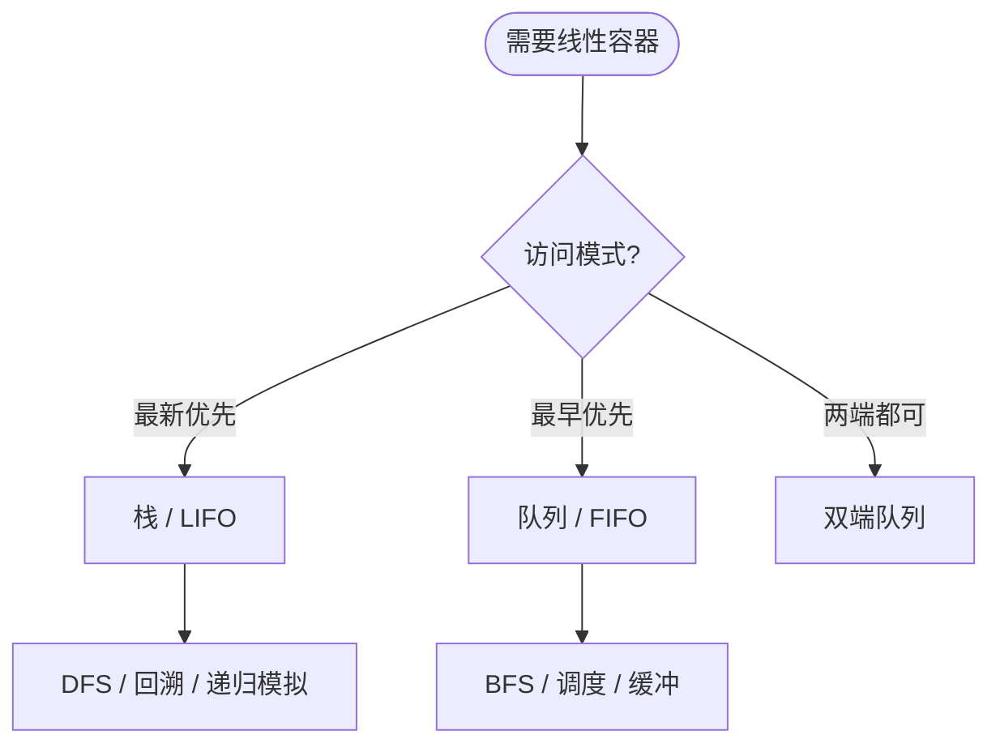

# 栈与队列 - 六维内容补充


> **版本**: 1.0
> **创建日期**: 2026-04-19
> **最后更新**: 2026-04-19

> **模块**: 09-算法理论/01-算法基础
> **文档**: 栈与队列理论
> **补充维度**: 概念定义、属性、关系、解释、论证、形式证明
> **对标**: MIT 6.006 / Stanford CS 166 / CLRS Chapter 10.1
> **深度**: 研究生级

---

## 思维导图：栈与队列概念结构

```mermaid
graph TD
    ADT[线性 ADT] --> STACK[栈<br/>Stack LIFO]
    ADT --> QUEUE[队列<br/>Queue FIFO]

    STACK --> PUSH[push<br/>O(1)]
    STACK --> POP[pop<br/>O(1)]
    STACK --> PEEK[peek<br/>O(1)]
    STACK --> BALANCE[括号匹配]
    STACK --> DFS[深度优先搜索]
    STACK --> CALL[函数调用栈]

    QUEUE --> ENQ[enqueue<br/>O(1)]
    QUEUE --> DEQ[dequeue<br/>O(1)]
    QUEUE --> BFS[广度优先搜索]
    QUEUE --> SCHED[任务调度]
    QUEUE --> BUF[数据缓冲]

    style ADT fill:#e3f2fd
    style STACK fill:#e8f5e9
    style QUEUE fill:#fff3e0
```

---

## 一、概念定义 (Concept Definition)

### 1.1 栈 (Stack)

**定义 1.1.1** (形式化)

**栈**是仅允许在一端（称为**栈顶**，top）进行插入和删除操作的线性表。

设栈 $S$ 的元素序列为 $(a_1, a_2, \ldots, a_n)$，其中 $a_n$ 为栈顶元素。基本操作：

- **PUSH(S, x)**：将 $x$ 压入栈顶
- **POP(S)**：移除并返回栈顶元素
- **PEEK(S)**：返回栈顶元素不移除
- **EMPTY(S)**：判断栈是否为空

**后进先出 (LIFO)**：最后压入的元素最先弹出。

### 1.2 队列 (Queue)

**定义 1.2.1** (形式化)

**队列**是允许在一端（**队尾**，rear/tail）插入、另一端（**队头**，front/head）删除的线性表。

设队列 $Q$ 的元素序列为 $(a_1, a_2, \ldots, a_n)$，其中 $a_1$ 为队头，$a_n$ 为队尾。基本操作：

- **ENQUEUE(Q, x)**：将 $x$ 插入队尾
- **DEQUEUE(Q)**：移除并返回队头元素
- **FRONT(Q)**：返回队头元素不移除
- **EMPTY(Q)**：判断队列是否为空

**先进先出 (FIFO)**：最先入队的元素最先出队。

### 1.3 双栈实现队列

**定理 1.3.1**：使用两个栈可在均摊 $O(1)$ 时间内实现队列的所有操作。

**构造**：

- **in_stack**：接收所有 enqueue 操作
- **out_stack**：负责 dequeue，当为空时将 in_stack 中所有元素依次弹出并压入

---

## 二、属性 (Properties)

### 2.1 操作复杂度

| 操作 | 数组实现(栈) | 链表实现(栈) | 数组实现(队列) | 链表实现(队列) | 双栈实现(队列) |
|------|-------------|-------------|---------------|---------------|---------------|
| 插入 | $O(1)$ | $O(1)$ | $O(1)$ | $O(1)$ | $O(1)$ |
| 删除 | $O(1)$ | $O(1)$ | $O(1)$ | $O(1)$ | $O(1)$ 均摊 |
| 访问顶部 | $O(1)$ | $O(1)$ | $O(1)$ | $O(1)$ | $O(1)$ |

### 2.2 括号匹配问题复杂度

使用栈检查括号平衡性：

- 时间复杂度：$O(n)$，其中 $n$ 为字符串长度
- 空间复杂度：$O(n)$ 最坏情况（全为左括号）

---

## 三、关系 (Relations)

### 3.1 概念关系表

| 源概念 | 目标概念 | 关系类型 | 说明 |
|--------|----------|----------|------|
| 栈 | 队列 | sibling | 同为受限线性表，约束端不同 |
| 栈 | 双端队列 | specializes | 仅使用一端 |
| 队列 | 双端队列 | specializes | 仅使用两端中的指定端 |
| 函数调用栈 | 栈 | instance | 程序运行时的具体实现 |
| BFS | 队列 | implemented_by | 队列是 BFS 的天然数据结构 |
| DFS | 栈 | implemented_by | 递归隐式使用调用栈 |

### 3.2 栈 vs 队列 决策图



---

## 四、解释 (Explanation)

### 4.1 动机与直观

**栈的直观**：一摞盘子。你只能从顶部放盘子，也只能从顶部取盘子。最后放上去的盘子最先被使用。

**队列的直观**：排队买票。先到的人先得到服务，后到的人在队尾等待。公平性是队列的核心价值。

**双栈队列的直观**：想象两条传送带。入队时把货物放到第一条传送带（in_stack）上；出队时，如果第二条传送带（out_stack）空，就把第一条上的货物全部倒到第二条上。虽然偶尔需要"倒腾"，但平均每次操作还是很快的。

### 4.2 与已有概念的联系

**栈 ↔ 递归**：任何递归程序都可以显式用栈改写为迭代版本。递归调用栈本质上就是操作系统维护的栈结构。

**队列 ↔ BFS**：BFS 的层级遍历特性与队列的 FIFO 特性完美契合。当前层所有节点按入队顺序处理，保证距离源点越近的节点越早被访问。

---

## 五、论证 (Argumentation)

### 5.1 双栈队列的均摊分析

**定理 5.1.1**：双栈实现队列的 dequeue 操作均摊时间复杂度为 $O(1)$。

**论证**：

每个元素最多经历：

1. 压入 in_stack 一次
2. 从 in_stack 弹出一次
3. 压入 out_stack 一次
4. 从 out_stack 弹出一次

每个元素的总移动成本为 $O(1)$。设进行了 $m$ 次 enqueue 和 $m$ 次 dequeue，总成本为 $O(m)$。因此单次 dequeue 的均摊成本为 $O(1)$。$\square$

### 5.2 括号匹配算法的正确性

**定理 5.2.1**：基于栈的括号匹配算法能正确判断字符串是否平衡。

**证明概要**（循环不变式）：

处理字符串前 $i$ 个字符后，栈中恰好包含这 $i$ 个字符中未匹配的左括号，且顺序与出现顺序一致（栈底到栈顶）。

- **初始化**：$i=0$ 时栈为空，不变式成立。
- **保持**：遇到左括号则压栈；遇到右括号则检查栈顶是否匹配，匹配则弹出，否则直接返回 false。每一步均保持不变式。
- **终止**：处理完所有字符后，栈为空当且仅当所有括号均匹配。$\square$

---

## 六、形式证明 (Formal Proof)

### 6.1 栈的 push/pop 序列合法性

**定理 6.1.1** (Catalan 数)：对于 $n$ 个元素的入栈序列 $1, 2, \ldots, n$，合法的出栈序列个数为第 $n$ 个 Catalan 数：

$$C_n = \frac{1}{n+1}\binom{2n}{n}$$

**证明**：

设 $f(n)$ 为 $n$ 个元素的合法出栈序列数。考虑元素 1 在出栈序列中的位置，设它是第 $k+1$ 个出栈的元素（$0 \leq k \leq n-1$）。

则：

- 有 $k$ 个元素在 1 之前出栈（它们必须是 $2, \ldots, k+1$）
- 有 $n-1-k$ 个元素在 1 之后出栈

因此：
$$f(n) = \sum_{k=0}^{n-1} f(k) \cdot f(n-1-k)$$

这正是 Catalan 数的递推关系。由初始条件 $f(0)=1$，得 $f(n) = C_n$。$\square$

### 6.2 队列的 FIFO 性质

**定理 6.2.1**：若元素 $a$ 在元素 $b$ 之前入队，则 $a$ 必在 $b$ 之前出队。

**证明**：

队列基于链表或数组实现时，enqueue 操作将元素添加到队尾，dequeue 操作从队头移除元素。队头指针始终指向最早入队且尚未出队的元素。因此元素的出队顺序严格遵循入队顺序。$\square$

---

## 七、应用场景

| 应用场景 | 数据结构 | 核心原因 |
|---------|---------|---------|
| 表达式求值 | 栈 | 运算符优先级与括号嵌套 |
| 浏览器前进/后退 | 双栈 | 记录访问历史，支持双向回溯 |
| 任务调度 | 队列 | 公平性，先到先服务 |
| 打印机缓冲 | 队列 | 按提交顺序处理打印任务 |
| 二叉树遍历 | 栈/队列 | DFS 用栈，BFS 用队列 |
| 括号/标签匹配 | 栈 | LIFO 匹配嵌套结构 |

---

## 八、扩展变体

### 8.1 单调栈 / 单调队列

维护栈/队列内元素单调递增/递减，用于求解 Next Greater Element、滑动窗口最大值等问题，时间复杂度 $O(n)$。

### 8.2 优先队列 (Priority Queue)

 dequeue 不再遵循 FIFO，而是返回优先级最高的元素。常用堆实现，操作复杂度 $O(\log n)$。

### 8.3 阻塞队列 (Blocking Queue)

 并发编程中的线程安全队列，支持在满/空时阻塞生产者/消费者线程，是生产者-消费者模型的核心组件。

---

**文档版本**: v1.0
**创建日期**: 2026-04-15
**维护**: 项目算法理论工作组

---

## 参考文献 / References

1. **[CLRS2022]** Cormen, T. H., et al. (2022). *Introduction to Algorithms* (4th ed.). MIT Press. Chapter 10.1.
2. **[Knuth1997]** Knuth, D. E. (1997). *The Art of Computer Programming, Vol. 1*. Addison-Wesley.
3. **[SedgewickWayne2011]** Sedgewick, R., & Wayne, K. (2011). *Algorithms* (4th ed.). Addison-Wesley.
---

## 知识导航

- [返回目录](README.md)

