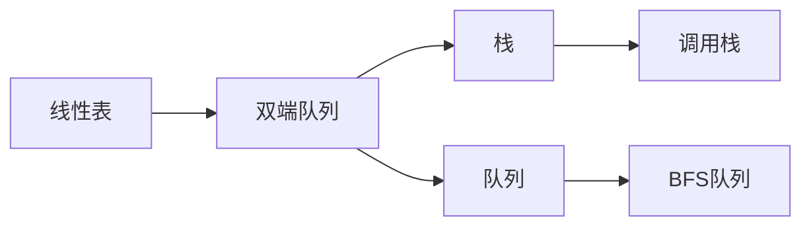

# 双端队列 - 六维内容补充


> **版本**: 1.0
> **创建日期**: 2026-04-19
> **最后更新**: 2026-04-19

> **模块**: 09-算法理论/01-算法基础
> **文档**: 双端队列理论
> **补充维度**: 概念定义、属性、关系、解释、论证、形式证明
> **对标**: MIT 6.006 / Stanford CS 166 / CLRS Chapter 10.1 (Exercise)
> **深度**: 研究生级

---

## 思维导图：双端队列概念结构

```mermaid
graph TD
    DEQUE[双端队列<br/>Deque] --> FRONT[前端操作]
    DEQUE --> BACK[后端操作]
    DEQUE --> GEN[泛化结构]

    FRONT --> PF[push_front<br/>O(1)]
    FRONT --> POPF[pop_front<br/>O(1)]

    BACK --> PB[push_back<br/>O(1)]
    BACK --> POPB[pop_back<br/>O(1)]

    GEN --> STACK[可当作栈使用]
    GEN --> QUEUE[可当作队列使用]
    GEN --> SLIDING[滑动窗口最大值]
    GEN --> PALIN[回文检查]

    style DEQUE fill:#e3f2fd
    style GEN fill:#e8f5e9
```

---

## 一、概念定义 (Concept Definition)

### 1.1 双端队列 (Deque)

**定义 1.1.1** (形式化)

**双端队列**（Double-Ended Queue，简称 Deque）是允许在两端进行插入和删除操作的线性数据结构。

设双端队列 $D$ 的元素序列为 $(a_1, a_2, \ldots, a_n)$。基本操作：

- **PUSH_FRONT(D, x)**：将 $x$ 插入到 $a_1$ 之前
- **PUSH_BACK(D, x)**：将 $x$ 插入到 $a_n$ 之后
- **POP_FRONT(D)**：移除并返回 $a_1$
- **POP_BACK(D)**：移除并返回 $a_n$
- **PEEK_FRONT(D)** / **PEEK_BACK(D)**：查看两端元素

### 1.2 基于数组的循环双端队列

使用循环数组（circular buffer）可实现 $O(1)$ 均摊的双端操作。维护两个指针：

- $head$：指向队头元素
- $tail$：指向队尾元素的下一个空位

当 $head = tail$ 时，队列为空（需用额外标记或预留一个空位区分满状态）。

---

## 二、属性 (Properties)

### 2.1 操作复杂度

| 操作 | 双向链表实现 | 循环数组实现 |
|------|-------------|-------------|
| push_front | $O(1)$ | $O(1)$ 均摊* |
| push_back | $O(1)$ | $O(1)$ 均摊* |
| pop_front | $O(1)$ | $O(1)$ |
| pop_back | $O(1)$ | $O(1)$ |
| peek_front/back | $O(1)$ | $O(1)$ |

*数组实现时，满队需扩容，空队过多可缩容

### 2.2 双端队列的泛化能力

**定理 2.2.1**：双端队列是栈和队列的泛化。

- 仅使用 **push_back + pop_back** → 栈（LIFO）
- 仅使用 **push_back + pop_front** → 队列（FIFO）

因此，任何能用栈或队列解决的问题，都可以用双端队列解决。

---

## 三、关系 (Relations)

### 3.1 概念关系表

| 源概念 | 目标概念 | 关系类型 | 说明 |
|--------|----------|----------|------|
| 双端队列 | 栈 | generalizes | 限制一端即退化为栈 |
| 双端队列 | 队列 | generalizes | 固定两端操作即退化为队列 |
| 循环数组 | 双端队列 | implemented_by | 高效的空间利用实现 |
| 单调双端队列 | 双端队列 | specializes | 维护单调性用于滑动窗口 |

### 3.2 与相关结构的包含关系



---

## 四、解释 (Explanation)

### 4.1 动机与直观

**为什么需要双端队列？**

栈和队列分别只允许在一端或指定两端操作。但有些场景需要更大的灵活性：

- **滑动窗口**：窗口从右端扩大、从左端缩小
- **任务窃取**：一个线程从一端取任务，另一个线程从另一端取任务（work-stealing）
- **回文检查**：从两端同时向中间比较字符

双端队列就像是一个两端都能开关的管道，货物可以从任一端放入或取出。

### 4.2 与已有概念的联系

**双端队列 ↔ 循环数组**：

循环数组是实现双端队列最空间高效的方式。通过模运算让数组"首尾相接"，避免了链表实现的指针开销，同时保持 $O(1)$ 的操作性能。

**双端队列 ↔ 单调队列**：

单调队列本质上就是一个维护单调性的双端队列。在滑动窗口最大值问题中，新元素从队尾入队时，会先弹出队尾所有更小的元素，保证队列单调递减。

---

## 五、论证 (Argumentation)

### 5.1 回文检查算法的正确性

**算法**：使用双端队列检查字符串 $s$ 是否为回文

1. 将 $s$ 中所有字符依次 push_back 到双端队列
2. 循环：pop_front 与 pop_back 比较，若不同则返回 false
3. 当队列长度 $\leq 1$ 时返回 true

**证明**：

**循环不变式**：第 $k$ 次迭代时，已比较的前 $k$ 个字符和后 $k$ 个字符均相等。

- 每次从两端取出的字符分别是当前剩余字符串的首字符和尾字符
- 若它们相等，则子问题缩小为中间的子串
- 终止时要么发现不匹配（返回 false），要么所有对称位置均匹配（返回 true）

因此算法正确。$\square$

### 5.2 循环数组实现的空间效率

**论证**：设循环数组容量为 $cap$，当前元素个数为 $n$。

在任意时刻，实际使用的连续内存块为 $cap$ 个槽位。由于采用模运算处理 $head$ 和 $tail$ 指针，数据可以"环绕"存储，无需为前端操作预留大片连续空位。

相比普通数组（头插需要 $O(n)$ 元素移动），循环数组的头尾插入均为 $O(1)$。

---

## 六、形式证明 (Formal Proof)

### 6.1 循环数组双端操作的 O(1) 性

**定理 6.1.1**：在基于循环数组实现的双端队列中，push_front、push_back、pop_front、pop_back 的时间复杂度均为 $O(1)$（不考虑扩缩容）。

**证明**：

设循环数组容量为 $cap$，头指针为 $head$，尾指针为 $tail$。

- **push_front**：$head \leftarrow (head - 1 + cap) \bmod cap$，然后在 $head$ 位置写入元素。1 次算术运算 + 1 次写操作 = $O(1)$。
- **push_back**：在 $tail$ 位置写入元素，$tail \leftarrow (tail + 1) \bmod cap$。同理 $O(1)$。
- **pop_front**：读取 $head$ 位置元素，$head \leftarrow (head + 1) \bmod cap$。$O(1)$。
- **pop_back**：$tail \leftarrow (tail - 1 + cap) \bmod cap$，读取该位置元素。$O(1)$。

所有操作均只涉及常数次算术运算和内存访问，因此时间复杂度为 $O(1)$。$\square$

### 6.2 双端队列是栈与队列的超结构

**定理 6.2.1**：若数据结构 $D$ 支持 push_front、push_back、pop_front、pop_back，则 $D$ 可模拟栈和队列的所有操作。

**证明**：

**模拟栈**：

- 定义 PUSH(S, x) = push_back(D, x)
- 定义 POP(S) = pop_back(D)

此时最后入队的元素位于后端，也从后端弹出，满足 LIFO。

**模拟队列**：

- 定义 ENQUEUE(Q, x) = push_back(D, x)
- 定义 DEQUEUE(Q) = pop_front(D)

此时最早入队的元素位于前端，从前端弹出，满足 FIFO。

因此双端队列可完整模拟栈和队列。$\square$

---

## 七、应用场景

| 应用场景 | 使用方式 | 原因 |
|---------|---------|------|
| 滑动窗口最大值 | 单调双端队列 | 维护窗口内候选最大值 |
| 回文检查 | 双端队列 | 两端同时比较字符 |
| 任务窃取调度 | 双端队列 | 主线程 push_back，工作线程 pop_front |
| 浏览器历史 | 双端队列 | 支持前进后退的双向遍历 |
| 数据流处理 | 循环数组双端队列 | 高效利用固定缓冲区 |

---

## 八、扩展变体

### 8.1 单调双端队列 (Monotonic Deque)

维护队列内元素单调递增或递减。典型应用：

- LeetCode 239：滑动窗口最大值
- 直方图中最大矩形

均可在 $O(n)$ 时间内解决。

### 8.2 可持久化双端队列

基于函数式数据结构实现，支持版本回溯。常用于需要 undo/redo 功能的编辑器或游戏中。

### 8.3 并发双端队列 (Concurrent Deque)

使用 CAS 操作或细粒度锁实现无锁/少锁双端队列，是 Cilk、TBB 等并行框架中 work-stealing 调度的核心数据结构。

---

**文档版本**: v1.0
**创建日期**: 2026-04-15
**维护**: 项目算法理论工作组

---

## 参考文献 / References

1. **[CLRS2022]** Cormen, T. H., et al. (2022). *Introduction to Algorithms* (4th ed.). MIT Press. Chapter 10.1, Exercises.
2. **[Okasaki1998]** Okasaki, C. (1998). *Purely Functional Data Structures*. Cambridge University Press.
3. **[LeisersonBlumofd2012]** Leiserson, C. E., & Blumofe, R. D. (2012). *Scheduling Multithreaded Computations by Work Stealing*. ACM.
---

## 知识导航

- [返回目录](README.md)

