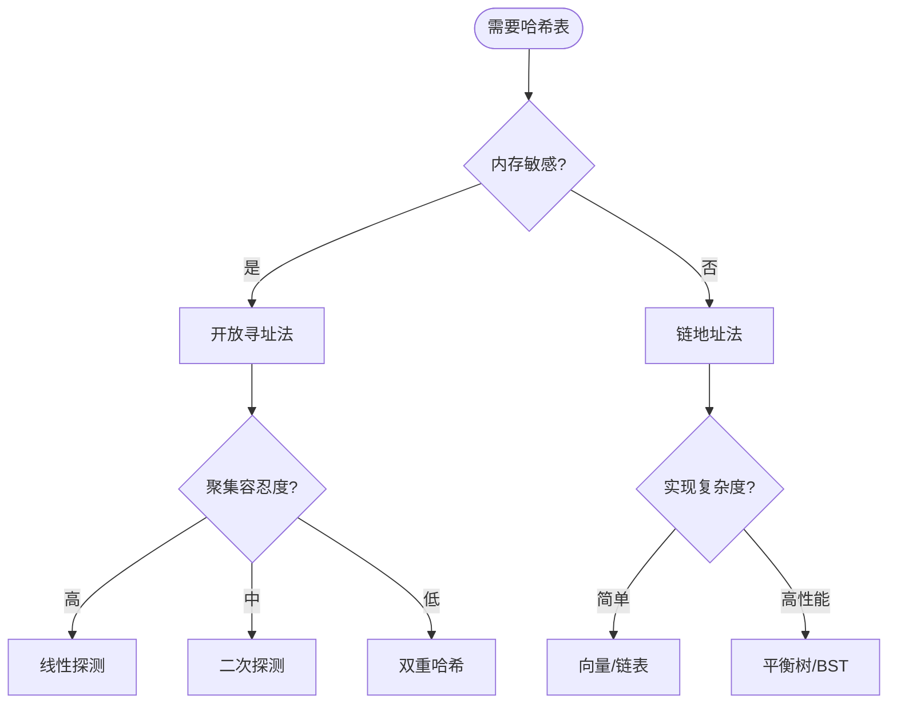

# 哈希表 - 六维内容补充


> **版本**: 1.0
> **创建日期**: 2026-04-19
> **最后更新**: 2026-04-19

> **模块**: 09-算法理论/01-算法基础
> **文档**: 哈希表理论
> **补充维度**: 概念定义、属性、关系、解释、论证、形式证明
> **对标**: MIT 6.006 / Stanford CS 166 / CLRS Chapter 11
> **深度**: 研究生级

---

## 思维导图：哈希表概念结构

```mermaid
graph TD
    HT[哈希表<br/>Hash Table] --> HASH[哈希函数]
    HT --> COLL[冲突处理]
    HT --> PERF[性能分析]

    HASH --> UNI[全域哈希<br/>Universal Hashing]
    HASH --> PERF_HASH[完美哈希<br/>Perfect Hashing]

    COLL --> CHAIN[链地址法<br/>Separate Chaining]
    COLL --> OA[开放寻址法<br/>Open Addressing]

    OA --> LINEAR[线性探测]
    OA --> QUAD[二次探测]
    OA --> DH[双重哈希]

    PERF --> LOAD[负载因子<br/>α = n/m]
    PERF --> EXP[期望复杂度<br/>O(1)]

    style HT fill:#e3f2fd
    style CHAIN fill:#e8f5e9
    style OA fill:#fff3e0
```

---

## 一、概念定义 (Concept Definition)

### 1.1 哈希表 (Hash Table)

**定义 1.1.1** (形式化)

**哈希表**是一种通过哈希函数将键映射到表中位置，从而实现快速查找的数据结构。

设键的 universe 为 $U$，表大小为 $m$，哈希函数为：

$$h: U \rightarrow \{0, 1, \ldots, m-1\}$$

对于键 $k$，其对应的槽位为 $h(k)$。

### 1.2 链地址法 (Separate Chaining)

**定义 1.2.1**

每个槽位 $T[j]$ 维护一个链表（或其他容器），所有满足 $h(k_i) = j$ 的键值对均存储在该链表中。

**负载因子**：
$$\alpha = \frac{n}{m}$$

其中 $n$ 为元素个数，$m$ 为槽位数。在链地址法中，$\alpha$ 可以 $> 1$。

### 1.3 开放寻址法 (Open Addressing)

**定义 1.3.1**

所有元素均直接存储在哈希表数组中。当发生冲突时，按照**探测序列**在表中寻找下一个空槽：

$$h(k, i) = (h'(k) + f(i)) \bmod m, \quad i = 0, 1, 2, \ldots$$

常见探测函数：

| 方法 | 探测函数 $f(i)$ | 特点 |
|------|----------------|------|
| 线性探测 | $i$ | 简单，但易产生-primary clustering |
| 二次探测 | $c_1 i + c_2 i^2$ | 缓解主聚集，仍有 secondary clustering |
| 双重哈希 | $i \cdot h_2(k)$ | 最好的开放寻址策略，接近随机 |

在开放寻址法中，$\alpha < 1$ 是必要条件。

---

## 二、属性 (Properties)

### 2.1 操作复杂度（简单均匀哈希假设）

| 方法 | 成功查找 | 不成功查找 | 插入 | 删除 |
|------|---------|-----------|------|------|
| 链地址法 | $\Theta(1 + \alpha)$ | $\Theta(1 + \alpha)$ | $\Theta(1 + \alpha)$ | $\Theta(1 + \alpha)$ |
| 开放寻址法（线性探测） | $\Theta\left(\frac{1}{1-\alpha}\right)$ | $\Theta\left(\frac{1}{(1-\alpha)^2}\right)$ | 同查找 | 标记删除（tombstone） |
| 开放寻址法（双重哈希） | $\Theta\left(\frac{1}{1-\alpha}\right)$ | $\Theta\left(\frac{1}{1-\alpha}\right)$ | 同查找 | 标记删除 |

### 2.2 负载因子与性能

**链地址法**：

- $\alpha = 0.75$：平均链表长度 0.75，性能优异
- $\alpha = 2$：平均链表长度 2，仍可接受
- 通常扩容阈值设为 $0.75$

**开放寻址法**：

- $\alpha = 0.5$：平均探测次数 $< 2$
- $\alpha = 0.9$：线性探测平均探测次数激增至 50+
- 通常保持 $\alpha < 0.7$

---

## 三、关系 (Relations)

### 3.1 概念关系表

| 源概念 | 目标概念 | 关系类型 | 说明 |
|--------|----------|----------|------|
| 链地址法 | 开放寻址法 | alternative | 冲突处理的两种主流策略 |
| 线性探测 | 二次探测 | refines | 改进聚集问题 |
| 双重哈希 | 线性探测 | refines | 最佳开放寻址策略 |
| 全域哈希 | 确定性哈希 | generalizes | 随机化避免最坏情况 |
| 完美哈希 | 哈希表 | specializes | 静态集合无冲突 |
| 一致性哈希 | 哈希函数 | extends | 分布式系统中的节点映射 |

### 3.2 冲突处理策略决策图



---

## 四、解释 (Explanation)

### 4.1 动机与直观

**为什么哈希表这么快？**

想象一个巨型图书馆。如果按书名首字母排序（类似有序数组），找一本书需要二分查找 $O(\log n)$。而哈希表就像给每本书分配一个专属书架编号——通过书名直接算出编号，一步到位 $O(1)$。

**冲突的直观**：

两个人可能算出同一个书架编号（生日悖论告诉我们这很常见）。链地址法就是在同一个书架上叠放多本书；开放寻址法则是让第二个人去相邻的空书架。

### 4.2 与已有概念的联系

**哈希表 ↔ 数组**：

哈希表的核心就是数组的随机访问能力。哈希函数将任意键域"压缩"到数组索引范围内。

**哈希表 ↔ 概率论**：

 birthday paradox 告诉我们，即使槽位数 $m$ 远大于元素数 $n$，冲突也几乎不可避免。简单均匀哈希假设是分析哈希表性能的基石。

---

## 五、论证 (Argumentation)

### 5.1 链地址法查找的期望时间

**定理 5.1.1**：在简单均匀哈希假设下，链地址法哈希表的查找期望时间为 $\Theta(1 + \alpha)$。

**论证**：

对于键 $k$，定义 $X_{kj}$ 为指示变量（键 $k_j$ 是否与 $k$ 哈希到同一槽位）。

$$E[X_{kj}] = \Pr(h(k_j) = h(k)) = \frac{1}{m}$$

设 $n_j$ 为槽位 $j$ 中的元素个数，则：

$$E[n_{h(k)}] = \sum_{j \neq k} E[X_{kj}] = \frac{n-1}{m} < \alpha$$

查找 $k$ 需要计算哈希（$O(1)$）加上遍历对应链表（期望长度 $\alpha$）。因此总期望时间为 $\Theta(1 + \alpha)$。$\square$

### 5.2 开放寻址法的聚集问题

**主聚集 (Primary Clustering)**：

线性探测中，连续被占用的槽位会形成"块"。新元素落入块中的概率与块的长度成正比，导致大块越长越容易增长，形成正反馈。

**二次探测的改进**：

探测步长不再是 1，而是 $c_1 i + c_2 i^2$，使得冲突元素的探测路径不同，缓解主聚集。但由于初始哈希值相同，仍会产生 secondary clustering。

**双重哈希的彻底解决**：

第二哈希函数 $h_2(k)$ 为每个键生成独立的步长，探测序列真正达到伪随机效果，聚集问题最小化。

---

## 六、形式证明 (Formal Proof)

### 6.1 开放寻址法不成功查找的探测次数

**定理 6.1.1**：在简单均匀哈希假设下，使用双重哈希的开放寻址表中，不成功查找的期望探测次数至多为 $\frac{1}{1-\alpha}$。

**证明**：

设 $X$ 为不成功查找的探测次数。第 $i$ 次探测命中已被占用的槽位的概率为：

$$p_i = \frac{n_i}{m_i}$$

其中 $n_i$ 为剩余已占用槽位数，$m_i$ 为剩余总槽位数。在均匀假设下，$p_i \approx \alpha$。

探测次数服从几何分布的期望上界：

$$E[X] = \sum_{i=0}^{\infty} \alpha^i = \frac{1}{1-\alpha}$$

（严格证明需考虑无放回抽样的修正，结果仍为 $O(\frac{1}{1-\alpha})$。）$\square$

### 6.2 全域哈希族的期望冲突数

**定义 6.2.1**（全域哈希族）：

哈希函数族 $\mathcal{H}$ 称为**全域的**（universal），如果对任意不同的键 $k, l$：

$$\Pr_{h \in \mathcal{H}}(h(k) = h(l)) \leq \frac{1}{m}$$

**定理 6.2.1**：若从全域哈希族中随机选取 $h$，则任意 $n$ 个键的期望冲突总数 $< \frac{n(n-1)}{2m}$。

**证明**：

对键对 $(k_i, k_j)$（$i < j$），定义指示变量 $C_{ij} = [h(k_i) = h(k_j)]$。

$$E[C_{ij}] = \Pr(h(k_i) = h(k_j)) \leq \frac{1}{m}$$

总冲突数 $C = \sum_{i<j} C_{ij}$，因此：

$$E[C] = \sum_{i<j} E[C_{ij}] \leq \binom{n}{2} \cdot \frac{1}{m} = \frac{n(n-1)}{2m}$$

当 $m = \Theta(n^2)$ 时，期望冲突数 $< 1$，意味着存在完美哈希函数。$\square$

---

## 七、应用场景

| 应用场景 | 实现策略 | 原因 |
|---------|---------|------|
| 符号表/字典 | 链地址法 | 删除简单，支持动态扩容 |
| 编译器关键字 | 完美哈希 | 静态集合，零冲突 |
| CPU 缓存/TLB | 直接映射/组相联 | 硬件实现，速度至上 |
| 分布式缓存 | 一致性哈希 | 节点动态增减，最小化数据迁移 |
| 数据库索引 | 可扩展哈希/B+树 | 磁盘友好，支持范围查询 |
| 密码学 | 抗碰撞哈希 | SHA-256 等，安全要求高 |

---

## 八、扩展变体

### 8.1 完美哈希 (Perfect Hashing)

两层哈希结构，第一层全域哈希，第二层为每个槽位独立构造无冲突的哈希函数。适用于静态键集合，查询时间严格 $O(1)$ 最坏情况。

### 8.2 布谷鸟哈希 (Cuckoo Hashing)

使用两个哈希函数和两个表。每个键有两个候选位置，插入时通过"踢出"已存在键来为新键腾位。查询 $O(1)$ 最坏，插入均摊 $O(1)$。

### 8.3 可扩展哈希 (Extendible Hashing)

面向外存（磁盘）设计的动态哈希结构。通过全局深度和局部深度管理桶的分裂，避免全表重哈希。

### 8.4 罗宾汉哈希 (Robin Hood Hashing)

开放寻址法的变体，插入时允许"窃取"距离原始位置更近的元素的槽位，从而最小化最长探测距离，提高查询方差性能。

---

**文档版本**: v1.0
**创建日期**: 2026-04-15
**维护**: 项目算法理论工作组

---

## 参考文献 / References

1. **[CLRS2022]** Cormen, T. H., et al. (2022). *Introduction to Algorithms* (4th ed.). MIT Press. Chapter 11.
2. **[Knuth1998]** Knuth, D. E. (1998). *The Art of Computer Programming, Vol. 3: Sorting and Searching* (2nd ed.). Addison-Wesley.
3. **[MotwaniRaghavan1995]** Motwani, R., & Raghavan, P. (1995). *Randomized Algorithms*. Cambridge University Press.
---

## 知识导航

- [返回目录](README.md)

## 学习目标

- 理解哈希表 - 六维内容补充的核心概念
- 掌握哈希表 - 六维内容补充的形式化表示
