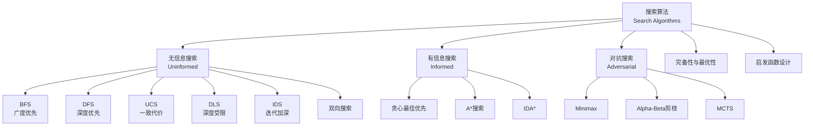

# 搜索算法理论 - 六维内容补充

> **版本**: 1.0
> **创建日期**: 2026-04-19
> **最后更新**: 2026-04-19

> **模块**: 09-算法理论/03-搜索算法
> **文档**: 01-搜索理论
> **补充维度**: 概念定义、属性、关系、解释、论证、形式证明
> **对标**: MIT 6.006 / Stanford CS161 / CMU 15-451
> **深度**: 研究生级

---

## 思维导图：搜索算法概念结构

---

## 一、概念定义 (Concept Definition)

### 1.1 搜索问题 / Search Problem

**定义 1.1.1** (形式化)

搜索问题是一个五元组 $P = (S, s_0, A, T, G)$：

- $S$: 状态集合
- $s_0 \in S$: 初始状态
- $A$: 动作集合
- $T: S \times A \rightarrow S$: 转移函数（可能部分定义）
- $G \subseteq S$: 目标状态集合

**搜索树**: 从 $s_0$ 出发，通过重复应用 $T$ 构造的树形结构。

---

### 1.2 无信息搜索 / Uninformed Search

**定义 1.2.1**: 仅使用问题定义中提供的信息，不使用特定领域知识的搜索策略。

**主要算法**:

| 算法 | 策略 | 时间 | 空间 | 完备 | 最优 |
|------|------|------|------|------|------|
| BFS | 层序扩展 | $O(b^d)$ | $O(b^d)$ | ✅ | ✅(代价一致) |
| DFS | 深度优先 | $O(b^m)$ | $O(bm)$ | ❌ | ❌ |
| UCS | 代价优先 | $O(b^{1+\lfloor C^*/\epsilon \rfloor})$ | $O(b^{1+\lfloor C^*/\epsilon \rfloor})$ | ✅ | ✅ |
| IDS | 迭代加深 | $O(b^d)$ | $O(bd)$ | ✅ | ✅(代价一致) |

其中 $b$=分支因子, $d$=最浅解深度, $m$=最大深度, $C^*$=最优解代价

---

### 1.3 A*搜索 / A* Search

**定义 1.3.1** (形式化)

A*搜索使用**评价函数**:

$$f(n) = g(n) + h(n)$$

- $g(n)$: 从初始状态到 $n$ 的实际代价
- $h(n)$: 从 $n$ 到目标的**启发式估计**

**启发函数性质**:

| 性质 | 定义 | 保证 |
|------|------|------|
| **可采纳 (Admissible)** | $h(n) \leq h^*(n)$ | A* 最优 |
| **一致 (Consistent)** | $h(n) \leq c(n,a,n') + h(n')$ | A* 最优 + 效率 |

其中 $h^*(n)$ 是真实最优代价，$c(n,a,n')$ 是动作代价。

---

### 1.4 Alpha-Beta剪枝

**定义 1.4.1** (形式化)

在Minimax搜索中，利用已计算的界限剪去不影响最终决策的分支：

- **α**: Max玩家的最好选择值（下界）
- **β**: Min玩家的最好选择值（上界）

**剪枝条件**: 当 $\alpha \geq \beta$ 时，剪去当前分支。

---

## 二、属性 (Properties)

### 2.1 搜索算法对比矩阵

| 算法 | 策略 | 完备性 | 最优性 | 时间复杂度 | 空间复杂度 |
|------|------|--------|--------|------------|------------|
| BFS | FIFO队列 | ✅ | ✅(单位代价) | $O(b^d)$ | $O(b^d)$ |
| DFS | LIFO栈 | ❌ | ❌ | $O(b^m)$ | $O(bm)$ |
| UCS | 优先队列 | ✅ | ✅ | $O(b^{1+\lfloor C^*/\epsilon \rfloor})$ | $O(b^{1+\lfloor C^*/\epsilon \rfloor})$ |
| GBFS | 启发式队列 | ❌ | ❌ | $O(b^m)$ | $O(b^m)$ |
| A* | f(n)=g+h | ✅ | ✅(可采纳) | $O(b^d)$ | $O(b^d)$ |
| IDA* | 迭代加深 | ✅ | ✅(可采纳) | $O(b^d)$ | $O(d)$ |

### 2.2 启发函数示例

| 问题 | 启发函数 | 可采纳性 | 一致性 |
|------|----------|----------|--------|
| 8数码 | 错位棋子数 | ✅ | ✅ |
| 8数码 | 曼哈顿距离 | ✅ | ✅ |
| 路线规划 | 欧几里得距离 | ✅ | ✅ |
| 路线规划 | 实际距离 | ✅ | ✅ |
| 旅行商 | MST长度 | ✅ | ❌ |

### 2.3 Alpha-Beta效率

| 情况 | 节点数 | 有效分支因子 |
|------|--------|--------------|
| 无剪枝 | $O(b^d)$ | $b$ |
| 最优排序 | $O(b^{d/2})$ | $\sqrt{b}$ |
| 随机排序 | $O(b^{3d/4})$ | $b^{3/4}$ |

---

## 三、关系 (Relations)

### 3.1 概念关系表

| 源概念 | 目标概念 | 关系类型 | 说明 |
|--------|----------|----------|------|
| BFS | UCS | specializes_to | 单位代价时等价 |
| UCS | A* | specializes_to | h(n)=0时等价 |
| A* | GBFS | generalizes | A*包含GBFS(h(n)=f(n)) |
| IDA* | A* | space_efficient | IDA*空间更优 |
| Minimax | Alpha-Beta | optimizes | Alpha-Beta是优化版 |
| 启发式 | 可采纳性 | guarantees | 可采纳→A*最优 |
| 一致性 | 可采纳性 | implies | 一致蕴含可采纳 |

---

## 四、解释 (Explanation)

### 4.1 动机与直观

**为什么需要搜索算法？**

许多AI问题的状态空间**巨大**但**结构化**：

- 围棋: $10^{170}$ 种状态
- 蛋白质折叠: 天文数字
- 路径规划: 图可能无限

搜索算法提供**系统化探索**策略。

**A*为什么有效？**

**直观**: $f(n) = g(n) + h(n)$ 平衡了：

- **已走路程** ($g$): 实际代价，不会高估
- **估计剩余** ($h$): 启发式引导，避免盲目

当 $h$ 可采纳时，A*保证找到最优解；当 $h$ 一致时，A*甚至不需要重复扩展节点。

### 4.2 与已有概念的联系

**搜索 ↔ 图遍历**

| 图遍历 | 搜索对应 |
|--------|----------|
| BFS | 层序搜索 |
| DFS | 深度优先搜索 |
| Dijkstra | UCS |
| 最佳优先 | GBFS |

**搜索 ↔ 动态规划**

某些搜索问题可以用DP优化：

- **重叠子问题**: 记忆化搜索
- **最优子结构**: 剪枝

---

## 五、论证 (Argumentation)

### 5.1 非形式论证：A*最优性

**可采纳性论证**:

假设A*返回的路径不是最优的，设最优路径代价为 $C^*$。

**矛盾推导**:

1. A*选择的目标节点 $n$ 满足 $f(n) = g(n) + h(n) = C_{\text{found}} > C^*$
2. 最优路径上必有一个未扩展节点 $n'$ 满足 $f(n') \leq C^*$（因为 $h$ 可采纳）
3. 由于 $f(n') \leq C^* < f(n)$，A*应该优先扩展 $n'$ 而非 $n$
4. 矛盾！因此A*返回的必是最优解。

---

## 六、形式证明 (Formal Proof)

### 6.1 A*完备性证明

**定理 6.1.1**: 如果存在从初始状态到目标状态的路径，且每个节点有有限后继、边代价有正下界 $\epsilon > 0$，则A*必然找到解。

**证明**:

设 $C^*$ 是最优解代价。考虑集合：

$$S = \{n : f(n) < C^*\}$$

**断言**: $S$ 是有限的。

因为 $f(n) = g(n) + h(n) \geq g(n)$，且 $g(n) \geq d(n) \cdot \epsilon$（$d(n)$ 是深度）。

因此 $n \in S \Rightarrow d(n) < C^*/\epsilon$。

有限深度 + 有限分支因子 = 有限节点数。

**结论**: A*只会扩展有限个 $f(n) < C^*$ 的节点，必然在某步选择目标节点。

### 6.2 一致性蕴含可采纳性

**定理 6.2.1**: 若 $h$ 是一致的，则 $h$ 是可采纳的。

**证明** (归纳):

设 $h^*(n)$ 是从 $n$ 到目标的最优代价。

**基例**: 对目标节点 $t$，$h(t) = 0 = h^*(t)$。

**归纳步骤**: 假设对 $n$ 的所有后继 $n'$，$h(n') \leq h^*(n')$。

由一致性：$h(n) \leq c(n, a, n') + h(n')$ 对所有动作 $a$ 成立。

取最优动作 $a^*$：

$$h(n) \leq c(n, a^*, n') + h(n') \leq c(n, a^*, n') + h^*(n') = h^*(n)$$

因此 $h$ 可采纳。

---

**文档版本**: v1.0
**创建日期**: 2026-04-10
**维护**: 项目搜索算法工作组

---

## 参考文献 / References

1. **[CLRS2022]** Cormen, T. H., Leiserson, C. E., Rivest, R. L., & Stein, C. (2022). *Introduction to Algorithms* (4th ed.). MIT Press.
2. **[KleinbergTardos2006]** Kleinberg, J., & Tardos, É. (2006). *Algorithm Design*. Pearson.
3. **[Erickson2019]** Erickson, J. (2019). *Algorithms*. Self-published. <https://jeffe.cs.illinois.edu/teaching/algorithms/>.

**文档版本 / Document Version**: 1.0
**对齐状态**: 已补充权威引用，与项目引用规范对齐。
---

## 知识导航

- [返回目录](README.md)

