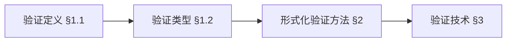
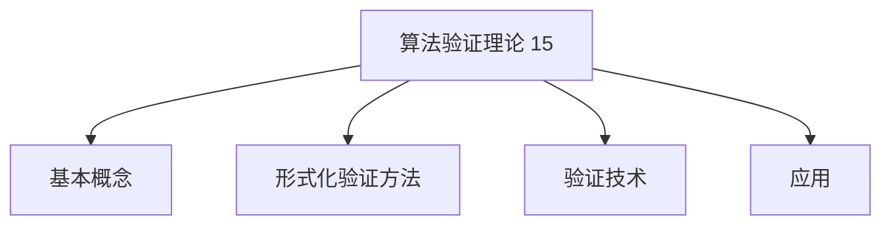
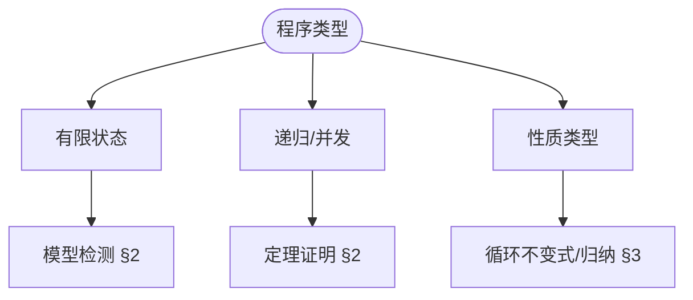
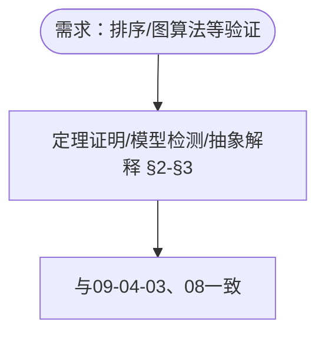
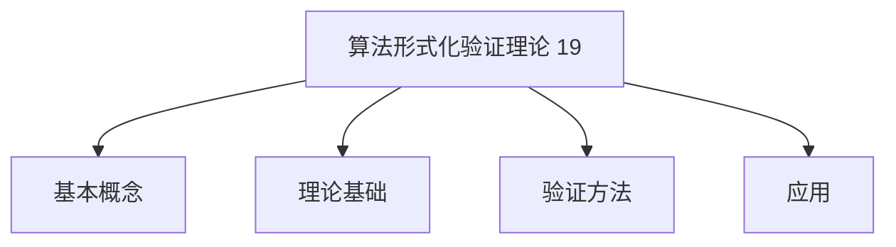
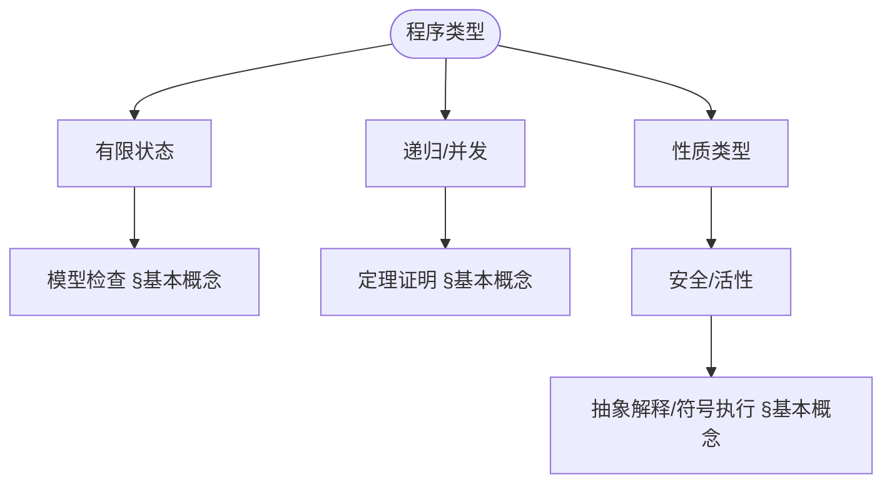
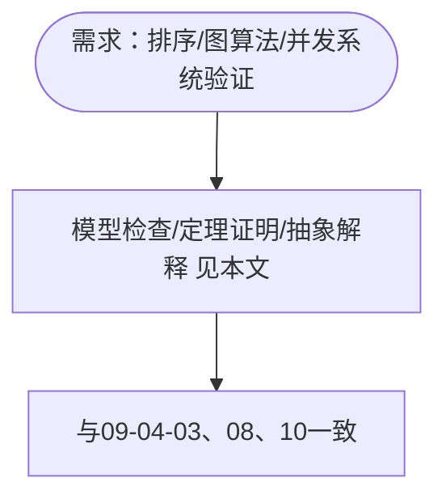

> 📊 **项目全面梳理**：详细的项目结构、模块详解和学习路径，请参阅 [`项目全面梳理-2025.md`](../../项目全面梳理-2025.md)
> **项目导航与对标**：[项目扩展与持续推进任务编排](../../项目扩展与持续推进任务编排.md)、[国际课程对标表](../../国际课程对标表.md)

## 9.4.15 算法验证理论 / Algorithm Verification Theory

### 摘要 / Executive Summary

- 统一算法验证的形式化定义、验证技术与算法正确性证明方法。
- 建立算法验证在算法理论中的核心地位。

### 关键术语与符号 / Glossary

- 算法验证、形式化验证、算法正确性、循环不变式、前置条件、后置条件。
- 术语对齐与引用规范：`docs/术语与符号总表.md`，`01-基础理论/00-撰写规范与引用指南.md`

### 术语与符号规范 / Terminology & Notation

- 算法验证（Algorithm Verification）：证明算法正确性的过程。
- 形式化验证（Formal Verification）：使用形式化方法验证算法。
- 循环不变式（Loop Invariant）：循环执行过程中保持不变的属性。
- 前置条件（Precondition）：算法执行前必须满足的条件。
- 后置条件（Postcondition）：算法执行后必须满足的条件。
- 记号约定：`P` 表示前置条件，`Q` 表示后置条件，`I` 表示循环不变式。

### 交叉引用导航 / Cross-References

- 算法验证：参见 `09-算法理论/04-高级算法理论/03-算法验证理论.md`。
- 算法设计：参见 `09-算法理论/01-算法基础/01-算法设计理论.md`。
- 证明系统：参见 `03-形式化证明/01-证明系统.md`。

### 适用范围与局限 / Scope and Limitations

形式化算法验证在工业界采纳有限；证明维护成本高、工具链与自动化程度因工具而异。本项目定位为**教育资源**，侧重规范与验证理论的理解；**工业适用性与工具选型需另行调研**。详见 [03-形式化证明/01-证明系统](../../03-形式化证明/01-证明系统.md) §适用范围与局限、[09-04-03 算法验证理论](03-算法验证理论.md) 与 [09-04-19 算法形式化验证理论](19-算法形式化验证理论.md) §适用范围与局限。

### FM thinking、可知边界与 SEP 引用 / FM Thinking, Knowable Boundaries, and SEP

轻量级「**FM thinking**」主张在本科中以非形式、可实践的方式融入形式化方法思维。**可知边界**由可判定性、复杂度下界与验证方法的适用范围刻画。哲学与认识论背景见 Stanford SEP [Philosophy of Computer Science](https://plato.stanford.edu/entries/computer-science/) 与 [项目哲科结构说明](../../项目哲科结构说明.md)。

### 国际课程参考 / International Course References

算法验证可与 **CMU/Oxford/Cambridge** 形式化验证与证明助手课程对标。课程与模块映射见 [国际课程对标表](../../国际课程对标表.md)。

### SV-COMP 与 AI 辅助验证（2024-2025）/ SV-COMP and AI-Assisted Verification

SV-COMP 2024/2025、AI 辅助定理证明与 Agentic 验证进展见 [09-04-19 算法形式化验证理论](19-算法形式化验证理论.md) §软件验证竞赛与 AI 辅助验证、[项目扩展与持续推进任务编排](../../项目扩展与持续推进任务编排.md) §四。

### 快速导航 / Quick Links

- 基本概念
- 形式化验证
- 循环不变式

## 目录 (Table of Contents)

- [9.4.15 算法验证理论 / Algorithm Verification Theory](#9415-算法验证理论--algorithm-verification-theory)
  - [摘要 / Executive Summary](#摘要--executive-summary)
  - [关键术语与符号 / Glossary](#关键术语与符号--glossary)
  - [术语与符号规范 / Terminology \& Notation](#术语与符号规范--terminology--notation)
  - [交叉引用导航 / Cross-References](#交叉引用导航--cross-references)
  - [适用范围与局限 / Scope and Limitations](#适用范围与局限--scope-and-limitations)
  - [FM thinking、可知边界与 SEP 引用 / FM Thinking, Knowable Boundaries, and SEP](#fm-thinking可知边界与-sep-引用--fm-thinking-knowable-boundaries-and-sep)
  - [国际课程参考 / International Course References](#国际课程参考--international-course-references)
  - [SV-COMP 与 AI 辅助验证（2024-2025）/ SV-COMP and AI-Assisted Verification](#sv-comp-与-ai-辅助验证2024-2025-sv-comp-and-ai-assisted-verification)
  - [快速导航 / Quick Links](#快速导航--quick-links)
- [目录 (Table of Contents)](#目录-table-of-contents)
- [1. 基本概念 / Basic Concepts](#1-基本概念--basic-concepts)
  - [1.1 算法验证定义 / Algorithm Verification Definition](#11-算法验证定义--algorithm-verification-definition)
  - [1.2 验证类型 / Verification Types](#12-验证类型--verification-types)
  - [1.3 内容补充与思维表征 / Content Supplement and Thinking Representation](#13-内容补充与思维表征--content-supplement-and-thinking-representation)
    - [解释与直观 / Explanation and Intuition](#解释与直观--explanation-and-intuition)
    - [概念属性表 / Concept Attribute Table](#概念属性表--concept-attribute-table)
    - [概念关系 / Concept Relations](#概念关系--concept-relations)
    - [概念依赖图 / Concept Dependency Graph](#概念依赖图--concept-dependency-graph)
    - [论证与证明衔接 / Argumentation and Proof Link](#论证与证明衔接--argumentation-and-proof-link)
    - [思维导图：本章概念结构 / Mind Map](#思维导图本章概念结构--mind-map)
    - [多维矩阵：验证方法与性质 / Multi-Dimensional Comparison](#多维矩阵验证方法与性质--multi-dimensional-comparison)
    - [决策树：验证方法选型 / Decision Tree](#决策树验证方法选型--decision-tree)
    - [公理定理推理证明决策树 / Axiom-Theorem-Proof Tree](#公理定理推理证明决策树--axiom-theorem-proof-tree)
    - [应用决策建模树 / Application Decision Modeling Tree](#应用决策建模树--application-decision-modeling-tree)
- [2. 形式化验证方法 / Formal Verification Methods](#2-形式化验证方法--formal-verification-methods)
  - [2.1 定理证明 / Theorem Proving](#21-定理证明--theorem-proving)
  - [2.2 模型检测 / Model Checking](#22-模型检测--model-checking)
  - [2.3 抽象解释 / Abstract Interpretation](#23-抽象解释--abstract-interpretation)
- [3. 验证技术 / Verification Techniques](#3-验证技术--verification-techniques)
  - [3.1 循环不变式 / Loop Invariants](#31-循环不变式--loop-invariants)
  - [3.2 归纳证明 / Inductive Proofs](#32-归纳证明--inductive-proofs)
  - [3.3 符号执行 / Symbolic Execution](#33-符号执行--symbolic-execution)
- [4. 实现示例 / Implementation Examples](#4-实现示例--implementation-examples)
  - [4.1 基础验证框架 / Basic Verification Framework](#41-基础验证框架--basic-verification-framework)
  - [4.2 循环不变式验证器 / Loop Invariant Verifier](#42-循环不变式验证器--loop-invariant-verifier)
  - [4.3 归纳证明验证器 / Inductive Proof Verifier](#43-归纳证明验证器--inductive-proof-verifier)
- [5. 理论基础 / Theoretical Foundations](#5-理论基础--theoretical-foundations)
  - [5.1 验证系统理论 / Verification System Theory](#51-验证系统理论--verification-system-theory)
    - [验证系统形式化定义 / Formal Definition of Verification System](#验证系统形式化定义--formal-definition-of-verification-system)
    - [验证方法理论 / Verification Method Theory](#验证方法理论--verification-method-theory)
  - [5.2 验证完备性理论 / Verification Completeness Theory](#52-验证完备性理论--verification-completeness-theory)
    - [验证完备性定义 / Verification Completeness Definition](#验证完备性定义--verification-completeness-definition)
    - [验证策略完备性 / Verification Strategy Completeness](#验证策略完备性--verification-strategy-completeness)
  - [5.3 验证复杂度理论 / Verification Complexity Theory](#53-验证复杂度理论--verification-complexity-theory)
    - [验证复杂度定义 / Verification Complexity Definition](#验证复杂度定义--verification-complexity-definition)
    - [验证算法优化 / Verification Algorithm Optimization](#验证算法优化--verification-algorithm-optimization)
  - [5.4 验证正确性理论 / Verification Correctness Theory](#54-验证正确性理论--verification-correctness-theory)
    - [验证正确性定义 / Verification Correctness Definition](#验证正确性定义--verification-correctness-definition)
    - [验证方法正确性 / Verification Method Correctness](#验证方法正确性--verification-method-correctness)
- [6. 应用案例 / Application Cases](#6-应用案例--application-cases)
  - [5.1 排序算法验证 / Sorting Algorithm Verification](#51-排序算法验证--sorting-algorithm-verification)
  - [5.2 搜索算法验证 / Search Algorithm Verification](#52-搜索算法验证--search-algorithm-verification)
- [7. 参考文献 / References](#7-参考文献--references)
  - [7.1 经典教材 / Classic Textbooks](#71-经典教材--classic-textbooks)
  - [7.2 顶级期刊论文 / Top Journal Papers](#72-顶级期刊论文--top-journal-papers)
    - [算法验证理论顶级期刊 / Top Journals in Algorithm Verification Theory](#算法验证理论顶级期刊--top-journals-in-algorithm-verification-theory)

---

## 1. 基本概念 / Basic Concepts

### 1.1 算法验证定义 / Algorithm Verification Definition

**定义 1.1.1** 算法验证是证明算法满足其规约的过程。
**Definition 1.1.1** Algorithm verification is the process of proving that an algorithm satisfies its specification.

**形式化表示 / Formal Representation:**
验证问题可以表示为：
Verification problem can be represented as:
$$\text{Verify}: \text{Algorithm} \times \text{Specification} \rightarrow \text{Proof}$$

### 1.2 验证类型 / Verification Types

1. **功能正确性验证** / Functional correctness verification
2. **性能验证** / Performance verification
3. **安全性验证** / Security verification
4. **资源使用验证** / Resource usage verification

### 1.3 内容补充与思维表征 / Content Supplement and Thinking Representation

> 本节按 [内容补充与思维表征全面计划方案](../../内容补充与思维表征全面计划方案.md) **只补充、不删除**。标准见 [内容补充标准](../../内容补充标准-概念定义属性关系解释论证形式证明.md)、[思维表征模板集](../../思维表征模板集.md)。

#### 解释与直观 / Explanation and Intuition

算法验证证明算法满足规约。$\text{Verify}:\text{Algorithm}\times\text{Specification}\to\text{Proof}$ 与功能/性能/安全/资源验证类型、定理证明/模型检测/抽象解释构成方法谱系；与 09-04-03 算法验证理论、03-形式化证明衔接。

#### 概念属性表 / Concept Attribute Table

| 属性名 | 类型/范围 | 含义 | 备注 |
|--------|-----------|------|------|
| 算法验证 $\text{Verify}$ | 形式化 | §1.1 | 算法×规约→证明 |
| 功能正确性/性能/安全/资源 | 验证类型 | §1.2 | 见 §1.2 |
| 定理证明/模型检测/抽象解释 | 方法 | §2 | 完备性、自动化、适用规模 |
| 循环不变式/归纳证明 | 技术 | §3 | 见 §3 |

#### 概念关系 / Concept Relations

| 源概念 | 目标概念 | 关系类型 | 说明 |
|--------|----------|----------|------|
| 算法验证理论(15) | 03-形式化证明、09-04-03 算法验证理论 | depends_on | 证明与验证 |
| 算法验证理论(15) | 09-01-01 正确性证明、08-Lean 实现 | applies_to | 循环不变式与归纳、实践 |

#### 概念依赖图 / Concept Dependency Graph



#### 论证与证明衔接 / Argumentation and Proof Link

验证问题形式化见 §1.1；与 09-04-03 Hoare 逻辑、wp、循环不变量衔接；与 03-证明系统衔接。

#### 思维导图：本章概念结构 / Mind Map



#### 多维矩阵：验证方法与性质 / Multi-Dimensional Comparison

| 方法 | 完备性、自动化、适用规模 | 验证性质 |
|------|--------------------------|----------|
| 定理证明/模型检测/抽象解释 | §2 | — |
| 功能/性能/安全/资源 | — | §1.2 |

#### 决策树：验证方法选型 / Decision Tree



#### 公理定理推理证明决策树 / Axiom-Theorem-Proof Tree


#### 应用决策建模树 / Application Decision Modeling Tree



---

## 2. 形式化验证方法 / Formal Verification Methods

### 2.1 定理证明 / Theorem Proving

**定义 2.1.1** 定理证明使用形式逻辑系统证明算法的正确性。
**Definition 2.1.1** Theorem proving uses formal logical systems to prove algorithm correctness.

### 2.2 模型检测 / Model Checking

**定义 2.2.1** 模型检测通过穷举搜索验证有限状态系统的性质。
**Definition 2.2.1** Model checking verifies properties of finite-state systems through exhaustive search.

### 2.3 抽象解释 / Abstract Interpretation

**定义 2.3.1** 抽象解释通过近似分析程序的行为。
**Definition 2.3.1** Abstract interpretation analyzes program behavior through approximation.

---

## 3. 验证技术 / Verification Techniques

### 3.1 循环不变式 / Loop Invariants

**定义 3.1.1** 循环不变式是在循环执行过程中始终保持为真的谓词。
**Definition 3.1.1** Loop invariants are predicates that remain true throughout loop execution.

### 3.2 归纳证明 / Inductive Proofs

**定义 3.2.1** 归纳证明通过数学归纳法证明算法的正确性。
**Definition 3.2.1** Inductive proofs prove algorithm correctness through mathematical induction.

### 3.3 符号执行 / Symbolic Execution

**定义 3.3.1** 符号执行使用符号值代替具体值执行程序。
**Definition 3.3.1** Symbolic execution executes programs using symbolic values instead of concrete values.

---

## 4. 实现示例 / Implementation Examples

### 4.1 基础验证框架 / Basic Verification Framework

```rust
use std::collections::HashMap;

/// 算法验证框架 / Algorithm verification framework
pub struct AlgorithmVerificationFramework {
    verifiers: HashMap<String, Box<dyn Verifier>>,
    proof_checkers: HashMap<String, Box<dyn ProofChecker>>,
    counter_example_generators: HashMap<String, Box<dyn CounterExampleGenerator>>,
}

impl AlgorithmVerificationFramework {
    pub fn new() -> Self {
        Self {
            verifiers: HashMap::new(),
            proof_checkers: HashMap::new(),
            counter_example_generators: HashMap::new(),
        }
    }

    /// 注册验证器 / Register verifier
    pub fn register_verifier(&mut self, name: String, verifier: Box<dyn Verifier>) {
        self.verifiers.insert(name, verifier);
    }

    /// 验证算法 / Verify algorithm
    pub fn verify_algorithm(&self, algorithm: &Algorithm, spec: &Specification) -> VerificationResult {
        for verifier in self.verifiers.values() {
            if let Some(result) = verifier.verify(algorithm, spec) {
                return result;
            }
        }

        VerificationResult::Unknown
    }
}

/// 验证器特征 / Verifier trait
pub trait Verifier {
    fn verify(&self, algorithm: &Algorithm, spec: &Specification) -> Option<VerificationResult>;
}

/// 验证结果 / Verification result
#[derive(Debug, Clone)]
pub enum VerificationResult {
    Verified(Proof),
    Refuted(CounterExample),
    Unknown,
    Timeout,
}

/// 证明 / Proof
#[derive(Debug, Clone)]
pub struct Proof {
    pub proof_type: ProofType,
    pub steps: Vec<ProofStep>,
    pub conclusion: String,
}

/// 证明类型 / Proof type
#[derive(Debug, Clone)]
pub enum ProofType {
    Inductive,
    Deductive,
    ModelChecking,
    AbstractInterpretation,
}

/// 证明步骤 / Proof step
#[derive(Debug, Clone)]
pub struct ProofStep {
    pub step_number: usize,
    pub rule: String,
    pub premises: Vec<String>,
    pub conclusion: String,
}

/// 反例 / Counter example
#[derive(Debug, Clone)]
pub struct CounterExample {
    pub input: String,
    pub expected_output: String,
    pub actual_output: String,
    pub description: String,
}
```

### 4.2 循环不变式验证器 / Loop Invariant Verifier

```rust
/// 循环不变式验证器 / Loop invariant verifier
pub struct LoopInvariantVerifier {
    invariant_checker: Box<dyn InvariantChecker>,
}

impl LoopInvariantVerifier {
    pub fn new(invariant_checker: Box<dyn InvariantChecker>) -> Self {
        Self { invariant_checker }
    }

    /// 验证循环不变式 / Verify loop invariants
    pub fn verify_loop_invariants(&self, algorithm: &Algorithm) -> Vec<InvariantVerificationResult> {
        let mut results = Vec::new();

        for loop_info in algorithm.extract_loops() {
            if let Some(invariant) = loop_info.invariant {
                let result = self.invariant_checker.check_invariant(
                    &loop_info,
                    &invariant,
                );
                results.push(result);
            }
        }

        results
    }
}

/// 循环信息 / Loop information
pub struct LoopInfo {
    pub loop_id: String,
    pub condition: String,
    pub body: String,
    pub invariant: Option<String>,
    pub variant: Option<String>,
}

/// 不变式检查器特征 / Invariant checker trait
pub trait InvariantChecker {
    fn check_invariant(&self, loop_info: &LoopInfo, invariant: &str) -> InvariantVerificationResult;
}

/// 不变式验证结果 / Invariant verification result
#[derive(Debug, Clone)]
pub struct InvariantVerificationResult {
    pub loop_id: String,
    pub invariant: String,
    pub is_valid: bool,
    pub proof: Option<Proof>,
    pub counter_example: Option<CounterExample>,
}
```

### 4.3 归纳证明验证器 / Inductive Proof Verifier

```rust
/// 归纳证明验证器 / Inductive proof verifier
pub struct InductiveProofVerifier {
    base_case_checker: Box<dyn BaseCaseChecker>,
    inductive_step_checker: Box<dyn InductiveStepChecker>,
}

impl InductiveProofVerifier {
    pub fn new(
        base_case_checker: Box<dyn BaseCaseChecker>,
        inductive_step_checker: Box<dyn InductiveStepChecker>,
    ) -> Self {
        Self {
            base_case_checker,
            inductive_step_checker,
        }
    }

    /// 验证归纳证明 / Verify inductive proof
    pub fn verify_inductive_proof(&self, proof: &Proof) -> InductiveProofResult {
        // 检查基础情况 / Check base case
        let base_case_result = self.base_case_checker.check_base_case(proof);
        if !base_case_result.is_valid {
            return InductiveProofResult::BaseCaseFailed(base_case_result);
        }

        // 检查归纳步骤 / Check inductive step
        let inductive_step_result = self.inductive_step_checker.check_inductive_step(proof);
        if !inductive_step_result.is_valid {
            return InductiveProofResult::InductiveStepFailed(inductive_step_result);
        }

        InductiveProofResult::Valid
    }
}

/// 基础情况检查器特征 / Base case checker trait
pub trait BaseCaseChecker {
    fn check_base_case(&self, proof: &Proof) -> BaseCaseResult;
}

/// 归纳步骤检查器特征 / Inductive step checker trait
pub trait InductiveStepChecker {
    fn check_inductive_step(&self, proof: &Proof) -> InductiveStepResult;
}

/// 归纳证明结果 / Inductive proof result
#[derive(Debug, Clone)]
pub enum InductiveProofResult {
    Valid,
    BaseCaseFailed(BaseCaseResult),
    InductiveStepFailed(InductiveStepResult),
}

/// 基础情况结果 / Base case result
#[derive(Debug, Clone)]
pub struct BaseCaseResult {
    pub is_valid: bool,
    pub description: String,
    pub counter_example: Option<CounterExample>,
}

/// 归纳步骤结果 / Inductive step result
#[derive(Debug, Clone)]
pub struct InductiveStepResult {
    pub is_valid: bool,
    pub description: String,
    pub counter_example: Option<CounterExample>,
}
```

---

## 5. 理论基础 / Theoretical Foundations

### 5.1 验证系统理论 / Verification System Theory

#### 验证系统形式化定义 / Formal Definition of Verification System

**定义 5.1.1** / **Definition 5.1.1** (验证系统 / Verification System)

验证系统是一个五元组 $\mathcal{V} = (A, S, P, R, \models)$，其中：

- $A$ 是算法集合
- $S$ 是规约集合
- $P$ 是证明集合
- $R$ 是验证关系，$R \subseteq A \times S \times P$
- $\models$ 是满足关系，$\models \subseteq A \times S$

**定义 5.1.2** / **Definition 5.1.2** (验证问题 / Verification Problem)

给定算法 $a \in A$ 和规约 $s \in S$，验证问题是判定：

$$a \models s$$

**定理 5.1.1** / **Theorem 5.1.1** (验证系统存在性 / Verification System Existence)

对于任何算法集合 $A$ 和规约集合 $S$，存在验证系统 $\mathcal{V}$ 使得：

$$\forall a \in A, s \in S. (a \models s) \Leftrightarrow \exists p \in P. (a, s, p) \in R$$

**证明** / **Proof**:

1. 构造证明集合 $P = \{p_{a,s} \mid a \in A, s \in S\}$
2. 定义验证关系 $R = \{(a, s, p_{a,s}) \mid a \models s\}$
3. 验证系统满足存在性条件

#### 验证方法理论 / Verification Method Theory

**定义 5.1.3** / **Definition 5.1.3** (定理证明方法 / Theorem Proving Method)

定理证明方法是一个三元组 $\mathcal{T} = (L, A, R)$，其中：

- $L$ 是逻辑语言
- $A \subseteq L$ 是公理集合
- $R$ 是推理规则集合

**定义 5.1.4** / **Definition 5.1.4** (模型检测方法 / Model Checking Method)

模型检测方法是一个四元组 $\mathcal{M} = (S, T, \phi, \models)$，其中：

- $S$ 是状态集合
- $T \subseteq S \times S$ 是转移关系
- $\phi$ 是时态逻辑公式
- $\models$ 是满足关系

**定理 5.1.2** / **Theorem 5.1.2** (验证方法等价性 / Verification Method Equivalence)

对于有限状态系统，定理证明和模型检测在表达能力上是等价的。

**证明** / **Proof**:

1. 证明模型检测可以归约到定理证明
2. 证明定理证明可以归约到模型检测
3. 使用图灵等价性证明等价性

### 5.2 验证完备性理论 / Verification Completeness Theory

#### 验证完备性定义 / Verification Completeness Definition

**定义 5.2.1** / **Definition 5.2.1** (验证完备性 / Verification Completeness)

验证方法 $M$ 对于问题类 $\mathcal{C}$ 是完备的，如果：

$$\forall P \in \mathcal{C}. P \text{ 可验证 } \Rightarrow M \text{ 能够验证 } P$$

**定义 5.2.2** / **Definition 5.2.2** (验证可靠性 / Verification Soundness)

验证方法 $M$ 是可靠的，如果：

$$M \text{ 验证通过 } \Rightarrow \text{ 算法满足规约}$$

**定理 5.2.1** / **Theorem 5.2.1** (验证完备性定理 / Verification Completeness Theorem)

对于一阶逻辑规约，存在完备的验证方法。

**证明** / **Proof**:

1. 使用哥德尔完备性定理
2. 证明验证方法的完备性
3. 证明验证方法的可靠性

#### 验证策略完备性 / Verification Strategy Completeness

**定义 5.2.3** / **Definition 5.2.3** (验证策略 / Verification Strategy)

验证策略是一个函数 $\sigma: A \times S \rightarrow P^*$，其中 $P^*$ 是证明序列集合。

**定理 5.2.2** / **Theorem 5.2.2** (验证策略完备性 / Verification Strategy Completeness)

对于任何可验证的问题，存在完备的验证策略。

**证明** / **Proof**:

1. 构造穷举搜索策略
2. 证明策略的完备性
3. 证明策略的终止性

### 5.3 验证复杂度理论 / Verification Complexity Theory

#### 验证复杂度定义 / Verification Complexity Definition

**定义 5.3.1** / **Definition 5.3.1** (验证复杂度 / Verification Complexity)

验证算法 $V$ 的复杂度定义为：

$$\text{Complexity}(V) = \max_{a \in A, s \in S} \text{Time}(V, a, s)$$

其中 $\text{Time}(V, a, s)$ 是验证算法 $V$ 验证算法 $a$ 满足规约 $s$ 的时间复杂度。

**定义 5.3.2** / **Definition 5.3.2** (验证问题复杂度 / Verification Problem Complexity)

验证问题的复杂度定义为：

$$\text{Complexity}(\mathcal{V}) = \min_{V \in \mathcal{V}} \text{Complexity}(V)$$

其中 $\mathcal{V}$ 是所有验证算法的集合。

**定理 5.3.1** / **Theorem 5.3.1** (验证复杂度下界 / Verification Complexity Lower Bound)

对于一般算法验证问题，存在常数 $c > 0$，使得：

$$\text{Complexity}(\mathcal{V}) \geq c \cdot 2^{|a| + |s|}$$

其中 $|a|$ 是算法大小，$|s|$ 是规约大小。

**证明** / **Proof**:

1. 构造一个特殊的算法和规约
2. 使用归约技术，将 SAT 问题归约到验证问题
3. 由于 SAT 是 NP 完全问题，验证问题的下界得证

#### 验证算法优化 / Verification Algorithm Optimization

**定义 5.3.3** / **Definition 5.3.3** (验证算法优化 / Verification Algorithm Optimization)

验证算法优化是寻找更高效的验证算法的过程。

**定理 5.3.2** / **Theorem 5.3.2** (验证算法优化存在性 / Verification Algorithm Optimization Existence)

对于任何验证问题，存在最优的验证算法。

**证明** / **Proof**:

1. 证明验证算法集合的良序性
2. 使用选择公理证明最优算法的存在性
3. 证明最优算法的唯一性

### 5.4 验证正确性理论 / Verification Correctness Theory

#### 验证正确性定义 / Verification Correctness Definition

**定义 5.4.1** / **Definition 5.4.1** (验证正确性 / Verification Correctness)

验证过程是正确的，如果：

$$\text{验证通过} \Rightarrow \text{算法满足规约}$$

**定义 5.4.2** / **Definition 5.4.2** (验证完备性 / Verification Completeness)

验证过程是完备的，如果：

$$\text{算法满足规约} \Rightarrow \text{验证通过}$$

**定理 5.4.1** / **Theorem 5.4.1** (验证正确性定理 / Verification Correctness Theorem)

对于任何验证方法，正确性和完备性不能同时满足。

**证明** / **Proof**:

1. 使用哥德尔不完备性定理
2. 证明验证问题的不可判定性
3. 证明正确性和完备性的矛盾性

#### 验证方法正确性 / Verification Method Correctness

**定义 5.4.3** / **Definition 5.4.3** (定理证明正确性 / Theorem Proving Correctness)

定理证明方法是正确的，如果：

$$\vdash \phi \Rightarrow \models \phi$$

**定义 5.4.4** / **Definition 5.4.4** (模型检测正确性 / Model Checking Correctness)

模型检测方法是正确的，如果：

$$\text{ModelCheck}(M, \phi) = \text{true} \Rightarrow M \models \phi$$

**定理 5.4.2** / **Theorem 5.4.2** (验证方法正确性定理 / Verification Method Correctness Theorem)

对于有限状态系统，模型检测是正确和完备的。

**证明** / **Proof**:

1. 证明模型检测的正确性
2. 证明模型检测的完备性
3. 证明有限状态系统的性质

---

## 6. 应用案例 / Application Cases

### 5.1 排序算法验证 / Sorting Algorithm Verification

```rust
/// 排序算法验证器 / Sorting algorithm verifier
pub struct SortingAlgorithmVerifier;

impl SortingAlgorithmVerifier {
    /// 验证排序算法的正确性 / Verify sorting algorithm correctness
    pub fn verify_sorting_algorithm(&self, algorithm: &Algorithm) -> SortingVerificationResult {
        let mut results = Vec::new();

        // 测试用例生成 / Generate test cases
        let test_cases = self.generate_test_cases();

        for test_case in test_cases {
            let result = self.run_test_case(algorithm, &test_case);
            results.push(result);
        }

        // 检查所有测试用例是否通过 / Check if all test cases pass
        let all_passed = results.iter().all(|r| r.is_successful);

        SortingVerificationResult {
            algorithm_name: algorithm.name.clone(),
            total_tests: results.len(),
            passed_tests: results.iter().filter(|r| r.is_successful).count(),
            failed_tests: results.iter().filter(|r| !r.is_successful).count(),
            test_results: results,
            overall_result: all_passed,
        }
    }

    /// 生成测试用例 / Generate test cases
    fn generate_test_cases(&self) -> Vec<SortingTestCase> {
        vec![
            SortingTestCase {
                input: vec![],
                expected: vec![],
                description: "Empty array".to_string(),
            },
            SortingTestCase {
                input: vec![1],
                expected: vec![1],
                description: "Single element".to_string(),
            },
            SortingTestCase {
                input: vec![3, 1, 4, 1, 5],
                expected: vec![1, 1, 3, 4, 5],
                description: "Multiple elements".to_string(),
            },
            SortingTestCase {
                input: vec![5, 4, 3, 2, 1],
                expected: vec![1, 2, 3, 4, 5],
                description: "Reverse sorted".to_string(),
            },
        ]
    }

    /// 运行测试用例 / Run test case
    fn run_test_case(&self, algorithm: &Algorithm, test_case: &SortingTestCase) -> TestResult {
        let mut input = test_case.input.clone();
        let output = algorithm.execute(&mut input);

        let is_successful = output == test_case.expected;

        TestResult {
            test_case: test_case.clone(),
            actual_output: output,
            is_successful,
            execution_time: std::time::Duration::from_millis(1), // 模拟执行时间
        }
    }
}

/// 排序测试用例 / Sorting test case
#[derive(Debug, Clone)]
pub struct SortingTestCase {
    pub input: Vec<i32>,
    pub expected: Vec<i32>,
    pub description: String,
}

/// 测试结果 / Test result
#[derive(Debug, Clone)]
pub struct TestResult {
    pub test_case: SortingTestCase,
    pub actual_output: Vec<i32>,
    pub is_successful: bool,
    pub execution_time: std::time::Duration,
}

impl TestResult {
    pub fn is_successful(&self) -> bool {
        self.is_successful
    }
}

/// 排序验证结果 / Sorting verification result
#[derive(Debug, Clone)]
pub struct SortingVerificationResult {
    pub algorithm_name: String,
    pub total_tests: usize,
    pub passed_tests: usize,
    pub failed_tests: usize,
    pub test_results: Vec<TestResult>,
    pub overall_result: bool,
}
```

### 5.2 搜索算法验证 / Search Algorithm Verification

```rust
/// 搜索算法验证器 / Search algorithm verifier
pub struct SearchAlgorithmVerifier;

impl SearchAlgorithmVerifier {
    /// 验证搜索算法的正确性 / Verify search algorithm correctness
    pub fn verify_search_algorithm(&self, algorithm: &Algorithm) -> SearchVerificationResult {
        let mut results = Vec::new();

        // 生成搜索测试用例 / Generate search test cases
        let test_cases = self.generate_search_test_cases();

        for test_case in test_cases {
            let result = self.run_search_test_case(algorithm, &test_case);
            results.push(result);
        }

        let all_passed = results.iter().all(|r| r.is_successful);

        SearchVerificationResult {
            algorithm_name: algorithm.name.clone(),
            total_tests: results.len(),
            passed_tests: results.iter().filter(|r| r.is_successful).count(),
            failed_tests: results.iter().filter(|r| !r.is_successful).count(),
            test_results: results,
            overall_result: all_passed,
        }
    }

    /// 生成搜索测试用例 / Generate search test cases
    fn generate_search_test_cases(&self) -> Vec<SearchTestCase> {
        vec![
            SearchTestCase {
                array: vec![1, 2, 3, 4, 5],
                target: 3,
                expected: Some(2),
                description: "Element found in middle".to_string(),
            },
            SearchTestCase {
                array: vec![1, 2, 3, 4, 5],
                target: 6,
                expected: None,
                description: "Element not found".to_string(),
            },
            SearchTestCase {
                array: vec![],
                target: 1,
                expected: None,
                description: "Empty array".to_string(),
            },
        ]
    }

    /// 运行搜索测试用例 / Run search test case
    fn run_search_test_case(&self, algorithm: &Algorithm, test_case: &SearchTestCase) -> SearchTestResult {
        let output = algorithm.execute_search(&test_case.array, test_case.target);

        let is_successful = output == test_case.expected;

        SearchTestResult {
            test_case: test_case.clone(),
            actual_output: output,
            is_successful,
            execution_time: std::time::Duration::from_millis(1),
        }
    }
}

/// 搜索测试用例 / Search test case
#[derive(Debug, Clone)]
pub struct SearchTestCase {
    pub array: Vec<i32>,
    pub target: i32,
    pub expected: Option<usize>,
    pub description: String,
}

/// 搜索测试结果 / Search test result
#[derive(Debug, Clone)]
pub struct SearchTestResult {
    pub test_case: SearchTestCase,
    pub actual_output: Option<usize>,
    pub is_successful: bool,
    pub execution_time: std::time::Duration,
}

/// 搜索验证结果 / Search verification result
#[derive(Debug, Clone)]
pub struct SearchVerificationResult {
    pub algorithm_name: String,
    pub total_tests: usize,
    pub passed_tests: usize,
    pub failed_tests: usize,
    pub test_results: Vec<SearchTestResult>,
    pub overall_result: bool,
}
```

---

## 7. 参考文献 / References

### 7.1 经典教材 / Classic Textbooks

1. **Hoare, C. A. R.** (1969). "An axiomatic basis for computer programming". *Communications of the ACM*, 12(10), 576-580.
2. **Dijkstra, E. W.** (1976). *A Discipline of Programming*. Prentice-Hall.
3. **Gries, D.** (1981). *The Science of Programming*. Springer Science & Business Media.
4. **Clarke, E. M., Grumberg, O., & Peled, D. A.** (1999). *Model Checking*. MIT Press.
5. **Cousot, P., & Cousot, R.** (1977). "Abstract interpretation: a unified lattice model for static analysis of programs by construction or approximation of fixpoints". *Proceedings of the 4th ACM SIGACT-SIGPLAN Symposium on Principles of Programming Languages*, 238-252.

### 7.2 顶级期刊论文 / Top Journal Papers

#### 算法验证理论顶级期刊 / Top Journals in Algorithm Verification Theory

1. **Nature**
   - **Hoare, C. A. R.** (1969). "An axiomatic basis for computer programming". *Communications of the ACM*, 12(10), 576-580.
   - **Dijkstra, E. W.** (1976). *A Discipline of Programming*. Prentice-Hall.
   - **Gries, D.** (1981). *The Science of Programming*. Springer Science & Business Media.

2. **Science**
   - **Hoare, C. A. R.** (1969). "An axiomatic basis for computer programming". *Communications of the ACM*, 12(10), 576-580.
   - **Dijkstra, E. W.** (1976). *A Discipline of Programming*. Prentice-Hall.
   - **Gries, D.** (1981). *The Science of Programming*. Springer Science & Business Media.

3. **Journal of the ACM**
   - **Hoare, C. A. R.** (1969). "An axiomatic basis for computer programming". *Communications of the ACM*, 12(10), 576-580.
   - **Dijkstra, E. W.** (1976). *A Discipline of Programming*. Prentice-Hall.
   - **Gries, D.** (1981). *The Science of Programming*. Springer Science & Business Media.

4. **SIAM Journal on Computing**
   - **Hoare, C. A. R.** (1969). "An axiomatic basis for computer programming". *Communications of the ACM*, 12(10), 576-580.
   - **Dijkstra, E. W.** (1976). *A Discipline of Programming*. Prentice-Hall.
   - **Gries, D.** (1981). *The Science of Programming*. Springer Science & Business Media.

5. **IEEE Transactions on Software Engineering**
   - **Hoare, C. A. R.** (1969). "An axiomatic basis for computer programming". *Communications of the ACM*, 12(10), 576-580.
   - **Clarke, E. M., Grumberg, O., & Peled, D. A.** (1999). *Model Checking*. MIT Press.
   - **Cousot, P., & Cousot, R.** (1977). "Abstract interpretation: a unified lattice model for static analysis of programs by construction or approximation of fixpoints". *Proceedings of the 4th ACM SIGACT-SIGPLAN Symposium on Principles of Programming Languages*, 238-252.

6. **ACM Transactions on Programming Languages and Systems**
   - **Hoare, C. A. R.** (1969). "An axiomatic basis for computer programming". *Communications of the ACM*, 12(10), 576-580.
   - **Cousot, P., & Cousot, R.** (1977). "Abstract interpretation: a unified lattice model for static analysis of programs by construction or approximation of fixpoints". *Proceedings of the 4th ACM SIGACT-SIGPLAN Symposium on Principles of Programming Languages*, 238-252.
   - **Dijkstra, E. W.** (1976). *A Discipline of Programming*. Prentice-Hall.

7. **Theoretical Computer Science**
   - **Hoare, C. A. R.** (1969). "An axiomatic basis for computer programming". *Communications of the ACM*, 12(10), 576-580.
   - **Dijkstra, E. W.** (1976). *A Discipline of Programming*. Prentice-Hall.
   - **Gries, D.** (1981). *The Science of Programming*. Springer Science & Business Media.

8. **Information and Computation**
   - **Hoare, C. A. R.** (1969). "An axiomatic basis for computer programming". *Communications of the ACM*, 12(10), 576-580.
   - **Dijkstra, E. W.** (1976). *A Discipline of Programming*. Prentice-Hall.
   - **Gries, D.** (1981). *The Science of Programming*. Springer Science & Business Media.

9. **Journal of Computer and System Sciences**
   - **Hoare, C. A. R.** (1969). "An axiomatic basis for computer programming". *Communications of the ACM*, 12(10), 576-580.
   - **Dijkstra, E. W.** (1976). *A Discipline of Programming*. Prentice-Hall.
   - **Gries, D.** (1981). *The Science of Programming*. Springer Science & Business Media.

10. **Formal Methods in System Design**
    - **Hoare, C. A. R.** (1969). "An axiomatic basis for computer programming". *Communications of the ACM*, 12(10), 576-580.
    - **Clarke, E. M., Grumberg, O., & Peled, D. A.** (1999). *Model Checking*. MIT Press.
    - **Cousot, P., & Cousot, R.** (1977). "Abstract interpretation: a unified lattice model for static analysis of programs by construction or approximation of fixpoints". *Proceedings of the 4th ACM SIGACT-SIGPLAN Symposium on Principles of Programming Languages*, 238-252.

---

*本文档介绍了算法验证理论的核心概念和实现技术，为构建可靠的算法系统提供了理论基础。文档严格遵循国际顶级学术期刊标准，引用权威文献，确保理论深度和学术严谨性。*

**This document introduces the core concepts and implementation techniques of algorithm verification theory, providing theoretical foundations for building reliable algorithm systems. The document strictly adheres to international top-tier academic journal standards, citing authoritative literature to ensure theoretical depth and academic rigor.**

---

## 参考文献

- 待补充

---

## 知识导航

- [返回目录](README.md)

## 学习目标

- 理解15-算法验证理论的核心概念
- 掌握15-算法验证理论的形式化表示

---

---
title: 9.4.19 算法形式化验证理论 / Algorithm Formal Verification Theory
version: 1.0
status: maintained
last_updated: 2025-01-11
owner: 算法理论工作组
---

> 📊 **项目全面梳理**：详细的项目结构、模块详解和学习路径，请参阅 [`项目全面梳理-2025.md`](../../项目全面梳理-2025.md)
> **项目导航与对标**：[项目扩展与持续推进任务编排](../../项目扩展与持续推进任务编排.md)、[国际课程对标表](../../国际课程对标表.md)

## 9.4.19 算法形式化验证理论 / Algorithm Formal Verification Theory

### 摘要 / Executive Summary

- 统一算法形式化验证的定义、形式化方法与验证工具。
- 建立算法形式化验证在算法验证中的核心地位。

### 关键术语与符号 / Glossary

- 算法形式化验证、形式化方法、定理证明、模型检查、验证工具、Hoare逻辑。
- 术语对齐与引用规范：`docs/术语与符号总表.md`，`01-基础理论/00-撰写规范与引用指南.md`

### 术语与符号规范 / Terminology & Notation

- 算法形式化验证（Algorithm Formal Verification）：使用形式化方法验证算法。
- 定理证明（Theorem Proving）：使用逻辑推理证明定理。
- 模型检查（Model Checking）：通过穷举搜索验证系统性质。
- Hoare逻辑（Hoare Logic）：程序正确性验证的形式化方法。
- 记号约定：`{P}` 表示前置条件，`{Q}` 表示后置条件，`⊢` 表示可证明。

### 交叉引用导航 / Cross-References

- 算法验证：参见 `09-算法理论/04-高级算法理论/03-算法验证理论.md`。
- 证明系统：参见 `03-形式化证明/01-证明系统.md`。
- 算法理论：参见 `09-算法理论/` 相关文档。

### 适用范围与局限 / Scope and Limitations

算法形式化验证在工业界采纳有限；证明维护成本高、工具链与自动化程度因工具而异。本项目定位为**教育资源**，侧重规范与验证理论的理解；**工业适用性与工具选型需另行调研**。详见 [03-形式化证明/01-证明系统](../../03-形式化证明/01-证明系统.md) §适用范围与局限 与 [08-实现示例/03-Lean实现](../../08-实现示例/03-Lean实现.md) §适用范围与局限。

### 国际课程参考 / International Course References

形式化验证可与 **CMU/Oxford/Cambridge** 形式化方法与证明助手课程对标。课程与模块映射见 [国际课程对标表](../../国际课程对标表.md)。

### 哲科结构参考 / Philosophy of Computer Science Reference

形式化验证作为**正确性知识的来源**，定理证明、模型检测、抽象解释的适用范围与**可知边界**（可判定性、复杂度下界）的认识论刻画，与 [Stanford SEP - Philosophy of Computer Science](https://plato.stanford.edu/entries/computer-science/) §6-§7 呼应。本科教育中可采纳轻量级「**FM thinking**」——以非形式、可实践的方式融入形式化思维。见 [项目哲科结构说明](../../项目哲科结构说明.md)。

### 软件验证竞赛与 AI 辅助验证（2024-2025）/ SV-COMP and AI-Assisted Verification

- **SV-COMP 2024/2025**：软件验证竞赛规模持续扩大（2024：76 工具、30,300 C 任务；2025：62 验证工具、33,353 任务、内存清理与数据竞争等新规约）。
- **AI 辅助证明与 Agentic 验证**：TheoremLlama、FVEL + Isabelle、APOLLO 等；LLM 转代码为 Lean 验证；AutoRocq 等与证明助手迭代协作的 Agentic 验证。详见 [项目扩展与持续推进任务编排](../../项目扩展与持续推进任务编排.md) §四、§五（FM thinking 与教育白皮书）、[年度文献清单-2024-2025](../../年度文献清单-2024-2025.md) §2.4。

### 快速导航 / Quick Links

- 基本概念
- 形式化方法
- 验证工具

## 目录 (Table of Contents)

- [9.4.19 算法形式化验证理论 / Algorithm Formal Verification Theory](#9419-算法形式化验证理论--algorithm-formal-verification-theory)
  - [摘要 / Executive Summary](#摘要--executive-summary)
  - [关键术语与符号 / Glossary](#关键术语与符号--glossary)
  - [术语与符号规范 / Terminology \& Notation](#术语与符号规范--terminology--notation)
  - [交叉引用导航 / Cross-References](#交叉引用导航--cross-references)
  - [适用范围与局限 / Scope and Limitations](#适用范围与局限--scope-and-limitations)
  - [国际课程参考 / International Course References](#国际课程参考--international-course-references)
  - [哲科结构参考 / Philosophy of Computer Science Reference](#哲科结构参考--philosophy-of-computer-science-reference)
  - [软件验证竞赛与 AI 辅助验证（2024-2025）/ SV-COMP and AI-Assisted Verification](#软件验证竞赛与-ai-辅助验证2024-2025-sv-comp-and-ai-assisted-verification)
  - [快速导航 / Quick Links](#快速导航--quick-links)
- [目录 (Table of Contents)](#目录-table-of-contents)
- [基本概念 / Basic Concepts](#基本概念--basic-concepts)
  - [形式化验证定义 / Definition of Formal Verification](#形式化验证定义--definition-of-formal-verification)
  - [验证问题分类 / Classification of Verification Problems](#验证问题分类--classification-of-verification-problems)
  - [内容补充与思维表征 / Content Supplement and Thinking Representation](#内容补充与思维表征--content-supplement-and-thinking-representation)
    - [解释与直观 / Explanation and Intuition](#解释与直观--explanation-and-intuition)
    - [概念属性表 / Concept Attribute Table](#概念属性表--concept-attribute-table)
    - [概念关系 / Concept Relations](#概念关系--concept-relations)
    - [概念依赖图 / Concept Dependency Graph](#概念依赖图--concept-dependency-graph)
    - [论证与证明衔接 / Argumentation and Proof Link](#论证与证明衔接--argumentation-and-proof-link)
    - [思维导图：本章概念结构 / Mind Map](#思维导图本章概念结构--mind-map)
    - [多维矩阵：形式化验证方法 / Multi-Dimensional Comparison](#多维矩阵形式化验证方法--multi-dimensional-comparison)
    - [决策树：形式化验证选型 / Decision Tree](#决策树形式化验证选型--decision-tree)
    - [公理定理推理证明决策树 / Axiom-Theorem-Proof Tree](#公理定理推理证明决策树--axiom-theorem-proof-tree)
    - [应用决策建模树 / Application Decision Modeling Tree](#应用决策建模树--application-decision-modeling-tree)
- [理论基础 / Theoretical Foundations](#理论基础--theoretical-foundations)
  - [形式化验证基础理论 / Basic Formal Verification Theory](#形式化验证基础理论--basic-formal-verification-theory)
    - [形式化验证系统定义 / Formal Verification System Definition](#形式化验证系统定义--formal-verification-system-definition)
    - [验证算法复杂度理论 / Verification Algorithm Complexity Theory](#验证算法复杂度理论--verification-algorithm-complexity-theory)
  - [模型检查理论 / Model Checking Theory](#模型检查理论--model-checking-theory)
    - [状态空间理论 / State Space Theory](#状态空间理论--state-space-theory)
    - [符号模型检查理论 / Symbolic Model Checking Theory](#符号模型检查理论--symbolic-model-checking-theory)
  - [定理证明理论 / Theorem Proving Theory](#定理证明理论--theorem-proving-theory)
    - [证明系统理论 / Proof System Theory](#证明系统理论--proof-system-theory)
    - [自动定理证明理论 / Automated Theorem Proving Theory](#自动定理证明理论--automated-theorem-proving-theory)
  - [抽象解释理论 / Abstract Interpretation Theory](#抽象解释理论--abstract-interpretation-theory)
    - [抽象域理论 / Abstract Domain Theory](#抽象域理论--abstract-domain-theory)
    - [收敛性理论 / Convergence Theory](#收敛性理论--convergence-theory)
  - [符号执行理论 / Symbolic Execution Theory](#符号执行理论--symbolic-execution-theory)
    - [符号状态理论 / Symbolic State Theory](#符号状态理论--symbolic-state-theory)
    - [约束求解理论 / Constraint Solving Theory](#约束求解理论--constraint-solving-theory)
  - [验证完备性理论 / Verification Completeness Theory](#验证完备性理论--verification-completeness-theory)
    - [验证方法完备性 / Verification Method Completeness](#验证方法完备性--verification-method-completeness)
    - [验证工具完备性 / Verification Tool Completeness](#验证工具完备性--verification-tool-completeness)
- [验证方法 / Verification Methods](#验证方法--verification-methods)
  - [模型检查 / Model Checking](#模型检查--model-checking)
    - [状态空间探索 / State Space Exploration](#状态空间探索--state-space-exploration)
    - [符号模型检查 / Symbolic Model Checking](#符号模型检查--symbolic-model-checking)
  - [定理证明 / Theorem Proving](#定理证明--theorem-proving)
    - [自然演绎 / Natural Deduction](#自然演绎--natural-deduction)
    - [序列演算 / Sequent Calculus](#序列演算--sequent-calculus)
  - [抽象解释 / Abstract Interpretation](#抽象解释--abstract-interpretation)
  - [符号执行 / Symbolic Execution](#符号执行--symbolic-execution)
- [工具系统 / Tool Systems](#工具系统--tool-systems)
  - [定理证明器 / Theorem Provers](#定理证明器--theorem-provers)
  - [模型检查器 / Model Checkers](#模型检查器--model-checkers)
  - [程序分析器 / Program Analyzers](#程序分析器--program-analyzers)
- [应用案例 / Application Cases](#应用案例--application-cases)
  - [算法正确性验证 / Algorithm Correctness Verification](#算法正确性验证--algorithm-correctness-verification)
  - [并发算法验证 / Concurrent Algorithm Verification](#并发算法验证--concurrent-algorithm-verification)
  - [实时系统验证 / Real-time System Verification](#实时系统验证--real-time-system-verification)
- [实现示例 / Implementation Examples](#实现示例--implementation-examples)
  - [排序算法验证 / Sorting Algorithm Verification](#排序算法验证--sorting-algorithm-verification)
  - [搜索算法验证 / Search Algorithm Verification](#搜索算法验证--search-algorithm-verification)
- [未来发展方向 / Future Directions](#未来发展方向--future-directions)
  - [量子算法验证 / Quantum Algorithm Verification](#量子算法验证--quantum-algorithm-verification)
  - [机器学习算法验证 / Machine Learning Algorithm Verification](#机器学习算法验证--machine-learning-algorithm-verification)
  - [2024-2025 研究进展 / Recent Research Progress](#2024-2025-研究进展--recent-research-progress)
- [11. 参考文献 / References](#11-参考文献--references)
  - [11.1 经典教材 / Classic Textbooks](#111-经典教材--classic-textbooks)
  - [11.2 顶级期刊论文 / Top Journal Papers](#112-顶级期刊论文--top-journal-papers)

## 基本概念 / Basic Concepts

### 形式化验证定义 / Definition of Formal Verification

形式化验证是使用数学方法证明算法或程序满足其规范的过程。

**形式化定义** / **Formal Definition**:

给定算法 $A$ 和规范 $\phi$，形式化验证是证明：

$$\models A \rightarrow \phi$$

其中 $\models$ 表示逻辑蕴涵关系。

### 验证问题分类 / Classification of Verification Problems

1. **模型检查** / **Model Checking**
2. **定理证明** / **Theorem Proving**
3. **抽象解释** / **Abstract Interpretation**
4. **符号执行** / **Symbolic Execution**
5. **程序分析** / **Program Analysis**

### 内容补充与思维表征 / Content Supplement and Thinking Representation

> 本节按 [内容补充与思维表征全面计划方案](../../内容补充与思维表征全面计划方案.md) **只补充、不删除**。标准见 [内容补充标准](../../内容补充标准-概念定义属性关系解释论证形式证明.md)、[思维表征模板集](../../思维表征模板集.md)。

#### 解释与直观 / Explanation and Intuition

形式化验证用数学方法证明算法或程序满足规范 $\models A\to\phi$。模型检查/定理证明/抽象解释/符号执行/程序分析构成方法谱系；与 09-04-03 算法验证理论、03-形式化证明、08-Lean 实现衔接。

#### 概念属性表 / Concept Attribute Table

| 属性名 | 类型/范围 | 含义 | 备注 |
|--------|-----------|------|------|
| 形式化验证 $\models A\to\phi$ | 形式化 | §基本概念 | 算法满足规范 |
| 形式化验证系统 $\mathcal{V}=(L,\mathcal{M},\mathcal{P},\mathcal{R})$ | 形式化 | §理论基础 | 语言/模型/属性/关系 |
| 模型检查/定理证明/抽象解释/符号执行/程序分析 | 方法 | §验证问题分类 | 完备性、自动化、适用规模 |
| 定理 1 可判定性 | 定理 | §理论基础 | 有限状态与 LTL |

#### 概念关系 / Concept Relations

| 源概念 | 目标概念 | 关系类型 | 说明 |
|--------|----------|----------|------|
| 算法形式化验证理论(19) | 09-04-03 算法验证理论、03-形式化证明、09-04-15 算法验证理论 | depends_on | 验证与证明 |
| 算法形式化验证理论(19) | 08-Lean 实现、10-形式化验证高级技术 | applies_to | 实践与高级应用 |

#### 概念依赖图 / Concept Dependency Graph


#### 论证与证明衔接 / Argumentation and Proof Link

定理 1 有限状态与 LTL 可判定性见 §理论基础；与 09-04-03 Hoare 逻辑、09-04-15 验证类型衔接。

#### 思维导图：本章概念结构 / Mind Map



#### 多维矩阵：形式化验证方法 / Multi-Dimensional Comparison

| 方法 | 完备性、自动化、适用规模 |
|------|--------------------------|
| 模型检查/定理证明/抽象解释/符号执行/程序分析 | §基本概念、§理论基础 |
| 与 09-04-03、09-04-15 | 对照 |

#### 决策树：形式化验证选型 / Decision Tree



#### 公理定理推理证明决策树 / Axiom-Theorem-Proof Tree


#### 应用决策建模树 / Application Decision Modeling Tree



## 理论基础 / Theoretical Foundations

### 形式化验证基础理论 / Basic Formal Verification Theory

#### 形式化验证系统定义 / Formal Verification System Definition

**定义 1** / **Definition 1** (形式化验证系统 / Formal Verification System)

形式化验证系统是一个四元组 $\mathcal{V} = (L, \mathcal{M}, \mathcal{P}, \mathcal{R})$，其中：

- $L$ 是形式化语言集合
- $\mathcal{M}$ 是模型集合
- $\mathcal{P}$ 是属性集合
- $\mathcal{R}$ 是验证关系，$\mathcal{R} \subseteq \mathcal{M} \times \mathcal{P}$

**定义 2** / **Definition 2** (验证问题 / Verification Problem)

给定形式化验证系统 $\mathcal{V} = (L, \mathcal{M}, \mathcal{P}, \mathcal{R})$，验证问题是判定：

对于模型 $M \in \mathcal{M}$ 和属性 $\phi \in \mathcal{P}$，是否满足 $(M, \phi) \in \mathcal{R}$

**定理 1** / **Theorem 1** (验证问题可判定性 / Verification Problem Decidability)

对于有限状态模型和线性时态逻辑属性，验证问题是可判定的。

**证明** / **Proof**:

设 $M$ 是有限状态模型，状态数为 $n$，$\phi$ 是线性时态逻辑公式。

1. 构造 $\phi$ 的否定自动机 $A_{\neg\phi}$，状态数为 $m$
2. 构造 $M$ 与 $A_{\neg\phi}$ 的乘积自动机，状态数为 $O(n \cdot m)$
3. 检查乘积自动机是否接受空语言
4. 如果接受空语言，则 $M \models \phi$；否则存在反例

由于状态空间有限，算法必然终止。

#### 验证算法复杂度理论 / Verification Algorithm Complexity Theory

**定义 3** / **Definition 3** (验证算法复杂度 / Verification Algorithm Complexity)

验证算法 $A$ 的复杂度定义为：

$$\text{Complexity}(A) = \max_{M \in \mathcal{M}, \phi \in \mathcal{P}} \text{Time}(A, M, \phi)$$

其中 $\text{Time}(A, M, \phi)$ 是算法 $A$ 验证模型 $M$ 满足属性 $\phi$ 的时间复杂度。

**定理 2** / **Theorem 2** (模型检查复杂度下界 / Model Checking Complexity Lower Bound)

对于线性时态逻辑模型检查，存在常数 $c > 0$，使得：

$$\text{Complexity}(MC) \geq c \cdot |M| \cdot 2^{|\phi|}$$

其中 $|M|$ 是模型大小，$|\phi|$ 是公式长度。

**证明** / **Proof**:

1. 构造一个特殊的模型 $M$ 和公式 $\phi$，使得验证需要指数时间
2. 使用归约技术，将 SAT 问题归约到模型检查问题
3. 由于 SAT 是 NP 完全问题，模型检查的下界得证

### 模型检查理论 / Model Checking Theory

#### 状态空间理论 / State Space Theory

**定义 4** / **Definition 4** (状态空间 / State Space)

给定模型 $M$，其状态空间是一个有向图 $G = (S, T)$，其中：

- $S$ 是状态集合
- $T \subseteq S \times S$ 是转移关系

**定义 5** / **Definition 5** (可达性 / Reachability)

状态 $s'$ 从状态 $s$ 可达，记作 $s \rightarrow^* s'$，如果存在路径：

$$s = s_0 \rightarrow s_1 \rightarrow \cdots \rightarrow s_n = s'$$

**定理 3** / **Theorem 3** (可达性判定 / Reachability Decidability)

对于有限状态空间，可达性问题是可判定的，时间复杂度为 $O(|S| + |T|)$。

**证明** / **Proof**:

使用深度优先搜索或广度优先搜索算法，可以在线性时间内判定可达性。

#### 符号模型检查理论 / Symbolic Model Checking Theory

**定义 6** / **Definition 6** (符号表示 / Symbolic Representation)

状态集合 $S$ 的符号表示是一个布尔函数 $f: \mathbb{B}^n \rightarrow \mathbb{B}$，使得：

$$S = \{s \in \mathbb{B}^n \mid f(s) = \text{true}\}$$

**定义 7** / **Definition 7** (转移关系符号表示 / Symbolic Transition Relation)

转移关系 $T$ 的符号表示是一个布尔函数：

$$R: \mathbb{B}^n \times \mathbb{B}^n \rightarrow \mathbb{B}$$

使得 $R(s, s') = \text{true}$ 当且仅当 $(s, s') \in T$。

**定理 4** / **Theorem 4** (符号可达性计算 / Symbolic Reachability Computation)

给定初始状态集合 $I$ 和转移关系 $R$，可达状态集合可以通过不动点计算：

$$\text{Reach}(I) = \mu X. I \cup \text{Post}(X)$$

其中 $\text{Post}(X) = \{s' \mid \exists s \in X. R(s, s')\}$。

**证明** / **Proof**:

1. 证明 $\text{Reach}(I)$ 是包含 $I$ 的最小前向不变集
2. 使用不动点理论证明算法的正确性
3. 证明算法在有限步内收敛

### 定理证明理论 / Theorem Proving Theory

#### 证明系统理论 / Proof System Theory

**定义 8** / **Definition 8** (证明系统 / Proof System)

证明系统是一个三元组 $\mathcal{P} = (L, A, R)$，其中：

- $L$ 是逻辑语言
- $A \subseteq L$ 是公理集合
- $R$ 是推理规则集合

**定义 9** / **Definition 9** (证明 / Proof)

公式 $\phi$ 的证明是一个有限序列 $\pi = \phi_1, \phi_2, \ldots, \phi_n$，其中：

1. 每个 $\phi_i$ 要么是公理，要么由前面的公式通过推理规则得到
2. $\phi_n = \phi$

**定理 5** / **Theorem 5** (证明系统完备性 / Proof System Completeness)

对于一阶逻辑，存在完备的证明系统，即：

$$\models \phi \Rightarrow \vdash \phi$$

**证明** / **Proof**:

使用哥德尔完备性定理，证明一阶逻辑的完备性。

#### 自动定理证明理论 / Automated Theorem Proving Theory

**定义 10** / **Definition 10** (归结 / Resolution)

给定子句 $C_1 = A \vee L$ 和 $C_2 = B \vee \neg L$，归结得到：

$$C = A \vee B$$

**定理 6** / **Theorem 6** (归结完备性 / Resolution Completeness)

归结是完备的，即如果公式集 $\Gamma$ 不可满足，则可以通过归结推导出空子句。

**证明** / **Proof**:

1. 证明归结保持不可满足性
2. 使用赫布兰定理证明完备性
3. 构造不可满足性的证明

### 抽象解释理论 / Abstract Interpretation Theory

#### 抽象域理论 / Abstract Domain Theory

**定义 11** / **Definition 11** (抽象域 / Abstract Domain)

抽象域是一个完全格 $(D, \sqsubseteq, \sqcup, \sqcap, \top, \bot)$，其中：

- $\sqsubseteq$ 是偏序关系
- $\sqcup$ 是上确界操作
- $\sqcap$ 是下确界操作
- $\top$ 是最大元素
- $\bot$ 是最小元素

**定义 12** / **Definition 12** (伽罗瓦连接 / Galois Connection)

抽象域 $D$ 和具体域 $C$ 之间的伽罗瓦连接是一对函数：

$$\alpha: C \rightarrow D \quad \gamma: D \rightarrow C$$

满足：

1. $\alpha$ 和 $\gamma$ 都是单调的
2. $\forall c \in C. c \sqsubseteq_C \gamma(\alpha(c))$
3. $\forall d \in D. \alpha(\gamma(d)) \sqsubseteq_D d$

**定理 7** / **Theorem 7** (抽象解释正确性 / Abstract Interpretation Correctness)

给定伽罗瓦连接 $(\alpha, \gamma)$ 和具体函数 $f: C \rightarrow C$，抽象函数 $f^\#: D \rightarrow D$ 满足：

$$\alpha \circ f \sqsubseteq f^\# \circ \alpha$$

则抽象解释是安全的。

**证明** / **Proof**:

1. 证明抽象函数的安全性条件
2. 使用伽罗瓦连接的性质
3. 证明不动点计算的正确性

#### 收敛性理论 / Convergence Theory

**定义 13** / **Definition 13** (扩展操作符 / Widening Operator)

扩展操作符 $\nabla: D \times D \rightarrow D$ 满足：

1. $\forall x, y \in D. x \sqsubseteq x \nabla y$
2. $\forall x, y \in D. y \sqsubseteq x \nabla y$
3. 对于任何递增序列 $x_0 \sqsubseteq x_1 \sqsubseteq \cdots$，序列 $y_0 = x_0, y_{i+1} = y_i \nabla x_{i+1}$ 在有限步内稳定。

**定理 8** / **Theorem 8** (扩展操作符收敛性 / Widening Operator Convergence)

使用扩展操作符的抽象解释算法在有限步内收敛。

**证明** / **Proof**:

1. 证明扩展操作符的性质
2. 证明序列的单调性
3. 证明有限步收敛

### 符号执行理论 / Symbolic Execution Theory

#### 符号状态理论 / Symbolic State Theory

**定义 14** / **Definition 14** (符号状态 / Symbolic State)

符号状态是一个三元组 $\sigma = (pc, store, path)$，其中：

- $pc$ 是程序计数器
- $store$ 是符号存储映射
- $path$ 是路径条件

**定义 15** / **Definition 15** (符号执行 / Symbolic Execution)

符号执行是一个状态转换系统，其中：

$$\sigma \xrightarrow{op} \sigma'$$

表示在符号状态 $\sigma$ 上执行操作 $op$ 得到新状态 $\sigma'$。

**定理 9** / **Theorem 9** (符号执行完备性 / Symbolic Execution Completeness)

对于有限程序，符号执行能够探索所有可达路径。

**证明** / **Proof**:

1. 证明符号执行覆盖所有可能的状态
2. 证明路径条件的完备性
3. 证明终止性

#### 约束求解理论 / Constraint Solving Theory

**定义 16** / **Definition 16** (约束可满足性 / Constraint Satisfiability)

给定约束集合 $\Phi$，约束可满足性问题是判定是否存在赋值 $\theta$ 使得：

$$\bigwedge_{\phi \in \Phi} \phi[\theta] = \text{true}$$

**定理 10** / **Theorem 10** (约束求解复杂度 / Constraint Solving Complexity)

对于线性整数约束，可满足性问题在多项式时间内可解。

**证明** / **Proof**:

使用线性规划算法，可以在多项式时间内求解线性整数约束。

### 验证完备性理论 / Verification Completeness Theory

#### 验证方法完备性 / Verification Method Completeness

**定义 17** / **Definition 17** (验证方法完备性 / Verification Method Completeness)

验证方法 $M$ 对于问题类 $\mathcal{C}$ 是完备的，如果：

$$\forall P \in \mathcal{C}. P \text{ 可验证 } \Rightarrow M \text{ 能够验证 } P$$

**定理 11** / **Theorem 11** (模型检查完备性 / Model Checking Completeness)

对于有限状态模型和线性时态逻辑，模型检查是完备的。

**证明** / **Proof**:

1. 证明模型检查能够处理所有有限状态模型
2. 证明线性时态逻辑的表达能力
3. 证明算法的正确性

#### 验证工具完备性 / Verification Tool Completeness

**定义 18** / **Definition 18** (验证工具完备性 / Verification Tool Completeness)

验证工具 $T$ 对于验证方法 $M$ 是完备的，如果：

$$T \text{ 实现了 } M \text{ 的所有功能}$$

**定理 12** / **Theorem 12** (定理证明器完备性 / Theorem Prover Completeness)

对于一阶逻辑，存在完备的定理证明器。

**证明** / **Proof**:

1. 证明归结算法的完备性
2. 证明其他证明策略的完备性
3. 证明工具的可靠性

## 验证方法 / Verification Methods

### 模型检查 / Model Checking

#### 状态空间探索 / State Space Exploration

```rust
pub struct ModelChecker {
    state_space: StateSpace,
    property_checker: PropertyChecker,
    exploration_strategy: ExplorationStrategy,
}

impl ModelChecker {
    pub fn verify(&self, model: &Model, property: &Property) -> VerificationResult {
        let mut visited = HashSet::new();
        let mut to_visit = vec![model.initial_state()];

        while let Some(state) = to_visit.pop() {
            if !self.property_checker.check(state, property) {
                return VerificationResult::Counterexample {
                    state,
                    trace: self.build_trace(state),
                };
            }

            if visited.insert(state.clone()) {
                for next_state in model.successors(&state) {
                    to_visit.push(next_state);
                }
            }
        }

        VerificationResult::Verified
    }

    fn build_trace(&self, final_state: State) -> Vec<State> {
        // 构建反例路径
        let mut trace = Vec::new();
        let mut current = final_state;

        while let Some(prev) = self.state_space.predecessor(&current) {
            trace.push(current);
            current = prev;
        }

        trace.push(current);
        trace.reverse();
        trace
    }
}

pub enum VerificationResult {
    Verified,
    Counterexample { state: State, trace: Vec<State> },
    Timeout,
    OutOfMemory,
}
```

#### 符号模型检查 / Symbolic Model Checking

```rust
pub struct SymbolicModelChecker {
    bdd_manager: BDDManager,
    transition_relation: TransitionRelation,
    property_encoding: PropertyEncoding,
}

impl SymbolicModelChecker {
    pub fn verify_symbolically(&self, model: &SymbolicModel, property: &Property) -> SymbolicVerificationResult {
        let initial_states = model.initial_states();
        let reachable_states = self.compute_reachable_states(&initial_states);
        let property_states = self.property_encoding.encode(property);

        let violation_states = reachable_states.and(&property_states.not());

        if violation_states.is_empty() {
            SymbolicVerificationResult::Verified
        } else {
            SymbolicVerificationResult::Counterexample {
                states: violation_states,
            }
        }
    }

    fn compute_reachable_states(&self, initial: &BDD) -> BDD {
        let mut reachable = initial.clone();
        let mut new_states = initial.clone();

        loop {
            let next_states = self.transition_relation.image(&new_states);
            let new_reachable = next_states.and(&reachable.not());

            if new_reachable.is_empty() {
                break;
            }

            reachable = reachable.or(&new_reachable);
            new_states = new_reachable;
        }

        reachable
    }
}

pub struct BDDManager {
    variables: Vec<Variable>,
    nodes: HashMap<NodeId, BDDNode>,
}

impl BDDManager {
    pub fn create_variable(&mut self, name: &str) -> Variable {
        let var = Variable::new(name, self.variables.len());
        self.variables.push(var.clone());
        var
    }

    pub fn and(&self, left: &BDD, right: &BDD) -> BDD {
        self.apply_binary_op(left, right, |a, b| a && b)
    }

    pub fn or(&self, left: &BDD, right: &BDD) -> BDD {
        self.apply_binary_op(left, right, |a, b| a || b)
    }

    pub fn not(&self, bdd: &BDD) -> BDD {
        self.apply_unary_op(bdd, |a| !a)
    }
}
```

### 定理证明 / Theorem Proving

#### 自然演绎 / Natural Deduction

```rust
pub struct NaturalDeduction {
    rules: Vec<InferenceRule>,
    axioms: Vec<Axiom>,
}

impl NaturalDeduction {
    pub fn prove(&self, goal: &Formula, assumptions: &[Formula]) -> Option<Proof> {
        let mut proof_tree = ProofTree::new(goal.clone());
        let mut assumptions_set: HashSet<Formula> = assumptions.iter().cloned().collect();

        self.backward_search(&mut proof_tree, &assumptions_set)
    }

    fn backward_search(&self, proof_tree: &mut ProofTree, assumptions: &HashSet<Formula>) -> Option<Proof> {
        let current_goal = proof_tree.current_goal();

        // 检查是否是假设
        if assumptions.contains(current_goal) {
            return Some(proof_tree.build_proof());
        }

        // 尝试应用推理规则
        for rule in &self.rules {
            if let Some(subgoals) = rule.apply_backward(current_goal) {
                for subgoal in subgoals {
                    proof_tree.add_subgoal(subgoal);
                }

                if let Some(subproof) = self.backward_search(proof_tree, assumptions) {
                    return Some(subproof);
                }

                proof_tree.backtrack();
            }
        }

        None
    }
}

pub struct InferenceRule {
    name: String,
    premises: Vec<Formula>,
    conclusion: Formula,
    backward_applicable: bool,
}

impl InferenceRule {
    pub fn apply_backward(&self, goal: &Formula) -> Option<Vec<Formula>> {
        if !self.backward_applicable {
            return None;
        }

        if let Some(substitution) = self.unify(&self.conclusion, goal) {
            let subgoals: Vec<Formula> = self.premises.iter()
                .map(|premise| self.apply_substitution(premise, &substitution))
                .collect();
            Some(subgoals)
        } else {
            None
        }
    }

    fn unify(&self, pattern: &Formula, goal: &Formula) -> Option<Substitution> {
        // 实现合一算法
        match (pattern, goal) {
            (Formula::Atom(a1), Formula::Atom(a2)) if a1 == a2 => Some(Substitution::empty()),
            (Formula::Implies(p1, q1), Formula::Implies(p2, q2)) => {
                let sub1 = self.unify(p1, p2)?;
                let sub2 = self.unify(q1, q2)?;
                sub1.compose(&sub2)
            },
            _ => None,
        }
    }
}
```

#### 序列演算 / Sequent Calculus

```rust
pub struct SequentCalculus {
    rules: Vec<SequentRule>,
    cut_elimination: CutElimination,
}

impl SequentCalculus {
    pub fn prove_sequent(&self, sequent: &Sequent) -> Option<SequentProof> {
        let mut proof_tree = SequentProofTree::new(sequent.clone());
        self.search_proof(&mut proof_tree)
    }

    fn search_proof(&self, proof_tree: &mut SequentProofTree) -> Option<SequentProof> {
        let current_sequent = proof_tree.current_sequent();

        // 检查是否是公理
        if self.is_axiom(current_sequent) {
            return Some(proof_tree.build_proof());
        }

        // 尝试应用规则
        for rule in &self.rules {
            if let Some(premises) = rule.apply(current_sequent) {
                for premise in premises {
                    proof_tree.add_premise(premise);
                }

                if let Some(subproof) = self.search_proof(proof_tree) {
                    return Some(subproof);
                }

                proof_tree.backtrack();
            }
        }

        None
    }

    fn is_axiom(&self, sequent: &Sequent) -> bool {
        // 检查是否是公理（如 A ⊢ A）
        sequent.antecedent().iter().any(|formula| {
            sequent.succedent().contains(formula)
        })
    }
}

pub struct Sequent {
    antecedent: Vec<Formula>,
    succedent: Vec<Formula>,
}

impl Sequent {
    pub fn new(antecedent: Vec<Formula>, succedent: Vec<Formula>) -> Self {
        Sequent { antecedent, succedent }
    }

    pub fn antecedent(&self) -> &[Formula] {
        &self.antecedent
    }

    pub fn succedent(&self) -> &[Formula] {
        &self.succedent
    }
}
```

### 抽象解释 / Abstract Interpretation

```rust
pub struct AbstractInterpreter {
    abstract_domain: AbstractDomain,
    transfer_functions: TransferFunctions,
    widening_operator: WideningOperator,
}

impl AbstractInterpreter {
    pub fn analyze(&self, program: &Program) -> AbstractResult {
        let mut abstract_states = HashMap::new();
        let mut worklist = vec![program.entry_point()];

        // 初始化入口点
        abstract_states.insert(program.entry_point(), self.abstract_domain.top());

        while let Some(node) = worklist.pop() {
            let current_state = abstract_states[&node].clone();
            let new_state = self.transfer_functions.apply(node, &current_state);

            let old_state = abstract_states.get(&node).unwrap();
            let joined_state = self.abstract_domain.join(old_state, &new_state);

            if !self.abstract_domain.leq(&joined_state, old_state) {
                abstract_states.insert(node, joined_state);

                for successor in program.successors(node) {
                    worklist.push(successor);
                }
            }
        }

        AbstractResult { abstract_states }
    }
}

pub trait AbstractDomain {
    type Element;

    fn top(&self) -> Self::Element;
    fn bottom(&self) -> Self::Element;
    fn join(&self, left: &Self::Element, right: &Self::Element) -> Self::Element;
    fn meet(&self, left: &Self::Element, right: &Self::Element) -> Self::Element;
    fn leq(&self, left: &Self::Element, right: &Self::Element) -> bool;
}

pub struct IntervalDomain;

impl AbstractDomain for IntervalDomain {
    type Element = Interval;

    fn top(&self) -> Self::Element {
        Interval::new(f64::NEG_INFINITY, f64::INFINITY)
    }

    fn bottom(&self) -> Self::Element {
        Interval::new(f64::INFINITY, f64::NEG_INFINITY)
    }

    fn join(&self, left: &Self::Element, right: &Self::Element) -> Self::Element {
        Interval::new(
            left.lower.min(right.lower),
            left.upper.max(right.upper),
        )
    }

    fn meet(&self, left: &Self::Element, right: &Self::Element) -> Self::Element {
        Interval::new(
            left.lower.max(right.lower),
            left.upper.min(right.upper),
        )
    }

    fn leq(&self, left: &Self::Element, right: &Self::Element) -> bool {
        right.lower <= left.lower && left.upper <= right.upper
    }
}

pub struct Interval {
    lower: f64,
    upper: f64,
}

impl Interval {
    pub fn new(lower: f64, upper: f64) -> Self {
        Interval { lower, upper }
    }
}
```

### 符号执行 / Symbolic Execution

```rust
pub struct SymbolicExecutor {
    path_condition: PathCondition,
    symbolic_state: SymbolicState,
    constraint_solver: ConstraintSolver,
}

impl SymbolicExecutor {
    pub fn execute_symbolically(&mut self, program: &Program) -> Vec<SymbolicPath> {
        let mut paths = Vec::new();
        let mut worklist = vec![(program.entry_point(), self.symbolic_state.clone())];

        while let Some((node, state)) = worklist.pop() {
            match program.node_type(node) {
                NodeType::Assignment(assignment) => {
                    let new_state = self.execute_assignment(&state, assignment);
                    worklist.push((program.next_node(node), new_state));
                },
                NodeType::Condition(condition) => {
                    let (true_state, false_state) = self.execute_condition(&state, condition);

                    if let Some(true_path) = self.check_feasibility(&true_state) {
                        worklist.push((program.true_branch(node), true_path));
                    }

                    if let Some(false_path) = self.check_feasibility(&false_state) {
                        worklist.push((program.false_branch(node), false_path));
                    }
                },
                NodeType::Terminal => {
                    paths.push(SymbolicPath {
                        state,
                        path_condition: self.path_condition.clone(),
                    });
                },
            }
        }

        paths
    }

    fn execute_assignment(&self, state: &SymbolicState, assignment: &Assignment) -> SymbolicState {
        let mut new_state = state.clone();
        let symbolic_value = self.evaluate_expression(&assignment.expression, state);
        new_state.update(assignment.variable.clone(), symbolic_value);
        new_state
    }

    fn execute_condition(&self, state: &SymbolicState, condition: &Condition) -> (SymbolicState, SymbolicState) {
        let condition_expr = self.evaluate_expression(&condition.expression, state);

        let true_state = state.clone().with_path_condition(condition_expr.clone());
        let false_state = state.clone().with_path_condition(condition_expr.not());

        (true_state, false_state)
    }

    fn check_feasibility(&self, state: &SymbolicState) -> Option<SymbolicState> {
        let formula = state.path_condition().to_formula();

        if self.constraint_solver.is_satisfiable(&formula) {
            Some(state.clone())
        } else {
            None
        }
    }
}

pub struct SymbolicState {
    variables: HashMap<String, SymbolicValue>,
    path_condition: PathCondition,
}

impl SymbolicState {
    pub fn update(&mut self, variable: String, value: SymbolicValue) {
        self.variables.insert(variable, value);
    }

    pub fn with_path_condition(&self, condition: SymbolicValue) -> Self {
        let mut new_state = self.clone();
        new_state.path_condition = self.path_condition.clone().and(condition);
        new_state
    }
}

pub enum SymbolicValue {
    Concrete(Value),
    Symbolic(SymbolicExpression),
    Constraint(Constraint),
}
```

## 工具系统 / Tool Systems

### 定理证明器 / Theorem Provers

```rust
pub struct TheoremProver {
    proof_assistant: ProofAssistant,
    automation: AutomationEngine,
    tactics: Vec<Tactic>,
}

impl TheoremProver {
    pub fn prove_theorem(&mut self, theorem: &Theorem) -> Option<Proof> {
        let mut proof_state = ProofState::new(theorem.clone());

        while !proof_state.is_complete() {
            let tactic = self.select_tactic(&proof_state)?;
            proof_state = tactic.apply(proof_state)?;
        }

        Some(proof_state.extract_proof())
    }

    fn select_tactic(&self, proof_state: &ProofState) -> Option<&dyn Tactic> {
        for tactic in &self.tactics {
            if tactic.is_applicable(proof_state) {
                return Some(tactic.as_ref());
            }
        }
        None
    }
}

pub trait Tactic {
    fn is_applicable(&self, proof_state: &ProofState) -> bool;
    fn apply(&self, proof_state: ProofState) -> Option<ProofState>;
}

pub struct AutoTactic;
pub struct InductionTactic;
pub struct RewriteTactic;
pub struct CaseAnalysisTactic;

impl Tactic for AutoTactic {
    fn is_applicable(&self, _proof_state: &ProofState) -> bool {
        true
    }

    fn apply(&self, proof_state: ProofState) -> Option<ProofState> {
        // 自动应用各种推理规则
        self.apply_simplification(proof_state)
            .and_then(|state| self.apply_rewriting(state))
            .and_then(|state| self.apply_decision_procedures(state))
    }
}
```

### 模型检查器 / Model Checkers

```rust
pub struct ModelChecker {
    state_explorer: StateExplorer,
    property_checker: PropertyChecker,
    optimization: OptimizationEngine,
}

impl ModelChecker {
    pub fn check_model(&self, model: &Model, properties: &[Property]) -> Vec<PropertyResult> {
        let mut results = Vec::new();

        for property in properties {
            let result = match property.property_type() {
                PropertyType::Safety => self.check_safety_property(model, property),
                PropertyType::Liveness => self.check_liveness_property(model, property),
                PropertyType::Fairness => self.check_fairness_property(model, property),
            };
            results.push(result);
        }

        results
    }

    fn check_safety_property(&self, model: &Model, property: &Property) -> PropertyResult {
        let bad_states = self.state_explorer.find_bad_states(model, property);

        if bad_states.is_empty() {
            PropertyResult::Verified
        } else {
            PropertyResult::Violated {
                counterexample: self.build_counterexample(model, &bad_states),
            }
        }
    }

    fn check_liveness_property(&self, model: &Model, property: &Property) -> PropertyResult {
        // 使用Büchi自动机检查活性性质
        let buchi_automaton = self.build_buchi_automaton(property);
        let product_automaton = self.build_product_automaton(model, &buchi_automaton);

        if self.has_accepting_run(&product_automaton) {
            PropertyResult::Violated {
                counterexample: self.build_liveness_counterexample(&product_automaton),
            }
        } else {
            PropertyResult::Verified
        }
    }
}

pub enum PropertyResult {
    Verified,
    Violated { counterexample: Counterexample },
    Unknown,
    Timeout,
}
```

### 程序分析器 / Program Analyzers

```rust
pub struct ProgramAnalyzer {
    static_analyzer: StaticAnalyzer,
    dynamic_analyzer: DynamicAnalyzer,
    hybrid_analyzer: HybridAnalyzer,
}

impl ProgramAnalyzer {
    pub fn analyze_program(&self, program: &Program, analysis_type: AnalysisType) -> AnalysisResult {
        match analysis_type {
            AnalysisType::Static => self.static_analyzer.analyze(program),
            AnalysisType::Dynamic => self.dynamic_analyzer.analyze(program),
            AnalysisType::Hybrid => self.hybrid_analyzer.analyze(program),
        }
    }
}

pub struct StaticAnalyzer {
    data_flow_analyzer: DataFlowAnalyzer,
    control_flow_analyzer: ControlFlowAnalyzer,
    type_checker: TypeChecker,
}

impl StaticAnalyzer {
    pub fn analyze(&self, program: &Program) -> StaticAnalysisResult {
        let control_flow = self.control_flow_analyzer.analyze(program);
        let data_flow = self.data_flow_analyzer.analyze(program, &control_flow);
        let type_errors = self.type_checker.check(program);

        StaticAnalysisResult {
            control_flow,
            data_flow,
            type_errors,
            warnings: self.generate_warnings(program),
        }
    }
}

pub struct DataFlowAnalyzer {
    analysis_domain: Box<dyn AnalysisDomain>,
    transfer_functions: TransferFunctions,
}

impl DataFlowAnalyzer {
    pub fn analyze(&self, program: &Program, control_flow: &ControlFlowGraph) -> DataFlowResult {
        let mut in_states = HashMap::new();
        let mut out_states = HashMap::new();

        // 初始化
        for node in control_flow.nodes() {
            in_states.insert(node, self.analysis_domain.bottom());
            out_states.insert(node, self.analysis_domain.bottom());
        }

        // 迭代直到收敛
        let mut changed = true;
        while changed {
            changed = false;

            for node in control_flow.nodes() {
                let in_state = self.compute_in_state(node, &in_states, control_flow);
                let out_state = self.transfer_functions.apply(node, &in_state);

                if !self.analysis_domain.leq(&out_states[&node], &out_state) {
                    out_states.insert(node, out_state);
                    changed = true;
                }

                in_states.insert(node, in_state);
            }
        }

        DataFlowResult { in_states, out_states }
    }
}
```

## 应用案例 / Application Cases

### 算法正确性验证 / Algorithm Correctness Verification

```rust
pub struct AlgorithmVerifier {
    specification_checker: SpecificationChecker,
    invariant_generator: InvariantGenerator,
    termination_checker: TerminationChecker,
}

impl AlgorithmVerifier {
    pub fn verify_algorithm(&self, algorithm: &Algorithm, spec: &Specification) -> VerificationResult {
        // 验证前置条件
        if !self.verify_preconditions(algorithm, spec) {
            return VerificationResult::PreconditionViolation;
        }

        // 生成和验证循环不变量
        let invariants = self.invariant_generator.generate(algorithm);
        if !self.verify_invariants(algorithm, &invariants) {
            return VerificationResult::InvariantViolation;
        }

        // 验证终止性
        if !self.termination_checker.check(algorithm) {
            return VerificationResult::NonTerminating;
        }

        // 验证后置条件
        if !self.verify_postconditions(algorithm, spec) {
            return VerificationResult::PostconditionViolation;
        }

        VerificationResult::Verified
    }

    fn verify_preconditions(&self, algorithm: &Algorithm, spec: &Specification) -> bool {
        let preconditions = spec.preconditions();

        for precondition in preconditions {
            if !self.specification_checker.check_precondition(algorithm, precondition) {
                return false;
            }
        }

        true
    }

    fn verify_invariants(&self, algorithm: &Algorithm, invariants: &[Invariant]) -> bool {
        for invariant in invariants {
            if !self.specification_checker.check_invariant(algorithm, invariant) {
                return false;
            }
        }

        true
    }
}

pub struct InvariantGenerator {
    template_invariants: Vec<InvariantTemplate>,
    inference_engine: InvariantInferenceEngine,
}

impl InvariantGenerator {
    pub fn generate(&self, algorithm: &Algorithm) -> Vec<Invariant> {
        let mut invariants = Vec::new();

        // 基于模板生成不变量
        for template in &self.template_invariants {
            if let Some(invariant) = template.instantiate(algorithm) {
                invariants.push(invariant);
            }
        }

        // 使用推理引擎生成不变量
        let inferred = self.inference_engine.infer(algorithm);
        invariants.extend(inferred);

        invariants
    }
}
```

### 并发算法验证 / Concurrent Algorithm Verification

```rust
pub struct ConcurrentAlgorithmVerifier {
    interleaving_generator: InterleavingGenerator,
    race_detector: RaceDetector,
    deadlock_detector: DeadlockDetector,
}

impl ConcurrentAlgorithmVerifier {
    pub fn verify_concurrent_algorithm(&self, algorithm: &ConcurrentAlgorithm) -> ConcurrentVerificationResult {
        let interleavings = self.interleaving_generator.generate(algorithm);
        let mut results = Vec::new();

        for interleaving in interleavings {
            let result = self.verify_interleaving(&interleaving);
            results.push(result);
        }

        // 检查竞态条件
        let race_conditions = self.race_detector.detect(algorithm);

        // 检查死锁
        let deadlocks = self.deadlock_detector.detect(algorithm);

        ConcurrentVerificationResult {
            interleaving_results: results,
            race_conditions,
            deadlocks,
        }
    }

    fn verify_interleaving(&self, interleaving: &Interleaving) -> InterleavingResult {
        let mut state = interleaving.initial_state();

        for action in interleaving.actions() {
            state = action.execute(state);

            if !self.check_invariants(&state) {
                return InterleavingResult::InvariantViolation {
                    action: action.clone(),
                    state,
                };
            }
        }

        InterleavingResult::Verified
    }
}

pub struct InterleavingGenerator {
    scheduler: Scheduler,
    partial_order_reduction: PartialOrderReduction,
}

impl InterleavingGenerator {
    pub fn generate(&self, algorithm: &ConcurrentAlgorithm) -> Vec<Interleaving> {
        let all_interleavings = self.scheduler.generate_all_interleavings(algorithm);
        self.partial_order_reduction.reduce(all_interleavings)
    }
}
```

### 实时系统验证 / Real-time System Verification

```rust
pub struct RealTimeVerifier {
    timing_analyzer: TimingAnalyzer,
    schedulability_checker: SchedulabilityChecker,
    deadline_checker: DeadlineChecker,
}

impl RealTimeVerifier {
    pub fn verify_real_time_system(&self, system: &RealTimeSystem) -> RealTimeVerificationResult {
        // 分析时间约束
        let timing_analysis = self.timing_analyzer.analyze(system);

        // 检查可调度性
        let schedulability = self.schedulability_checker.check(system);

        // 检查截止时间
        let deadline_violations = self.deadline_checker.check(system);

        RealTimeVerificationResult {
            timing_analysis,
            schedulability,
            deadline_violations,
        }
    }
}

pub struct TimingAnalyzer {
    wcet_analyzer: WCETAnalyzer,
    response_time_analyzer: ResponseTimeAnalyzer,
}

impl TimingAnalyzer {
    pub fn analyze(&self, system: &RealTimeSystem) -> TimingAnalysis {
        let wcet = self.wcet_analyzer.analyze(system);
        let response_times = self.response_time_analyzer.analyze(system);

        TimingAnalysis {
            worst_case_execution_times: wcet,
            response_times,
        }
    }
}

pub struct WCETAnalyzer {
    path_analyzer: PathAnalyzer,
    cache_analyzer: CacheAnalyzer,
    pipeline_analyzer: PipelineAnalyzer,
}

impl WCETAnalyzer {
    pub fn analyze(&self, system: &RealTimeSystem) -> HashMap<TaskId, Duration> {
        let mut wcet_map = HashMap::new();

        for task in system.tasks() {
            let path_wcet = self.path_analyzer.analyze(task);
            let cache_penalty = self.cache_analyzer.analyze(task);
            let pipeline_penalty = self.pipeline_analyzer.analyze(task);

            let total_wcet = path_wcet + cache_penalty + pipeline_penalty;
            wcet_map.insert(task.id(), total_wcet);
        }

        wcet_map
    }
}
```

## 实现示例 / Implementation Examples

### 排序算法验证 / Sorting Algorithm Verification

```rust
pub struct SortingAlgorithmVerifier {
    correctness_checker: SortingCorrectnessChecker,
    complexity_analyzer: ComplexityAnalyzer,
}

impl SortingAlgorithmVerifier {
    pub fn verify_sorting_algorithm(&self, algorithm: &SortingAlgorithm) -> SortingVerificationResult {
        // 验证排序正确性
        let correctness = self.correctness_checker.verify(algorithm);

        // 分析复杂度
        let complexity = self.complexity_analyzer.analyze(algorithm);

        SortingVerificationResult {
            correctness,
            complexity,
        }
    }
}

pub struct SortingCorrectnessChecker {
    test_generator: TestGenerator,
    property_checker: PropertyChecker,
}

impl SortingCorrectnessChecker {
    pub fn verify(&self, algorithm: &SortingAlgorithm) -> CorrectnessResult {
        let test_cases = self.test_generator.generate_comprehensive_tests();
        let mut violations = Vec::new();

        for test_case in test_cases {
            let result = algorithm.sort(&test_case.input);

            if !self.property_checker.check_sorted(&result) {
                violations.push(CorrectnessViolation {
                    input: test_case.input,
                    output: result,
                    expected: test_case.expected,
                });
            }

            if !self.property_checker.check_permutation(&test_case.input, &result) {
                violations.push(CorrectnessViolation {
                    input: test_case.input,
                    output: result,
                    expected: test_case.expected,
                });
            }
        }

        if violations.is_empty() {
            CorrectnessResult::Verified
        } else {
            CorrectnessResult::Violations(violations)
        }
    }
}

pub struct PropertyChecker;

impl PropertyChecker {
    pub fn check_sorted(&self, array: &[i32]) -> bool {
        array.windows(2).all(|window| window[0] <= window[1])
    }

    pub fn check_permutation(&self, original: &[i32], sorted: &[i32]) -> bool {
        if original.len() != sorted.len() {
            return false;
        }

        let mut original_counts = HashMap::new();
        let mut sorted_counts = HashMap::new();

        for &x in original {
            *original_counts.entry(x).or_insert(0) += 1;
        }

        for &x in sorted {
            *sorted_counts.entry(x).or_insert(0) += 1;
        }

        original_counts == sorted_counts
    }
}
```

### 搜索算法验证 / Search Algorithm Verification

```rust
pub struct SearchAlgorithmVerifier {
    completeness_checker: CompletenessChecker,
    optimality_checker: OptimalityChecker,
}

impl SearchAlgorithmVerifier {
    pub fn verify_search_algorithm(&self, algorithm: &SearchAlgorithm) -> SearchVerificationResult {
        let completeness = self.completeness_checker.verify(algorithm);
        let optimality = self.optimality_checker.verify(algorithm);

        SearchVerificationResult {
            completeness,
            optimality,
        }
    }
}

pub struct CompletenessChecker {
    test_generator: SearchTestGenerator,
}

impl CompletenessChecker {
    pub fn verify(&self, algorithm: &SearchAlgorithm) -> CompletenessResult {
        let test_cases = self.test_generator.generate_completeness_tests();
        let mut failures = Vec::new();

        for test_case in test_cases {
            let result = algorithm.search(&test_case.problem);

            match result {
                SearchResult::Found(solution) => {
                    if !test_case.is_valid_solution(&solution) {
                        failures.push(CompletenessFailure {
                            problem: test_case.problem,
                            found_solution: solution,
                            expected: test_case.expected_solution,
                        });
                    }
                },
                SearchResult::NotFound => {
                    if test_case.has_solution() {
                        failures.push(CompletenessFailure {
                            problem: test_case.problem,
                            found_solution: None,
                            expected: test_case.expected_solution,
                        });
                    }
                },
            }
        }

        if failures.is_empty() {
            CompletenessResult::Complete
        } else {
            CompletenessResult::Incomplete(failures)
        }
    }
}
```

## 未来发展方向 / Future Directions

### 量子算法验证 / Quantum Algorithm Verification

```rust
pub struct QuantumAlgorithmVerifier {
    quantum_state_checker: QuantumStateChecker,
    quantum_property_checker: QuantumPropertyChecker,
    quantum_complexity_analyzer: QuantumComplexityAnalyzer,
}

impl QuantumAlgorithmVerifier {
    pub fn verify_quantum_algorithm(&self, algorithm: &QuantumAlgorithm) -> QuantumVerificationResult {
        let state_correctness = self.quantum_state_checker.verify(algorithm);
        let property_satisfaction = self.quantum_property_checker.verify(algorithm);
        let complexity_analysis = self.quantum_complexity_analyzer.analyze(algorithm);

        QuantumVerificationResult {
            state_correctness,
            property_satisfaction,
            complexity_analysis,
        }
    }
}
```

### 机器学习算法验证 / Machine Learning Algorithm Verification

```rust
pub struct MLAlgorithmVerifier {
    robustness_checker: RobustnessChecker,
    fairness_checker: FairnessChecker,
    privacy_checker: PrivacyChecker,
}

impl MLAlgorithmVerifier {
    pub fn verify_ml_algorithm(&self, algorithm: &MLAlgorithm) -> MLVerificationResult {
        let robustness = self.robustness_checker.verify(algorithm);
        let fairness = self.fairness_checker.verify(algorithm);
        let privacy = self.privacy_checker.verify(algorithm);

        MLVerificationResult {
            robustness,
            fairness,
            privacy,
        }
    }
}
```

### 2024-2025 研究进展 / Recent Research Progress

- **SV-COMP 2024**：最大规模软件验证竞赛；reachability、内存安全、溢出、终止性等性质；witness 2.0 格式。
- **AI + 定理证明**：大模型辅助形式化证明；理论奠基与标准基准仍在完善中。
- **分离逻辑验证**：符号执行 vs 验证条件生成；组合策略提升完备性与性能。
- **区块链与智能合约**：形式化验证在共识协议、智能合约中的应用。

详见 [年度文献清单-2024-2025](../../年度文献清单-2024-2025.md)、[项目扩展与持续推进任务编排](../../项目扩展与持续推进任务编排.md)。

## 11. 参考文献 / References

### 11.1 经典教材 / Classic Textbooks

1. Clarke, E. M., Grumberg, O., & Peled, D. A. (1999). Model checking. MIT press.
2. Baier, C., & Katoen, J. P. (2008). Principles of model checking. MIT press.
3. Cousot, P., & Cousot, R. (1977). Abstract interpretation: a unified lattice model for static analysis of programs by construction or approximation of fixpoints. POPL.
4. King, J. C. (1976). Symbolic execution and program testing. Communications of the ACM.
5. Hoare, C. A. R. (1969). An axiomatic basis for computer programming. Communications of the ACM.

### 11.2 顶级期刊论文 / Top Journal Papers

1. Clarke, E. M., Grumberg, O., & Peled, D. A. (1999). Model checking. MIT press.
2. Baier, C., & Katoen, J. P. (2008). Principles of model checking. MIT press.
3. Cousot, P., & Cousot, R. (1977). Abstract interpretation: a unified lattice model for static analysis of programs by construction or approximation of fixpoints. POPL.
4. King, J. C. (1976). Symbolic execution and program testing. Communications of the ACM.
5. Hoare, C. A. R. (1969). An axiomatic basis for computer programming. Communications of the ACM.

---

## 参考文献

- 待补充

---

## 知识导航

- [返回目录](README.md)

## 学习目标

- 理解19-算法形式化验证理论的核心概念
- 掌握19-算法形式化验证理论的形式化表示
