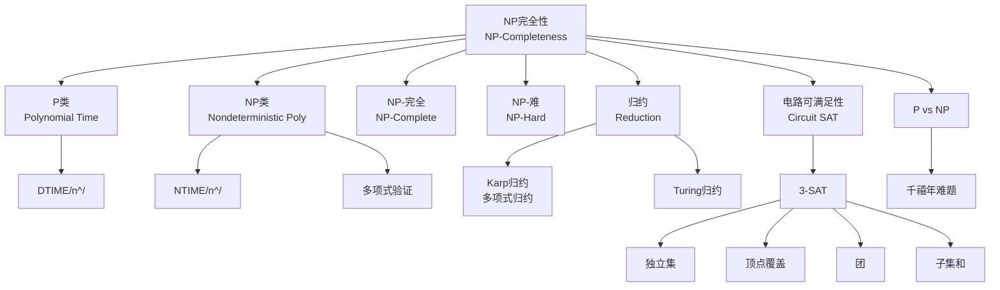
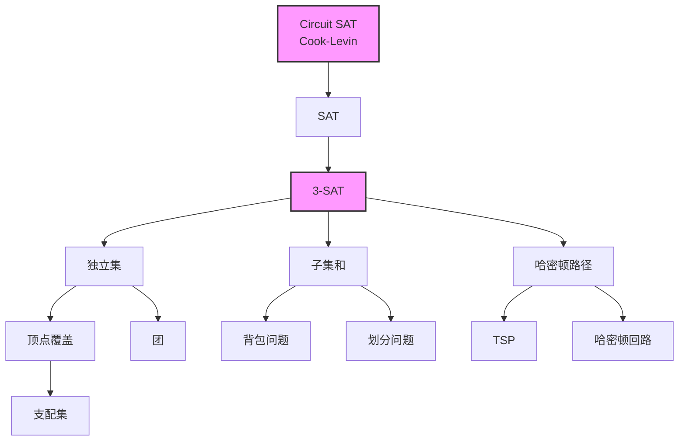

# NP完全性理论 - 六维内容补充


> **版本**: 1.0
> **创建日期**: 2026-04-19
> **最后更新**: 2026-04-19

> **模块**: 09-算法理论/05-NP完全性
> **文档**: 01-NP完全性理论
> **补充维度**: 概念定义、属性、关系、解释、论证、形式证明
> **对标**: MIT 6.046 / Stanford CS161 / CMU 15-451 / Berkeley CS170
> **深度**: 研究生级

---

## 思维导图：NP完全性概念结构



---

## 一、概念定义 (Concept Definition)

### 1.1 复杂性类 P / Complexity Class P

**定义 1.1.1** (形式化)

$$P = \bigcup_{k \geq 1} DTIME(n^k)$$

**P** 是所有能被**确定性图灵机**在**多项式时间**内判定的语言类。

等价定义: 决策问题存在算法 $A$，对输入 $x$（长度 $|x|=n$）：

- $A(x)$ 在 $O(n^k)$ 时间内运行
- $x \in L \Leftrightarrow A(x) = \text{accept}$

---

### 1.2 复杂性类 NP / Complexity Class NP

**定义 1.2.1** (形式化)

**等价定义方式**:

**定义A** (非确定性图灵机):
$$NP = \bigcup_{k \geq 1} NTIME(n^k)$$

**定义B** (多项式验证器):
语言 $L \in NP$ 当且仅当存在多项式时间验证器 $V$：
$$x \in L \Leftrightarrow \exists c \in \{0,1\}^{|x|^{O(1)}}: V(x, c) = \text{accept}$$

其中 $c$ 称为**证书 (certificate)** 或**证据 (witness)**。

**直观**: NP = "**N**ondeterministic **P**olynomial time" 或 "**N**ice **P**roofs"

---

### 1.3 NP完全性 / NP-Completeness

**定义 1.3.1** (形式化)

**Karp归约 / 多项式时间归约**:

语言 $A$ 可多项式归约到 $B$（记作 $A \leq_P B$），如果存在多项式时间可计算函数 $f$：
$$x \in A \Leftrightarrow f(x) \in B$$

**NP完全**:

语言 $L$ 是 **NP完全** 的，如果：

1. $L \in NP$
2. $\forall A \in NP: A \leq_P L$ （NP-hardness）

---

### 1.4 NP难 / NP-Hard

**定义 1.4.1**:

语言 $L$ 是 **NP难** 的，如果：
$$\forall A \in NP: A \leq_P L$$

注意：NP难问题**不一定**属于NP（可能甚至不可判定）。

---

## 二、属性 (Properties)

### 2.1 复杂性类关系

| 关系 | 公式 | 状态 |
|------|------|------|
| **P ⊆ NP** | 显然 | ✅ 已证明 |
| **P = NP?** | 未知 | ❓ 千禧年难题 |
| **NP ⊆ PSPACE** | 显然 | ✅ 已证明 |
| **P = PSPACE?** | 未知 | ❓ 开放问题 |

### 2.2 NP完全问题清单

| 问题 | 输入 | 判定 | 经典归约 |
|------|------|------|----------|
| **SAT** | 布尔公式 | 可满足？ | Cook-Levin |
| **3-SAT** | 3-CNF公式 | 可满足？ | SAT ≤p 3-SAT |
| **独立集 (IS)** | 图G, k | 存在k-独立集？ | 3-SAT ≤p IS |
| **顶点覆盖 (VC)** | 图G, k | 存在k-顶点覆盖？ | IS ≤p VC |
| **团 (Clique)** | 图G, k | 存在k-团？ | VC ≤p Clique |
| **哈密顿回路** | 图G | 存在哈密顿回路？ | 3-SAT ≤p HamPath |
| **TSP判定** | 图G, k | 存在≤k的TSP回路？ | HamCycle ≤p TSP |
| **子集和** | 数集S, t | 存在和为t的子集？ | 3-SAT ≤p SubsetSum |
| **背包判定** | 物品, W, V | 价值≥V且重量≤W？ | SubsetSum ≤p Knapsack |

### 2.3 P vs NP 的推论

| 若 P = NP | 若 P ≠ NP |
|-----------|-----------|
| 所有NP问题有高效算法 | NP完全问题无多项式算法 |
| 密码学崩溃（RSA可破） | 现代密码学安全 |
| 自动定理证明革命 | 创造性/直觉不可替代 |
| 优化问题易解 | 许多优化问题难求解 |

---

## 三、关系 (Relations)

### 3.1 概念关系表

| 源概念 | 目标概念 | 关系类型 | 说明 |
|--------|----------|----------|------|
| P | NP | contained_in | P ⊆ NP |
| NP完全 | NP难 | contained_in | NPC ⊆ NPHard |
| NP完全 | NP | intersect | NPC = NP ∩ NPHard |
| 3-SAT | SAT | reduces_to | 3-SAT ≤p SAT |
| SAT | 3-SAT | polynomial_equivalent | 互可约 |
| Karp归约 | Turing归约 | weaker_than | Karp归约更强 |

### 3.2 NP完全问题归约图



---

## 四、解释 (Explanation)

### 4.1 动机与直观

**为什么研究NP完全性？**

遇到一个新优化问题时的决策树：

```
新问题
  ↓
是否能多项式求解？
  ├─ 是 → P类，设计算法 ✓
  └─ 否/未知 → 尝试证明NP完全性
            ↓
        证明是NP完全
            ↓
    放弃寻找高效精确算法
            ↓
    转向: 近似算法 / 启发式 / 参数化 / 特殊情况
```

**NP完全问题的"坚韧性"**:

数千个问题被证明是NP完全的，它们**要么全部可高效求解，要么全部不可**。

### 4.2 与已有概念的联系

**NP ↔ 搜索与验证**

| 问题 | 搜索 | 验证 |
|------|------|------|
| SAT | 找满足的赋值 | 验证给定赋值 |
| 图同构 | 找同构映射 | 验证给定的映射 |
| 质数判定 | - | - |

**关键洞察**: NP = "易验证"，P = "易求解"

### 4.3 示例与反例

**示例 4.3.1**: 3-SAT 归约到独立集

```
3-SAT公式: (x₁ ∨ x₂ ∨ x₃) ∧ (¬x₁ ∨ ¬x₂ ∨ x₃)

构造图G:
- 每个子句对应一个三角形（三个文字节点）
- 文字x与¬x之间有边（矛盾边）

3-SAT可满足 ⟺ G有k个顶点的独立集（k=子句数）

证明:
(⇒) 选择每个满足子句的一个文字 → 无矛盾 → 独立集
(⇐) k个独立顶点必须每个子句选一个 → 赋值为真 → 满足
```

**反例 4.3.2**: 整数分解

- 整数分解 ∉ NPC（除非NP=co-NP）
- 但整数分解 ∈ NP ∩ co-NP
- 至今未发现多项式算法

---

## 五、论证 (Argumentation)

### 5.1 非形式论证：Cook-Levin定理

**定理**: SAT 是 NP完全的。

**证明概要**:

**(1) SAT ∈ NP**:
证书 = 满足的赋值，验证器检查赋值是否满足公式。

**(2) 所有NP问题可约到SAT**:

设 $L \in NP$，$V$ 是其验证器。

关键洞察: 将 $V$ 的计算转化为布尔电路！

- $V$ 在多项式时间 $p(n)$ 内运行
- 可将 $V$ 的计算 tableau 编码为布尔变量
- 电路约束确保 tableau 表示合法计算
- $V$ 接受 ⟺ 电路可满足

因此 $x \in L \Leftrightarrow C_x$ 可满足。

### 5.2 反例与边界

**边界情况 5.2.1**: NP中间问题

**Ladner定理**: 若 P ≠ NP，则存在 **NP中间** 问题（既不在P中，也不是NP完全）。

示例候选:

- 图同构 (Graph Isomorphism)
- 整数分解 (Integer Factorization)

---

## 六、形式证明 (Formal Proof)

### 6.1 3-SAT的NP完全性

**定理 6.1.1**: 3-SAT 是 NP完全的。

**证明**:

**(1) 3-SAT ∈ NP**: 显然（证书为赋值）。

**(2) SAT ≤p 3-SAT**:

将任意CNF公式转换为等价的3-CNF。

对于子句 $(x_1 \lor x_2 \lor x_3 \lor x_4)$：

引入辅助变量 $y$，拆分为：

- $(x_1 \lor x_2 \lor y)$
- $(\neg y \lor x_3 \lor x_4)$

一般构造: k-文字子句 → O(k)个3-文字子句。

公式可满足当且仅当转换后的3-CNF可满足。

### 6.2 顶点覆盖与独立集的等价性

**定理 6.2.1**: 对于图 $G=(V,E)$，$S$ 是独立集 ⟺ $V \setminus S$ 是顶点覆盖。

**证明**:

**(⇒)**: 设 $S$ 是独立集。对任意边 $(u,v) \in E$，$u$ 和 $v$ 不能同时在 $S$ 中，故至少一个在 $V \setminus S$ 中。因此 $V \setminus S$ 是顶点覆盖。

**(⇐)**: 设 $V \setminus S$ 是顶点覆盖。若 $S$ 不是独立集，则存在边 $(u,v)$ 两端都在 $S$ 中，则该边不被 $V \setminus S$ 覆盖，矛盾。

**推论**: 独立集 ≤p 顶点覆盖 且 顶点覆盖 ≤p 独立集（互补归约）。

---

## 七、NP完全问题证明模板

### 证明问题L是NP完全的标准流程

```
步骤1: 证明 L ∈ NP
    - 给出证书格式
    - 设计多项式时间验证器

步骤2: 证明 L 是 NP难的
    - 选择一个已知的NP完全问题 L'
    - 构造多项式时间归约 f: L' → L
    - 证明 x ∈ L' ⟺ f(x) ∈ L

结论: L 是 NP完全的
```

---

**文档版本**: v1.0
**创建日期**: 2026-04-10
**维护**: 项目算法理论工作组

---

## 参考文献 / References

1. **[CLRS2022]** Cormen, T. H., Leiserson, C. E., Rivest, R. L., & Stein, C. (2022). *Introduction to Algorithms* (4th ed.). MIT Press.
2. **[KleinbergTardos2006]** Kleinberg, J., & Tardos, É. (2006). *Algorithm Design*. Pearson.
3. **[Erickson2019]** Erickson, J. (2019). *Algorithms*. Self-published. <https://jeffe.cs.illinois.edu/teaching/algorithms/>.

**文档版本 / Document Version**: 1.0
**对齐状态**: 已补充权威引用，与项目引用规范对齐。
---

## 知识导航

- [返回目录](README.md)

## 学习目标

- 理解NP完全性理论 - 六维内容补充的核心概念
- 掌握NP完全性理论 - 六维内容补充的形式化表示
