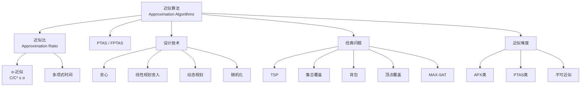

# 近似算法理论 - 六维内容补充


> **版本**: 1.0
> **创建日期**: 2026-04-19
> **最后更新**: 2026-04-19

> **模块**: 09-算法理论/06-近似算法
> **文档**: 01-近似算法理论
> **补充维度**: 概念定义、属性、关系、解释、论证、形式证明
> **对标**: MIT 6.046 / Stanford CS261 / CMU 15-451
> **深度**: 研究生级

---

## 思维导图：近似算法概念结构



---

## 一、概念定义 (Concept Definition)

### 1.1 近似算法 / Approximation Algorithm

**定义 1.1.1** (形式化)

对于优化问题 $\Pi$：

- **最小化问题**: 算法 $A$ 是 **α-近似** 的（$\alpha \geq 1$），如果对所有实例 $I$：
$$A(I) \leq \alpha \cdot OPT(I)$$

- **最大化问题**: 算法 $A$ 是 **α-近似** 的（$0 < \alpha \leq 1$），如果对所有实例 $I$：
$$A(I) \geq \alpha \cdot OPT(I)$$

**近似比 (Approximation Ratio)**:

$$\rho = \sup_I \frac{A(I)}{OPT(I)} \quad \text{(最小化)}$$

---

### 1.2 近似算法层次 / Approximation Hierarchy

| 类 | 定义 | 典型问题 |
|----|------|----------|
| **PO** | 多项式时间最优 | MST, 匹配 |
| **PTAS** | 多项式时间近似方案 | 欧几里得TSP, 背包 |
| **APX** | 常数因子近似 | 顶点覆盖, MAX-SAT |
| **log-APX** | O(log n)近似 | 集合覆盖, 支配集 |
| **poly-APX** | 多项式因子近似 | 最大团 |
| **NPO** | 无界近似 | 一般TSP |

**PTAS**: 对任意 $\epsilon > 0$，存在 $(1+\epsilon)$-近似算法，时间 $O(n^{f(1/\epsilon)})$。

**FPTAS**: PTAS的加强，时间 $O(poly(n, 1/\epsilon))$。

---

### 1.3 不可近似性 / Inapproximability

**定义 1.3.1**: 若存在常数 $c$ 使得获得 $c$-近似是NP难的，则问题**不可近似**。

**PCP定理推论**: 许多问题甚至难以在 $O(\log n)$ 因子内近似。

---

## 二、属性 (Properties)

### 2.1 经典近似算法对比

| 问题 | 近似比 | 技术 | 最优性 |
|------|--------|------|--------|
| **顶点覆盖** | 2 | 匹配/线性规划 | 可能最优 (UGC) |
| **集合覆盖** | $O(\log n)$ | 贪心 | 渐近最优 |
| **欧几里得TSP** | $1+\epsilon$ | PTAS | 最优 (存在PTAS) |
| **一般TSP** | 无界 | - | 不可近似 |
| **MAX-SAT** | 3/4 | LP舍入 | 改进到0.784... |
| **背包** | $1+\epsilon$ | FPTAS | 最优 |
| **最大割** | 0.878... | SDP | 最优 (UGC) |
| **Steiner树** | 1.39... | 改进 greedy | 可能有更好 |

### 2.2 贪心近似分析技术

| 技术 | 核心思想 | 适用场景 |
|------|----------|----------|
| **收费法** | 为解的每个元素分配费用 | 证明上界 |
| **对偶拟合** | 构造可行对偶解 | LP松弛 |
| **局部比** | 递归化简问题 | 覆盖问题 |
| **概率方法** | 随机算法去随机化 | MAX-SAT等 |

---

## 三、关系 (Relations)

### 3.1 概念关系表

| 源概念 | 目标概念 | 关系类型 | 说明 |
|--------|----------|----------|------|
| PTAS | APX | contained_in | PTAS ⊆ APX |
| FPTAS | PTAS | contained_in | FPTAS ⊆ PTAS |
| PO | FPTAS | contained_in | PO ⊆ FPTAS |
| 精确算法 | PTAS | limit_of | 当ε→0时趋近精确 |
| 启发式 | 近似算法 | generalizes | 无保证 vs 有保证 |

---

## 四、解释 (Explanation)

### 4.1 动机与直观

**为什么需要近似算法？**

NP完全问题无法在多项式时间内精确求解（假设P≠NP），但许多应用需要：

- **快速**: 多项式时间
- **质量保证**: 最坏情况下的性能界限

**近似 vs 启发式**:

| | 近似算法 | 启发式算法 |
|--|----------|------------|
| 保证 | 有理论保证 | 通常无 |
| 实际效果 | 可能保守 | 通常更好 |
| 分析难度 | 难 | 易 |

### 4.2 与已有概念的联系

**近似算法 ↔ 松弛**

- **整数规划** → **线性规划松弛** → **舍入**
- **困难约束** → **软约束** → **拉格朗日松弛**

### 4.3 示例

**示例 4.3.1**: 顶点覆盖的2-近似

```
算法: 极大匹配法
1. 找极大匹配M
2. 返回M的所有端点

证明:
- 匹配边不相交，所以|M|个端点
- 任何顶点覆盖必须包含每条匹配边的至少一个端点
- OPT ≥ |M|
- 算法解 = 2|M| ≤ 2·OPT
```

---

## 五、形式证明 (Formal Proof)

### 5.1 集合覆盖贪心算法的对数近似

**定理**: 贪心算法给出 $H_n$-近似，其中 $H_n = \sum_{i=1}^n \frac{1}{i} \approx \ln n$。

**证明概要**:

**收费法**: 为每个被覆盖的元素分配费用。

当集合 $S$ 被选中时（覆盖 $k$ 个新元素），每个新元素收费 $1/k$。

**关键引理**: 对任意集合 $S$，其中元素的总费用 $\leq H_{|S|}$。

因此，贪心解总费用 $\leq \sum_{S \in OPT} H_{|S|} \leq H_n \cdot |OPT|$。

---

**文档版本**: v1.0
**创建日期**: 2026-04-10

---

## 参考文献 / References

1. **[CLRS2022]** Cormen, T. H., Leiserson, C. E., Rivest, R. L., & Stein, C. (2022). *Introduction to Algorithms* (4th ed.). MIT Press.
2. **[KleinbergTardos2006]** Kleinberg, J., & Tardos, É. (2006). *Algorithm Design*. Pearson.
3. **[Erickson2019]** Erickson, J. (2019). *Algorithms*. Self-published. <https://jeffe.cs.illinois.edu/teaching/algorithms/>.

**文档版本 / Document Version**: 1.0
**对齐状态**: 已补充权威引用，与项目引用规范对齐
---

## 知识导航

- [返回目录](README.md)

## 学习目标

- 理解近似算法理论 - 六维内容补充的核心概念
- 掌握近似算法理论 - 六维内容补充的形式化表示
