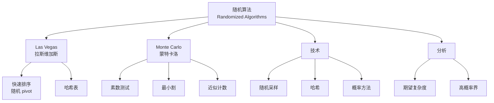

# 随机算法理论 - 六维内容补充

> **版本**: 1.0
> **创建日期**: 2026-04-19
> **最后更新**: 2026-04-19

> **模块**: 09-算法理论/07-随机算法
> **文档**: 01-随机算法理论
> **补充维度**: 概念定义、属性、关系、解释、论证、形式证明
> **对标**: MIT 6.046 / Stanford CS161 / CMU 15-451
> **深度**: 研究生级

---

## 思维导图：随机算法概念结构

---

## 一、概念定义 (Concept Definition)

### 1.1 随机算法分类

**定义 1.1.1**:

| 类型 | 时间 | 结果 | 示例 |
|------|------|------|------|
| **Las Vegas** | 随机 | 总是正确 | 随机快速排序 |
| **Monte Carlo** | 确定 | 可能错误 | 素数测试 |

**期望时间**: $T(n) = \mathbb{E}[\text{运行时间}]$

**高概率**: 以概率 $\geq 1 - 1/n^c$ 成立。

---

### 1.2 随机快速排序

**定义 1.2.1**:

随机选择pivot，期望比较次数：

$$\mathbb{E}[C(n)] = 2n \ln n + O(n)$$

---

### 1.3 素数测试

**定义 1.3.1**: Miller-Rabin测试

对于奇数 $n$，若 $n$ 是合数，则至少 $3/4$ 的见证者能检测出。

重复 $k$ 次，错误概率 $\leq (1/4)^k$。

---

## 二、属性 (Properties)

### 2.1 算法对比

| 算法 | 确定性 | 随机 | 加速 |
|------|--------|------|------|
| **快速排序** | $O(n^2)$ | $O(n \log n)$ 期望 | 避免最坏情况 |
| **选择** | $O(n)$ | $O(n)$ 期望 | 更简单 |
| **素数测试** | $O(\sqrt{n})$ | $O(\log^3 n)$ | 指数级 |
| **最小割** | $O(mn)$ | $O(n^2)$ | 多项式级 |

---

## 三、关系

| 源概念 | 目标概念 | 关系类型 |
|--------|----------|----------|
| Las Vegas | Monte Carlo | converts_to |
| 随机采样 | 概率方法 | enables |
| 哈希 | 随机化 | uses |

---

## 四、解释

### 4.1 为什么随机化有效？

**敌手论证**: 确定性算法可被针对性输入攻击，随机化消除了这种优势。

**信息论**: 随机位提供了额外的"隐藏"信息。

---

## 五、形式证明

### 5.1 随机快速排序期望分析

**定理**: $\mathbb{E}[C(n)] = O(n \log n)$

**证明**:

设 $X_{ij} = \mathbb{1}\{z_i \text{ 与 } z_j \text{ 比较}\}$

$C(n) = \sum_{i<j} X_{ij}$

$z_i$ 与 $z_j$ 比较当且仅当它们是 $\{z_i, \cdots, z_j\}$ 中第一个被选为pivot的。

$$\Pr[X_{ij}=1] = \frac{2}{j-i+1}$$

$$\mathbb{E}[C(n)] = \sum_{i<j} \frac{2}{j-i+1} = 2\sum_{i=1}^n \sum_{k=2}^{n-i+1} \frac{1}{k} = O(n \log n)$$

---

**文档版本**: v1.0
**创建日期**: 2026-04-10

---

## 参考文献 / References

1. **[CLRS2022]** Cormen, T. H., Leiserson, C. E., Rivest, R. L., & Stein, C. (2022). *Introduction to Algorithms* (4th ed.). MIT Press.
2. **[KleinbergTardos2006]** Kleinberg, J., & Tardos, É. (2006). *Algorithm Design*. Pearson.
3. **[Erickson2019]** Erickson, J. (2019). *Algorithms*. Self-published. <https://jeffe.cs.illinois.edu/teaching/algorithms/>.

**文档版本 / Document Version**: 1.0
**对齐状态**: 已补充权威引用，与项目引用规范对齐
---

## 知识导航

- [返回目录](README.md)

## 学习目标

- 理解随机算法理论 - 六维内容补充的核心概念
- 掌握随机算法理论 - 六维内容补充的形式化表示
