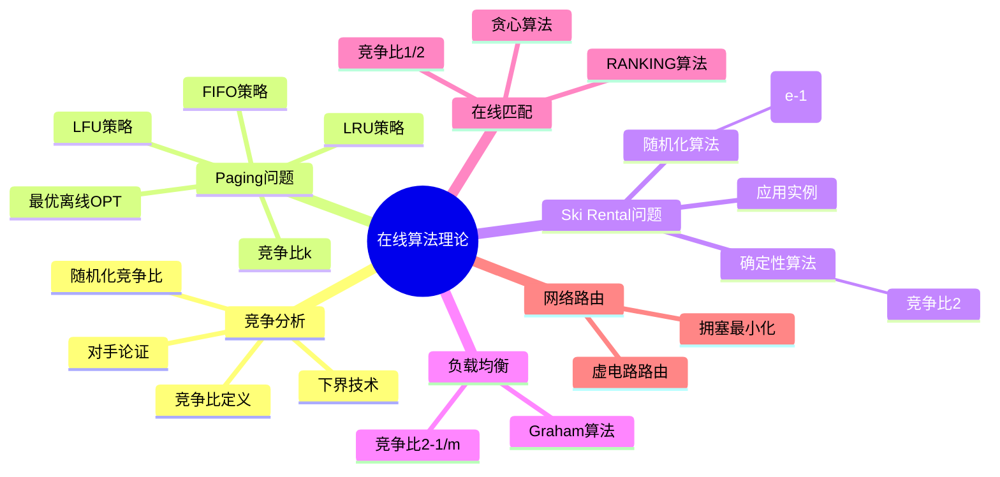
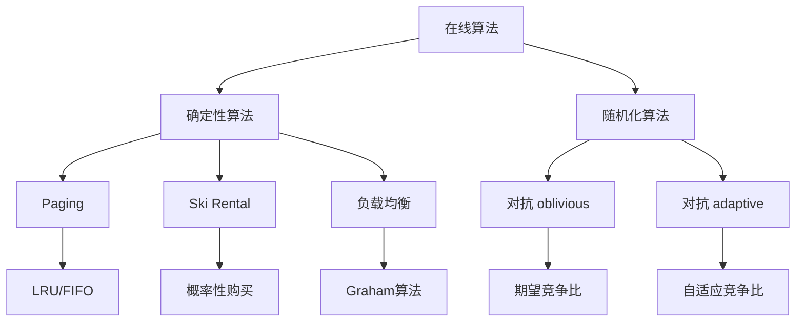
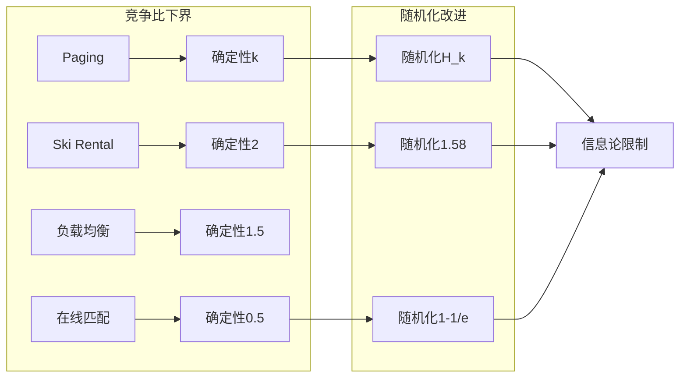
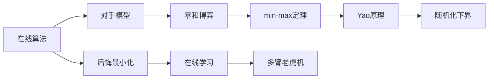

# 在线算法理论 - 六维补充


> **版本**: 1.0
> **创建日期**: 2026-04-19
> **最后更新**: 2026-04-19

## 思维导图



---

## 1. 基础定义

### 1.1 在线算法 vs 离线算法

**在线算法（Online Algorithm）**：

- 输入逐个到达，算法必须在不知道未来输入的情况下立即做出决策
- 决策一旦做出，通常不可撤销或修改

**离线算法（Offline Algorithm）**：

- 输入全部已知，可以基于完整信息做出全局最优决策

$$\text{在线算法} \in \text{输入流处理}, \quad \text{离线算法} \in \text{批量处理}$$

### 1.2 竞争分析框架

**竞争比（Competitive Ratio）**：

对于最小化问题，在线算法 $A$ 的竞争比 $c$ 满足：
$$C_A(\sigma) \leq c \cdot C_{OPT}(\sigma) + \alpha$$

其中：

- $C_A(\sigma)$：算法 $A$ 在输入序列 $\sigma$ 上的成本
- $C_{OPT}(\sigma)$：最优离线算法的成本
- $\alpha$：常数（通常为0或较小值）

**严格竞争比**：当 $\alpha = 0$ 时

### 1.3 竞争比分类

| 类型 | 定义 | 说明 |
|------|------|------|
| **确定性竞争比** | 对所有输入序列的竞争比上界 | 确定性算法 |
| **随机化竞争比** | 期望成本与最优成本的比值 | 对抗 oblivious 对手 |
| **自适应竞争比** | 对抗 adaptive 对手 | 更强的对手模型 |

---

## 2. 六维分析

### 2.1 维度分析表

| 维度 | 分析 | 关联概念 |
|------|------|----------|
| **逻辑结构** | 在线决策形成一棵决策树，每个节点代表一个状态，边代表可能的输入；竞争分析比较在线决策树与最优离线解 | 决策树、博弈树 |
| **代数性质** | 竞争比构成一个偏序关系，可以定义在线算法的支配关系；随机化算法引入概率分布，形成凸组合结构 | 博弈论、线性规划 |
| **证明技术** | 对手论证是核心下界证明技术，通过构造恶意输入序列迫使在线算法表现不佳；势能方法用于上界分析 | 博弈论、Yao原理 |
| **复杂度** | 许多在线问题存在固有的竞争比下界（如Paging问题的k），随机化可降低竞争比（如Ski Rental的e/(e-1)） | 信息论下界 |
| **算法实现** | 实际在线算法需要在信息不完整时做启发式决策，常用贪心、预测、学习增强等策略 | 启发式算法、机器学习 |
| **应用联系** | 广泛应用于缓存管理、调度、路由、广告投放、云计算资源分配等实时决策场景 | 系统优化、经济学 |

### 2.2 在线算法分类图谱



---

## 3. Paging 问题详解

### 3.1 问题定义

**场景**：

- 缓存（快速存储）：容量 $k$ 页
- 主存（慢速存储）：容量 $N$ 页（$N \gg k$）
- 请求序列：页面访问序列 $\sigma = (p_1, p_2, \ldots, p_n)$

**目标**：最小化页面错误（cache miss）次数

**在线约束**：请求到达时必须立即决定，不能预知未来请求

### 3.2 常见算法

| 算法 | 策略 | 竞争比 |
|------|------|--------|
| **LRU** (Least Recently Used) | 淘汰最久未使用的页面 | $k$ |
| **FIFO** (First In First Out) | 淘汰最早进入的页面 | $k$ |
| **LFU** (Least Frequently Used) | 淘汰使用频率最低的页面 | 无界 |
| **LIFO** (Last In First Out) | 淘汰最近进入的页面 | 无界 |
| **OPT** (Belady's) | 淘汰最远将来使用的页面 | 1（离线最优） |

### 3.3 竞争比分析

**定理**：任何确定性Paging算法的竞争比至少为 $k$。

**LRU竞争比上界证明（势能方法）**：

定义势能函数：
$$\Phi = k \times |\text{LRU缓存} \cap \text{OPT缓存}|$$

分析每次请求：

- 若LRU命中，成本为0，势能最多减少 $k$
- 若LRU未命中，成本为1，OPT最多产生 $1/k$ 成本分摊

结论：**LRU竞争比 = $k$**

### 3.4 随机化Paging算法

**标记算法（Marking Algorithm）**：

算法框架：

1. 将请求序列划分为若干阶段（phase）
2. 每个阶段包含至多 $k$ 个不同页面
3. 阶段开始时，所有缓存页面标记为"未标记"
4. 页面被访问时标记为"已标记"
5. 需要淘汰时，均匀随机选择一个"未标记"页面淘汰

**竞争比**：$2H_k - 1$，其中 $H_k = 1 + 1/2 + \cdots + 1/k \approx \ln k$

**下界**：任何随机化Paging算法的竞争比至少为 $H_k$

---

## 4. Ski Rental 问题详解

### 4.1 问题定义

**场景**：

- 滑雪天数 $d$ 未知（在线输入）
- 租滑雪板：每天 $r$ 元
- 买滑雪板：$b$ 元

**目标**：最小化总花费

**关键**：何时从租赁转为购买？

### 4.2 确定性算法

**算法**：租 $b/r - 1$ 天后，如果还在滑就买

**竞争比分析**：

设 $x = b/r$（买/租价格比）

| 实际天数 | 在线成本 | OPT成本 | 比值 |
|----------|----------|---------|------|
| $d < x$ | $d \cdot r$ | $d \cdot r$ | 1 |
| $d \geq x$ | $(x-1) \cdot r + b = 2b - r$ | $b$ | $2 - r/b$ |

**竞争比**：$2 - r/b \approx 2$（当 $b \gg r$ 时）

### 4.3 随机化算法

**概率购买策略**：

设 $p_i$ 为第 $i$ 天购买的概率

最优策略：
$$p_i = \frac{(1 + 1/(x-1))^{i-1}}{(1 + 1/(x-1))^{x-1} - 1} \cdot \frac{1}{x-1}$$

**竞争比**：$\frac{e}{e-1} \approx 1.582$（当 $x \to \infty$ 时）

### 4.4 一般形式与应用

**一般 Ski Rental 问题**：

- 初始化成本：$B$
- 每单位时间运营成本：$r$
- 总使用时间：$T$（未知）

**应用场景**：

| 场景 | 购买成本 | 租赁成本 | 决策 |
|------|----------|----------|------|
| 云服务器 | 预留实例（包年包月） | 按需实例（按小时） | 何时转为预留 |
| 数据库连接 | 长连接维护成本 | 短连接建立成本 | 连接池大小 |
| 缓存预热 | 预加载成本 | 按需加载延迟 | 预热策略 |

---

## 5. 负载均衡问题

### 5.1 问题定义

**场景**：

- $m$ 台相同的机器
- $n$ 个作业依次到达，作业 $j$ 的处理时间为 $p_j$
- 作业一旦分配不可迁移

**目标**：最小化 makespan（最大完成时间）

### 5.2 Graham 算法（List Scheduling）

**算法**：每个作业分配到当前负载最小的机器

**竞争比**：$2 - 1/m$

**证明**：

- 设 $C_{max}$ 为在线算法 makespan
- 设 $C^*$ 为最优 makespan
- 关键观察：$C_{max} \leq \sum p_j / m + p_{max} \leq C^* + C^* - C^*/m = (2 - 1/m)C^*$

### 5.3 改进算法

| 算法 | 策略 | 竞争比 |
|------|------|--------|
| **Graham** | 贪心分配 | $2 - 1/m$ |
| **Sorted List** | 作业按大小排序后分配 | $4/3 - 1/(3m)$ |
| **Prime-Dual** | 原始对偶方法 | $1 + \epsilon$（需要预知） |

---

## 6. 复杂度分析

### 6.1 Paging 问题复杂度表

| 算法类型 | 竞争比 | 备注 |
|----------|--------|------|
| 确定性下界 | $k$ | 任何确定性算法 |
| LRU/FIFO | $k$ | 紧的上界 |
| 随机化下界 | $H_k$ | Yao原理证明 |
| 标记算法 | $2H_k - 1$ | 均匀随机 |
| 改进标记 | $H_k$ | 紧的随机化界 |

### 6.2 在线问题复杂度概览



### 6.3 不同对手模型

| 对手类型 | 信息 | 随机化效果 | 典型结果 |
|----------|------|------------|----------|
| **Oblivious** | 不知随机选择 | 有效改进 | Paging: $H_k$ vs $k$ |
| **Adaptive Online** | 知历史，不知未来 | 部分改进 | 通常略差于 oblivious |
| **Adaptive Offline** | 知所有随机选择 | 无改进 | 等价于确定性 |

---

## 7. 代码示例

### 7.1 Paging 算法实现与竞争分析

```python
"""
Paging 问题在线算法实现与竞争分析
包括 LRU、FIFO、LFU 和 OPT 算法
"""

from collections import deque, OrderedDict
from typing import List, Set, Dict, Tuple, Optional
from dataclasses import dataclass
from enum import Enum

class CacheAlgorithm(Enum):
    LRU = "LRU"
    FIFO = "FIFO"
    LFU = "LFU"
    OPT = "OPT"  # 需要预知未来

def lru_paging(cache_size: int, requests: List[int]) -> Tuple[int, List[int]]:
    """
    LRU (Least Recently Used) 算法
    竞争比: k (缓存大小)

    策略: 淘汰最久未被访问的页面
    """
    cache: OrderedDict[int, None] = OrderedDict()
    faults = 0
    fault_sequence = []

    for req in requests:
        if req in cache:
            # 命中：移动到最近使用
            cache.move_to_end(req)
        else:
            # 未命中
            faults += 1
            fault_sequence.append(req)

            if len(cache) >= cache_size:
                # 淘汰最久未使用的
                cache.popitem(last=False)

            cache[req] = None

    return faults, fault_sequence

def fifo_paging(cache_size: int, requests: List[int]) -> Tuple[int, List[int]]:
    """
    FIFO (First In First Out) 算法
    竞争比: k (缓存大小)

    策略: 淘汰最早进入缓存的页面
    """
    cache: deque = deque()
    cache_set: Set[int] = set()
    faults = 0
    fault_sequence = []

    for req in requests:
        if req in cache_set:
            # 命中
            pass
        else:
            # 未命中
            faults += 1
            fault_sequence.append(req)

            if len(cache) >= cache_size:
                # 淘汰最早进入的
                oldest = cache.popleft()
                cache_set.remove(oldest)

            cache.append(req)
            cache_set.add(req)

    return faults, fault_sequence

def lfu_paging(cache_size: int, requests: List[int]) -> Tuple[int, List[int]]:
    """
    LFU (Least Frequently Used) 算法
    竞争比: 无界

    策略: 淘汰使用频率最低的页面
    """
    cache: Dict[int, int] = {}  # page -> frequency
    faults = 0
    fault_sequence = []

    for req in requests:
        if req in cache:
            # 命中：增加频率
            cache[req] += 1
        else:
            # 未命中
            faults += 1
            fault_sequence.append(req)

            if len(cache) >= cache_size:
                # 淘汰频率最低的
                min_freq = min(cache.values())
                for page, freq in cache.items():
                    if freq == min_freq:
                        del cache[page]
                        break

            cache[req] = 1

    return faults, fault_sequence

def opt_paging(cache_size: int, requests: List[int]) -> Tuple[int, List[int]]:
    """
    OPT (Belady's Algorithm) 最优离线算法
    竞争比: 1

    策略: 淘汰最远将来才会被使用的页面
    需要预知整个请求序列
    """
    cache: Set[int] = set()
    faults = 0
    fault_sequence = []

    for i, req in enumerate(requests):
        if req in cache:
            # 命中
            continue

        # 未命中
        faults += 1
        fault_sequence.append(req)

        if len(cache) >= cache_size:
            # 找到每个页面下次被使用的位置
            farthest = -1
            page_to_evict = None

            for page in cache:
                # 查找下次使用位置
                next_use = float('inf')
                for j in range(i + 1, len(requests)):
                    if requests[j] == page:
                        next_use = j
                        break

                if next_use == float('inf'):
                    # 不再使用，直接淘汰
                    page_to_evict = page
                    break
                elif next_use > farthest:
                    farthest = next_use
                    page_to_evict = page

            cache.remove(page_to_evict)

        cache.add(req)

    return faults, fault_sequence

class MarkingAlgorithm:
    """
    标记算法（随机化Paging算法）
    竞争比: O(log k)
    """

    def __init__(self, cache_size: int):
        self.k = cache_size
        self.cache: Set[int] = set()
        self.marked: Set[int] = set()
        import random
        self.random = random

    def access(self, page: int) -> bool:
        """访问页面，返回是否命中"""
        # 检查是否新阶段
        if page not in self.marked and page not in self.cache:
            # 新阶段开始（访问了未标记的新页面）
            if len(self.marked) >= self.k:
                # 阶段结束，清除标记
                self.marked.clear()

        if page in self.cache:
            # 命中
            self.marked.add(page)
            return True

        # 未命中
        if len(self.cache) >= self.k:
            # 随机淘汰未标记页面
            unmarked_in_cache = self.cache - self.marked
            if unmarked_in_cache:
                victim = self.random.choice(list(unmarked_in_cache))
            else:
                # 所有页面都被标记，随机淘汰
                victim = self.random.choice(list(self.cache))
                self.marked.remove(victim)
            self.cache.remove(victim)

        self.cache.add(page)
        self.marked.add(page)
        return False

    def run(self, requests: List[int]) -> int:
        """运行并返回缺页次数"""
        faults = 0
        for req in requests:
            if not self.access(req):
                faults += 1
        return faults


def competitive_analysis_demo():
    """竞争分析演示"""
    print("=" * 70)
    print("Paging 竞争分析演示")
    print("=" * 70)

    # 构造一个对LRU友好但对FIFO困难的序列
    k = 3  # 缓存大小

    # 序列: 1,2,3,4,1,2,3,4,... (循环访问k+1个页面)
    requests = []
    for _ in range(5):  # 5轮
        for i in range(1, k + 2):
            requests.append(i)

    print(f"\n缓存大小 k = {k}")
    print(f"请求序列: {requests[:20]}...")

    # 测试各种算法
    lru_faults, _ = lru_paging(k, requests)
    fifo_faults, _ = fifo_paging(k, requests)
    lfu_faults, _ = lfu_paging(k, requests)
    opt_faults, _ = opt_paging(k, requests)

    print(f"\nLRU 缺页次数: {lru_faults}")
    print(f"FIFO 缺页次数: {fifo_faults}")
    print(f"LFU 缺页次数: {lfu_faults}")
    print(f"OPT 缺页次数: {opt_faults}")

    print(f"\n竞争比分析:")
    print(f"  LRU/OPT = {lru_faults/opt_faults:.2f}")
    print(f"  FIFO/OPT = {fifo_faults/opt_faults:.2f}")
    print(f"  理论竞争比上界: k = {k}")

    # 随机化算法
    marking = MarkingAlgorithm(k)
    marking_faults = marking.run(requests)
    print(f"\n标记算法（随机化）缺页次数: {marking_faults}")
    print(f"  标记算法竞争比: O(log k) = O({__import__('math').log(k):.2f})")


def adversary_sequence_demo():
    """对手构造恶意序列演示"""
    print("\n" + "=" * 70)
    print("对手论证演示：构造对任何确定性算法都困难的序列")
    print("=" * 70)

    k = 3
    # 对手策略：总是请求不在缓存中的页面
    # 这迫使算法每次都要发生缺页

    # 构造序列：1,2,3,4,1,2,3,4,... (k+1个页面的循环)
    pages = list(range(1, k + 2))

    print(f"\n对于 k={k} 的缓存，对手使用 {k+1} 个不同页面: {pages}")
    print("对手策略：总是请求当前不在缓存中的页面")

    # 对确定性算法，对手可以预知其决策
    # 构造的序列使得算法每次请求都缺页

    print(f"\n确定性算法每次请求都缺页")
    print(f"而 OPT 算法最多每 k 次请求缺页 1 次")
    print(f"因此竞争比至少为 k = {k}")


# ============ Ski Rental 问题 ============

class SkiRental:
    """
    Ski Rental 问题实现
    购买价格 B，租赁价格 r（每天）
    """

    def __init__(self, buy_cost: int, rent_per_day: int):
        self.B = buy_cost
        self.r = rent_per_day
        self.threshold = buy_cost // rent_per_day

    def deterministic_strategy(self, actual_days: int) -> Tuple[int, str]:
        """
        确定性策略：租 threshold-1 天，如果还在滑就买
        竞争比: 2 - r/B
        """
        if actual_days < self.threshold:
            cost = actual_days * self.r
            strategy = f"租 {actual_days} 天"
        else:
            cost = (self.threshold - 1) * self.r + self.B
            strategy = f"租 {self.threshold - 1} 天后购买"

        return cost, strategy

    def randomized_strategy(self, actual_days: int, trials: int = 1000) -> Tuple[float, str]:
        """
        随机化策略：按概率分布决定购买时间
        竞争比: e/(e-1) ≈ 1.582
        """
        import random
        import math

        total_cost = 0

        # 计算最优概率分布
        x = self.B / self.r
        if x <= 1:
            # 直接购买更划算
            return self.B, "直接购买"

        # 简化：使用几何分布
        p = 1 / x

        for _ in range(trials):
            # 随机决定购买天数
            buy_day = 0
            cum_prob = 0
            for day in range(1, int(x) + 1):
                prob = (1/(x-1)) * ((1 + 1/(x-1)) ** (day-1)) / ((1 + 1/(x-1)) ** (x-1) - 1)
                cum_prob += prob
                if random.random() < prob / (1 - cum_prob + prob):
                    buy_day = day
                    break

            if buy_day == 0:
                buy_day = int(x)

            if actual_days < buy_day:
                cost = actual_days * self.r
            else:
                cost = (buy_day - 1) * self.r + self.B

            total_cost += cost

        avg_cost = total_cost / trials
        return avg_cost, f"随机化购买（期望成本）"

    def opt_cost(self, actual_days: int) -> int:
        """最优离线成本：知道实际天数后的最优决策"""
        buy_cost = self.B
        rent_cost = actual_days * self.r
        return min(buy_cost, rent_cost)

    def analyze(self, max_days: int = 20):
        """分析不同策略的竞争比"""
        print(f"\nSki Rental 分析 (B={self.B}, r={self.r})")
        print(f"购买阈值: {self.threshold} 天")
        print("-" * 60)
        print(f"{'天数':<8} {'OPT':<8} {'确定性':<10} {'竞争比':<10} {'随机化':<10}")
        print("-" * 60)

        for days in range(1, max_days + 1):
            opt = self.opt_cost(days)
            det, _ = self.deterministic_strategy(days)
            rand, _ = self.randomized_strategy(days, trials=100)

            ratio = det / opt
            print(f"{days:<8} {opt:<8} {det:<10.0f} {ratio:<10.2f} {rand:<10.1f}")


def ski_rental_demo():
    """Ski Rental 演示"""
    print("\n" + "=" * 70)
    print("Ski Rental 问题演示")
    print("=" * 70)

    # 设置：购买100元，每天租赁10元
    ski = SkiRental(buy_cost=100, rent_per_day=10)
    ski.analyze(max_days=15)

    print(f"\n竞争比理论值:")
    print(f"  确定性: 2 - r/B = 2 - {10}/{100} = {2 - 10/100:.2f}")
    print(f"  随机化: e/(e-1) ≈ 2.718/1.718 ≈ 1.582")


# ============ 主程序 ============

if __name__ == "__main__":
    competitive_analysis_demo()
    adversary_sequence_demo()
    ski_rental_demo()

    print("\n" + "=" * 70)
    print("在线算法理论要点总结")
    print("=" * 70)
    print("""
1. 竞争分析: 在线算法成本 / 最优离线成本

2. Paging 问题:
   - 确定性算法竞争比: k (缓存大小)
   - 随机化算法竞争比: H_k = O(log k)
   - LRU/FIFO 达到紧界

3. Ski Rental 问题:
   - 确定性竞争比: 2
   - 随机化竞争比: e/(e-1) ≈ 1.582

4. 对手论证: 构造恶意输入序列证明下界

5. Yao原理: 随机化算法的竞争比 ≥ 确定性算法的平均竞争比
    """)
```

## 7.2 在线匹配算法实现

### 7.2 在线匹配算法实现

```python
"""
在线二分匹配算法
- 贪心算法：竞争比 1/2
- RANKING算法：竞争比 1 - 1/e ≈ 0.632
"""

from typing import List, Set, Dict, Optional, Tuple
import random

class OnlineMatching:
    """在线二分匹配问题"""

    def __init__(self, left_nodes: List[str], right_nodes: List[str]):
        self.left = left_nodes  # 离线节点（已知）
        self.right = right_nodes  # 在线节点（依次到达）
        self.edges: Dict[str, Set[str]] = {}  # 邻接表

    def add_edge(self, u: str, v: str):
        """添加边 u-v"""
        if v not in self.edges:
            self.edges[v] = set()
        self.edges[v].add(u)

    def greedy_match(self, arrival_order: List[str]) -> Set[Tuple[str, str]]:
        """
        贪心在线匹配算法
        竞争比: 1/2

        策略：每个右节点到达时，匹配任意可用左节点
        """
        matching: Set[Tuple[str, str]] = set()
        available_left = set(self.left)

        for v in arrival_order:
            if v not in self.edges:
                continue

            # 寻找可用邻居
            neighbors = self.edges[v] & available_left
            if neighbors:
                u = neighbors.pop()  # 任意选择一个
                matching.add((u, v))
                available_left.remove(u)

        return matching

    def ranking_match(self, arrival_order: List[str]) -> Set[Tuple[str, str]]:
        """
        RANKING算法（Karp, Vazirani, Vazirani）
        竞争比: 1 - 1/e ≈ 0.632

        策略：随机排序左节点，每个右节点匹配排名最高的可用邻居
        """
        # 随机排序左节点
        random_ranking = list(self.left)
        random.shuffle(random_ranking)
        rank: Dict[str, int] = {node: i for i, node in enumerate(random_ranking)}

        matching: Set[Tuple[str, str]] = set()
        available_left = set(self.left)

        for v in arrival_order:
            if v not in self.edges:
                continue

            # 找到排名最高的可用邻居
            neighbors = self.edges[v] & available_left
            if neighbors:
                u = min(neighbors, key=lambda x: rank[x])
                matching.add((u, v))
                available_left.remove(u)

        return matching

    def optimal_offline(self) -> Set[Tuple[str, str]]:
        """
        最优离线匹配（匈牙利算法简化版）
        需要知道所有右节点及其边
        """
        # 构建完整图
        all_edges: List[Tuple[str, str]] = []
        for v, neighbors in self.edges.items():
            for u in neighbors:
                all_edges.append((u, v))

        # 使用贪心近似（实际应用应使用匈牙利算法）
        matching: Set[Tuple[str, str]] = set()
        used_left: Set[str] = set()
        used_right: Set[str] = set()

        for u, v in all_edges:
            if u not in used_left and v not in used_right:
                matching.add((u, v))
                used_left.add(u)
                used_right.add(v)

        return matching


def online_matching_demo():
    """在线匹配演示"""
    print("=" * 70)
    print("在线二分匹配演示")
    print("=" * 70)

    # 构造二分图
    left = ['L1', 'L2', 'L3', 'L4', 'L5']
    right = ['R1', 'R2', 'R3', 'R4', 'R5']

    matcher = OnlineMatching(left, right)

    # 添加边（随机生成）
    random.seed(42)
    for r in right:
        for l in left:
            if random.random() < 0.6:  # 60%概率有边
                matcher.add_edge(l, r)

    print("\n图结构（邻接表）:")
    for r in right:
        neighbors = matcher.edges.get(r, set())
        print(f"  {r}: {neighbors}")

    # 多次运行取平均
    n_trials = 100
    greedy_total = 0
    ranking_total = 0

    for _ in range(n_trials):
        arrival = list(right)
        random.shuffle(arrival)

        greedy = matcher.greedy_match(arrival)
        ranking = matcher.ranking_match(arrival)

        greedy_total += len(greedy)
        ranking_total += len(ranking)

    opt = matcher.optimal_offline()

    print(f"\n最优离线匹配大小: {len(opt)}")
    print(f"贪心算法平均匹配大小: {greedy_total/n_trials:.2f}")
    print(f"RANKING算法平均匹配大小: {ranking_total/n_trials:.2f}")

    print(f"\n竞争比分析:")
    print(f"  贪心竞争比（实验）: {(greedy_total/n_trials)/len(opt):.3f}")
    print(f"  贪心竞争比（理论）: 0.5")
    print(f"  RANKING竞争比（实验）: {(ranking_total/n_trials)/len(opt):.3f}")
    print(f"  RANKING竞争比（理论）: 1 - 1/e ≈ 0.632")


if __name__ == "__main__":
    online_matching_demo()
```

---

## 8. 与其他概念的联系

### 8.1 在线算法与博弈论



### 8.2 与机器学习的结合

| 方向 | 方法 | 应用 |
|------|------|------|
| **预测增强** | 使用ML预测未来请求 | Paging、缓存 |
| **在线学习** | 后悔最小化框架 | 投资组合、调度 |
| **强化学习** | 策略梯度优化 | 网络路由、资源分配 |

---

## 9. 参考文献

1. **S. Ben-David et al.**, "Competitive Analysis of Algorithms", *Online Algorithms: The State of the Art*, 1998
2. **A. Borodin and R. El-Yaniv**, "Online Computation and Competitive Analysis", Cambridge University Press, 1998
3. **A. Fiat and G. Woeginger**, "Online Algorithms: The State of the Art", Springer, 1998
4. **R. M. Karp et al.**, "An Optimal Algorithm for On-line Bipartite Matching", *Proceedings of STOC*, 1990
5. **A. R. Karlin et al.**, "Competitive Randomized Algorithms for Nonuniform Problems", *Algorithmica*, 1994

---

## 参考文献

- 待补充

---

## 知识导航

- [返回目录](README.md)

## 学习目标

- 理解在线算法理论 - 六维补充的核心概念
- 掌握在线算法理论 - 六维补充的形式化表示
