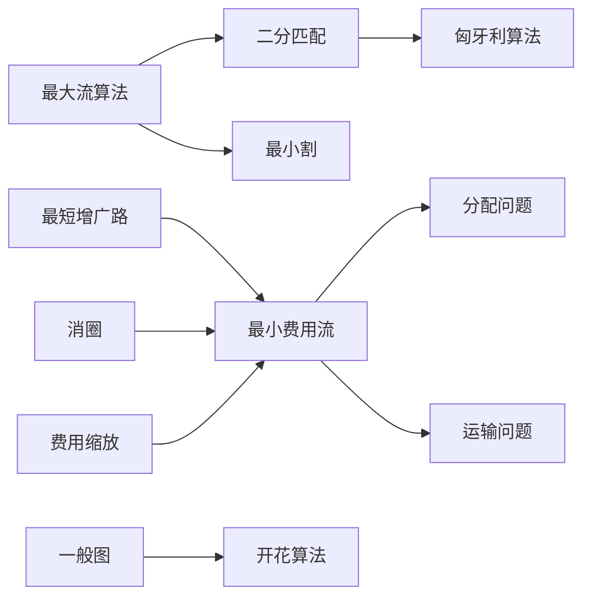

# 网络流高级 - 六维内容补充


> **版本**: 1.0
> **创建日期**: 2026-04-19
> **最后更新**: 2026-04-19

> **模块**: 09-算法理论
> **文档**: 09-图算法高级/01-网络流高级
> **补充维度**: 概念定义、属性、关系、解释、论证、形式证明
> **对标**: Stanford CS161 / MIT 6.046 / CMU 15-451
> **深度**: 研究生级

---

## 思维导图：网络流高级概念结构

```mermaid
graph TD
    NFA[网络流高级<br/>Advanced Network Flow] --> MCMF[最小费用流<br/>Min-Cost Max-Flow]
    NFA --> MATCH[匹配算法<br/>Matching]
    NFA --> CIRC[循环流<br/>Circulation]
    NFA --> GOMORY[割与多商品流<br/>Cuts & Multi-commodity]

    MCMF --> SSP[最短增广路<br/>Successive SP]
    MCMF --> CAPACITY[容量缩放<br/>Capacity Scaling]
    MCMF --> CYCLE[消圈算法<br/>Cycle Canceling]
    MCMF --> COSTSCALE[费用缩放<br/>Cost Scaling]

    MATCH --> BIPARTITE[二分匹配<br/>Bipartite]
    MATCH --> HUNGARIAN[匈牙利算法<br/>Hungarian]
    MATCH >>> BLOSSOM[开花算法<br/>Blossom]
    MATCH >>> GENERAL[一般图匹配<br/>General Graph]

    CIRC --> LOWER[下界约束<br/>Lower Bounds]
    CIRC >>> DEMAND[需求约束<br/>Demands]

    GOMORY >>> MAXFLOW[最大流-最小割<br/>Max-Flow Min-Cut]
    GOMORY >>> GOMORYTREE[Gomory-Hu树<br/>Cut Tree]
    GOMORY >>> MULTI[多商品流<br/>Multi-commodity]

    MCMF --> COMPLEXITY[复杂度分析<br/>Complexity]
    MATCH --> APPLICATIONS[应用<br/>Applications]
```

---

## 一、概念定义 (Concept Definition)

### 1.1 最小费用流 (Min-Cost Max-Flow)

**定义 1.1.1** (形式化)

给定流网络 $G = (V, E)$，其中：

- $c: E \rightarrow \mathbb{R}_+$: 容量函数
- $a: E \rightarrow \mathbb{R}$: 单位费用函数
- $s, t \in V$: 源点和汇点

**最小费用流问题**: 在所有流量为 $F$ 的可行流中，找到总费用最小的流。

$$\min \sum_{(u,v) \in E} a(u,v) \cdot f(u,v)$$

约束条件:
$$\begin{aligned}
&\sum_{v} f(u,v) - \sum_{v} f(v,u) = \begin{cases} F & u = s \\ -F & u = t \\ 0 & \text{otherwise} \end{cases} \\
&0 \leq f(u,v) \leq c(u,v)
\end{aligned}$$

**定义 1.1.2** (残量网络)

对于流 $f$，残量网络 $G_f = (V, E_f)$：
- 正向边 $(u,v)$: 残量 $c_f(u,v) = c(u,v) - f(u,v)$，费用 $a(u,v)$
- 反向边 $(v,u)$: 残量 $c_f(v,u) = f(u,v)$，费用 $-a(u,v)$

---

### 1.2 匹配算法 (Matching Algorithms)

**定义 1.2.1** (匹配)

图 $G = (V, E)$ 的**匹配** $M \subseteq E$ 满足：
$$\forall e_1, e_2 \in M: e_1 \cap e_2 = \emptyset$$

**最大匹配**: 基数最大的匹配
**完美匹配**: 覆盖所有顶点的匹配

**定义 1.2.2** (二分图匹配)

对于二分图 $G = (L \cup R, E)$，匹配 $M$ 满足 $M \subseteq E$ 且无边共享端点。

**定义 1.2.3** (匈牙利算法 / Kuhn-Munkres)

用于求解**最大权二分匹配**（分配问题）：

给定二分图 $G = (L \cup R, E)$ 和边权 $w: E \rightarrow \mathbb{R}$，求总权最大的完美匹配。

**定义 1.2.4** (Edmonds开花算法)

用于一般图（非二分图）的最大匹配：
- 处理奇圈（开花）的收缩操作
- 时间复杂度 $O(|V|^4)$，优化后 $O(|E||V|^{1/2})$

---

### 1.3 循环流与下界 (Circulation with Lower Bounds)

**定义 1.3.1** (循环流)

循环流是没有源汇点的流，满足每个顶点的**流量守恒**:
$$\forall v \in V: \sum_{(u,v) \in E} f(u,v) = \sum_{(v,w) \in E} f(v,w)$$

**定义 1.3.2** (带下界的流网络)

边有下界 $l(u,v)$ 和容量 $c(u,v)$，要求:
$$l(u,v) \leq f(u,v) \leq c(u,v)$$

---

## 二、属性 (Properties)

### 2.1 最小费用流性质

| 性质 | 说明 | 应用 |
|------|------|------|
| **最优性条件** | 残量网络无负权圈 | 验证最优性 |
| **整数性** | 整数容量和费用 → 整数最优流 | 组合优化 |
| **凸性** | 最小费用是流量的凸函数 | 参数优化 |
| **对偶性** | 原始-对偶关系 | 算法设计 |

### 2.2 匹配算法复杂度

| 问题 | 算法 | 时间复杂度 |
|------|------|-----------|
| 二分匹配 (最大基数) | Hopcroft-Karp | $O(|E|\sqrt{|V|})$ |
| 二分匹配 (最大权) | 匈牙利算法 | $O(|V|^3)$ |
| 一般图匹配 (最大基数) | Edmonds开花 | $O(|V|^4)$ → $O(|E|\sqrt{|V|})$ |
| 一般图匹配 (最大权) | Gabow | $O(|V|^3)$ |
| 网络流 (单位容量) | Dinic | $O(\min(|E|^{1/2}, |V|^{2/3})|E|)$ |

### 2.3 最小费用流算法复杂度

| 算法 | 时间复杂度 | 特点 |
|------|-----------|------|
| 最短增广路 (SSP) | $O(F \cdot (|E| + |V|\log|V|))$ | 简单，适合小流量 |
| 容量缩放 | $O(|E|\log|U| \cdot (|E| + |V|\log|V|))$ | $U$ = 最大容量 |
| 消圈算法 | $O(|V||E|^2 \cdot C)$ | $C$ = 最大费用 |
| 费用缩放 | $O(|E|\log|V| \cdot (|E| + |V|\log|V|))$ | 理论最优 |
| 网络单纯形 | 多项式平均，指数最坏 | 实际很快 |

---

## 三、关系 (Relationships)

### 3.1 问题归约关系

```
最大流
    ├── 二分匹配（归约到最大流）
    ├── 最小割（对偶问题）
    └── 边不交路径

最小费用流
    ├── 最小费用最大流
    ├── 运输问题
    ├── 分配问题（匈牙利算法）
    └── 循环流

匹配
    ├── 二分图匹配
    │   └── 匈牙利算法
    ├── 一般图匹配
    │   └── Edmonds开花算法
    └── 带权匹配
        ├── 分配问题
        └── 中国邮路问题
```

### 3.2 算法关系图



---

## 四、解释 (Explanation)

### 4.1 最小费用流的直观理解

**类比**: 货物运输网络
- 每条道路有**容量限制**（最多运多少）
- 每条道路有**单位费用**（每吨每公里多少钱）
- 目标: 在满足需求的前提下**总费用最小**

**最优性条件**: 残量网络中没有负费用圈
- 如果有负圈，沿圈增流可以降低成本
- 直到没有负圈，达到最优

### 4.2 匈牙利算法的直观

**分配问题**: 将 $n$ 个工人分配给 $n$ 个工作，每个分配有成本，求最小总成本。

**关键思想**:
1. **势函数**: 给每个工人/工作分配一个"势"
2. **缩减成本**: $c'_{ij} = c_{ij} - u_i - v_j$
3. 在缩减成本为0的边上找完美匹配

**König定理**: 最大匹配 = 最小点覆盖（二分图）

### 4.3 Edmonds开花算法的核心思想

**问题**: 一般图中找增广路时，可能遇到**奇圈**（交替树中的奇圈）。

**开花**: 奇圈收缩为单个顶点
- 圈内恰好有一个未匹配顶点
- 收缩后继续在收缩图中找增广路
- 找到后展开收缩，调整匹配

---

## 五、论证 (Argumentation)

### 5.1 为什么匈牙利算法有效？

**论证**:

**关键引理**: 若对所有边 $(i,j)$，缩减成本 $c'_{ij} \geq 0$，且完美匹配 $M$ 满足 $c'_{ij} = 0$ 对所有 $(i,j) \in M$，则 $M$ 是最小成本的。

**证明**:
- 任何完美匹配的成本 ≥ 所有势函数之和（因为 $c'_{ij} \geq 0$）
- 匹配 $M$ 的成本 = 所有势函数之和（因为 $c'_{ij} = 0$ 对匹配边）
- 因此 $M$ 最优

### 5.2 最小费用流最优性条件

**定理**: 流 $f$ 是最小费用流当且仅当残量网络 $G_f$ 中不存在负费用圈。

**论证**:
- **(⇒)** 若有负圈，沿圈增流可降低总费用
- **(⇐)** 若 $G_f$ 无负圈，则流是最优的（可通过势函数证明）

---

## 六、形式证明 (Formal Proof)

### 6.1 最大流-最小割定理证明

**定理**: 最大流值 = 最小割容量

**证明**:

**引理 1**: 对任意流 $f$ 和任意割 $(S, T)$，$|f| \leq c(S, T)$。

*证明*:
$$|f| = \sum_{u \in S, v \in T} f(u,v) - \sum_{u \in S, v \in T} f(v,u) \leq \sum_{u \in S, v \in T} c(u,v) = c(S,T)$$

**引理 2**: 若残量网络 $G_f$ 中不存在 $s$-$t$ 路径，则存在割 $(S, T)$ 使得 $|f| = c(S, T)$。

*证明*:
设 $S$ 为 $G_f$ 中从 $s$ 可达的顶点集，$T = V \setminus S$。

对于 $(u,v)$ 跨越割:
- 若 $u \in S, v \in T$，则 $f(u,v) = c(u,v)$（否则 $v$ 可达）
- 若 $u \in T, v \in S$，则 $f(u,v) = 0$（否则 $u$ 可达）

因此:
$$|f| = \sum_{u \in S, v \in T} c(u,v) = c(S,T)$$

**主定理**: 由引理1，$|f| \leq c(S,T)$ 对所有割成立；由引理2，当流最大时等号成立。

∎

### 6.2 匈牙利算法的正确性

**定理**: 匈牙利算法返回最大权完美匹配。

**证明概要**:

**不变式**: 每次迭代后，存在一个完美匹配仅使用零缩减成本的边。

**步骤 1**: 初始时，势函数全为0，需调整使零边存在。

**步骤 2**: 若当前匹配非完美，计算:
$$\delta = \min_{i \in L, j \notin R} c'_{ij}$$

其中 $L$ 是左侧未匹配可达点，$R$ 是右侧可达点。

**步骤 3**: 更新势函数:
$$u_i \leftarrow u_i + \delta \text{ (对 } i \in L \text{)}$$
$$v_j \leftarrow v_j - \delta \text{ (对 } j \in R \text{)}$$

**步骤 4**: 至少有一条新边变为零成本，可扩展匹配。

**终止**: 匹配大小增加，最多 $n$ 次达到完美匹配。

∎

---

## 七、多语言实现

### 7.1 Python: 最小费用流 (SPFA)

```python
from typing import List, Tuple, Optional
import heapq

class MinCostMaxFlow:
    """最小费用最大流 - 连续最短增广路算法"""

    def __init__(self, n: int):
        self.n = n
        self.graph = [[] for _ in range(n)]

    def add_edge(self, fr: int, to: int, cap: int, cost: int):
        """添加边，同时添加反向边"""
        forward = [to, cap, cost, None]  # to, cap, cost, rev
        backward = [fr, 0, -cost, None]
        forward[3] = backward
        backward[3] = forward
        self.graph[fr].append(forward)
        self.graph[to].append(backward)

    def flow(self, s: int, t: int, maxf: int = float('inf')) -> Tuple[int, int]:
        """
        返回: (流量, 费用)
        若maxf指定，求流量不超过maxf的最小费用流
        否则求最大流的最小费用
        """
        n = self.n
        flow = 0
        cost = 0

        while flow < maxf:
            # SPFA找最短路径
            dist = [float('inf')] * n
            inqueue = [False] * n
            parent = [None] * n  # (prev_node, edge_index)

            dist[s] = 0
            queue = [s]
            inqueue[s] = True

            while queue:
                u = queue.pop(0)
                inqueue[u] = False

                for i, e in enumerate(self.graph[u]):
                    v, cap, w, _ = e
                    if cap > 0 and dist[u] + w < dist[v]:
                        dist[v] = dist[u] + w
                        parent[v] = (u, i)
                        if not inqueue[v]:
                            queue.append(v)
                            inqueue[v] = True

            if dist[t] == float('inf'):
                break  # 无增广路

            # 计算可增广流量
            addf = maxf - flow
            v = t
            while v != s:
                u, ei = parent[v]
                addf = min(addf, self.graph[u][ei][1])
                v = u

            # 增广
            v = t
            while v != s:
                u, ei = parent[v]
                e = self.graph[u][ei]
                rev = e[3]
                e[1] -= addf
                rev[1] += addf
                cost += addf * e[2]
                v = u

            flow += addf

        return flow, cost


def assignment_problem(cost_matrix: List[List[int]]) -> Tuple[int, List[int]]:
    """
    分配问题: 匈牙利算法
    返回: (最小成本, 分配方案)
    cost_matrix[i][j] = 将任务j分配给工人i的成本
    """
    n = len(cost_matrix)
    m = len(cost_matrix[0])
    assert n == m, "必须是方阵"

    # 转换为最小费用流
    # 源点 = 0, 工人 = 1..n, 任务 = n+1..2n, 汇点 = 2n+1
    N = 2 * n + 2
    source, sink = 0, N - 1
    mcmf = MinCostMaxFlow(N)

    # 源点到工人
    for i in range(n):
        mcmf.add_edge(source, 1 + i, 1, 0)

    # 工人到任务
    for i in range(n):
        for j in range(n):
            mcmf.add_edge(1 + i, 1 + n + j, 1, cost_matrix[i][j])

    # 任务到汇点
    for j in range(n):
        mcmf.add_edge(1 + n + j, sink, 1, 0)

    flow, cost = mcmf.flow(source, sink, n)
    assert flow == n, "无法找到完美匹配"

    # 提取分配方案
    assignment = [-1] * n
    for i in range(n):
        for e in mcmf.graph[1 + i]:
            if 1 <= e[0] - 1 - n < n and e[1] == 0:  # 容量为0表示已使用
                assignment[i] = e[0] - 1 - n
                break

    return cost, assignment


# 示例
if __name__ == "__main__":
    # 最小费用流示例
    mcmf = MinCostMaxFlow(4)
    mcmf.add_edge(0, 1, 3, 1)
    mcmf.add_edge(0, 2, 2, 2)
    mcmf.add_edge(1, 2, 2, 1)
    mcmf.add_edge(1, 3, 2, 3)
    mcmf.add_edge(2, 3, 3, 1)

    flow, cost = mcmf.flow(0, 3)
    print(f"最大流: {flow}, 最小费用: {cost}")

    # 分配问题示例
    cost = [
        [4, 1, 3],
        [2, 5, 1],
        [3, 2, 4]
    ]
    min_cost, assignment = assignment_problem(cost)
    print(f"\n分配问题最小成本: {min_cost}")
    print(f"分配方案: {assignment}")
    for i, j in enumerate(assignment):
        print(f"  工人{i} -> 任务{j}, 成本: {cost[i][j]}")
```

## 7.2 Rust: Hopcroft-Karp二分匹配 + 网络流
### 7.2 Rust: Hopcroft-Karp二分匹配 + 网络流

```rust
use std::collections::{VecDeque, HashMap};

/// Hopcroft-Karp算法: 二分图最大匹配
/// 时间复杂度: O(E * sqrt(V))
pub struct HopcroftKarp {
    n_left: usize,
    n_right: usize,
    adj: Vec<Vec<usize>>,  // 从左部到右部的边
    pair_left: Vec<Option<usize>>,   // 左部顶点的匹配
    pair_right: Vec<Option<usize>>,  // 右部顶点的匹配
    dist: Vec<i32>,
}

impl HopcroftKarp {
    pub fn new(n_left: usize, n_right: usize) -> Self {
        HopcroftKarp {
            n_left,
            n_right,
            adj: vec![vec![]; n_left],
            pair_left: vec![None; n_left],
            pair_right: vec![None; n_right],
            dist: vec![0; n_left],
        }
    }

    pub fn add_edge(&mut self, u: usize, v: usize) {
        assert!(u < self.n_left && v < self.n_right);
        self.adj[u].push(v);
    }

    fn bfs(&mut self) -> bool {
        let mut queue = VecDeque::new();

        for u in 0..self.n_left {
            if self.pair_left[u].is_none() {
                self.dist[u] = 0;
                queue.push_back(u);
            } else {
                self.dist[u] = i32::MAX;
            }
        }

        let mut found_augmenting = false;

        while let Some(u) = queue.pop_front() {
            for &v in &self.adj[u] {
                if let Some(u2) = self.pair_right[v] {
                    if self.dist[u2] == i32::MAX {
                        self.dist[u2] = self.dist[u] + 1;
                        queue.push_back(u2);
                    }
                } else {
                    found_augmenting = true;  // 找到增广路
                }
            }
        }

        found_augmenting
    }

    fn dfs(&mut self, u: usize) -> bool {
        for &v in &self.adj[u].clone() {
            if let Some(u2) = self.pair_right[v] {
                if self.dist[u2] == self.dist[u] + 1 && self.dfs(u2) {
                    self.pair_left[u] = Some(v);
                    self.pair_right[v] = Some(u);
                    return true;
                }
            } else {
                self.pair_left[u] = Some(v);
                self.pair_right[v] = Some(u);
                return true;
            }
        }

        self.dist[u] = i32::MAX;
        false
    }

    pub fn max_matching(&mut self) -> usize {
        let mut matching = 0;

        while self.bfs() {
            for u in 0..self.n_left {
                if self.pair_left[u].is_none() && self.dfs(u) {
                    matching += 1;
                }
            }
        }

        matching
    }

    pub fn get_matching(&self) -> Vec<(usize, usize)> {
        self.pair_left.iter()
            .enumerate()
            .filter_map(|(u, &v)| v.map(|v| (u, v)))
            .collect()
    }
}

/// Dinic算法: 最大流
pub struct Dinic {
    n: usize,
    graph: Vec<Vec<Edge>>,
    level: Vec<i32>,
    iter: Vec<usize>,
}

struct Edge {
    to: usize,
    rev: usize,
    cap: i64,
}

impl Dinic {
    pub fn new(n: usize) -> Self {
        Dinic {
            n,
            graph: vec![vec![]; n],
            level: vec![0; n],
            iter: vec![0; n],
        }
    }

    pub fn add_edge(&mut self, fr: usize, to: usize, cap: i64) {
        let forward = Edge { to, rev: self.graph[to].len(), cap };
        let backward = Edge { to: fr, rev: self.graph[fr].len(), cap: 0 };
        self.graph[fr].push(forward);
        self.graph[to].push(backward);
    }

    fn bfs(&mut self, s: usize, t: usize) -> bool {
        self.level.fill(-1);
        self.level[s] = 0;

        let mut queue = VecDeque::new();
        queue.push_back(s);

        while let Some(v) = queue.pop_front() {
            for e in &self.graph[v] {
                if e.cap > 0 && self.level[e.to] < 0 {
                    self.level[e.to] = self.level[v] + 1;
                    queue.push_back(e.to);
                }
            }
        }

        self.level[t] >= 0
    }

    fn dfs(&mut self, v: usize, t: usize, f: i64) -> i64 {
        if v == t {
            return f;
        }

        let len = self.graph[v].len();
        for i in self.iter[v]..len {
            self.iter[v] = i;
            let e = &self.graph[v][i];

            if e.cap > 0 && self.level[v] < self.level[e.to] {
                let d = self.dfs(e.to, t, f.min(e.cap));
                if d > 0 {
                    // 修改容量
                    let to = e.to;
                    let rev = e.rev;
                    self.graph[v][i].cap -= d;
                    self.graph[to][rev].cap += d;
                    return d;
                }
            }
        }

        0
    }

    pub fn max_flow(&mut self, s: usize, t: usize) -> i64 {
        let mut flow = 0;

        while self.bfs(s, t) {
            self.iter.fill(0);
            loop {
                let f = self.dfs(s, t, i64::MAX);
                if f == 0 {
                    break;
                }
                flow += f;
            }
        }

        flow
    }
}

# [cfg(test)]
mod tests {
    use super::*;

    #[test]
    fn test_hopcroft_karp() {
        let mut hk = HopcroftKarp::new(4, 4);
        hk.add_edge(0, 0);
        hk.add_edge(0, 1);
        hk.add_edge(1, 1);
        hk.add_edge(1, 2);
        hk.add_edge(2, 2);
        hk.add_edge(2, 3);
        hk.add_edge(3, 3);

        let matching = hk.max_matching();
        assert_eq!(matching, 4);  // 完美匹配
    }

    #[test]
    fn test_dinic() {
        let mut dinic = Dinic::new(4);
        dinic.add_edge(0, 1, 10);
        dinic.add_edge(0, 2, 5);
        dinic.add_edge(1, 2, 15);
        dinic.add_edge(1, 3, 10);
        dinic.add_edge(2, 3, 10);

        let flow = dinic.max_flow(0, 3);
        assert_eq!(flow, 15);
    }
}
```

---

## 八、网络流算法速查表

| 问题 | 算法 | 时间复杂度 |
|------|------|-----------|
| 最大流 | Dinic | $O(E V^2)$ |
| 最大流 | Push-Relabel | $O(V^3)$ |
| 二分匹配 | Hopcroft-Karp | $O(E\sqrt{V})$ |
| 最小费用流 | SSP | $O(F E \log V)$ |
| 分配问题 | 匈牙利 | $O(V^3)$ |
| 一般图匹配 | Edmonds | $O(V^4)$ |

---

## 参考文献

1. Ahuja, R. K., Magnanti, T. L., & Orlin, J. B. (1993). *Network Flows: Theory, Algorithms, and Applications*. Prentice Hall.
2. Kleinberg, J. & Tardos, É. (2006). *Algorithm Design*. Pearson.
3. Cormen, T. H. et al. (2009). *Introduction to Algorithms* (3rd Edition). MIT Press.
4. Schrijver, A. (2003). *Combinatorial Optimization: Polyhedra and Efficiency*. Springer.
5. Micali, S. & Vazirani, V. V. (1980). An $O(\sqrt{|V|} \cdot |E|)$ algorithm for finding maximum matching in general graphs. *FOCS*.

---

**文档版本**: v1.0
**创建日期**: 2026-04-10
**维护**: 项目算法理论工作组
---

## 知识导航

- [返回目录](README.md)

## 学习目标

- 理解网络流高级 - 六维内容补充的核心概念
- 掌握网络流高级 - 六维内容补充的形式化表示
