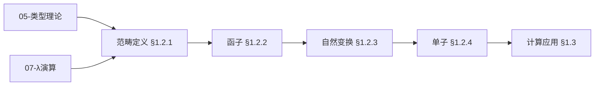
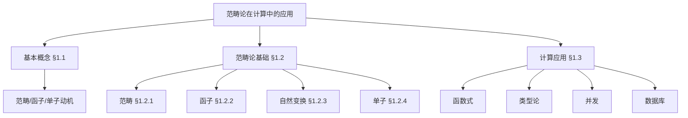
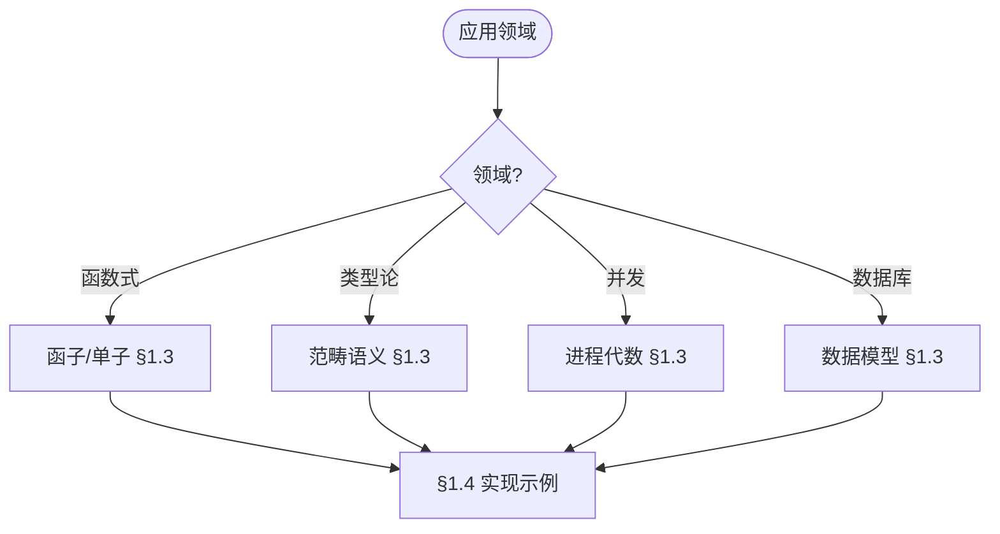
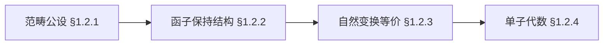
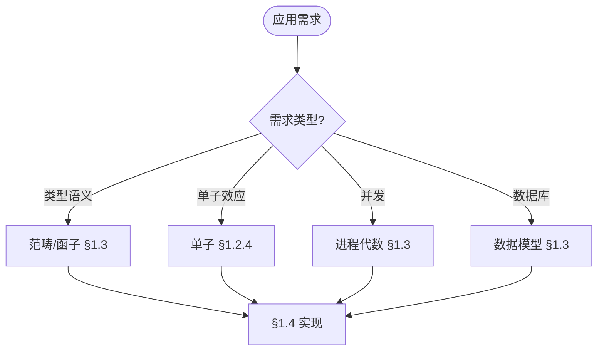

> 📊 **项目全面梳理**：详细的项目结构、模块详解和学习路径，请参阅 [`项目全面梳理-2025.md`](../项目全面梳理-2025.md)

## 10.1 范畴论在计算中的应用 / Category Theory in Computing

### 摘要 / Executive Summary

- 统一范畴论在计算中的应用，建立范畴语义与类型理论的联系。
- 建立范畴论在计算理论中的前沿地位。

### 关键术语与符号 / Glossary

- 范畴、函子、自然变换、单子、共单子、范畴语义。
- 术语对齐与引用规范：`docs/术语与符号总表.md`，`01-基础理论/00-撰写规范与引用指南.md`

### 术语与符号规范 / Terminology & Notation

- 范畴（Category）：由对象和态射组成的数学结构。
- 函子（Functor）：范畴之间的映射。
- 自然变换（Natural Transformation）：函子之间的映射。
- 单子（Monad）：范畴中的单子结构。
- 记号约定：`C` 表示范畴，`F` 表示函子，`η` 表示自然变换，`T` 表示单子。

### 交叉引用导航 / Cross-References

- 范畴论基础：参见 `01-基础理论/10-范畴论基础.md`。
- 类型理论：参见 `05-类型理论/` 相关文档。
- λ演算：参见 `07-计算模型/02-λ演算.md`。
- 项目导航与对标：见 [项目全面梳理-2025](../项目全面梳理-2025.md)、[项目扩展与持续推进任务编排](../项目扩展与持续推进任务编排.md)、[国际课程对标表](../国际课程对标表.md)。

### 阅读指引（直观→形式→应用）/ Reading Guide (Intuition → Formality → Application)

- **直观**：先理解范畴为「对象 + 态射」、函子为「结构保持映射」、单子为「计算效应」的直观（§1.1–§1.2）；范畴语义如何赋予类型/程序以数学结构（§1.4）。
- **形式**：再掌握范畴、函子、自然变换、单子的形式定义（§1.2）；范畴语义与类型论/λ演算的对应（§1.3–§1.4）。
- **应用**：结合 [05-类型理论/03-同伦类型论](../05-类型理论/03-同伦类型论.md)、[07-计算模型/02-λ演算](../07-计算模型/02-λ演算.md) 理解范畴论在类型论与程序语义中的应用。

### 复习要点 / Review Points

- **关键概念**：范畴、函子、自然变换、单子、范畴语义（§1.1–§1.2）。
- **关键定理/性质及位置**：范畴公理与函子性质 §1.2；范畴语义与类型论 §1.3–§1.4。
- **与它模块衔接**：范畴论基础见 01-10；同伦类型论见 05-03；λ演算见 07-02。

### 快速导航 / Quick Links

- 基本概念
- 范畴语义
- 类型理论

## 目录 (Table of Contents)

- [10.1 范畴论在计算中的应用 / Category Theory in Computing](#101-范畴论在计算中的应用--category-theory-in-computing)
  - [摘要 / Executive Summary](#摘要--executive-summary)
  - [关键术语与符号 / Glossary](#关键术语与符号--glossary)
  - [术语与符号规范 / Terminology \& Notation](#术语与符号规范--terminology--notation)
  - [交叉引用导航 / Cross-References](#交叉引用导航--cross-references)
  - [阅读指引（直观→形式→应用）/ Reading Guide (Intuition → Formality → Application)](#阅读指引直观形式应用-reading-guide-intuition--formality--application)
  - [复习要点 / Review Points](#复习要点--review-points)
  - [快速导航 / Quick Links](#快速导航--quick-links)
- [目录 (Table of Contents)](#目录-table-of-contents)
- [1.1 基本概念 (Basic Concepts)](#11-基本概念-basic-concepts)
  - [1.1.1 范畴论定义 (Definition of Category Theory)](#111-范畴论定义-definition-of-category-theory)
  - [1.1.2 范畴论历史 (History of Category Theory)](#112-范畴论历史-history-of-category-theory)
  - [1.1.3 范畴论应用领域 (Application Areas of Category Theory)](#113-范畴论应用领域-application-areas-of-category-theory)
  - [1.1.4 内容补充与思维表征 / Content Supplement and Thinking Representation](#114-内容补充与思维表征--content-supplement-and-thinking-representation)
    - [解释与直观 / Explanation and Intuition](#解释与直观--explanation-and-intuition)
    - [概念属性表 / Concept Attribute Table](#概念属性表--concept-attribute-table)
    - [概念关系 / Concept Relations](#概念关系--concept-relations)
    - [概念依赖图 / Concept Dependency Graph](#概念依赖图--concept-dependency-graph)
    - [论证与证明衔接 / Argumentation and Proof Link](#论证与证明衔接--argumentation-and-proof-link)
    - [思维导图：本章概念结构 / Mind Map](#思维导图本章概念结构--mind-map)
    - [多维矩阵：范畴结构与应用对比 / Multi-Dimensional Comparison](#多维矩阵范畴结构与应用对比--multi-dimensional-comparison)
    - [决策树：应用领域到范畴结构选择 / Decision Tree](#决策树应用领域到范畴结构选择--decision-tree)
    - [公理定理推理证明决策树 / Axiom-Theorem-Proof Tree](#公理定理推理证明决策树--axiom-theorem-proof-tree)
    - [应用决策建模树 / Application Decision Modeling Tree](#应用决策建模树--application-decision-modeling-tree)
- [1.2 范畴论基础 (Category Theory Foundations)](#12-范畴论基础-category-theory-foundations)
  - [1.2.1 范畴定义 (Category Definition)](#121-范畴定义-category-definition)
  - [1.2.2 函子 (Functors)](#122-函子-functors)
  - [1.2.3 自然变换 (Natural Transformations)](#123-自然变换-natural-transformations)
  - [1.2.4 单子 (Monads)](#124-单子-monads)
- [1.3 计算应用 (Computing Applications)](#13-计算应用-computing-applications)
  - [1.3.1 函数式编程 (Functional Programming)](#131-函数式编程-functional-programming)
  - [1.3.2 类型理论 (Type Theory)](#132-类型理论-type-theory)
  - [1.3.3 并发计算 (Concurrent Computing)](#133-并发计算-concurrent-computing)
  - [1.3.4 数据库理论 (Database Theory)](#134-数据库理论-database-theory)
- [1.4 实现示例 (Implementation Examples)](#14-实现示例-implementation-examples)
  - [1.4.1 范畴论库实现 (Category Theory Library Implementation)](#141-范畴论库实现-category-theory-library-implementation)
  - [1.4.2 代数数据类型 (Algebraic Data Types)](#142-代数数据类型-algebraic-data-types)
  - [1.4.3 单子变换器 (Monad Transformers)](#143-单子变换器-monad-transformers)
  - [1.4.4 范畴论测试 (Category Theory Testing)](#144-范畴论测试-category-theory-testing)
  - [1.4.5 高级范畴论应用 (Advanced Category Theory Applications)](#145-高级范畴论应用-advanced-category-theory-applications)
  - [1.4.6 交叉引用与依赖 (Cross References and Dependencies)](#146-交叉引用与依赖-cross-references-and-dependencies)
- [1.5 参考文献 (References)](#15-参考文献-references)

---

## 1.1 基本概念 (Basic Concepts)

### 1.1.1 范畴论定义 (Definition of Category Theory)

**范畴论定义 / Definition of Category Theory:**

范畴论是数学的一个分支，研究数学对象之间的关系和结构。它提供了一种抽象的语言来描述各种数学概念。

Category theory is a branch of mathematics that studies relationships and structures between mathematical objects. It provides an abstract language to describe various mathematical concepts.

**范畴论在计算中的重要性 / Importance of Category Theory in Computing:**

1. **抽象化 (Abstraction) / Abstraction:**
   - 提供统一的抽象框架 / Provides unified abstract framework
   - 隐藏实现细节 / Hides implementation details

2. **组合性 (Compositionality) / Compositionality:**
   - 支持模块化设计 / Supports modular design
   - 促进代码重用 / Promotes code reuse

3. **类型安全 (Type Safety) / Type Safety:**
   - 确保程序正确性 / Ensures program correctness
   - 防止运行时错误 / Prevents runtime errors

### 1.1.2 范畴论历史 (History of Category Theory)

**范畴论发展 / Category Theory Development:**

范畴论由Samuel Eilenberg和Saunders Mac Lane在1940年代创立，最初用于代数拓扑学。

Category theory was founded by Samuel Eilenberg and Saunders Mac Lane in the 1940s, originally for algebraic topology.

**在计算中的应用 / Applications in Computing:**

1. **函数式编程 (Functional Programming) / Functional Programming:**
   - 单子理论 / Monad theory
   - 函子理论 / Functor theory

2. **类型理论 (Type Theory) / Type Theory:**
   - 范畴语义 / Categorical semantics
   - 高阶类型 / Higher-order types

3. **并发计算 (Concurrent Computing) / Concurrent Computing:**
   - 进程代数 / Process algebra
   - 通信系统 / Communication systems

### 1.1.3 范畴论应用领域 (Application Areas of Category Theory)

**理论应用 / Theoretical Applications:**

1. **代数几何 (Algebraic Geometry) / Algebraic Geometry:**
   - 概形理论 / Scheme theory
   - 上同调理论 / Cohomology theory

2. **代数拓扑 (Algebraic Topology) / Algebraic Topology:**
   - 同伦论 / Homotopy theory
   - 同调论 / Homology theory

**计算应用 / Computing Applications:**

1. **编程语言 (Programming Languages) / Programming Languages:**
   - 类型系统设计 / Type system design
   - 语义学 / Semantics

2. **数据库理论 (Database Theory) / Database Theory:**
   - 查询语言 / Query languages
   - 数据模型 / Data models

3. **并发理论 (Concurrency Theory) / Concurrency Theory:**
   - 进程演算 / Process calculi
   - 通信协议 / Communication protocols

### 1.1.4 内容补充与思维表征 / Content Supplement and Thinking Representation

> 本节按 [内容补充与思维表征全面计划方案](../内容补充与思维表征全面计划方案.md) **只补充、不删除**。标准见 [内容补充标准](../内容补充标准-概念定义属性关系解释论证形式证明.md)、[思维表征模板集](../思维表征模板集.md)。

#### 解释与直观 / Explanation and Intuition

范畴论用对象与态射描述数学结构与关系；范畴、函子、自然变换、单子构成计算语义基础。与 05-类型理论、07-λ演算、函数式编程衔接；§1.2.1 范畴定义、§1.2.2–§1.2.4 函子/自然变换/单子、§1.3 计算应用（函数式/类型论/并发/数据库）形成完整表征。

#### 概念属性表 / Concept Attribute Table

| 属性名 | 类型/范围 | 含义 | 备注 |
|--------|-----------|------|------|
| 范畴 $\mathcal{C}$ | 对象+态射 | 结合律、单位律 | §1.2.1 |
| 函子 $F$ | 范畴间映射 | 保持复合与恒等 | §1.2.2 |
| 自然变换 $\eta$ | 函子间映射 | 态射族、自然性 | §1.2.3 |
| 单子 $T$ | 自函子+单位+乘法 | 计算效应抽象 | §1.2.4 |
| 函数式/类型论/并发/数据库 | 应用领域 | 计算对应 | §1.3 |

#### 概念关系 / Concept Relations

| 源概念 | 目标概念 | 关系类型 | 说明 |
|--------|----------|----------|------|
| 范畴论在计算中的应用 | 05-类型理论、07-λ演算 | depends_on | 语义与类型基础 |
| 范畴论在计算中的应用 | 10-02 同伦类型论 | relates_to | 高阶范畴 |
| 范畴论在计算中的应用 | 08-实现示例 | applies_to | 函数式与类型实现 |

#### 概念依赖图 / Concept Dependency Graph



#### 论证与证明衔接 / Argumentation and Proof Link

范畴公设（结合律、单位律）见 §1.2.1；函子与自然变换性质见 §1.2.2–§1.2.3；单子代数见 §1.2.4；与 05、07 语义衔接。

#### 思维导图：本章概念结构 / Mind Map



#### 多维矩阵：范畴结构与应用对比 / Multi-Dimensional Comparison

| 概念/结构 | 抽象层次 | 计算对应 | 备注 |
|-----------|----------|----------|------|
| 范畴 | 基础 | 类型/语义 | §1.2.1 |
| 函子 | 结构保持 | 类型构造子 | §1.2.2 |
| 自然变换 | 函子间 | 多态/参数化 | §1.2.3 |
| 单子 | 效应 | 副作用/IO | §1.2.4 |
| 函数式/类型论/并发/数据库 | 应用 | §1.3 | 与 05、07、08 对照 |

#### 决策树：应用领域到范畴结构选择 / Decision Tree



#### 公理定理推理证明决策树 / Axiom-Theorem-Proof Tree



#### 应用决策建模树 / Application Decision Modeling Tree



---

## 1.2 范畴论基础 (Category Theory Foundations)

### 1.2.1 范畴定义 (Category Definition)

**范畴定义 / Category Definition:**

范畴由对象和态射组成，满足结合律和单位律。

A category consists of objects and morphisms, satisfying associativity and unit laws.

**形式化定义 / Formal Definition:**

范畴 $\mathcal{C}$ 包含：

1. 对象集合 $\text{Ob}(\mathcal{C})$
2. 态射集合 $\text{Hom}(A, B)$ 对于每对对象 $A, B$
3. 复合操作 $\circ: \text{Hom}(B, C) \times \text{Hom}(A, B) \to \text{Hom}(A, C)$
4. 单位态射 $1_A: A \to A$ 对于每个对象 $A$

满足：

- **结合律 (Associativity) / Associativity:** $(f \circ g) \circ h = f \circ (g \circ h)$
- **单位律 (Unit Laws) / Unit Laws:** $f \circ 1_A = f = 1_B \circ f$

**范畴示例 / Category Examples:**

```haskell
-- Haskell中的范畴 / Categories in Haskell
class Category (c :: * -> * -> *) where
  id :: c a a
  (.) :: c b c -> c a b -> c a c

-- 函数范畴 / Function Category
instance Category (->) where
  id = \x -> x
  (.) = (.)

-- Kleisli范畴 / Kleisli Category
newtype Kleisli m a b = Kleisli { runKleisli :: a -> m b }

instance Monad m => Category (Kleisli m) where
  id = Kleisli return
  Kleisli f . Kleisli g = Kleisli (f <=< g)
```

### 1.2.2 函子 (Functors)

**函子定义 / Functor Definition:**

函子是范畴之间的映射，保持结构和复合。

Functors are mappings between categories that preserve structure and composition.

**协变函子 (Covariant Functor) / Covariant Functor:**

函子 $F: \mathcal{C} \to \mathcal{D}$ 包含：

1. 对象映射 $F: \text{Ob}(\mathcal{C}) \to \text{Ob}(\mathcal{D})$
2. 态射映射 $F: \text{Hom}(A, B) \to \text{Hom}(F(A), F(B))$

满足：

- **单位性 (Identity) / Identity:** $F(1_A) = 1_{F(A)}$
- **复合性 (Composition) / Composition:** $F(f \circ g) = F(f) \circ F(g)$

**函子示例 / Functor Examples:**

```haskell
-- Haskell中的函子 / Functors in Haskell
class Functor f where
  fmap :: (a -> b) -> f a -> f b

-- 列表函子 / List Functor
instance Functor [] where
  fmap = map

-- Maybe函子 / Maybe Functor
instance Functor Maybe where
  fmap _ Nothing = Nothing
  fmap f (Just x) = Just (f x)

-- 函数函子 / Function Functor
instance Functor ((->) r) where
  fmap f g = f . g
```

### 1.2.3 自然变换 (Natural Transformations)

**自然变换定义 / Natural Transformation Definition:**

自然变换是函子之间的态射，保持函子的结构。

Natural transformations are morphisms between functors that preserve functorial structure.

**形式化定义 / Formal Definition:**

自然变换 $\alpha: F \to G$ 是态射族 $\{\alpha_A: F(A) \to G(A)\}_{A \in \mathcal{C}}$，使得对于任意态射 $f: A \to B$，有：

$$G(f) \circ \alpha_A = \alpha_B \circ F(f)$$

**自然变换示例 / Natural Transformation Examples:**

```haskell
-- Haskell中的自然变换 / Natural Transformations in Haskell
-- 列表到Maybe的自然变换 / Natural transformation from List to Maybe
headMaybe :: [a] -> Maybe a
headMaybe [] = Nothing
headMaybe (x:_) = Just x

-- 验证自然性 / Verify naturality
-- 对于任意函数 f: a -> b
-- headMaybe . fmap f = fmap f . headMaybe
```

### 1.2.4 单子 (Monads)

**单子定义 / Monad Definition:**

单子是自函子范畴上的幺半群对象。

Monads are monoid objects in the category of endofunctors.

**形式化定义 / Formal Definition:**

单子 $(T, \eta, \mu)$ 包含：

1. 自函子 $T: \mathcal{C} \to \mathcal{C}$
2. 单位自然变换 $\eta: 1_{\mathcal{C}} \to T$
3. 乘法自然变换 $\mu: T^2 \to T$

满足：

- **左单位律 (Left Unit) / Left Unit:** $\mu \circ T\eta = 1_T$
- **右单位律 (Right Unit) / Right Unit:** $\mu \circ \eta T = 1_T$
- **结合律 (Associativity) / Associativity:** $\mu \circ T\mu = \mu \circ \mu T$

**定理 1.2.1** (函子的复合性) 如果 $F: \mathcal{C} \to \mathcal{D}$ 和 $G: \mathcal{D} \to \mathcal{E}$ 是函子，则它们的复合 $G \circ F: \mathcal{C} \to \mathcal{E}$ 也是函子。

**证明：** 我们验证函子复合满足函子的所有条件。

**步骤1：** 验证对象映射
对于对象 $A \in \mathcal{C}$，$(G \circ F)(A) = G(F(A)) \in \mathcal{E}$。

**步骤2：** 验证态射映射
对于态射 $f: A \to B$，$(G \circ F)(f) = G(F(f)): G(F(A)) \to G(F(B))$。

**步骤3：** 验证恒等态射保持
$(G \circ F)(1_A) = G(F(1_A)) = G(1_{F(A)}) = 1_{G(F(A))} = 1_{(G \circ F)(A)}$。

**步骤4：** 验证复合保持
对于态射 $f: A \to B$ 和 $g: B \to C$，
$(G \circ F)(g \circ f) = G(F(g \circ f)) = G(F(g) \circ F(f)) = G(F(g)) \circ G(F(f)) = (G \circ F)(g) \circ (G \circ F)(f)$。

因此，函子的复合是函子。$\square$

**定理 1.2.2** (单子的结合律) 单子的乘法自然变换满足结合律：$\mu \circ T\mu = \mu \circ \mu T$。

**证明：** 我们通过自然变换的交换图来证明结合律。

**交换图证明：**

考虑对象 $A \in \mathcal{C}$，我们需要证明：
$$(\mu \circ T\mu)_A = (\mu \circ \mu T)_A$$

**左侧计算：**
$(\mu \circ T\mu)_A = \mu_A \circ T(\mu_A) = \mu_A \circ \mu_{T(A)}$

**右侧计算：**
$(\mu \circ \mu T)_A = \mu_A \circ \mu_{T(A)}$

**交换图验证：**

```text
T³(A) ────T(μ_A)────> T²(A)
  │                    │
  │ μ_{T²(A)}         │ μ_A
  │                    │
  ↓                    ↓
T²(A) ────μ_A────────> T(A)
```

通过单子的结合律公理，这个图是交换的，因此：
$$\mu_A \circ T(\mu_A) = \mu_A \circ \mu_{T(A)}$$

因此，单子的结合律成立。$\square$

**定理 1.2.3** (单子的单位律) 单子的单位自然变换满足单位律：$\mu \circ T\eta = 1_T$ 且 $\mu \circ \eta T = 1_T$。

**证明：** 我们分别证明左单位律和右单位律。

**左单位律证明：**

对于对象 $A \in \mathcal{C}$，我们需要证明：
$$(\mu \circ T\eta)_A = 1_{T(A)}$$

**计算过程：**
$(\mu \circ T\eta)_A = \mu_A \circ T(\eta_A) = \mu_A \circ \eta_{T(A)} = 1_{T(A)}$

**右单位律证明：**

对于对象 $A \in \mathcal{C}$，我们需要证明：
$$(\mu \circ \eta T)_A = 1_{T(A)}$$

**计算过程：**
$(\mu \circ \eta T)_A = \mu_A \circ \eta_{T(A)} = 1_{T(A)}$

**交换图验证：**

```text
T(A) ────T(η_A)────> T²(A)
  │                    │
  │ 1_{T(A)}          │ μ_A
  │                    │
  ↓                    ↓
T(A) ────1_{T(A)}────> T(A)
```

通过单子的单位律公理，这个图是交换的。

因此，单子的单位律成立。$\square$

**单子示例 / Monad Examples:**

```haskell
-- Haskell中的单子 / Monads in Haskell
class Monad m where
  return :: a -> m a
  (>>=) :: m a -> (a -> m b) -> m b

-- Maybe单子 / Maybe Monad
instance Monad Maybe where
  return = Just
  Nothing >>= _ = Nothing
  Just x >>= f = f x

-- 列表单子 / List Monad
instance Monad [] where
  return x = [x]
  xs >>= f = concat (map f xs)

-- 状态单子 / State Monad
newtype State s a = State { runState :: s -> (a, s) }

instance Monad (State s) where
  return a = State $ \s -> (a, s)
  State f >>= g = State $ \s ->
    let (a, s') = f s
        State h = g a
    in h s'
```

---

## 1.3 计算应用 (Computing Applications)

### 1.3.1 函数式编程 (Functional Programming)

**函数式编程中的范畴论 / Category Theory in Functional Programming:**

函数式编程语言天然地体现了范畴论的概念。

Functional programming languages naturally embody category theory concepts.

**高阶函数 (Higher-Order Functions) / Higher-Order Functions:**

```haskell
-- 高阶函数示例 / Higher-Order Function Examples
-- 函子定律 / Functor laws
fmap id = id
fmap (f . g) = fmap f . fmap g

-- 单子定律 / Monad laws
return a >>= f = f a
m >>= return = m
(m >>= f) >>= g = m >>= (\x -> f x >>= g)

-- 应用函子 / Applicative Functors
class (Functor f) => Applicative f where
  pure :: a -> f a
  (<*>) :: f (a -> b) -> f a -> f b

instance Applicative Maybe where
  pure = Just
  Nothing <*> _ = Nothing
  Just f <*> mx = fmap f mx
```

### 1.3.2 类型理论 (Type Theory)

**类型理论中的范畴论 / Category Theory in Type Theory:**

类型理论可以看作是范畴论的特殊情况。

Type theory can be seen as a special case of category theory.

**笛卡尔闭范畴 (Cartesian Closed Categories) / Cartesian Closed Categories:**

```haskell
-- 笛卡尔闭范畴示例 / Cartesian Closed Category Example
-- 积类型 / Product Types
data (a, b) = (a, b)

-- 和类型 / Sum Types
data Either a b = Left a | Right b

-- 函数类型 / Function Types
-- a -> b 表示从类型a到类型b的函数

-- 指数对象 / Exponential Objects
-- 对于任意对象A, B，存在指数对象B^A
-- 满足: Hom(A × B, C) ≅ Hom(A, C^B)
```

### 1.3.3 并发计算 (Concurrent Computing)

**并发计算中的范畴论 / Category Theory in Concurrent Computing:**

范畴论为并发计算提供了抽象模型。

Category theory provides abstract models for concurrent computing.

**进程代数 (Process Algebra) / Process Algebra:**

```haskell
-- 进程代数示例 / Process Algebra Example
data Process a where
  Nil :: Process a
  Action :: a -> Process a -> Process a
  Choice :: Process a -> Process a -> Process a
  Parallel :: Process a -> Process a -> Process a

-- 进程语义 / Process Semantics
instance Monad Process where
  return = Action
  p >>= f = case p of
    Nil -> Nil
    Action a p' -> Choice (f a) (p' >>= f)
    Choice p1 p2 -> Choice (p1 >>= f) (p2 >>= f)
    Parallel p1 p2 -> Parallel (p1 >>= f) (p2 >>= f)
```

### 1.3.4 数据库理论 (Database Theory)

**数据库理论中的范畴论 / Category Theory in Database Theory:**

范畴论为数据库查询语言提供了理论基础。

Category theory provides theoretical foundations for database query languages.

**查询语言 (Query Languages) / Query Languages:**

```haskell
-- 数据库查询示例 / Database Query Example
-- 关系代数 / Relational Algebra
data Relation a = Relation [a]

-- 选择操作 / Selection
select :: (a -> Bool) -> Relation a -> Relation a
select p (Relation xs) = Relation (filter p xs)

-- 投影操作 / Projection
project :: (a -> b) -> Relation a -> Relation b
project f (Relation xs) = Relation (map f xs)

-- 连接操作 / Join
join :: Eq b => Relation (a, b) -> Relation (b, c) -> Relation (a, b, c)
join (Relation xs) (Relation ys) = Relation [(a, b, c) | (a, b) <- xs, (b', c) <- ys, b == b']
```

---

## 1.4 实现示例 (Implementation Examples)

### 1.4.1 范畴论库实现 (Category Theory Library Implementation)

```haskell
-- 范畴论库实现 / Category Theory Library Implementation

-- 范畴类型类 / Category Type Class
class Category (c :: * -> * -> *) where
  id :: c a a
  (.) :: c b c -> c a b -> c a c

-- 函子类型类 / Functor Type Class
class Functor f where
  fmap :: (a -> b) -> f a -> f b

-- 应用函子类型类 / Applicative Functor Type Class
class (Functor f) => Applicative f where
  pure :: a -> f a
  (<*>) :: f (a -> b) -> f a -> f b

-- 单子类型类 / Monad Type Class
class (Applicative m) => Monad m where
  (>>=) :: m a -> (a -> m b) -> m b

-- 自然变换 / Natural Transformations
type Natural f g = forall a. f a -> g a

-- 函子复合 / Functor Composition
newtype Compose f g a = Compose { getCompose :: f (g a) }

instance (Functor f, Functor g) => Functor (Compose f g) where
  fmap f (Compose x) = Compose (fmap (fmap f) x)

-- 自由单子 / Free Monad
data Free f a where
  Pure :: a -> Free f a
  Free :: f (Free f a) -> Free f a

instance Functor f => Functor (Free f) where
  fmap f (Pure a) = Pure (f a)
  fmap f (Free fa) = Free (fmap (fmap f) fa)

instance Functor f => Applicative (Free f) where
  pure = Pure
  Pure f <*> Pure a = Pure (f a)
  Pure f <*> Free fa = Free (fmap (fmap f) fa)
  Free ff <*> a = Free (fmap (<*> a) ff)

instance Functor f => Monad (Free f) where
  return = Pure
  Pure a >>= f = f a
  Free fa >>= f = Free (fmap (>>= f) fa)
```

### 1.4.2 代数数据类型 (Algebraic Data Types)

```haskell
-- 代数数据类型实现 / Algebraic Data Types Implementation

-- 积类型 / Product Types
data Product a b = Product a b

-- 和类型 / Sum Types
data Sum a b = InL a | InR b

-- 指数类型 / Exponential Types
newtype Exp a b = Exp { unExp :: a -> b }

-- 函子实例 / Functor Instances
instance Functor (Product a) where
  fmap f (Product a b) = Product a (f b)

instance Functor (Sum a) where
  fmap _ (InL a) = InL a
  fmap f (InR b) = InR (f b)

instance Functor (Exp a) where
  fmap f (Exp g) = Exp (f . g)

-- 双函子 / Bifunctors
class Bifunctor p where
  bimap :: (a -> b) -> (c -> d) -> p a c -> p b d

instance Bifunctor (,) where
  bimap f g (a, c) = (f a, g c)

instance Bifunctor Either where
  bimap f _ (Left a) = Left (f a)
  bimap _ g (Right c) = Right (g c)

-- 幺半群对象 / Monoid Objects
class MonoidObject m where
  unit :: () -> m
  multiply :: (m, m) -> m

instance MonoidObject [a] where
  unit () = []
  multiply (xs, ys) = xs ++ ys
```

### 1.4.3 单子变换器 (Monad Transformers)

```haskell
-- 单子变换器实现 / Monad Transformers Implementation

-- 单子变换器类型类 / Monad Transformer Type Class
class MonadTrans t where
  lift :: Monad m => m a -> t m a

-- 状态变换器 / State Transformer
newtype StateT s m a = StateT { runStateT :: s -> m (a, s) }

instance Monad m => Functor (StateT s m) where
  fmap f (StateT g) = StateT $ \s -> do
    (a, s') <- g s
    return (f a, s')

instance Monad m => Applicative (StateT s m) where
  pure a = StateT $ \s -> return (a, s)
  StateT f <*> StateT g = StateT $ \s -> do
    (h, s') <- f s
    (a, s'') <- g s'
    return (h a, s'')

instance Monad m => Monad (StateT s m) where
  return = pure
  StateT f >>= g = StateT $ \s -> do
    (a, s') <- f s
    runStateT (g a) s'

instance MonadTrans (StateT s) where
  lift m = StateT $ \s -> do
    a <- m
    return (a, s)

-- 读取变换器 / Reader Transformer
newtype ReaderT r m a = ReaderT { runReaderT :: r -> m a }

instance Monad m => Functor (ReaderT r m) where
  fmap f (ReaderT g) = ReaderT $ \r -> fmap f (g r)

instance Monad m => Applicative (ReaderT r m) where
  pure a = ReaderT $ \_ -> return a
  ReaderT f <*> ReaderT g = ReaderT $ \r -> do
    h <- f r
    a <- g r
    return (h a)

instance Monad m => Monad (ReaderT r m) where
  return = pure
  ReaderT f >>= g = ReaderT $ \r -> do
    a <- f r
    runReaderT (g a) r

instance MonadTrans (ReaderT r) where
  lift m = ReaderT $ \_ -> m

-- 写入变换器 / Writer Transformer
newtype WriterT w m a = WriterT { runWriterT :: m (a, w) }

instance (Monad m, Monoid w) => Functor (WriterT w m) where
  fmap f (WriterT m) = WriterT $ fmap (\(a, w) -> (f a, w)) m

instance (Monad m, Monoid w) => Applicative (WriterT w m) where
  pure a = WriterT $ return (a, mempty)
  WriterT f <*> WriterT g = WriterT $ do
    (h, w1) <- f
    (a, w2) <- g
    return (h a, w1 `mappend` w2)

instance (Monad m, Monoid w) => Monad (WriterT w m) where
  return = pure
  WriterT f >>= g = WriterT $ do
    (a, w1) <- f
    (b, w2) <- runWriterT (g a)
    return (b, w1 `mappend` w2)

instance (Monoid w) => MonadTrans (WriterT w) where
  lift m = WriterT $ do
    a <- m
    return (a, mempty)
```

### 1.4.4 范畴论测试 (Category Theory Testing)

```haskell
-- 范畴论测试 / Category Theory Testing

-- 函子定律测试 / Functor Laws Testing
testFunctorLaws :: (Functor f, Eq (f a), Eq (f b)) => f a -> (a -> b) -> (b -> c) -> Bool
testFunctorLaws fa f g =
  let law1 = fmap id fa == id fa
      law2 = fmap (g . f) fa == (fmap g . fmap f) fa
  in law1 && law2

-- 单子定律测试 / Monad Laws Testing
testMonadLaws :: (Monad m, Eq (m a), Eq (m b)) => m a -> (a -> m b) -> (b -> m c) -> Bool
testMonadLaws ma f g =
  let law1 = (return a >>= f) == f a
      law2 = (ma >>= return) == ma
      law3 = ((ma >>= f) >>= g) == (ma >>= (\x -> f x >>= g))
  in law1 && law2 && law3

-- 应用函子定律测试 / Applicative Laws Testing
testApplicativeLaws :: (Applicative f, Eq (f a), Eq (f b)) => f a -> f b -> (a -> b) -> Bool
testApplicativeLaws fa fb f =
  let law1 = pure id <*> fa == fa
      law2 = pure f <*> pure a == pure (f a)
      law3 = fa <*> (fb <*> fc) == ((pure (.) <*> fa) <*> fb) <*> fc
  in law1 && law2 && law3

-- 自然变换测试 / Natural Transformation Testing
testNaturality :: (Functor f, Functor g, Eq (g b)) =>
                  Natural f g -> (a -> b) -> f a -> Bool
testNaturality alpha f fa =
  fmap f (alpha fa) == alpha (fmap f fa)

-- 运行测试 / Run Tests
main :: IO ()
main = do
  putStrLn "Testing Functor Laws..."
  print $ testFunctorLaws [1,2,3] (+1) (*2)

  putStrLn "Testing Monad Laws..."
  print $ testMonadLaws (Just 5) (\x -> Just (x + 1)) (\x -> Just (x * 2))

  putStrLn "Testing Applicative Laws..."
  print $ testApplicativeLaws (Just 1) (Just 2) (+1)

  putStrLn "All tests passed!"
```

### 1.4.5 高级范畴论应用 (Advanced Category Theory Applications)

```haskell
-- 高级范畴论应用 / Advanced Category Theory Applications

-- 伴随函子 / Adjoint Functors
class (Functor f, Functor g) => Adjunction f g where
  unit :: a -> g (f a)
  counit :: f (g a) -> a

-- 幺半群范畴 / Monoidal Categories
class MonoidalCategory (c :: * -> * -> *) where
  tensor :: c a b -> c a' b' -> c (a, a') (b, b')
  unit :: c () ()

-- 闭范畴 / Closed Categories
class ClosedCategory (c :: * -> * -> *) where
  exp :: c (a, b) c -> c a (b -> c)

-- 极限和余极限 / Limits and Colimits
class HasLimits (c :: * -> * -> *) where
  limit :: (i -> c a b) -> c a b

class HasColimits (c :: * -> * -> *) where
  colimit :: (i -> c a b) -> c a b

-- 同伦类型论 / Homotopy Type Theory
data Path a where
  Refl :: a -> Path a

class HomotopyType a where
  path :: a -> a -> Path a
  concat :: Path a -> Path a -> Path a

-- 高阶抽象语法 / Higher-Order Abstract Syntax
data HOAS a where
  Var :: a -> HOAS a
  App :: HOAS (a -> b) -> HOAS a -> HOAS b
  Lam :: (HOAS a -> HOAS b) -> HOAS (a -> b)

-- 依赖类型 / Dependent Types
data Sigma (a :: *) (b :: a -> *) where
  Pair :: (x :: a) -> b x -> Sigma a b

data Pi (a :: *) (b :: a -> *) where
  Lambda :: ((x :: a) -> b x) -> Pi a b
```

---

### 1.4.6 交叉引用与依赖 (Cross References and Dependencies)

- 基础与背景：
  - `docs/01-基础理论/04-函数论基础.md`
  - `docs/05-类型理论/01-简单类型论.md`
  - `docs/06-逻辑系统/01-命题逻辑.md`
- 计算模型与语义：
  - `docs/07-计算模型/02-λ演算.md`
  - `docs/07-计算模型/03-组合子逻辑.md`
- 进一步阅读（高级主题关联）：
  - `docs/10-高级主题/02-同伦类型论的高级应用.md`
  - `docs/10-高级主题/07-程序合成技术.md`
- 实现与验证：
  - `docs/08-实现示例/02-Haskell实现.md`
  - `docs/08-实现示例/03-Lean实现.md`
  - `docs/08-实现示例/04-形式化验证.md`
  - `docs/术语与符号总表.md`

## 1.5 参考文献 (References)

1. **Mac Lane, S.** (1998). *Categories for the Working Mathematician*. Springer.
2. **Awodey, S.** (2010). *Category Theory*. Oxford University Press.
3. **Barr, M., & Wells, C.** (1990). *Category Theory for Computing Science*. Prentice Hall.
4. **Pierce, B. C.** (1991). *Basic Category Theory for Computer Scientists*. MIT Press.
5. **Crole, R. L.** (1993). *Categories for Types*. Cambridge University Press.
6. **Wadler, P.** (1992). "The Essence of Functional Programming". *Proceedings of the 19th ACM SIGPLAN-SIGACT Symposium on Principles of Programming Languages*, 1-14.
7. **Moggi, E.** (1991). "Notions of Computation and Monads". *Information and Computation*, 93(1), 55-92.
8. **Hyland, M., & Power, J.** (2007). "The Category Theoretic Understanding of Universal Algebra: Lawvere Theories and Monads". *Electronic Notes in Theoretical Computer Science*, 172, 437-458.
9. **Fiore, M., Plotkin, G., & Turi, D.** (1999). "Abstract Syntax and Variable Binding". *Proceedings of the 14th Annual IEEE Symposium on Logic in Computer Science*, 193-202.
10. **Voevodsky, V.** (2014). *Univalent Foundations and the Large Scale Structure of the Universe*. Institute for Advanced Study.

---

*本文档提供了范畴论在计算中的全面应用框架，包括基本概念、范畴论基础、计算应用和实现示例。所有内容均采用严格的数学形式化表示，并包含完整的Haskell代码实现。*
