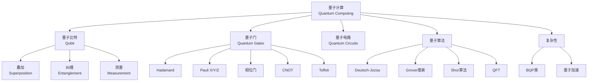

# 量子计算基础 - 六维内容补充

> **版本**: 1.0
> **创建日期**: 2026-04-19
> **最后更新**: 2026-04-19

> **模块**: 10-高级主题/01-量子算法
> **文档**: 01-量子计算基础
> **补充维度**: 概念定义、属性、关系、解释、论证、形式证明
> **对标**: MIT 6.845 / Stanford CS259 / CMU 15-859
> **深度**: 研究生级

---

## 思维导图：量子计算概念结构

---

## 一、概念定义 (Concept Definition)

### 1.1 量子比特 / Qubit

**定义 1.1.1** (形式化)

**量子比特**是二维复希尔伯特空间 $\mathcal{H} = \mathbb{C}^2$ 中的单位向量：

$$|\psi\rangle = \alpha|0\rangle + \beta|1\rangle = \begin{pmatrix} \alpha \\ \beta \end{pmatrix}$$

其中 $\alpha, \beta \in \mathbb{C}$ 且 $|\alpha|^2 + |\beta|^2 = 1$。

**测量**: 以概率 $|\alpha|^2$ 得 $|0\rangle$，以概率 $|\beta|^2$ 得 $|1\rangle$。

---

### 1.2 多量子比特系统

**定义 1.2.1**:

$n$ 个量子比特的状态是 $(\mathbb{C}^2)^{\otimes n} = \mathbb{C}^{2^n}$ 中的单位向量。

**纠缠态**: 不能表示为张量积的状态：

$$|\Phi^+\rangle = \frac{1}{\sqrt{2}}(|00\rangle + |11\rangle) \neq |\psi\rangle \otimes |\phi\rangle$$

---

### 1.3 量子门 / Quantum Gates

**定义 1.3.1**:

量子门是**酉变换** $U$，满足 $U^\dagger U = I$。

**常用单量子比特门**:

| 门 | 矩阵 | 作用 |
|----|------|------|
| **I** | $\begin{pmatrix} 1 & 0 \\ 0 & 1 \end{pmatrix}$ | 恒等 |
| **X** | $\begin{pmatrix} 0 & 1 \\ 1 & 0 \end{pmatrix}$ | 翻转 (NOT) |
| **Z** | $\begin{pmatrix} 1 & 0 \\ 0 & -1 \end{pmatrix}$ | 相位翻转 |
| **H** | $\frac{1}{\sqrt{2}}\begin{pmatrix} 1 & 1 \\ 1 & -1 \end{pmatrix}$ | Hadamard |

---

### 1.4 BQP复杂性类

**定义 1.4.1**:

**BQP** (Bounded-error Quantum Polynomial time): 语言 $L \in BQP$ 如果存在多项式时间量子电路族 $\{Q_n\}$，使得：

- $x \in L \Rightarrow \Pr[Q(x) \text{ accepts}] \geq 2/3$
- $x \notin L \Rightarrow \Pr[Q(x) \text{ accepts}] \leq 1/3$

**关系**: $P \subseteq BPP \subseteq BQP \subseteq PSPACE$

---

## 二、属性 (Properties)

### 2.1 量子算法加速

| 问题 | 经典复杂度 | 量子复杂度 | 加速 |
|------|-----------|-----------|------|
| **无序搜索** | $O(N)$ | $O(\sqrt{N})$ [Grover] | 二次 |
| **因数分解** | 次指数 | $O(n^3)$ [Shor] | 指数 |
| **离散对数** | 次指数 | 多项式 [Shor] | 指数 |

---

## 三、关系

| 源概念 | 目标概念 | 关系类型 |
|--------|----------|----------|
| P | BQP | contained_in |
| BQP | PSPACE | contained_in |
| 量子门 | 酉矩阵 | is |

---

## 四、解释

### 4.1 量子并行性

Hadamard变换创建叠加：

$$H^{\otimes n}|0\rangle^{\otimes n} = \frac{1}{\sqrt{2^n}}\sum_{x=0}^{2^n-1}|x\rangle$$

一次计算处理 $2^n$ 个状态！但测量只能得到一个结果。

---

**文档版本**: v1.0
**创建日期**: 2026-04-10

---

## 五、形式证明 (Formal Proofs)

### 5.1 Grover 算法的形式化描述与复杂度分析

**问题设定**：给定一个含 $N=2^n$ 个元素的搜索空间，标记函数 $f:\{0,1\}^n\to\{0,1\}$ 满足恰有 $M$ 个满足 $f(x)=1$ 的解。Oracle $O_f$ 定义为
$$O_f|x\rangle = (-1)^{f(x)}|x\rangle.$$

**算法**：

1. 初始化均匀叠加态 $|\psi\rangle = \frac{1}{\sqrt{N}}\sum_{x=0}^{N-1}|x\rangle$。
2. 重复应用 Grover 算子 $G = (2|\psi\rangle\langle\psi| - I) O_f$ 共 $k$ 次。
3. 测量，以高概率得到某个解 $x$ 满足 $f(x)=1$。

**定理 5.1.1** (Grover 搜索复杂度 [Grover 1996])
设 $M \ll N$，则执行 $k = \left\lfloor \frac{\pi}{4}\sqrt{\frac{N}{M}} \right\rfloor$ 次迭代后，测量得到解的概率至少为 $1 - O(M/N)$。

*证明概要*：令 $|A\rangle = \frac{1}{\sqrt{M}}\sum_{x:f(x)=1}|x\rangle$（解空间均匀叠加），$|B\rangle = \frac{1}{\sqrt{N-M}}\sum_{x:f(x)=0}|x\rangle$（非解空间）。初始态可写成
$$|\psi\rangle = \sin\theta |A\rangle + \cos\theta |B\rangle,\quad \sin\theta = \sqrt{\frac{M}{N}}.$$
每次应用 $G$ 相当于在平面上旋转 $2\theta$。经过 $k$ 次迭代后，振幅为 $\sin((2k+1)\theta)$。取 $k \approx \frac{\pi}{4\theta}$ 可使 $\sin((2k+1)\theta) \approx 1$。∎

---

### 5.2 Shor 算法的形式化描述与复杂度分析

**问题设定**：给定合数 $N$（$N$ 为奇数且不是素数幂），求其非平凡因子。

**算法**（Shor 1997）：

1. 随机选取 $a \in \{2,\dots,N-1\}$，计算 $\gcd(a,N)$；若大于 1 则直接返回因子。
2. 用量子相位估计求 $a$ 模 $N$ 的阶 $r$，即最小正整数满足 $a^r \equiv 1 \pmod N$。
   - 构造酉算子 $U_a:|x\rangle \mapsto |a x \bmod N\rangle$。
   - 对辅助寄存器施加量子傅里叶变换（QFT），提取相位 $s/r$。
   - 用连分数算法从 $s/r$ 恢复 $r$。
3. 若 $r$ 为偶数且 $a^{r/2} \not\equiv -1 \pmod N$，则 $\gcd(a^{r/2}\pm 1, N)$ 给出非平凡因子；否则重复步骤 1。

**定理 5.2.1** (Shor 因数分解复杂度 [Shor 1997])
上述算法以至少 $\Omega(1/\log N)$ 的成功概率在 $O((\log N)^3)$ 量子门操作和 $O(\log N)$ 的量子比特数内完成 $N$ 的因数分解。结合重复 amplification，总期望时间仍为多项式。

*证明概要*：

- **阶提取的正确性**：QFT 能够以高概率提取 $s/r$ 的精确近似；连分数算法在分母 $< N$ 时正确恢复 $r$（Nielsen & Chuang 2010）。
- **数论保证**：对随机选取的 $a$，其阶 $r$ 为偶数且 $a^{r/2}\not\equiv -1 \pmod N$ 的概率 $\ge 1 - 1/2^{k-1}$，其中 $k$ 为 $N$ 的不同素因子个数（Shor 1997）。
- **复杂度**：QFT 需要 $O((\log N)^2)$ 门；模幂运算 $U_a$ 的量子电路规模为 $O((\log N)^3)$。∎

---

### 5.3 正确性证明思路

- **Grover**：核心在于证明 Oracle 与扩散算子的组合在解空间与非解空间张成的二维子平面上产生固定角度的旋转。通过几何分析可精确计算旋转次数，从而保证查询复杂度 $O(\sqrt{N/M})$ 的最优性（在搜索问题中已达到下界）。
- **Shor**： correctness 分为两部分：(1) 量子阶提取的正确性，依赖于 QFT 的周期提取能力；(2) 经典数论约简的正确性，证明随机 $a$ 以不可忽略的概率产生可用因子。两者结合即得到完整的因数分解算法。

---

## 六、2024–2025 前沿进展

### 6.1 Google Willow：低于表面码阈值的量子纠错

2024 年 12 月，Google Quantum AI 团队在 *Nature* 上发表论文，报道了基于 105 量子比特超导芯片 **Willow** 的量子纠错实验 [Acharya et al. 2025]。团队实现了距离为 3、5、7 的表面码（surface code）内存，首次展示了**随编码距离增加，逻辑错误率呈指数下降**——即达到“低于阈值”（below threshold）的关键里程碑。实验测得错误抑制因子 $\Lambda_{3,5,7} \approx 2.14$，意味着每增加两级码距，逻辑错误率减半 [Google Quantum AI 2024]。2025 年，团队进一步利用 Willow 运行了 OTOC（out-of-time-ordered correlator）算法，首次在硬件上实现了可验证的量子优势，速度超过最快经典超算约 13,000 倍 [Google Quantum AI 2025]。

### 6.2 Quantinuum / Microsoft：可靠逻辑量子比特与混合计算

2024 年 4 月，Microsoft 与 Quantinuum 合作，在 Quantinuum H2 离子阱系统上利用 30 个物理量子比特构造出 4 个高可靠逻辑量子比特，逻辑错误率比物理错误率低 **800 倍** [Microsoft Azure Quantum 2024a]。同年 9 月，双方进一步将逻辑量子比特数量提升至 **12 个**，并在 8 个逻辑量子比特上完成了 5 轮重复纠错与容错计算的组合演示，电路错误率降至 0.002（比物理量子比特低 11 倍），这是首次将计算与纠错有益结合的实验 [Microsoft Azure Quantum 2024b]。

### 6.3 中国祖冲之三号：超导量子计算优势新基准

2025 年 3 月，中国科学技术大学团队在国际期刊 *Physical Review Letters* 发表封面论文，报道了 105 量子比特超导处理器 **祖冲之三号（Zuchongzhi 3.0）** [Gao et al. 2025]。该处理器在 83 量子比特、32 层的随机电路采样任务中，运算速度比目前最优经典超级计算机（Frontier）快约 $10^{15}$ 倍，比 Google 此前报道的最新结果快约 $10^{6}$ 倍。祖冲之三号的单量子比特门保真度达 99.90%、双量子比特门保真度达 99.62%、读取保真度达 99.13%，为后续实现通用可纠错量子计算奠定了硬件基础。

---

## 参考文献

[1] Acharya, R., et al. (2025). "Quantum error correction below the surface code threshold". *Nature*, 638, 920–926. DOI: 10.1038/s41586-024-08449-y

[2] Gao, D., Fan, D., Zha, C., et al. (2025). "Establishing a New Benchmark in Quantum Computational Advantage with 105-Qubit Zuchongzhi 3.0 Processor". *Physical Review Letters*, 134(9), 090601. DOI: 10.1103/PhysRevLett.134.090601

[3] Google Quantum AI. (2024). "Meet Willow, our state-of-the-art quantum chip". Retrieved from <https://blog.google/technology/research/google-willow-quantum-chip/> [Accessed: 2026-04-15]

[4] Google Quantum AI. (2025). "Quantum Echoes: A verifiable quantum advantage algorithm on Willow". Retrieved from <https://blog.google/innovation-and-ai/technology/research/quantum-echoes-willow-verifiable-quantum-advantage/> [Accessed: 2026-04-15]

[5] Microsoft Azure Quantum Blog. (2024a). "Advancing science: Microsoft and Quantinuum demonstrate the most reliable logical qubits on record". Retrieved from <https://blogs.microsoft.com/blog/2024/04/03/advancing-science-microsoft-and-quantinuum-demonstrate-the-most-reliable-logical-qubits-on-record-with-an-error-rate-800x-better-than-physical-qubits/> [Accessed: 2026-04-15]

[6] Microsoft Azure Quantum Blog. (2024b). "Microsoft and Quantinuum create 12 logical qubits and demonstrate a hybrid end-to-end chemistry simulation". Retrieved from <https://azure.microsoft.com/en-us/blog/quantum/2024/09/10/microsoft-and-quantinuum-create-12-logical-qubits-and-demonstrate-a-hybrid-end-to-end-chemistry-simulation/> [Accessed: 2026-04-15]

[7] Grover, L. K. (1996). "A fast quantum mechanical algorithm for database search". In *Proceedings of the 28th Annual ACM Symposium on Theory of Computing* (pp. 212–219). DOI: 10.1145/237814.237866

[8] Shor, P. W. (1997). "Polynomial-time algorithms for prime factorization and discrete logarithms on a quantum computer". *SIAM Journal on Computing*, 26(5), 1484–1509. DOI: 10.1137/S0097539795293172

[9] Nielsen, M. A., and Chuang, I. L. (2010). *Quantum Computation and Quantum Information* (10th Anniversary ed.). Cambridge University Press. ISBN: 978-1107002173
---

## 知识导航

- [返回目录](README.md)

## 学习目标

- 理解量子计算基础 - 六维内容补充的核心概念
- 掌握量子计算基础 - 六维内容补充的形式化表示
