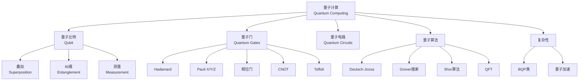

# 量子计算基础 - 六维内容补充

> **模块**: 10-高级主题/01-量子算法
> **文档**: 01-量子计算基础
> **补充维度**: 概念定义、属性、关系、解释、论证、形式证明
> **对标**: MIT 6.845 / Stanford CS259 / CMU 15-859
> **深度**: 研究生级

---

## 思维导图：量子计算概念结构

---

## 一、概念定义 (Concept Definition)

### 1.1 量子比特 / Qubit

**定义 1.1.1** (形式化)

**量子比特**是二维复希尔伯特空间 $\mathcal{H} = \mathbb{C}^2$ 中的单位向量：

$$|\psi\rangle = \alpha|0\rangle + \beta|1\rangle = \begin{pmatrix} \alpha \\ \beta \end{pmatrix}$$

其中 $\alpha, \beta \in \mathbb{C}$ 且 $|\alpha|^2 + |\beta|^2 = 1$。

**测量**: 以概率 $|\alpha|^2$ 得 $|0\rangle$，以概率 $|\beta|^2$ 得 $|1\rangle$。

---

### 1.2 多量子比特系统

**定义 1.2.1**:

$n$ 个量子比特的状态是 $(\mathbb{C}^2)^{\otimes n} = \mathbb{C}^{2^n}$ 中的单位向量。

**纠缠态**: 不能表示为张量积的状态：

$$|\Phi^+\rangle = \frac{1}{\sqrt{2}}(|00\rangle + |11\rangle) \neq |\psi\rangle \otimes |\phi\rangle$$

---

### 1.3 量子门 / Quantum Gates

**定义 1.3.1**:

量子门是**酉变换** $U$，满足 $U^\dagger U = I$。

**常用单量子比特门**:

| 门 | 矩阵 | 作用 |
|----|------|------|
| **I** | $\begin{pmatrix} 1 & 0 \\ 0 & 1 \end{pmatrix}$ | 恒等 |
| **X** | $\begin{pmatrix} 0 & 1 \\ 1 & 0 \end{pmatrix}$ | 翻转 (NOT) |
| **Z** | $\begin{pmatrix} 1 & 0 \\ 0 & -1 \end{pmatrix}$ | 相位翻转 |
| **H** | $\frac{1}{\sqrt{2}}\begin{pmatrix} 1 & 1 \\ 1 & -1 \end{pmatrix}$ | Hadamard |

---

### 1.4 BQP复杂性类

**定义 1.4.1**:

**BQP** (Bounded-error Quantum Polynomial time): 语言 $L \in BQP$ 如果存在多项式时间量子电路族 $\{Q_n\}$，使得：

- $x \in L \Rightarrow \Pr[Q(x) \text{ accepts}] \geq 2/3$
- $x \notin L \Rightarrow \Pr[Q(x) \text{ accepts}] \leq 1/3$

**关系**: $P \subseteq BPP \subseteq BQP \subseteq PSPACE$

---

## 二、属性 (Properties)

### 2.1 量子算法加速

| 问题 | 经典复杂度 | 量子复杂度 | 加速 |
|------|-----------|-----------|------|
| **无序搜索** | $O(N)$ | $O(\sqrt{N})$ [Grover] | 二次 |
| **因数分解** | 次指数 | $O(n^3)$ [Shor] | 指数 |
| **离散对数** | 次指数 | 多项式 [Shor] | 指数 |

---

## 三、关系

| 源概念 | 目标概念 | 关系类型 |
|--------|----------|----------|
| P | BQP | contained_in |
| BQP | PSPACE | contained_in |
| 量子门 | 酉矩阵 | is |

---

## 四、解释

### 4.1 量子并行性

Hadamard变换创建叠加：

$$H^{\otimes n}|0\rangle^{\otimes n} = \frac{1}{\sqrt{2^n}}\sum_{x=0}^{2^n-1}|x\rangle$$

一次计算处理 $2^n$ 个状态！但测量只能得到一个结果。

---

**文档版本**: v1.0
**创建日期**: 2026-04-10
