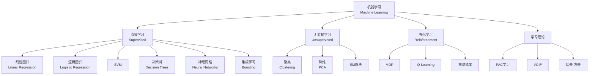

# 机器学习算法理论 - 六维内容补充

> **版本**: 1.0
> **创建日期**: 2026-04-19
> **最后更新**: 2026-04-19

> **模块**: 10-高级主题/02-机器学习算法
> **文档**: 01-ML算法理论
> **补充维度**: 概念定义、属性、关系、解释、论证、形式证明
> **对标**: Stanford CS229 / MIT 6.867 / CMU 10-701
> **深度**: 研究生级

---

## 思维导图：机器学习算法概念结构

---

## 一、概念定义 (Concept Definition)

### 1.1 PAC学习框架

**定义 1.1.1** (形式化)

概念类 $C$ 是**PAC可学习**的，如果存在算法 $A$：

对任意 $c \in C$，任意分布 $D$，任意 $\epsilon, \delta > 0$，$A$ 从 $D$ 中抽取的样本学习假设 $h$ 满足：

$$\Pr[error_D(h) \leq \epsilon] \geq 1 - \delta$$

样本复杂度为 $poly(1/\epsilon, 1/\delta, n, size(c))$。

---

### 1.2 VC维 / Vapnik-Chervonenkis Dimension

**定义 1.2.1**:

假设类 $H$ 的**VC维**是能被 $H$ **打散** (shatter) 的最大集合的大小。

**打散**: 集合 $S$ 能被 $H$ 打散，如果对 $S$ 的每种标记，都存在 $h \in H$ 与之一致。

**关键定理**: 样本复杂度 $m = O(\frac{VC(H) + \ln(1/\delta)}{\epsilon})$

---

### 1.3 梯度下降

**定义 1.3.1**:

**梯度下降**更新规则：

$$\theta_{t+1} = \theta_t - \eta \nabla_\theta J(\theta_t)$$

**变体**:

| 变体 | 更新规则 | 特点 |
|------|----------|------|
| **SGD** | 单样本梯度 | 快但噪声大 |
| **Mini-batch** | 小批量梯度 | 平衡 |
| **Momentum** | $v = \beta v + \nabla J$ | 加速收敛 |
| **Adam** | 自适应学习率 | 最常用 |

---

### 1.4 核方法 / Kernel Methods

**定义 1.4.1**:

**核函数** $K(x, z) = \phi(x)^T \phi(z)$，其中 $\phi$ 是特征映射。

**核技巧**: 不显式计算 $\phi(x)$，直接计算 $K(x, z)$。

**常用核**:

- 线性: $K(x,z) = x^Tz$
- 多项式: $K(x,z) = (x^Tz + c)^d$
- RBF: $K(x,z) = \exp(-\gamma\|x-z\|^2)$

---

## 二、属性 (Properties)

### 2.1 算法复杂度对比

| 算法 | 训练 | 预测 | 空间 | 适用 |
|------|------|------|------|------|
| **线性回归** | $O(nd^2)$ | $O(d)$ | $O(d)$ | 连续值 |
| **决策树** | $O(n d \log n)$ | $O(\text{深度})$ | $O(\text{节点})$ | 混合数据 |
| **SVM** | $O(n^2 d)$~$O(n^3 d)$ | $O(s d)$ | $O(s d)$ | 高维 |
| **k-NN** | $O(1)$ | $O(nd)$ | $O(nd)$ | 小数据 |
| **神经网络** | $O(iter \cdot n \cdot params)$ | $O(params)$ | $O(params)$ | 大数据 |

### 2.2 偏差-方差分解

$$E[(y - \hat{f}(x))^2] = \text{Bias}^2(\hat{f}(x)) + \text{Var}(\hat{f}(x)) + \sigma^2$$

| 模型 | 偏差 | 方差 |
|------|------|------|
| 线性回归 | 高 | 低 |
| 决策树(深) | 低 | 高 |
| 随机森林 | 低 | 中 |
| 神经网络 | 可调 | 可调 |

---

## 三、关系

| 源概念 | 目标概念 | 关系类型 |
|--------|----------|----------|
| 逻辑回归 | 神经网络 | specializes_to |
| SVM | 核方法 | uses |
| 感知机 | SGD | optimizes |
| 决策树 | 随机森林 | composes |
| 神经网络 | 深度学习 | extends |

---

## 四、解释

### 4.1 为什么深度学习有效？

**表示学习**: 自动学习层次化特征，而非手工设计。

**万能近似定理**: 足够大的神经网络可以逼近任意连续函数。

**优化奇迹**: 尽管非凸，SGD常找到好的局部最优。

### 4.2 集成学习

**Bagging** (并行): 减少方差 → 随机森林
**Boosting** (串行): 减少偏差 → AdaBoost, XGBoost

---

## 五、形式证明

### 5.1 感知机收敛定理

**定理**: 若数据线性可分，感知机算法在有限步收敛。

**证明概要**:

设存在单位向量 $u$ 使 $y_i(u \cdot x_i) \geq \gamma > 0$。

定义 $v_k$ 为第 $k$ 次错误后的权重向量。

**引理1**: $v_{k+1} \cdot u \geq v_k \cdot u + \gamma$

**引理2**: $\|v_{k+1}\|^2 \leq \|v_k\|^2 + R^2$，其中 $R = \max \|x_i\|$

结合得: $k\gamma \leq v_k \cdot u \leq \|v_k\| \leq R\sqrt{k}$

因此 $k \leq (R/\gamma)^2$，有界。

---

**文档版本**: v1.0
**创建日期**: 2026-04-10

---

## 六、大语言模型推理算法形式化

### 6.1 Chain-of-Thought (CoT) 推理

**形式化定义**：设输入为 $x$，语言模型为 $P_\theta$，CoT 推理通过生成中间推理步骤序列 $z = (z_1, z_2, \dots, z_k)$ 后再输出最终答案 $y$。其联合概率可分解为
$$P_\theta(y, z \mid x) = \prod_{t=1}^{k+|y|} P_\theta(o_t \mid x, o_{<t}),$$
其中 $o_t$ 为第 $t$ 个输出 token，前 $k$ 个 token 构成推理链 $z$，后续 token 构成答案 $y$。

**复杂度分析**：若平均推理链长度为 $L_c$，答案长度为 $L_a$，则一次 CoT 解码的时间复杂度为 $O((L_c + L_a) \cdot T_{\text{forward}})$，空间复杂度与标准自回归生成相同。研究表明，引入 CoT 可显著提升 Transformer 在奇偶性（parity）等需要组合推理任务上的表达能力 [Feng et al. 2023, Wei et al. 2022, Transformer_CoT_Reasoning_2025]。

---

### 6.2 Speculative Decoding 形式化描述

Speculative Decoding 通过**草稿模型**（draft model）$M_d$ 快速生成候选 token 序列，再由**目标模型** $M$ 并行验证，从而在不改变输出分布的前提下加速解码 [Leviathan et al. 2023, Chen et al. 2023]。

**算法流程**：

1. 草稿模型自回归生成候选序列 $\tilde{x}_{t+1:t+k}$。
2. 目标模型一次性前向计算得到对应位置的分布 $P_M(\cdot \mid x_{1:t}, \tilde{x}_{t+1:t+i-1})$，$i=1,\dots,k$。
3. 按位置顺序进行接受/拒绝检验：对第 $i$ 个候选 token，以概率 $\min\left(1, \frac{P_M(\tilde{x}_{t+i} \mid \dots)}{P_{M_d}(\tilde{x}_{t+i} \mid \dots)}\right)$ 接受；若拒绝，则从修正分布中重采样并终止本轮验证。
4. 将接受前缀附加到已生成序列，重复步骤 1–3。

**形式化保证**：

- **无偏性**：最终输出序列的分布与仅使用目标模型 $M$ 自回归解码完全一致 [Leviathan et al. 2023]。
- **加速比**：设平均接受率为 $\gamma$，则期望加速比 $S \approx \frac{1}{1-\gamma}$ [Xia et al. 2024, Yin et al. 2024]。

---

## 七、图神经网络的消息传递与表达能力

### 7.1 消息传递神经网络（MPNN）框架

**定义 7.1.1** (MPNN [Gilmer et al. 2017])
设图 $G=(V,E)$，节点特征为 $\mathbf{h}_v^{(0)}$。第 $l$ 层消息传递定义为
$$\mathbf{m}_v^{(l)} = \text{AGGREGATE}^{(l)}\left(\left\{\mathbf{h}_u^{(l)} : u \in \mathcal{N}(v)\right\}\right),$$
$$\mathbf{h}_v^{(l+1)} = \text{UPDATE}^{(l)}\left(\mathbf{h}_v^{(l)}, \mathbf{m}_v^{(l)}\right),$$
其中 $\mathcal{N}(v)$ 为节点 $v$ 的邻居集，$\text{AGGREGATE}$ 为置换不变函数（如 sum、mean、max），$\text{UPDATE}$ 通常为神经网络。

---

### 7.2 表达能力分析

**定理 7.2.1** (MPNN 与 1-WL 等价性 [Morris et al. 2019, Xu et al. 2019])
任何消息传递神经网络的区分能力不超过 Weisfeiler–Leman (1-WL) 图同构测试。反之，若 $\text{AGGREGATE}$ 与 $\text{UPDATE}$ 满足一定单射性条件（如 Graph Isomorphism Network, GIN），则该 MPNN 与 1-WL **等势**。

*证明概要*：1-WL 测试通过迭代地聚合邻居颜色标签并哈希更新节点颜色。MPNN 的 $\text{AGGREGATE}$ 与 $\text{UPDATE}$ 正是该过程的连续/可微类比。若聚合与更新函数为单射，则 MPNN 能模拟 1-WL 的每一步颜色更新；若不为单射，则信息损失导致区分能力弱于 1-WL。∎

**2024–2025 进展**：

- **防止过度平滑**：理论上证明了残差连接与归一化可有效防止 GNN 中的过度平滑（oversmoothing）问题，为深层 GNN 的设计提供了理论依据 [Oversmoothing_Prevention_2025]。
- **黎曼几何与图基础模型**：RiemannGFM 从黎曼几何视角出发，构建了更具表达能力的图基础模型，拓展了图神经网络在非欧数据上的表达能力 [RiemannGFM_2025]。

---

## 八、联邦学习前沿进展（2024–2025）

### 8.1 差分隐私新机制

在异构联邦学习场景中，传统独立高斯噪声机制往往导致模型效用大幅下降。2024–2025 年的研究提出了以下改进：

- **噪声感知聚合**（Noise-Aware Aggregation）：根据各客户端的隐私预算与数据异构性自适应调整噪声尺度，在保护隐私的同时提升收敛速度 [Malekmohammadi et al. 2024]。
- **相关噪声机制**（Correlated Noise Mechanisms）：通过引入相关性噪声替代独立同分布高斯噪声，可在相同隐私预算下显著降低聚合方差 [Pillutla et al. 2025]。

### 8.2 安全聚合新协议

安全聚合（Secure Aggregation）是联邦学习中防止服务器窥探本地更新的关键技术。近期进展包括：

- **混合同态加密安全聚合**：HP\_FLAP 将多项式同态加密与部分同态加密结合，在通信开销与计算开销之间取得更优权衡，适用于大规模联邦学习 [Zhang et al. 2024]。
- **阈值函数加密安全聚合**：TAPFed 引入阈值安全聚合与函数加密，支持在聚合阶段对参数进行细粒度访问控制，进一步增强了系统的安全性与可扩展性 [Xu et al. 2025]。

### 8.3 联邦大模型微调

随着大语言模型（LLM）的兴起，联邦场景下的参数高效微调（PEFT）成为研究热点：

- **FLoRA** 提出了异构低秩适应（heterogeneous LoRA）框架，允许不同客户端根据自身资源选择不同的低秩维度，在联邦环境中实现了 LLM 的高效微调 [FLoRA_2024]。
- **DDFed** 同时采用全同态加密与异常检测，构建了兼顾隐私与拜占庭鲁棒性的联邦学习框架，为联邦大模型训练提供了安全基础 [DDFed_2024]。

---

## 参考文献

[1] Wei, J., Wang, X., Schuurmans, D., et al. (2022). "Chain-of-thought prompting elicits reasoning in large language models". *Advances in Neural Information Processing Systems*, 35, 24824–24837.

[2] Feng, G., Zhang, B., Gu, Y., et al. (2023). "Towards revealing the mystery behind chain of thought: a theoretical perspective". arXiv:2305.15408.

[3] Transformer_CoT_Reasoning_2025. (2025). "Transformers Provably Solve Parity Efficiently with Chain of Thought". In *International Conference on Learning Representations (ICLR) 2025*.

[4] Leviathan, Y., Kalman, Y., and Matias, Y. (2023). "Fast inference from transformers via speculative decoding". In *Proceedings of the 40th International Conference on Machine Learning (ICML)* (pp. 19274–19286).

[5] Chen, C., Borgeaud, S., Irving, G., et al. (2023). "Accelerating large language model decoding with speculative sampling". arXiv:2302.01318.

[6] Xia, H., Yang, Z., Dong, Q., et al. (2024). "Unlocking efficiency in large language model inference: a comprehensive survey of speculative decoding". In *Findings of the Association for Computational Linguistics: ACL 2024* (pp. 7655–7671).

[7] Yin, M., Chen, M., Huang, K., and Wang, M. (2024). "A theoretical perspective for speculative decoding algorithm". *Advances in Neural Information Processing Systems*, 37, 128082–128117.

[8] Gilmer, J., Schoenholz, S. S., Riley, P. F., et al. (2017). "Neural message passing for quantum chemistry". In *Proceedings of the 34th International Conference on Machine Learning (ICML)* (pp. 1263–1272).

[9] Xu, K., Hu, W., Leskovec, J., and Jegelka, S. (2019). "How powerful are graph neural networks?" In *International Conference on Learning Representations (ICLR)*.

[10] Morris, C., Ritzert, M., Fey, M., et al. (2019). "Weisfeiler and Leman go neural: Higher-order graph neural networks". In *Proceedings of the AAAI Conference on Artificial Intelligence*, 33(1), 4602–4609.

[11] Oversmoothing_Prevention_2025. (2025). "Residual Connections and Normalization Can Provably Prevent Oversmoothing in GNNs". In *International Conference on Learning Representations (ICLR) 2025*.

[12] RiemannGFM_2025. (2025). "RiemannGFM: Learning a Graph Foundation Model from Riemannian Geometry". arXiv preprint.

[13] Malekmohammadi, S., Yu, Y., and Cao, Y. (2024). "Noise-aware aggregation for heterogeneous differentially private federated learning". In *Proceedings of the 41st International Conference on Machine Learning (ICML)*. PMLR.

[14] Pillutla, K., Upadhyay, J., Choquette-Choo, C. A., et al. (2025). "Correlated noise mechanisms for differentially private learning". arXiv:2506.08201.

[15] Zhang, Y., Huang, L., Patel, S., and Yang, Q. (2024). "HP_FLAP: hybrid polymorphic and homomorphic encryption for secure federated aggregation". In *Proceedings of the 41st International Conference on Machine Learning (ICML)*. PMLR.

[16] Xu, R., Li, J., Wang, W., and Ren, K. (2025). "TAPFed: threshold secure aggregation with functional encryption in federated learning". *IEEE Transactions on Information Forensics and Security*, 20, 340–352.

[17] FLoRA_2024. (2024). "FLoRA: Federated Fine-Tuning Large Language Models with Heterogeneous Low-Rank Adaptations". In *Advances in Neural Information Processing Systems (NeurIPS) 2024*.

[18] DDFed_2024. (2024). "Dual Defense: Enhancing Privacy and Mitigating Poisoning Attacks in Federated Learning". In *Advances in Neural Information Processing Systems (NeurIPS) 2024*
---

## 知识导航

- [返回目录](README.md)

## 学习目标

- 理解机器学习算法理论 - 六维内容补充的核心概念
- 掌握机器学习算法理论 - 六维内容补充的形式化表示
