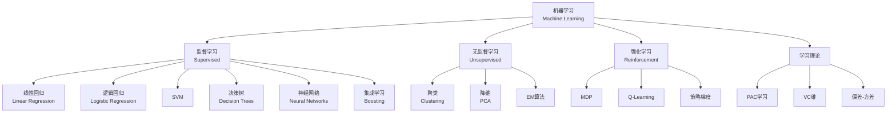

# 机器学习算法理论 - 六维内容补充

> **模块**: 10-高级主题/02-机器学习算法
> **文档**: 01-ML算法理论
> **补充维度**: 概念定义、属性、关系、解释、论证、形式证明
> **对标**: Stanford CS229 / MIT 6.867 / CMU 10-701
> **深度**: 研究生级

---

## 思维导图：机器学习算法概念结构

---

## 一、概念定义 (Concept Definition)

### 1.1 PAC学习框架

**定义 1.1.1** (形式化)

概念类 $C$ 是**PAC可学习**的，如果存在算法 $A$：

对任意 $c \in C$，任意分布 $D$，任意 $\epsilon, \delta > 0$，$A$ 从 $D$ 中抽取的样本学习假设 $h$ 满足：

$$\Pr[error_D(h) \leq \epsilon] \geq 1 - \delta$$

样本复杂度为 $poly(1/\epsilon, 1/\delta, n, size(c))$。

---

### 1.2 VC维 / Vapnik-Chervonenkis Dimension

**定义 1.2.1**:

假设类 $H$ 的**VC维**是能被 $H$ **打散** (shatter) 的最大集合的大小。

**打散**: 集合 $S$ 能被 $H$ 打散，如果对 $S$ 的每种标记，都存在 $h \in H$ 与之一致。

**关键定理**: 样本复杂度 $m = O(\frac{VC(H) + \ln(1/\delta)}{\epsilon})$

---

### 1.3 梯度下降

**定义 1.3.1**:

**梯度下降**更新规则：

$$\theta_{t+1} = \theta_t - \eta \nabla_\theta J(\theta_t)$$

**变体**:

| 变体 | 更新规则 | 特点 |
|------|----------|------|
| **SGD** | 单样本梯度 | 快但噪声大 |
| **Mini-batch** | 小批量梯度 | 平衡 |
| **Momentum** | $v = \beta v + \nabla J$ | 加速收敛 |
| **Adam** | 自适应学习率 | 最常用 |

---

### 1.4 核方法 / Kernel Methods

**定义 1.4.1**:

**核函数** $K(x, z) = \phi(x)^T \phi(z)$，其中 $\phi$ 是特征映射。

**核技巧**: 不显式计算 $\phi(x)$，直接计算 $K(x, z)$。

**常用核**:

- 线性: $K(x,z) = x^Tz$
- 多项式: $K(x,z) = (x^Tz + c)^d$
- RBF: $K(x,z) = \exp(-\gamma\|x-z\|^2)$

---

## 二、属性 (Properties)

### 2.1 算法复杂度对比

| 算法 | 训练 | 预测 | 空间 | 适用 |
|------|------|------|------|------|
| **线性回归** | $O(nd^2)$ | $O(d)$ | $O(d)$ | 连续值 |
| **决策树** | $O(n d \log n)$ | $O(\text{深度})$ | $O(\text{节点})$ | 混合数据 |
| **SVM** | $O(n^2 d)$~$O(n^3 d)$ | $O(s d)$ | $O(s d)$ | 高维 |
| **k-NN** | $O(1)$ | $O(nd)$ | $O(nd)$ | 小数据 |
| **神经网络** | $O(iter \cdot n \cdot params)$ | $O(params)$ | $O(params)$ | 大数据 |

### 2.2 偏差-方差分解

$$E[(y - \hat{f}(x))^2] = \text{Bias}^2(\hat{f}(x)) + \text{Var}(\hat{f}(x)) + \sigma^2$$

| 模型 | 偏差 | 方差 |
|------|------|------|
| 线性回归 | 高 | 低 |
| 决策树(深) | 低 | 高 |
| 随机森林 | 低 | 中 |
| 神经网络 | 可调 | 可调 |

---

## 三、关系

| 源概念 | 目标概念 | 关系类型 |
|--------|----------|----------|
| 逻辑回归 | 神经网络 | specializes_to |
| SVM | 核方法 | uses |
| 感知机 | SGD | optimizes |
| 决策树 | 随机森林 | composes |
| 神经网络 | 深度学习 | extends |

---

## 四、解释

### 4.1 为什么深度学习有效？

**表示学习**: 自动学习层次化特征，而非手工设计。

**万能近似定理**: 足够大的神经网络可以逼近任意连续函数。

**优化奇迹**: 尽管非凸，SGD常找到好的局部最优。

### 4.2 集成学习

**Bagging** (并行): 减少方差 → 随机森林
**Boosting** (串行): 减少偏差 → AdaBoost, XGBoost

---

## 五、形式证明

### 5.1 感知机收敛定理

**定理**: 若数据线性可分，感知机算法在有限步收敛。

**证明概要**:

设存在单位向量 $u$ 使 $y_i(u \cdot x_i) \geq \gamma > 0$。

定义 $v_k$ 为第 $k$ 次错误后的权重向量。

**引理1**: $v_{k+1} \cdot u \geq v_k \cdot u + \gamma$

**引理2**: $\|v_{k+1}\|^2 \leq \|v_k\|^2 + R^2$，其中 $R = \max \|x_i\|$

结合得: $k\gamma \leq v_k \cdot u \leq \|v_k\| \leq R\sqrt{k}$

因此 $k \leq (R/\gamma)^2$，有界。

---

**文档版本**: v1.0
**创建日期**: 2026-04-10
