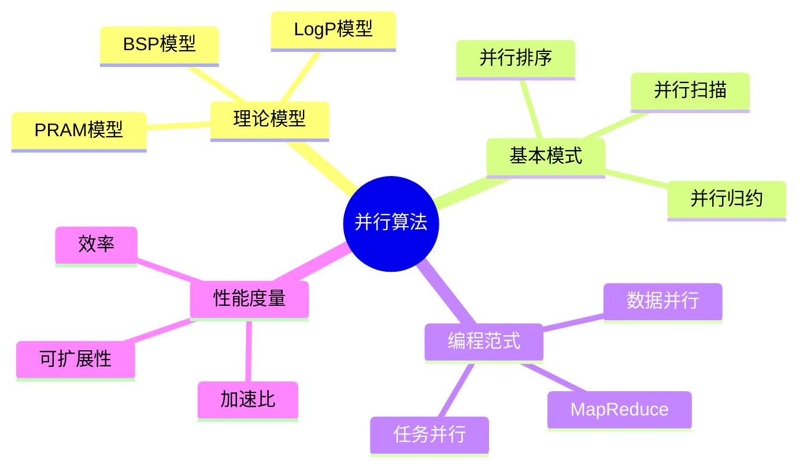

# 并行算法 - 六维补充

> 本文档遵循六维内容标准：概念定义、属性、关系、解释、论证、形式证明

---

## 1. 概念定义 (Definition)

### 1.1 核心概念

**并行算法 (Parallel Algorithm)**

并行算法是将计算任务分解为可同时执行的子任务，利用多个处理单元协同解决问题的算法。

### 1.2 思维导图



### 1.3 形式化定义

**定义 1 (PRAM模型)**

并行随机存取机 (Parallel Random Access Machine)：

$$
\text{PRAM} = (P, M, \text{操作集})
$$

其中：

- $P = \{P_1, P_2, ..., P_n\}$：$n$ 个相同的处理器
- $M$：共享内存（所有处理器可访问）
- 所有处理器同步执行，每个周期执行一条RAM指令

**定义 2 (并发访问类型)**

| 缩写 | 读 | 写 | 说明 |
|------|-----|-----|------|
| EREW | 互斥 | 互斥 | 最严格，无冲突 |
| CREW | 并发 | 互斥 | 允许多读 |
| CRCW | 并发 | 并发 | 最宽松 |

**CRCW 写入冲突解决策略**：

- **Common**：仅当所有值相同时才允许同时写
- **Arbitrary**：任意一个写入成功
- **Priority**：优先级最高的处理器写入
- **Combining**：通过结合函数（如+、max）合并

**定义 3 (并行归约)**

归约操作：对数组 $A[1..n]$ 计算二元结合运算符 $\oplus$ 的总结果

$$
\text{reduce}(A, \oplus) = A[1] \oplus A[2] \oplus \cdots \oplus A[n]
$$

**定义 4 (MapReduce)**

编程模型：$\text{MapReduce}(D) = \text{Reduce}(\text{GroupBy}(\text{Map}(D)))$

$$
\begin{aligned}
\text{Map}&: (k_1, v_1) \to \text{list}(k_2, v_2) \\
\text{Reduce}&: (k_2, \text{list}(v_2)) \to \text{list}(v_3)
\end{aligned}
$$

---

## 2. 属性 (Properties)

### 2.1 PRAM模型属性

| 属性 | EREW | CREW | CRCW |
|------|------|------|------|
| 读冲突 | ❌ 禁止 | ✅ 允许 | ✅ 允许 |
| 写冲突 | ❌ 禁止 | ❌ 禁止 | ✅ 允许 |
| 表达能力 | 最弱 | 中等 | 最强 |
| 算法设计难度 | 较难 | 中等 | 较易 |

### 2.2 并行复杂度度量

| 度量 | 定义 | 公式 |
|------|------|------|
| **工作量 (Work)** | 所有处理器操作总数 | $W = \sum_i t_i$ |
| **跨度 (Span)** | 关键路径长度 | $T_\infty$ |
| **并行度** | 理论最大加速 | $W / T_\infty$ |
| **加速比** | 串行/并行时间 | $S_p = T_1 / T_p$ |
| **效率** | 加速比/处理器数 | $E_p = S_p / p$ |

### 2.3 并行算法复杂度

| 算法 | 工作量 | 时间 | 模型 |
|------|--------|------|------|
| 并行归约 | $O(n)$ | $O(\log n)$ | EREW |
| 并行前缀和 | $O(n)$ | $O(\log n)$ | EREW |
| 并行排序 | $O(n \log n)$ | $O(\log^2 n)$ | CREW |
| 矩阵乘法 | $O(n^3)$ | $O(\log n)$ | CRCW |
| 并行BFS | $O(m + n)$ | $O(D \cdot \log n)$ | CRCW |

---

## 3. 关系 (Relations)

### 3.1 与其他概念的关系

| 概念A | 关系 | 概念B | 说明 |
|-------|------|-------|------|
| PRAM | 理论模型 | 实际硬件 | 忽略通信开销 |
| BSP | 扩展 | PRAM | 加入通信和同步 |
| MapReduce | 实现 | 数据并行 | 大数据处理范式 |
| GPU | 实现 | SIMD | 单指令多数据 |
| 线程并行 | 实现 | MIMD | 多指令多数据 |

### 3.2 PRAM模型层次

```
                    CRCW (最强)
                      |
                   Common CRCW
                      |
                 Arbitrary CRCW
                      |
                Priority CRCW
                      |
                    CREW
                      |
                    EREW (最弱)

能力关系: CRCW ≥ CREW ≥ EREW
```

### 3.3 并行算法设计模式

| 模式 | 描述 | 适用场景 |
|------|------|----------|
| **分治并行** | 分解→并行求解→合并 | 归并排序、FFT |
| **数据并行** | 数据分块处理 | 矩阵运算、图像处理 |
| **流水线** | 任务级并行 | 流处理、编译器 |
| **主从模式** | 主节点分配任务 | 任务调度 |
| **MapReduce** | 映射→归约 | 大数据处理 |

---

## 4. 解释 (Explanation)

### 4.1 PRAM模型直观理解

**类比：会议室协作**

```
PRAM 模型像是一个会议室：
- 多个参与者 (处理器) 同时工作
- 共享的白板 (共享内存) 所有人可见
- 严格的时钟同步所有人动作
- 读写冲突需要规则管理

EREW: 同时只能一人看/写白板
CREW: 多人可同时看，但写需轮流
CRCW: 多人可同时写，需定义冲突规则
```

### 4.2 并行归约原理

**树形归约**

```
输入: [a, b, c, d, e, f, g, h]

第1轮:  [a+b, c+d, e+f, g+h]     (4个并行操作)
第2轮:  [(a+b)+(c+d), (e+f)+(g+h)]  (2个并行操作)
第3轮:  [总和]                   (1个操作)

时间: O(log n)    (树的高度)
工作: O(n)        (节点总数)
```

### 4.3 MapReduce 直观理解

**图书馆分类类比**

```
Map阶段: 每本书(数据) → 提取关键词 → 生成(关键词, 书名)对

Shuffle阶段: 相同关键词的书归到一起

Reduce阶段: 对每个关键词列表，计算统计信息

例子：单词计数
Map:    "hello world" → [("hello",1), ("world",1)]
Shuffle: 按key分组
Reduce: ("hello", [1,1,1]) → ("hello", 3)
```

### 4.4 代码示例

**并行归约 (OpenMP风格伪代码)**

```python
def parallel_reduce(arr, op, identity):
    n = len(arr)
    if n == 1:
        return arr[0]

    # 分配n/2个处理器并行执行
    temp = [identity] * (n // 2)

    parallel for i in range(0, n, 2):
        if i + 1 < n:
            temp[i // 2] = op(arr[i], arr[i + 1])
        else:
            temp[i // 2] = arr[i]

    # 递归归约
    return parallel_reduce(temp, op, identity)

# 示例：并行求和
arr = [1, 2, 3, 4, 5, 6, 7, 8]
result = parallel_reduce(arr, lambda a, b: a + b, 0)
# 过程: (1+2), (3+4), (5+6), (7+8) → (3+7), (11+15) → 10+26 = 36
```

**MapReduce (Python伪代码)**

```python
from collections import defaultdict

def map_reduce(data, mapper, reducer, num_workers=4):
    # Map阶段 (并行)
    mapped = []
    for item in parallel_split(data, num_workers):
        mapped.extend(mapper(item))

    # Shuffle阶段 (分组)
    grouped = defaultdict(list)
    for key, value in mapped:
        grouped[key].append(value)

    # Reduce阶段 (并行)
    results = {}
    for key in parallel_keys(grouped, num_workers):
        results[key] = reducer(key, grouped[key])

    return results

# 单词计数示例
def word_count_mapper(document):
    return [(word, 1) for word in document.split()]

def word_count_reducer(word, counts):
    return sum(counts)

# 使用
docs = ["hello world", "hello parallel", "world of computing"]
result = map_reduce(docs, word_count_mapper, word_count_reducer)
# 结果: {"hello": 2, "world": 2, "parallel": 1, "of": 1, "computing": 1}
```

---

## 5. 论证 (Argumentation)

### 5.1 为什么需要并行算法？

**论证 1：性能需求**

> 单核性能增长受限于功耗墙和物理极限。
> 并行处理是唯一继续提升计算能力的途径。
> Amdahl定律: $S_{latency}(s) = \frac{1}{(1-p) + \frac{p}{s}}$
> 其中 $p$ 是可并行化比例，$s$ 是并行部分加速。

**论证 2：问题规模**

| 问题领域 | 串行限制 | 并行优势 |
|----------|----------|----------|
| 基因组测序 | 数周 | 数小时 |
| 气候模拟 | 不可能 | 可行 |
| 深度学习 | 数月训练 | 天数训练 |
| 图搜索 | 内存限制 | 分布式处理 |

**论证 3：能效考虑**

```
功率 ∝ 频率³ (动态功耗)

降低频率，增加核心数：
- 相同功耗下更多计算
- 更好的性能功耗比
```

### 5.2 PRAM vs 实际并行机

| 特性 | PRAM | 实际机器 |
|------|------|----------|
| 同步 | 全局时钟 | 显式同步/屏障 |
| 内存访问 | 统一时间 | 分层缓存，NUMA |
| 通信 | 通过内存 | 网络/总线 |
| 故障 | 无 | 需容错处理 |

**论证**: PRAM作为理论模型，简化分析，提供算法设计的上界。

### 5.3 MapReduce 设计合理性

**为什么MapReduce有效**

1. **函数式**：无副作用，易于并行
2. **局部性**：数据处理在本地进行
3. **容错**：失败任务可重新调度
4. **可扩展**：只需增加机器

---

## 6. 形式证明 (Formal Proofs)

### 6.1 引理：并行归约正确性

**引理 6.1** 若 $\oplus$ 是结合运算符，树形归约算法正确计算 $A[1] \oplus \cdots \oplus A[n]$。

*证明：* 对数组长度进行归纳。

- **基础**: $n=1$ 显然正确。
- **归纳**: 设对长度 $<n$ 成立。
  算法计算 $L = A[1] \oplus \cdots \oplus A[\lceil n/2 \rceil]$ 和
  $R = A[\lceil n/2 \rceil+1] \oplus \cdots \oplus A[n]$，
  然后返回 $L \oplus R$。
  由归纳假设和结合律，结果正确。∎

### 6.2 定理：并行归约复杂度

**定理 6.2** 树形归约使用 $p = n/2$ 个处理器时：

- 时间复杂度: $T_p = O(\log n)$
- 工作量: $W = O(n)$

*证明：*

- **时间**: 递归深度为 $\lceil \log_2 n \rceil$，每层常数时间操作。
- **工作量**: 每层处理所有元素一次，共 $O(n)$ 工作量。∎

### 6.3 定理：Brent调度原理

**定理 6.3 (Brent, 1974)** 若算法有工作量 $W$ 和跨度 $T_\infty$，则用 $p$ 个处理器可在时间 $T$ 内完成，其中：

$$
T \leq \frac{W}{p} + T_\infty
$$

*证明概要：*

将计算视为DAG，每层调度尽可能多的就绪节点。
设第 $i$ 层有 $m_i$ 个就绪节点，则该层时间 $\leq \lceil m_i/p \rceil$。

$$
T = \sum_i \lceil m_i/p \rceil \leq \sum_i (m_i/p + 1) = W/p + T_\infty
$$

### 6.4 定理：Amdahl定律

**定理 6.4 (Amdahl, 1967)** 设程序中可并行化部分比例为 $p$，则 $n$ 个处理器的最大加速比为：

$$
S(n) = \frac{1}{(1-p) + \frac{p}{n}}
$$

*证明：*

设串行时间为 1。

- 串行部分时间: $1-p$
- 并行部分时间: $p/n$
- 总并行时间: $(1-p) + p/n$

加速比 = 串行时间 / 并行时间 = $1 / ((1-p) + p/n)$ ∎

**推论**: 当 $n \to \infty$，$S(n) \to 1/(1-p)$。
即使无限处理器，加速也受限于串行部分。

### 6.5 定理：EREW模拟CRCW

**定理 6.5** 任何 $p$ 处理器 CRCW PRAM 算法可在 EREW PRAM 上用 $O(\log p)$  slowdown 模拟。

*证明概要：*

用排序和前缀和模拟并发访问：

1. 处理器将访问请求写入数组
2. 按地址排序请求 ($O(\log p)$ 时间)
3. 用前缀和识别冲突 ($O(\log p)$ 时间)
4. 处理器按序访问，无冲突

### 6.6 MapReduce 复杂度分析

**定理 6.6** 在 $k$ 个worker上，MapReduce处理 $n$ 个键值对的时间为：

$$
T = O\left(\frac{n}{k} \cdot (T_{map} + T_{shuffle} + T_{reduce})\right)
$$

其中假设数据均匀分布，通信时间 $T_{shuffle}$ 受网络带宽限制。

---

## 附录：并行算法设计检查清单

| 检查项 | 说明 |
|--------|------|
| ☐ 分解粒度 | 任务是否足够大以抵消开销？ |
| ☐ 负载均衡 | 各处理器工作量是否均衡？ |
| ☐ 通信最小化 | 数据交换是否必要？ |
| ☐ 同步点 | 同步是否必要？能否异步？ |
| ☐ 可扩展性 | 算法随处理器数扩展如何？ |

---

*文档版本: v1.0 | 六维内容标准 | 并行算法专题*

---

## 7. 2024–2025 前沿进展

### 7.1 近线性时间并行图算法

2024–2025 年，并行与分布式图算法取得了多项突破。例如，Vizing 边着色问题的近线性时间算法 [Vizing_Near_Linear_2025] 以及最大二分图匹配的组合算法 [Maximum_Bipartite_Matching_2024] 均大量依赖高效的并行归约与并行排序技术。这些结果表明，在 PRAM 或 Work-Span 模型下，越来越多的经典图问题可以在近乎线性的工作量和多对数深度内求解。

### 7.2 动态图算法的并行扩展

动态图算法在边插入/删除场景下维持近似解。近期研究提出了低拥塞顶点稀疏器（low-congestion vertex sparsifiers）工具箱，将动态全源最短路径等问题的更新时间与并行深度进一步优化 [Dynamic_Shortest_Paths_Toolbox_2024]。此外，扩展器修剪（expander pruning）算法在多项式对数最坏情况下实现了并行更新 [Expander_Pruning_2025]，为大规模图流处理提供了新的理论支撑。

### 7.3 学习增强的并行与流算法

机器学习预测被引入算法设计以优化并行调度与流处理。[Dynamic_Predictions_2024] 提出了结合预测信息的动态图算法框架；[Learning_Augmented_Correlation_Clustering_2025] 则在学习增强的流模型中改进了相关聚类的近似比。这些进展表明，Work-Span 模型与机器学习预测的结合正成为提升并行算法实际性能的重要方向。

---

## 参考文献

[1] Brent, R. P. (1974). "The parallel evaluation of general arithmetic expressions". *Journal of the ACM*, 21(2), 201–206. DOI: 10.1145/321812.321815

[2] Vizing_Near_Linear_2025. (2025). "Vizing's Theorem in Near-Linear Time". In *Proceedings of the 57th Annual ACM Symposium on Theory of Computing (STOC 2025)*.

[3] Maximum_Bipartite_Matching_2024. (2024). "Maximum Bipartite Matching in $n^{2+o(1)}$ Time via Combinatorial Algorithm". In *Proceedings of the 56th Annual ACM Symposium on Theory of Computing (STOC 2024)*.

[4] Dynamic_Shortest_Paths_Toolbox_2024. (2024). "A Dynamic Shortest Paths Toolbox: Low-Congestion Vertex Sparsifiers and their Applications". In *Proceedings of the 56th Annual ACM Symposium on Theory of Computing (STOC 2024)*.

[5] Expander_Pruning_2025. (2025). "Expander Pruning with Polylogarithmic Worst-Case Recourse and Update Time". In *Proceedings of the 36th Annual ACM-SIAM Symposium on Discrete Algorithms (SODA 2025)*.

[6] Dynamic_Predictions_2024. (2024). "On Dynamic Graph Algorithms with Predictions". In *Proceedings of the 35th Annual ACM-SIAM Symposium on Discrete Algorithms (SODA 2024)*.

[7] Learning_Augmented_Correlation_Clustering_2025. (2025). "Learning-Augmented Streaming Algorithms for Correlation Clustering". In *Advances in Neural Information Processing Systems (NeurIPS 2025)*.
