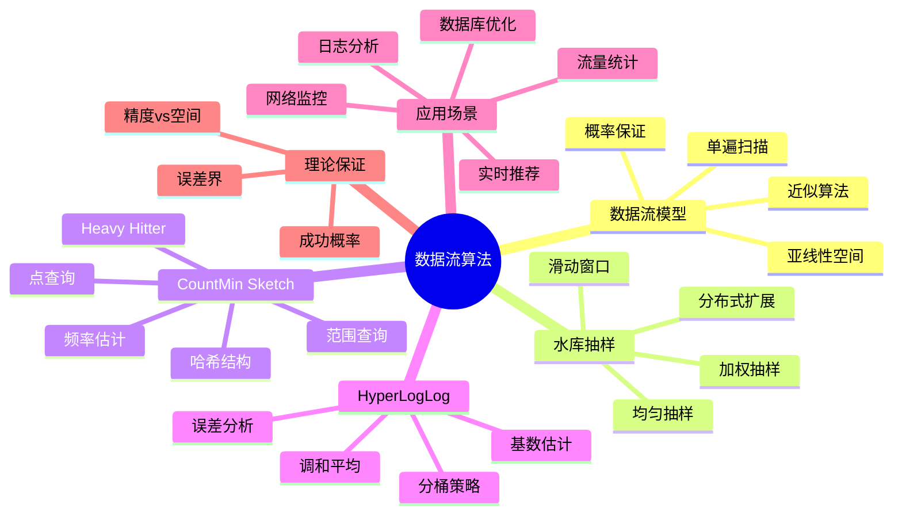
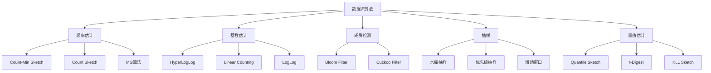
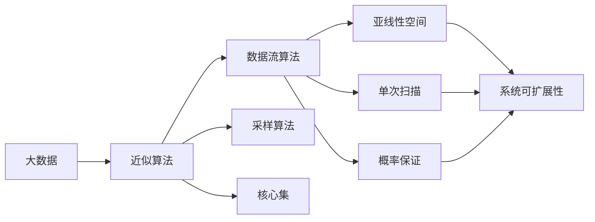

# 数据流算法 - 六维补充

## 思维导图



---

## 1. 基础定义

### 1.1 数据流模型

**数据流（Data Stream）**：

- 输入以流形式到达，长度 $n$ 可能极大甚至无限
- 算法只能单次扫描（single pass）或有限次数扫描
- 可用空间 $s \ll n$（亚线性空间）
- 处理时间必须足够快（通常 $O(1)$ 每个元素）

**形式化定义**：
流 $\sigma = (a_1, a_2, \ldots, a_n)$，其中 $a_i \in [m] = \{1, 2, \ldots, m\}$

**关键约束**：
$$\text{空间复杂度} = o(n) \text{ 或 } O(\text{polylog}(n))$$

### 1.2 数据流算法设计范式

| 技术 | 核心思想 | 代表算法 |
|------|----------|----------|
| **抽样** | 保留代表性样本 | 水库抽样 |
| **Sketches** | 紧凑摘要结构 | Count-Min, Count-Sketch |
| **哈希** | 随机投影降维 | Bloom Filter, HyperLogLog |
| **滑动窗口** | 关注近期数据 | Exponential Histogram |

### 1.3 近似保证类型

- **$(\epsilon, \delta)$-近似**：误差不超过 $\epsilon$ 的概率至少 $1-\delta$
- **相对误差**：$|估计值 - 真实值| / 真实值 \leq \epsilon$
- **加性误差**：$|估计值 - 真实值| \leq \epsilon \cdot ||f||_1$

---

## 2. 六维分析

### 2.1 维度分析表

| 维度 | 分析 | 关联概念 |
|------|------|----------|
| **逻辑结构** | 数据流算法构建紧凑的摘要数据结构，通过哈希或抽样将大规模数据投影到低维空间，保留关键统计特征 | 降维、摘要、哈希 |
| **代数性质** | Count-Min Sketch 使用线性映射，支持加法更新和合并；HyperLogLog 利用指数分布的极值估计基数 | 线性代数、概率论、极值统计 |
| **证明技术** | 马尔可夫不等式、切比雪夫不等式、切尔诺夫界用于证明误差界；成对独立性/全域哈希保证算法正确性 | 概率分析、集中不等式 |
| **复杂度** | 空间复杂度通常为 $O(\log n / \epsilon)$ 或 $O(1/\epsilon^2)$，处理时间 $O(1)$ 每个元素 | 亚线性算法、近似计算 |
| **算法实现** | 高度优化的位操作、哈希函数选择、并行处理（分布式sketch合并）| 系统优化、分布式计算 |
| **应用联系** | 广泛应用于网络流量监控（如Google的Dapper）、数据库查询优化（如PostgreSQL）、实时分析（如Spark Streaming）| 大数据系统、实时监控 |

### 2.2 数据流算法分类图



---

## 3. 水库抽样详解

### 3.1 问题定义

**目标**：从长度为 $n$（未知或极大）的流中均匀随机抽取 $k$ 个样本

**约束**：

- 只能单次扫描
- 不知道 $n$
- 空间 $O(k)$

### 3.2 算法（Vitter's Reservoir Sampling）

**算法流程**：

```
初始化: 将前 k 个元素放入水库
对于 i = k+1, k+2, ..., n:
    以概率 k/i 选择第 i 个元素
    若选中，随机替换水库中的一个元素
```

**正确性证明**：

对于任意元素 $a_j$，在结束时留在水库中的概率：
$$P[a_j \text{ 被选中}] = \frac{k}{j} \times \prod_{i=j+1}^n \left(1 - \frac{k}{i} \cdot \frac{1}{k}\right) = \frac{k}{n}$$

### 3.3 加权水库抽样

**场景**：每个元素 $a_i$ 有权重 $w_i$，按权重比例抽样

**算法（A-Res）**：

- 为每个元素生成随机键 $u^{1/w_i}$，其中 $u \sim U(0,1)$
- 维护键最大的 $k$ 个元素

**时间复杂度**：$O(n \log k)$（使用优先队列）

### 3.4 分布式水库抽样

**问题**：多个节点并行抽样，最后合并

**解决方案**：

- 每个节点独立进行水库抽样，得到 $k$ 个样本
- 合并时，将各节点的样本视为子流，再次进行水库抽样

---

## 4. Count-Min Sketch 详解

### 4.1 问题定义

**目标**：估计流中每个元素的出现频率

**流模型**：

- 元素来自全域 $[m] = \{1, 2, \ldots, m\}$
- 频率向量 $f = (f_1, f_2, \ldots, f_m)$，其中 $f_i$ 是元素 $i$ 的出现次数
- 总元素数 $n = \sum f_i$

**目标**：用亚线性空间估计 $\hat{f}_i \approx f_i$

### 4.2 数据结构

```
Count-Min Sketch:
- d 个哈希函数 h_1, ..., h_d: [m] -> [w]
- 二维数组 CMS[1..d][1..w]，初始化为0
```

**参数**：

- 宽度 $w = \lceil e/\epsilon \rceil$
- 深度 $d = \lceil \ln(1/\delta) \rceil$
- 空间：$O((1/\epsilon) \ln(1/\delta))$

### 4.3 算法

**更新**（元素 $x$ 到达）：

```
for j = 1 to d:
    CMS[j][h_j(x)] += 1
```

**查询**（元素 $x$ 的频率）：

```
return min_{j=1..d} CMS[j][h_j(x)]
```

### 4.4 误差分析

**定理**：对于任意元素 $x$，
$$f_x \leq \hat{f}_x \leq f_x + \epsilon ||f||_1$$

以概率至少 $1 - \delta$。

**证明要点**：

- 对于固定的 $j$，$E[CMS[j][h_j(x)]] = f_x + (||f||_1 - f_x)/w$
- 由马尔可夫不等式，$P[CMS[j][h_j(x)] - f_x \geq \epsilon ||f||_1] < 1/e$
- 取 $d$ 个哈希的最小值，失败概率降至 $e^{-d} = \delta$

### 4.5 Count Sketch（改进版）

**改进**：使用符号哈希 $g_j: [m] \rightarrow \{-1, +1\}$

**估计**：
$$\hat{f}_x = \text{median}_{j=1..d} \{g_j(x) \cdot CMS[j][h_j(x)]\}$$

**误差界**：
$$|f_x - \hat{f}_x| \leq \epsilon ||f_{-x}||_2$$

其中 $||f_{-x}||_2$ 是去掉 $f_x$ 后的 $L_2$ 范数。

---

## 5. HyperLogLog 详解

### 5.1 问题定义

**基数估计（Cardinality Estimation）**：
估计流中不同元素的个数（set cardinality）

**形式化**：给定流 $\sigma$，估计 $|\{a_i : 1 \leq i \leq n\}|$

### 5.2 核心思想

**观察**：

- 对于随机哈希函数 $h: [m] \rightarrow [0, 1]$（二进制表示）
- 不同元素 $x$ 的 $h(x)$ 期望均匀分布
- $h(x)$ 的二进制表示中，前导0的个数与基数相关

**直觉**：

- 若看到 $k$ 个前导0，期望约 $2^k$ 个不同元素

### 5.3 算法

**单寄存器算法**：

```
寄存器 R = 0
对于每个元素 x:
    R = max(R, rho(h(x)))
return 2^R
```

其中 $\rho(y)$ 是 $y$ 的二进制表示中前导0的个数。

**分桶改进（HyperLogLog）**：

```
使用 m = 2^b 个寄存器
对于元素 x:
    j = h_1(x)  // 桶索引 (b位)
    R[j] = max(R[j], rho(h_2(x)))

估计: E = alpha_m * m^2 / sum(2^{-R[j]})
```

### 5.4 参数与误差

| 参数 | 公式 | 典型值 |
|------|------|--------|
| 寄存器数 $m$ | $2^b$ | 2048 ($b=11$) |
| 空间 | $m \cdot \lceil \log_2 \log_2(n) \rceil$ bits | ~2KB |
| 标准误差 | $1.04/\sqrt{m}$ | ~2.3% |

**修正因子**：
$$\alpha_m = \left(m \int_0^\infty \left(\log_2\left(\frac{2+u}{1+u}\right)\right)^m du\right)^{-1}$$

对于 $m \geq 128$，$\alpha_m \approx 0.7213/(1 + 1.079/m)$

---

## 6. 复杂度分析

### 6.1 空间复杂度对比

```mermaid
graph LR
    subgraph 空间效率
        A1[精确计数] --> A[O(m)]
        A2[Hash表] --> B[O(n)]
        A3[CMS] --> C[O(1/ε)]
        A4[HLL] --> D[O(log log n)]
        A5[Bloom] --> E[O(n)]
    end

    C -.-> F[亚线性空间]
    D -.-> F
```

### 6.2 算法复杂度表

| 算法 | 空间复杂度 | 更新时间 | 查询时间 | 误差类型 |
|------|------------|----------|----------|----------|
| 水库抽样 | $O(k)$ | $O(1)$ | $O(1)$ | 无（精确均匀） |
| Count-Min | $O((1/\epsilon)\ln(1/\delta))$ | $O(\ln(1/\delta))$ | $O(\ln(1/\delta))$ | 加性 $\epsilon ||f||_1$ |
| Count Sketch | $O((1/\epsilon^2)\ln(1/\delta))$ | $O(\ln(1/\delta))$ | $O(\ln(1/\delta))$ | $\epsilon ||f_{-x}||_2$ |
| HyperLogLog | $O(\log \log n)$ | $O(1)$ | $O(1)$ | 相对 $1.04/\sqrt{m}$ |
| Bloom Filter | $O(n)$ bits | $O(\ln(1/\delta))$ | $O(\ln(1/\delta))$ | 假阳性率 $\delta$ |
| t-Digest | $O(1/\delta)$ | $O(\ln(1/\delta))$ | $O(1)$ | 分位数误差 |

---

## 7. 代码示例

### 7.1 水库抽样实现

```python
"""
水库抽样算法实现
包括基本版本、加权版本和分布式版本
"""

from typing import List, TypeVar, Generic, Iterator, Tuple
import random
import math
from dataclasses import dataclass
from heapq import heappush, heappop

T = TypeVar('T')

class ReservoirSampler(Generic[T]):
    """
    水库抽样 - Vitter算法
    从数据流中均匀随机抽取k个样本
    """

    def __init__(self, k: int):
        if k <= 0:
            raise ValueError("k must be positive")
        self.k = k
        self.reservoir: List[T] = []
        self.count = 0  # 已处理的元素数

    def add(self, item: T) -> bool:
        """
        添加元素到流
        返回是否被选中进入水库
        """
        self.count += 1

        if len(self.reservoir) < self.k:
            # 前k个元素直接放入
            self.reservoir.append(item)
            return True
        else:
            # 以概率 k/count 替换
            j = random.randint(1, self.count)
            if j <= self.k:
                # 替换水库中的第j-1个元素
                self.reservoir[j - 1] = item
                return True
            return False

    def get_sample(self) -> List[T]:
        """获取当前样本"""
        return self.reservoir.copy()

    def get_sample_size(self) -> int:
        return len(self.reservoir)

    def get_stream_size(self) -> int:
        return self.count


def demo_reservoir_sampling():
    """水库抽样演示"""
    print("=" * 60)
    print("水库抽样演示")
    print("=" * 60)

    # 基本水库抽样
    print("\n1. 基本水库抽样 (k=5)")
    sampler = ReservoirSampler[int](k=5)
    stream = list(range(1, 101))  # 1到100

    for item in stream:
        sampler.add(item)

    print(f"流大小: {sampler.get_stream_size()}")
    print(f"样本: {sorted(sampler.get_sample())}")

    # 验证均匀性（多次运行）
    print("\n均匀性验证（1000次运行，统计每个数被选中的频率）:")
    freq = {i: 0 for i in range(1, 11)}
    for _ in range(1000):
        s = ReservoirSampler[int](k=3)
        for i in range(1, 11):
            s.add(i)
        for x in s.get_sample():
            if x in freq:
                freq[x] += 1

    expected = 1000 * 3 / 10
    print(f"期望频率: {expected:.1f}")
    for i in range(1, 11):
        print(f"  数字 {i}: {freq[i]} 次")


if __name__ == "__main__":
    demo_reservoir_sampling()
```

### 7.2 Count-Min Sketch 实现

```python
"""
Count-Min Sketch 实现
频率估计和 heavy hitter 检测
"""

from typing import List, Tuple, Dict, Set
import hashlib
import math
from dataclasses import dataclass

class CountMinSketch:
    """
    Count-Min Sketch 实现

    参数:
        epsilon: 误差参数，控制估计精度
        delta: 失败概率参数

    空间: O((1/epsilon) * ln(1/delta))
    误差保证: f_x <= f_hat_x <= f_x + epsilon * ||f||_1
    """

    def __init__(self, epsilon: float = 0.001, delta: float = 0.01):
        self.epsilon = epsilon
        self.delta = delta

        # 计算维度
        self.w = int(math.ceil(math.e / epsilon))
        self.d = int(math.ceil(math.log(1.0 / delta)))

        # 初始化计数器
        self.C = [[0] * self.w for _ in range(self.d)]

        # 初始化哈希函数
        self.hash_params = []
        import random
        random.seed(42)
        for _ in range(self.d):
            a = random.randint(1, 2**31)
            b = random.randint(0, 2**31)
            self.hash_params.append((a, b))

        self.total_count = 0

    def _hash(self, x: str, j: int) -> int:
        """第j个哈希函数"""
        a, b = self.hash_params[j]
        x_hash = hash(x) & 0x7FFFFFFF
        return ((a * x_hash + b) % (2**31)) % self.w

    def add(self, x: str, count: int = 1):
        """添加元素x，增加count次"""
        self.total_count += count
        for j in range(self.d):
            idx = self._hash(x, j)
            self.C[j][idx] += count

    def estimate(self, x: str) -> int:
        """估计元素x的频率"""
        min_count = float('inf')
        for j in range(self.d):
            idx = self._hash(x, j)
            min_count = min(min_count, self.C[j][idx])
        return min_count

    def estimate_error_bound(self) -> float:
        """返回误差上界"""
        return self.epsilon * self.total_count


def demo_count_min_sketch():
    """Count-Min Sketch演示"""
    print("=" * 60)
    print("Count-Min Sketch 演示")
    print("=" * 60)

    cms = CountMinSketch(epsilon=0.01, delta=0.001)

    # 模拟数据流
    import random
    random.seed(42)

    n = 100000
    items = []
    for i in range(n):
        item_id = random.paretovariate(1.5)
        item = f"item_{int(item_id) % 1000}"
        items.append(item)
        cms.add(item)

    print(f"\n总元素数: {cms.total_count}")
    print(f"CMS参数: w={cms.w}, d={cms.d}")
    print(f"空间使用: {cms.d * cms.w * 4} bytes")
    print(f"理论误差界: {cms.estimate_error_bound():.0f}")

    # 统计真实频率
    from collections import Counter
    true_freq = Counter(items)

    # 验证估计精度
    print("\n频率估计精度（前10个高频元素）:")
    top_items = true_freq.most_common(10)

    print(f"{'元素':<15} {'真实频率':<12} {'估计频率':<12} {'误差':<10}")
    print("-" * 55)

    for item, true_count in top_items:
        est_count = cms.estimate(item)
        error = est_count - true_count
        print(f"{item:<15} {true_count:<12} {est_count:<12} {error:<10}")


if __name__ == "__main__":
    demo_count_min_sketch()
```

### 7.3 HyperLogLog 实现

```python
"""
HyperLogLog 实现
基数估计算法
"""

import math
import hashlib
from typing import List

class HyperLogLog:
    """
    HyperLogLog 基数估计算法

    参数:
        p: 精度参数，寄存器数量 m = 2^p

    标准误差: 1.04 / sqrt(m)
    空间: m * log2(log2(n)) bits
    """

    ALPHA_VALUES = {16: 0.673, 32: 0.697, 64: 0.709}

    def __init__(self, p: int = 14):
        if not 4 <= p <= 16:
            raise ValueError("p must be between 4 and 16")

        self.p = p
        self.m = 1 << p

        if self.m in self.ALPHA_VALUES:
            self.alpha = self.ALPHA_VALUES[self.m]
        else:
            self.alpha = 0.7213 / (1 + 1.079 / self.m)

        self.M = [0] * self.m
        self.mask = (1 << p) - 1

    def _hash(self, item: str) -> int:
        """计算64位哈希值"""
        h = hashlib.md5(str(item).encode()).digest()
        return int.from_bytes(h[:8], 'little')

    def _rho(self, w: int) -> int:
        """计算前导0的个数"""
        if w == 0:
            return 64 - self.p + 1

        bits = 64 - self.p
        for i in range(bits, 0, -1):
            if w & (1 << (i - 1)):
                return bits - i + 1
        return bits + 1

    def add(self, item: str):
        """添加元素"""
        x = self._hash(item)
        j = x & self.mask
        w = x >> self.p
        self.M[j] = max(self.M[j], self._rho(w))

    def count(self) -> float:
        """估计基数"""
        Z = sum(2**(-m) for m in self.M)
        E = self.alpha * self.m * self.m / Z

        # 小范围修正
        if E <= 2.5 * self.m:
            V = sum(1 for m in self.M if m == 0)
            if V != 0:
                E = self.m * math.log(self.m / V)

        return E

    def error_rate(self) -> float:
        """返回标准误差"""
        return 1.04 / math.sqrt(self.m)


def demo_hyperloglog():
    """HyperLogLog演示"""
    print("=" * 60)
    print("HyperLogLog 基数估计演示")
    print("=" * 60)

    for p in [10, 12, 14]:
        print(f"\n--- 精度 p = {p} ---")

        import random
        random.seed(42)

        for true_cardinality in [1000, 10000, 100000]:
            hll = HyperLogLog(p=p)
            seen = set()

            for i in range(true_cardinality * 2):
                item = f"user_{random.randint(1, true_cardinality)}"
                hll.add(item)
                seen.add(item)

            actual_cardinality = len(seen)
            estimated = hll.count()
            error = abs(estimated - actual_cardinality) / actual_cardinality * 100

            print(f"  真实基数: {actual_cardinality}")
            print(f"  估计基数: {estimated:.0f}")
            print(f"  相对误差: {error:.2f}%")
            print(f"  理论误差: {hll.error_rate()*100:.2f}%")
            print()


if __name__ == "__main__":
    demo_hyperloglog()
```

---

## 8. 与其他概念的联系

### 8.1 数据流算法与近似计算



### 8.2 工业应用对比

| 系统 | 使用算法 | 应用场景 |
|------|----------|----------|
| **Google** | HyperLogLog, Count-Min | Dapper, BigQuery |
| **Facebook** | HyperLogLog | Presto, Cardinality Estimation |
| **Redis** | HyperLogLog | PFADD, PFCOUNT |
| **Spark** | HyperLogLog++, t-Digest | approximate distinct count |
| **PostgreSQL** | n_distinct estimation | Query optimizer |
| **ClickHouse** | HyperLogLog, Count-Min | Real-time analytics |

---

## 9. 参考文献

1. **P. Flajolet et al.**, "HyperLogLog: the analysis of a near-optimal cardinality estimation algorithm", *Discrete Mathematics and Theoretical Computer Science*, 2007
2. **G. Cormode and S. Muthukrishnan**, "An Improved Data Stream Summary: The Count-Min Sketch and its Applications", *Journal of Algorithms*, 2005
3. **J. S. Vitter**, "Random Sampling with a Reservoir", *ACM Transactions on Mathematical Software*, 1985
4. **A. Metwally et al.**, "An Integrated Efficient Solution for Computing Frequent and Top-k Elements in Data Streams", *ACM Transactions on Database Systems*, 2006
5. **T. Dunning**, "Computing Extremely Accurate Quantiles Using t-Digests", 2013
