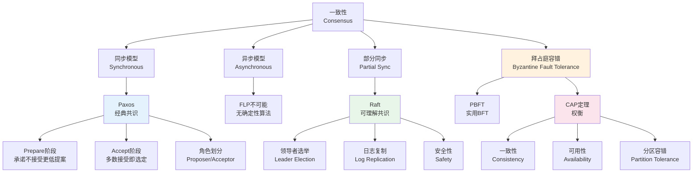
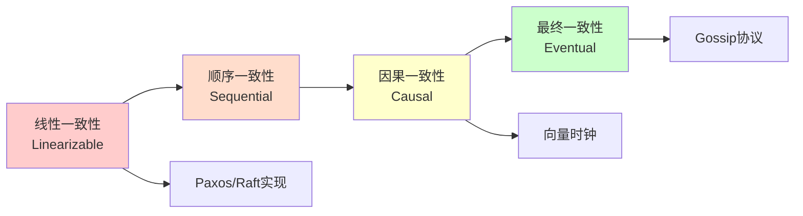
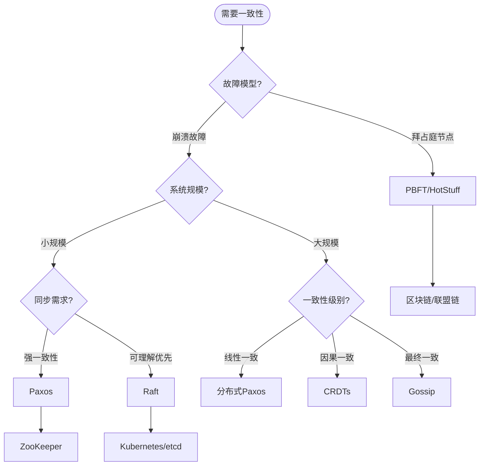
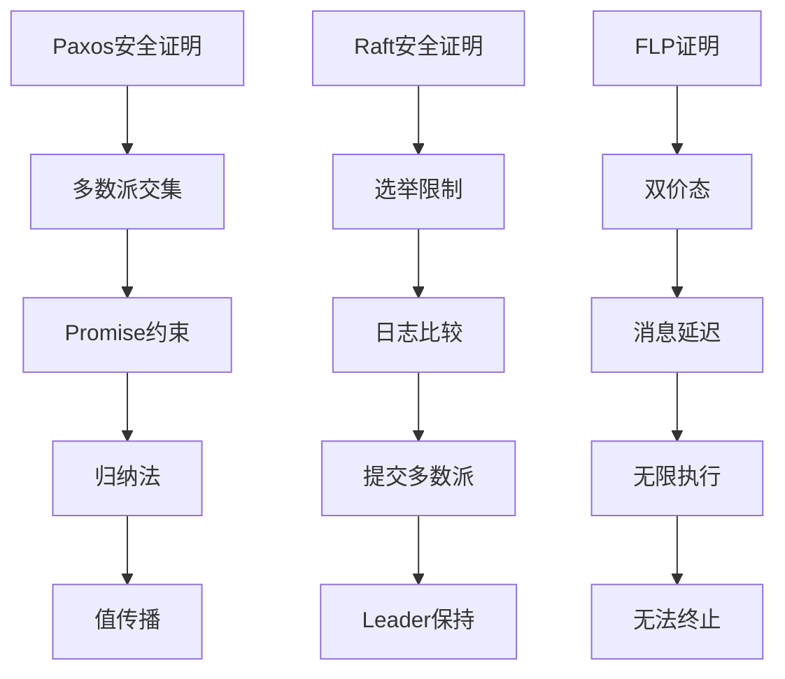

# 一致性算法 - 六维内容补充


> **版本**: 1.0
> **创建日期**: 2026-04-19
> **最后更新**: 2026-04-19

> **模块**: 10-高级主题/05-分布式算法
> **文档**: 分布式一致性理论
> **补充维度**: 概念定义、属性、关系、解释、论证、形式证明
> **对标**: MIT 6.824 / Stanford CS 244b / Paxos/Raft论文
> **深度**: 研究生级

---

## 思维导图：分布式一致性算法概念结构



---

## 一、概念定义 (Concept Definition)

### 1.1 分布式一致性 (Consensus)

**定义 1.1.1** (形式化)

**共识问题**: $n$ 个进程 $p_1, p_2, \ldots, p_n$ 就一个值达成一致，满足：

| 性质 | 定义 |
|------|------|
| **终止性** (Termination) | 每个正确进程最终决定是否值 |
| **一致性** (Agreement) | 所有正确进程决定的值相同 |
| **有效性** (Validity) | 决定的值必须是某个进程提议的值 |

**共识的变体**:

- **拜占庭共识**: 容忍任意故障（包括恶意行为）
- **崩溃容错共识**: 仅容忍崩溃故障

---

### 1.2 Paxos算法

**定义 1.2.1** (形式化)

**Paxos**是Leslie Lamport提出的共识算法，基于**多数派**原则：

**角色**:

- **Proposer**: 提出提案 (proposal)
- **Acceptor**: 接受或拒绝提案
- **Learner**: 学习已选定的值

**提案编号**: $(n, v)$，其中 $n$ 是全局唯一递增编号，$v$ 是提议值

**两阶段协议**:

**Phase 1 - Prepare/Promise**:

```
Proposer → Acceptor: Prepare(n)
Acceptor → Proposer: Promise(n, (n_prev, v_prev)) 或 Reject
```

条件: Acceptor承诺不再接受编号小于 $n$ 的提案

**Phase 2 - Accept/Learn**:

```
Proposer → Acceptor: Accept(n, v)  // v = max{v_prev} 或新值
Acceptor → Proposer: Accepted(n, v) 或 Reject
```

条件: 如果 Acceptor 未承诺更高编号，则接受

**安全条件**: 值被选定当且仅当多数Acceptor接受

---

### 1.3 Raft算法

**定义 1.3.1** (形式化)

**Raft**是Diego Ongaro提出的**强领导者**共识算法：

**状态**:

- **Leader**: 处理所有客户端请求，复制日志
- **Follower**: 被动接收Leader的日志
- **Candidate**: 竞选Leader时的临时状态

**Term** (任期): 单调递增的逻辑时钟，每个Term最多一个Leader

**核心机制**:

| 机制 | 目的 | 实现 |
|------|------|------|
| **Leader Election** | 选主 | 超时触发投票，得多数票者胜 |
| **Log Replication** | 复制 | Leader追加日志，Follower确认 |
| **Safety** | 安全 | 选举限制 + 提交规则 |

**日志条目**: $(term, index, command)$

**Leader Complete Property**: 如果日志条目在某任期提交，则出现在所有后续任期Leader的日志中

---

### 1.4 拜占庭容错 (BFT)

**定义 1.4.1** (形式化)

**拜占庭故障**: 进程可能表现任意行为，包括发送矛盾信息、不发送信息等

**拜占庭容错共识**需要满足：

- 在最多 $f$ 个拜占庭节点存在时，仍能达成一致
- **下界**: 需要至少 $n \geq 3f + 1$ 个节点

**PBFT (Practical Byzantine Fault Tolerance)**:

三阶段协议：

1. **PRE-PREPARE**: Leader分配序列号
2. **PREPARE**: 节点验证并广播准备消息
3. **COMMIT**: 收到 $2f$ 个准备消息后广播提交

**视图更换 (View Change)**: Leader故障时触发新Leader选举

---

## 二、属性 (Properties)

### 2.1 共识算法对比

| 特性 | Paxos | Raft | PBFT |
|------|-------|------|------|
| **故障模型** | 崩溃容错 | 崩溃容错 | 拜占庭容错 |
| **领导者** | 无 | 有 | 有 |
| **消息复杂度** | $O(n^2)$ | $O(n)$ | $O(n^3)$ |
| **故障节点数** | $< n/2$ | $< n/2$ | $< n/3$ |
| **活性保证** | 需部分同步 | 需部分同步 | 需同步 |
| **工程实现** | 难 | 易 | 复杂 |
| **代表系统** | Chubby, ZooKeeper | etcd, Consul | Hyperledger |

### 2.2 FLP不可能结果

| 条件 | 结果 |
|------|------|
| 异步网络 + 即使1个故障 | 不存在确定性共识算法 |
| 需要 | 随机化或同步假设 |

**FLP定理**: Fischer, Lynch, Paterson证明，在异步分布式系统中，即使只有一个进程可能故障，也不存在确定性的共识算法。

### 2.3 CAP定理

| 属性 | 描述 | 两难选择 |
|------|------|----------|
| **C (Consistency)** | 所有节点看到相同数据 | CP系统: 牺牲可用性 |
| **A (Availability)** | 每个请求都收到响应 | AP系统: 牺牲一致性 |
| **P (Partition Tolerance)** | 分区后仍能运行 | 必须满足 |

**CAP权衡**:

- **CP系统**: ZooKeeper, etcd, HBase
- **AP系统**: Dynamo, Cassandra, Riak

---

## 三、关系 (Relations)

### 3.1 概念关系表

| 源概念 | 目标概念 | 关系类型 | 说明 |
|--------|----------|----------|------|
| Paxos | Multi-Paxos | extends | 支持多值共识 |
| Raft | Multi-Paxos | similar_to | 功能等价，更易理解 |
| PBFT | Paxos | extends | 支持拜占庭故障 |
| Raft | 强领导者 | uses | Leader驱动所有操作 |
| FLP | 随机化算法 | necessitates | 规避不可能结果 |
| CAP | 分布式系统 | constrains | 设计权衡框架 |

### 3.2 一致性级别谱系



### 3.3 算法应用场景决策图



---

## 四、解释 (Explanation)

### 4.1 动机与直观

**为什么需要共识算法？**

分布式系统中，数据在多个节点复制，需要保证：

1. **可靠性**: 单点故障不丢数据
2. **一致性**: 所有副本保持一致

**Paxos的直观**:

"像议会投票一样"——提案者提出议案，议员多数接受则通过。
关键洞察：**两个多数派必有交集**，保证值的一致性。

**Raft的直观**:

"有一个明确的领导者负责协调"——简化Paxos，通过强领导者模型使算法更易理解和实现。

**拜占庭容错的直观**:

"叛徒可能说谎"——需要冗余验证，通过 $3f+1$ 节点保证即使 $f$ 个叛徒也能达成共识。

### 4.2 与已有概念的联系

**共识 ↔ 复制状态机**:

复制状态机通过**相同的初始状态 + 相同的操作序列**实现一致性，共识算法保证所有节点对操作序列达成一致。

**Raft ↔ 日志**:

Raft将所有操作记录到**日志**，通过保证日志一致性实现状态机复制。

### 4.3 示例与反例

**示例 4.3.1**: Raft Leader选举

```
Term 1:  Follower A  --超时-->  Candidate A  --请求投票-->  成为Leader
Term 2:  Leader A故障  --B超时-->  Candidate B  --获多数票-->  新Leader
```

**反例 4.3.2**: 脑裂场景

网络分区导致两个Leader（每个分区一个），违反安全性。

Raft通过**Term**机制解决：旧Term的Leader提交的值可能被新Leader覆盖。

**反例 4.3.3**: 拜占庭将军问题

3个将军，1个叛徒：

- 忠诚将军A收到"攻击"和"撤退"
- 无法判断谁是叛徒

需要至少4个将军（$3f+1$）才能容忍1个叛徒。

---

## 五、论证 (Argumentation)

### 5.1 非形式论证：为什么Paxos是安全的？

**核心思想**: 两个多数派必有交集。

**论证步骤**:

1. **提案编号唯一**: 每个提案有唯一递增编号。

2. **Promise约束**: Acceptor承诺不接受更低编号提案。

3. **值的选择**: Proposer选择已承诺值中的最大值（或新值）。

4. **安全性**: 如果值 $v$ 被选定（多数Accept），则后续提案必然选择 $v$：
   - 后续提案的Prepare到达多数Acceptor
   - 与已接受 $v$ 的多数派有交集
   - 交集的Acceptor已接受 $v$，会告知Proposer
   - Proposer必须使用 $v$

### 5.2 反例与边界

**边界情况 5.2.1**: Paxos的活性问题

两个Proposer竞争：

- Proposer 1: Prepare(1), 收到Promise
- Proposer 2: Prepare(2), 收到Promise
- Proposer 1: Accept(1, v) - 被拒绝（已承诺2）
- Proposer 1: Prepare(3), ...

**活锁**: 可能无限循环，需要随机退避。

**边界情况 5.2.2**: Raft的日志不一致

Leader和Follower日志可能分歧：

- Leader有额外条目
- Follower有Leader没有的旧条目

Raft通过**强制Follower复制Leader日志**解决，覆盖Follower的冲突条目。

---

## 六、形式证明 (Formal Proof)

### 6.1 Paxos安全证明

**定理 6.1.1** (Paxos安全性): 如果值 $v$ 被选定，则所有被选定的值都是 $v$。

**证明**:

**定义**: 值被选定 = 多数Acceptor接受了该值的提案。

**引理 6.1.2**: 如果提案 $(n, v)$ 被多数Acceptor接受，则任何被多数Acceptor接受的提案 $(n', v')$ 且 $n' > n$ 都有 $v' = v$。

**引理证明** (归纳法):

基础: 第一个被接受的提案显然满足。

归纳: 假设所有编号小于 $n'$ 的已接受提案值都为 $v$。

设提案 $(n', v')$ 被多数 $Q'$ 接受。

在Phase 1，Proposer向多数 $S$ 发送Prepare $(n')$，收到Promise。

$S \cap Q \neq \emptyset$（两个多数派交集非空）。

设 $a \in S \cap Q$，则 $a$ 已接受某个 $(n_a, v_a)$ 且 $n_a < n'$。

由归纳假设，$v_a = v$。

Proposer选择 $v' = \max\{v_a\} = v$。

因此 $v' = v$。$\square$

**完成证明**:

如果 $v$ 被选定，由引理，所有后续被选定的值都等于 $v$。$\square$

### 6.2 Raft安全证明

**定理 6.2.1** (Raft Leader完备性): 如果日志条目在某任期提交，则该条目出现在所有更高任期Leader的日志中。

**证明**:

**选举限制**: Candidate必须获得多数投票。其日志必须至少和投票者一样新（Term更大，或Term相同但Index更大）。

**提交规则**: 条目被复制到多数节点后才提交。

设条目 $e$ 在任期 $T$ 提交，则 $e$ 在多数节点的日志中。

设新Leader在任期 $T' > T$ 当选，则它获得多数投票。

新Leader和提交 $e$ 的多数派有交集。

交集中的节点已存储 $e$，新Leader的日志至少和该节点一样新，因此包含 $e$。$\square$

### 6.3 FLP不可能性证明概要

**定理 6.3.1** (FLP): 在异步系统中，即使只有一个进程可能故障，也不存在确定性的共识算法。

**证明概要**:

**双价态 (Bivalent)**: 初始配置可能达成0或1。

**关键引理**: 从任何双价态配置，存在一系列步骤到达另一个双价态配置。

**构造无限执行**: 通过不断延迟某进程的消息，可以构造无限执行而不决定。

因此没有算法能保证终止。$\square$

### 6.4 证明决策树



---

## 6.5 Raft 活性证明思路

**定理 6.5.1** (Raft 活性，部分同步假设下)
在部分同步网络中，若选举超时时间随机取自区间 $[T_{\min}, T_{\max}]$，且 $T_{\max} < T_{\text{heartbeat}}$（心跳间隔），则系统以高概率最终选出唯一 Leader 并完成日志提交。

*证明概要*：

1. **选举分割概率有界**：由于各节点超时独立且均匀分布，两个及以上节点同时超时的概率随节点数 $n$ 和区间宽度增大而指数衰减。
2. **Leader 唯一性**：一旦某节点获得多数票成为 Leader，其 Term 大于所有其他节点；旧 Leader 的心跳无法覆盖新 Term，故旧 Leader 会退化为 Follower。
3. **日志推进**：Leader 周期性发送 AppendEntries；在部分同步假设下（消息延迟最终有界），Follower 最终接收并确认日志；当多数节点确认后，Leader 提交该条目。
4. **终止性**：若 Leader 崩溃，Follower 在随机超时后触发新一轮选举；由步骤 1 可知，有限轮次内必能选出新的唯一 Leader。∎

---

## 6.6 Paxos 活性证明思路

**定理 6.6.1** (Paxos 活性，带 Distinguished Proposer)
若网络满足 eventual delivery，且存在一个稳定的 Distinguished Proposer（Leader），则所有客户端请求最终都会被接受并选定。

*证明概要*：

1. **Prepare 阶段终止**：Leader 向多数 Acceptor 发送 Prepare$(n)$；由于 eventual delivery，Leader 最终收到多数 Promise。
2. **Accept 阶段终止**：Leader 选择已承诺值中的最大值（或新值），向多数 Acceptor 发送 Accept$(n,v)$；同样由于 eventual delivery，多数 Acceptor 最终接受该值。
3. **无冲突**：由于 Promise 约束，编号 $n$ 一旦获得多数 Promise，更低编号的提案被拒绝，因此该值必然被选定。
4. **请求串行化**：若 Leader 变更，新 Leader 使用更高编号重新执行两阶段；在稳定 Leader 假设下，客户端请求在有限时间内完成两阶段，实现终止。∎

---

## 七、2024–2025 前沿进展

### 7.1 BFT 共识的形式化验证新进展

2024–2025 年，分布式共识算法的形式化验证取得重要进展。[Zhao et al. 2024] 在 CCS 上提出了组合式验证框架，可对由多个拜占庭容错子协议构成的复合协议进行模块化安全性证明。[Zeng et al. 2025] 则在通用可组合（UC）框架下首次给出了 HotStuff 协议的完整终止性证明，建立了指数退避超时机制与协议活性之间的定量关系，为工业级区块链系统（如 Diem、长安链）提供了严格的理论基础。

### 7.2 HotStuff 及其工程优化

HotStuff 以其线性视图切换复杂度在大规模联盟链中得到广泛应用。2024 年，[Wang et al. 2024] 提出了基于 HotStuff 的快速响应共识改进算法，通过消息聚合树与动态阈值机制降低了多 Leader 故障场景下的延迟。此外，流水线（pipelining）与乐观响应（optimistic responsiveness）等优化已被 Aptos、Diem 等生产系统采用，实测吞吐量可达 10,000+ TPS [Accelar 2026]。

### 7.3 Raft 在新兴场景中的扩展

Raft 的工程实现持续向边缘计算与联邦学习等场景扩展。[Dautov and Husom 2024] 将 Raft 协议引入联邦学习系统，用于协调多节点的模型聚合与容错恢复，验证了 Raft 在非传统分布式存储场景中的适用性。同时，Multi-Raft 架构（如 TiKV、CockroachDB）通过将数据分片为多个独立的 Raft 组，实现了水平扩展，已成为大规模分布式数据库的主流设计模式。

---

## 参考文献

[1] Lamport, L. (2001). "Paxos made simple". *ACM SIGACT News*, 32(4), 18–25. DOI: 10.1145/568425.568433

[2] Ongaro, D., and Ousterhout, J. (2014). "In search of an understandable consensus algorithm". In *Proceedings of the 2014 USENIX Annual Technical Conference (USENIX ATC'14)* (pp. 305–319).

[3] Fischer, M. J., Lynch, N. A., and Paterson, M. S. (1985). "Impossibility of distributed consensus with one faulty process". *Journal of the ACM*, 32(2), 374–382. DOI: 10.1145/3149.214121

[4] Woos, D., Wilcox, J. R., Anton, S., et al. (2016). "Planning for change in a formal verification of the Raft consensus protocol". In *Proceedings of the 5th ACM SIGPLAN Conference on Certified Programs and Proofs (CPP 2016)* (pp. 154–165). DOI: 10.1145/2854065.2854081

[5] Yin, M., Malkhi, D., Reiter, M. K., et al. (2019). "HotStuff: BFT consensus with linearity and responsiveness". In *Proceedings of the 2019 ACM Symposium on Principles of Distributed Computing (PODC'19)* (pp. 347–356). DOI: 10.1145/3293611.3331591

[6] Zhao, Q., Pirlea, G., Grzeszkiewicz, K., et al. (2024). "Compositional verification of composite Byzantine protocols". In *Proceedings of the 2024 ACM SIGSAC Conference on Computer and Communications Security (CCS'24)* (pp. 34–48). DOI: 10.1145/3658644.3690355

[7] Zeng, Y., Dong, Z., and Xu, X. (2025). "On the termination of the HotStuff protocol within the UC framework". *IACR Cryptology ePrint Archive*, 2025/1560.

[8] Wang, R., Yuan, M., Wang, Z., and Li, Y. (2024). "Improved fast response consensus algorithm based on HotStuff". *Sensors*, 24(16), 5417. DOI: 10.3390/s24165417

[9] Dautov, R., and Husom, E. J. (2024). "Raft protocol for fault tolerance and self-recovery in federated learning". In *Proceedings of the 19th IEEE/ACM International Symposium on Software Engineering for Adaptive and Self-Managing Systems (SEAMS 2024)*. DOI: 10.1145/3643915.3644093

[10] Accelar. (2026). "HotStuff BFT consensus internals: from theory to production". Retrieved from <https://www.accelar.io/blog/hotstuff-bft-consensus-internals> [Accessed: 2026-04-15]

---

## 七、多语言实现：一致性算法

### 7.1 Python: Raft简化实现

```python
import random
import time
from enum import Enum, auto
from typing import Dict, List, Optional, Tuple
from dataclasses import dataclass, field

class State(Enum):
    FOLLOWER = auto()
    CANDIDATE = auto()
    LEADER = auto()

@dataclass
class LogEntry:
    term: int
    command: str

@dataclass
class RaftNode:
    """Raft节点简化实现"""
    node_id: int
    peers: List[int] = field(default_factory=list)

    # 持久状态
    current_term: int = 0
    voted_for: Optional[int] = None
    log: List[LogEntry] = field(default_factory=list)

    # 易失状态
    state: State = State.FOLLOWER
    commit_index: int = 0
    last_applied: int = 0

    # Leader状态
    next_index: Dict[int, int] = field(default_factory=dict)
    match_index: Dict[int, int] = field(default_factory=dict)

    # 超时
    election_timeout: float = field(default_factory=lambda: random.uniform(0.15, 0.3))
    last_heartbeat: float = field(default_factory=time.time)

    def become_candidate(self):
        """成为候选人"""
        self.state = State.CANDIDATE
        self.current_term += 1
        self.voted_for = self.node_id
        self.last_heartbeat = time.time()
        print(f"Node {self.node_id}: Become candidate for term {self.current_term}")

    def become_leader(self):
        """成为Leader"""
        self.state = State.LEADER
        for peer in self.peers:
            self.next_index[peer] = len(self.log) + 1
            self.match_index[peer] = 0
        print(f"Node {self.node_id}: Become leader for term {self.current_term}")

    def request_vote(self, candidate_id: int, term: int,
                     last_log_index: int, last_log_term: int) -> Tuple[int, bool]:
        """处理投票请求"""
        if term < self.current_term:
            return self.current_term, False

        if term > self.current_term:
            self.current_term = term
            self.voted_for = None
            self.state = State.FOLLOWER

        # 检查日志是否至少和自己一样新
        my_last_term = self.log[-1].term if self.log else 0
        log_ok = (last_log_term > my_last_term or
                  (last_log_term == my_last_term and last_log_index >= len(self.log)))

        if (self.voted_for is None or self.voted_for == candidate_id) and log_ok:
            self.voted_for = candidate_id
            self.last_heartbeat = time.time()
            return self.current_term, True

        return self.current_term, False

    def append_entries(self, term: int, leader_id: int, prev_log_index: int,
                       prev_log_term: int, entries: List[LogEntry],
                       leader_commit: int) -> Tuple[int, bool]:
        """处理日志复制请求"""
        if term < self.current_term:
            return self.current_term, False

        self.last_heartbeat = time.time()

        if term > self.current_term:
            self.current_term = term
            self.voted_for = None

        self.state = State.FOLLOWER

        # 检查日志匹配
        if prev_log_index > 0:
            if prev_log_index > len(self.log):
                return self.current_term, False
            if self.log[prev_log_index - 1].term != prev_log_term:
                return self.current_term, False

        # 追加新条目
        for i, entry in enumerate(entries):
            idx = prev_log_index + i
            if idx < len(self.log):
                if self.log[idx].term != entry.term:
                    self.log = self.log[:idx]  # 删除冲突条目
                    self.log.append(entry)
            else:
                self.log.append(entry)

        # 更新commit_index
        if leader_commit > self.commit_index:
            self.commit_index = min(leader_commit, len(self.log))

        return self.current_term, True

    def tick(self) -> Optional[dict]:
        """时钟滴答，检查超时"""
        now = time.time()

        if self.state == State.FOLLOWER:
            if now - self.last_heartbeat > self.election_timeout:
                self.become_candidate()
                # 发送投票请求（简化：直接返回RPC）
                return {
                    'type': 'request_vote',
                    'term': self.current_term,
                    'candidate_id': self.node_id,
                    'last_log_index': len(self.log),
                    'last_log_term': self.log[-1].term if self.log else 0
                }

        elif self.state == State.CANDIDATE:
            if now - self.last_heartbeat > self.election_timeout:
                self.become_candidate()  # 重新选举
                return {
                    'type': 'request_vote',
                    'term': self.current_term,
                    'candidate_id': self.node_id,
                    'last_log_index': len(self.log),
                    'last_log_term': self.log[-1].term if self.log else 0
                }

        elif self.state == State.LEADER:
            # Leader发送心跳
            if now - self.last_heartbeat > 0.05:  # 50ms心跳
                self.last_heartbeat = now
                return {
                    'type': 'heartbeat',
                    'term': self.current_term,
                    'leader_id': self.node_id,
                    'leader_commit': self.commit_index
                }

        return None

    def client_request(self, command: str) -> bool:
        """处理客户端请求（仅Leader）"""
        if self.state != State.LEADER:
            return False

        entry = LogEntry(self.current_term, command)
        self.log.append(entry)
        print(f"Node {self.node_id}: Appended {command} at index {len(self.log)}")
        return True


# 模拟Raft集群
class RaftCluster:
    def __init__(self, num_nodes: int = 5):
        self.nodes: Dict[int, RaftNode] = {}
        for i in range(num_nodes):
            peers = [j for j in range(num_nodes) if j != i]
            self.nodes[i] = RaftNode(node_id=i, peers=peers)

    def simulate(self, duration: float = 2.0):
        """运行模拟"""
        start = time.time()
        votes: Dict[int, int] = {}  # term -> 票数

        while time.time() - start < duration:
            for node_id, node in self.nodes.items():
                rpc = node.tick()
                if rpc:
                    if rpc['type'] == 'request_vote':
                        # 广播投票请求
                        votes[node.current_term] = 1  # 自己一票
                        for peer_id in node.peers:
                            peer = self.nodes[peer_id]
                            term, granted = peer.request_vote(
                                rpc['candidate_id'], rpc['term'],
                                rpc['last_log_index'], rpc['last_log_term']
                            )
                            if granted:
                                votes[node.current_term] = votes.get(node.current_term, 0) + 1

                        # 检查是否当选
                        if votes.get(node.current_term, 0) > len(self.nodes) // 2:
                            node.become_leader()

            time.sleep(0.01)

        # 打印最终状态
        print("\n=== Final State ===")
        for node_id, node in self.nodes.items():
            print(f"Node {node_id}: {node.state.name}, Term: {node.current_term}")


if __name__ == "__main__":
    cluster = RaftCluster(5)
    cluster.simulate(1.0)
```

## 7.2 Rust: 分布式共识基础类型

### 7.2 Rust: 分布式共识基础类型

```rust
use std::collections::{HashMap, HashSet};

/// 节点ID
pub type NodeId = u64;
/// 任期
pub type Term = u64;
/// 日志索引
pub type LogIndex = u64;

/// 共识状态
#[derive(Clone, Copy, Debug, PartialEq)]
pub enum ConsensusState {
    Follower,
    Candidate,
    Leader,
}

/// 日志条目
#[derive(Clone, Debug)]
pub struct LogEntry {
    pub term: Term,
    pub index: LogIndex,
    pub data: Vec<u8>,
}

/// 投票请求
#[derive(Clone, Debug)]
pub struct RequestVote {
    pub term: Term,
    pub candidate_id: NodeId,
    pub last_log_index: LogIndex,
    pub last_log_term: Term,
}

/// 投票响应
#[derive(Clone, Debug)]
pub struct RequestVoteResponse {
    pub term: Term,
    pub vote_granted: bool,
}

/// 日志追加请求
#[derive(Clone, Debug)]
pub struct AppendEntries {
    pub term: Term,
    pub leader_id: NodeId,
    pub prev_log_index: LogIndex,
    pub prev_log_term: Term,
    pub entries: Vec<LogEntry>,
    pub leader_commit: LogIndex,
}

/// 日志追加响应
#[derive(Clone, Debug)]
pub struct AppendEntriesResponse {
    pub term: Term,
    pub success: bool,
    pub conflict_index: Option<LogIndex>,
}

/// Raft节点核心逻辑
pub struct RaftNode {
    pub id: NodeId,
    pub peers: Vec<NodeId>,

    // 持久状态
    pub current_term: Term,
    pub voted_for: Option<NodeId>,
    pub log: Vec<LogEntry>,

    // 易失状态
    pub state: ConsensusState,
    pub commit_index: LogIndex,
    pub last_applied: LogIndex,

    // Leader状态
    pub next_index: HashMap<NodeId, LogIndex>,
    pub match_index: HashMap<NodeId, LogIndex>,
}

impl RaftNode {
    pub fn new(id: NodeId, peers: Vec<NodeId>) -> Self {
        RaftNode {
            id,
            peers,
            current_term: 0,
            voted_for: None,
            log: Vec::new(),
            state: ConsensusState::Follower,
            commit_index: 0,
            last_applied: 0,
            next_index: HashMap::new(),
            match_index: HashMap::new(),
        }
    }

    /// 处理投票请求
    pub fn handle_request_vote(&mut self, req: RequestVote) -> RequestVoteResponse {
        if req.term < self.current_term {
            return RequestVoteResponse {
                term: self.current_term,
                vote_granted: false,
            };
        }

        if req.term > self.current_term {
            self.current_term = req.term;
            self.voted_for = None;
            self.state = ConsensusState::Follower;
        }

        let last_log_term = self.log.last().map(|e| e.term).unwrap_or(0);
        let last_log_index = self.log.len() as LogIndex;

        let log_ok = req.last_log_term > last_log_term
            || (req.last_log_term == last_log_term && req.last_log_index >= last_log_index);

        let can_vote = self.voted_for.is_none() || self.voted_for == Some(req.candidate_id);

        if can_vote && log_ok {
            self.voted_for = Some(req.candidate_id);
            return RequestVoteResponse {
                term: self.current_term,
                vote_granted: true,
            };
        }

        RequestVoteResponse {
            term: self.current_term,
            vote_granted: false,
        }
    }

    /// 处理日志追加
    pub fn handle_append_entries(&mut self, req: AppendEntries) -> AppendEntriesResponse {
        if req.term < self.current_term {
            return AppendEntriesResponse {
                term: self.current_term,
                success: false,
                conflict_index: None,
            };
        }

        self.state = ConsensusState::Follower;

        if req.term > self.current_term {
            self.current_term = req.term;
            self.voted_for = None;
        }

        // 检查日志匹配
        if req.prev_log_index > 0 {
            if req.prev_log_index > self.log.len() as LogIndex {
                return AppendEntriesResponse {
                    term: self.current_term,
                    success: false,
                    conflict_index: Some(self.log.len() as LogIndex + 1),
                };
            }

            let entry = &self.log[req.prev_log_index as usize - 1];
            if entry.term != req.prev_log_term {
                return AppendEntriesResponse {
                    term: self.current_term,
                    success: false,
                    conflict_index: Some(req.prev_log_index),
                };
            }
        }

        // 追加新条目
        for (i, entry) in req.entries.iter().enumerate() {
            let idx = req.prev_log_index as usize + i;
            if idx < self.log.len() {
                if self.log[idx].term != entry.term {
                    self.log.truncate(idx);
                    self.log.push(entry.clone());
                }
            } else {
                self.log.push(entry.clone());
            }
        }

        // 更新commit_index
        if req.leader_commit > self.commit_index {
            self.commit_index = req.leader_commit.min(self.log.len() as LogIndex);
        }

        AppendEntriesResponse {
            term: self.current_term,
            success: true,
            conflict_index: None,
        }
    }

    /// 成为Leader时初始化
    pub fn become_leader(&mut self) {
        self.state = ConsensusState::Leader;
        for peer in &self.peers {
            self.next_index.insert(*peer, self.log.len() as LogIndex + 1);
            self.match_index.insert(*peer, 0);
        }
    }

    /// 尝试提交日志
    pub fn maybe_commit(&mut self) -> bool {
        if self.state != ConsensusState::Leader {
            return false;
        }

        for n in (self.commit_index + 1..=self.log.len() as LogIndex).rev() {
            if self.log[n as usize - 1].term != self.current_term {
                break;
            }

            let mut count = 1; // 自己
            for peer in &self.peers {
                if self.match_index.get(peer).copied().unwrap_or(0) >= n {
                    count += 1;
                }
            }

            if count > (self.peers.len() + 1) / 2 {
                self.commit_index = n;
                return true;
            }
        }

        false
    }
}

#[cfg(test)]
mod tests {
    use super::*;

    #[test]
    fn test_vote_granted() {
        let mut node = RaftNode::new(1, vec![2, 3]);

        let req = RequestVote {
            term: 1,
            candidate_id: 2,
            last_log_index: 0,
            last_log_term: 0,
        };

        let resp = node.handle_request_vote(req);
        assert!(resp.vote_granted);
        assert_eq!(node.voted_for, Some(2));
    }

    #[test]
    fn test_append_entries() {
        let mut node = RaftNode::new(1, vec![2, 3]);

        let req = AppendEntries {
            term: 1,
            leader_id: 2,
            prev_log_index: 0,
            prev_log_term: 0,
            entries: vec![LogEntry {
                term: 1,
                index: 1,
                data: b"test".to_vec(),
            }],
            leader_commit: 0,
        };

        let resp = node.handle_append_entries(req);
        assert!(resp.success);
        assert_eq!(node.log.len(), 1);
    }
}
```

---

## 八、一致性算法速查

### 8.1 共识算法选择决策表

| 场景 | 推荐算法 | 原因 |
|------|----------|------|
| 分布式KV存储 | Raft | 易于实现，etcd/CockroachDB |
| 强一致数据库 | Paxos/Multi-Paxos | Spanner, ZooKeeper |
| 联盟链/许可链 | PBFT/HotStuff | 容忍拜占庭故障 |
| 公链/加密货币 | PoW/PoS + BFT | 去中心化 + 最终一致性 |
| 边缘/IoT | 轻量级Raft | 资源受限环境 |

### 8.2 CAP权衡矩阵

| 系统 | C | A | P | 适用场景 |
|------|---|---|---|----------|
| ZooKeeper | ✓ | ✗ | ✓ | 配置管理 |
| etcd | ✓ | ✗ | ✓ | 服务发现 |
| Cassandra | ✗ | ✓ | ✓ | 高可用存储 |
| Dynamo | ✗ | ✓ | ✓ | 电商购物车 |

### 8.3 故障容错公式

| 故障模型 | 最小节点数 | 容错数 |
|----------|-----------|--------|
| 崩溃容错 (Paxos/Raft) | $2f + 1$ | $f$ |
| 拜占庭容错 (PBFT) | $3f + 1$ | $f$ |

---

**文档版本**: v1.0
**创建日期**: 2026-04-10
**维护**: 项目算法理论工作组
---

## 知识导航

- [返回目录](README.md)

## 学习目标

- 理解一致性算法 - 六维内容补充的核心概念
- 掌握一致性算法 - 六维内容补充的形式化表示
