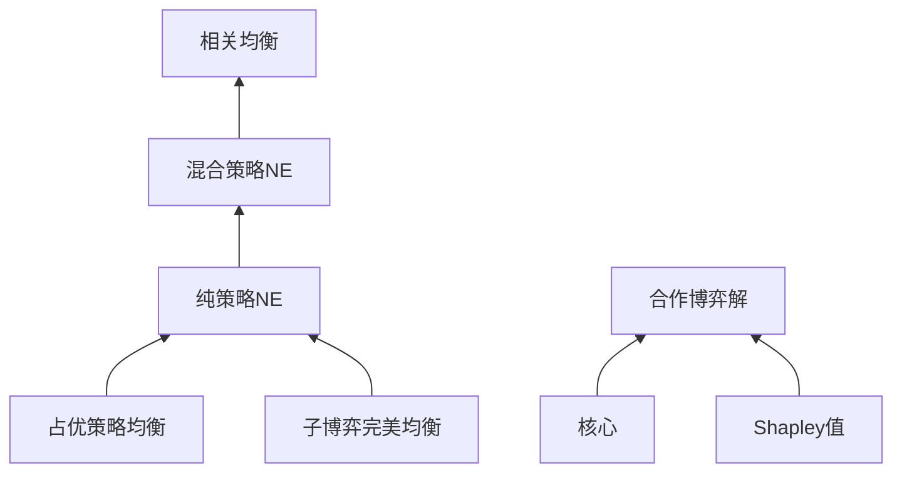

# 博弈论基础 - 六维内容补充

> **模块**: 10-高级主题
> **文档**: 05-博弈论算法/01-博弈论基础
> **补充维度**: 概念定义、属性、关系、解释、论证、形式证明
> **对标**: Stanford CS364 / MIT 6.853 / CMU 15-896
> **深度**: 研究生级

---

## 思维导图：博弈论基础概念结构

```mermaid
graph TD
    GT[博弈论<br/>Game Theory] --> NASH[纳什均衡<br/>Nash Equilibrium]
    GT --> GAMETREE[博弈树<br/>Game Trees]
    GT --> GTYPES[博弈类型<br/>Game Types]

    NASH --> PURE[纯策略<br/>Pure Strategy]
    NASH --> MIXED[混合策略<br/>Mixed Strategy]
    NASH --> EXISTENCE[存在性定理<br/>Existence]
    NASH --> COMPUTATION[计算复杂性<br/>Computation]

    GAMETREE --> MINIMAX[Minimax定理<br/>Minimax]
    GAMETREE --> ALPHABETA[Alpha-Beta剪枝<br/>Pruning]
    GAMETREE --> EXPECTI[期望博弈树<br/>Expectiminimax]
    GAMETREE --> MCTS[蒙特卡洛树搜索<br/>MCTS]

    GTYPES --> ZERO[零和博弈<br/>Zero-Sum]
    GTYPES --> COOP[合作博弈<br/>Cooperative]
    GTYPES --> NONCOOP[非合作博弈<br/>Non-cooperative]
    GTYPES >>> EXTENSIVE[扩展式博弈<br/>Extensive Form]
    GTYPES >>> NORMAL[标准式博弈<br/>Normal Form]

    GT --> SOLUTION[解概念<br/>Solution Concepts]
    SOLUTION --> DOMINANCE[优势策略<br/>Dominance]
    SOLUTION >>> PARETO[帕累托最优<br/>Pareto Optimality]
    SOLUTION >>> CORE[核心<br/>Core]
    SOLUTION >>> SVALUE[Shapley值<br/>Shapley Value]
```

---

## 一、概念定义 (Concept Definition)

### 1.1 博弈的标准形式 (Normal Form)

**定义 1.1.1** (形式化)

标准式博弈是一个三元组 $G = (N, (A_i)_{i \in N}, (u_i)_{i \in N})$：

- $N = \{1, 2, ..., n\}$: 玩家集合
- $A_i$: 玩家 $i$ 的行动集
- $u_i: A_1 \times A_2 \times ... \times A_n \rightarrow \mathbb{R}$: 玩家 $i$ 的收益函数

**策略组合**: $a = (a_1, a_2, ..., a_n) \in A = A_1 \times ... \times A_n$

**自然语言定义**

标准式博弈同时描述所有玩家的行动和收益，适合表示同步决策的博弈。每个玩家在不知道其他玩家选择的情况下同时选择行动。

---

### 1.2 纳什均衡 (Nash Equilibrium)

**定义 1.2.1** (形式化)

策略组合 $a^* = (a_1^*, ..., a_n^*)$ 是**纯策略纳什均衡**，当且仅当：
$$\forall i \in N, \forall a_i \in A_i: u_i(a_i^*, a_{-i}^*) \geq u_i(a_i, a_{-i}^*)$$

其中 $a_{-i}^* = (a_1^*, ..., a_{i-1}^*, a_{i+1}^*, ..., a_n^*)$。

**定义 1.2.2** (混合策略)

混合策略 $\sigma_i \in \Delta(A_i)$ 是 $A_i$ 上的概率分布。

**混合策略纳什均衡**:
$$\forall i \in N, \forall \sigma_i \in \Delta(A_i): u_i(\sigma_i^*, \sigma_{-i}^*) \geq u_i(\sigma_i, \sigma_{-i}^*)$$

---

### 1.3 博弈树 (Game Trees)

**定义 1.3.1** (扩展式博弈)

扩展式博弈是一个树结构 $G = (V, E, v_0, P, (u_i), (I_i))$：

- $(V, E, v_0)$: 有根博弈树
- $P: V \setminus Z \rightarrow N \cup \{\text{Chance}\}$: 玩家函数（Z为终止节点集）
- $u_i: Z \rightarrow \mathbb{R}$: 收益函数
- $I_i$: 玩家 $i$ 的信息集划分

**定义 1.3.2** (Minimax值)

对于二人零和博弈：
$$V^* = \max_{\sigma_1} \min_{\sigma_2} u_1(\sigma_1, \sigma_2) = \min_{\sigma_2} \max_{\sigma_1} u_1(\sigma_1, \sigma_2)$$

**定义 1.3.3** (Alpha-Beta剪枝)

Minimax算法的优化，剪枝条件:

- **Alpha剪枝**: 当节点的值 $\leq \alpha$（对于MAX层）
- **Beta剪枝**: 当节点的值 $\geq \beta$（对于MIN层）

---

## 二、属性 (Properties)

### 2.1 博弈分类

| 特征 | 零和博弈 | 常和博弈 | 变和博弈 |
|------|----------|----------|----------|
| 收益和 | $\sum u_i = 0$ | $\sum u_i = c$ | 任意 |
| 例子 | 象棋、围棋 | 扑克（固定奖金） | 囚徒困境 |
| 均衡 | Minimax | 策略等价于零和 | 一般纳什均衡 |

### 2.2 解概念性质

| 概念 | 存在性 | 唯一性 | 计算复杂性 |
|------|--------|--------|-----------|
| 纯策略NE | ❌ 不一定 | ❌ 不一定 | NP难 |
| 混合策略NE | ✅ (Nash) | ❌ 不一定 | PPAD完全 |
| 占优策略均衡 | ❌ 不一定 | ✅ 若存在则唯一 | 多项式 |
| 子博弈完美均衡 | ✅ | ❌ 不一定 | NP难 |
| 相关均衡 | ✅ | ❌ 不一定 | 多项式 |

### 2.3 博弈树搜索复杂度

| 算法 | 时间复杂度 | 空间复杂度 | 最优性 |
|------|-----------|-----------|--------|
| Minimax | $O(b^d)$ | $O(bd)$ | ✅ |
| Alpha-Beta | $O(b^{3d/4})$ (最优序) | $O(bd)$ | ✅ |
| Negamax | $O(b^d)$ | $O(bd)$ | ✅ |
| MCTS | 取决于迭代次数 | $O(bd)$ | ❌ |
| 期望博弈树 | $O(b^d)$ | $O(bd)$ | ✅ |

---

## 三、关系 (Relationships)

### 3.1 博弈论与相关领域

```
博弈论
    ├── 经济学
    │   ├── 拍卖理论
    │   ├── 市场设计
    │   └── 机制设计
    │
    ├── 计算机科学
    │   ├── 算法博弈论
    │   ├── 多智能体系统
    │   └── 网络安全
    │
    ├── 数学
    │   ├── 不动点定理
    │   ├── 凸分析
    │   └── 线性规划
    │
    └── 人工智能
        ├── 博弈树搜索
        ├── 强化学习
        └── 对抗机器学习
```

### 3.2 解概念层次



---

## 四、解释 (Explanation)

### 4.1 纳什均衡的直观理解

**定义**: 在给定其他玩家策略的情况下，没有玩家可以通过单方面改变策略而获益。

**囚徒困境示例**:

|  | 沉默 | 揭发 |
|--|------|------|
| **沉默** | (-1, -1) | (-3, 0) |
| **揭发** | (0, -3) | (-2, -2) |

(揭发, 揭发) 是唯一的纳什均衡，尽管 (沉默, 沉默) 对双方都更好。

**为什么称为"均衡"？**

- 类似于物理系统的平衡状态
- 一旦达到，没有偏离的动机
- 不保证最优或公平

### 4.2 混合策略的意义

**纯策略**: 总是选择同一行动
**混合策略**: 随机化选择

**为什么需要混合？**

- 有些博弈没有纯策略NE（如石头剪刀布）
- 随机化可以防止被对手预测
- 最优混合使对手无差异

**石头剪刀布的最优策略**:

- 以 1/3 概率随机出每种手势
- 任何偏离都会被对手利用

### 4.3 Alpha-Beta剪枝的直观

**核心思想**: 如果已经确定某分支不会优于已找到的选项，则停止搜索该分支。

**Alpha** (MAX节点目前能保证的最小得分)
**Beta** (MIN节点目前能保证的最大得分)

**示例**:

```
MAX节点评估为10
MIN子节点找到值为5的分支
MIN会选择 ≤5 的值
因此 MAX不会选这个MIN节点（已有10 > 5）
→ 剪枝！
```

---

## 五、论证 (Argumentation)

### 5.1 纳什均衡的存在性

**纳什定理**: 每个有限博弈至少存在一个（混合策略）纳什均衡。

**证明思路** (Kakutani不动点):

1. **最佳回应映射**: $BR_i(\sigma_{-i}) = \arg\max_{\sigma_i} u_i(\sigma_i, \sigma_{-i})$

2. **整体最佳回应**: $BR(\sigma) = BR_1(\sigma_{-1}) \times ... \times BR_n(\sigma_{-n})$

3. **纳什均衡**: 不动点 $\sigma^* \in BR(\sigma^*)$

4. **应用Kakutani不动点定理**:
   - 策略空间是紧凸集
   - $BR$ 是非空、凸值、上半连续
   - 因此存在不动点

### 5.2 为什么囚徒困境是社会困境？

**论证**:

1. 个体理性选择（揭发）导致集体次优结果

2. 缺乏信任机制时，合作不可持续

3. 重复博弈可能恢复合作（ folk theorem ）

4. 机制设计可以改变均衡（如合同、法律）

---

## 六、形式证明 (Formal Proof)

### 6.1 Minimax定理证明

**定理** (von Neumann): 对于二人零和博弈，
$$\max_{\sigma_1} \min_{\sigma_2} u(\sigma_1, \sigma_2) = \min_{\sigma_2} \max_{\sigma_1} u(\sigma_1, \sigma_2)$$

**证明**:

**引理**: 对任意函数 $f(x,y)$，
$$\max_x \min_y f(x,y) \leq \min_y \max_x f(x,y)$$

*证明*: 对任意 $x, y$：
$$\min_{y'} f(x, y') \leq f(x, y) \leq \max_{x'} f(x', y)$$

因此：
$$\max_x \min_y f(x,y) \leq \max_x f(x,y) \text{ 对所有 } y$$

取 $\min_y$：
$$\max_x \min_y f(x,y) \leq \min_y \max_x f(x,y)$$

**反向不等式** (使用对偶性/分离定理):

由线性规划对偶性，或Sion的Minimax定理（对于凸-凹函数）。

对于零和博弈的收益矩阵 $A$，考虑线性规划：

**原问题** (行玩家):
$$\max_{x} \min_{j} \sum_i x_i a_{ij}$$

**对偶问题** (列玩家):
$$\min_{y} \max_{i} \sum_j a_{ij} y_j$$

由强对偶性，两者相等。

∎

### 6.2 Alpha-Beta正确性

**定理**: Alpha-Beta剪枝返回与Minimax相同的值。

**证明** (归纳):

**归纳假设**: 对于深度 $< d$ 的树，剪枝不影响返回值。

**基本情况**: 深度0，直接返回叶节点值。

**归纳步骤**:

考虑MAX节点，当前值为 $v$，$\alpha$ 为祖先的保证下界。

若 $v \leq \alpha$，则:

- 祖先MIN节点已有一个选择 $\leq \alpha$
- 当前MAX节点最多提供 $v \leq \alpha$
- MIN不会选择当前分支

因此剪枝是安全的。

MIN节点的证明对称。

∎

---

## 七、多语言实现

### 7.1 Python: 纳什均衡计算 + 博弈树搜索

```python
import numpy as np
from typing import List, Tuple, Dict, Optional
from dataclasses import dataclass
from enum import Enum
import random

class Player(Enum):
    MAX = 1
    MIN = -1

@dataclass
class GameState:
    """博弈状态"""
    board: np.ndarray
    current_player: Player

    def is_terminal(self) -> bool:
        """是否终止状态"""
        raise NotImplementedError

    def utility(self) -> float:
        """终止状态的效用值"""
        raise NotImplementedError

    def actions(self) -> List[Tuple[int, int]]:
        """可用行动"""
        raise NotImplementedError

    def result(self, action) -> 'GameState':
        """执行行动后的新状态"""
        raise NotImplementedError


class TicTacToe(GameState):
    """井字棋实现"""

    def __init__(self, board=None, current_player=Player.MAX):
        self.board = board if board is not None else np.zeros((3, 3))
        self.current_player = current_player

    def is_terminal(self) -> bool:
        # 检查是否有赢家
        for i in range(3):
            if abs(sum(self.board[i, :])) == 3:
                return True
            if abs(sum(self.board[:, i])) == 3:
                return True
        if abs(sum(np.diag(self.board))) == 3:
            return True
        if abs(sum(np.diag(np.fliplr(self.board)))) == 3:
            return True
        # 检查是否满
        return np.all(self.board != 0)

    def utility(self) -> float:
        if not self.is_terminal():
            return 0

        for i in range(3):
            if sum(self.board[i, :]) == 3 or sum(self.board[:, i]) == 3:
                return 1
            if sum(self.board[i, :]) == -3 or sum(self.board[:, i]) == -3:
                return -1

        diag1 = sum(np.diag(self.board))
        diag2 = sum(np.diag(np.fliplr(self.board)))
        if diag1 == 3 or diag2 == 3:
            return 1
        if diag1 == -3 or diag2 == -3:
            return -1

        return 0  # 平局

    def actions(self) -> List[Tuple[int, int]]:
        return [(i, j) for i in range(3) for j in range(3) if self.board[i, j] == 0]

    def result(self, action: Tuple[int, int]) -> 'TicTacToe':
        new_board = self.board.copy()
        new_board[action] = self.current_player.value
        return TicTacToe(new_board, Player(-self.current_player.value))


def minimax(state: GameState, depth: int = 10) -> Tuple[float, Optional[Tuple]]:
    """
    Minimax算法
    返回: (值, 最佳行动)
    """
    if state.is_terminal() or depth == 0:
        return state.utility(), None

    best_action = None

    if state.current_player == Player.MAX:
        value = float('-inf')
        for action in state.actions():
            new_state = state.result(action)
            score, _ = minimax(new_state, depth - 1)
            if score > value:
                value = score
                best_action = action
        return value, best_action
    else:
        value = float('inf')
        for action in state.actions():
            new_state = state.result(action)
            score, _ = minimax(new_state, depth - 1)
            if score < value:
                value = score
                best_action = action
        return value, best_action


def alphabeta(state: GameState, alpha: float, beta: float, depth: int = 10) -> Tuple[float, Optional[Tuple]]:
    """
    Alpha-Beta剪枝
    """
    if state.is_terminal() or depth == 0:
        return state.utility(), None

    best_action = None

    if state.current_player == Player.MAX:
        value = float('-inf')
        for action in state.actions():
            new_state = state.result(action)
            score, _ = alphabeta(new_state, alpha, beta, depth - 1)
            if score > value:
                value = score
                best_action = action
            alpha = max(alpha, value)
            if alpha >= beta:
                break  # Beta剪枝
        return value, best_action
    else:
        value = float('inf')
        for action in state.actions():
            new_state = state.result(action)
            score, _ = alphabeta(new_state, alpha, beta, depth - 1)
            if score < value:
                value = score
                best_action = action
            beta = min(beta, value)
            if alpha >= beta:
                break  # Alpha剪枝
        return value, best_action


class NashEquilibrium:
    """纳什均衡计算（支持两人博弈）"""

    @staticmethod
    def compute_mixed_strategy(payoff_matrix: np.ndarray) -> Tuple[np.ndarray, float]:
        """
        计算2x2零和博弈的最优混合策略
        返回: (行玩家策略, 游戏值)
        """
        if payoff_matrix.shape != (2, 2):
            raise ValueError("仅支持2x2矩阵")

        a, b = payoff_matrix[0]
        c, d = payoff_matrix[1]

        # 计算行玩家的最优混合
        if a == c and b == d:  # 行玩家无差异
            p = 0.5
        else:
            # 使列玩家无差异
            det = (a - c) + (d - b)
            if det == 0:
                p = 0.5
            else:
                p = (d - b) / det

        p = max(0, min(1, p))  # 裁剪到[0,1]

        # 游戏值
        value = p * (a * (1-p) + b * p) + (1-p) * (c * (1-p) + d * p)

        return np.array([p, 1-p]), value

    @staticmethod
    def find_pure_nash(payoff_matrix1: np.ndarray, payoff_matrix2: np.ndarray) -> List[Tuple[int, int]]:
        """
        找出所有纯策略纳什均衡
        返回: [(行策略, 列策略), ...]
        """
        equilibria = []
        rows, cols = payoff_matrix1.shape

        for i in range(rows):
            for j in range(cols):
                # 检查行玩家是否偏离
                row_best = payoff_matrix1[i, j] == max(payoff_matrix1[:, j])
                # 检查列玩家是否偏离
                col_best = payoff_matrix2[i, j] == max(payoff_matrix2[i, :])

                if row_best and col_best:
                    equilibria.append((i, j))

        return equilibria


# 示例
if __name__ == "__main__":
    # 井字棋测试
    game = TicTacToe()

    print("Minimax vs Alpha-Beta 比较:")

    # Minimax
    import time
    start = time.time()
    val1, action1 = minimax(game)
    t1 = time.time() - start

    start = time.time()
    val2, action2 = alphabeta(game, float('-inf'), float('inf'))
    t2 = time.time() - start

    print(f"Minimax: 值={val1}, 行动={action1}, 时间={t1:.4f}s")
    print(f"Alpha-Beta: 值={val2}, 行动={action2}, 时间={t2:.4f}s")

    # 囚徒困境
    print("\n囚徒困境分析:")
    # 行玩家收益
    payoff1 = np.array([[-1, -3], [0, -2]])
    # 列玩家收益
    payoff2 = np.array([[-1, 0], [-3, -2]])

    pure_ne = NashEquilibrium.find_pure_nash(payoff1, payoff2)
    print(f"纯策略纳什均衡: {pure_ne}")

    # 石头剪刀布
    print("\n石头剪刀布分析:")
    rsp = np.array([[0, -1, 1], [1, 0, -1], [-1, 1, 0]])  # 零和
    strategy, value = NashEquilibrium.compute_mixed_strategy(rsp[:2, :2])
    print(f"最优混合策略(简化版): {strategy}")
```

### 7.2 Rust: 蒙特卡洛树搜索实现

```rust
use rand::seq::SliceRandom;
use rand::Rng;
use std::collections::HashMap;

/// 博弈状态 trait
pub trait GameState: Clone {
    type Action: Clone + Eq + std::hash::Hash;

    fn is_terminal(&self) -> bool;
    fn current_player(&self) -> i32;  // 1 或 -1
    fn legal_actions(&self) -> Vec<Self::Action>;
    fn apply_action(&mut self, action: &Self::Action);
    fn reward(&self, player: i32) -> f64;  // 终止状态的奖励
}

/// MCTS 节点
pub struct MCTSNode<S: GameState> {
    state: S,
    parent: Option<usize>,
    children: Vec<usize>,
    action: Option<S::Action>,
    visits: u32,
    value: f64,
    untried_actions: Vec<S::Action>,
}

impl<S: GameState> MCTSNode<S> {
    pub fn new(state: S, parent: Option<usize>, action: Option<S::Action>) -> Self {
        let untried = state.legal_actions();
        MCTSNode {
            state,
            parent,
            children: Vec::new(),
            action,
            visits: 0,
            value: 0.0,
            untried_actions: untried,
        }
    }

    /// UCB1 分数
    pub fn ucb1(&self, parent_visits: u32, c: f64) -> f64 {
        if self.visits == 0 {
            return f64::INFINITY;
        }
        let exploitation = self.value / self.visits as f64;
        let exploration = c * ((parent_visits as f64).ln() / self.visits as f64).sqrt();
        exploitation + exploration
    }

    pub fn is_fully_expanded(&self) -> bool {
        self.untried_actions.is_empty()
    }
}

/// MCTS 算法
pub struct MCTS<S: GameState> {
    nodes: Vec<MCTSNode<S>>,
    c: f64,  // UCB1 探索参数
}

impl<S: GameState> MCTS<S> {
    pub fn new(initial_state: S) -> Self {
        let root = MCTSNode::new(initial_state, None, None);
        MCTS {
            nodes: vec![root],
            c: 1.414,  // sqrt(2)
        }
    }

    /// 执行一次 MCTS 迭代
    pub fn iterate(&mut self) {
        // 1. 选择
        let node_idx = self.select(0);

        // 2. 扩展
        let node_idx = self.expand(node_idx);

        // 3. 模拟
        let reward = self.simulate(node_idx);

        // 4. 反向传播
        self.backpropagate(node_idx, reward);
    }

    /// 选择阶段: 使用 UCB1 选择子节点
    fn select(&self, mut node_idx: usize) -> usize {
        while !self.nodes[node_idx].state.is_terminal()
              && self.nodes[node_idx].is_fully_expanded() {

            let parent_visits = self.nodes[node_idx].visits;
            let children = &self.nodes[node_idx].children;

            node_idx = *children.iter()
                .max_by(|&&a, &&b| {
                    let ucb_a = self.nodes[a].ucb1(parent_visits, self.c);
                    let ucb_b = self.nodes[b].ucb1(parent_visits, self.c);
                    ucb_a.partial_cmp(&ucb_b).unwrap()
                })
                .unwrap();
        }
        node_idx
    }

    /// 扩展阶段
    fn expand(&mut self, node_idx: usize) -> usize {
        if self.nodes[node_idx].state.is_terminal() {
            return node_idx;
        }

        if !self.nodes[node_idx].is_fully_expanded() {
            let action = self.nodes[node_idx].untried_actions.pop().unwrap();

            let mut new_state = self.nodes[node_idx].state.clone();
            new_state.apply_action(&action);

            let new_node = MCTSNode::new(new_state, Some(node_idx), Some(action));
            let new_idx = self.nodes.len();
            self.nodes.push(new_node);
            self.nodes[node_idx].children.push(new_idx);

            return new_idx;
        }

        node_idx
    }

    /// 模拟阶段: 随机走到底
    fn simulate(&self, node_idx: usize) -> f64 {
        let mut state = self.nodes[node_idx].state.clone();
        let player = state.current_player();
        let mut rng = rand::thread_rng();

        while !state.is_terminal() {
            let actions = state.legal_actions();
            let action = actions.choose(&mut rng).unwrap();
            state.apply_action(action);
        }

        state.reward(player)
    }

    /// 反向传播
    fn backpropagate(&mut self, mut node_idx: usize, reward: f64) {
        loop {
            self.nodes[node_idx].visits += 1;
            self.nodes[node_idx].value += reward;

            match self.nodes[node_idx].parent {
                Some(parent) => node_idx = parent,
                None => break,
            }
        }
    }

    /// 获取最佳行动
    pub fn best_action(&self) -> Option<&S::Action> {
        let root = &self.nodes[0];
        root.children.iter()
            .max_by_key(|&&idx| self.nodes[idx].visits)
            .and_then(|&idx| self.nodes[idx].action.as_ref())
    }

    /// 运行指定次数的迭代
    pub fn run(&mut self, iterations: usize) {
        for _ in 0..iterations {
            self.iterate();
        }
    }
}

/// 简单的井字棋实现
#[derive(Clone)]
pub struct TicTacToe {
    board: [i32; 9],  // 0 = 空, 1 = X, -1 = O
    current: i32,
}

impl TicTacToe {
    pub fn new() -> Self {
        TicTacToe {
            board: [0; 9],
            current: 1,
        }
    }

    fn check_win(&self, player: i32) -> bool {
        let wins = [
            [0, 1, 2], [3, 4, 5], [6, 7, 8],  // 行
            [0, 3, 6], [1, 4, 7], [2, 5, 8],  // 列
            [0, 4, 8], [2, 4, 6],              // 对角线
        ];

        wins.iter().any(|&line| {
            line.iter().all(|&i| self.board[i] == player)
        })
    }
}

impl GameState for TicTacToe {
    type Action = usize;

    fn is_terminal(&self) -> bool {
        self.check_win(1) || self.check_win(-1) ||
        self.board.iter().all(|&x| x != 0)
    }

    fn current_player(&self) -> i32 {
        self.current
    }

    fn legal_actions(&self) -> Vec<Self::Action> {
        self.board.iter()
            .enumerate()
            .filter(|(_, &x)| x == 0)
            .map(|(i, _)| i)
            .collect()
    }

    fn apply_action(&mut self, action: &Self::Action) {
        self.board[*action] = self.current;
        self.current = -self.current;
    }

    fn reward(&self, player: i32) -> f64 {
        if self.check_win(player) {
            1.0
        } else if self.check_win(-player) {
            0.0
        } else {
            0.5  // 平局
        }
    }
}

#[cfg(test)]
mod tests {
    use super::*;

    #[test]
    fn test_mcts() {
        let game = TicTacToe::new();
        let mut mcts = MCTS::new(game);

        mcts.run(1000);

        let best = mcts.best_action();
        assert!(best.is_some());

        // 中心位置通常是最佳首步
        println!("MCTS suggests: {:?}", best);
    }

    #[test]
    fn test_tictactoe() {
        let mut game = TicTacToe::new();

        // X 走中心
        game.apply_action(&4);
        assert_eq!(game.current, -1);

        // O 走角落
        game.apply_action(&0);

        assert!(!game.is_terminal());
    }
}
```

---

## 八、博弈论概念速查表

| 概念 | 定义 | 示例 |
|------|------|------|
| **纳什均衡** | 无单方面偏离动机 | 囚徒困境的(揭发,揭发) |
| **纯策略** | 确定性选择 | 总是选择行动A |
| **混合策略** | 随机化选择 | 以p概率选择A |
| **零和博弈** | 收益之和为0 | 象棋、围棋 |
| **占优策略** | 无论对手如何都最优 | 囚徒困境的揭发 |
| **Minimax** | 最大最小策略 | 二人零和最优 |
| **Alpha-Beta** | 剪枝优化 | 博弈树搜索 |
| **Shapley值** | 公平分配方案 | 合作博弈 |

---

## 参考文献

1. Osborne, M. J. & Rubinstein, A. (1994). *A Course in Game Theory*. MIT Press.
2. Nisan, N. et al. (2007). *Algorithmic Game Theory*. Cambridge University Press.
3. Leyton-Brown, K. & Shoham, Y. (2008). *Essentials of Game Theory*. Morgan & Claypool.
4. Knuth, D. E. & Moore, R. W. (1975). An analysis of alpha-beta pruning. *Artificial Intelligence*, 6(4), 293-326.
5. Browne, C. B. et al. (2012). A survey of Monte Carlo tree search methods. *IEEE TCIAIG*, 4(1), 1-43.

---

**文档版本**: v1.0
**创建日期**: 2026-04-10
**维护**: 项目高级主题工作组
