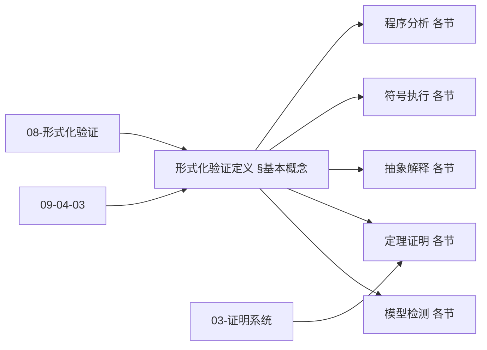
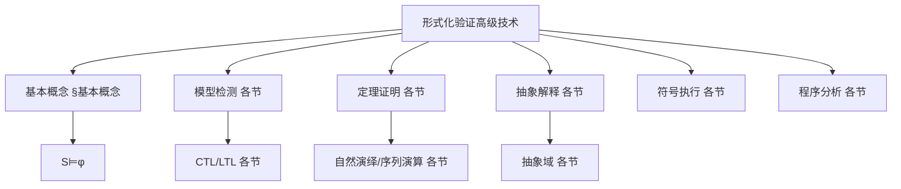
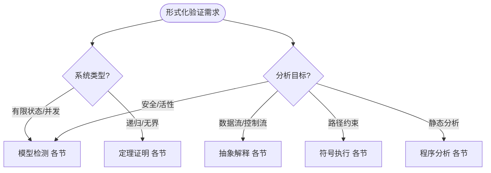
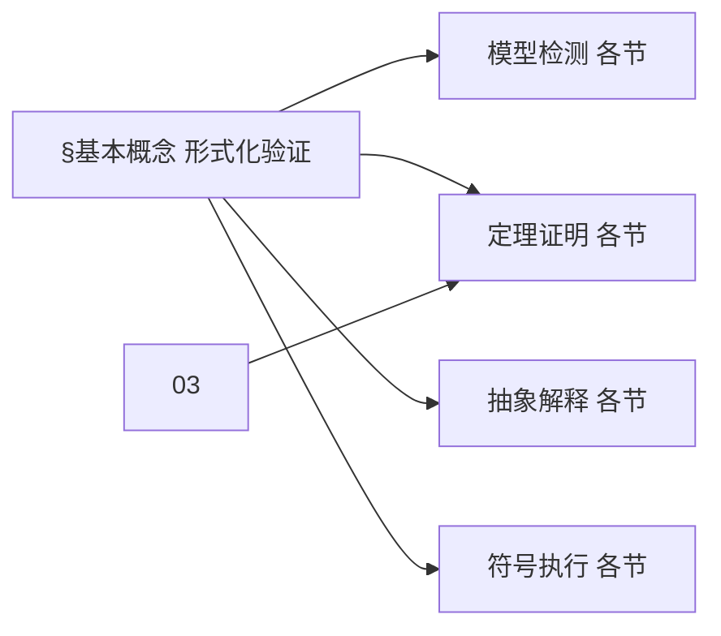
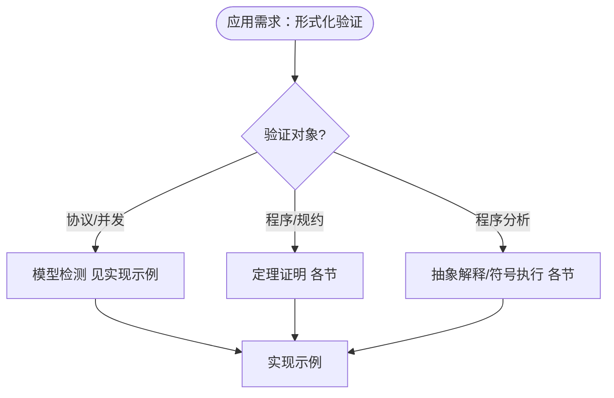

> 📊 **项目全面梳理**：详细的项目结构、模块详解和学习路径，请参阅 [`项目全面梳理-2025.md`](../项目全面梳理-2025.md)

## 10.6 形式化验证的高级技术 / Advanced Formal Verification Techniques

### 摘要 / Executive Summary

- 统一形式化验证的高级技术，建立模型检测、定理证明、抽象解释等方法。
- 建立形式化验证在软件工程中的核心地位。

### 关键术语与符号 / Glossary

- 形式化验证、模型检测、定理证明、抽象解释、符号执行、程序验证。
- 术语对齐与引用规范：`docs/术语与符号总表.md`，`01-基础理论/00-撰写规范与引用指南.md`

### 术语与符号规范 / Terminology & Notation

- 形式化验证（Formal Verification）：使用形式化方法验证系统正确性。
- 模型检测（Model Checking）：通过穷举搜索验证系统性质。
- 定理证明（Theorem Proving）：使用逻辑推理证明定理。
- 抽象解释（Abstract Interpretation）：使用抽象域分析程序。
- 记号约定：`M` 表示模型，`φ` 表示性质，`⊨` 表示满足，`⊢` 表示可证明。

### 交叉引用导航 / Cross-References

- 算法验证：参见 `09-算法理论/04-高级算法理论/03-算法验证理论.md`。
- 证明系统：参见 `03-形式化证明/01-证明系统.md`。
- 形式化验证：参见 `08-实现示例/04-形式化验证.md`。
- 项目导航与对标：见 [项目全面梳理-2025](../项目全面梳理-2025.md)、[项目扩展与持续推进任务编排](../项目扩展与持续推进任务编排.md)、[国际课程对标表](../国际课程对标表.md)。

### 快速导航 / Quick Links

- 基本概念
- 模型检测
- 定理证明

## 目录 / Table of Contents

- [10.6 形式化验证的高级技术 / Advanced Formal Verification Techniques](#106-形式化验证的高级技术--advanced-formal-verification-techniques)
  - [摘要 / Executive Summary](#摘要--executive-summary)
  - [关键术语与符号 / Glossary](#关键术语与符号--glossary)
  - [术语与符号规范 / Terminology \& Notation](#术语与符号规范--terminology--notation)
  - [交叉引用导航 / Cross-References](#交叉引用导航--cross-references)
  - [快速导航 / Quick Links](#快速导航--quick-links)
- [目录 / Table of Contents](#目录--table-of-contents)
- [基本概念 / Basic Concepts](#基本概念--basic-concepts)
  - [形式化验证定义 / Definition of Formal Verification](#形式化验证定义--definition-of-formal-verification)
  - [验证方法分类 / Classification of Verification Methods](#验证方法分类--classification-of-verification-methods)
  - [内容补充与思维表征 / Content Supplement and Thinking Representation](#内容补充与思维表征--content-supplement-and-thinking-representation)
    - [解释与直观 / Explanation and Intuition](#解释与直观--explanation-and-intuition)
    - [概念属性表 / Concept Attribute Table](#概念属性表--concept-attribute-table)
    - [概念关系 / Concept Relations](#概念关系--concept-relations)
    - [概念依赖图 / Concept Dependency Graph](#概念依赖图--concept-dependency-graph)
    - [论证与证明衔接 / Argumentation and Proof Link](#论证与证明衔接--argumentation-and-proof-link)
    - [思维导图：本章概念结构 / Mind Map](#思维导图本章概念结构--mind-map)
    - [多维矩阵：验证方法概念对比 / Multi-Dimensional Comparison](#多维矩阵验证方法概念对比--multi-dimensional-comparison)
    - [决策树：系统类型与目标到方法选择 / Decision Tree](#决策树系统类型与目标到方法选择--decision-tree)
    - [公理定理推理证明决策树 / Axiom-Theorem-Proof Tree](#公理定理推理证明决策树--axiom-theorem-proof-tree)
    - [应用决策建模树 / Application Decision Modeling Tree](#应用决策建模树--application-decision-modeling-tree)
- [模型检测技术 / Model Checking Techniques](#模型检测技术--model-checking-techniques)
  - [1基本概念 / Basic Concepts](#1基本概念--basic-concepts)
  - [CTL模型检测算法 / CTL Model Checking Algorithm](#ctl模型检测算法--ctl-model-checking-algorithm)
  - [LTL模型检测 / LTL Model Checking](#ltl模型检测--ltl-model-checking)
- [定理证明技术 / Theorem Proving Techniques](#定理证明技术--theorem-proving-techniques)
  - [自然演绎系统 / Natural Deduction System](#自然演绎系统--natural-deduction-system)
  - [序列演算 / Sequent Calculus](#序列演算--sequent-calculus)
- [抽象解释技术 / Abstract Interpretation Techniques](#抽象解释技术--abstract-interpretation-techniques)
  - [2基本概念 / Basic Concepts](#2基本概念--basic-concepts)
  - [区间分析 / Interval Analysis](#区间分析--interval-analysis)
  - [类型分析 / Type Analysis](#类型分析--type-analysis)
- [符号执行技术 / Symbolic Execution Techniques](#符号执行技术--symbolic-execution-techniques)
  - [3基本概念 / Basic Concepts](#3基本概念--basic-concepts)
  - [符号执行引擎 / Symbolic Execution Engine](#符号执行引擎--symbolic-execution-engine)
- [程序分析技术 / Program Analysis Techniques](#程序分析技术--program-analysis-techniques)
  - [数据流分析 / Data Flow Analysis](#数据流分析--data-flow-analysis)
  - [控制流分析 / Control Flow Analysis](#控制流分析--control-flow-analysis)
- [实现示例 / Implementation Examples](#实现示例--implementation-examples)
  - [完整的验证系统 / Complete Verification System](#完整的验证系统--complete-verification-system)
- [交叉引用与依赖 / Cross-References and Dependencies](#交叉引用与依赖--cross-references-and-dependencies)
- [总结 / Summary](#总结--summary)
- [参考文献 / References](#参考文献--references)

## 基本概念 / Basic Concepts

### 形式化验证定义 / Definition of Formal Verification

形式化验证是通过数学方法证明系统满足其规范的过程。

**数学定义 / Mathematical Definition:**

给定系统 $S$ 和规范 $\phi$，形式化验证的目标是证明：
$$S \models \phi$$

其中 $\models$ 表示满足关系。

Given a system $S$ and specification $\phi$, the goal of formal verification is to prove:
$$S \models \phi$$

where $\models$ denotes the satisfaction relation.

### 验证方法分类 / Classification of Verification Methods

1. **模型检测 / Model Checking**: 自动验证有限状态系统
2. **定理证明 / Theorem Proving**: 使用逻辑推理证明系统性质
3. **抽象解释 / Abstract Interpretation**: 通过抽象域分析程序行为
4. **符号执行 / Symbolic Execution**: 使用符号值分析程序路径

### 内容补充与思维表征 / Content Supplement and Thinking Representation

> 本节按 [内容补充与思维表征全面计划方案](../内容补充与思维表征全面计划方案.md) **只补充、不删除**。标准见 [内容补充标准](../内容补充标准-概念定义属性关系解释论证形式证明.md)、[思维表征模板集](../思维表征模板集.md)。

#### 解释与直观 / Explanation and Intuition

**形式化验证 $S\models\phi$（§基本概念）的动机**：用数学方法证明系统 $S$ 满足规约 $\phi$；模型检测、定理证明、抽象解释、符号执行、程序分析构成方法谱系，与 09-04-03 算法验证、03-形式化证明、08-形式化验证、09-04-19 形式化验证理论 衔接。

**与已有概念的联系**：模型检测与 CTL/LTL、有限状态对应；定理证明与 03-证明系统、自然演绎/序列演算一致；抽象解释与 05-类型理论 类型分析对应；与 08-形式化验证、10-03 证明助手 为实现与实践。

#### 概念属性表 / Concept Attribute Table

| 属性名 | 类型/范围 | 含义 | 备注 |
|--------|-----------|------|------|
| $S\models\phi$ | 满足关系 | 系统 $S$ 满足规约 $\phi$ | §基本概念 |
| 模型检测 | 自动验证 | CTL/LTL、有限状态 | §验证方法分类 |
| 定理证明 | 演绎验证 | 自然演绎/序列演算 | §验证方法分类 |
| 抽象解释 | 近似语义 | 区间/类型/抽象域 | §验证方法分类 |
| 符号执行 | 路径约束 | 数据流/控制流 | §验证方法分类 |
| 程序分析 | 静态分析 | 数据流/控制流 | 各节 |
| 完备性/自动化/适用规模 | 度量 | 与方法相关 | §基本概念、各节 |

#### 概念关系 / Concept Relations

| 源概念 | 目标概念 | 关系类型 | 说明 |
|--------|----------|----------|------|
| 形式化验证高级技术 | 09-04-03 算法验证 | depends_on | 算法正确性验证 |
| 形式化验证高级技术 | 03-证明系统、09-04-19 形式化验证理论 | depends_on | 证明与验证理论 |
| 形式化验证高级技术 | 08-形式化验证、10-03 证明助手 | applies_to | 实现与实践 |
| 抽象解释 | 05-类型理论 | applies_to | 类型分析 |
| 本文 | 10-高级主题 | applies_to | 实现示例 |

#### 概念依赖图 / Concept Dependency Graph



#### 论证与证明衔接 / Argumentation and Proof Link

**§基本概念 $S\models\phi$**与 **各节**：模型检测由 CTL/LTL 可判定性保证；定理证明由自然演绎/序列演算可靠性保证；抽象解释由抽象域与不动点保证；与 03、09-04-03 论证衔接。

#### 思维导图：本章概念结构 / Mind Map



#### 多维矩阵：验证方法概念对比 / Multi-Dimensional Comparison

| 概念/方法 | 完备性 | 自动化 | 适用规模 | 备注 |
|-----------|--------|--------|----------|------|
| 模型检测 | 可判定（有限状态） | 高 | 有限状态系统 | §验证方法分类、各节 |
| 定理证明 | 完备（相对逻辑） | 中（交互/自动） | 无界/递归 | 各节 |
| 抽象解释 | 近似（保守） | 高 | 大规模 | 各节 |
| 符号执行 | 路径覆盖 | 高 | 路径数相关 | 各节 |
| 程序分析 | 近似 | 高 | 大规模 | 各节 |

#### 决策树：系统类型与目标到方法选择 / Decision Tree



#### 公理定理推理证明决策树 / Axiom-Theorem-Proof Tree



#### 应用决策建模树 / Application Decision Modeling Tree



## 模型检测技术 / Model Checking Techniques

### 1基本概念 / Basic Concepts

模型检测是一种自动验证技术，用于检查有限状态系统是否满足给定的时序逻辑公式。

**数学定义 / Mathematical Definition:**

给定Kripke结构 $K = (S, S_0, R, L)$ 和CTL公式 $\phi$，模型检测问题为：
$$K \models \phi \iff \forall s \in S_0: s \models \phi$$

Given a Kripke structure $K = (S, S_0, R, L)$ and CTL formula $\phi$, the model checking problem is:
$$K \models \phi \iff \forall s \in S_0: s \models \phi$$

### CTL模型检测算法 / CTL Model Checking Algorithm

```rust
// CTL模型检测算法实现
pub struct KripkeStructure {
    states: Vec<String>,
    initial_states: Vec<String>,
    transitions: Vec<(String, String)>,
    labels: HashMap<String, Vec<String>>,
}

impl KripkeStructure {
    pub fn check_ctl(&self, formula: &CTLFormula) -> bool {
        match formula {
            CTLFormula::True => true,
            CTLFormula::False => false,
            CTLFormula::Atomic(prop) => self.check_atomic(prop),
            CTLFormula::Not(phi) => !self.check_ctl(phi),
            CTLFormula::And(phi1, phi2) => {
                self.check_ctl(phi1) && self.check_ctl(phi2)
            }
            CTLFormula::Or(phi1, phi2) => {
                self.check_ctl(phi1) || self.check_ctl(phi2)
            }
            CTLFormula::EX(phi) => self.check_ex(phi),
            CTLFormula::AX(phi) => self.check_ax(phi),
            CTLFormula::EF(phi) => self.check_ef(phi),
            CTLFormula::AF(phi) => self.check_af(phi),
            CTLFormula::EG(phi) => self.check_eg(phi),
            CTLFormula::AG(phi) => self.check_ag(phi),
            CTLFormula::EU(phi1, phi2) => self.check_eu(phi1, phi2),
            CTLFormula::AU(phi1, phi2) => self.check_au(phi1, phi2),
        }
    }

    fn check_ex(&self, phi: &CTLFormula) -> bool {
        // 检查是否存在后继状态满足phi
        self.states.iter().any(|s| {
            self.has_transition(s) && self.check_ctl(phi)
        })
    }

    fn check_ef(&self, phi: &CTLFormula) -> bool {
        // 使用不动点算法检查EF phi
        let mut reachable = self.get_initial_states();
        let mut new_states = reachable.clone();

        while !new_states.is_empty() {
            let mut next_states = HashSet::new();
            for state in &new_states {
                if self.check_ctl(phi) {
                    return true;
                }
                for successor in self.get_successors(state) {
                    if !reachable.contains(successor) {
                        next_states.insert(successor.clone());
                        reachable.insert(successor.clone());
                    }
                }
            }
            new_states = next_states;
        }
        false
    }
}
```

### LTL模型检测 / LTL Model Checking

线性时序逻辑(LTL)模型检测使用Büchi自动机：

**数学定义 / Mathematical Definition:**

给定LTL公式 $\phi$，构造Büchi自动机 $A_{\neg\phi}$，然后检查：
$$K \models \phi \iff L(K) \cap L(A_{\neg\phi}) = \emptyset$$

Given an LTL formula $\phi$, construct Büchi automaton $A_{\neg\phi}$, then check:
$$K \models \phi \iff L(K) \cap L(A_{\neg\phi}) = \emptyset$$

```rust
// LTL模型检测实现
pub struct BuchiAutomaton {
    states: Vec<String>,
    initial_states: Vec<String>,
    accepting_states: Vec<String>,
    transitions: Vec<(String, String, String)>, // (from, label, to)
}

impl BuchiAutomaton {
    pub fn check_ltl(&self, kripke: &KripkeStructure, formula: &LTLFormula) -> bool {
        let neg_formula = formula.negate();
        let buchi = self.build_buchi_automaton(&neg_formula);
        let product = self.product_automaton(kripke, &buchi);

        // 检查是否存在接受运行
        !self.has_accepting_run(&product)
    }

    fn has_accepting_run(&self, product: &ProductAutomaton) -> bool {
        // 使用嵌套深度优先搜索检查接受运行
        let mut visited = HashSet::new();
        let mut stack = Vec::new();

        for initial_state in &product.initial_states {
            if self.dfs_accepting(initial_state, &mut visited, &mut stack, product) {
                return true;
            }
        }
        false
    }
}
```

## 定理证明技术 / Theorem Proving Techniques

### 自然演绎系统 / Natural Deduction System

自然演绎是一种形式化证明系统，使用推理规则从前提推导结论。

**推理规则 / Inference Rules:**

1. **引入规则 / Introduction Rules:**
   - $\frac{A \quad B}{A \land B}$ (∧I)
   - $\frac{A}{A \lor B}$ (∨I₁)
   - $\frac{B}{A \lor B}$ (∨I₂)

2. **消除规则 / Elimination Rules:**
   - $\frac{A \land B}{A}$ (∧E₁)
   - $\frac{A \land B}{B}$ (∧E₂)
   - $\frac{A \lor B \quad [A] \vdash C \quad [B] \vdash C}{C}$ (∨E)

```rust
// 自然演绎系统实现
#[derive(Debug, Clone)]
pub enum Formula {
    Atom(String),
    And(Box<Formula>, Box<Formula>),
    Or(Box<Formula>, Box<Formula>),
    Implies(Box<Formula>, Box<Formula>),
    Not(Box<Formula>),
}

pub struct NaturalDeduction {
    rules: Vec<InferenceRule>,
}

impl NaturalDeduction {
    pub fn prove(&self, premises: &[Formula], conclusion: &Formula) -> Option<Proof> {
        let mut proof = Proof::new();

        // 添加前提
        for premise in premises {
            proof.add_premise(premise.clone());
        }

        // 尝试应用推理规则
        self.apply_rules(&mut proof, conclusion)
    }

    fn apply_rules(&self, proof: &mut Proof, goal: &Formula) -> Option<Proof> {
        match goal {
            Formula::And(a, b) => {
                // 尝试证明A和B，然后使用∧I
                let proof_a = self.apply_rules(proof, a)?;
                let proof_b = self.apply_rules(proof, b)?;
                proof.add_inference(InferenceRule::AndIntro, vec![proof_a, proof_b]);
                Some(proof.clone())
            }
            Formula::Or(a, b) => {
                // 尝试证明A或B
                if let Some(proof_a) = self.apply_rules(proof, a) {
                    proof.add_inference(InferenceRule::OrIntro1, vec![proof_a]);
                    Some(proof.clone())
                } else if let Some(proof_b) = self.apply_rules(proof, b) {
                    proof.add_inference(InferenceRule::OrIntro2, vec![proof_b]);
                    Some(proof.clone())
                } else {
                    None
                }
            }
            Formula::Implies(a, b) => {
                // 使用→I规则
                let mut sub_proof = proof.clone();
                sub_proof.add_assumption(a.clone());
                let proof_b = self.apply_rules(&mut sub_proof, b)?;
                proof.add_inference(InferenceRule::ImpliesIntro, vec![proof_b]);
                Some(proof.clone())
            }
            _ => None,
        }
    }
}
```

### 序列演算 / Sequent Calculus

序列演算是一种证明系统，使用序列 $\Gamma \vdash \Delta$ 表示证明。

**序列演算规则 / Sequent Calculus Rules:**

1. **左规则 / Left Rules:**
   - $\frac{\Gamma, A \land B \vdash \Delta}{\Gamma, A, B \vdash \Delta}$ (∧L)
   - $\frac{\Gamma, A \lor B \vdash \Delta}{\Gamma, A \vdash \Delta \quad \Gamma, B \vdash \Delta}$ (∨L)

2. **右规则 / Right Rules:**
   - $\frac{\Gamma \vdash A \land B, \Delta}{\Gamma \vdash A, \Delta \quad \Gamma \vdash B, \Delta}$ (∧R)
   - $\frac{\Gamma \vdash A \lor B, \Delta}{\Gamma \vdash A, B, \Delta}$ (∨R)

```rust
// 序列演算实现
pub struct Sequent {
    left: Vec<Formula>,
    right: Vec<Formula>,
}

impl Sequent {
    pub fn prove(&self) -> Option<ProofTree> {
        if self.is_axiom() {
            return Some(ProofTree::Axiom(self.clone()));
        }

        // 尝试应用各种规则
        if let Some(proof) = self.apply_and_left() {
            return Some(proof);
        }
        if let Some(proof) = self.apply_and_right() {
            return Some(proof);
        }
        if let Some(proof) = self.apply_or_left() {
            return Some(proof);
        }
        if let Some(proof) = self.apply_or_right() {
            return Some(proof);
        }

        None
    }

    fn apply_and_left(&self) -> Option<ProofTree> {
        // 查找形如 A∧B 的公式在左侧
        for (i, formula) in self.left.iter().enumerate() {
            if let Formula::And(a, b) = formula {
                let mut new_left = self.left.clone();
                new_left.remove(i);
                new_left.push(a.as_ref().clone());
                new_left.push(b.as_ref().clone());

                let new_sequent = Sequent {
                    left: new_left,
                    right: self.right.clone(),
                };

                if let Some(sub_proof) = new_sequent.prove() {
                    return Some(ProofTree::AndLeft(Box::new(sub_proof)));
                }
            }
        }
        None
    }
}
```

## 抽象解释技术 / Abstract Interpretation Techniques

### 2基本概念 / Basic Concepts

抽象解释是一种静态分析技术，通过抽象域来近似程序行为。

**数学定义 / Mathematical Definition:**

给定程序 $P$ 和抽象域 $D^\#$，抽象解释计算：
$$\alpha(\llbracket P \rrbracket) \subseteq \llbracket P \rrbracket^\#$$

Given a program $P$ and abstract domain $D^\#$, abstract interpretation computes:
$$\alpha(\llbracket P \rrbracket) \subseteq \llbracket P \rrbracket^\#$$

### 区间分析 / Interval Analysis

区间分析使用数值区间来近似变量值：

```rust
// 区间分析实现
#[derive(Debug, Clone)]
pub struct Interval {
    lower: Option<i32>,
    upper: Option<i32>,
}

impl Interval {
    pub fn new(lower: Option<i32>, upper: Option<i32>) -> Self {
        Interval { lower, upper }
    }

    pub fn add(&self, other: &Interval) -> Interval {
        let lower = match (self.lower, other.lower) {
            (Some(a), Some(b)) => Some(a + b),
            _ => None,
        };
        let upper = match (self.upper, other.upper) {
            (Some(a), Some(b)) => Some(a + b),
            _ => None,
        };
        Interval { lower, upper }
    }

    pub fn multiply(&self, other: &Interval) -> Interval {
        // 区间乘法实现
        let mut candidates = Vec::new();

        if let (Some(a), Some(b)) = (self.lower, other.lower) {
            candidates.push(a * b);
        }
        if let (Some(a), Some(b)) = (self.lower, other.upper) {
            candidates.push(a * b);
        }
        if let (Some(a), Some(b)) = (self.upper, other.lower) {
            candidates.push(a * b);
        }
        if let (Some(a), Some(b)) = (self.upper, other.upper) {
            candidates.push(a * b);
        }

        if candidates.is_empty() {
            Interval { lower: None, upper: None }
        } else {
            Interval {
                lower: Some(candidates.iter().min().unwrap().clone()),
                upper: Some(candidates.iter().max().unwrap().clone()),
            }
        }
    }
}

pub struct IntervalAnalyzer {
    variables: HashMap<String, Interval>,
}

impl IntervalAnalyzer {
    pub fn analyze_program(&mut self, program: &Program) -> HashMap<String, Interval> {
        for statement in &program.statements {
            self.analyze_statement(statement);
        }
        self.variables.clone()
    }

    fn analyze_statement(&mut self, statement: &Statement) {
        match statement {
            Statement::Assignment(var, expr) => {
                let interval = self.evaluate_expression(expr);
                self.variables.insert(var.clone(), interval);
            }
            Statement::If(condition, then_block, else_block) => {
                // 分析条件分支
                let (then_interval, else_interval) = self.analyze_condition(condition);

                // 保存当前状态
                let old_variables = self.variables.clone();

                // 分析then分支
                self.variables = then_interval;
                for stmt in then_block {
                    self.analyze_statement(stmt);
                }
                let then_result = self.variables.clone();

                // 分析else分支
                self.variables = else_interval;
                for stmt in else_block {
                    self.analyze_statement(stmt);
                }
                let else_result = self.variables.clone();

                // 合并结果
                for (var, interval) in &mut self.variables {
                    let then_interval = then_result.get(var).unwrap_or(&Interval::new(None, None));
                    let else_interval = else_result.get(var).unwrap_or(&Interval::new(None, None));
                    *interval = self.join_intervals(then_interval, else_interval);
                }
            }
            Statement::While(condition, body) => {
                // 使用不动点算法分析循环
                let mut old_variables = HashMap::new();
                let mut iteration = 0;
                let max_iterations = 100; // 防止无限循环

                while iteration < max_iterations && self.variables != old_variables {
                    old_variables = self.variables.clone();

                    let (condition_interval, _) = self.analyze_condition(condition);
                    self.variables = condition_interval;

                    for stmt in body {
                        self.analyze_statement(stmt);
                    }

                    iteration += 1;
                }
            }
        }
    }

    fn evaluate_expression(&self, expr: &Expression) -> Interval {
        match expr {
            Expression::Constant(value) => Interval::new(Some(*value), Some(*value)),
            Expression::Variable(var) => {
                self.variables.get(var).unwrap_or(&Interval::new(None, None)).clone()
            }
            Expression::Binary(op, left, right) => {
                let left_interval = self.evaluate_expression(left);
                let right_interval = self.evaluate_expression(right);

                match op {
                    BinaryOp::Add => left_interval.add(&right_interval),
                    BinaryOp::Sub => left_interval.subtract(&right_interval),
                    BinaryOp::Mul => left_interval.multiply(&right_interval),
                    BinaryOp::Div => left_interval.divide(&right_interval),
                }
            }
        }
    }
}
```

### 类型分析 / Type Analysis

类型分析使用类型信息来推断程序性质：

```rust
// 类型分析实现
#[derive(Debug, Clone, PartialEq)]
pub enum Type {
    Int,
    Bool,
    String,
    Function(Box<Type>, Box<Type>),
    Product(Box<Type>, Box<Type>),
    Sum(Box<Type>, Box<Type>),
}

pub struct TypeAnalyzer {
    environment: HashMap<String, Type>,
}

impl TypeAnalyzer {
    pub fn analyze_program(&mut self, program: &Program) -> Result<HashMap<String, Type>, String> {
        for statement in &program.statements {
            self.analyze_statement(statement)?;
        }
        Ok(self.environment.clone())
    }

    fn analyze_statement(&mut self, statement: &Statement) -> Result<(), String> {
        match statement {
            Statement::Assignment(var, expr) => {
                let expr_type = self.analyze_expression(expr)?;
                self.environment.insert(var.clone(), expr_type);
                Ok(())
            }
            Statement::FunctionDef(name, params, return_type, body) => {
                // 创建函数类型
                let mut param_types = Vec::new();
                for (param_name, param_type) in params {
                    param_types.push(param_type.clone());
                    self.environment.insert(param_name.clone(), param_type.clone());
                }

                let function_type = self.build_function_type(&param_types, return_type);
                self.environment.insert(name.clone(), function_type);

                // 分析函数体
                for stmt in body {
                    self.analyze_statement(stmt)?;
                }

                Ok(())
            }
            Statement::If(condition, then_block, else_block) => {
                let condition_type = self.analyze_expression(condition)?;
                if condition_type != Type::Bool {
                    return Err("Condition must be boolean".to_string());
                }

                // 分析then和else分支
                for stmt in then_block {
                    self.analyze_statement(stmt)?;
                }
                for stmt in else_block {
                    self.analyze_statement(stmt)?;
                }

                Ok(())
            }
        }
    }

    fn analyze_expression(&self, expr: &Expression) -> Result<Type, String> {
        match expr {
            Expression::Constant(value) => {
                if value.parse::<i32>().is_ok() {
                    Ok(Type::Int)
                } else if value == "true" || value == "false" {
                    Ok(Type::Bool)
                } else {
                    Ok(Type::String)
                }
            }
            Expression::Variable(var) => {
                self.environment.get(var)
                    .ok_or_else(|| format!("Undefined variable: {}", var))
                    .cloned()
            }
            Expression::Binary(op, left, right) => {
                let left_type = self.analyze_expression(left)?;
                let right_type = self.analyze_expression(right)?;

                match op {
                    BinaryOp::Add | BinaryOp::Sub | BinaryOp::Mul | BinaryOp::Div => {
                        if left_type == Type::Int && right_type == Type::Int {
                            Ok(Type::Int)
                        } else {
                            Err("Arithmetic operations require integer operands".to_string())
                        }
                    }
                    BinaryOp::Eq | BinaryOp::Lt | BinaryOp::Gt => {
                        if left_type == right_type {
                            Ok(Type::Bool)
                        } else {
                            Err("Comparison requires operands of same type".to_string())
                        }
                    }
                }
            }
            Expression::FunctionCall(name, args) => {
                let function_type = self.environment.get(name)
                    .ok_or_else(|| format!("Undefined function: {}", name))?;

                if let Type::Function(param_types, return_type) = function_type {
                    if args.len() != param_types.len() {
                        return Err("Wrong number of arguments".to_string());
                    }

                    for (arg, expected_type) in args.iter().zip(param_types.iter()) {
                        let arg_type = self.analyze_expression(arg)?;
                        if arg_type != *expected_type {
                            return Err("Type mismatch in function call".to_string());
                        }
                    }

                    Ok(*return_type.clone())
                } else {
                    Err("Not a function".to_string())
                }
            }
        }
    }
}
```

## 符号执行技术 / Symbolic Execution Techniques

### 3基本概念 / Basic Concepts

符号执行使用符号值代替具体值来分析程序路径。

**数学定义 / Mathematical Definition:**

给定程序 $P$ 和路径条件 $\phi$，符号执行计算：
$$\llbracket P \rrbracket_\phi = \{ \sigma \mid \sigma \models \phi \land \sigma \in \llbracket P \rrbracket \}$$

Given a program $P$ and path condition $\phi$, symbolic execution computes:
$$\llbracket P \rrbracket_\phi = \{ \sigma \mid \sigma \models \phi \land \sigma \in \llbracket P \rrbracket \}$$

### 符号执行引擎 / Symbolic Execution Engine

```rust
// 符号执行引擎实现
#[derive(Debug, Clone)]
pub struct SymbolicValue {
    expression: SymbolicExpression,
    constraints: Vec<Constraint>,
}

#[derive(Debug, Clone)]
pub enum SymbolicExpression {
    Constant(i32),
    Symbol(String),
    Binary(SymbolicOp, Box<SymbolicExpression>, Box<SymbolicExpression>),
    Unary(UnaryOp, Box<SymbolicExpression>),
}

pub struct SymbolicExecutor {
    variables: HashMap<String, SymbolicValue>,
    path_condition: Vec<Constraint>,
    path_id: u32,
}

impl SymbolicExecutor {
    pub fn execute_program(&mut self, program: &Program) -> Vec<ExecutionPath> {
        let mut paths = Vec::new();
        self.execute_statements(&program.statements, &mut paths);
        paths
    }

    fn execute_statements(&mut self, statements: &[Statement], paths: &mut Vec<ExecutionPath>) {
        for statement in statements {
            self.execute_statement(statement, paths);
        }
    }

    fn execute_statement(&mut self, statement: &Statement, paths: &mut Vec<ExecutionPath>) {
        match statement {
            Statement::Assignment(var, expr) => {
                let symbolic_value = self.evaluate_symbolic_expression(expr);
                self.variables.insert(var.clone(), symbolic_value);
            }
            Statement::If(condition, then_block, else_block) => {
                let condition_expr = self.evaluate_symbolic_expression(condition);

                // 创建两个分支
                let mut then_state = self.clone();
                let mut else_state = self.clone();

                // 添加路径条件
                then_state.path_condition.push(Constraint::Equal(
                    condition_expr.expression.clone(),
                    SymbolicExpression::Constant(1)
                ));
                else_state.path_condition.push(Constraint::Equal(
                    condition_expr.expression.clone(),
                    SymbolicExpression::Constant(0)
                ));

                // 执行then分支
                then_state.execute_statements(then_block, paths);

                // 执行else分支
                else_state.execute_statements(else_block, paths);
            }
            Statement::While(condition, body) => {
                // 使用循环展开进行符号执行
                let mut iteration = 0;
                let max_iterations = 10; // 防止无限展开

                while iteration < max_iterations {
                    let condition_expr = self.evaluate_symbolic_expression(condition);

                    // 检查循环条件是否可满足
                    let mut loop_state = self.clone();
                    loop_state.path_condition.push(Constraint::Equal(
                        condition_expr.expression.clone(),
                        SymbolicExpression::Constant(1)
                    ));

                    if !self.is_satisfiable(&loop_state.path_condition) {
                        break;
                    }

                    // 执行循环体
                    loop_state.execute_statements(body, paths);

                    // 更新状态
                    self.variables = loop_state.variables;
                    self.path_condition = loop_state.path_condition;

                    iteration += 1;
                }
            }
        }
    }

    fn evaluate_symbolic_expression(&self, expr: &Expression) -> SymbolicValue {
        match expr {
            Expression::Constant(value) => SymbolicValue {
                expression: SymbolicExpression::Constant(*value),
                constraints: Vec::new(),
            },
            Expression::Variable(var) => {
                self.variables.get(var).unwrap_or(&SymbolicValue {
                    expression: SymbolicExpression::Symbol(var.clone()),
                    constraints: Vec::new(),
                }).clone()
            }
            Expression::Binary(op, left, right) => {
                let left_val = self.evaluate_symbolic_expression(left);
                let right_val = self.evaluate_symbolic_expression(right);

                let symbolic_op = match op {
                    BinaryOp::Add => SymbolicOp::Add,
                    BinaryOp::Sub => SymbolicOp::Sub,
                    BinaryOp::Mul => SymbolicOp::Mul,
                    BinaryOp::Div => SymbolicOp::Div,
                    BinaryOp::Eq => SymbolicOp::Eq,
                    BinaryOp::Lt => SymbolicOp::Lt,
                    BinaryOp::Gt => SymbolicOp::Gt,
                };

                let mut constraints = left_val.constraints.clone();
                constraints.extend(right_val.constraints.clone());

                SymbolicValue {
                    expression: SymbolicExpression::Binary(
                        symbolic_op,
                        Box::new(left_val.expression),
                        Box::new(right_val.expression)
                    ),
                    constraints,
                }
            }
        }
    }

    fn is_satisfiable(&self, constraints: &[Constraint]) -> bool {
        // 使用SMT求解器检查约束可满足性
        // 这里简化实现，实际应使用Z3等求解器
        !constraints.is_empty()
    }
}
```

## 程序分析技术 / Program Analysis Techniques

### 数据流分析 / Data Flow Analysis

数据流分析用于确定程序中的数据流信息：

```rust
// 数据流分析实现
pub struct DataFlowAnalyzer {
    cfg: ControlFlowGraph,
    analysis: Box<dyn DataFlowAnalysis>,
}

impl DataFlowAnalyzer {
    pub fn analyze(&self) -> HashMap<BasicBlock, AnalysisResult> {
        let mut results = HashMap::new();
        let mut worklist = VecDeque::new();

        // 初始化所有基本块
        for block in &self.cfg.blocks {
            results.insert(block.id.clone(), self.analysis.initial_value());
            worklist.push_back(block.id.clone());
        }

        // 迭代数据流方程
        while let Some(block_id) = worklist.pop_front() {
            let block = self.cfg.get_block(&block_id).unwrap();

            // 计算输入状态
            let input = self.compute_input(&block, &results);

            // 应用传递函数
            let output = self.analysis.transfer_function(&block, &input);

            // 检查是否有变化
            let old_output = results.get(&block_id).unwrap();
            if output != *old_output {
                results.insert(block_id.clone(), output);

                // 将后继节点加入工作列表
                for successor in &block.successors {
                    worklist.push_back(successor.clone());
                }
            }
        }

        results
    }

    fn compute_input(&self, block: &BasicBlock, results: &HashMap<String, AnalysisResult>) -> AnalysisResult {
        if block.predecessors.is_empty() {
            self.analysis.initial_value()
        } else {
            // 合并所有前驱的输出
            let mut input = self.analysis.initial_value();
            for pred_id in &block.predecessors {
                let pred_output = results.get(pred_id).unwrap();
                input = self.analysis.merge(&input, pred_output);
            }
            input
        }
    }
}

// 可达定义分析
pub struct ReachingDefinitionsAnalysis {
    definitions: HashMap<String, Vec<Definition>>,
}

impl DataFlowAnalysis for ReachingDefinitionsAnalysis {
    type Result = HashSet<Definition>;

    fn initial_value(&self) -> Self::Result {
        HashSet::new()
    }

    fn transfer_function(&self, block: &BasicBlock, input: &Self::Result) -> Self::Result {
        let mut output = input.clone();

        for statement in &block.statements {
            if let Statement::Assignment(var, _) = statement {
                // 杀死该变量的所有定义
                output.retain(|def| def.variable != *var);

                // 生成新定义
                output.insert(Definition {
                    variable: var.clone(),
                    statement: statement.clone(),
                });
            }
        }

        output
    }

    fn merge(&self, a: &Self::Result, b: &Self::Result) -> Self::Result {
        a.union(b).cloned().collect()
    }
}
```

### 控制流分析 / Control Flow Analysis

控制流分析用于构建程序的控制流图：

```rust
// 控制流分析实现
pub struct ControlFlowAnalyzer {
    program: Program,
}

impl ControlFlowAnalyzer {
    pub fn build_cfg(&self) -> ControlFlowGraph {
        let mut cfg = ControlFlowGraph::new();
        let mut basic_blocks = Vec::new();

        // 识别基本块
        let mut current_block = BasicBlock::new();
        let mut block_id = 0;

        for statement in &self.program.statements {
            if self.is_leader(statement) && !current_block.statements.is_empty() {
                current_block.id = format!("block_{}", block_id);
                basic_blocks.push(current_block);
                current_block = BasicBlock::new();
                block_id += 1;
            }

            current_block.statements.push(statement.clone());
        }

        // 添加最后一个基本块
        if !current_block.statements.is_empty() {
            current_block.id = format!("block_{}", block_id);
            basic_blocks.push(current_block);
        }

        // 构建控制流边
        for (i, block) in basic_blocks.iter().enumerate() {
            cfg.add_block(block.clone());

            if i < basic_blocks.len() - 1 {
                // 添加顺序边
                cfg.add_edge(&block.id, &basic_blocks[i + 1].id);
            }

            // 检查跳转语句
            if let Some(last_stmt) = block.statements.last() {
                match last_stmt {
                    Statement::If(_, then_block, else_block) => {
                        // 添加条件分支边
                        if !then_block.is_empty() {
                            cfg.add_edge(&block.id, &basic_blocks[i + 1].id);
                        }
                        if !else_block.is_empty() {
                            cfg.add_edge(&block.id, &basic_blocks[i + 2].id);
                        }
                    }
                    Statement::While(_, body) => {
                        // 添加循环边
                        cfg.add_edge(&block.id, &basic_blocks[i + 1].id);
                        if !body.is_empty() {
                            cfg.add_edge(&basic_blocks[i + 1].id, &block.id);
                        }
                    }
                    _ => {}
                }
            }
        }

        cfg
    }

    fn is_leader(&self, statement: &Statement) -> bool {
        match statement {
            Statement::If(_, _, _) | Statement::While(_, _) => true,
            _ => false,
        }
    }
}
```

## 实现示例 / Implementation Examples

### 完整的验证系统 / Complete Verification System

```rust
// 完整的形式化验证系统
pub struct FormalVerificationSystem {
    model_checker: ModelChecker,
    theorem_prover: TheoremProver,
    abstract_interpreter: AbstractInterpreter,
    symbolic_executor: SymbolicExecutor,
}

impl FormalVerificationSystem {
    pub fn verify_program(&self, program: &Program, specification: &Specification) -> VerificationResult {
        let mut results = Vec::new();

        // 1. 模型检测
        if let Ok(model_result) = self.model_checker.check(program, specification) {
            results.push(VerificationMethod::ModelChecking(model_result));
        }

        // 2. 定理证明
        if let Ok(proof_result) = self.theorem_prover.prove(program, specification) {
            results.push(VerificationMethod::TheoremProving(proof_result));
        }

        // 3. 抽象解释
        let abstract_result = self.abstract_interpreter.analyze(program);
        results.push(VerificationMethod::AbstractInterpretation(abstract_result));

        // 4. 符号执行
        let symbolic_result = self.symbolic_executor.execute(program);
        results.push(VerificationMethod::SymbolicExecution(symbolic_result));

        // 综合所有结果
        self.synthesize_results(results)
    }

    fn synthesize_results(&self, results: Vec<VerificationMethod>) -> VerificationResult {
        let mut verified = true;
        let mut counterexamples = Vec::new();
        let mut warnings = Vec::new();

        for result in results {
            match result {
                VerificationMethod::ModelChecking(result) => {
                    if !result.verified {
                        verified = false;
                        counterexamples.extend(result.counterexamples);
                    }
                }
                VerificationMethod::TheoremProving(result) => {
                    if !result.proven {
                        verified = false;
                        warnings.push("Theorem proving failed".to_string());
                    }
                }
                VerificationMethod::AbstractInterpretation(result) => {
                    if result.has_warnings {
                        warnings.extend(result.warnings);
                    }
                }
                VerificationMethod::SymbolicExecution(result) => {
                    if result.has_errors {
                        verified = false;
                        counterexamples.extend(result.errors);
                    }
                }
            }
        }

        VerificationResult {
            verified,
            counterexamples,
            warnings,
            confidence: self.compute_confidence(&results),
        }
    }

    fn compute_confidence(&self, results: &[VerificationMethod]) -> f64 {
        let mut confidence = 0.0;
        let mut total_weight = 0.0;

        for result in results {
            let (weight, score) = match result {
                VerificationMethod::ModelChecking(_) => (1.0, 0.9),
                VerificationMethod::TheoremProving(_) => (1.0, 0.95),
                VerificationMethod::AbstractInterpretation(_) => (0.8, 0.7),
                VerificationMethod::SymbolicExecution(_) => (0.9, 0.8),
            };

            confidence += weight * score;
            total_weight += weight;
        }

        if total_weight > 0.0 {
            confidence / total_weight
        } else {
            0.0
        }
    }
}

// 使用示例
fn main() {
    let program = Program {
        statements: vec![
            Statement::Assignment("x".to_string(), Expression::Constant(5)),
            Statement::If(
                Expression::Binary(BinaryOp::Lt,
                    Box::new(Expression::Variable("x".to_string())),
                    Box::new(Expression::Constant(10))
                ),
                vec![Statement::Assignment("y".to_string(), Expression::Constant(1))],
                vec![Statement::Assignment("y".to_string(), Expression::Constant(0))]
            ),
        ],
    };

    let specification = Specification {
        properties: vec![
            Property::Always(Expression::Binary(BinaryOp::Ge,
                Box::new(Expression::Variable("y".to_string())),
                Box::new(Expression::Constant(0))
            )),
        ],
    };

    let verifier = FormalVerificationSystem::new();
    let result = verifier.verify_program(&program, &specification);

    println!("Verification result: {:?}", result);
}
```

## 交叉引用与依赖 / Cross-References and Dependencies

- 逻辑与时序逻辑基础：`06-逻辑系统/07-时序逻辑.md`（CTL/LTL 语义与证明）
- 计算模型与可计算性：`07-计算模型/01-图灵机.md`，`07-计算模型/02-λ演算.md`
- 类型与安全性：`05-类型理论/01-简单类型论.md`，`05-类型理论/04-类型系统.md`
- 抽象解释与静态分析：`04-算法复杂度/03-渐进分析.md`（不动点与收敛背景）
- 实现参考与扩展：`08-实现示例/04-形式化验证.md`，`08-实现示例/04-形式化验证-高级深化.md`

## 总结 / Summary

本文档介绍了形式化验证的高级技术，包括：

1. **模型检测技术**: CTL和LTL模型检测算法
2. **定理证明技术**: 自然演绎和序列演算
3. **抽象解释技术**: 区间分析和类型分析
4. **符号执行技术**: 路径条件分析和约束求解
5. **程序分析技术**: 数据流分析和控制流分析

这些技术为软件和硬件系统的形式化验证提供了强大的理论基础和实用工具。

This document introduces advanced techniques in formal verification, including:

1. **Model Checking Techniques**: CTL and LTL model checking algorithms
2. **Theorem Proving Techniques**: Natural deduction and sequent calculus
3. **Abstract Interpretation Techniques**: Interval analysis and type analysis
4. **Symbolic Execution Techniques**: Path condition analysis and constraint solving
5. **Program Analysis Techniques**: Data flow analysis and control flow analysis

These techniques provide powerful theoretical foundations and practical tools for formal verification of software and hardware systems.

## 参考文献 / References

1. Clarke, E. M., Grumberg, O., & Peled, D. A. (1999). Model checking. MIT press.
2. Baier, C., & Katoen, J. P. (2008). Principles of model checking. MIT press.
3. Cousot, P., & Cousot, R. (1977). Abstract interpretation: a unified lattice model for static analysis of programs by construction or approximation of fixpoints. In Proceedings of the 4th ACM SIGACT-SIGPLAN symposium on Principles of programming languages (pp. 238-252).
4. King, J. C. (1976). Symbolic execution and program testing. Communications of the ACM, 19(7), 385-394.
5. Aho, A. V., Lam, M. S., Sethi, R., & Ullman, J. D. (2006). Compilers: principles, techniques, and tools. Pearson Education India.
