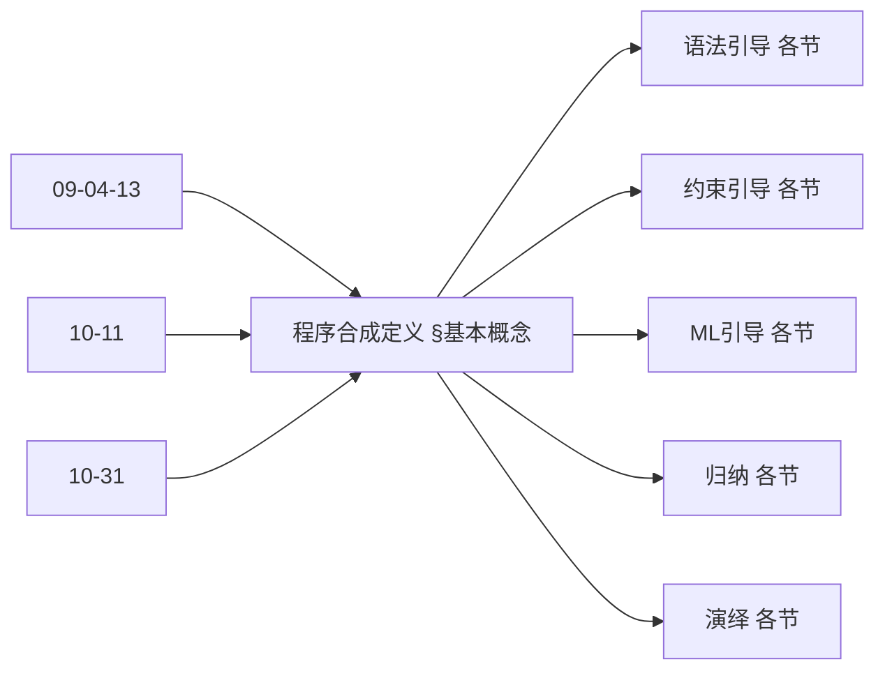
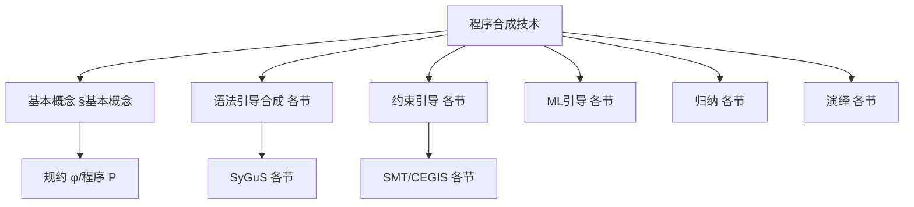
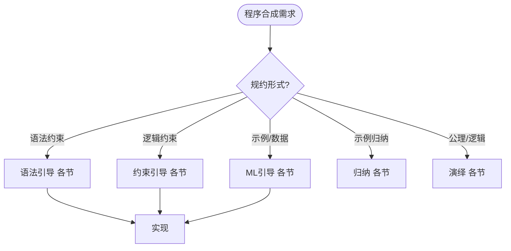
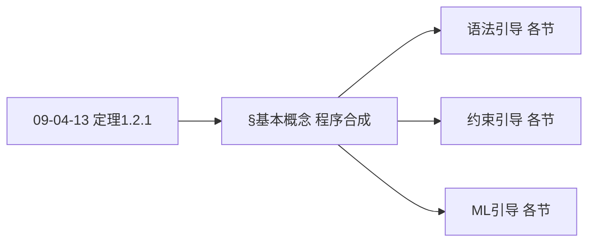
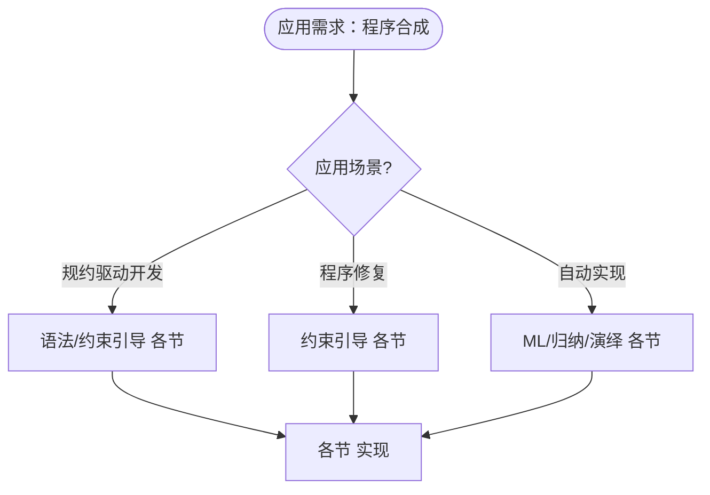

> 📊 **项目全面梳理**：详细的项目结构、模块详解和学习路径，请参阅 [`项目全面梳理-2025.md`](../项目全面梳理-2025.md)

## 10.7 程序合成技术 / Program Synthesis Techniques

### 摘要 / Executive Summary

- 统一程序合成的技术方法，建立从规范自动生成程序的框架。
- 建立程序合成在软件工程中的前沿地位。

### 关键术语与符号 / Glossary

- 程序合成、语法引导合成、约束引导合成、机器学习引导合成、程序搜索。
- 术语对齐与引用规范：`docs/术语与符号总表.md`，`01-基础理论/00-撰写规范与引用指南.md`

### 术语与符号规范 / Terminology & Notation

- 程序合成（Program Synthesis）：从规范自动生成程序的过程。
- 语法引导合成（Syntax-Guided Synthesis）：基于语法约束的合成方法。
- 约束引导合成（Constraint-Guided Synthesis）：基于约束求解的合成方法。
- 机器学习引导合成（ML-Guided Synthesis）：基于机器学习的合成方法。
- 记号约定：`P` 表示程序，`S` 表示规范，`G` 表示语法，`C` 表示约束。

### 交叉引用导航 / Cross-References

- 算法合成：参见 `09-算法理论/04-高级算法理论/13-算法合成理论.md`。
- 算法设计：参见 `09-算法理论/01-算法基础/01-算法设计理论.md`。
- 形式化验证：参见 `08-实现示例/04-形式化验证.md`。
- 项目导航与对标：见 [项目全面梳理-2025](../项目全面梳理-2025.md)、[项目扩展与持续推进任务编排](../项目扩展与持续推进任务编排.md)、[国际课程对标表](../国际课程对标表.md)。

### 快速导航 / Quick Links

- 基本概念
- 合成方法
- 应用领域

## 目录 / Table of Contents

- [10.7 程序合成技术 / Program Synthesis Techniques](#107-程序合成技术--program-synthesis-techniques)
  - [摘要 / Executive Summary](#摘要--executive-summary)
  - [关键术语与符号 / Glossary](#关键术语与符号--glossary)
  - [术语与符号规范 / Terminology \& Notation](#术语与符号规范--terminology--notation)
  - [交叉引用导航 / Cross-References](#交叉引用导航--cross-references)
  - [快速导航 / Quick Links](#快速导航--quick-links)
- [目录 / Table of Contents](#目录--table-of-contents)
- [基本概念 / Basic Concepts](#基本概念--basic-concepts)
  - [程序合成定义 / Definition of Program Synthesis](#程序合成定义--definition-of-program-synthesis)
  - [合成方法分类 / Classification of Synthesis Methods](#合成方法分类--classification-of-synthesis-methods)
  - [内容补充与思维表征 / Content Supplement and Thinking Representation](#内容补充与思维表征--content-supplement-and-thinking-representation)
    - [解释与直观 / Explanation and Intuition](#解释与直观--explanation-and-intuition)
    - [概念属性表 / Concept Attribute Table](#概念属性表--concept-attribute-table)
    - [概念关系 / Concept Relations](#概念关系--concept-relations)
    - [概念依赖图 / Concept Dependency Graph](#概念依赖图--concept-dependency-graph)
    - [论证与证明衔接 / Argumentation and Proof Link](#论证与证明衔接--argumentation-and-proof-link)
    - [思维导图：本章概念结构 / Mind Map](#思维导图本章概念结构--mind-map)
    - [多维矩阵：合成方法概念对比 / Multi-Dimensional Comparison](#多维矩阵合成方法概念对比--multi-dimensional-comparison)
    - [决策树：规约形式到方法选择 / Decision Tree](#决策树规约形式到方法选择--decision-tree)
    - [公理定理推理证明决策树 / Axiom-Theorem-Proof Tree](#公理定理推理证明决策树--axiom-theorem-proof-tree)
    - [应用决策建模树 / Application Decision Modeling Tree](#应用决策建模树--application-decision-modeling-tree)
- [语法引导合成 / Syntax-Guided Synthesis](#语法引导合成--syntax-guided-synthesis)
  - [1基本概念 / Basic Concepts](#1基本概念--basic-concepts)
  - [语法引导合成算法 / Syntax-Guided Synthesis Algorithm](#语法引导合成算法--syntax-guided-synthesis-algorithm)
  - [语法引导合成的优化 / Optimizations for Syntax-Guided Synthesis](#语法引导合成的优化--optimizations-for-syntax-guided-synthesis)
- [约束引导合成 / Constraint-Guided Synthesis](#约束引导合成--constraint-guided-synthesis)
  - [2基本概念 / Basic Concepts](#2基本概念--basic-concepts)
  - [约束引导合成算法 / Constraint-Guided Synthesis Algorithm](#约束引导合成算法--constraint-guided-synthesis-algorithm)
- [机器学习引导合成 / Machine Learning-Guided Synthesis](#机器学习引导合成--machine-learning-guided-synthesis)
  - [3基本概念 / Basic Concepts](#3基本概念--basic-concepts)
  - [神经网络引导合成 / Neural Network-Guided Synthesis](#神经网络引导合成--neural-network-guided-synthesis)
- [归纳合成 / Inductive Synthesis](#归纳合成--inductive-synthesis)
  - [4基本概念 / Basic Concepts](#4基本概念--basic-concepts)
  - [归纳合成算法 / Inductive Synthesis Algorithm](#归纳合成算法--inductive-synthesis-algorithm)
- [演绎合成 / Deductive Synthesis](#演绎合成--deductive-synthesis)
  - [5基本概念 / Basic Concepts](#5基本概念--basic-concepts)
  - [演绎合成算法 / Deductive Synthesis Algorithm](#演绎合成算法--deductive-synthesis-algorithm)
- [实现示例 / Implementation Examples](#实现示例--implementation-examples)
  - [完整的程序合成系统 / Complete Program Synthesis System](#完整的程序合成系统--complete-program-synthesis-system)
- [总结 / Summary](#总结--summary)
- [参考文献 / References](#参考文献--references)

## 基本概念 / Basic Concepts

### 程序合成定义 / Definition of Program Synthesis

程序合成是从规范自动生成程序的过程。

**数学定义 / Mathematical Definition:**

给定规范 $\phi$ 和程序空间 $\mathcal{P}$，程序合成问题是找到程序 $P \in \mathcal{P}$ 使得：
$$\forall \sigma: \sigma \models \phi \iff P(\sigma) \models \psi$$

其中 $\psi$ 是程序的输出规范。

Given a specification $\phi$ and program space $\mathcal{P}$, the program synthesis problem is to find a program $P \in \mathcal{P}$ such that:
$$\forall \sigma: \sigma \models \phi \iff P(\sigma) \models \psi$$

where $\psi$ is the output specification of the program.

### 合成方法分类 / Classification of Synthesis Methods

1. **语法引导合成 / Syntax-Guided Synthesis**: 基于语法模板的合成
2. **约束引导合成 / Constraint-Guided Synthesis**: 基于约束求解的合成
3. **机器学习引导合成 / Machine Learning-Guided Synthesis**: 基于机器学习的合成
4. **归纳合成 / Inductive Synthesis**: 基于示例的合成
5. **演绎合成 / Deductive Synthesis**: 基于逻辑推理的合成

### 内容补充与思维表征 / Content Supplement and Thinking Representation

> 本节按 [内容补充与思维表征全面计划方案](../内容补充与思维表征全面计划方案.md) **只补充、不删除**。标准见 [内容补充标准](../内容补充标准-概念定义属性关系解释论证形式证明.md)、[思维表征模板集](../思维表征模板集.md)。

#### 解释与直观 / Explanation and Intuition

**程序合成 $\forall\sigma:\sigma\models\phi\iff P(\sigma)\models\psi$（§基本概念）的动机**：从规范 $\phi$ 自动生成程序 $P$ 使输入输出满足 $\psi$；语法引导、约束引导、ML 引导、归纳、演绎合成构成方法谱系，与 09-04-13 算法合成、03-形式化证明、09-04-03 算法验证 衔接。

**与已有概念的联系**：程序合成与 09-04-13 算法合成、10-11 算法合成理论、10-31 算法合成与自动化 对应；与 03-形式化证明 中的规约与证明一致；与 08-实现 为合成实践。

#### 概念属性表 / Concept Attribute Table

| 属性名 | 类型/范围 | 含义 | 备注 |
|--------|-----------|------|------|
| $\phi$ | 规约 | 输入输出规范 | §基本概念 |
| $P$ | 程序 | 合成目标 | §基本概念 |
| $\forall\sigma:\sigma\models\phi\iff P(\sigma)\models\psi$ | 正确性条件 | 规范与程序等价 | §基本概念 |
| 语法引导 | 语法约束 | SyGuS 等 | §语法引导合成及后续 |
| 约束引导 | 约束求解 | SMT、CEGIS | 各节 |
| ML 引导 | 学习+验证 | 神经/统计 | 各节 |
| 归纳/演绎 | 示例/逻辑 | 从示例或公理合成 | 各节 |
| 规约形式/可自动化/适用场景 | 度量 | 与方法相关 | §基本概念 |

#### 概念关系 / Concept Relations

| 源概念 | 目标概念 | 关系类型 | 说明 |
|--------|----------|----------|------|
| 程序合成技术 | 09-04-13 算法合成 | depends_on | 合成问题与策略 |
| 程序合成技术 | 03-形式化证明、09-04-03 算法验证 | depends_on | 规约与验证 |
| 程序合成技术 | 10-11 算法合成理论、10-31 算法合成与自动化 | depends_on | 理论与自动化 |
| 语法/约束/ML/归纳/演绎 | 程序合成 | specializes | 各合成方法 |
| 本文 | 08-实现 | applies_to | 合成实践 |

#### 概念依赖图 / Concept Dependency Graph



#### 论证与证明衔接 / Argumentation and Proof Link

**§基本概念 程序合成形式化**与 **各节**：合成正确性由 $\forall\sigma:\sigma\models\phi\iff P(\sigma)\models\psi$ 与验证保证；与 09-04-13 定理 1.2.1 合成策略等价性衔接；各方法正确性见各节。

#### 思维导图：本章概念结构 / Mind Map



#### 多维矩阵：合成方法概念对比 / Multi-Dimensional Comparison

| 概念/方法 | 规约形式 | 可自动化程度 | 适用场景 | 备注 |
|-----------|----------|--------------|----------|------|
| 语法引导 | 语法约束 | 高 | SyGuS、领域语言 | §语法引导合成及后续 |
| 约束引导 | 逻辑约束 | 高（SMT） | 程序修复、实现 | 各节 |
| ML 引导 | 示例/数据 | 中–高 | 学习+验证 | 各节 |
| 归纳 | 示例 | 中 | 从示例归纳 | 各节 |
| 演绎 | 公理/逻辑 | 中（交互） | 从规约演绎 | 各节 |

#### 决策树：规约形式到方法选择 / Decision Tree



#### 公理定理推理证明决策树 / Axiom-Theorem-Proof Tree



#### 应用决策建模树 / Application Decision Modeling Tree



## 语法引导合成 / Syntax-Guided Synthesis

### 1基本概念 / Basic Concepts

语法引导合成使用语法模板来限制程序搜索空间。

**数学定义 / Mathematical Definition:**

给定语法 $G$ 和规范 $\phi$，语法引导合成问题是找到程序 $P$ 使得：
$$P \in L(G) \land \forall \sigma: \sigma \models \phi \iff P(\sigma) \models \psi$$

Given a grammar $G$ and specification $\phi$, the syntax-guided synthesis problem is to find a program $P$ such that:
$$P \in L(G) \land \forall \sigma: \sigma \models \phi \iff P(\sigma) \models \psi$$

### 语法引导合成算法 / Syntax-Guided Synthesis Algorithm

```rust
// 语法引导合成实现
pub struct SyntaxGuidedSynthesizer {
    grammar: Grammar,
    specification: Specification,
    search_strategy: Box<dyn SearchStrategy>,
}

impl SyntaxGuidedSynthesizer {
    pub fn synthesize(&self) -> Option<Program> {
        let mut search_space = self.build_search_space();

        while let Some(candidate) = self.search_strategy.next_candidate(&mut search_space) {
            if self.verify_program(&candidate) {
                return Some(candidate);
            }
        }

        None
    }

    fn build_search_space(&self) -> SearchSpace {
        let mut space = SearchSpace::new();

        // 从语法开始符号开始
        let start_symbol = self.grammar.start_symbol();
        space.add_candidate(self.build_candidate_from_symbol(start_symbol));

        space
    }

    fn build_candidate_from_symbol(&self, symbol: &Symbol) -> Program {
        match symbol {
            Symbol::Terminal(value) => Program::Literal(value.clone()),
            Symbol::NonTerminal(name) => {
                let rules = self.grammar.get_rules(name);
                if rules.is_empty() {
                    Program::Error
                } else {
                    // 选择第一个规则（简化实现）
                    let rule = &rules[0];
                    let mut sub_programs = Vec::new();

                    for rhs_symbol in &rule.rhs {
                        let sub_program = self.build_candidate_from_symbol(rhs_symbol);
                        sub_programs.push(sub_program);
                    }

                    Program::Composite(rule.lhs.clone(), sub_programs)
                }
            }
        }
    }

    fn verify_program(&self, program: &Program) -> bool {
        // 使用形式化验证技术验证程序
        let verifier = ProgramVerifier::new();
        verifier.verify(program, &self.specification)
    }
}

// 语法定义
#[derive(Debug, Clone)]
pub struct Grammar {
    rules: Vec<ProductionRule>,
    start_symbol: String,
}

#[derive(Debug, Clone)]
pub struct ProductionRule {
    lhs: String,
    rhs: Vec<Symbol>,
}

#[derive(Debug, Clone)]
pub enum Symbol {
    Terminal(String),
    NonTerminal(String),
}

// 程序表示
#[derive(Debug, Clone)]
pub enum Program {
    Literal(String),
    Variable(String),
    BinaryOp(BinaryOperator, Box<Program>, Box<Program>),
    UnaryOp(UnaryOperator, Box<Program>),
    If(Box<Program>, Box<Program>, Box<Program>),
    While(Box<Program>, Box<Program>),
    Composite(String, Vec<Program>),
    Error,
}

// 搜索策略
pub trait SearchStrategy {
    fn next_candidate(&self, space: &mut SearchSpace) -> Option<Program>;
}

pub struct BreadthFirstSearch;

impl SearchStrategy for BreadthFirstSearch {
    fn next_candidate(&self, space: &mut SearchSpace) -> Option<Program> {
        space.candidates.pop_front()
    }
}

pub struct DepthFirstSearch;

impl SearchStrategy for DepthFirstSearch {
    fn next_candidate(&self, space: &mut SearchSpace) -> Option<Program> {
        space.candidates.pop_back()
    }
}
```

### 语法引导合成的优化 / Optimizations for Syntax-Guided Synthesis

```rust
// 语法引导合成的优化实现
pub struct OptimizedSynthesizer {
    grammar: Grammar,
    specification: Specification,
    heuristics: Vec<Box<dyn Heuristic>>,
    pruning_strategy: Box<dyn PruningStrategy>,
}

impl OptimizedSynthesizer {
    pub fn synthesize_with_optimizations(&self) -> Option<Program> {
        let mut search_space = self.build_optimized_search_space();

        while let Some(candidate) = self.search_strategy.next_candidate(&mut search_space) {
            // 应用启发式剪枝
            if !self.pruning_strategy.should_prune(&candidate) {
                if self.verify_program(&candidate) {
                    return Some(candidate);
                }
            }

            // 生成新的候选程序
            let new_candidates = self.generate_candidates(&candidate);
            for new_candidate in new_candidates {
                if self.apply_heuristics(&new_candidate) {
                    search_space.add_candidate(new_candidate);
                }
            }
        }

        None
    }

    fn apply_heuristics(&self, candidate: &Program) -> bool {
        for heuristic in &self.heuristics {
            if !heuristic.evaluate(candidate) {
                return false;
            }
        }
        true
    }

    fn generate_candidates(&self, current: &Program) -> Vec<Program> {
        let mut candidates = Vec::new();

        // 基于语法规则生成新候选
        match current {
            Program::Composite(name, sub_programs) => {
                let rules = self.grammar.get_rules(name);
                for rule in rules {
                    let new_candidate = self.apply_rule(rule, sub_programs);
                    candidates.push(new_candidate);
                }
            }
            _ => {
                // 尝试展开非终结符
                candidates.extend(self.expand_non_terminals(current));
            }
        }

        candidates
    }
}

// 启发式剪枝
pub trait Heuristic {
    fn evaluate(&self, program: &Program) -> bool;
}

pub struct SizeHeuristic {
    max_size: usize,
}

impl Heuristic for SizeHeuristic {
    fn evaluate(&self, program: &Program) -> bool {
        self.program_size(program) <= self.max_size
    }

    fn program_size(&self, program: &Program) -> usize {
        match program {
            Program::Literal(_) | Program::Variable(_) => 1,
            Program::BinaryOp(_, left, right) => {
                1 + self.program_size(left) + self.program_size(right)
            }
            Program::UnaryOp(_, operand) => 1 + self.program_size(operand),
            Program::If(_, then_branch, else_branch) => {
                1 + self.program_size(then_branch) + self.program_size(else_branch)
            }
            Program::While(_, body) => 1 + self.program_size(body),
            Program::Composite(_, sub_programs) => {
                1 + sub_programs.iter().map(|p| self.program_size(p)).sum::<usize>()
            }
            _ => 0,
        }
    }
}

pub struct ComplexityHeuristic {
    max_complexity: f64,
}

impl Heuristic for ComplexityHeuristic {
    fn evaluate(&self, program: &Program) -> bool {
        self.calculate_complexity(program) <= self.max_complexity
    }

    fn calculate_complexity(&self, program: &Program) -> f64 {
        match program {
            Program::Literal(_) | Program::Variable(_) => 1.0,
            Program::BinaryOp(op, left, right) => {
                let op_complexity = match op {
                    BinaryOperator::Add | BinaryOperator::Sub => 1.0,
                    BinaryOperator::Mul | BinaryOperator::Div => 2.0,
                    _ => 1.5,
                };
                op_complexity + self.calculate_complexity(left) + self.calculate_complexity(right)
            }
            Program::If(_, then_branch, else_branch) => {
                2.0 + self.calculate_complexity(then_branch) + self.calculate_complexity(else_branch)
            }
            Program::While(_, body) => {
                3.0 + self.calculate_complexity(body)
            }
            _ => 1.0,
        }
    }
}
```

## 约束引导合成 / Constraint-Guided Synthesis

### 2基本概念 / Basic Concepts

约束引导合成使用约束求解技术来生成满足规范的程序。

**数学定义 / Mathematical Definition:**

给定约束 $\phi$ 和程序模板 $T$，约束引导合成问题是找到参数 $\theta$ 使得：
$$\exists \theta: \forall \sigma: T(\sigma, \theta) \models \phi$$

Given a constraint $\phi$ and program template $T$, the constraint-guided synthesis problem is to find parameters $\theta$ such that:
$$\exists \theta: \forall \sigma: T(\sigma, \theta) \models \phi$$

### 约束引导合成算法 / Constraint-Guided Synthesis Algorithm

```rust
// 约束引导合成实现
pub struct ConstraintGuidedSynthesizer {
    template: ProgramTemplate,
    specification: Specification,
    solver: Box<dyn ConstraintSolver>,
}

impl ConstraintGuidedSynthesizer {
    pub fn synthesize(&self) -> Option<Program> {
        // 1. 构建约束
        let constraints = self.build_constraints();

        // 2. 求解约束
        if let Some(solution) = self.solver.solve(&constraints) {
            // 3. 实例化程序模板
            Some(self.instantiate_template(&solution))
        } else {
            None
        }
    }

    fn build_constraints(&self) -> Vec<Constraint> {
        let mut constraints = Vec::new();

        // 添加规范约束
        constraints.extend(self.specification.to_constraints());

        // 添加模板约束
        constraints.extend(self.template.constraints());

        // 添加语义约束
        constraints.extend(self.build_semantic_constraints());

        constraints
    }

    fn build_semantic_constraints(&self) -> Vec<Constraint> {
        let mut constraints = Vec::new();

        // 添加类型约束
        constraints.extend(self.build_type_constraints());

        // 添加语义约束
        constraints.extend(self.build_behavioral_constraints());

        constraints
    }

    fn instantiate_template(&self, solution: &Solution) -> Program {
        self.template.instantiate(solution)
    }
}

// 程序模板
#[derive(Debug, Clone)]
pub struct ProgramTemplate {
    parameters: Vec<Parameter>,
    structure: ProgramStructure,
    constraints: Vec<TemplateConstraint>,
}

#[derive(Debug, Clone)]
pub struct Parameter {
    name: String,
    domain: ParameterDomain,
    constraints: Vec<ParameterConstraint>,
}

#[derive(Debug, Clone)]
pub enum ParameterDomain {
    Integer { min: i32, max: i32 },
    Boolean,
    String { options: Vec<String> },
    Real { min: f64, max: f64 },
}

// 约束求解器
pub trait ConstraintSolver {
    fn solve(&self, constraints: &[Constraint]) -> Option<Solution>;
}

pub struct Z3Solver;

impl ConstraintSolver for Z3Solver {
    fn solve(&self, constraints: &[Constraint]) -> Option<Solution> {
        // 使用Z3求解器
        let mut solver = z3::Solver::new(&self.context);

        for constraint in constraints {
            let z3_constraint = self.translate_constraint(constraint);
            solver.assert(&z3_constraint);
        }

        if solver.check() == z3::SatResult::Sat {
            let model = solver.get_model().unwrap();
            Some(self.extract_solution(&model))
        } else {
            None
        }
    }

    fn translate_constraint(&self, constraint: &Constraint) -> z3::Ast {
        match constraint {
            Constraint::Equal(left, right) => {
                let z3_left = self.translate_expression(left);
                let z3_right = self.translate_expression(right);
                z3_left._eq(&z3_right)
            }
            Constraint::LessThan(left, right) => {
                let z3_left = self.translate_expression(left);
                let z3_right = self.translate_expression(right);
                z3_left.lt(&z3_right)
            }
            Constraint::GreaterThan(left, right) => {
                let z3_left = self.translate_expression(left);
                let z3_right = self.translate_expression(right);
                z3_left.gt(&z3_right)
            }
            Constraint::And(constraints) => {
                let z3_constraints: Vec<z3::Ast> = constraints
                    .iter()
                    .map(|c| self.translate_constraint(c))
                    .collect();
                z3::Ast::and(&z3_constraints)
            }
            Constraint::Or(constraints) => {
                let z3_constraints: Vec<z3::Ast> = constraints
                    .iter()
                    .map(|c| self.translate_constraint(c))
                    .collect();
                z3::Ast::or(&z3_constraints)
            }
        }
    }
}
```

## 机器学习引导合成 / Machine Learning-Guided Synthesis

### 3基本概念 / Basic Concepts

机器学习引导合成使用机器学习技术来指导程序搜索过程。

**数学定义 / Mathematical Definition:**

给定训练数据 $D = \{(x_i, y_i)\}_{i=1}^n$ 和模型 $M$，机器学习引导合成问题是找到程序 $P$ 使得：
$$P = \arg\min_{P \in \mathcal{P}} \sum_{i=1}^n \mathcal{L}(P(x_i), y_i)$$

Given training data $D = \{(x_i, y_i)\}_{i=1}^n$ and model $M$, the machine learning-guided synthesis problem is to find a program $P$ such that:
$$P = \arg\min_{P \in \mathcal{P}} \sum_{i=1}^n \mathcal{L}(P(x_i), y_i)$$

### 神经网络引导合成 / Neural Network-Guided Synthesis

```rust
// 神经网络引导合成实现
pub struct NeuralSynthesizer {
    neural_network: NeuralNetwork,
    program_space: ProgramSpace,
    training_data: Vec<TrainingExample>,
}

impl NeuralSynthesizer {
    pub fn synthesize(&self) -> Option<Program> {
        // 1. 训练神经网络
        self.train_neural_network();

        // 2. 使用神经网络指导搜索
        let mut search_space = self.program_space.clone();

        while let Some(candidate) = self.generate_candidate() {
            let score = self.neural_network.predict(&candidate);

            if score > self.threshold {
                if self.verify_program(&candidate) {
                    return Some(candidate);
                }
            }
        }

        None
    }

    fn train_neural_network(&self) {
        let mut optimizer = Adam::new(0.001);

        for epoch in 0..self.epochs {
            for example in &self.training_data {
                let loss = self.compute_loss(example);
                optimizer.backward(&loss);
            }
        }
    }

    fn generate_candidate(&self) -> Option<Program> {
        // 使用神经网络生成候选程序
        let embedding = self.neural_network.encode_specification(&self.specification);
        let program_tokens = self.neural_network.decode_program(&embedding);

        self.tokens_to_program(&program_tokens)
    }
}

// 神经网络模型
pub struct NeuralNetwork {
    encoder: TransformerEncoder,
    decoder: TransformerDecoder,
    program_embedding: ProgramEmbedding,
}

impl NeuralNetwork {
    pub fn encode_specification(&self, spec: &Specification) -> Tensor {
        let spec_tokens = self.tokenize_specification(spec);
        self.encoder.forward(&spec_tokens)
    }

    pub fn decode_program(&self, embedding: &Tensor) -> Vec<Token> {
        self.decoder.forward(embedding)
    }

    pub fn predict(&self, program: &Program) -> f64 {
        let program_embedding = self.program_embedding.embed(program);
        let spec_embedding = self.encode_specification(&self.specification);

        let similarity = self.compute_similarity(&program_embedding, &spec_embedding);
        similarity
    }
}

// 程序嵌入
pub struct ProgramEmbedding {
    token_embeddings: HashMap<String, Tensor>,
    structural_embeddings: HashMap<ProgramStructure, Tensor>,
}

impl ProgramEmbedding {
    pub fn embed(&self, program: &Program) -> Tensor {
        match program {
            Program::Literal(value) => {
                self.token_embeddings.get(value).unwrap_or(&Tensor::zeros(1))
            }
            Program::Variable(name) => {
                self.token_embeddings.get(name).unwrap_or(&Tensor::zeros(1))
            }
            Program::BinaryOp(op, left, right) => {
                let left_embedding = self.embed(left);
                let right_embedding = self.embed(right);
                let op_embedding = self.token_embeddings.get(&op.to_string()).unwrap_or(&Tensor::zeros(1));

                self.combine_embeddings(&[left_embedding, op_embedding, right_embedding])
            }
            Program::If(condition, then_branch, else_branch) => {
                let condition_embedding = self.embed(condition);
                let then_embedding = self.embed(then_branch);
                let else_embedding = self.embed(else_branch);

                self.combine_embeddings(&[condition_embedding, then_embedding, else_embedding])
            }
            _ => Tensor::zeros(1),
        }
    }

    fn combine_embeddings(&self, embeddings: &[&Tensor]) -> Tensor {
        // 使用注意力机制组合嵌入
        let mut combined = Tensor::zeros(embeddings[0].shape());

        for embedding in embeddings {
            combined = combined + embedding;
        }

        combined / embeddings.len() as f64
    }
}
```

## 归纳合成 / Inductive Synthesis

### 4基本概念 / Basic Concepts

归纳合成基于输入输出示例来合成程序。

**数学定义 / Mathematical Definition:**

给定示例集合 $E = \{(x_i, y_i)\}_{i=1}^n$，归纳合成问题是找到程序 $P$ 使得：
$$\forall i: P(x_i) = y_i$$

Given a set of examples $E = \{(x_i, y_i)\}_{i=1}^n$, the inductive synthesis problem is to find a program $P$ such that:
$$\forall i: P(x_i) = y_i$$

### 归纳合成算法 / Inductive Synthesis Algorithm

```rust
// 归纳合成实现
pub struct InductiveSynthesizer {
    examples: Vec<Example>,
    program_space: ProgramSpace,
    generalization_strategy: Box<dyn GeneralizationStrategy>,
}

impl InductiveSynthesizer {
    pub fn synthesize(&self) -> Option<Program> {
        // 1. 从示例构建初始程序
        let initial_program = self.build_initial_program();

        // 2. 泛化程序
        let generalized_program = self.generalize_program(initial_program);

        // 3. 验证泛化后的程序
        if self.verify_generalization(&generalized_program) {
            Some(generalized_program)
        } else {
            None
        }
    }

    fn build_initial_program(&self) -> Program {
        // 构建覆盖所有示例的程序
        let mut branches = Vec::new();

        for example in &self.examples {
            let condition = self.build_condition_for_example(example);
            let action = self.build_action_for_example(example);
            branches.push((condition, action));
        }

        self.build_decision_tree(branches)
    }

    fn build_condition_for_example(&self, example: &Example) -> Program {
        // 为示例构建条件
        let mut conditions = Vec::new();

        for (input_name, input_value) in &example.input {
            let condition = Program::BinaryOp(
                BinaryOperator::Eq,
                Box::new(Program::Variable(input_name.clone())),
                Box::new(Program::Literal(input_value.to_string()))
            );
            conditions.push(condition);
        }

        self.combine_conditions(conditions)
    }

    fn generalize_program(&self, program: Program) -> Program {
        self.generalization_strategy.generalize(program)
    }

    fn verify_generalization(&self, program: &Program) -> bool {
        // 验证泛化后的程序是否仍然满足所有示例
        for example in &self.examples {
            let result = self.evaluate_program(program, &example.input);
            if result != example.output {
                return false;
            }
        }
        true
    }
}

// 泛化策略
pub trait GeneralizationStrategy {
    fn generalize(&self, program: Program) -> Program;
}

pub struct PatternBasedGeneralization;

impl GeneralizationStrategy for PatternBasedGeneralization {
    fn generalize(&self, program: Program) -> Program {
        match program {
            Program::If(condition, then_branch, else_branch) => {
                // 尝试识别模式并泛化
                if let Some(generalized_condition) = self.generalize_condition(condition) {
                    Program::If(
                        Box::new(generalized_condition),
                        then_branch,
                        else_branch
                    )
                } else {
                    program
                }
            }
            Program::BinaryOp(op, left, right) => {
                // 泛化二元操作
                let generalized_left = self.generalize(left);
                let generalized_right = self.generalize(right);
                Program::BinaryOp(op, Box::new(generalized_left), Box::new(generalized_right))
            }
            _ => program,
        }
    }

    fn generalize_condition(&self, condition: Program) -> Option<Program> {
        // 识别数值模式并泛化
        match condition {
            Program::BinaryOp(BinaryOperator::Eq, left, right) => {
                if let (Program::Variable(var), Program::Literal(value)) = (*left, *right) {
                    if let Ok(num_value) = value.parse::<i32>() {
                        // 尝试泛化为范围条件
                        Some(Program::BinaryOp(
                            BinaryOperator::Ge,
                            Box::new(Program::Variable(var)),
                            Box::new(Program::Literal((num_value - 1).to_string()))
                        ))
                    } else {
                        None
                    }
                } else {
                    None
                }
            }
            _ => None,
        }
    }
}
```

## 演绎合成 / Deductive Synthesis

### 5基本概念 / Basic Concepts

演绎合成使用逻辑推理从规范推导出程序。

**数学定义 / Mathematical Definition:**

给定规范 $\phi$ 和后置条件 $\psi$，演绎合成问题是找到程序 $P$ 使得：
$$\{ \phi \} P \{ \psi \}$$

Given a specification $\phi$ and postcondition $\psi$, the deductive synthesis problem is to find a program $P$ such that:
$$\{ \phi \} P \{ \psi \}$$

### 演绎合成算法 / Deductive Synthesis Algorithm

```rust
// 演绎合成实现
pub struct DeductiveSynthesizer {
    specification: Specification,
    proof_system: ProofSystem,
    transformation_rules: Vec<TransformationRule>,
}

impl DeductiveSynthesizer {
    pub fn synthesize(&self) -> Option<Program> {
        // 1. 构建证明目标
        let proof_goal = self.build_proof_goal();

        // 2. 应用推理规则
        let proof = self.apply_inference_rules(proof_goal);

        // 3. 从证明中提取程序
        proof.map(|p| self.extract_program(p))
    }

    fn build_proof_goal(&self) -> ProofGoal {
        ProofGoal {
            precondition: self.specification.precondition.clone(),
            postcondition: self.specification.postcondition.clone(),
            program: Program::Hole, // 待合成的程序
        }
    }

    fn apply_inference_rules(&self, goal: ProofGoal) -> Option<Proof> {
        // 尝试应用各种推理规则
        for rule in &self.transformation_rules {
            if let Some(new_goals) = rule.apply(&goal) {
                let mut sub_proofs = Vec::new();

                for sub_goal in new_goals {
                    if let Some(sub_proof) = self.apply_inference_rules(sub_goal) {
                        sub_proofs.push(sub_proof);
                    } else {
                        return None;
                    }
                }

                return Some(Proof::Composite(rule.clone(), sub_proofs));
            }
        }

        // 检查是否为公理
        if self.is_axiom(&goal) {
            Some(Proof::Axiom(goal))
        } else {
            None
        }
    }

    fn extract_program(&self, proof: Proof) -> Program {
        match proof {
            Proof::Axiom(goal) => goal.program,
            Proof::Composite(rule, sub_proofs) => {
                let sub_programs: Vec<Program> = sub_proofs
                    .into_iter()
                    .map(|p| self.extract_program(p))
                    .collect();

                rule.construct_program(sub_programs)
            }
        }
    }
}

// 转换规则
#[derive(Debug, Clone)]
pub struct TransformationRule {
    name: String,
    pattern: ProofPattern,
    transformation: Box<dyn Fn(&ProofGoal) -> Option<Vec<ProofGoal>>>,
    constructor: Box<dyn Fn(Vec<Program>) -> Program>,
}

impl TransformationRule {
    pub fn apply(&self, goal: &ProofGoal) -> Option<Vec<ProofGoal>> {
        if self.pattern.matches(goal) {
            (self.transformation)(goal)
        } else {
            None
        }
    }

    pub fn construct_program(&self, sub_programs: Vec<Program>) -> Program {
        (self.constructor)(sub_programs)
    }
}

// 序列规则
pub struct SequenceRule;

impl TransformationRule for SequenceRule {
    fn apply(&self, goal: &ProofGoal) -> Option<Vec<ProofGoal>> {
        // 尝试将目标分解为序列
        if let Some((mid_condition, first_program, second_program)) = self.decompose_sequence(goal) {
            Some(vec![
                ProofGoal {
                    precondition: goal.precondition.clone(),
                    postcondition: mid_condition,
                    program: first_program,
                },
                ProofGoal {
                    precondition: mid_condition,
                    postcondition: goal.postcondition.clone(),
                    program: second_program,
                },
            ])
        } else {
            None
        }
    }

    fn construct_program(&self, sub_programs: Vec<Program>) -> Program {
        if sub_programs.len() == 2 {
            Program::Sequence(Box::new(sub_programs[0].clone()), Box::new(sub_programs[1].clone()))
        } else {
            Program::Error
        }
    }
}

// 条件规则
pub struct ConditionalRule;

impl TransformationRule for ConditionalRule {
    fn apply(&self, goal: &ProofGoal) -> Option<Vec<ProofGoal>> {
        // 尝试将目标分解为条件语句
        if let Some((condition, then_program, else_program)) = self.decompose_conditional(goal) {
            Some(vec![
                ProofGoal {
                    precondition: goal.precondition.clone(),
                    postcondition: goal.postcondition.clone(),
                    program: then_program,
                },
                ProofGoal {
                    precondition: goal.precondition.clone(),
                    postcondition: goal.postcondition.clone(),
                    program: else_program,
                },
            ])
        } else {
            None
        }
    }

    fn construct_program(&self, sub_programs: Vec<Program>) -> Program {
        if sub_programs.len() == 2 {
            Program::If(
                Box::new(self.condition.clone()),
                Box::new(sub_programs[0].clone()),
                Box::new(sub_programs[1].clone())
            )
        } else {
            Program::Error
        }
    }
}
```

## 实现示例 / Implementation Examples

### 完整的程序合成系统 / Complete Program Synthesis System

```rust
// 完整的程序合成系统
pub struct ProgramSynthesisSystem {
    synthesizers: Vec<Box<dyn Synthesizer>>,
    verifier: ProgramVerifier,
    optimizer: ProgramOptimizer,
}

impl ProgramSynthesisSystem {
    pub fn synthesize_program(&self, specification: &Specification) -> Option<Program> {
        let mut candidates = Vec::new();

        // 使用多种合成方法
        for synthesizer in &self.synthesizers {
            if let Some(candidate) = synthesizer.synthesize(specification) {
                candidates.push(candidate);
            }
        }

        // 验证和优化候选程序
        let mut verified_candidates = Vec::new();
        for candidate in candidates {
            if self.verifier.verify(&candidate, specification) {
                let optimized = self.optimizer.optimize(candidate);
                verified_candidates.push(optimized);
            }
        }

        // 选择最佳程序
        self.select_best_program(verified_candidates)
    }

    fn select_best_program(&self, candidates: Vec<Program>) -> Option<Program> {
        if candidates.is_empty() {
            None
        } else {
            // 使用多目标优化选择最佳程序
            let mut best_candidate = candidates[0].clone();
            let mut best_score = self.evaluate_program(&best_candidate);

            for candidate in &candidates[1..] {
                let score = self.evaluate_program(candidate);
                if score > best_score {
                    best_candidate = candidate.clone();
                    best_score = score;
                }
            }

            Some(best_candidate)
        }
    }

    fn evaluate_program(&self, program: &Program) -> f64 {
        let mut score = 0.0;

        // 评估程序大小
        score -= self.program_size(program) as f64 * 0.1;

        // 评估程序复杂度
        score -= self.program_complexity(program) * 0.2;

        // 评估程序可读性
        score += self.program_readability(program) * 0.3;

        // 评估程序效率
        score += self.program_efficiency(program) * 0.4;

        score
    }
}

// 使用示例
fn main() {
    let specification = Specification {
        precondition: "x > 0 && y > 0".to_string(),
        postcondition: "result == x + y".to_string(),
        examples: vec![
            Example {
                input: vec![("x".to_string(), "1".to_string()), ("y".to_string(), "2".to_string())],
                output: "3".to_string(),
            },
            Example {
                input: vec![("x".to_string(), "5".to_string()), ("y".to_string(), "3".to_string())],
                output: "8".to_string(),
            },
        ],
    };

    let synthesis_system = ProgramSynthesisSystem::new();
    let program = synthesis_system.synthesize_program(&specification);

    match program {
        Some(p) => println!("Synthesized program: {:?}", p),
        None => println!("Failed to synthesize program"),
    }
}
```

## 总结 / Summary

本文档介绍了程序合成的各种技术，包括：

1. **语法引导合成**: 基于语法模板的合成方法
2. **约束引导合成**: 基于约束求解的合成方法
3. **机器学习引导合成**: 基于机器学习的合成方法
4. **归纳合成**: 基于示例的合成方法
5. **演绎合成**: 基于逻辑推理的合成方法

这些技术为自动程序生成提供了强大的理论基础和实用工具。

This document introduces various techniques in program synthesis, including:

1. **Syntax-Guided Synthesis**: Synthesis methods based on syntax templates
2. **Constraint-Guided Synthesis**: Synthesis methods based on constraint solving
3. **Machine Learning-Guided Synthesis**: Synthesis methods based on machine learning
4. **Inductive Synthesis**: Synthesis methods based on examples
5. **Deductive Synthesis**: Synthesis methods based on logical reasoning

These techniques provide powerful theoretical foundations and practical tools for automatic program generation.

## 参考文献 / References

1. Solar-Lezama, A. (2008). Program synthesis by sketching. University of California, Berkeley.
2. Gulwani, S., Polozov, O., & Singh, R. (2017). Program synthesis. Foundations and Trends in Programming Languages, 4(1-2), 1-119.
3. Devlin, J., Uesato, J., Bhupatiraju, S., Singh, R., Mohamed, A. R., & Kohli, P. (2017). Robustfill: Neural program learning under noisy i/o. In International conference on machine learning (pp. 990-998).
4. Balog, M., Gaunt, A. L., Brockschmidt, M., Nowozin, S., & Tarlow, D. (2017). Deepcoder: Learning to write programs. In International conference on learning representations.
5. Manna, Z., & Waldinger, R. (1980). A deductive approach to program synthesis. ACM Transactions on Programming Languages and Systems (TOPLAS), 2(1), 90-121.
