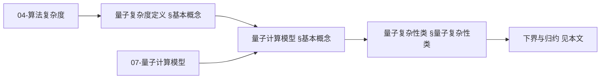
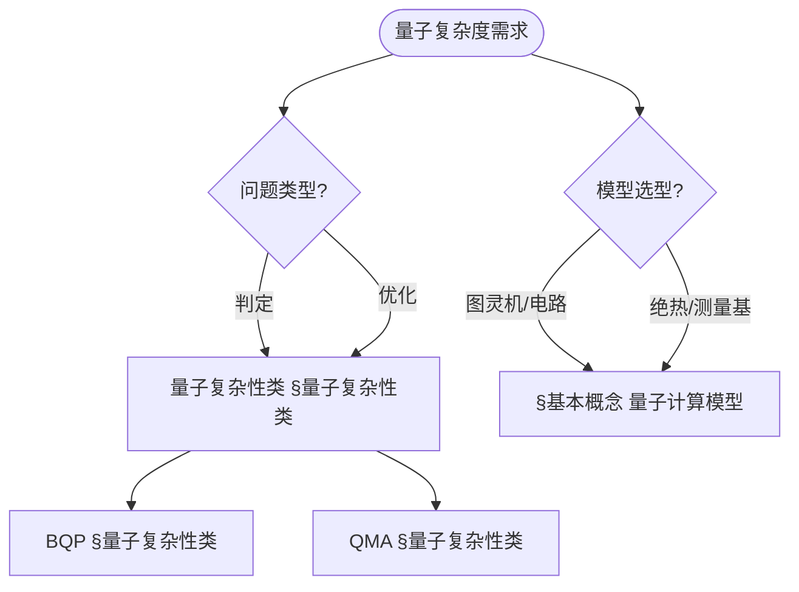
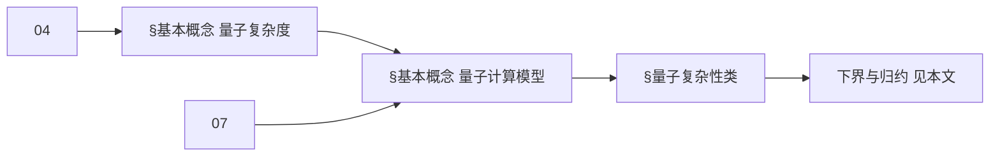
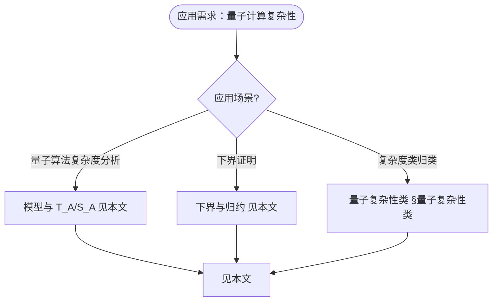

> 📊 **项目全面梳理**：详细的项目结构、模块详解和学习路径，请参阅 [`项目全面梳理-2025.md`](../项目全面梳理-2025.md)

## 10.8 量子计算复杂性理论 / Quantum Computational Complexity Theory

### 摘要 / Executive Summary

- 统一量子计算复杂性理论，建立量子复杂性类与量子算法复杂度分析。
- 建立量子计算复杂性理论在计算理论中的前沿地位。

### 关键术语与符号 / Glossary

- 量子复杂性类、BQP、QMA、量子算法复杂度、量子下界、量子优势。
- 术语对齐与引用规范：`docs/术语与符号总表.md`，`01-基础理论/00-撰写规范与引用指南.md`

### 术语与符号规范 / Terminology & Notation

- 量子复杂性类（Quantum Complexity Class）：量子计算中的复杂性类。
- BQP（Bounded-error Quantum Polynomial time）：有界错误量子多项式时间。
- QMA（Quantum Merlin-Arthur）：量子版本的MA类。
- 量子下界（Quantum Lower Bound）：量子算法复杂度的下界。
- 记号约定：`BQP` 表示量子多项式时间，`QMA` 表示量子MA类，`T` 表示时间复杂度。

### 交叉引用导航 / Cross-References

- 复杂度理论：参见 `09-算法理论/02-复杂度理论/01-计算复杂度理论.md`。
- 量子算法：参见 `09-算法理论/01-算法基础/15-量子算法理论.md`。
- 量子计算模型：参见 `07-计算模型/05-量子计算模型.md`。
- 项目导航与对标：见 [项目全面梳理-2025](../项目全面梳理-2025.md)、[项目扩展与持续推进任务编排](../项目扩展与持续推进任务编排.md)、[国际课程对标表](../国际课程对标表.md)。

### 快速导航 / Quick Links

- 基本概念
- 量子复杂性类
- 量子下界

## 目录 / Table of Contents

- [10.8 量子计算复杂性理论 / Quantum Computational Complexity Theory](#108-量子计算复杂性理论--quantum-computational-complexity-theory)
  - [摘要 / Executive Summary](#摘要--executive-summary)
  - [关键术语与符号 / Glossary](#关键术语与符号--glossary)
  - [术语与符号规范 / Terminology \& Notation](#术语与符号规范--terminology--notation)
  - [交叉引用导航 / Cross-References](#交叉引用导航--cross-references)
  - [快速导航 / Quick Links](#快速导航--quick-links)
- [目录 / Table of Contents](#目录--table-of-contents)
- [基本概念 / Basic Concepts](#基本概念--basic-concepts)
  - [量子计算复杂性定义 / Definition of Quantum Computational Complexity](#量子计算复杂性定义--definition-of-quantum-computational-complexity)
  - [量子计算模型 / Quantum Computational Models](#量子计算模型--quantum-computational-models)
  - [内容补充与思维表征 / Content Supplement and Thinking Representation](#内容补充与思维表征--content-supplement-and-thinking-representation)
    - [解释与直观 / Explanation and Intuition](#解释与直观--explanation-and-intuition)
    - [概念属性表 / Concept Attribute Table](#概念属性表--concept-attribute-table)
    - [概念关系 / Concept Relations](#概念关系--concept-relations)
    - [概念依赖图 / Concept Dependency Graph](#概念依赖图--concept-dependency-graph)
    - [论证与证明衔接 / Argumentation and Proof Link](#论证与证明衔接--argumentation-and-proof-link)
    - [思维导图：本章概念结构 / Mind Map](#思维导图本章概念结构--mind-map)
    - [多维矩阵：量子复杂度概念对比 / Multi-Dimensional Comparison](#多维矩阵量子复杂度概念对比--multi-dimensional-comparison)
    - [决策树：问题类型与模型到选择 / Decision Tree](#决策树问题类型与模型到选择--decision-tree)
    - [公理定理推理证明决策树 / Axiom-Theorem-Proof Tree](#公理定理推理证明决策树--axiom-theorem-proof-tree)
    - [应用决策建模树 / Application Decision Modeling Tree](#应用决策建模树--application-decision-modeling-tree)
- [量子复杂性类 / Quantum Complexity Classes](#量子复杂性类--quantum-complexity-classes)
  - [BQP类 / BQP Class](#bqp类--bqp-class)
  - [QMA类 / QMA Class](#qma类--qma-class)
  - [QIP类 / QIP Class](#qip类--qip-class)
- [量子算法复杂度分析 / Quantum Algorithm Complexity Analysis](#量子算法复杂度分析--quantum-algorithm-complexity-analysis)
  - [量子傅里叶变换复杂度 / Quantum Fourier Transform Complexity](#量子傅里叶变换复杂度--quantum-fourier-transform-complexity)
  - [Grover算法复杂度 / Grover Algorithm Complexity](#grover算法复杂度--grover-algorithm-complexity)
- [量子下界理论 / Quantum Lower Bound Theory](#量子下界理论--quantum-lower-bound-theory)
  - [量子查询下界 / Quantum Query Lower Bounds](#量子查询下界--quantum-query-lower-bounds)
  - [量子通信下界 / Quantum Communication Lower Bounds](#量子通信下界--quantum-communication-lower-bounds)
- [量子查询复杂度 / Quantum Query Complexity](#量子查询复杂度--quantum-query-complexity)
  - [量子查询模型 / Quantum Query Model](#量子查询模型--quantum-query-model)
- [量子通信复杂度 / Quantum Communication Complexity](#量子通信复杂度--quantum-communication-complexity)
  - [量子通信协议 / Quantum Communication Protocol](#量子通信协议--quantum-communication-protocol)
- [实现示例 / Implementation Examples](#实现示例--implementation-examples)
  - [完整的量子复杂度分析系统 / Complete Quantum Complexity Analysis System](#完整的量子复杂度分析系统--complete-quantum-complexity-analysis-system)
- [交叉引用与依赖 / Cross-References and Dependencies](#交叉引用与依赖--cross-references-and-dependencies)
- [总结 / Summary](#总结--summary)
- [参考文献 / References](#参考文献--references)

## 基本概念 / Basic Concepts

### 量子计算复杂性定义 / Definition of Quantum Computational Complexity

量子计算复杂性研究量子算法在时间和空间资源上的限制。

**数学定义 / Mathematical Definition:**

给定量子算法 $\mathcal{A}$ 和输入 $x$，量子时间复杂度定义为：
$$T_{\mathcal{A}}(x) = \text{number of quantum gates in } \mathcal{A}(x)$$

空间复杂度定义为：
$$S_{\mathcal{A}}(x) = \text{number of qubits used in } \mathcal{A}(x)$$

Given a quantum algorithm $\mathcal{A}$ and input $x$, quantum time complexity is defined as:
$$T_{\mathcal{A}}(x) = \text{number of quantum gates in } \mathcal{A}(x)$$

Space complexity is defined as:
$$S_{\mathcal{A}}(x) = \text{number of qubits used in } \mathcal{A}(x)$$

### 量子计算模型 / Quantum Computational Models

1. **量子图灵机 / Quantum Turing Machine**: 量子版本的图灵机模型
2. **量子电路模型 / Quantum Circuit Model**: 基于量子门的计算模型
3. **绝热量子计算 / Adiabatic Quantum Computing**: 基于绝热演化的计算模型
4. **测量基量子计算 / Measurement-Based Quantum Computing**: 基于测量的计算模型

### 内容补充与思维表征 / Content Supplement and Thinking Representation

> 本节按 [内容补充与思维表征全面计划方案](../内容补充与思维表征全面计划方案.md) **只补充、不删除**。标准见 [内容补充标准](../内容补充标准-概念定义属性关系解释论证形式证明.md)、[思维表征模板集](../思维表征模板集.md)。

#### 解释与直观 / Explanation and Intuition

**量子计算复杂性 $T_{\mathcal{A}}(x)$、$S_{\mathcal{A}}(x)$（§基本概念）的动机**：在量子图灵机/电路/绝热/测量基等模型下刻画时间与空间；BQP、QMA 等复杂度类与 04-复杂度类、07-量子计算模型、09-01-15 量子算法 衔接。

**与已有概念的联系**：量子复杂度与 04-算法复杂度 中的 $T(n)$、$S(n)$ 对应；BQP/QMA 与 04-P/NP/PSPACE 为复杂度层次；与 10-13 量子计算复杂性理论（若为另一篇）对照；与 07-量子计算模型 一致。

#### 概念属性表 / Concept Attribute Table

| 属性名 | 类型/范围 | 含义 | 备注 |
|--------|-----------|------|------|
| $T_{\mathcal{A}}(x)$ | 函数 | 量子算法时间复杂度 | §基本概念 |
| $S_{\mathcal{A}}(x)$ | 函数 | 量子算法空间复杂度 | §基本概念 |
| 量子图灵机/电路/绝热/测量基 | 计算模型 | 模型、表达能力、等价 | §基本概念 |
| BQP | 复杂度类 | 有界错误量子多项式时间 | §量子复杂性类 |
| QMA | 复杂度类 | 量子 Merlin-Arthur | §量子复杂性类 |
| 与 P/NP/PSPACE 关系 | 包含/分离 | 复杂度层次 | §量子复杂性类 |

#### 概念关系 / Concept Relations

| 源概念 | 目标概念 | 关系类型 | 说明 |
|--------|----------|----------|------|
| 量子计算复杂性理论 | 04-算法复杂度 | depends_on | 复杂度定义与类 |
| 量子计算复杂性理论 | 07-量子计算模型 | depends_on | 量子图灵机/电路等 |
| 量子计算复杂性理论 | 09-01-15 量子算法 | depends_on | 量子算法基础 |
| BQP/QMA | 04-P/NP/PSPACE | specializes | 量子复杂度类 |
| 本文 | 10-高级主题 | applies_to | 下界与完备性 见本文 |

#### 概念依赖图 / Concept Dependency Graph



#### 论证与证明衔接 / Argumentation and Proof Link

**§基本概念 $T_{\mathcal{A}}$、$S_{\mathcal{A}}$**与 **§量子复杂性类**：BQP、QMA 的定义与包含关系由定义与归约保证；下界由 04-信息论下界 等方法保证；与 04、07 论证衔接。

#### 思维导图：本章概念结构 / Mind Map

```mermaid
graph TD
  QCC[量子计算复杂性理论]
  QCC --> Def[基本概念 §基本概念]
  QCC --> Model[量子计算模型 §基本概念]
  QCC --> Class[量子复杂性类 §量子复杂性类]
  QCC --> LB[下界与归约 见本文]
  Def --> TA[T_A(x)/S_A(x)]
  Model --> QTM[量子图灵机/电路/绝热/测量基]
  Class --> BQP[BQP §量子复杂性类]
  Class --> QMA[QMA §量子复杂性类]
```

#### 多维矩阵：量子复杂度概念对比 / Multi-Dimensional Comparison

| 概念/模型或类 | 模型/表达能力 | 时间/空间 | 与 P/NP 关系 | 备注 |
|---------------|----------------|-----------|--------------|------|
| 量子图灵机/电路/绝热/测量基 | 等价/表达 | $T_{\mathcal{A}}$/$S_{\mathcal{A}}$ | — | §基本概念 |
| BQP | 有界错误量子多项式 | 多项式时间/空间 | P⊆BQP⊆PSPACE | §量子复杂性类 |
| QMA | 量子 Merlin-Arthur | 多项式 | NP⊆QMA | §量子复杂性类 |

#### 决策树：问题类型与模型到选择 / Decision Tree



#### 公理定理推理证明决策树 / Axiom-Theorem-Proof Tree



#### 应用决策建模树 / Application Decision Modeling Tree



## 量子复杂性类 / Quantum Complexity Classes

### BQP类 / BQP Class

BQP（Bounded-Error Quantum Polynomial-Time）是量子计算中最基本的复杂性类。

**数学定义 / Mathematical Definition:**

语言 $L$ 属于BQP当且仅当存在量子算法 $\mathcal{A}$ 使得：
$$\forall x \in L: \Pr[\mathcal{A}(x) = 1] \geq \frac{2}{3}$$
$$\forall x \notin L: \Pr[\mathcal{A}(x) = 0] \geq \frac{2}{3}$$
且 $\mathcal{A}$ 在多项式时间内运行。

A language $L$ is in BQP if and only if there exists a quantum algorithm $\mathcal{A}$ such that:
$$\forall x \in L: \Pr[\mathcal{A}(x) = 1] \geq \frac{2}{3}$$
$$\forall x \notin L: \Pr[\mathcal{A}(x) = 0] \geq \frac{2}{3}$$
and $\mathcal{A}$ runs in polynomial time.

```rust
// BQP类实现
pub struct BQPAlgorithm {
    quantum_circuit: QuantumCircuit,
    classical_post_processing: ClassicalAlgorithm,
}

impl BQPAlgorithm {
    pub fn solve(&self, input: &QuantumInput) -> QuantumOutput {
        // 1. 量子计算阶段
        let quantum_result = self.quantum_circuit.execute(input);

        // 2. 经典后处理阶段
        let final_result = self.classical_post_processing.process(quantum_result);

        final_result
    }

    pub fn verify_bqp_property(&self, language: &Language) -> bool {
        for test_case in language.test_cases() {
            let result = self.solve(&test_case.input);
            let expected = test_case.expected_output;

            // 检查BQP的正确性要求
            if test_case.input.is_in_language() {
                if result.probability_of_acceptance() < 2.0/3.0 {
                    return false;
                }
            } else {
                if result.probability_of_acceptance() > 1.0/3.0 {
                    return false;
                }
            }
        }
        true
    }
}

// 量子电路
pub struct QuantumCircuit {
    gates: Vec<QuantumGate>,
    qubits: usize,
    depth: usize,
}

impl QuantumCircuit {
    pub fn execute(&self, input: &QuantumInput) -> QuantumState {
        let mut state = input.to_quantum_state();

        for gate in &self.gates {
            state = gate.apply(state);
        }

        state
    }

    pub fn polynomial_time(&self) -> bool {
        // 检查电路深度是否为多项式
        let input_size = self.qubits;
        let circuit_size = self.gates.len();

        // 检查是否满足多项式时间要求
        circuit_size <= input_size.pow(3) // 例如O(n³)
    }
}
```

### QMA类 / QMA Class

QMA（Quantum Merlin-Arthur）是量子版本的NP类。

**数学定义 / Mathematical Definition:**

语言 $L$ 属于QMA当且仅当存在量子验证器 $V$ 使得：
$$\forall x \in L: \exists |\psi\rangle: \Pr[V(x, |\psi\rangle) = 1] \geq \frac{2}{3}$$
$$\forall x \notin L: \forall |\psi\rangle: \Pr[V(x, |\psi\rangle) = 1] \leq \frac{1}{3}$$

A language $L$ is in QMA if and only if there exists a quantum verifier $V$ such that:
$$\forall x \in L: \exists |\psi\rangle: \Pr[V(x, |\psi\rangle) = 1] \geq \frac{2}{3}$$
$$\forall x \notin L: \forall |\psi\rangle: \Pr[V(x, |\psi\rangle) = 1] \leq \frac{1}{3}$$

```rust
// QMA类实现
pub struct QMAVerifier {
    quantum_circuit: QuantumCircuit,
    witness_length: usize,
}

impl QMAVerifier {
    pub fn verify(&self, input: &QuantumInput, witness: &QuantumState) -> bool {
        // 组合输入和见证
        let combined_input = self.combine_input_and_witness(input, witness);

        // 执行量子验证电路
        let result = self.quantum_circuit.execute(&combined_input);

        // 测量结果
        result.measure_acceptance()
    }

    pub fn verify_qma_property(&self, language: &Language) -> bool {
        for test_case in language.test_cases() {
            if test_case.input.is_in_language() {
                // 存在性：应该存在一个见证使得验证器接受
                let mut found_witness = false;
                for witness in self.generate_witness_candidates(&test_case.input) {
                    if self.verify(&test_case.input, &witness) {
                        found_witness = true;
                        break;
                    }
                }
                if !found_witness {
                    return false;
                }
            } else {
                // 普遍性：对于所有见证，验证器都应该拒绝
                for witness in self.generate_witness_candidates(&test_case.input) {
                    if self.verify(&test_case.input, &witness) {
                        return false; // 不应该接受
                    }
                }
            }
        }
        true
    }

    fn generate_witness_candidates(&self, input: &QuantumInput) -> Vec<QuantumState> {
        // 生成可能的见证状态
        let mut candidates = Vec::new();

        // 生成计算基态
        for i in 0..(1 << self.witness_length) {
            let witness = QuantumState::computational_basis(i, self.witness_length);
            candidates.push(witness);
        }

        candidates
    }
}
```

### QIP类 / QIP Class

QIP（Quantum Interactive Proofs）是量子交互式证明系统。

**数学定义 / Mathematical Definition:**

语言 $L$ 属于QIP当且仅当存在量子交互式证明系统 $(P, V)$ 使得：
$$\forall x \in L: \Pr[(P, V)(x) = 1] \geq \frac{2}{3}$$
$$\forall x \notin L: \forall P^*: \Pr[(P^*, V)(x) = 1] \leq \frac{1}{3}$$

A language $L$ is in QIP if and only if there exists a quantum interactive proof system $(P, V)$ such that:
$$\forall x \in L: \Pr[(P, V)(x) = 1] \geq \frac{2}{3}$$
$$\forall x \notin L: \forall P^*: \Pr[(P^*, V)(x) = 1] \leq \frac{1}{3}$$

```rust
// QIP类实现
pub struct QIPProtocol {
    prover: QuantumProver,
    verifier: QuantumVerifier,
    rounds: usize,
}

impl QIPProtocol {
    pub fn execute(&self, input: &QuantumInput) -> bool {
        let mut current_state = input.to_quantum_state();

        for round in 0..self.rounds {
            // 验证者发送消息
            let verifier_message = self.verifier.send_message(&current_state, round);

            // 证明者响应
            let prover_response = self.prover.respond(&current_state, &verifier_message, round);

            // 更新状态
            current_state = self.combine_messages(current_state, verifier_message, prover_response);
        }

        // 最终验证
        self.verifier.final_verification(&current_state)
    }

    pub fn verify_completeness(&self, language: &Language) -> bool {
        for test_case in language.test_cases() {
            if test_case.input.is_in_language() {
                let result = self.execute(&test_case.input);
                if !result {
                    return false; // 应该接受但被拒绝
                }
            }
        }
        true
    }

    pub fn verify_soundness(&self, language: &Language) -> bool {
        for test_case in language.test_cases() {
            if !test_case.input.is_in_language() {
                // 尝试所有可能的恶意证明者
                for malicious_prover in self.generate_malicious_provers() {
                    let protocol = QIPProtocol {
                        prover: malicious_prover,
                        verifier: self.verifier.clone(),
                        rounds: self.rounds,
                    };

                    let result = protocol.execute(&test_case.input);
                    if result {
                        return false; // 恶意证明者成功欺骗了验证者
                    }
                }
            }
        }
        true
    }
}
```

## 量子算法复杂度分析 / Quantum Algorithm Complexity Analysis

### 量子傅里叶变换复杂度 / Quantum Fourier Transform Complexity

量子傅里叶变换是量子计算中的核心算法。

**复杂度分析 / Complexity Analysis:**

- **时间复杂度**: $O(n^2)$ 量子门
- **空间复杂度**: $O(n)$ 量子比特
- **查询复杂度**: $O(n)$ 查询

```rust
// 量子傅里叶变换实现
pub struct QuantumFourierTransform {
    size: usize,
}

impl QuantumFourierTransform {
    pub fn execute(&self, input: &QuantumState) -> QuantumState {
        let mut state = input.clone();
        let n = self.size;

        // 应用Hadamard门到每个量子比特
        for i in 0..n {
            state = self.apply_hadamard(state, i);
        }

        // 应用受控相位门
        for i in 0..n {
            for j in (i+1)..n {
                state = self.apply_controlled_phase(state, i, j, j - i);
            }
        }

        state
    }

    pub fn complexity_analysis(&self) -> ComplexityAnalysis {
        let n = self.size;

        // 计算门数量
        let hadamard_gates = n;
        let controlled_phase_gates = n * (n - 1) / 2;
        let total_gates = hadamard_gates + controlled_phase_gates;

        // 计算深度
        let depth = n + (n - 1); // 简化估计

        ComplexityAnalysis {
            time_complexity: total_gates,
            space_complexity: n,
            depth: depth,
            query_complexity: n,
        }
    }

    fn apply_hadamard(&self, state: QuantumState, qubit: usize) -> QuantumState {
        // Hadamard门实现
        let hadamard_matrix = Matrix2x2::new(
            Complex::new(1.0/2.0_f64.sqrt(), 0.0),
            Complex::new(1.0/2.0_f64.sqrt(), 0.0),
            Complex::new(1.0/2.0_f64.sqrt(), 0.0),
            Complex::new(-1.0/2.0_f64.sqrt(), 0.0),
        );

        state.apply_gate(hadamard_matrix, qubit)
    }

    fn apply_controlled_phase(&self, state: QuantumState, control: usize, target: usize, phase: usize) -> QuantumState {
        // 受控相位门实现
        let phase_angle = 2.0 * std::f64::consts::PI / (1 << phase) as f64;
        let phase_matrix = Matrix2x2::new(
            Complex::new(1.0, 0.0),
            Complex::new(0.0, 0.0),
            Complex::new(0.0, 0.0),
            Complex::new(phase_angle.cos(), phase_angle.sin()),
        );

        state.apply_controlled_gate(phase_matrix, control, target)
    }
}
```

### Grover算法复杂度 / Grover Algorithm Complexity

Grover算法是量子搜索算法的经典例子。

**复杂度分析 / Complexity Analysis:**

- **时间复杂度**: $O(\sqrt{N})$ 查询
- **空间复杂度**: $O(\log N)$ 量子比特
- **成功率**: 接近1

```rust
// Grover算法实现
pub struct GroverAlgorithm {
    oracle: QuantumOracle,
    n_qubits: usize,
}

impl GroverAlgorithm {
    pub fn search(&self, marked_states: &[usize]) -> Option<usize> {
        let n = self.n_qubits;
        let n_states = 1 << n;
        let marked_count = marked_states.len();

        // 计算最优迭代次数
        let optimal_iterations = self.calculate_optimal_iterations(n_states, marked_count);

        // 初始化均匀叠加态
        let mut state = QuantumState::uniform_superposition(n);

        // Grover迭代
        for _ in 0..optimal_iterations {
            // 应用Oracle
            state = self.oracle.apply(state);

            // 应用扩散算子
            state = self.apply_diffusion_operator(state);
        }

        // 测量结果
        let result = state.measure();

        // 验证结果
        if marked_states.contains(&result) {
            Some(result)
        } else {
            None
        }
    }

    pub fn complexity_analysis(&self, marked_states: &[usize]) -> ComplexityAnalysis {
        let n = self.n_qubits;
        let n_states = 1 << n;
        let marked_count = marked_states.len();

        let iterations = self.calculate_optimal_iterations(n_states, marked_count);
        let queries_per_iteration = 2; // Oracle + 扩散算子

        ComplexityAnalysis {
            time_complexity: iterations * queries_per_iteration,
            space_complexity: n,
            depth: iterations * 2,
            query_complexity: iterations,
        }
    }

    fn calculate_optimal_iterations(&self, n_states: usize, marked_count: usize) -> usize {
        let angle = (marked_count as f64 / n_states as f64).sqrt().asin();
        let iterations = (std::f64::consts::PI / 4.0 / angle).round() as usize;
        iterations
    }

    fn apply_diffusion_operator(&self, state: QuantumState) -> QuantumState {
        let n = self.n_qubits;

        // 应用Hadamard门到所有量子比特
        let mut new_state = state;
        for i in 0..n {
            new_state = self.apply_hadamard(new_state, i);
        }

        // 应用条件相位门
        new_state = self.apply_conditional_phase(new_state);

        // 再次应用Hadamard门
        for i in 0..n {
            new_state = self.apply_hadamard(new_state, i);
        }

        new_state
    }

    fn apply_conditional_phase(&self, state: QuantumState) -> QuantumState {
        // 对|0⟩态应用相位-1，对其他态保持不变
        let mut new_state = state;

        // 应用X门到所有量子比特
        for i in 0..self.n_qubits {
            new_state = self.apply_x_gate(new_state, i);
        }

        // 应用多控制Z门
        new_state = self.apply_multi_controlled_z(new_state);

        // 再次应用X门
        for i in 0..self.n_qubits {
            new_state = self.apply_x_gate(new_state, i);
        }

        new_state
    }
}
```

## 量子下界理论 / Quantum Lower Bound Theory

### 量子查询下界 / Quantum Query Lower Bounds

量子查询下界研究量子算法所需的最少查询次数。

**数学定义 / Mathematical Definition:**

给定函数 $f: \{0,1\}^n \to \{0,1\}$，其量子查询复杂度下界为：
$$Q(f) = \min_{\mathcal{A}} \max_{x} \text{queries}(\mathcal{A}, x)$$

Given a function $f: \{0,1\}^n \to \{0,1\}$, its quantum query complexity lower bound is:
$$Q(f) = \min_{\mathcal{A}} \max_{x} \text{queries}(\mathcal{A}, x)$$

```rust
// 量子查询下界分析
pub struct QuantumQueryLowerBound {
    function: BooleanFunction,
}

impl QuantumQueryLowerBound {
    pub fn analyze_lower_bound(&self) -> usize {
        match self.function.function_type() {
            FunctionType::Parity => self.parity_lower_bound(),
            FunctionType::Majority => self.majority_lower_bound(),
            FunctionType::And => self.and_lower_bound(),
            FunctionType::Or => self.or_lower_bound(),
            _ => self.general_lower_bound(),
        }
    }

    fn parity_lower_bound(&self) -> usize {
        // 奇偶性函数的量子查询下界
        let n = self.function.input_size();

        // 使用多项式方法
        let degree = self.calculate_polynomial_degree();
        let quantum_lower_bound = degree / 2;

        quantum_lower_bound
    }

    fn majority_lower_bound(&self) -> usize {
        // 多数函数的下界
        let n = self.function.input_size();

        // 使用对抗方法
        let adversary_bound = self.calculate_adversary_bound();

        adversary_bound
    }

    fn calculate_polynomial_degree(&self) -> usize {
        // 计算表示函数的多项式次数
        let mut degree = 0;

        for term in self.function.polynomial_representation() {
            degree = degree.max(term.degree());
        }

        degree
    }

    fn calculate_adversary_bound(&self) -> usize {
        // 计算对抗下界
        let n = self.function.input_size();
        let mut max_adversary_value = 0.0;

        for x in 0..(1 << n) {
            for y in 0..(1 << n) {
                if self.function.evaluate(x) != self.function.evaluate(y) {
                    let hamming_distance = (x ^ y).count_ones() as f64;
                    let adversary_value = 1.0 / hamming_distance.sqrt();
                    max_adversary_value = max_adversary_value.max(adversary_value);
                }
            }
        }

        (max_adversary_value * max_adversary_value * n as f64).sqrt() as usize
    }
}

// 布尔函数
pub struct BooleanFunction {
    input_size: usize,
    truth_table: Vec<bool>,
}

impl BooleanFunction {
    pub fn evaluate(&self, input: usize) -> bool {
        self.truth_table[input]
    }

    pub fn function_type(&self) -> FunctionType {
        // 分析函数类型
        if self.is_parity() {
            FunctionType::Parity
        } else if self.is_majority() {
            FunctionType::Majority
        } else if self.is_and() {
            FunctionType::And
        } else if self.is_or() {
            FunctionType::Or
        } else {
            FunctionType::General
        }
    }

    fn is_parity(&self) -> bool {
        // 检查是否为奇偶性函数
        let mut parity = false;
        for (i, &output) in self.truth_table.iter().enumerate() {
            if output {
                let input_parity = i.count_ones() % 2 == 1;
                if input_parity != parity {
                    return false;
                }
            }
        }
        true
    }

    fn is_majority(&self) -> bool {
        // 检查是否为多数函数
        let n = self.input_size;
        let threshold = n / 2;

        for (i, &output) in self.truth_table.iter().enumerate() {
            let ones_count = i.count_ones() as usize;
            let expected_output = ones_count > threshold;
            if output != expected_output {
                return false;
            }
        }
        true
    }
}
```

### 量子通信下界 / Quantum Communication Lower Bounds

量子通信下界研究分布式量子计算中的通信复杂度。

```rust
// 量子通信下界分析
pub struct QuantumCommunicationLowerBound {
    problem: CommunicationProblem,
}

impl QuantumCommunicationLowerBound {
    pub fn analyze_lower_bound(&self) -> usize {
        match self.problem.problem_type() {
            ProblemType::Equality => self.equality_lower_bound(),
            ProblemType::Disjointness => self.disjointness_lower_bound(),
            ProblemType::InnerProduct => self.inner_product_lower_bound(),
            _ => self.general_communication_lower_bound(),
        }
    }

    fn equality_lower_bound(&self) -> usize {
        // 相等性问题的量子通信下界
        let n = self.problem.input_size();

        // 使用量子信息论方法
        let quantum_information_cost = self.calculate_quantum_information_cost();
        let lower_bound = quantum_information_cost / 2;

        lower_bound
    }

    fn disjointness_lower_bound(&self) -> usize {
        // 不相交问题的下界
        let n = self.problem.input_size();

        // 使用矩阵秩方法
        let matrix_rank = self.calculate_matrix_rank();
        let lower_bound = matrix_rank.log2() as usize;

        lower_bound
    }

    fn calculate_quantum_information_cost(&self) -> f64 {
        // 计算量子信息代价
        let mut total_information = 0.0;

        for input in self.problem.all_inputs() {
            let quantum_state = self.problem.encode_input(input);
            let von_neumann_entropy = quantum_state.von_neumann_entropy();
            total_information += von_neumann_entropy;
        }

        total_information
    }

    fn calculate_matrix_rank(&self) -> usize {
        // 计算关联矩阵的秩
        let matrix = self.problem.correlation_matrix();
        matrix.rank()
    }
}
```

## 量子查询复杂度 / Quantum Query Complexity

### 量子查询模型 / Quantum Query Model

量子查询模型是研究量子算法复杂度的标准模型。

```rust
// 量子查询模型实现
pub struct QuantumQueryModel {
    oracle: QuantumOracle,
    algorithm: QuantumAlgorithm,
}

impl QuantumQueryModel {
    pub fn execute(&self, input: &QuantumInput) -> QuantumOutput {
        let mut state = input.to_quantum_state();
        let mut query_count = 0;

        while !self.algorithm.should_terminate(&state) {
            // 应用算法步骤
            state = self.algorithm.apply_step(state);

            // 应用Oracle查询
            if self.algorithm.needs_oracle_query(&state) {
                state = self.oracle.query(state);
                query_count += 1;
            }
        }

        QuantumOutput {
            result: state.measure(),
            query_count,
        }
    }

    pub fn query_complexity(&self, input_size: usize) -> usize {
        // 分析查询复杂度
        let mut max_queries = 0;

        for input in self.generate_all_inputs(input_size) {
            let output = self.execute(&input);
            max_queries = max_queries.max(output.query_count);
        }

        max_queries
    }

    fn generate_all_inputs(&self, size: usize) -> Vec<QuantumInput> {
        let mut inputs = Vec::new();

        for i in 0..(1 << size) {
            inputs.push(QuantumInput::from_integer(i, size));
        }

        inputs
    }
}

// 量子Oracle
pub struct QuantumOracle {
    function: BooleanFunction,
}

impl QuantumOracle {
    pub fn query(&self, state: QuantumState) -> QuantumState {
        // 应用Oracle变换
        let mut new_state = state;

        for (basis_state, amplitude) in state.basis_states() {
            let function_value = self.function.evaluate(basis_state);
            let phase_factor = if function_value { -1.0 } else { 1.0 };
            new_state.set_amplitude(basis_state, amplitude * phase_factor);
        }

        new_state
    }
}
```

## 量子通信复杂度 / Quantum Communication Complexity

### 量子通信协议 / Quantum Communication Protocol

量子通信协议研究分布式量子计算中的通信效率。

```rust
// 量子通信协议实现
pub struct QuantumCommunicationProtocol {
    alice: QuantumParty,
    bob: QuantumParty,
    channel: QuantumChannel,
}

impl QuantumCommunicationProtocol {
    pub fn solve_problem(&mut self, problem: &CommunicationProblem) -> bool {
        let mut alice_state = problem.alice_input().to_quantum_state();
        let mut bob_state = problem.bob_input().to_quantum_state();
        let mut communication_cost = 0;

        // 执行协议步骤
        for round in 0..problem.max_rounds() {
            if round % 2 == 0 {
                // Alice发送消息给Bob
                let message = self.alice.compute_message(&alice_state, round);
                let qubits_sent = message.qubit_count();
                communication_cost += qubits_sent;

                bob_state = self.channel.transmit(message, bob_state);
            } else {
                // Bob发送消息给Alice
                let message = self.bob.compute_message(&bob_state, round);
                let qubits_sent = message.qubit_count();
                communication_cost += qubits_sent;

                alice_state = self.channel.transmit(message, alice_state);
            }
        }

        // 最终决策
        let alice_decision = self.alice.final_decision(&alice_state);
        let bob_decision = self.bob.final_decision(&bob_state);

        // 检查一致性
        alice_decision == bob_decision
    }

    pub fn communication_complexity(&self, problem: &CommunicationProblem) -> usize {
        let mut max_cost = 0;

        for (alice_input, bob_input) in problem.all_input_pairs() {
            let mut protocol = self.clone();
            protocol.alice.set_input(alice_input);
            protocol.bob.set_input(bob_input);

            let cost = protocol.solve_problem(problem);
            max_cost = max_cost.max(cost);
        }

        max_cost
    }
}

// 量子通信问题
pub struct CommunicationProblem {
    problem_type: ProblemType,
    input_size: usize,
    max_rounds: usize,
}

impl CommunicationProblem {
    pub fn equality_problem(size: usize) -> Self {
        CommunicationProblem {
            problem_type: ProblemType::Equality,
            input_size: size,
            max_rounds: 1,
        }
    }

    pub fn disjointness_problem(size: usize) -> Self {
        CommunicationProblem {
            problem_type: ProblemType::Disjointness,
            input_size: size,
            max_rounds: size,
        }
    }

    pub fn all_input_pairs(&self) -> Vec<(QuantumInput, QuantumInput)> {
        let mut pairs = Vec::new();
        let n = self.input_size;

        for i in 0..(1 << n) {
            for j in 0..(1 << n) {
                pairs.push((
                    QuantumInput::from_integer(i, n),
                    QuantumInput::from_integer(j, n)
                ));
            }
        }

        pairs
    }
}
```

## 实现示例 / Implementation Examples

### 完整的量子复杂度分析系统 / Complete Quantum Complexity Analysis System

```rust
// 完整的量子复杂度分析系统
pub struct QuantumComplexityAnalyzer {
    algorithm: Box<dyn QuantumAlgorithm>,
    problem: Box<dyn ComputationalProblem>,
    analysis_methods: Vec<Box<dyn ComplexityAnalysisMethod>>,
}

impl QuantumComplexityAnalyzer {
    pub fn analyze_complexity(&self) -> ComplexityReport {
        let mut report = ComplexityReport::new();

        // 应用不同的分析方法
        for method in &self.analysis_methods {
            let analysis = method.analyze(&self.algorithm, &self.problem);
            report.add_analysis(method.name(), analysis);
        }

        // 综合分析结果
        report.synthesize_results();

        report
    }

    pub fn compare_with_classical(&self) -> ComparisonReport {
        let quantum_complexity = self.analyze_complexity();
        let classical_complexity = self.analyze_classical_complexity();

        ComparisonReport {
            quantum: quantum_complexity,
            classical: classical_complexity,
            quantum_advantage: self.calculate_quantum_advantage(&quantum_complexity, &classical_complexity),
        }
    }

    fn calculate_quantum_advantage(&self, quantum: &ComplexityReport, classical: &ComplexityReport) -> f64 {
        let quantum_time = quantum.time_complexity() as f64;
        let classical_time = classical.time_complexity() as f64;

        if classical_time > 0.0 {
            classical_time / quantum_time
        } else {
            1.0
        }
    }
}

// 复杂度报告
pub struct ComplexityReport {
    analyses: HashMap<String, ComplexityAnalysis>,
    synthesis: Option<SynthesizedAnalysis>,
}

impl ComplexityReport {
    pub fn add_analysis(&mut self, method: String, analysis: ComplexityAnalysis) {
        self.analyses.insert(method, analysis);
    }

    pub fn synthesize_results(&mut self) {
        let mut time_complexity = 0;
        let mut space_complexity = 0;
        let mut query_complexity = 0;

        for analysis in self.analyses.values() {
            time_complexity = time_complexity.max(analysis.time_complexity);
            space_complexity = space_complexity.max(analysis.space_complexity);
            query_complexity = query_complexity.max(analysis.query_complexity);
        }

        self.synthesis = Some(SynthesizedAnalysis {
            time_complexity,
            space_complexity,
            query_complexity,
        });
    }

    pub fn time_complexity(&self) -> usize {
        self.synthesis.as_ref().map(|s| s.time_complexity).unwrap_or(0)
    }
}

// 使用示例
fn main() {
    // 创建量子复杂度分析器
    let analyzer = QuantumComplexityAnalyzer::new();

    // 分析Grover算法
    let grover_algorithm = GroverAlgorithm::new(10); // 10个量子比特
    let search_problem = SearchProblem::new(1024); // 1024个元素

    analyzer.set_algorithm(Box::new(grover_algorithm));
    analyzer.set_problem(Box::new(search_problem));

    // 执行复杂度分析
    let complexity_report = analyzer.analyze_complexity();
    println!("Quantum complexity analysis: {:?}", complexity_report);

    // 与经典算法比较
    let comparison = analyzer.compare_with_classical();
    println!("Quantum advantage: {:.2}x", comparison.quantum_advantage);

    // 分析不同问题类型
    let problems = vec![
        Box::new(EqualityProblem::new(8)) as Box<dyn ComputationalProblem>,
        Box::new(DisjointnessProblem::new(8)) as Box<dyn ComputationalProblem>,
        Box::new(InnerProductProblem::new(8)) as Box<dyn ComputationalProblem>,
    ];

    for problem in problems {
        analyzer.set_problem(problem);
        let report = analyzer.analyze_complexity();
        println!("Problem complexity: {:?}", report);
    }
}
```

## 交叉引用与依赖 / Cross-References and Dependencies

- 量子模型与算法：`07-计算模型/05-量子计算模型.md`，`09-算法理论/01-算法基础/15-量子算法理论.md`
- 量子优化与QAOA：`10-高级主题/10-量子优化算法理论.md`
- 量子信息与编码：`10-高级主题/04-量子信息论.md`，`10-高级主题/09-量子信息论与量子编码.md`

## 总结 / Summary

本文档介绍了量子计算复杂性理论的核心概念，包括：

1. **量子复杂性类**: BQP、QMA、QIP等量子复杂性类
2. **量子算法复杂度分析**: 量子傅里叶变换、Grover算法等复杂度分析
3. **量子下界理论**: 量子查询下界和通信下界
4. **量子查询复杂度**: 量子查询模型和复杂度分析
5. **量子通信复杂度**: 分布式量子计算的通信效率

这些理论为理解量子计算的能力和限制提供了严格的数学基础。

This document introduces core concepts in quantum computational complexity theory, including:

1. **Quantum Complexity Classes**: BQP, QMA, QIP and other quantum complexity classes
2. **Quantum Algorithm Complexity Analysis**: Complexity analysis of quantum Fourier transform, Grover's algorithm, etc.
3. **Quantum Lower Bound Theory**: Quantum query and communication lower bounds
4. **Quantum Query Complexity**: Quantum query model and complexity analysis
5. **Quantum Communication Complexity**: Communication efficiency in distributed quantum computing

These theories provide rigorous mathematical foundations for understanding the capabilities and limitations of quantum computing.

## 参考文献 / References

1. Nielsen, M. A., & Chuang, I. L. (2010). Quantum computation and quantum information. Cambridge university press.
2. Watrous, J. (2009). Quantum computational complexity. Encyclopedia of complexity and systems science, 7174-7201.
3. Aaronson, S. (2005). Quantum computing and hidden variables. Physical Review A, 71(3), 032325.
4. Buhrman, H., Cleve, R., & Wigderson, A. (1998). Quantum vs. classical communication and computation. In Proceedings of the thirtieth annual ACM symposium on Theory of computing (pp. 63-68).
5. Grover, L. K. (1996). A fast quantum mechanical algorithm for database search. In Proceedings of the twenty-eighth annual ACM symposium on Theory of computing (pp. 212-219).
