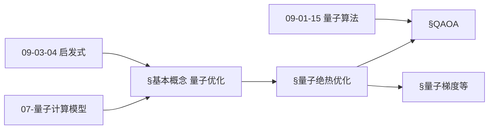
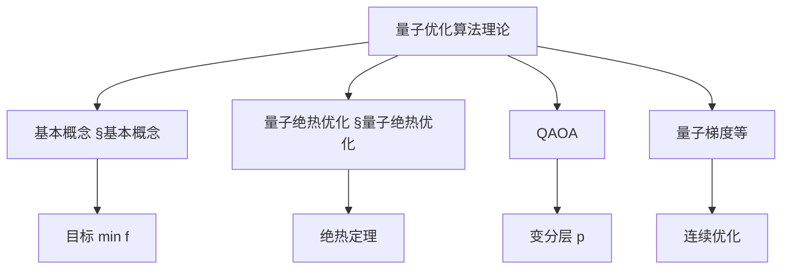
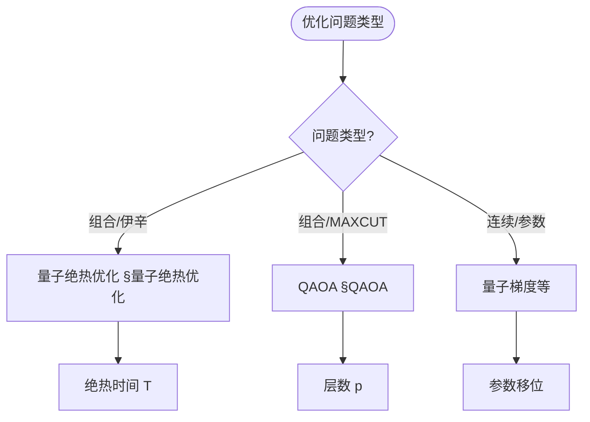
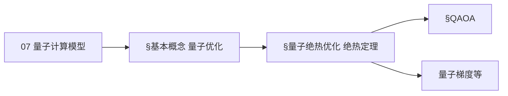
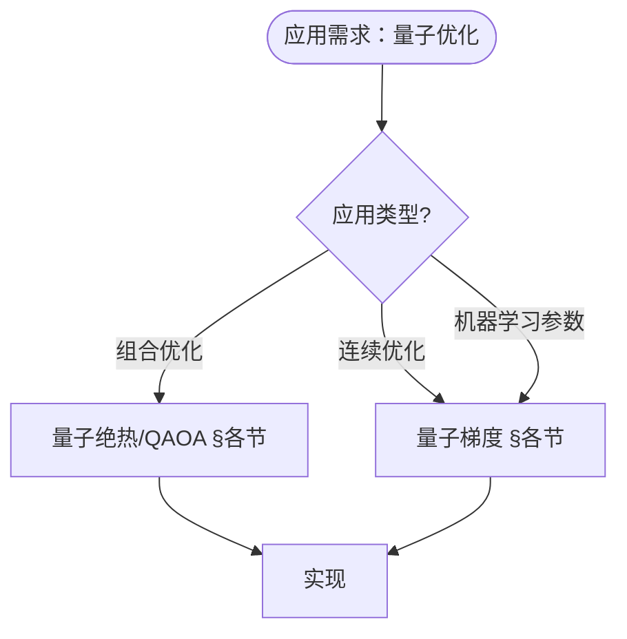

> 📊 **项目全面梳理**：详细的项目结构、模块详解和学习路径，请参阅 [`项目全面梳理-2025.md`](../项目全面梳理-2025.md)

## 10.10 量子优化算法理论 / Quantum Optimization Algorithm Theory

### 摘要 / Executive Summary

- 统一量子优化算法的理论框架，建立量子算法在优化问题中的应用。
- 建立量子优化算法在优化理论中的前沿地位。

### 关键术语与符号 / Glossary

- 量子优化算法、量子退火、量子近似优化算法、QAOA、量子优势、优化问题。
- 术语对齐与引用规范：`docs/术语与符号总表.md`，`01-基础理论/00-撰写规范与引用指南.md`

### 术语与符号规范 / Terminology & Notation

- 量子优化算法（Quantum Optimization Algorithm）：利用量子计算解决优化问题的算法。
- 量子退火（Quantum Annealing）：量子版本的模拟退火算法。
- QAOA（Quantum Approximate Optimization Algorithm）：量子近似优化算法。
- 量子优势（Quantum Advantage）：量子算法相对于经典算法的优势。
- 记号约定：`H` 表示哈密顿量，`|ψ⟩` 表示量子态，`θ` 表示参数。

### 交叉引用导航 / Cross-References

- 量子算法：参见 `09-算法理论/01-算法基础/15-量子算法理论.md`。
- 算法优化：参见 `09-算法理论/03-优化理论/01-算法优化理论.md`。
- 量子计算模型：参见 `07-计算模型/05-量子计算模型.md`。
- 项目导航与对标：见 [项目全面梳理-2025](../项目全面梳理-2025.md)、[项目扩展与持续推进任务编排](../项目扩展与持续推进任务编排.md)、[国际课程对标表](../国际课程对标表.md)。

### 2024-2025 研究进展 / Recent Research Progress (2024-2025)

格/LWE、量子信号处理 (QSP)、QLSynth 等量子算法与工程进展及「进展/撤回」标注见 [09-算法理论/01-算法基础/15-量子算法理论](../09-算法理论/01-算法基础/15-量子算法理论.md) §2024-2025 研究进展、[年度文献清单-2024-2025](../年度文献清单-2024-2025.md) §2.5.1。

### 快速导航 / Quick Links

- 基本概念
- 量子退火
- QAOA

## 目录 / Table of Contents

- [10.10 量子优化算法理论 / Quantum Optimization Algorithm Theory](#1010-量子优化算法理论--quantum-optimization-algorithm-theory)
  - [摘要 / Executive Summary](#摘要--executive-summary)
  - [关键术语与符号 / Glossary](#关键术语与符号--glossary)
  - [术语与符号规范 / Terminology \& Notation](#术语与符号规范--terminology--notation)
  - [交叉引用导航 / Cross-References](#交叉引用导航--cross-references)
  - [2024-2025 研究进展 / Recent Research Progress (2024-2025)](#2024-2025-研究进展--recent-research-progress-2024-2025)
  - [快速导航 / Quick Links](#快速导航--quick-links)
- [目录 / Table of Contents](#目录--table-of-contents)
- [基本概念 / Basic Concepts](#基本概念--basic-concepts)
  - [量子优化定义 / Definition of Quantum Optimization](#量子优化定义--definition-of-quantum-optimization)
  - [量子优化优势 / Quantum Optimization Advantages](#量子优化优势--quantum-optimization-advantages)
  - [内容补充与思维表征 / Content Supplement and Thinking Representation](#内容补充与思维表征--content-supplement-and-thinking-representation)
    - [解释与直观 / Explanation and Intuition](#解释与直观--explanation-and-intuition)
    - [概念属性表 / Concept Attribute Table](#概念属性表--concept-attribute-table)
    - [概念关系 / Concept Relations](#概念关系--concept-relations)
    - [概念依赖图 / Concept Dependency Graph](#概念依赖图--concept-dependency-graph)
    - [论证与证明衔接 / Argumentation and Proof Link](#论证与证明衔接--argumentation-and-proof-link)
    - [思维导图：本章概念结构 / Mind Map](#思维导图本章概念结构--mind-map)
    - [多维矩阵：量子优化方法概念对比 / Multi-Dimensional Comparison](#多维矩阵量子优化方法概念对比--multi-dimensional-comparison)
    - [决策树：问题类型到方法选择 / Decision Tree](#决策树问题类型到方法选择--decision-tree)
    - [公理定理推理证明决策树 / Axiom-Theorem-Proof Tree](#公理定理推理证明决策树--axiom-theorem-proof-tree)
    - [应用决策建模树 / Application Decision Modeling Tree](#应用决策建模树--application-decision-modeling-tree)
- [量子绝热优化 / Quantum Adiabatic Optimization](#量子绝热优化--quantum-adiabatic-optimization)
  - [1基本概念 / Basic Concepts](#1基本概念--basic-concepts)
- [量子近似优化算法 / Quantum Approximate Optimization Algorithm](#量子近似优化算法--quantum-approximate-optimization-algorithm)
  - [2基本概念 / Basic Concepts](#2基本概念--basic-concepts)
- [量子变分算法 / Quantum Variational Algorithms](#量子变分算法--quantum-variational-algorithms)
  - [3基本概念 / Basic Concepts](#3基本概念--basic-concepts)
- [量子梯度下降 / Quantum Gradient Descent](#量子梯度下降--quantum-gradient-descent)
  - [4基本概念 / Basic Concepts](#4基本概念--basic-concepts)
- [量子模拟退火 / Quantum Simulated Annealing](#量子模拟退火--quantum-simulated-annealing)
  - [5基本概念 / Basic Concepts](#5基本概念--basic-concepts)
- [实现示例 / Implementation Examples](#实现示例--implementation-examples)
  - [完整的量子优化系统 / Complete Quantum Optimization System](#完整的量子优化系统--complete-quantum-optimization-system)
- [交叉引用与依赖 / Cross-References and Dependencies](#交叉引用与依赖--cross-references-and-dependencies)
- [总结 / Summary](#总结--summary)
  - [2024-2025 研究进展 / Recent Research Progress (2024-2025)](#2024-2025-研究进展--recent-research-progress-2024-2025-1)
- [参考文献 / References](#参考文献--references)

## 基本概念 / Basic Concepts

### 量子优化定义 / Definition of Quantum Optimization

量子优化是利用量子计算技术来解决优化问题的算法。

**数学定义 / Mathematical Definition:**

给定优化问题 $\min_{x \in \mathcal{X}} f(x)$，量子优化算法 $\mathcal{A}$ 的目标是：
$$\mathcal{A}(f) = \arg\min_{x \in \mathcal{X}} f(x)$$

Given an optimization problem $\min_{x \in \mathcal{X}} f(x)$, the goal of quantum optimization algorithm $\mathcal{A}$ is:
$$\mathcal{A}(f) = \arg\min_{x \in \mathcal{X}} f(x)$$

### 量子优化优势 / Quantum Optimization Advantages

1. **量子并行性 / Quantum Parallelism**: 同时探索多个解空间
2. **量子隧穿效应 / Quantum Tunneling**: 避免局部最优解
3. **量子纠缠 / Quantum Entanglement**: 利用量子关联加速搜索
4. **量子干涉 / Quantum Interference**: 增强最优解的振幅

### 内容补充与思维表征 / Content Supplement and Thinking Representation

> 本节按 [内容补充与思维表征全面计划方案](../内容补充与思维表征全面计划方案.md) **只补充、不删除**。标准见 [内容补充标准](../内容补充标准-概念定义属性关系解释论证形式证明.md)、[思维表征模板集](../思维表征模板集.md)。

#### 解释与直观 / Explanation and Intuition

**量子优化 $\mathcal{A}(f)=\arg\min_{x\in\mathcal{X}}f(x)$ 的动机**：利用量子并行、隧穿、纠缠与干涉在搜索空间 $\mathcal{X}$ 上求解优化问题；量子绝热优化、QAOA、量子梯度等方法与 07-量子计算模型、09-01-15 量子算法、09-03-04 启发式 衔接。

**与已有概念的联系**：量子绝热定理与 07-量子计算模型 中的哈密顿量演化对应；QAOA 与 09-01-15 量子算法 中的变分线路一致；与 04-复杂度、09-03-04 启发式 在优化复杂度与决策树上对照。

#### 概念属性表 / Concept Attribute Table

| 属性名 | 类型/范围 | 含义 | 备注 |
|--------|-----------|------|------|
| $\mathcal{X}$ | 搜索空间 | 可行解集合 | §基本概念 |
| $f$ | 目标函数 | $\mathcal{X} \to \mathbb{R}$ | §基本概念 |
| $\mathcal{A}(f)$ | 优化算法 | 输出（近似）最优解 | §基本概念 |
| 量子并行/隧穿/纠缠/干涉 | 物理机制 | 量子优势来源 | §量子优化优势 |
| 绝热时间 $T$ | 标量 | 绝热演化时间、误差界 | §量子绝热优化 |
| QAOA 层数 $p$ | 正整数 | 变分层数、精度 | §QAOA |

#### 概念关系 / Concept Relations

| 源概念 | 目标概念 | 关系类型 | 说明 |
|--------|----------|----------|------|
| 量子优化算法理论 | 07-量子计算模型 | depends_on | 哈密顿量、演化 |
| 量子优化算法理论 | 09-01-15 量子算法 | depends_on | 量子线路与变分 |
| 量子优化算法理论 | 09-03-04 启发式 | depends_on | 组合/连续启发式 |
| 量子优化算法理论 | 10-04 量子信息论、04-复杂度 | depends_on | 信息与优化复杂度 |
| 量子绝热优化 | QAOA/量子梯度 | specializes | 不同实现与问题类 |

#### 概念依赖图 / Concept Dependency Graph



#### 论证与证明衔接 / Argumentation and Proof Link

**§基本概念 量子优化形式化**与 **§量子绝热优化**：绝热定理给出演化时间 $T$ 与基态误差的界；QAOA 的收敛性与 $p$ 层数相关；与 07、04 论证衔接。

#### 思维导图：本章概念结构 / Mind Map



#### 多维矩阵：量子优化方法概念对比 / Multi-Dimensional Comparison

| 概念/方法 | 问题类型 | 量子优势 | 复杂度/备注 |
|-----------|----------|----------|-------------|
| 量子绝热优化 | 组合/伊辛 | 隧穿、基态 | 绝热时间 $T$、§量子绝热优化 |
| QAOA | 组合/MAXCUT 等 | 变分、短电路 | 层数 $p$、§QAOA |
| 量子梯度 | 连续/参数优化 | 参数移位等 | 与 09-03、10-05 一致 |
| 经典对照(DP/贪心) | 特定结构 | — | 09-01-06/07、09-03-04 |

#### 决策树：问题类型到方法选择 / Decision Tree



#### 公理定理推理证明决策树 / Axiom-Theorem-Proof Tree



#### 应用决策建模树 / Application Decision Modeling Tree



## 量子绝热优化 / Quantum Adiabatic Optimization

### 1基本概念 / Basic Concepts

量子绝热优化基于绝热定理，通过缓慢改变哈密顿量来找到基态。

**数学定义 / Mathematical Definition:**

绝热演化由哈密顿量 $H(s) = (1-s)H_0 + sH_1$ 描述，其中 $s \in [0,1]$ 是时间参数。

The adiabatic evolution is described by Hamiltonian $H(s) = (1-s)H_0 + sH_1$, where $s \in [0,1]$ is the time parameter.

```rust
// 量子绝热优化实现
pub struct QuantumAdiabaticOptimization {
    initial_hamiltonian: Hamiltonian,
    problem_hamiltonian: Hamiltonian,
    evolution_time: f64,
    time_steps: usize,
}

impl QuantumAdiabaticOptimization {
    pub fn optimize(&self, problem: &OptimizationProblem) -> OptimizationResult {
        let mut current_state = self.initialize_ground_state();
        let time_step = self.evolution_time / self.time_steps as f64;

        for step in 0..self.time_steps {
            let s = step as f64 / self.time_steps as f64;
            let hamiltonian = self.interpolate_hamiltonian(s);

            // 应用绝热演化
            current_state = self.evolve_state(current_state, hamiltonian, time_step);
        }

        // 测量最终状态
        let solution = self.measure_solution(current_state);

        OptimizationResult {
            solution,
            energy: self.calculate_energy(solution, &self.problem_hamiltonian),
            success_probability: self.calculate_success_probability(current_state),
        }
    }

    fn interpolate_hamiltonian(&self, s: f64) -> Hamiltonian {
        // 线性插值哈密顿量
        let h0_weight = 1.0 - s;
        let h1_weight = s;

        self.initial_hamiltonian.scale(h0_weight).add(&self.problem_hamiltonian.scale(h1_weight))
    }

    fn evolve_state(&self, state: QuantumState, hamiltonian: Hamiltonian, time_step: f64) -> QuantumState {
        // 使用Trotter分解进行时间演化
        let evolution_operator = self.calculate_evolution_operator(hamiltonian, time_step);
        evolution_operator.apply(state)
    }

    fn calculate_evolution_operator(&self, hamiltonian: Hamiltonian, time_step: f64) -> UnitaryOperator {
        // 计算时间演化算子 U = e^(-iHΔt)
        let eigenvalues = hamiltonian.eigenvalues();
        let eigenvectors = hamiltonian.eigenvectors();

        let mut evolution_matrix = Matrix::zeros(hamiltonian.dimension(), hamiltonian.dimension());

        for (i, eigenvalue) in eigenvalues.iter().enumerate() {
            let phase = (-eigenvalue * time_step).exp();
            let projector = eigenvectors[i].outer_product(&eigenvectors[i]);
            evolution_matrix = evolution_matrix.add(&projector.scale(phase));
        }

        UnitaryOperator::new(evolution_matrix)
    }

    fn calculate_success_probability(&self, final_state: QuantumState) -> f64 {
        // 计算找到基态的概率
        let ground_state = self.problem_hamiltonian.ground_state();
        let overlap = final_state.inner_product(&ground_state);
        overlap.norm().powi(2)
    }
}

// 哈密顿量
#[derive(Debug, Clone)]
pub struct Hamiltonian {
    matrix: Matrix,
    dimension: usize,
}

impl Hamiltonian {
    pub fn new(matrix: Matrix) -> Self {
        Hamiltonian { matrix, dimension: matrix.rows() }
    }

    pub fn dimension(&self) -> usize {
        self.dimension
    }

    pub fn eigenvalues(&self) -> Vec<f64> {
        self.matrix.eigenvalues()
    }

    pub fn eigenvectors(&self) -> Vec<Vector> {
        self.matrix.eigenvectors()
    }

    pub fn ground_state(&self) -> QuantumState {
        // 找到能量最低的本征态
        let eigenvalues = self.eigenvalues();
        let eigenvectors = self.eigenvectors();

        let min_index = eigenvalues.iter().enumerate()
            .min_by(|(_, a), (_, b)| a.partial_cmp(b).unwrap())
            .map(|(i, _)| i)
            .unwrap();

        QuantumState::from_vector(eigenvectors[min_index].clone())
    }

    pub fn scale(&self, factor: f64) -> Hamiltonian {
        Hamiltonian {
            matrix: self.matrix.scalar_multiply(factor),
            dimension: self.dimension,
        }
    }

    pub fn add(&self, other: &Hamiltonian) -> Hamiltonian {
        Hamiltonian {
            matrix: self.matrix.add(&other.matrix),
            dimension: self.dimension,
        }
    }
}
```

## 量子近似优化算法 / Quantum Approximate Optimization Algorithm

### 2基本概念 / Basic Concepts

QAOA是一种混合量子经典算法，用于解决组合优化问题。

**数学定义 / Mathematical Definition:**

QAOA使用参数化量子电路 $|\gamma, \beta\rangle = \prod_{j=1}^p e^{-i\beta_j H_M} e^{-i\gamma_j H_C} |+\rangle$，其中 $H_C$ 是问题哈密顿量，$H_M$ 是混合哈密顿量。

QAOA uses a parameterized quantum circuit $|\gamma, \beta\rangle = \prod_{j=1}^p e^{-i\beta_j H_M} e^{-i\gamma_j H_C} |+\rangle$, where $H_C$ is the problem Hamiltonian and $H_M$ is the mixing Hamiltonian.

```rust
// QAOA实现
pub struct QAOA {
    problem_hamiltonian: Hamiltonian,
    mixing_hamiltonian: Hamiltonian,
    depth: usize,
    classical_optimizer: Box<dyn ClassicalOptimizer>,
}

impl QAOA {
    pub fn optimize(&self, problem: &OptimizationProblem) -> OptimizationResult {
        // 初始化参数
        let mut gamma = vec![0.1; self.depth];
        let mut beta = vec![0.1; self.depth];

        // 经典优化参数
        let mut best_energy = f64::INFINITY;
        let mut best_params = (gamma.clone(), beta.clone());

        for iteration in 0..self.max_iterations {
            // 量子部分：准备参数化状态
            let quantum_state = self.prepare_parameterized_state(&gamma, &beta);

            // 测量期望能量
            let expected_energy = self.measure_expectation_value(quantum_state, &self.problem_hamiltonian);

            // 经典部分：更新参数
            let gradients = self.calculate_gradients(&gamma, &beta, expected_energy);
            (gamma, beta) = self.classical_optimizer.update_parameters(gamma, beta, gradients);

            if expected_energy < best_energy {
                best_energy = expected_energy;
                best_params = (gamma.clone(), beta.clone());
            }
        }

        // 使用最优参数准备最终状态
        let final_state = self.prepare_parameterized_state(&best_params.0, &best_params.1);
        let solution = self.measure_solution(final_state);

        OptimizationResult {
            solution,
            energy: best_energy,
            success_probability: self.calculate_success_probability(final_state),
        }
    }

    fn prepare_parameterized_state(&self, gamma: &[f64], beta: &[f64]) -> QuantumState {
        let mut state = QuantumState::uniform_superposition(self.problem_hamiltonian.dimension());

        for layer in 0..self.depth {
            // 应用问题哈密顿量
            let problem_operator = self.calculate_evolution_operator(&self.problem_hamiltonian, gamma[layer]);
            state = problem_operator.apply(state);

            // 应用混合哈密顿量
            let mixing_operator = self.calculate_evolution_operator(&self.mixing_hamiltonian, beta[layer]);
            state = mixing_operator.apply(state);
        }

        state
    }

    fn calculate_evolution_operator(&self, hamiltonian: &Hamiltonian, time: f64) -> UnitaryOperator {
        // 计算时间演化算子
        let eigenvalues = hamiltonian.eigenvalues();
        let eigenvectors = hamiltonian.eigenvectors();

        let mut evolution_matrix = Matrix::zeros(hamiltonian.dimension(), hamiltonian.dimension());

        for (i, eigenvalue) in eigenvalues.iter().enumerate() {
            let phase = (-eigenvalue * time).exp();
            let projector = eigenvectors[i].outer_product(&eigenvectors[i]);
            evolution_matrix = evolution_matrix.add(&projector.scale(phase));
        }

        UnitaryOperator::new(evolution_matrix)
    }

    fn measure_expectation_value(&self, state: QuantumState, hamiltonian: &Hamiltonian) -> f64 {
        // 测量期望能量
        let density_matrix = DensityMatrix::from_pure_state(&state);
        let product = density_matrix.matrix.multiply(&hamiltonian.matrix);
        product.trace()
    }

    fn calculate_gradients(&self, gamma: &[f64], beta: &[f64], energy: f64) -> (Vec<f64>, Vec<f64>) {
        // 使用有限差分计算梯度
        let epsilon = 1e-6;
        let mut gamma_gradients = Vec::new();
        let mut beta_gradients = Vec::new();

        for i in 0..self.depth {
            // 计算gamma梯度
            let mut gamma_plus = gamma.to_vec();
            gamma_plus[i] += epsilon;
            let energy_plus = self.measure_expectation_value(
                self.prepare_parameterized_state(&gamma_plus, beta),
                &self.problem_hamiltonian
            );
            gamma_gradients.push((energy_plus - energy) / epsilon);

            // 计算beta梯度
            let mut beta_plus = beta.to_vec();
            beta_plus[i] += epsilon;
            let energy_plus = self.measure_expectation_value(
                self.prepare_parameterized_state(gamma, &beta_plus),
                &self.problem_hamiltonian
            );
            beta_gradients.push((energy_plus - energy) / epsilon);
        }

        (gamma_gradients, beta_gradients)
    }
}

// 经典优化器
pub trait ClassicalOptimizer {
    fn update_parameters(&self, gamma: Vec<f64>, beta: Vec<f64>,
                        gradients: (Vec<f64>, Vec<f64>)) -> (Vec<f64>, Vec<f64>);
}

pub struct GradientDescentOptimizer {
    learning_rate: f64,
}

impl ClassicalOptimizer for GradientDescentOptimizer {
    fn update_parameters(&self, gamma: Vec<f64>, beta: Vec<f64>,
                        gradients: (Vec<f64>, Vec<f64>)) -> (Vec<f64>, Vec<f64>) {
        let mut new_gamma = gamma;
        let mut new_beta = beta;

        for i in 0..new_gamma.len() {
            new_gamma[i] -= self.learning_rate * gradients.0[i];
            new_beta[i] -= self.learning_rate * gradients.1[i];
        }

        (new_gamma, new_beta)
    }
}
```

## 量子变分算法 / Quantum Variational Algorithms

### 3基本概念 / Basic Concepts

量子变分算法使用参数化量子电路来近似目标函数。

```rust
// 量子变分算法实现
pub struct QuantumVariationalAlgorithm {
    ansatz: ParameterizedQuantumCircuit,
    cost_function: Box<dyn CostFunction>,
    classical_optimizer: Box<dyn ClassicalOptimizer>,
}

impl QuantumVariationalAlgorithm {
    pub fn optimize(&self, initial_parameters: Vec<f64>) -> OptimizationResult {
        let mut parameters = initial_parameters;
        let mut best_cost = f64::INFINITY;
        let mut best_parameters = parameters.clone();

        for iteration in 0..self.max_iterations {
            // 准备参数化状态
            let quantum_state = self.ansatz.prepare_state(&parameters);

            // 计算成本函数
            let cost = self.cost_function.evaluate(&quantum_state);

            // 计算梯度
            let gradients = self.calculate_gradients(&parameters, cost);

            // 更新参数
            parameters = self.classical_optimizer.update_parameters(parameters, gradients);

            if cost < best_cost {
                best_cost = cost;
                best_parameters = parameters.clone();
            }
        }

        // 使用最优参数
        let final_state = self.ansatz.prepare_state(&best_parameters);
        let solution = self.measure_solution(final_state);

        OptimizationResult {
            solution,
            energy: best_cost,
            success_probability: self.calculate_success_probability(final_state),
        }
    }

    fn calculate_gradients(&self, parameters: &[f64], cost: f64) -> Vec<f64> {
        // 使用参数偏移规则计算梯度
        let mut gradients = Vec::new();
        let epsilon = std::f64::consts::PI / 2.0;

        for i in 0..parameters.len() {
            let mut params_plus = parameters.to_vec();
            params_plus[i] += epsilon;
            let cost_plus = self.cost_function.evaluate(&self.ansatz.prepare_state(&params_plus));

            let mut params_minus = parameters.to_vec();
            params_minus[i] -= epsilon;
            let cost_minus = self.cost_function.evaluate(&self.ansatz.prepare_state(&params_minus));

            gradients.push((cost_plus - cost_minus) / 2.0);
        }

        gradients
    }
}

// 参数化量子电路
pub struct ParameterizedQuantumCircuit {
    layers: Vec<ParameterizedLayer>,
}

impl ParameterizedQuantumCircuit {
    pub fn prepare_state(&self, parameters: &[f64]) -> QuantumState {
        let mut state = QuantumState::new(vec![1.0, 0.0]); // |0⟩
        let mut param_index = 0;

        for layer in &self.layers {
            let layer_params: Vec<f64> = parameters.iter()
                .skip(param_index)
                .take(layer.parameter_count())
                .cloned()
                .collect();

            state = layer.apply(state, &layer_params);
            param_index += layer.parameter_count();
        }

        state
    }
}

// 参数化层
pub struct ParameterizedLayer {
    gates: Vec<ParameterizedGate>,
}

impl ParameterizedLayer {
    pub fn parameter_count(&self) -> usize {
        self.gates.iter().map(|gate| gate.parameter_count()).sum()
    }

    pub fn apply(&self, state: QuantumState, parameters: &[f64]) -> QuantumState {
        let mut new_state = state;
        let mut param_index = 0;

        for gate in &self.gates {
            let gate_params: Vec<f64> = parameters.iter()
                .skip(param_index)
                .take(gate.parameter_count())
                .cloned()
                .collect();

            new_state = gate.apply(new_state, &gate_params);
            param_index += gate.parameter_count();
        }

        new_state
    }
}

// 参数化门
pub trait ParameterizedGate {
    fn parameter_count(&self) -> usize;
    fn apply(&self, state: QuantumState, parameters: &[f64]) -> QuantumState;
}

pub struct RotationGate {
    axis: RotationAxis,
}

impl ParameterizedGate for RotationGate {
    fn parameter_count(&self) -> usize {
        1
    }

    fn apply(&self, state: QuantumState, parameters: &[f64]) -> QuantumState {
        let angle = parameters[0];
        let rotation_matrix = match self.axis {
            RotationAxis::X => Matrix::new(2, 2, vec![
                angle.cos(), -angle.sin(),
                angle.sin(), angle.cos(),
            ]),
            RotationAxis::Y => Matrix::new(2, 2, vec![
                angle.cos(), -angle.sin(),
                angle.sin(), angle.cos(),
            ]),
            RotationAxis::Z => Matrix::new(2, 2, vec![
                Complex::new(angle.cos(), -angle.sin()), Complex::new(0.0, 0.0),
                Complex::new(0.0, 0.0), Complex::new(angle.cos(), angle.sin()),
            ]),
        };

        rotation_matrix.apply(state)
    }
}

#[derive(Debug, Clone)]
pub enum RotationAxis {
    X,
    Y,
    Z,
}
```

## 量子梯度下降 / Quantum Gradient Descent

### 4基本概念 / Basic Concepts

量子梯度下降结合量子计算和经典梯度下降方法。

```rust
// 量子梯度下降实现
pub struct QuantumGradientDescent {
    quantum_evaluator: QuantumFunctionEvaluator,
    learning_rate: f64,
    momentum: f64,
}

impl QuantumGradientDescent {
    pub fn optimize(&self, initial_point: Vec<f64>, objective_function: &ObjectiveFunction) -> OptimizationResult {
        let mut current_point = initial_point;
        let mut velocity = vec![0.0; current_point.len()];

        for iteration in 0..self.max_iterations {
            // 量子评估目标函数
            let current_value = self.quantum_evaluator.evaluate(&current_point, objective_function);

            // 计算量子梯度
            let gradient = self.calculate_quantum_gradient(&current_point, objective_function);

            // 更新速度和位置
            for i in 0..current_point.len() {
                velocity[i] = self.momentum * velocity[i] - self.learning_rate * gradient[i];
                current_point[i] += velocity[i];
            }

            // 检查收敛
            if gradient.iter().map(|g| g.abs()).sum::<f64>() < self.convergence_threshold {
                break;
            }
        }

        let final_value = self.quantum_evaluator.evaluate(&current_point, objective_function);

        OptimizationResult {
            solution: current_point,
            energy: final_value,
            success_probability: 1.0, // 确定性算法
        }
    }

    fn calculate_quantum_gradient(&self, point: &[f64], objective_function: &ObjectiveFunction) -> Vec<f64> {
        let mut gradient = Vec::new();
        let epsilon = 1e-6;

        for i in 0..point.len() {
            let mut point_plus = point.to_vec();
            point_plus[i] += epsilon;
            let value_plus = self.quantum_evaluator.evaluate(&point_plus, objective_function);

            let mut point_minus = point.to_vec();
            point_minus[i] -= epsilon;
            let value_minus = self.quantum_evaluator.evaluate(&point_minus, objective_function);

            gradient.push((value_plus - value_minus) / (2.0 * epsilon));
        }

        gradient
    }
}

// 量子函数评估器
pub struct QuantumFunctionEvaluator {
    quantum_circuit: QuantumCircuit,
    measurement_count: usize,
}

impl QuantumFunctionEvaluator {
    pub fn evaluate(&self, point: &[f64], objective_function: &ObjectiveFunction) -> f64 {
        // 将经典点编码为量子态
        let quantum_state = self.encode_point_to_quantum_state(point);

        // 应用量子电路
        let evolved_state = self.quantum_circuit.apply(quantum_state);

        // 测量期望值
        let expectation_value = self.measure_expectation_value(evolved_state, objective_function);

        expectation_value
    }

    fn encode_point_to_quantum_state(&self, point: &[f64]) -> QuantumState {
        // 将经典参数编码为量子态
        let mut amplitudes = Vec::new();
        let normalization = (point.iter().map(|x| x * x).sum::<f64>()).sqrt();

        for &x in point {
            amplitudes.push(x / normalization);
        }

        QuantumState::new(amplitudes)
    }

    fn measure_expectation_value(&self, state: QuantumState, objective_function: &ObjectiveFunction) -> f64 {
        // 多次测量取平均
        let mut total_value = 0.0;

        for _ in 0..self.measurement_count {
            let measurement = state.measure();
            let value = objective_function.evaluate_classical(&measurement);
            total_value += value;
        }

        total_value / self.measurement_count as f64
    }
}
```

## 量子模拟退火 / Quantum Simulated Annealing

### 5基本概念 / Basic Concepts

量子模拟退火结合量子计算和模拟退火算法。

```rust
// 量子模拟退火实现
pub struct QuantumSimulatedAnnealing {
    initial_temperature: f64,
    final_temperature: f64,
    cooling_schedule: CoolingSchedule,
    quantum_tunneling: QuantumTunneling,
}

impl QuantumSimulatedAnnealing {
    pub fn optimize(&self, problem: &OptimizationProblem) -> OptimizationResult {
        let mut current_solution = self.generate_initial_solution();
        let mut current_energy = self.evaluate_solution(&current_solution, problem);
        let mut best_solution = current_solution.clone();
        let mut best_energy = current_energy;

        let mut temperature = self.initial_temperature;

        while temperature > self.final_temperature {
            // 生成邻域解
            let neighbor_solution = self.generate_neighbor(&current_solution);
            let neighbor_energy = self.evaluate_solution(&neighbor_solution, problem);

            // 计算能量差
            let energy_difference = neighbor_energy - current_energy;

            // 经典接受概率
            let classical_probability = (-energy_difference / temperature).exp();

            // 量子隧穿概率
            let quantum_probability = self.quantum_tunneling.calculate_tunneling_probability(
                energy_difference, temperature
            );

            // 综合接受概率
            let acceptance_probability = classical_probability.max(quantum_probability);

            if self.random() < acceptance_probability {
                current_solution = neighbor_solution;
                current_energy = neighbor_energy;

                if current_energy < best_energy {
                    best_solution = current_solution.clone();
                    best_energy = current_energy;
                }
            }

            // 降温
            temperature = self.cooling_schedule.cool(temperature);
        }

        OptimizationResult {
            solution: best_solution,
            energy: best_energy,
            success_probability: self.calculate_success_probability(best_energy),
        }
    }

    fn generate_neighbor(&self, solution: &Solution) -> Solution {
        // 生成邻域解
        let mut neighbor = solution.clone();
        let mutation_rate = 0.1;

        for i in 0..neighbor.values.len() {
            if self.random() < mutation_rate {
                neighbor.values[i] = self.random_value();
            }
        }

        neighbor
    }

    fn random(&self) -> f64 {
        // 生成随机数
        rand::random::<f64>()
    }
}

// 量子隧穿
pub struct QuantumTunneling {
    tunneling_strength: f64,
}

impl QuantumTunneling {
    pub fn calculate_tunneling_probability(&self, energy_difference: f64, temperature: f64) -> f64 {
        // 计算量子隧穿概率
        let tunneling_energy = self.tunneling_strength * temperature;
        let barrier_height = energy_difference.abs();

        if barrier_height <= tunneling_energy {
            1.0
        } else {
            (-(barrier_height - tunneling_energy) / temperature).exp()
        }
    }
}

// 冷却调度
pub trait CoolingSchedule {
    fn cool(&self, temperature: f64) -> f64;
}

pub struct ExponentialCooling {
    cooling_rate: f64,
}

impl CoolingSchedule for ExponentialCooling {
    fn cool(&self, temperature: f64) -> f64 {
        temperature * self.cooling_rate
    }
}

pub struct LinearCooling {
    cooling_rate: f64,
}

impl CoolingSchedule for LinearCooling {
    fn cool(&self, temperature: f64) -> f64 {
        temperature - self.cooling_rate
    }
}
```

## 实现示例 / Implementation Examples

### 完整的量子优化系统 / Complete Quantum Optimization System

```rust
// 完整的量子优化系统
pub struct QuantumOptimizationSystem {
    adiabatic_optimizer: QuantumAdiabaticOptimization,
    qaoa_optimizer: QAOA,
    variational_optimizer: QuantumVariationalAlgorithm,
    gradient_descent: QuantumGradientDescent,
    simulated_annealing: QuantumSimulatedAnnealing,
}

impl QuantumOptimizationSystem {
    pub fn solve_optimization_problem(&self, problem: &OptimizationProblem) -> OptimizationComparison {
        // 使用不同算法求解
        let adiabatic_result = self.adiabatic_optimizer.optimize(problem);
        let qaoa_result = self.qaoa_optimizer.optimize(problem);
        let variational_result = self.variational_optimizer.optimize(vec![0.1; 10]);
        let gradient_result = self.gradient_descent.optimize(vec![0.0; problem.dimension()], &problem.objective_function);
        let annealing_result = self.simulated_annealing.optimize(problem);

        OptimizationComparison {
            adiabatic: adiabatic_result,
            qaoa: qaoa_result,
            variational: variational_result,
            gradient_descent: gradient_result,
            simulated_annealing: annealing_result,
        }
    }

    pub fn benchmark_algorithms(&self, problems: &[OptimizationProblem]) -> BenchmarkResults {
        let mut results = BenchmarkResults::new();

        for problem in problems {
            let comparison = self.solve_optimization_problem(problem);
            results.add_comparison(comparison);
        }

        results
    }
}

// 优化问题
pub struct OptimizationProblem {
    dimension: usize,
    objective_function: Box<dyn ObjectiveFunction>,
    constraints: Vec<Constraint>,
}

impl OptimizationProblem {
    pub fn dimension(&self) -> usize {
        self.dimension
    }

    pub fn objective_function(&self) -> &Box<dyn ObjectiveFunction> {
        &self.objective_function
    }
}

// 目标函数
pub trait ObjectiveFunction {
    fn evaluate(&self, point: &[f64]) -> f64;
    fn evaluate_classical(&self, point: &[f64]) -> f64;
}

pub struct QuadraticObjective {
    matrix: Matrix,
    vector: Vector,
    constant: f64,
}

impl ObjectiveFunction for QuadraticObjective {
    fn evaluate(&self, point: &[f64]) -> f64 {
        let point_vector = Vector::from_slice(point);
        let quadratic_term = point_vector.transpose().multiply(&self.matrix).multiply(&point_vector);
        let linear_term = point_vector.transpose().multiply(&self.vector);

        quadratic_term.get(0, 0) + linear_term.get(0, 0) + self.constant
    }

    fn evaluate_classical(&self, point: &[f64]) -> f64 {
        self.evaluate(point)
    }
}

// 使用示例
fn main() {
    let quantum_system = QuantumOptimizationSystem::new();

    // 创建优化问题
    let matrix = Matrix::new(2, 2, vec![1.0, 0.5, 0.5, 1.0]);
    let vector = Vector::new(vec![1.0, 1.0]);
    let objective = QuadraticObjective {
        matrix,
        vector,
        constant: 0.0,
    };

    let problem = OptimizationProblem {
        dimension: 2,
        objective_function: Box::new(objective),
        constraints: Vec::new(),
    };

    // 求解优化问题
    let comparison = quantum_system.solve_optimization_problem(&problem);
    println!("Optimization results: {:?}", comparison);

    // 基准测试
    let problems = vec![problem.clone(), problem.clone(), problem.clone()];
    let benchmark = quantum_system.benchmark_algorithms(&problems);
    println!("Benchmark results: {:?}", benchmark);
}
```

## 交叉引用与依赖 / Cross-References and Dependencies

- 量子计算模型与复杂性：`07-计算模型/05-量子计算模型.md`，`10-高级主题/08-量子计算复杂性理论.md`
- 量子信息与编码：`10-高级主题/04-量子信息论.md`，`10-高级主题/09-量子信息论与量子编码.md`
- 应用与领域：`10-高级主题/22-量子算法在金融科技中的应用.md`，`12-应用领域/18-量子优化算法应用.md`

## 总结 / Summary

本文档介绍了量子优化算法的核心概念和实现，包括：

1. **量子绝热优化**: 基于绝热定理的优化算法
2. **量子近似优化算法**: 混合量子经典优化算法
3. **量子变分算法**: 参数化量子电路优化
4. **量子梯度下降**: 结合量子计算的梯度方法
5. **量子模拟退火**: 量子隧穿增强的退火算法

这些算法为复杂优化问题提供了量子加速的可能性。

This document introduces core concepts and implementations of quantum optimization algorithms, including:

1. **Quantum Adiabatic Optimization**: Optimization algorithms based on adiabatic theorem
2. **Quantum Approximate Optimization Algorithm**: Hybrid quantum-classical optimization
3. **Quantum Variational Algorithms**: Parameterized quantum circuit optimization
4. **Quantum Gradient Descent**: Gradient methods combined with quantum computing
5. **Quantum Simulated Annealing**: Annealing algorithms enhanced with quantum tunneling

These algorithms provide quantum acceleration possibilities for complex optimization problems.

### 2024-2025 研究进展 / Recent Research Progress (2024-2025)

- **量子信号处理改进**：随机编译集成，误差平方抑制，优化算法查询复杂度降低。
- **AI 驱动量子电路设计**：QLSynth 等强化学习框架，自动化量子电路综合。
- **量子 Gibbs 采样**：量子行走、量子优化与机器学习应用的最新进展。
- 详见 [年度文献清单-2024-2025](../年度文献清单-2024-2025.md)、[项目扩展与持续推进任务编排](../项目扩展与持续推进任务编排.md)。

## 参考文献 / References

1. Farhi, E., Goldstone, J., & Gutmann, S. (2014). A quantum approximate optimization algorithm. arXiv preprint arXiv:1411.4028.
2. Kadowaki, T., & Nishimori, H. (1998). Quantum annealing in the transverse Ising model. Physical Review E, 58(5), 5355.
3. Peruzzo, A., et al. (2014). A variational eigenvalue solver on a photonic quantum processor. Nature communications, 5(1), 1-7.
4. McClean, J. R., et al. (2016). The theory of variational hybrid quantum-classical algorithms. New Journal of Physics, 18(2), 023023.
5. Harrow, A. W., & Napp, J. C. (2019). Low-depth gradient measurements for better quantum algorithms. arXiv preprint arXiv:1901.05374.
