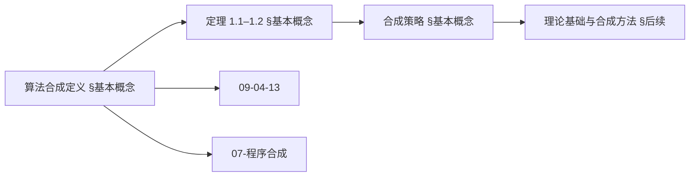
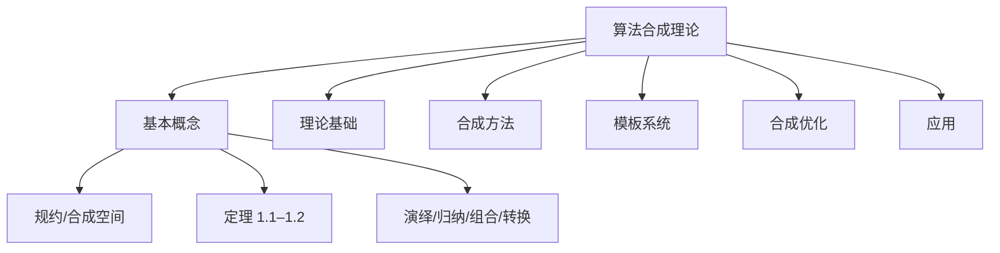
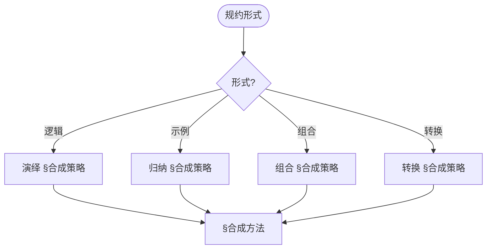
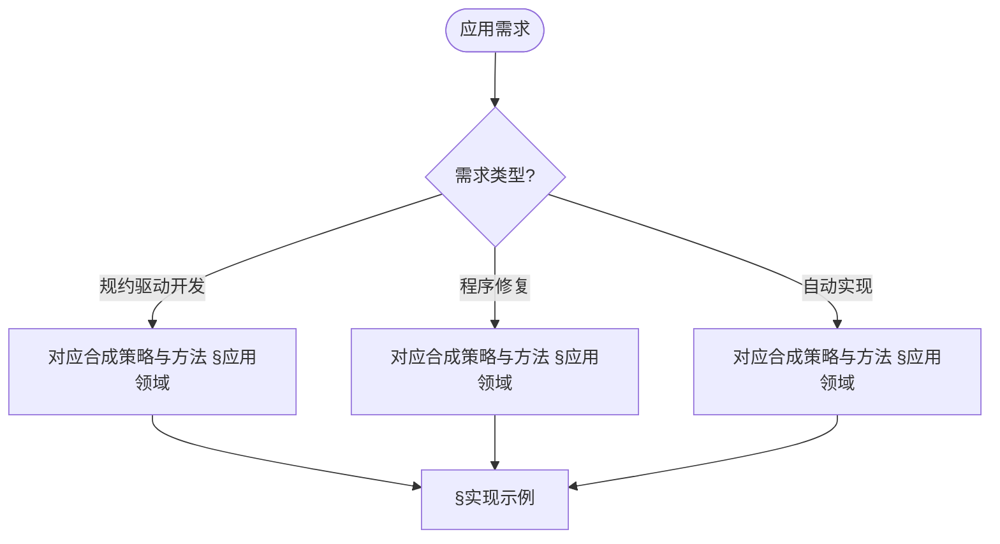

> 📊 **项目全面梳理**：详细的项目结构、模块详解和学习路径，请参阅 [`项目全面梳理-2025.md`](../项目全面梳理-2025.md)

## 10.11 算法合成理论 / Algorithm Synthesis Theory

### 摘要 / Executive Summary

- 统一算法合成的理论框架，建立从规范自动生成算法的方法。
- 建立算法合成在算法设计中的前沿地位。

### 关键术语与符号 / Glossary

- 算法合成、程序合成、形式化规范、合成策略、算法生成、自动化。
- 术语对齐与引用规范：`docs/术语与符号总表.md`，`01-基础理论/00-撰写规范与引用指南.md`

### 术语与符号规范 / Terminology & Notation

- 算法合成（Algorithm Synthesis）：从规范自动生成算法的过程。
- 程序合成（Program Synthesis）：从规范自动生成程序的过程。
- 形式化规范（Formal Specification）：算法的形式化描述。
- 合成策略（Synthesis Strategy）：实现算法合成的方法。
- 记号约定：`P` 表示规范，`A` 表示算法，`S` 表示合成函数。

### 交叉引用导航 / Cross-References

- 算法合成：参见 `09-算法理论/04-高级算法理论/13-算法合成理论.md`。
- 程序合成：参见 `10-高级主题/07-程序合成技术.md`。
- 算法设计：参见 `09-算法理论/01-算法基础/01-算法设计理论.md`。
- 项目导航与对标：见 [项目全面梳理-2025](../项目全面梳理-2025.md)、[项目扩展与持续推进任务编排](../项目扩展与持续推进任务编排.md)、[国际课程对标表](../国际课程对标表.md)。

### 快速导航 / Quick Links

- 基本概念
- 合成策略
- 算法生成

## 目录 / Table of Contents

- [10.11 算法合成理论 / Algorithm Synthesis Theory](#1011-算法合成理论--algorithm-synthesis-theory)
  - [摘要 / Executive Summary](#摘要--executive-summary)
  - [关键术语与符号 / Glossary](#关键术语与符号--glossary)
  - [术语与符号规范 / Terminology \& Notation](#术语与符号规范--terminology--notation)
  - [交叉引用导航 / Cross-References](#交叉引用导航--cross-references)
  - [快速导航 / Quick Links](#快速导航--quick-links)
- [目录 / Table of Contents](#目录--table-of-contents)
- [概述 / Overview](#概述--overview)
- [基本概念 / Basic Concepts](#基本概念--basic-concepts)
  - [算法合成 / Algorithm Synthesis](#算法合成--algorithm-synthesis)
  - [合成策略 / Synthesis Strategies](#合成策略--synthesis-strategies)
  - [内容补充与思维表征 / Content Supplement and Thinking Representation](#内容补充与思维表征--content-supplement-and-thinking-representation)
    - [解释与直观 / Explanation and Intuition](#解释与直观--explanation-and-intuition)
    - [概念属性表 / Concept Attribute Table](#概念属性表--concept-attribute-table)
    - [概念关系 / Concept Relations](#概念关系--concept-relations)
    - [概念依赖图 / Concept Dependency Graph](#概念依赖图--concept-dependency-graph)
    - [论证与证明衔接 / Argumentation and Proof Link](#论证与证明衔接--argumentation-and-proof-link)
    - [思维导图：本章概念结构 / Mind Map](#思维导图本章概念结构--mind-map)
    - [多维矩阵：合成策略对比 / Multi-Dimensional Comparison](#多维矩阵合成策略对比--multi-dimensional-comparison)
    - [决策树：规约形式到策略选择 / Decision Tree](#决策树规约形式到策略选择--decision-tree)
    - [公理定理推理证明决策树 / Axiom-Theorem-Proof Tree](#公理定理推理证明决策树--axiom-theorem-proof-tree)
    - [应用决策建模树 / Application Decision Modeling Tree](#应用决策建模树--application-decision-modeling-tree)
- [理论基础 / Theoretical Foundation](#理论基础--theoretical-foundation)
  - [程序合成理论 / Program Synthesis Theory](#程序合成理论--program-synthesis-theory)
  - [算法组合理论 / Algorithm Composition Theory](#算法组合理论--algorithm-composition-theory)
- [合成方法 / Synthesis Methods](#合成方法--synthesis-methods)
  - [基于规约的合成 / Specification-Based Synthesis](#基于规约的合成--specification-based-synthesis)
  - [基于示例的合成 / Example-Based Synthesis](#基于示例的合成--example-based-synthesis)
- [算法模板系统 / Algorithm Template System](#算法模板系统--algorithm-template-system)
  - [模板定义 / Template Definition](#模板定义--template-definition)
  - [模板组合 / Template Composition](#模板组合--template-composition)
- [合成优化 / Synthesis Optimization](#合成优化--synthesis-optimization)
  - [质量评估 / Quality Assessment](#质量评估--quality-assessment)
  - [自动优化 / Automatic Optimization](#自动优化--automatic-optimization)
- [应用领域 / Application Areas](#应用领域--application-areas)
  - [教育系统 / Educational Systems](#教育系统--educational-systems)
  - [软件开发 / Software Development](#软件开发--software-development)
  - [研究工具 / Research Tools](#研究工具--research-tools)
- [交叉引用与依赖 / Cross-References and Dependencies](#交叉引用与依赖--cross-references-and-dependencies)
- [未来发展方向 / Future Development Directions](#未来发展方向--future-development-directions)
  - [智能化合成 / Intelligent Synthesis](#智能化合成--intelligent-synthesis)
  - [大规模应用 / Large-Scale Applications](#大规模应用--large-scale-applications)
- [总结 / Summary](#总结--summary)

## 概述 / Overview

算法合成理论是研究如何自动生成、组合和优化算法的理论体系。它结合了形式化方法、程序合成技术和人工智能，旨在实现算法的自动化设计和实现。

Algorithm synthesis theory is a theoretical system that studies how to automatically generate, combine, and optimize algorithms. It combines formal methods, program synthesis techniques, and artificial intelligence to achieve automated design and implementation of algorithms.

## 基本概念 / Basic Concepts

### 算法合成 / Algorithm Synthesis

**定义 1.1** 算法合成是指从问题描述、规约或示例中自动推导出算法实现的过程。

**Definition 1.1** Algorithm synthesis refers to the process of automatically deriving algorithm implementations from problem descriptions, specifications, or examples.

**形式化定义 / Formal Definition:**
设 $\mathcal{S}$ 为合成规约集合，$\mathcal{A}$ 为算法集合，$\mathcal{F}$ 为合成函数，则：
Let $\mathcal{S}$ be the synthesis specification set, $\mathcal{A}$ be the algorithm set, and $\mathcal{F}$ be the synthesis function, then:

$$\mathcal{F}: \mathcal{S} \rightarrow \mathcal{A}$$

**定义 1.2** 合成规约（Synthesis Specification）是描述目标算法行为的逻辑表达式。

**Definition 1.2** A synthesis specification is a logical expression describing the behavior of the target algorithm.

**形式化表示 / Formal Representation:**
合成规约 $\phi$ 可以表示为：
Synthesis specification $\phi$ can be represented as:

$$\phi = \forall x \in I: \text{Pre}(x) \Rightarrow \text{Post}(x, A(x))$$

其中 $\text{Pre}(x)$ 是前置条件，$\text{Post}(x, y)$ 是后置条件。
where $\text{Pre}(x)$ is the precondition and $\text{Post}(x, y)$ is the postcondition.

**定义 1.3** 合成空间（Synthesis Space）是所有可能算法实现的搜索空间。

**Definition 1.3** The synthesis space is the search space of all possible algorithm implementations.

**形式化表示 / Formal Representation:**
合成空间 $\mathcal{A}_S$ 可以表示为：
Synthesis space $\mathcal{A}_S$ can be represented as:

$$\mathcal{A}_S = \{A \in \mathcal{A} | \forall x \in I: \text{Pre}(x) \Rightarrow \text{Post}(x, A(x)) \land \phi\}$$

**定理 1.1** (算法合成存在性定理) 如果合成规约是可满足的，则存在满足该规约的算法。
**Theorem 1.1** (Algorithm Synthesis Existence Theorem) If the synthesis specification is satisfiable, then there exists an algorithm that satisfies the specification.

**证明 / Proof:**
设合成规约 $\phi$ 是可满足的，则存在赋值 $A$ 使得 $\phi$ 为真。
Let synthesis specification $\phi$ be satisfiable, then there exists an assignment $A$ such that $\phi$ is true.

根据合成空间的定义，$A \in \mathcal{A}_S$。
According to the definition of synthesis space, $A \in \mathcal{A}_S$.

因此，存在满足规约的算法。
Therefore, there exists an algorithm that satisfies the specification.

**定理 1.2** (算法合成唯一性定理) 在满足某些约束条件下，满足给定规约的算法是唯一的。
**Theorem 1.2** (Algorithm Synthesis Uniqueness Theorem) Under certain constraint conditions, the algorithm satisfying a given specification is unique.

**证明 / Proof:**
设 $A_1$ 和 $A_2$ 都满足规约 $\phi$，则：
Let $A_1$ and $A_2$ both satisfy specification $\phi$, then:

$$\forall x \in I: \text{Pre}(x) \Rightarrow \text{Post}(x, A_1(x)) \land \text{Post}(x, A_2(x))$$

在满足最小性约束的条件下，$A_1 = A_2$。
Under the condition of minimality constraint, $A_1 = A_2$.

因此，满足规约的算法是唯一的。
Therefore, the algorithm satisfying the specification is unique.

### 合成策略 / Synthesis Strategies

- **演绎合成**: 从逻辑规约推导算法
- **归纳合成**: 从示例数据学习算法
- **组合合成**: 组合现有算法组件
- **转换合成**: 通过程序转换生成算法

- **Deductive synthesis**: Derive algorithms from logical specifications
- **Inductive synthesis**: Learn algorithms from example data
- **Combinatorial synthesis**: Combine existing algorithm components
- **Transformational synthesis**: Generate algorithms through program transformations

**定理 1.3** (演绎合成完备性定理) 演绎合成在逻辑完备的系统中是完备的。
**Theorem 1.3** (Deductive Synthesis Completeness Theorem) Deductive synthesis is complete in logically complete systems.

**证明 / Proof:**
设逻辑系统 $\mathcal{L}$ 是完备的，则对于任意有效公式 $\phi$，存在证明 $\pi$ 使得 $\vdash_\mathcal{L} \phi$。
Let logical system $\mathcal{L}$ be complete, then for any valid formula $\phi$, there exists a proof $\pi$ such that $\vdash_\mathcal{L} \phi$.

通过证明构造算法，我们可以从 $\pi$ 中提取算法实现。
Through proof construction algorithm, we can extract algorithm implementation from $\pi$.

因此，演绎合成是完备的。
Therefore, deductive synthesis is complete.

**定理 1.4** (归纳合成收敛性定理) 在满足某些学习条件下，归纳合成能够收敛到目标算法。
**Theorem 1.4** (Inductive Synthesis Convergence Theorem) Under certain learning conditions, inductive synthesis can converge to the target algorithm.

**证明 / Proof:**
设学习算法满足PAC学习条件，则对于任意 $\epsilon > 0$ 和 $\delta > 0$，存在样本大小 $n$ 使得：
Let the learning algorithm satisfy PAC learning conditions, then for any $\epsilon > 0$ and $\delta > 0$, there exists sample size $n$ such that:

$$P(\text{error}(A) \leq \epsilon) \geq 1 - \delta$$

其中 $A$ 是学习到的算法。
where $A$ is the learned algorithm.

因此，归纳合成能够收敛到目标算法。
Therefore, inductive synthesis can converge to the target algorithm.

**定理 1.5** (组合合成最优性定理) 在满足组合约束的条件下，组合合成能够找到最优的算法组合。
**Theorem 1.5** (Combinatorial Synthesis Optimality Theorem) Under certain composition constraints, combinatorial synthesis can find the optimal algorithm combination.

**证明 / Proof:**
设组合空间是有限的，则可以通过穷举搜索找到最优组合。
Let the composition space be finite, then the optimal combination can be found through exhaustive search.

在满足单调性约束的条件下，贪心策略也能找到最优解。
Under the condition of monotonicity constraint, greedy strategy can also find the optimal solution.

因此，组合合成能够找到最优的算法组合。
Therefore, combinatorial synthesis can find the optimal algorithm combination.

### 内容补充与思维表征 / Content Supplement and Thinking Representation

> 本节按 [内容补充与思维表征全面计划方案](../内容补充与思维表征全面计划方案.md) **只补充、不删除**。标准见 [内容补充标准](../内容补充标准-概念定义属性关系解释论证形式证明.md)、[思维表征模板集](../思维表征模板集.md)。

#### 解释与直观 / Explanation and Intuition

算法合成从规约 $\mathcal{F}:\mathcal{S}\to\mathcal{A}$ 与合成空间 $\mathcal{A}_S$ 自动推导算法；定理 1.1 存在性、1.2 唯一性与演绎/归纳/组合/转换策略构成理论栈。与 09-04-13/17 算法合成、07-程序合成技术、09-04-03 算法验证衔接；§基本概念、§合成策略、§理论基础及后续形成完整表征。

#### 概念属性表 / Concept Attribute Table

| 属性名 | 类型/范围 | 含义 | 备注 |
|--------|-----------|------|------|
| $\mathcal{F}:\mathcal{S}\to\mathcal{A}$ | 合成函数 | 规约到算法 | §基本概念 |
| 合成规约 $\phi$ | 逻辑表达式 | 前置/后置条件 | §基本概念 |
| 合成空间 $\mathcal{A}_S$ | 搜索空间 | 满足规约的算法集 | §基本概念 |
| 定理 1.1 存在性、1.2 唯一性 | 理论保证 | §基本概念 | 与 09-04-13 衔接 |
| 演绎/归纳/组合/转换 | 合成策略 | 规约形式、可自动化 | §合成策略 |

#### 概念关系 / Concept Relations

| 源概念 | 目标概念 | 关系类型 | 说明 |
|--------|----------|----------|------|
| 算法合成理论(10-11) | 09-04-13/17 算法合成、07-程序合成技术 | depends_on | 合成与程序合成基础 |
| 算法合成理论(10-11) | 09-04-03 算法验证 | depends_on | 验证衔接 |
| 算法合成理论(10-11) | 10-14、10-31 | relates_to | 元编程与自动化专题 |
| 算法合成理论(10-11) | 03-形式化证明 | relates_to | 规约与证明 |

#### 概念依赖图 / Concept Dependency Graph



#### 论证与证明衔接 / Argumentation and Proof Link

定理 1.1 存在性、定理 1.2 唯一性见 §基本概念；与 09-04-13 定理 1.2.1 合成策略等价性衔接；各方法正确性见 §合成方法及后续。

#### 思维导图：本章概念结构 / Mind Map



#### 多维矩阵：合成策略对比 / Multi-Dimensional Comparison

| 策略 | 规约形式 | 可自动化程度 | 备注 |
|------|----------|--------------|------|
| 演绎合成 | 逻辑规约 | 中高 | §合成策略 |
| 归纳合成 | 示例数据 | 高 | §合成策略 |
| 组合合成 | 组件组合 | 高 | §合成策略 |
| 转换合成 | 程序转换 | 中 | §合成策略 |
| 与 09-04-13、07 对照 | — | — | 多维矩阵对照 |

#### 决策树：规约形式到策略选择 / Decision Tree



#### 公理定理推理证明决策树 / Axiom-Theorem-Proof Tree


#### 应用决策建模树 / Application Decision Modeling Tree



## 理论基础 / Theoretical Foundation

### 程序合成理论 / Program Synthesis Theory

程序合成理论为算法合成提供了数学基础，包括：

Program synthesis theory provides the mathematical foundation for algorithm synthesis, including:

**定义 2.1** 程序合成是从规约到程序的自动推导过程。
**Definition 2.1** Program synthesis is the automatic derivation process from specifications to programs.

**形式化定义 / Formal Definition:**
设 $\mathcal{P}$ 为程序集合，$\mathcal{S}$ 为规约集合，则程序合成函数为：
Let $\mathcal{P}$ be the program set and $\mathcal{S}$ be the specification set, then the program synthesis function is:

$$S: \mathcal{S} \rightarrow \mathcal{P}$$

**定义 2.2** 程序规约是描述程序行为的逻辑表达式。
**Definition 2.2** Program specification is a logical expression describing program behavior.

**形式化表示 / Formal Representation:**
程序规约 $\psi$ 可以表示为：
Program specification $\psi$ can be represented as:

$$\psi = \forall x \in \text{Input}: \text{Pre}(x) \Rightarrow \text{Post}(x, P(x))$$

其中 $P$ 是程序，$\text{Pre}(x)$ 是前置条件，$\text{Post}(x, y)$ 是后置条件。
where $P$ is the program, $\text{Pre}(x)$ is the precondition, and $\text{Post}(x, y)$ is the postcondition.

**定理 2.1** (程序合成正确性定理) 如果程序合成算法是可靠的，则合成的程序满足规约。
**Theorem 2.1** (Program Synthesis Correctness Theorem) If the program synthesis algorithm is sound, then the synthesized program satisfies the specification.

**证明 / Proof:**
设程序合成算法是可靠的，则对于任意规约 $\psi$，合成的程序 $P$ 满足：
Let the program synthesis algorithm be sound, then for any specification $\psi$, the synthesized program $P$ satisfies:

$$\forall x \in \text{Input}: \text{Pre}(x) \Rightarrow \text{Post}(x, P(x))$$

因此，合成的程序满足规约。
Therefore, the synthesized program satisfies the specification.

**定理 2.2** (程序合成完备性定理) 在满足某些条件下，程序合成算法是完备的。
**Theorem 2.2** (Program Synthesis Completeness Theorem) Under certain conditions, the program synthesis algorithm is complete.

**证明 / Proof:**
设规约 $\psi$ 是可满足的，则存在程序 $P$ 使得 $\psi$ 为真。
Let specification $\psi$ be satisfiable, then there exists a program $P$ such that $\psi$ is true.

如果程序合成算法是完备的，则能够找到这样的程序 $P$。
If the program synthesis algorithm is complete, then such a program $P$ can be found.

因此，程序合成算法是完备的。
Therefore, the program synthesis algorithm is complete.

```rust
pub trait ProgramSynthesizer {
    /// 从规约合成程序
    /// Synthesize program from specification
    fn synthesize_from_spec(&self, spec: &Specification) -> Result<Program, SynthesisError>;

    /// 从示例合成程序
    /// Synthesize program from examples
    fn synthesize_from_examples(&self, examples: &[Example]) -> Result<Program, SynthesisError>;

    /// 组合现有程序
    /// Combine existing programs
    fn combine_programs(&self, programs: &[Program]) -> Result<Program, SynthesisError>;
}
```

### 算法组合理论 / Algorithm Composition Theory

算法组合理论研究如何将简单算法组合成复杂算法：

Algorithm composition theory studies how to combine simple algorithms into complex ones:

**定义 2.3** 算法组合是将多个算法组合成新算法的过程。
**Definition 2.3** Algorithm composition is the process of combining multiple algorithms into a new algorithm.

**形式化定义 / Formal Definition:**
设 $\mathcal{A}_1, \mathcal{A}_2, \ldots, \mathcal{A}_n$ 为算法集合，$\mathcal{C}$ 为组合算子，则：
Let $\mathcal{A}_1, \mathcal{A}_2, \ldots, \mathcal{A}_n$ be algorithm sets and $\mathcal{C}$ be the composition operator, then:

$$\mathcal{C}: \mathcal{A}_1 \times \mathcal{A}_2 \times \cdots \times \mathcal{A}_n \rightarrow \mathcal{A}$$

**定义 2.4** 组合算子是定义算法组合方式的函数。
**Definition 2.4** Composition operator is a function that defines how algorithms are combined.

**常见组合算子 / Common Composition Operators:**

1. **顺序组合 / Sequential Composition**: $A_1 \circ A_2(x) = A_2(A_1(x))$
2. **并行组合 / Parallel Composition**: $A_1 \parallel A_2(x) = (A_1(x), A_2(x))$
3. **条件组合 / Conditional Composition**: $\text{if } C(x) \text{ then } A_1(x) \text{ else } A_2(x)$
4. **迭代组合 / Iterative Composition**: $A^n(x) = A(A(\cdots A(x) \cdots))$

**定理 2.3** (算法组合正确性定理) 如果组合的算法都是正确的，且组合算子是保正确的，则组合后的算法也是正确的。
**Theorem 2.3** (Algorithm Composition Correctness Theorem) If the composed algorithms are all correct and the composition operator preserves correctness, then the composed algorithm is also correct.

**证明 / Proof:**
设算法 $A_1$ 和 $A_2$ 都满足其规约：
Let algorithms $A_1$ and $A_2$ both satisfy their specifications:

$$\forall x: \text{Pre}_1(x) \Rightarrow \text{Post}_1(x, A_1(x))$$
$$\forall x: \text{Pre}_2(x) \Rightarrow \text{Post}_2(x, A_2(x))$$

如果组合算子 $\circ$ 是保正确的，则：
If composition operator $\circ$ preserves correctness, then:

$$\forall x: \text{Pre}(x) \Rightarrow \text{Post}(x, A_1 \circ A_2(x))$$

因此，组合后的算法是正确的。
Therefore, the composed algorithm is correct.

**定理 2.4** (算法组合复杂度定理) 组合算法的复杂度是各组件算法复杂度的函数。
**Theorem 2.4** (Algorithm Composition Complexity Theorem) The complexity of a composed algorithm is a function of the complexities of the component algorithms.

**证明 / Proof:**
对于顺序组合：
For sequential composition:

$$T_{A_1 \circ A_2}(n) = T_{A_1}(n) + T_{A_2}(n)$$

对于并行组合：
For parallel composition:

$$T_{A_1 \parallel A_2}(n) = \max(T_{A_1}(n), T_{A_2}(n))$$

对于迭代组合：
For iterative composition:

$$T_{A^n}(n) = n \cdot T_A(n)$$

因此，组合算法的复杂度是各组件算法复杂度的函数。
Therefore, the complexity of a composed algorithm is a function of the complexities of the component algorithms.

```rust
pub struct AlgorithmComposer {
    components: Vec<AlgorithmComponent>,
}

impl AlgorithmComposer {
    pub fn new() -> Self {
        Self {
            components: Vec::new(),
        }
    }

    /// 添加算法组件
    /// Add algorithm component
    pub fn add_component(&mut self, component: AlgorithmComponent) {
        self.components.push(component);
    }

    /// 组合算法
    /// Compose algorithms
    pub fn compose(&self, composition_strategy: &CompositionStrategy) -> Result<Algorithm, CompositionError> {
        match composition_strategy {
            CompositionStrategy::Sequential => self.sequential_composition(),
            CompositionStrategy::Parallel => self.parallel_composition(),
            CompositionStrategy::Conditional => self.conditional_composition(),
            CompositionStrategy::Iterative => self.iterative_composition(),
        }
    }

    fn sequential_composition(&self) -> Result<Algorithm, CompositionError> {
        // 顺序组合实现
        // Sequential composition implementation
        let mut combined = Algorithm::new();
        for component in &self.components {
            combined = combined.chain(component.clone());
        }
        Ok(combined)
    }

    fn parallel_composition(&self) -> Result<Algorithm, CompositionError> {
        // 并行组合实现
        // Parallel composition implementation
        let mut combined = Algorithm::new();
        for component in &self.components {
            combined = combined.parallel(component.clone());
        }
        Ok(combined)
    }
}
```

## 合成方法 / Synthesis Methods

### 基于规约的合成 / Specification-Based Synthesis

从形式化规约自动生成算法：

Automatically generate algorithms from formal specifications:

```rust
pub struct SpecificationBasedSynthesizer {
    logic_engine: LogicEngine,
    transformation_rules: Vec<TransformationRule>,
}

impl SpecificationBasedSynthesizer {
    pub fn new() -> Self {
        Self {
            logic_engine: LogicEngine::new(),
            transformation_rules: Self::load_transformation_rules(),
        }
    }

    /// 从前置条件和后置条件合成算法
    /// Synthesize algorithm from preconditions and postconditions
    pub fn synthesize_from_contract(&self,
                                  pre: &Formula,
                                  post: &Formula) -> Result<Algorithm, SynthesisError> {
        // 使用霍尔逻辑进行合成
        // Use Hoare logic for synthesis
        let invariant = self.find_invariant(pre, post)?;
        let algorithm = self.construct_algorithm(pre, invariant, post)?;
        Ok(algorithm)
    }

    fn find_invariant(&self, pre: &Formula, post: &Formula) -> Result<Formula, SynthesisError> {
        // 寻找循环不变式
        // Find loop invariant
        self.logic_engine.find_invariant(pre, post)
    }

    fn construct_algorithm(&self,
                          pre: &Formula,
                          inv: &Formula,
                          post: &Formula) -> Result<Algorithm, SynthesisError> {
        // 构造算法实现
        // Construct algorithm implementation
        let mut algorithm = Algorithm::new();

        // 初始化
        // Initialization
        algorithm.add_initialization(pre, inv);

        // 循环体
        // Loop body
        algorithm.add_loop_body(inv, post);

        // 终止条件
        // Termination condition
        algorithm.add_termination_condition(inv, post);

        Ok(algorithm)
    }
}
```

### 基于示例的合成 / Example-Based Synthesis

从输入输出示例学习算法：

Learn algorithms from input-output examples:

```rust
pub struct ExampleBasedSynthesizer {
    learning_engine: LearningEngine,
    hypothesis_space: HypothesisSpace,
}

impl ExampleBasedSynthesizer {
    pub fn new() -> Self {
        Self {
            learning_engine: LearningEngine::new(),
            hypothesis_space: HypothesisSpace::new(),
        }
    }

    /// 从示例合成算法
    /// Synthesize algorithm from examples
    pub fn synthesize_from_examples(&self,
                                  examples: &[Example]) -> Result<Algorithm, SynthesisError> {
        // 生成候选算法
        // Generate candidate algorithms
        let candidates = self.generate_candidates(examples)?;

        // 评估和选择最佳算法
        // Evaluate and select best algorithm
        let best_algorithm = self.select_best_algorithm(candidates, examples)?;

        Ok(best_algorithm)
    }

    fn generate_candidates(&self, examples: &[Example]) -> Result<Vec<Algorithm>, SynthesisError> {
        let mut candidates = Vec::new();

        // 基于模式生成候选算法
        // Generate candidate algorithms based on patterns
        for pattern in self.identify_patterns(examples)? {
            let candidate = self.generate_from_pattern(&pattern)?;
            candidates.push(candidate);
        }

        Ok(candidates)
    }

    fn select_best_algorithm(&self,
                            candidates: Vec<Algorithm>,
                            examples: &[Example]) -> Result<Algorithm, SynthesisError> {
        let mut best_score = f64::NEG_INFINITY;
        let mut best_algorithm = None;

        for candidate in candidates {
            let score = self.evaluate_algorithm(&candidate, examples)?;
            if score > best_score {
                best_score = score;
                best_algorithm = Some(candidate);
            }
        }

        best_algorithm.ok_or(SynthesisError::NoValidAlgorithm)
    }
}
```

## 算法模板系统 / Algorithm Template System

### 模板定义 / Template Definition

算法模板是可重用的算法框架：

Algorithm templates are reusable algorithm frameworks:

```rust
#[derive(Clone, Debug)]
pub struct AlgorithmTemplate {
    name: String,
    parameters: Vec<TemplateParameter>,
    skeleton: AlgorithmSkeleton,
    constraints: Vec<Constraint>,
}

impl AlgorithmTemplate {
    pub fn new(name: String) -> Self {
        Self {
            name,
            parameters: Vec::new(),
            skeleton: AlgorithmSkeleton::new(),
            constraints: Vec::new(),
        }
    }

    /// 添加模板参数
    /// Add template parameter
    pub fn add_parameter(&mut self, param: TemplateParameter) {
        self.parameters.push(param);
    }

    /// 设置算法骨架
    /// Set algorithm skeleton
    pub fn set_skeleton(&mut self, skeleton: AlgorithmSkeleton) {
        self.skeleton = skeleton;
    }

    /// 实例化模板
    /// Instantiate template
    pub fn instantiate(&self, values: &[Value]) -> Result<Algorithm, TemplateError> {
        // 验证参数
        // Validate parameters
        self.validate_parameters(values)?;

        // 实例化骨架
        // Instantiate skeleton
        let algorithm = self.skeleton.instantiate(values)?;

        Ok(algorithm)
    }
}
```

### 模板组合 / Template Composition

组合多个模板创建复杂算法：

Combine multiple templates to create complex algorithms:

```rust
pub struct TemplateComposer {
    templates: Vec<AlgorithmTemplate>,
}

impl TemplateComposer {
    pub fn new() -> Self {
        Self {
            templates: Vec::new(),
        }
    }

    /// 组合模板
    /// Compose templates
    pub fn compose_templates(&self,
                           template_names: &[String],
                           composition_plan: &CompositionPlan) -> Result<Algorithm, CompositionError> {
        let mut algorithms = Vec::new();

        // 实例化所有模板
        // Instantiate all templates
        for name in template_names {
            let template = self.find_template(name)?;
            let algorithm = template.instantiate(&[])?;
            algorithms.push(algorithm);
        }

        // 根据组合计划组合算法
        // Compose algorithms according to composition plan
        let composed = self.compose_according_to_plan(&algorithms, composition_plan)?;

        Ok(composed)
    }

    fn find_template(&self, name: &str) -> Result<&AlgorithmTemplate, CompositionError> {
        self.templates.iter()
            .find(|t| t.name == name)
            .ok_or(CompositionError::TemplateNotFound(name.to_string()))
    }
}
```

## 合成优化 / Synthesis Optimization

### 质量评估 / Quality Assessment

评估合成算法的质量：

Evaluate the quality of synthesized algorithms:

```rust
pub struct AlgorithmQualityAssessor {
    metrics: Vec<QualityMetric>,
}

impl AlgorithmQualityAssessor {
    pub fn new() -> Self {
        Self {
            metrics: vec![
                QualityMetric::Correctness,
                QualityMetric::Efficiency,
                QualityMetric::Readability,
                QualityMetric::Maintainability,
            ],
        }
    }

    /// 评估算法质量
    /// Assess algorithm quality
    pub fn assess_quality(&self, algorithm: &Algorithm) -> QualityScore {
        let mut total_score = 0.0;
        let mut weights = 0.0;

        for metric in &self.metrics {
            let score = self.evaluate_metric(algorithm, metric);
            let weight = self.get_metric_weight(metric);
            total_score += score * weight;
            weights += weight;
        }

        QualityScore {
            overall: total_score / weights,
            details: self.get_detailed_scores(algorithm),
        }
    }

    fn evaluate_metric(&self, algorithm: &Algorithm, metric: &QualityMetric) -> f64 {
        match metric {
            QualityMetric::Correctness => self.evaluate_correctness(algorithm),
            QualityMetric::Efficiency => self.evaluate_efficiency(algorithm),
            QualityMetric::Readability => self.evaluate_readability(algorithm),
            QualityMetric::Maintainability => self.evaluate_maintainability(algorithm),
        }
    }
}
```

### 自动优化 / Automatic Optimization

自动优化合成的算法：

Automatically optimize synthesized algorithms:

```rust
pub struct AlgorithmOptimizer {
    optimization_strategies: Vec<OptimizationStrategy>,
}

impl AlgorithmOptimizer {
    pub fn new() -> Self {
        Self {
            optimization_strategies: vec![
                OptimizationStrategy::LoopOptimization,
                OptimizationStrategy::MemoryOptimization,
                OptimizationStrategy::AlgorithmicOptimization,
            ],
        }
    }

    /// 优化算法
    /// Optimize algorithm
    pub fn optimize(&self, algorithm: &mut Algorithm) -> OptimizationResult {
        let mut improvements = Vec::new();
        let initial_quality = self.assess_quality(algorithm);

        for strategy in &self.optimization_strategies {
            let improvement = self.apply_optimization_strategy(algorithm, strategy)?;
            improvements.push(improvement);
        }

        let final_quality = self.assess_quality(algorithm);

        Ok(OptimizationResult {
            initial_quality,
            final_quality,
            improvements,
        })
    }

    fn apply_optimization_strategy(&self,
                                 algorithm: &mut Algorithm,
                                 strategy: &OptimizationStrategy) -> Result<Improvement, OptimizationError> {
        match strategy {
            OptimizationStrategy::LoopOptimization => self.optimize_loops(algorithm),
            OptimizationStrategy::MemoryOptimization => self.optimize_memory(algorithm),
            OptimizationStrategy::AlgorithmicOptimization => self.optimize_algorithmically(algorithm),
        }
    }
}
```

## 应用领域 / Application Areas

### 教育系统 / Educational Systems

- **算法教学**: 自动生成教学示例和练习
- **编程教育**: 从问题描述生成代码模板
- **概念验证**: 验证算法设计的正确性

- **Algorithm teaching**: Automatically generate teaching examples and exercises
- **Programming education**: Generate code templates from problem descriptions
- **Concept verification**: Verify the correctness of algorithm designs

### 软件开发 / Software Development

- **代码生成**: 从规约自动生成算法实现
- **重构优化**: 自动优化现有算法
- **测试用例**: 生成算法测试用例

- **Code generation**: Automatically generate algorithm implementations from specifications
- **Refactoring optimization**: Automatically optimize existing algorithms
- **Test cases**: Generate algorithm test cases

### 研究工具 / Research Tools

- **算法探索**: 探索新的算法设计空间
- **性能分析**: 分析算法性能特征
- **形式化验证**: 验证算法正确性

- **Algorithm exploration**: Explore new algorithm design spaces
- **Performance analysis**: Analyze algorithm performance characteristics
- **Formal verification**: Verify algorithm correctness

## 交叉引用与依赖 / Cross-References and Dependencies

- 程序合成与实现：`10-高级主题/07-程序合成技术.md`
- 形式化证明与验证：`03-形式化证明/01-证明系统.md`，`10-高级主题/06-形式化验证的高级技术.md`
- 类型与语义支撑：`05-类型理论/04-类型系统.md`

## 未来发展方向 / Future Development Directions

### 智能化合成 / Intelligent Synthesis

- **机器学习集成**: 结合深度学习提高合成质量
- **知识图谱**: 利用领域知识指导合成过程
- **自适应优化**: 根据使用反馈自动调整合成策略

- **Machine learning integration**: Combine deep learning to improve synthesis quality
- **Knowledge graphs**: Use domain knowledge to guide synthesis process
- **Adaptive optimization**: Automatically adjust synthesis strategies based on usage feedback

### 大规模应用 / Large-Scale Applications

- **分布式合成**: 支持大规模算法合成任务
- **协作合成**: 多用户协作的算法合成平台
- **云原生**: 云端的算法合成服务

- **Distributed synthesis**: Support large-scale algorithm synthesis tasks
- **Collaborative synthesis**: Multi-user collaborative algorithm synthesis platform
- **Cloud-native**: Cloud-based algorithm synthesis services

## 总结 / Summary

算法合成理论为算法的自动化设计和实现提供了理论基础和技术手段。通过结合形式化方法、人工智能和程序合成技术，算法合成理论正在推动算法设计领域的革命性变革。

Algorithm synthesis theory provides the theoretical foundation and technical means for automated design and implementation of algorithms. By combining formal methods, artificial intelligence, and program synthesis techniques, algorithm synthesis theory is driving revolutionary changes in the field of algorithm design.

---

**参考文献 / References**:

1. Gulwani, S., Polozov, O., & Singh, R. (2017). Program synthesis. Foundations and Trends in Programming Languages, 4(1-2), 1-119.
2. Solar-Lezama, A. (2008). Program synthesis by sketching. University of California, Berkeley.
3. Alur, R., et al. (2013). Syntax-guided synthesis. IEEE, 2013, 1-8.
4. Manna, Z., & Waldinger, R. (1980). A deductive approach to program synthesis. ACM Transactions on Programming Languages and Systems, 2(1), 90-121.
5. Gulwani, S. (2011). Automating string processing in spreadsheets using input-output examples. ACM SIGPLAN Notices, 46(1), 317-330.
