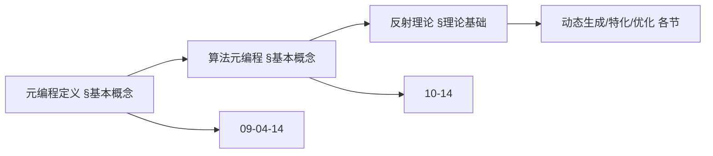
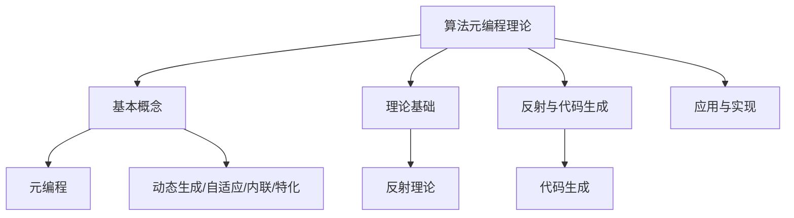
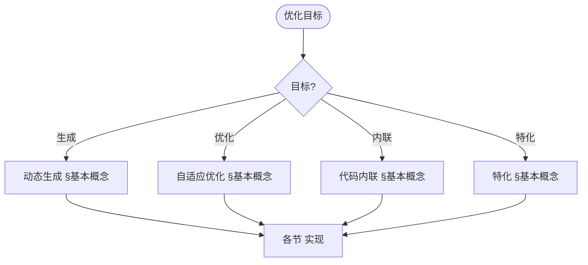
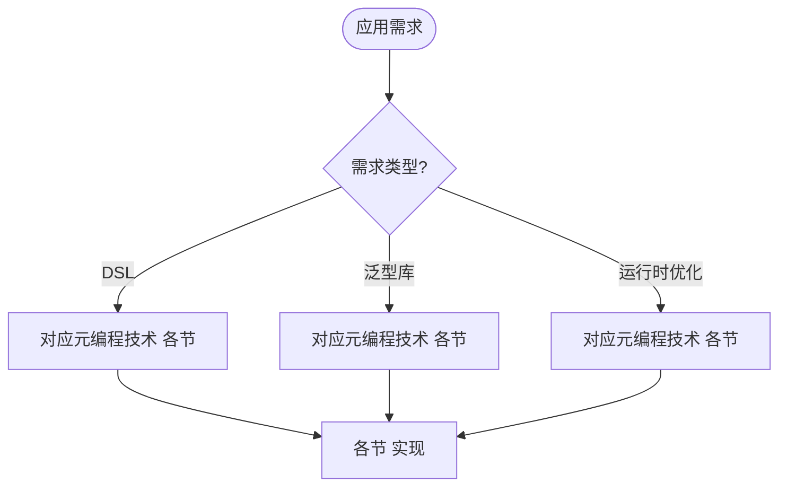

> 📊 **项目全面梳理**：详细的项目结构、模块详解和学习路径，请参阅 [`项目全面梳理-2025.md`](../项目全面梳理-2025.md)

## 10.12 算法元编程理论 / Algorithm Metaprogramming Theory

### 摘要 / Executive Summary

- 统一算法元编程的理论框架，建立编写生成算法的程序的方法。
- 建立算法元编程在算法工程中的前沿地位。

### 关键术语与符号 / Glossary

- 算法元编程、元编程、代码生成、模板元编程、算法生成、反射。
- 术语对齐与引用规范：`docs/术语与符号总表.md`，`01-基础理论/00-撰写规范与引用指南.md`

### 术语与符号规范 / Terminology & Notation

- 算法元编程（Algorithm Metaprogramming）：编写生成算法的程序。
- 元编程（Metaprogramming）：编写生成程序的程序。
- 代码生成（Code Generation）：自动生成代码的过程。
- 模板元编程（Template Metaprogramming）：使用模板进行元编程的技术。
- 记号约定：`M` 表示元程序，`A` 表示生成的算法，`T` 表示模板。

### 交叉引用导航 / Cross-References

- 算法元编程：参见 `09-算法理论/04-高级算法理论/14-算法元编程理论.md`。
- 算法工程：参见 `09-算法理论/04-高级算法理论/02-算法工程理论.md`。
- 程序合成：参见 `10-高级主题/07-程序合成技术.md`。
- 项目导航与对标：见 [项目全面梳理-2025](../项目全面梳理-2025.md)、[项目扩展与持续推进任务编排](../项目扩展与持续推进任务编排.md)、[国际课程对标表](../国际课程对标表.md)。

### 快速导航 / Quick Links

- 基本概念
- 元编程技术
- 代码生成

## 目录 / Table of Contents

- [10.12 算法元编程理论 / Algorithm Metaprogramming Theory](#1012-算法元编程理论--algorithm-metaprogramming-theory)
  - [摘要 / Executive Summary](#摘要--executive-summary)
  - [关键术语与符号 / Glossary](#关键术语与符号--glossary)
  - [术语与符号规范 / Terminology \& Notation](#术语与符号规范--terminology--notation)
  - [交叉引用导航 / Cross-References](#交叉引用导航--cross-references)
  - [快速导航 / Quick Links](#快速导航--quick-links)
- [目录 / Table of Contents](#目录--table-of-contents)
- [概述 / Overview](#概述--overview)
- [基本概念 / Basic Concepts](#基本概念--basic-concepts)
  - [元编程 / Metaprogramming](#元编程--metaprogramming)
  - [算法元编程 / Algorithm Metaprogramming](#算法元编程--algorithm-metaprogramming)
  - [内容补充与思维表征 / Content Supplement and Thinking Representation](#内容补充与思维表征--content-supplement-and-thinking-representation)
    - [解释与直观 / Explanation and Intuition](#解释与直观--explanation-and-intuition)
    - [概念属性表 / Concept Attribute Table](#概念属性表--concept-attribute-table)
    - [概念关系 / Concept Relations](#概念关系--concept-relations)
    - [概念依赖图 / Concept Dependency Graph](#概念依赖图--concept-dependency-graph)
    - [论证与证明衔接 / Argumentation and Proof Link](#论证与证明衔接--argumentation-and-proof-link)
    - [思维导图：本章概念结构 / Mind Map](#思维导图本章概念结构--mind-map)
    - [多维矩阵：元编程技术对比 / Multi-Dimensional Comparison](#多维矩阵元编程技术对比--multi-dimensional-comparison)
    - [决策树：优化目标到技术选择 / Decision Tree](#决策树优化目标到技术选择--decision-tree)
    - [公理定理推理证明决策树 / Axiom-Theorem-Proof Tree](#公理定理推理证明决策树--axiom-theorem-proof-tree)
    - [应用决策建模树 / Application Decision Modeling Tree](#应用决策建模树--application-decision-modeling-tree)
- [理论基础 / Theoretical Foundation](#理论基础--theoretical-foundation)
  - [反射理论 / Reflection Theory](#反射理论--reflection-theory)
  - [代码生成理论 / Code Generation Theory](#代码生成理论--code-generation-theory)
- [动态算法生成 / Dynamic Algorithm Generation](#动态算法生成--dynamic-algorithm-generation)
  - [条件化生成 / Conditional Generation](#条件化生成--conditional-generation)
  - [自适应生成 / Adaptive Generation](#自适应生成--adaptive-generation)
- [算法特化 / Algorithm Specialization](#算法特化--algorithm-specialization)
  - [类型特化 / Type Specialization](#类型特化--type-specialization)
  - [数据特化 / Data Specialization](#数据特化--data-specialization)
- [运行时优化 / Runtime Optimization](#运行时优化--runtime-optimization)
  - [热点检测 / Hotspot Detection](#热点检测--hotspot-detection)
  - [动态重编译 / Dynamic Recompilation](#动态重编译--dynamic-recompilation)
- [应用领域 / Application Areas](#应用领域--application-areas)
  - [高性能计算 / High Performance Computing](#高性能计算--high-performance-computing)
  - [机器学习 / Machine Learning](#机器学习--machine-learning)
  - [游戏开发 / Game Development](#游戏开发--game-development)
- [未来发展方向 / Future Development Directions](#未来发展方向--future-development-directions)
  - [智能化元编程 / Intelligent Metaprogramming](#智能化元编程--intelligent-metaprogramming)
  - [跨平台元编程 / Cross-Platform Metaprogramming](#跨平台元编程--cross-platform-metaprogramming)
- [总结 / Summary](#总结--summary)

## 概述 / Overview

算法元编程理论是研究如何在运行时动态生成、修改和优化算法的理论体系。它结合了反射、代码生成和动态优化技术，使算法能够根据运行时信息进行自适应调整。

Algorithm metaprogramming theory is a theoretical system that studies how to dynamically generate, modify, and optimize algorithms at runtime. It combines reflection, code generation, and dynamic optimization techniques to enable algorithms to adaptively adjust based on runtime information.

## 基本概念 / Basic Concepts

### 元编程 / Metaprogramming

元编程是指程序在运行时生成、修改或操作其他程序代码的能力。

Metaprogramming refers to the ability of programs to generate, modify, or manipulate other program code at runtime.

### 算法元编程 / Algorithm Metaprogramming

算法元编程是元编程在算法领域的应用，包括：

Algorithm metaprogramming is the application of metaprogramming in the field of algorithms, including:

- **动态算法生成**: 根据运行时条件生成算法
- **自适应优化**: 根据性能数据调整算法策略
- **代码内联**: 将函数调用替换为实际代码
- **特化优化**: 为特定数据类型生成优化版本

- **Dynamic algorithm generation**: Generate algorithms based on runtime conditions
- **Adaptive optimization**: Adjust algorithm strategies based on performance data
- **Code inlining**: Replace function calls with actual code
- **Specialization optimization**: Generate optimized versions for specific data types

### 内容补充与思维表征 / Content Supplement and Thinking Representation

> 本节按 [内容补充与思维表征全面计划方案](../内容补充与思维表征全面计划方案.md) **只补充、不删除**。标准见 [内容补充标准](../内容补充标准-概念定义属性关系解释论证形式证明.md)、[思维表征模板集](../思维表征模板集.md)。

#### 解释与直观 / Explanation and Intuition

算法元编程在运行时生成、修改或优化算法；动态算法生成、自适应优化、代码内联、特化优化与反射理论构成技术栈。与 09-04-14/18 算法元编程、09-04-13 算法合成、10-14/21 算法合成与元编程高级理论衔接；§基本概念、§理论基础、各节形成完整表征。

#### 概念属性表 / Concept Attribute Table

| 属性名 | 类型/范围 | 含义 | 备注 |
|--------|-----------|------|------|
| 元编程 | 能力 | 运行时生成/修改/操作代码 | §基本概念 |
| 算法元编程 | 应用 | 动态生成/自适应优化/内联/特化 | §基本概念 |
| 动态算法生成 | 技术 | 根据运行时条件生成算法 | §算法元编程 |
| 反射理论(ReflectiveAlgorithm 等) | 理论基础 | 元信息与代码生成 | §理论基础 |
| 阶段/开销/适用场景 | 度量 | 与各技术相关 | 各节 |

#### 概念关系 / Concept Relations

| 源概念 | 目标概念 | 关系类型 | 说明 |
|--------|----------|----------|------|
| 算法元编程理论(10-12) | 09-04-14/18 算法元编程、09-04-13 算法合成 | depends_on | 元编程与合成基础 |
| 算法元编程理论(10-12) | 10-14、10-21 | relates_to | 高级理论与应用衔接 |
| 算法元编程理论(10-12) | 08-实现 | applies_to | 元编程实践 |

#### 概念依赖图 / Concept Dependency Graph



#### 论证与证明衔接 / Argumentation and Proof Link

元编程与算法元编程定义见 §基本概念；反射与代码生成正确性见 §理论基础；与 09-04-14、10-14 论证衔接。

#### 思维导图：本章概念结构 / Mind Map



#### 多维矩阵：元编程技术对比 / Multi-Dimensional Comparison

| 概念/技术 | 阶段 | 开销 | 适用场景 | 备注 |
|-----------|------|------|----------|------|
| 动态算法生成 | 运行时 | 中 | 条件依赖 | §基本概念 |
| 自适应优化 | 运行时 | 中 | 性能数据驱动 | §基本概念 |
| 代码内联 | 编译/运行时 | 低 | 热路径 | §基本概念 |
| 特化优化 | 编译/运行时 | 中 | 类型特化 | §基本概念 |
| 与 09-04-14 对照 | — | — | — | 多维矩阵对照 |

#### 决策树：优化目标到技术选择 / Decision Tree



#### 公理定理推理证明决策树 / Axiom-Theorem-Proof Tree


#### 应用决策建模树 / Application Decision Modeling Tree



## 理论基础 / Theoretical Foundation

### 反射理论 / Reflection Theory

反射理论为元编程提供了理论基础：

Reflection theory provides the theoretical foundation for metaprogramming:

```rust
pub trait ReflectiveAlgorithm {
    /// 获取算法元信息
    /// Get algorithm metadata
    fn get_metadata(&self) -> AlgorithmMetadata;

    /// 动态修改算法行为
    /// Dynamically modify algorithm behavior
    fn modify_behavior(&mut self, modification: &BehaviorModification);

    /// 生成算法代码
    /// Generate algorithm code
    fn generate_code(&self) -> Result<String, CodeGenerationError>;
}

#[derive(Clone, Debug)]
pub struct AlgorithmMetadata {
    pub name: String,
    pub complexity: ComplexityBounds,
    pub input_types: Vec<TypeInfo>,
    pub output_types: Vec<TypeInfo>,
    pub constraints: Vec<Constraint>,
}
```

### 代码生成理论 / Code Generation Theory

代码生成理论研究如何动态生成可执行代码：

Code generation theory studies how to dynamically generate executable code:

```rust
pub struct CodeGenerator {
    template_engine: TemplateEngine,
    optimization_passes: Vec<OptimizationPass>,
}

impl CodeGenerator {
    pub fn new() -> Self {
        Self {
            template_engine: TemplateEngine::new(),
            optimization_passes: Self::load_optimization_passes(),
        }
    }

    /// 生成算法代码
    /// Generate algorithm code
    pub fn generate_algorithm(&self,
                             spec: &AlgorithmSpec,
                             target_language: &Language) -> Result<String, GenerationError> {
        // 选择代码模板
        // Select code template
        let template = self.select_template(spec, target_language)?;

        // 实例化模板
        // Instantiate template
        let code = self.instantiate_template(template, spec)?;

        // 应用优化
        // Apply optimizations
        let optimized_code = self.apply_optimizations(code)?;

        Ok(optimized_code)
    }

    fn select_template(&self,
                      spec: &AlgorithmSpec,
                      language: &Language) -> Result<CodeTemplate, GenerationError> {
        self.template_engine.select_best_template(spec, language)
    }

    fn instantiate_template(&self,
                           template: CodeTemplate,
                           spec: &AlgorithmSpec) -> Result<String, GenerationError> {
        template.instantiate(spec)
    }

    fn apply_optimizations(&self, code: String) -> Result<String, GenerationError> {
        let mut optimized_code = code;

        for pass in &self.optimization_passes {
            optimized_code = pass.apply(&optimized_code)?;
        }

        Ok(optimized_code)
    }
}
```

## 动态算法生成 / Dynamic Algorithm Generation

### 条件化生成 / Conditional Generation

根据运行时条件生成不同的算法实现：

Generate different algorithm implementations based on runtime conditions:

```rust
pub struct ConditionalAlgorithmGenerator {
    conditions: Vec<GenerationCondition>,
    implementations: HashMap<String, AlgorithmImplementation>,
}

impl ConditionalAlgorithmGenerator {
    pub fn new() -> Self {
        Self {
            conditions: Vec::new(),
            implementations: HashMap::new(),
        }
    }

    /// 添加生成条件
    /// Add generation condition
    pub fn add_condition(&mut self, condition: GenerationCondition) {
        self.conditions.push(condition);
    }

    /// 注册算法实现
    /// Register algorithm implementation
    pub fn register_implementation(&mut self,
                                 name: String,
                                 implementation: AlgorithmImplementation) {
        self.implementations.insert(name, implementation);
    }

    /// 根据条件生成算法
    /// Generate algorithm based on conditions
    pub fn generate(&self, context: &RuntimeContext) -> Result<Algorithm, GenerationError> {
        // 评估所有条件
        // Evaluate all conditions
        for condition in &self.conditions {
            if condition.evaluate(context)? {
                let implementation_name = condition.get_implementation_name();
                if let Some(implementation) = self.implementations.get(&implementation_name) {
                    return Ok(implementation.generate(context));
                }
            }
        }

        Err(GenerationError::NoMatchingImplementation)
    }
}

#[derive(Clone, Debug)]
pub struct GenerationCondition {
    pub predicate: Box<dyn Fn(&RuntimeContext) -> Result<bool, EvaluationError>>,
    pub implementation_name: String,
    pub priority: u32,
}

impl GenerationCondition {
    pub fn new<F>(predicate: F, implementation_name: String, priority: u32) -> Self
    where F: Fn(&RuntimeContext) -> Result<bool, EvaluationError> + 'static {
        Self {
            predicate: Box::new(predicate),
            implementation_name,
            priority,
        }
    }

    pub fn evaluate(&self, context: &RuntimeContext) -> Result<bool, EvaluationError> {
        (self.predicate)(context)
    }

    pub fn get_implementation_name(&self) -> &str {
        &self.implementation_name
    }
}
```

### 自适应生成 / Adaptive Generation

根据性能数据自适应地生成优化算法：

Adaptively generate optimized algorithms based on performance data:

```rust
pub struct AdaptiveAlgorithmGenerator {
    performance_monitor: PerformanceMonitor,
    optimization_engine: OptimizationEngine,
    code_generator: CodeGenerator,
}

impl AdaptiveAlgorithmGenerator {
    pub fn new() -> Self {
        Self {
            performance_monitor: PerformanceMonitor::new(),
            optimization_engine: OptimizationEngine::new(),
            code_generator: CodeGenerator::new(),
        }
    }

    /// 监控算法性能
    /// Monitor algorithm performance
    pub fn monitor_performance(&mut self, algorithm: &Algorithm, input: &Input) -> PerformanceMetrics {
        let start_time = std::time::Instant::now();
        let start_memory = self.get_memory_usage();

        let result = algorithm.execute(input);

        let end_time = std::time::Instant::now();
        let end_memory = self.get_memory_usage();

        let metrics = PerformanceMetrics {
            execution_time: end_time.duration_since(start_time),
            memory_usage: end_memory - start_memory,
            success: result.is_ok(),
        };

        self.performance_monitor.record(metrics.clone());
        metrics
    }

    /// 生成优化算法
    /// Generate optimized algorithm
    pub fn generate_optimized(&mut self,
                             original_algorithm: &Algorithm,
                             target_metrics: &PerformanceTargets) -> Result<Algorithm, GenerationError> {
        // 分析性能瓶颈
        // Analyze performance bottlenecks
        let bottlenecks = self.performance_monitor.analyze_bottlenecks(original_algorithm)?;

        // 生成优化策略
        // Generate optimization strategies
        let strategies = self.optimization_engine.generate_strategies(&bottlenecks)?;

        // 应用优化策略
        // Apply optimization strategies
        let optimized_spec = self.apply_optimization_strategies(original_algorithm, &strategies)?;

        // 生成优化代码
        // Generate optimized code
        let optimized_code = self.code_generator.generate_algorithm(&optimized_spec, &Language::Rust)?;

        // 编译和执行
        // Compile and execute
        self.compile_and_execute(&optimized_code)
    }
}
```

## 算法特化 / Algorithm Specialization

### 类型特化 / Type Specialization

为特定数据类型生成优化的算法版本：

Generate optimized algorithm versions for specific data types:

```rust
pub struct TypeSpecializer {
    specializations: HashMap<TypeId, SpecializedAlgorithm>,
}

impl TypeSpecializer {
    pub fn new() -> Self {
        Self {
            specializations: HashMap::new(),
        }
    }

    /// 特化算法
    /// Specialize algorithm
    pub fn specialize<T: 'static>(&mut self,
                                 generic_algorithm: &GenericAlgorithm) -> Result<&SpecializedAlgorithm, SpecializationError> {
        let type_id = TypeId::of::<T>();

        if let Some(specialized) = self.specializations.get(&type_id) {
            return Ok(specialized);
        }

        // 生成特化版本
        // Generate specialized version
        let specialized = self.generate_specialization::<T>(generic_algorithm)?;
        self.specializations.insert(type_id, specialized);

        Ok(self.specializations.get(&type_id).unwrap())
    }

    fn generate_specialization<T: 'static>(&self,
                                          generic: &GenericAlgorithm) -> Result<SpecializedAlgorithm, SpecializationError> {
        // 分析类型特征
        // Analyze type characteristics
        let type_info = self.analyze_type::<T>();

        // 生成特化代码
        // Generate specialized code
        let specialized_code = self.generate_specialized_code(generic, &type_info)?;

        // 编译特化版本
        // Compile specialized version
        let compiled = self.compile_specialized_code(&specialized_code)?;

        Ok(SpecializedAlgorithm {
            type_info,
            code: specialized_code,
            compiled: compiled,
        })
    }

    fn analyze_type<T: 'static>(&self) -> TypeCharacteristics {
        TypeCharacteristics {
            size: std::mem::size_of::<T>(),
            alignment: std::mem::align_of::<T>(),
            is_copy: std::mem::size_of::<T>() == 0 || std::mem::needs_drop::<T>(),
            is_send: std::marker::Send::marker::<T>(),
            is_sync: std::marker::Sync::marker::<T>(),
        }
    }
}
```

### 数据特化 / Data Specialization

根据数据结构特征特化算法：

Specialize algorithms based on data structure characteristics:

```rust
pub struct DataStructureSpecializer {
    pattern_matcher: PatternMatcher,
    optimization_rules: Vec<OptimizationRule>,
}

impl DataStructureSpecializer {
    pub fn new() -> Self {
        Self {
            pattern_matcher: PatternMatcher::new(),
            optimization_rules: Self::load_optimization_rules(),
        }
    }

    /// 特化排序算法
    /// Specialize sorting algorithm
    pub fn specialize_sorting(&self,
                             data: &[u8],
                             data_type: &DataType) -> Result<SpecializedSorter, SpecializationError> {
        // 分析数据特征
        // Analyze data characteristics
        let characteristics = self.analyze_data_characteristics(data, data_type)?;

        // 匹配优化模式
        // Match optimization patterns
        let patterns = self.pattern_matcher.find_matching_patterns(&characteristics)?;

        // 选择最佳特化策略
        // Select best specialization strategy
        let strategy = self.select_best_strategy(&patterns, &characteristics)?;

        // 生成特化排序器
        // Generate specialized sorter
        let specialized_sorter = self.generate_specialized_sorter(strategy, &characteristics)?;

        Ok(specialized_sorter)
    }

    fn analyze_data_characteristics(&self,
                                   data: &[u8],
                                   data_type: &DataType) -> Result<DataCharacteristics, AnalysisError> {
        let mut characteristics = DataCharacteristics::new();

        // 分析数据分布
        // Analyze data distribution
        characteristics.distribution = self.analyze_distribution(data)?;

        // 分析数据范围
        // Analyze data range
        characteristics.range = self.analyze_range(data, data_type)?;

        // 分析重复性
        // Analyze repetitiveness
        characteristics.repetitiveness = self.analyze_repetitiveness(data)?;

        // 分析局部性
        // Analyze locality
        characteristics.locality = self.analyze_locality(data)?;

        Ok(characteristics)
    }
}
```

## 运行时优化 / Runtime Optimization

### 热点检测 / Hotspot Detection

检测算法执行中的性能热点：

Detect performance hotspots in algorithm execution:

```rust
pub struct HotspotDetector {
    profiler: Profiler,
    threshold: f64,
}

impl HotspotDetector {
    pub fn new(threshold: f64) -> Self {
        Self {
            profiler: Profiler::new(),
            threshold,
        }
    }

    /// 检测热点
    /// Detect hotspots
    pub fn detect_hotspots(&mut self,
                          algorithm: &Algorithm,
                          input: &Input) -> Vec<Hotspot> {
        // 启动性能分析
        // Start performance profiling
        self.profiler.start_profiling();

        // 执行算法
        // Execute algorithm
        let _result = algorithm.execute(input);

        // 停止分析并获取结果
        // Stop profiling and get results
        let profile_data = self.profiler.stop_profiling();

        // 分析热点
        // Analyze hotspots
        self.analyze_hotspots(&profile_data)
    }

    fn analyze_hotspots(&self, profile_data: &ProfileData) -> Vec<Hotspot> {
        let mut hotspots = Vec::new();

        for (function, metrics) in &profile_data.function_metrics {
            let hotspot_score = self.calculate_hotspot_score(metrics);

            if hotspot_score > self.threshold {
                hotspots.push(Hotspot {
                    function: function.clone(),
                    score: hotspot_score,
                    metrics: metrics.clone(),
                    optimization_suggestions: self.generate_optimization_suggestions(metrics),
                });
            }
        }

        // 按热点分数排序
        // Sort by hotspot score
        hotspots.sort_by(|a, b| b.score.partial_cmp(&a.score).unwrap());

        hotspots
    }

    fn calculate_hotspot_score(&self, metrics: &FunctionMetrics) -> f64 {
        // 综合考虑执行时间、调用次数和内存使用
        // Consider execution time, call count, and memory usage
        let time_score = metrics.total_time.as_secs_f64() * 1000.0; // 转换为毫秒
        let call_score = metrics.call_count as f64;
        let memory_score = metrics.memory_usage as f64;

        (time_score * 0.5 + call_score * 0.3 + memory_score * 0.2) / 1000.0
    }
}
```

### 动态重编译 / Dynamic Recompilation

根据运行时信息重新编译算法：

Recompile algorithms based on runtime information:

```rust
pub struct DynamicRecompiler {
    compiler: Compiler,
    optimization_passes: Vec<OptimizationPass>,
    cache: CompilationCache,
}

impl DynamicRecompiler {
    pub fn new() -> Self {
        Self {
            compiler: Compiler::new(),
            optimization_passes: Self::load_optimization_passes(),
            cache: CompilationCache::new(),
        }
    }

    /// 动态重编译
    /// Dynamic recompilation
    pub fn recompile(&mut self,
                     algorithm: &Algorithm,
                     optimization_hints: &[OptimizationHint]) -> Result<RecompiledAlgorithm, RecompilationError> {
        // 检查缓存
        // Check cache
        let cache_key = self.generate_cache_key(algorithm, optimization_hints);
        if let Some(cached) = self.cache.get(&cache_key) {
            return Ok(cached);
        }

        // 生成优化代码
        // Generate optimized code
        let optimized_code = self.generate_optimized_code(algorithm, optimization_hints)?;

        // 编译优化代码
        // Compile optimized code
        let compiled = self.compiler.compile(&optimized_code)?;

        // 创建重编译算法
        // Create recompiled algorithm
        let recompiled = RecompiledAlgorithm {
            original: algorithm.clone(),
            optimized_code,
            compiled,
            optimization_hints: optimization_hints.to_vec(),
        };

        // 缓存结果
        // Cache result
        self.cache.insert(cache_key, recompiled.clone());

        Ok(recompiled)
    }

    fn generate_optimized_code(&self,
                              algorithm: &Algorithm,
                              hints: &[OptimizationHint]) -> Result<String, CodeGenerationError> {
        let mut code = algorithm.get_source_code().clone();

        // 应用优化提示
        // Apply optimization hints
        for hint in hints {
            code = self.apply_optimization_hint(&code, hint)?;
        }

        // 应用优化通道
        // Apply optimization passes
        for pass in &self.optimization_passes {
            code = pass.apply(&code)?;
        }

        Ok(code)
    }
}
```

## 应用领域 / Application Areas

### 高性能计算 / High Performance Computing

- **自动向量化**: 根据硬件特性自动生成向量化代码
- **并行化优化**: 动态调整并行策略
- **内存优化**: 根据数据访问模式优化内存布局

- **Auto-vectorization**: Automatically generate vectorized code based on hardware characteristics
- **Parallelization optimization**: Dynamically adjust parallelization strategies
- **Memory optimization**: Optimize memory layout based on data access patterns

### 机器学习 / Machine Learning

- **模型特化**: 为特定数据类型特化模型
- **动态架构**: 根据数据特征调整网络结构
- **推理优化**: 运行时优化推理算法

- **Model specialization**: Specialize models for specific data types
- **Dynamic architecture**: Adjust network structure based on data characteristics
- **Inference optimization**: Runtime optimization of inference algorithms

### 游戏开发 / Game Development

- **渲染优化**: 根据场景复杂度动态调整渲染算法
- **物理计算**: 根据对象数量优化物理模拟
- **AI行为**: 动态调整AI算法复杂度

- **Rendering optimization**: Dynamically adjust rendering algorithms based on scene complexity
- **Physics computation**: Optimize physics simulation based on object count
- **AI behavior**: Dynamically adjust AI algorithm complexity

## 未来发展方向 / Future Development Directions

### 智能化元编程 / Intelligent Metaprogramming

- **机器学习驱动**: 使用ML自动选择优化策略
- **预测性优化**: 预测性能瓶颈并提前优化
- **自适应学习**: 从历史数据学习优化模式

- **Machine learning driven**: Use ML to automatically select optimization strategies
- **Predictive optimization**: Predict performance bottlenecks and optimize in advance
- **Adaptive learning**: Learn optimization patterns from historical data

### 跨平台元编程 / Cross-Platform Metaprogramming

- **异构计算**: 支持CPU、GPU、FPGA等不同平台
- **云原生**: 云端动态代码生成和优化
- **边缘计算**: 边缘设备的轻量级元编程

- **Heterogeneous computing**: Support different platforms like CPU, GPU, FPGA
- **Cloud-native**: Cloud-based dynamic code generation and optimization
- **Edge computing**: Lightweight metaprogramming for edge devices

## 总结 / Summary

算法元编程理论为算法的动态优化和自适应调整提供了强大的理论基础。通过结合反射、代码生成和运行时优化技术，算法元编程正在推动算法设计从静态到动态的范式转变，为高性能计算和智能系统提供了新的可能性。

Algorithm metaprogramming theory provides a powerful theoretical foundation for dynamic optimization and adaptive adjustment of algorithms. By combining reflection, code generation, and runtime optimization techniques, algorithm metaprogramming is driving a paradigm shift in algorithm design from static to dynamic, providing new possibilities for high-performance computing and intelligent systems.

---

**参考文献 / References**:

1. Sheard, T., & Jones, S. P. (2002). Template metaprogramming for Haskell. ACM SIGPLAN Notices, 37(12), 60-75.
2. Veldhuizen, T. L. (1995). Using C++ template metaprogramming. C++ Gems, 459-473.
3. Czarnecki, K., & Eisenecker, U. W. (2000). Generative programming: methods, tools, and applications. Addison-Wesley.
4. Abrahams, D., & Gurtovoy, A. (2004). C++ template metaprogramming: concepts, tools, and techniques from Boost and beyond. Addison-Wesley.
5. Sheard, T. (2001). Accomplishments and research challenges in meta-programming. In International Workshop on Semantics, Applications, and Implementation of Program Generation (pp. 2-44).
