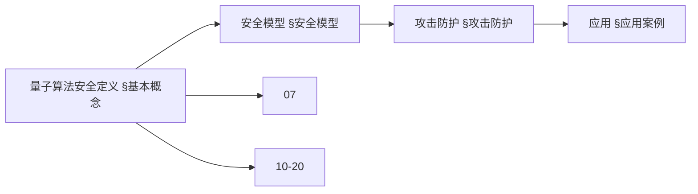
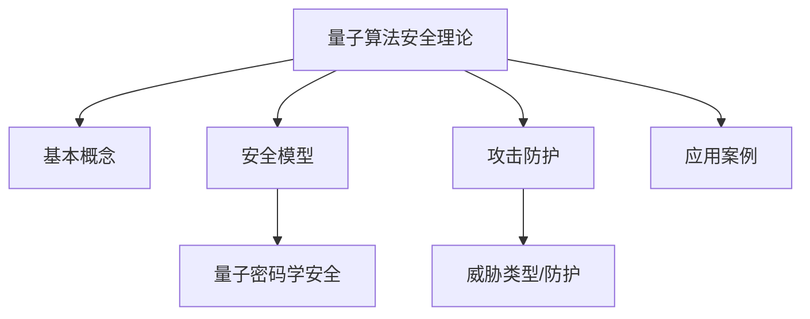
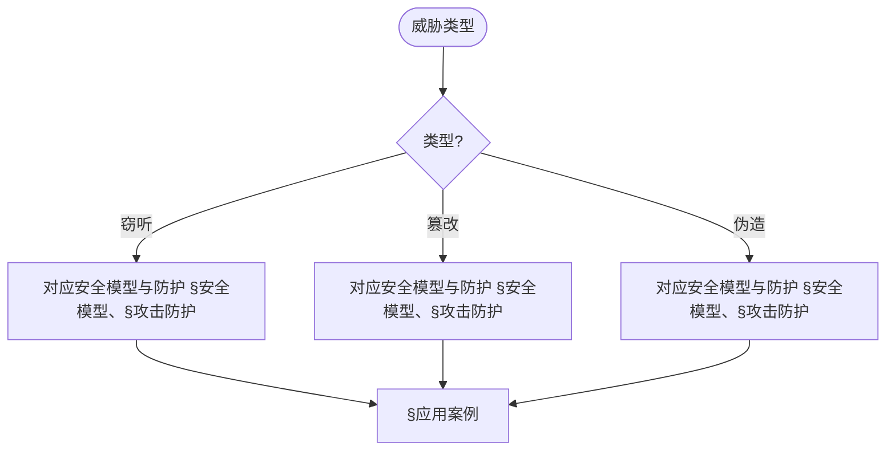
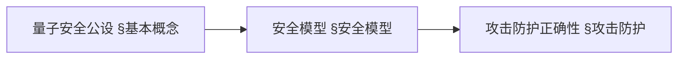
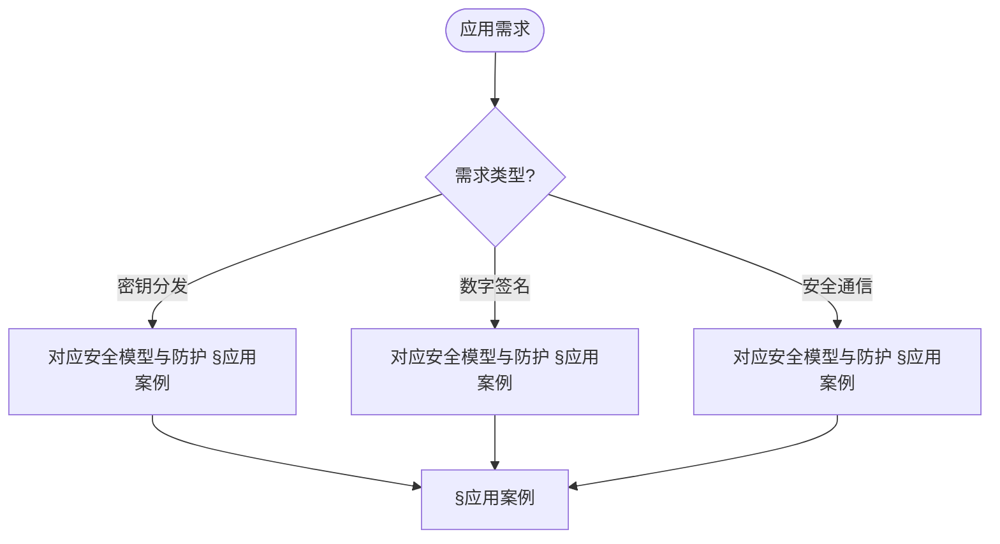

> 📊 **项目全面梳理**：详细的项目结构、模块详解和学习路径，请参阅 [`项目全面梳理-2025.md`](../项目全面梳理-2025.md)

## 10.16 量子算法安全理论 / Quantum Algorithm Security Theory

### 摘要 / Executive Summary

- 统一量子算法安全理论，研究量子算法的安全模型、攻击防护和安全应用。
- 建立量子算法安全在高级主题中的核心地位。

### 关键术语与符号 / Glossary

- 量子算法安全、量子安全威胁、量子密码学安全模型、量子错误纠正安全模型、量子攻击防护。
- 术语对齐与引用规范：`docs/术语与符号总表.md`，`01-基础理论/00-撰写规范与引用指南.md`

### 术语与符号规范 / Terminology & Notation

- 量子算法安全（Quantum Algorithm Security）：量子算法的安全性理论。
- 量子安全威胁（Quantum Security Threat）：对量子算法的安全威胁。
- 量子密码学安全模型（Quantum Cryptographic Security Model）：量子密码学的安全模型。
- 量子攻击防护（Quantum Attack Protection）：防护量子攻击的方法。
- 记号约定：`S` 表示安全，`T` 表示威胁，`A` 表示攻击，`P` 表示防护。

### 交叉引用导航 / Cross-References

- 量子密码学理论：参见 `10-高级主题/20-量子密码学理论.md`。
- 量子错误纠正理论：参见 `10-高级主题/17-量子错误纠正理论.md`。
- 网络安全算法：参见 `12-应用领域/03-网络安全算法应用.md`。
- 项目导航与对标：见 [项目全面梳理-2025](../项目全面梳理-2025.md)、[项目扩展与持续推进任务编排](../项目扩展与持续推进任务编排.md)、[国际课程对标表](../国际课程对标表.md)。

### 快速导航 / Quick Links

- 基本概念
- 安全模型
- 攻击防护

## 目录 / Table of Contents

- [10.16 量子算法安全理论 / Quantum Algorithm Security Theory](#1016-量子算法安全理论--quantum-algorithm-security-theory)
  - [摘要 / Executive Summary](#摘要--executive-summary)
  - [关键术语与符号 / Glossary](#关键术语与符号--glossary)
  - [术语与符号规范 / Terminology \& Notation](#术语与符号规范--terminology--notation)
  - [交叉引用导航 / Cross-References](#交叉引用导航--cross-references)
  - [快速导航 / Quick Links](#快速导航--quick-links)
- [目录 / Table of Contents](#目录--table-of-contents)
- [概述 / Overview](#概述--overview)
- [基本概念 / Basic Concepts](#基本概念--basic-concepts)
  - [量子算法安全 / Quantum Algorithm Security](#量子算法安全--quantum-algorithm-security)
  - [量子安全威胁 / Quantum Security Threats](#量子安全威胁--quantum-security-threats)
  - [内容补充与思维表征 / Content Supplement and Thinking Representation](#内容补充与思维表征--content-supplement-and-thinking-representation)
    - [解释与直观 / Explanation and Intuition](#解释与直观--explanation-and-intuition)
    - [概念属性表 / Concept Attribute Table](#概念属性表--concept-attribute-table)
    - [概念关系 / Concept Relations](#概念关系--concept-relations)
    - [概念依赖图 / Concept Dependency Graph](#概念依赖图--concept-dependency-graph)
    - [论证与证明衔接 / Argumentation and Proof Link](#论证与证明衔接--argumentation-and-proof-link)
    - [思维导图：本章概念结构 / Mind Map](#思维导图本章概念结构--mind-map)
    - [多维矩阵：安全模型与防护对比 / Multi-Dimensional Comparison](#多维矩阵安全模型与防护对比--multi-dimensional-comparison)
    - [决策树：威胁类型到安全模型与防护选择 / Decision Tree](#决策树威胁类型到安全模型与防护选择--decision-tree)
    - [公理定理推理证明决策树 / Axiom-Theorem-Proof Tree](#公理定理推理证明决策树--axiom-theorem-proof-tree)
    - [应用决策建模树 / Application Decision Modeling Tree](#应用决策建模树--application-decision-modeling-tree)
- [安全模型 / Security Models](#安全模型--security-models)
  - [1. 量子密码学安全模型 / Quantum Cryptographic Security Model](#1-量子密码学安全模型--quantum-cryptographic-security-model)
  - [2. 量子错误纠正安全模型 / Quantum Error Correction Security Model](#2-量子错误纠正安全模型--quantum-error-correction-security-model)
  - [3. 量子侧信道防护模型 / Quantum Side-Channel Protection Model](#3-量子侧信道防护模型--quantum-side-channel-protection-model)
- [攻击防护 / Attack Protection](#攻击防护--attack-protection)
  - [1. 量子攻击防护 / Quantum Attack Protection](#1-量子攻击防护--quantum-attack-protection)
  - [2. 错误注入攻击防护 / Fault Injection Attack Protection](#2-错误注入攻击防护--fault-injection-attack-protection)
- [应用案例 / Application Cases](#应用案例--application-cases)
  - [1. 量子密码学算法安全 / Quantum Cryptographic Algorithm Security](#1-量子密码学算法安全--quantum-cryptographic-algorithm-security)
  - [2. 量子机器学习算法安全 / Quantum Machine Learning Algorithm Security](#2-量子机器学习算法安全--quantum-machine-learning-algorithm-security)
- [实现示例 / Implementation Examples](#实现示例--implementation-examples)
  - [1. Rust实现 / Rust Implementation](#1-rust实现--rust-implementation)
  - [2. 使用示例 / Usage Examples](#2-使用示例--usage-examples)
- [总结 / Summary](#总结--summary)
  - [关键要点 / Key Points](#关键要点--key-points)

## 概述 / Overview

量子算法安全理论是量子计算与信息安全的重要交叉领域，研究量子算法在面临各种攻击和威胁时的安全性保障机制。

Quantum algorithm security theory is an important interdisciplinary field combining quantum computing and information security, studying security mechanisms for quantum algorithms against various attacks and threats.

## 基本概念 / Basic Concepts

### 量子算法安全 / Quantum Algorithm Security

**定义**: 确保量子算法在恶意攻击、错误注入、侧信道攻击等威胁下保持正确性和机密性的理论体系

**Definition**: A theoretical framework ensuring quantum algorithms maintain correctness and confidentiality against malicious attacks, error injection, side-channel attacks, and other threats

```rust
// 量子算法安全框架 / Quantum Algorithm Security Framework
#[derive(Debug, Clone)]
pub struct QuantumAlgorithmSecurity {
    algorithm: Box<dyn QuantumAlgorithm>,
    security_model: SecurityModel,
    threat_model: ThreatModel,
    protection_mechanisms: Vec<ProtectionMechanism>,
}

#[derive(Debug, Clone)]
pub struct SecurityModel {
    confidentiality: ConfidentialityModel,
    integrity: IntegrityModel,
    availability: AvailabilityModel,
    authenticity: AuthenticityModel,
}

#[derive(Debug, Clone)]
pub struct ThreatModel {
    attack_vectors: Vec<AttackVector>,
    adversary_capabilities: AdversaryCapabilities,
    risk_assessment: RiskAssessment,
}
```

### 量子安全威胁 / Quantum Security Threats

```rust
// 量子安全威胁分类 / Quantum Security Threat Classification
#[derive(Debug, Clone)]
pub enum QuantumSecurityThreat {
    // 量子攻击 / Quantum attacks
    QuantumAttacks {
        grover_attack: GroverAttack,
        shor_attack: ShorAttack,
        quantum_annealing_attack: QuantumAnnealingAttack,
    },

    // 侧信道攻击 / Side-channel attacks
    SideChannelAttacks {
        timing_attack: TimingAttack,
        power_analysis: PowerAnalysis,
        electromagnetic_attack: ElectromagneticAttack,
    },

    // 错误注入攻击 / Fault injection attacks
    FaultInjectionAttacks {
        bit_flip: BitFlipAttack,
        phase_flip: PhaseFlipAttack,
        decoherence_injection: DecoherenceInjection,
    },

    // 物理攻击 / Physical attacks
    PhysicalAttacks {
        tampering: TamperingAttack,
        reverse_engineering: ReverseEngineering,
        quantum_state_manipulation: QuantumStateManipulation,
    },
}

// 攻击向量 / Attack vector
#[derive(Debug, Clone)]
pub struct AttackVector {
    name: String,
    description: String,
    complexity: AttackComplexity,
    success_probability: f64,
    detection_difficulty: DetectionDifficulty,
}

#[derive(Debug, Clone)]
pub enum AttackComplexity {
    Constant,
    Linear,
    Polynomial,
    Exponential,
    QuantumPolynomial,
    QuantumExponential,
}
```

### 内容补充与思维表征 / Content Supplement and Thinking Representation

> 本节按 [内容补充与思维表征全面计划方案](../内容补充与思维表征全面计划方案.md) **只补充、不删除**。标准见 [内容补充标准](../内容补充标准-概念定义属性关系解释论证形式证明.md)、[思维表征模板集](../思维表征模板集.md)。

#### 解释与直观 / Explanation and Intuition

量子算法安全理论在量子计算模型下研究保密性、完整性与不可否认性；安全模型、攻击防护与应用案例构成理论栈。与 07-量子计算模型、10-20 量子密码学、04-复杂度衔接；§基本概念、§安全模型、§攻击防护、§应用案例形成完整表征。

#### 概念属性表 / Concept Attribute Table

| 属性名 | 类型/范围 | 含义 | 备注 |
|--------|-----------|------|------|
| 量子算法安全 | 安全框架 | 保密性/完整性/不可否认性 | §基本概念 |
| 安全模型 | 模型 | 量子密码学安全模型等 | §安全模型 |
| 攻击防护 | 防护 | 威胁与防护手段 | §攻击防护 |
| 应用案例 | 应用 | §应用案例 | 与 10-20 对照 |

#### 概念关系 / Concept Relations

| 源概念 | 目标概念 | 关系类型 | 说明 |
|--------|----------|----------|------|
| 量子算法安全理论 | 07-量子计算模型、10-20 量子密码学、04-复杂度 | depends_on | 计算与密码基础 |
| 量子算法安全理论 | 09-01-15 量子算法、10-04 量子信息论 | relates_to | 算法安全、信息论安全 |

#### 概念依赖图 / Concept Dependency Graph



#### 论证与证明衔接 / Argumentation and Proof Link

安全定义形式化见 §基本概念；安全模型与攻击防护正确性见 §安全模型、§攻击防护；与 10-20 论证衔接。

#### 思维导图：本章概念结构 / Mind Map



#### 多维矩阵：安全模型与防护对比 / Multi-Dimensional Comparison

| 概念/技术 | 威胁 | 强度/复杂度 | 备注 |
|-----------|------|--------------|------|
| 安全模型 | 窃听/篡改/伪造 | §安全模型 | 与 10-20 对照 |
| 攻击类型 | 量子/侧信道/错误注入 | §攻击防护 | — |
| 防护手段 | 对应威胁 | §攻击防护 | — |

#### 决策树：威胁类型到安全模型与防护选择 / Decision Tree



#### 公理定理推理证明决策树 / Axiom-Theorem-Proof Tree



#### 应用决策建模树 / Application Decision Modeling Tree



## 安全模型 / Security Models

### 1. 量子密码学安全模型 / Quantum Cryptographic Security Model

```rust
// 量子密码学安全模型 / Quantum Cryptographic Security Model
pub struct QuantumCryptographicSecurity {
    key_management: QuantumKeyManagement,
    encryption_scheme: QuantumEncryptionScheme,
    authentication: QuantumAuthentication,
    key_exchange: QuantumKeyExchange,
}

impl QuantumCryptographicSecurity {
    pub fn new() -> Self {
        Self {
            key_management: QuantumKeyManagement::new(),
            encryption_scheme: QuantumEncryptionScheme::new(),
            authentication: QuantumAuthentication::new(),
            key_exchange: QuantumKeyExchange::new(),
        }
    }

    // 量子密钥管理 / Quantum key management
    pub fn manage_keys(&self, key_size: usize) -> Result<QuantumKey, KeyManagementError> {
        // 生成量子密钥
        // Generate quantum key
        let raw_key = self.key_management.generate_quantum_key(key_size)?;

        // 密钥验证
        // Key validation
        let validated_key = self.key_management.validate_key(&raw_key)?;

        // 密钥分发
        // Key distribution
        let distributed_key = self.key_management.distribute_key(&validated_key)?;

        Ok(distributed_key)
    }

    // 量子加密 / Quantum encryption
    pub fn encrypt_quantum_data(
        &self,
        data: &QuantumData,
        key: &QuantumKey
    ) -> Result<EncryptedQuantumData, EncryptionError> {
        // 准备量子态
        // Prepare quantum state
        let prepared_state = self.prepare_quantum_state(data)?;

        // 应用加密变换
        // Apply encryption transformation
        let encrypted_state = self.encryption_scheme.encrypt(&prepared_state, key)?;

        // 添加认证标签
        // Add authentication tag
        let authenticated_data = self.authentication.add_tag(&encrypted_state, key)?;

        Ok(authenticated_data)
    }
}

// 量子密钥管理 / Quantum key management
pub struct QuantumKeyManagement {
    key_generator: Box<dyn QuantumKeyGenerator>,
    key_validator: Box<dyn KeyValidator>,
    key_distributor: Box<dyn KeyDistributor>,
}

impl QuantumKeyManagement {
    pub fn new() -> Self {
        Self {
            key_generator: Box::new(QuantumRandomKeyGenerator::new()),
            key_validator: Box::new(QuantumKeyValidator::new()),
            key_distributor: Box::new(QuantumKeyDistributor::new()),
        }
    }

    // 生成量子密钥 / Generate quantum key
    pub fn generate_quantum_key(&self, size: usize) -> Result<QuantumKey, KeyGenerationError> {
        // 使用量子随机数生成器
        // Use quantum random number generator
        let random_bits = self.key_generator.generate_random_bits(size)?;

        // 后处理
        // Post-processing
        let processed_key = self.key_generator.post_process(&random_bits)?;

        // 密钥扩展
        // Key expansion
        let expanded_key = self.key_generator.expand_key(&processed_key)?;

        Ok(expanded_key)
    }
}

// 量子密钥 / Quantum key
#[derive(Debug, Clone)]
pub struct QuantumKey {
    key_bits: Vec<bool>,
    key_size: usize,
    generation_time: DateTime<Utc>,
    expiration_time: DateTime<Utc>,
    security_level: SecurityLevel,
}

#[derive(Debug, Clone)]
pub enum SecurityLevel {
    Low,      // 128 bits
    Medium,   // 256 bits
    High,     // 512 bits
    Ultra,    // 1024 bits
}
```

### 2. 量子错误纠正安全模型 / Quantum Error Correction Security Model

```rust
// 量子错误纠正安全模型 / Quantum Error Correction Security Model
pub struct QuantumErrorCorrectionSecurity {
    error_detector: Box<dyn QuantumErrorDetector>,
    error_corrector: Box<dyn QuantumErrorCorrector>,
    fault_tolerance: Box<dyn FaultTolerance>,
}

impl QuantumErrorCorrectionSecurity {
    pub fn new() -> Self {
        Self {
            error_detector: Box::new(QuantumSyndromeDetector::new()),
            error_corrector: Box::new(QuantumErrorCorrector::new()),
            fault_tolerance: Box::new(QuantumFaultTolerance::new()),
        }
    }

    // 检测和纠正错误 / Detect and correct errors
    pub fn detect_and_correct_errors(
        &self,
        quantum_state: &QuantumState
    ) -> Result<CorrectedQuantumState, ErrorCorrectionError> {
        // 错误检测
        // Error detection
        let error_syndrome = self.error_detector.detect_errors(quantum_state)?;

        // 错误分类
        // Error classification
        let error_type = self.classify_error(&error_syndrome)?;

        // 错误纠正
        // Error correction
        let corrected_state = self.error_corrector.correct_error(quantum_state, &error_type)?;

        // 容错验证
        // Fault tolerance verification
        let verified_state = self.fault_tolerance.verify_correction(&corrected_state)?;

        Ok(verified_state)
    }

    // 容错量子计算 / Fault-tolerant quantum computation
    pub fn fault_tolerant_computation(
        &self,
        algorithm: &dyn QuantumAlgorithm,
        input: &QuantumInput
    ) -> Result<QuantumOutput, FaultToleranceError> {
        // 准备容错电路
        // Prepare fault-tolerant circuit
        let fault_tolerant_circuit = self.fault_tolerance.prepare_circuit(algorithm)?;

        // 执行容错计算
        // Execute fault-tolerant computation
        let protected_output = self.fault_tolerance.execute_protected(&fault_tolerant_circuit, input)?;

        // 错误恢复
        // Error recovery
        let recovered_output = self.fault_tolerance.recover_from_errors(&protected_output)?;

        Ok(recovered_output)
    }
}

// 量子错误检测器 / Quantum error detector
pub struct QuantumSyndromeDetector {
    stabilizer_generators: Vec<StabilizerGenerator>,
    syndrome_measurement: SyndromeMeasurement,
}

impl QuantumSyndromeDetector {
    pub fn new() -> Self {
        Self {
            stabilizer_generators: vec![
                StabilizerGenerator::new(StabilizerType::X),
                StabilizerGenerator::new(StabilizerType::Z),
            ],
            syndrome_measurement: SyndromeMeasurement::new(),
        }
    }

    // 检测错误 / Detect errors
    pub fn detect_errors(&self, state: &QuantumState) -> Result<ErrorSyndrome, DetectionError> {
        let mut syndrome = ErrorSyndrome::new();

        for generator in &self.stabilizer_generators {
            // 测量稳定子
            // Measure stabilizer
            let measurement_result = self.syndrome_measurement.measure_stabilizer(state, generator)?;

            // 分析测量结果
            // Analyze measurement result
            let error_indicator = self.analyze_measurement(&measurement_result)?;

            syndrome.add_indicator(error_indicator);
        }

        Ok(syndrome)
    }
}

// 错误综合征 / Error syndrome
#[derive(Debug, Clone)]
pub struct ErrorSyndrome {
    indicators: Vec<ErrorIndicator>,
    error_pattern: ErrorPattern,
    confidence: f64,
}

#[derive(Debug, Clone)]
pub enum ErrorIndicator {
    BitFlip(usize),
    PhaseFlip(usize),
    Combined(usize, usize),
    Measurement(usize),
}
```

### 3. 量子侧信道防护模型 / Quantum Side-Channel Protection Model

```rust
// 量子侧信道防护模型 / Quantum Side-Channel Protection Model
pub struct QuantumSideChannelProtection {
    timing_protection: Box<dyn TimingProtection>,
    power_protection: Box<dyn PowerProtection>,
    electromagnetic_protection: Box<dyn ElectromagneticProtection>,
}

impl QuantumSideChannelProtection {
    pub fn new() -> Self {
        Self {
            timing_protection: Box::new(QuantumTimingProtection::new()),
            power_protection: Box::new(QuantumPowerProtection::new()),
            electromagnetic_protection: Box::new(QuantumElectromagneticProtection::new()),
        }
    }

    // 应用侧信道防护 / Apply side-channel protection
    pub fn apply_protection(
        &self,
        algorithm: &mut dyn QuantumAlgorithm
    ) -> Result<ProtectedAlgorithm, ProtectionError> {
        // 时间防护
        // Timing protection
        let timing_protected = self.timing_protection.protect_timing(algorithm)?;

        // 功耗防护
        // Power protection
        let power_protected = self.power_protection.protect_power(&timing_protected)?;

        // 电磁防护
        // Electromagnetic protection
        let fully_protected = self.electromagnetic_protection.protect_em(&power_protected)?;

        Ok(fully_protected)
    }
}

// 量子时间防护 / Quantum timing protection
pub struct QuantumTimingProtection {
    constant_time_operations: Vec<ConstantTimeOperation>,
    timing_randomization: TimingRandomization,
}

impl QuantumTimingProtection {
    pub fn new() -> Self {
        Self {
            constant_time_operations: vec![
                ConstantTimeOperation::new(OperationType::QuantumGate),
                ConstantTimeOperation::new(OperationType::Measurement),
                ConstantTimeOperation::new(OperationType::ClassicalControl),
            ],
            timing_randomization: TimingRandomization::new(),
        }
    }

    // 保护时间信息 / Protect timing information
    pub fn protect_timing(
        &self,
        algorithm: &mut dyn QuantumAlgorithm
    ) -> Result<TimingProtectedAlgorithm, TimingProtectionError> {
        // 分析算法时间特征
        // Analyze algorithm timing characteristics
        let timing_profile = self.analyze_timing_profile(algorithm)?;

        // 识别时间漏洞
        // Identify timing vulnerabilities
        let vulnerabilities = self.identify_timing_vulnerabilities(&timing_profile)?;

        // 应用时间防护
        // Apply timing protection
        let protected_algorithm = self.apply_timing_protection(algorithm, &vulnerabilities)?;

        Ok(protected_algorithm)
    }

    // 应用时间防护 / Apply timing protection
    fn apply_timing_protection(
        &self,
        algorithm: &mut dyn QuantumAlgorithm,
        vulnerabilities: &[TimingVulnerability]
    ) -> Result<TimingProtectedAlgorithm, TimingProtectionError> {
        let mut protected_algorithm = TimingProtectedAlgorithm::new(algorithm.clone());

        for vulnerability in vulnerabilities {
            match vulnerability.vulnerability_type {
                TimingVulnerabilityType::DataDependent => {
                    // 添加数据无关操作
                    // Add data-independent operations
                    protected_algorithm.add_constant_time_operations()?;
                }
                TimingVulnerabilityType::BranchDependent => {
                    // 消除分支依赖
                    // Eliminate branch dependencies
                    protected_algorithm.eliminate_branches()?;
                }
                TimingVulnerabilityType::ResourceDependent => {
                    // 统一资源使用
                    // Unify resource usage
                    protected_algorithm.unify_resource_usage()?;
                }
            }
        }

        Ok(protected_algorithm)
    }
}

// 时间防护算法 / Timing protected algorithm
#[derive(Debug, Clone)]
pub struct TimingProtectedAlgorithm {
    original_algorithm: Box<dyn QuantumAlgorithm>,
    protection_layers: Vec<TimingProtectionLayer>,
    randomization_seed: u64,
}

#[derive(Debug, Clone)]
pub struct TimingProtectionLayer {
    layer_type: ProtectionLayerType,
    operations: Vec<ConstantTimeOperation>,
    randomization: bool,
}

#[derive(Debug, Clone)]
pub enum ProtectionLayerType {
    DataIndependent,
    BranchElimination,
    ResourceUnification,
    Randomization,
}
```

## 攻击防护 / Attack Protection

### 1. 量子攻击防护 / Quantum Attack Protection

```rust
// 量子攻击防护系统 / Quantum Attack Protection System
pub struct QuantumAttackProtection {
    grover_protection: Box<dyn GroverProtection>,
    shor_protection: Box<dyn ShorProtection>,
    quantum_annealing_protection: Box<dyn QuantumAnnealingProtection>,
}

impl QuantumAttackProtection {
    pub fn new() -> Self {
        Self {
            grover_protection: Box::new(GroverAttackProtection::new()),
            shor_protection: Box::new(ShorAttackProtection::new()),
            quantum_annealing_protection: Box::new(QuantumAnnealingAttackProtection::new()),
        }
    }

    // 防护Grover攻击 / Protect against Grover attack
    pub fn protect_against_grover(
        &self,
        algorithm: &dyn QuantumAlgorithm
    ) -> Result<GroverProtectedAlgorithm, GroverProtectionError> {
        // 分析算法对Grover攻击的脆弱性
        // Analyze algorithm vulnerability to Grover attack
        let vulnerability = self.grover_protection.analyze_vulnerability(algorithm)?;

        // 应用Grover防护
        // Apply Grover protection
        let protected_algorithm = self.grover_protection.apply_protection(algorithm, &vulnerability)?;

        // 验证防护效果
        // Verify protection effectiveness
        let effectiveness = self.grover_protection.verify_protection(&protected_algorithm)?;

        Ok(protected_algorithm)
    }

    // 防护Shor攻击 / Protect against Shor attack
    pub fn protect_against_shor(
        &self,
        algorithm: &dyn QuantumAlgorithm
    ) -> Result<ShorProtectedAlgorithm, ShorProtectionError> {
        // 分析算法对Shor攻击的脆弱性
        // Analyze algorithm vulnerability to Shor attack
        let vulnerability = self.shor_protection.analyze_vulnerability(algorithm)?;

        // 应用Shor防护
        // Apply Shor protection
        let protected_algorithm = self.shor_protection.apply_protection(algorithm, &vulnerability)?;

        // 验证防护效果
        // Verify protection effectiveness
        let effectiveness = self.shor_protection.verify_protection(&protected_algorithm)?;

        Ok(protected_algorithm)
    }
}

// Grover攻击防护 / Grover attack protection
pub struct GroverAttackProtection {
    key_size_analyzer: KeySizeAnalyzer,
    post_quantum_crypto: PostQuantumCrypto,
    quantum_resistant_hash: QuantumResistantHash,
}

impl GroverAttackProtection {
    pub fn new() -> Self {
        Self {
            key_size_analyzer: KeySizeAnalyzer::new(),
            post_quantum_crypto: PostQuantumCrypto::new(),
            quantum_resistant_hash: QuantumResistantHash::new(),
        }
    }

    // 分析脆弱性 / Analyze vulnerability
    pub fn analyze_vulnerability(
        &self,
        algorithm: &dyn QuantumAlgorithm
    ) -> Result<GroverVulnerability, VulnerabilityAnalysisError> {
        // 分析密钥大小
        // Analyze key size
        let key_size = self.key_size_analyzer.analyze_key_size(algorithm)?;

        // 计算Grover攻击复杂度
        // Calculate Grover attack complexity
        let attack_complexity = self.calculate_grover_complexity(&key_size)?;

        // 评估脆弱性
        // Assess vulnerability
        let vulnerability = self.assess_vulnerability(&attack_complexity)?;

        Ok(vulnerability)
    }

    // 应用防护 / Apply protection
    pub fn apply_protection(
        &self,
        algorithm: &dyn QuantumAlgorithm,
        vulnerability: &GroverVulnerability
    ) -> Result<GroverProtectedAlgorithm, GroverProtectionError> {
        let mut protected_algorithm = GroverProtectedAlgorithm::new(algorithm.clone());

        match vulnerability.severity {
            VulnerabilitySeverity::Low => {
                // 增加密钥大小
                // Increase key size
                protected_algorithm.increase_key_size(256)?;
            }
            VulnerabilitySeverity::Medium => {
                // 使用后量子密码学
                // Use post-quantum cryptography
                protected_algorithm.use_post_quantum_crypto()?;
            }
            VulnerabilitySeverity::High => {
                // 使用量子抗性哈希
                // Use quantum-resistant hash
                protected_algorithm.use_quantum_resistant_hash()?;
            }
            VulnerabilitySeverity::Critical => {
                // 组合多种防护方法
                // Combine multiple protection methods
                protected_algorithm.apply_comprehensive_protection()?;
            }
        }

        Ok(protected_algorithm)
    }
}

// Grover脆弱性 / Grover vulnerability
#[derive(Debug, Clone)]
pub struct GroverVulnerability {
    key_size: usize,
    attack_complexity: AttackComplexity,
    severity: VulnerabilitySeverity,
    recommended_protection: ProtectionMethod,
}

#[derive(Debug, Clone)]
pub enum VulnerabilitySeverity {
    Low,
    Medium,
    High,
    Critical,
}

#[derive(Debug, Clone)]
pub enum ProtectionMethod {
    KeySizeIncrease,
    PostQuantumCrypto,
    QuantumResistantHash,
    ComprehensiveProtection,
}
```

### 2. 错误注入攻击防护 / Fault Injection Attack Protection

```rust
// 错误注入攻击防护 / Fault Injection Attack Protection
pub struct FaultInjectionProtection {
    fault_detector: Box<dyn FaultDetector>,
    fault_corrector: Box<dyn FaultCorrector>,
    fault_prevention: Box<dyn FaultPrevention>,
}

impl FaultInjectionProtection {
    pub fn new() -> Self {
        Self {
            fault_detector: Box::new(QuantumFaultDetector::new()),
            fault_corrector: Box::new(QuantumFaultCorrector::new()),
            fault_prevention: Box::new(QuantumFaultPrevention::new()),
        }
    }

    // 防护错误注入攻击 / Protect against fault injection attacks
    pub fn protect_against_fault_injection(
        &self,
        algorithm: &dyn QuantumAlgorithm
    ) -> Result<FaultProtectedAlgorithm, FaultProtectionError> {
        // 分析错误注入脆弱性
        // Analyze fault injection vulnerability
        let vulnerability = self.analyze_fault_vulnerability(algorithm)?;

        // 应用错误防护
        // Apply fault protection
        let protected_algorithm = self.apply_fault_protection(algorithm, &vulnerability)?;

        // 验证防护效果
        // Verify protection effectiveness
        let effectiveness = self.verify_fault_protection(&protected_algorithm)?;

        Ok(protected_algorithm)
    }

    // 分析错误脆弱性 / Analyze fault vulnerability
    fn analyze_fault_vulnerability(
        &self,
        algorithm: &dyn QuantumAlgorithm
    ) -> Result<FaultVulnerability, VulnerabilityAnalysisError> {
        // 识别关键操作
        // Identify critical operations
        let critical_operations = self.identify_critical_operations(algorithm)?;

        // 分析错误影响
        // Analyze fault impact
        let fault_impact = self.analyze_fault_impact(&critical_operations)?;

        // 评估脆弱性
        // Assess vulnerability
        let vulnerability = self.assess_fault_vulnerability(&fault_impact)?;

        Ok(vulnerability)
    }
}

// 量子错误检测器 / Quantum fault detector
pub struct QuantumFaultDetector {
    redundancy_checker: RedundancyChecker,
    consistency_verifier: ConsistencyVerifier,
    anomaly_detector: AnomalyDetector,
}

impl QuantumFaultDetector {
    pub fn new() -> Self {
        Self {
            redundancy_checker: RedundancyChecker::new(),
            consistency_verifier: ConsistencyVerifier::new(),
            anomaly_detector: AnomalyDetector::new(),
        }
    }

    // 检测错误 / Detect faults
    pub fn detect_faults(&self, state: &QuantumState) -> Result<FaultReport, FaultDetectionError> {
        let mut fault_report = FaultReport::new();

        // 冗余检查
        // Redundancy check
        let redundancy_result = self.redundancy_checker.check_redundancy(state)?;
        if let Some(fault) = redundancy_result {
            fault_report.add_fault(fault);
        }

        // 一致性验证
        // Consistency verification
        let consistency_result = self.consistency_verifier.verify_consistency(state)?;
        if let Some(fault) = consistency_result {
            fault_report.add_fault(fault);
        }

        // 异常检测
        // Anomaly detection
        let anomaly_result = self.anomaly_detector.detect_anomalies(state)?;
        for anomaly in anomaly_result {
            fault_report.add_anomaly(anomaly);
        }

        Ok(fault_report)
    }
}

// 错误报告 / Fault report
#[derive(Debug, Clone)]
pub struct FaultReport {
    faults: Vec<DetectedFault>,
    anomalies: Vec<Anomaly>,
    severity: FaultSeverity,
    recommendations: Vec<FaultRecommendation>,
}

#[derive(Debug, Clone)]
pub struct DetectedFault {
    fault_type: FaultType,
    location: FaultLocation,
    impact: FaultImpact,
    confidence: f64,
}

#[derive(Debug, Clone)]
pub enum FaultType {
    BitFlip,
    PhaseFlip,
    MeasurementError,
    Decoherence,
    ControlError,
}
```

## 应用案例 / Application Cases

### 1. 量子密码学算法安全 / Quantum Cryptographic Algorithm Security

```rust
// 量子密码学算法安全系统 / Quantum Cryptographic Algorithm Security System
pub struct QuantumCryptographicSecurity {
    key_generation: QuantumKeyGeneration,
    encryption: QuantumEncryption,
    authentication: QuantumAuthentication,
    key_exchange: QuantumKeyExchange,
}

impl QuantumCryptographicSecurity {
    pub fn new() -> Self {
        Self {
            key_generation: QuantumKeyGeneration::new(),
            encryption: QuantumEncryption::new(),
            authentication: QuantumAuthentication::new(),
            key_exchange: QuantumKeyExchange::new(),
        }
    }

    // 安全密钥生成 / Secure key generation
    pub fn generate_secure_key(&self, size: usize) -> Result<SecureQuantumKey, KeyGenerationError> {
        // 使用量子随机数生成器
        // Use quantum random number generator
        let quantum_random = self.key_generation.generate_quantum_random(size)?;

        // 后处理
        // Post-processing
        let processed_key = self.key_generation.post_process(&quantum_random)?;

        // 密钥验证
        // Key validation
        let validated_key = self.key_generation.validate_key(&processed_key)?;

        // 添加安全标签
        // Add security tag
        let secure_key = self.key_generation.add_security_tag(&validated_key)?;

        Ok(secure_key)
    }

    // 安全量子加密 / Secure quantum encryption
    pub fn secure_quantum_encryption(
        &self,
        plaintext: &QuantumPlaintext,
        key: &SecureQuantumKey
    ) -> Result<SecureQuantumCiphertext, EncryptionError> {
        // 准备量子态
        // Prepare quantum state
        let prepared_state = self.prepare_secure_state(plaintext)?;

        // 应用加密变换
        // Apply encryption transformation
        let encrypted_state = self.encryption.encrypt_quantum(&prepared_state, key)?;

        // 添加认证
        // Add authentication
        let authenticated_ciphertext = self.authentication.add_quantum_auth(&encrypted_state, key)?;

        // 错误检测
        // Error detection
        let error_protected = self.add_error_protection(&authenticated_ciphertext)?;

        Ok(error_protected)
    }
}

// 安全量子密钥 / Secure quantum key
#[derive(Debug, Clone)]
pub struct SecureQuantumKey {
    key_data: Vec<u8>,
    security_level: SecurityLevel,
    generation_time: DateTime<Utc>,
    expiration_time: DateTime<Utc>,
    security_tags: Vec<SecurityTag>,
    error_correction: ErrorCorrectionCode,
}

#[derive(Debug, Clone)]
pub struct SecurityTag {
    tag_type: SecurityTagType,
    value: Vec<u8>,
    algorithm: String,
}

#[derive(Debug, Clone)]
pub enum SecurityTagType {
    Integrity,
    Authenticity,
    Confidentiality,
    NonRepudiation,
}
```

### 2. 量子机器学习算法安全 / Quantum Machine Learning Algorithm Security

```rust
// 量子机器学习算法安全 / Quantum Machine Learning Algorithm Security
pub struct QuantumMLSecurity {
    model_protection: ModelProtection,
    data_protection: DataProtection,
    inference_protection: InferenceProtection,
}

impl QuantumMLSecurity {
    pub fn new() -> Self {
        Self {
            model_protection: ModelProtection::new(),
            data_protection: DataProtection::new(),
            inference_protection: InferenceProtection::new(),
        }
    }

    // 保护量子机器学习模型 / Protect quantum machine learning model
    pub fn protect_quantum_ml_model(
        &self,
        model: &dyn QuantumMLModel
    ) -> Result<ProtectedQuantumMLModel, MLProtectionError> {
        // 模型参数保护
        // Model parameter protection
        let protected_parameters = self.model_protection.protect_parameters(model)?;

        // 模型结构保护
        // Model structure protection
        let protected_structure = self.model_protection.protect_structure(model)?;

        // 训练数据保护
        // Training data protection
        let protected_data = self.data_protection.protect_training_data(model)?;

        // 推理过程保护
        // Inference process protection
        let protected_inference = self.inference_protection.protect_inference(model)?;

        Ok(ProtectedQuantumMLModel {
            protected_parameters,
            protected_structure,
            protected_data,
            protected_inference,
        })
    }
}

// 模型保护 / Model protection
pub struct ModelProtection {
    parameter_encryption: ParameterEncryption,
    structure_obfuscation: StructureObfuscation,
    watermarking: ModelWatermarking,
}

impl ModelProtection {
    pub fn new() -> Self {
        Self {
            parameter_encryption: ParameterEncryption::new(),
            structure_obfuscation: StructureObfuscation::new(),
            watermarking: ModelWatermarking::new(),
        }
    }

    // 保护模型参数 / Protect model parameters
    pub fn protect_parameters(
        &self,
        model: &dyn QuantumMLModel
    ) -> Result<ProtectedParameters, ParameterProtectionError> {
        // 加密参数
        // Encrypt parameters
        let encrypted_params = self.parameter_encryption.encrypt_parameters(model)?;

        // 添加水印
        // Add watermark
        let watermarked_params = self.watermarking.add_watermark(&encrypted_params)?;

        // 参数验证
        // Parameter validation
        let validated_params = self.validate_protected_parameters(&watermarked_params)?;

        Ok(validated_params)
    }
}

// 受保护的量子ML模型 / Protected quantum ML model
#[derive(Debug, Clone)]
pub struct ProtectedQuantumMLModel {
    protected_parameters: ProtectedParameters,
    protected_structure: ProtectedStructure,
    protected_data: ProtectedData,
    protected_inference: ProtectedInference,
}

#[derive(Debug, Clone)]
pub struct ProtectedParameters {
    encrypted_weights: Vec<EncryptedWeight>,
    watermarks: Vec<Watermark>,
    access_control: AccessControl,
}

#[derive(Debug, Clone)]
pub struct EncryptedWeight {
    encrypted_value: Vec<u8>,
    encryption_algorithm: String,
    key_id: String,
    metadata: WeightMetadata,
}
```

## 实现示例 / Implementation Examples

### 1. Rust实现 / Rust Implementation

```rust
// 量子算法安全主结构 / Main Quantum Algorithm Security Structure
pub struct QuantumAlgorithmSecuritySystem {
    cryptographic_security: QuantumCryptographicSecurity,
    error_correction_security: QuantumErrorCorrectionSecurity,
    side_channel_protection: QuantumSideChannelProtection,
    attack_protection: QuantumAttackProtection,
    fault_injection_protection: FaultInjectionProtection,
}

impl QuantumAlgorithmSecuritySystem {
    pub fn new() -> Self {
        Self {
            cryptographic_security: QuantumCryptographicSecurity::new(),
            error_correction_security: QuantumErrorCorrectionSecurity::new(),
            side_channel_protection: QuantumSideChannelProtection::new(),
            attack_protection: QuantumAttackProtection::new(),
            fault_injection_protection: FaultInjectionProtection::new(),
        }
    }

    // 全面安全保护 / Comprehensive security protection
    pub fn apply_comprehensive_security(
        &self,
        algorithm: &dyn QuantumAlgorithm
    ) -> Result<SecuredQuantumAlgorithm, SecurityError> {
        let mut secured_algorithm = SecuredQuantumAlgorithm::new(algorithm.clone());

        // 应用密码学安全
        // Apply cryptographic security
        secured_algorithm = self.cryptographic_security.secure_algorithm(&secured_algorithm)?;

        // 应用错误纠正安全
        // Apply error correction security
        secured_algorithm = self.error_correction_security.secure_algorithm(&secured_algorithm)?;

        // 应用侧信道防护
        // Apply side-channel protection
        secured_algorithm = self.side_channel_protection.secure_algorithm(&secured_algorithm)?;

        // 应用攻击防护
        // Apply attack protection
        secured_algorithm = self.attack_protection.secure_algorithm(&secured_algorithm)?;

        // 应用错误注入防护
        // Apply fault injection protection
        secured_algorithm = self.fault_injection_protection.secure_algorithm(&secured_algorithm)?;

        Ok(secured_algorithm)
    }

    // 安全评估 / Security assessment
    pub fn assess_security(
        &self,
        algorithm: &dyn QuantumAlgorithm
    ) -> Result<SecurityAssessment, AssessmentError> {
        let mut assessment = SecurityAssessment::new();

        // 评估密码学安全
        // Assess cryptographic security
        let crypto_assessment = self.cryptographic_security.assess_security(algorithm)?;
        assessment.add_assessment("cryptographic", crypto_assessment);

        // 评估错误纠正安全
        // Assess error correction security
        let error_assessment = self.error_correction_security.assess_security(algorithm)?;
        assessment.add_assessment("error_correction", error_assessment);

        // 评估侧信道安全
        // Assess side-channel security
        let side_channel_assessment = self.side_channel_protection.assess_security(algorithm)?;
        assessment.add_assessment("side_channel", side_channel_assessment);

        // 评估攻击防护
        // Assess attack protection
        let attack_assessment = self.attack_protection.assess_security(algorithm)?;
        assessment.add_assessment("attack_protection", attack_assessment);

        // 评估错误注入防护
        // Assess fault injection protection
        let fault_assessment = self.fault_injection_protection.assess_security(algorithm)?;
        assessment.add_assessment("fault_injection", fault_assessment);

        Ok(assessment)
    }
}

// 安全评估 / Security assessment
#[derive(Debug)]
pub struct SecurityAssessment {
    assessments: HashMap<String, ComponentAssessment>,
    overall_score: f64,
    recommendations: Vec<SecurityRecommendation>,
    risk_level: RiskLevel,
}

#[derive(Debug)]
pub struct ComponentAssessment {
    component_name: String,
    security_score: f64,
    vulnerabilities: Vec<Vulnerability>,
    strengths: Vec<Strength>,
    recommendations: Vec<Recommendation>,
}

#[derive(Debug)]
pub enum RiskLevel {
    Low,
    Medium,
    High,
    Critical,
}
```

### 2. 使用示例 / Usage Examples

```rust
// 使用示例 / Usage examples
fn main() -> Result<(), Box<dyn std::error::Error>> {
    // 创建量子算法安全系统
    // Create quantum algorithm security system
    let security_system = QuantumAlgorithmSecuritySystem::new();

    // 示例1: 保护量子算法 / Example 1: Protect quantum algorithm
    let quantum_algorithm = create_quantum_algorithm();
    let secured_algorithm = security_system.apply_comprehensive_security(&quantum_algorithm)?;
    println!("Algorithm secured successfully");

    // 示例2: 安全评估 / Example 2: Security assessment
    let assessment = security_system.assess_security(&quantum_algorithm)?;
    println!("Security assessment: {:?}", assessment);

    // 示例3: 量子密码学安全 / Example 3: Quantum cryptographic security
    let crypto_security = QuantumCryptographicSecurity::new();
    let secure_key = crypto_security.generate_secure_key(256)?;
    println!("Secure key generated: {:?}", secure_key);

    // 示例4: 量子ML模型安全 / Example 4: Quantum ML model security
    let ml_security = QuantumMLSecurity::new();
    let quantum_ml_model = create_quantum_ml_model();
    let protected_model = ml_security.protect_quantum_ml_model(&quantum_ml_model)?;
    println!("ML model protected successfully");

    Ok(())
}

// 创建量子算法 / Create quantum algorithm
fn create_quantum_algorithm() -> Box<dyn QuantumAlgorithm> {
    // 实现量子算法创建逻辑
    // Implement quantum algorithm creation logic
    Box::new(QuantumAlgorithm::new())
}

// 创建量子ML模型 / Create quantum ML model
fn create_quantum_ml_model() -> Box<dyn QuantumMLModel> {
    // 实现量子ML模型创建逻辑
    // Implement quantum ML model creation logic
    Box::new(QuantumMLModel::new())
}
```

## 总结 / Summary

量子算法安全理论为量子算法提供了全面的安全保障机制，涵盖了密码学安全、错误纠正、侧信道防护、攻击防护等多个方面。

Quantum algorithm security theory provides comprehensive security mechanisms for quantum algorithms, covering cryptographic security, error correction, side-channel protection, attack protection, and other aspects.

### 关键要点 / Key Points

1. **安全模型**: 量子密码学安全、错误纠正安全、侧信道防护
   **Security models**: Quantum cryptographic security, error correction security, side-channel protection

2. **攻击防护**: 量子攻击防护、错误注入防护、物理攻击防护
   **Attack protection**: Quantum attack protection, fault injection protection, physical attack protection

3. **应用领域**: 量子密码学、量子机器学习、量子通信
   **Application domains**: Quantum cryptography, quantum machine learning, quantum communication

4. **实现技术**: 安全评估、防护机制、验证方法
   **Implementation technologies**: Security assessment, protection mechanisms, verification methods

---

*本文档提供了量子算法安全理论的完整框架，为量子算法的安全应用提供了系统化的保障机制。*

*This document provides a complete framework for quantum algorithm security theory, offering systematic security mechanisms for secure applications of quantum algorithms.*
