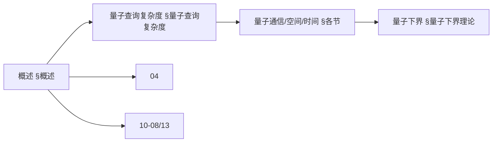
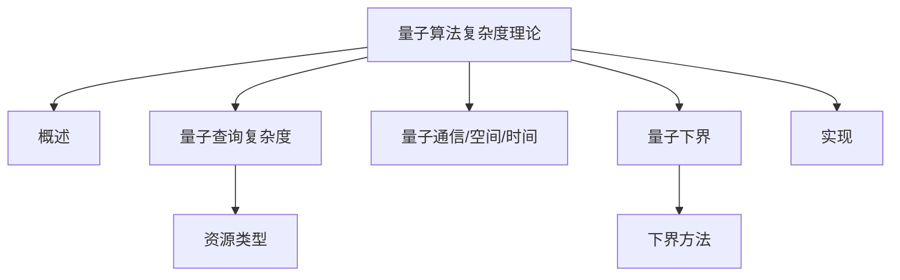
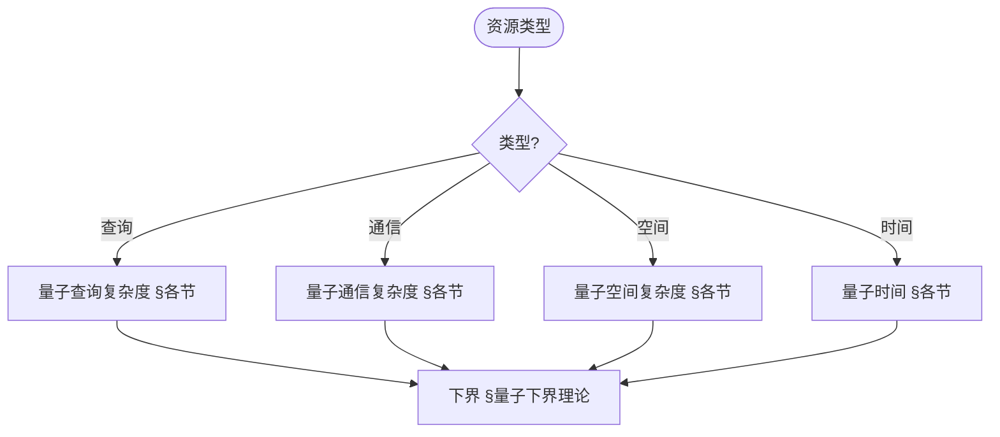
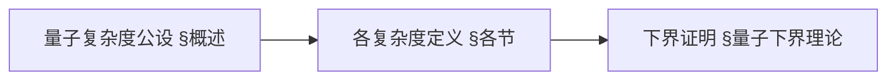
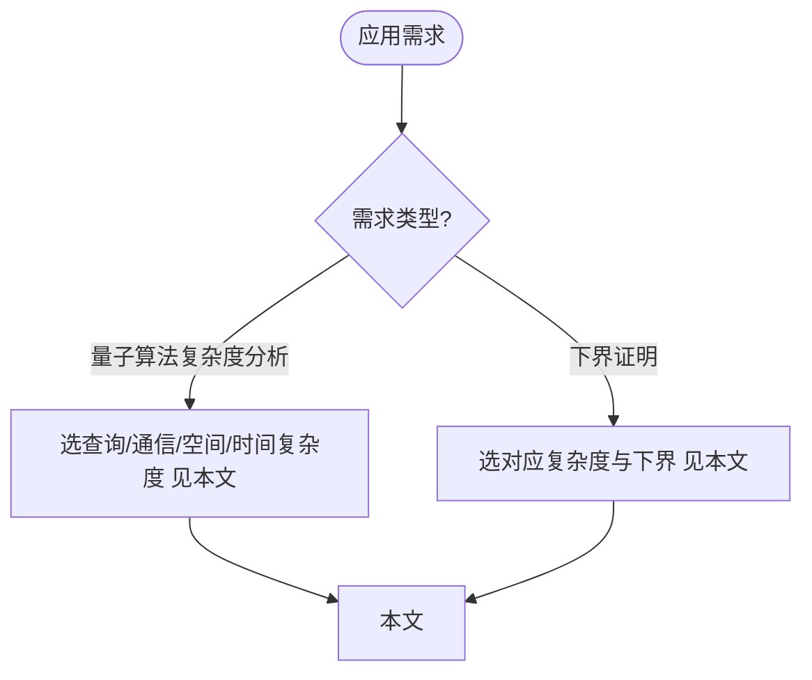

> 📊 **项目全面梳理**：详细的项目结构、模块详解和学习路径，请参阅 [`项目全面梳理-2025.md`](../项目全面梳理-2025.md)

## 10.18 量子算法复杂度理论 / Quantum Algorithm Complexity Theory

### 摘要 / Executive Summary

- 统一量子算法复杂度理论，研究量子查询复杂度、量子通信复杂度和量子算法复杂度分析。
- 建立量子算法复杂度在高级主题中的核心地位。

### 关键术语与符号 / Glossary

- 量子算法复杂度、量子查询复杂度、量子通信复杂度、Grover算法、量子下界、量子上界。
- 术语对齐与引用规范：`docs/术语与符号总表.md`，`01-基础理论/00-撰写规范与引用指南.md`

### 术语与符号规范 / Terminology & Notation

- 量子算法复杂度（Quantum Algorithm Complexity）：量子算法的复杂度分析。
- 量子查询复杂度（Quantum Query Complexity）：量子算法中的查询复杂度。
- 量子通信复杂度（Quantum Communication Complexity）：量子算法中的通信复杂度。
- Grover算法（Grover's Algorithm）：量子搜索算法。
- 记号约定：`Q` 表示查询复杂度，`C` 表示通信复杂度，`T` 表示时间，`S` 表示空间。

### 交叉引用导航 / Cross-References

- 量子计算复杂性理论：参见 `10-高级主题/13-量子计算复杂性理论.md`。
- 量子算法：参见 `09-算法理论/01-算法基础/15-量子算法理论.md`。
- 复杂度理论：参见 `09-算法理论/02-复杂度理论/01-计算复杂度理论.md`。
- 项目导航与对标：见 [项目全面梳理-2025](../项目全面梳理-2025.md)、[项目扩展与持续推进任务编排](../项目扩展与持续推进任务编排.md)、[国际课程对标表](../国际课程对标表.md)。

### 2024-2025 研究进展 / Recent Research Progress (2024-2025)

LWE 量子算法复杂度、QSP 查询复杂度等进展及「进展/撤回」标注见 [09-算法理论/01-算法基础/15-量子算法理论](../09-算法理论/01-算法基础/15-量子算法理论.md) §2024-2025 研究进展、[年度文献清单-2024-2025](../年度文献清单-2024-2025.md) §2.5.1。

### 快速导航 / Quick Links

- 基本概念
- 量子查询复杂度
- 量子通信复杂度

## 目录 / Table of Contents

- [10.18 量子算法复杂度理论 / Quantum Algorithm Complexity Theory](#1018-量子算法复杂度理论--quantum-algorithm-complexity-theory)
  - [摘要 / Executive Summary](#摘要--executive-summary)
  - [关键术语与符号 / Glossary](#关键术语与符号--glossary)
  - [术语与符号规范 / Terminology \& Notation](#术语与符号规范--terminology--notation)
  - [交叉引用导航 / Cross-References](#交叉引用导航--cross-references)
  - [2024-2025 研究进展 / Recent Research Progress (2024-2025)](#2024-2025-研究进展--recent-research-progress-2024-2025)
  - [快速导航 / Quick Links](#快速导航--quick-links)
- [目录 / Table of Contents](#目录--table-of-contents)
- [概述 / Overview](#概述--overview)
  - [内容补充与思维表征 / Content Supplement and Thinking Representation](#内容补充与思维表征--content-supplement-and-thinking-representation)
    - [解释与直观 / Explanation and Intuition](#解释与直观--explanation-and-intuition)
    - [概念属性表 / Concept Attribute Table](#概念属性表--concept-attribute-table)
    - [概念关系 / Concept Relations](#概念关系--concept-relations)
    - [概念依赖图 / Concept Dependency Graph](#概念依赖图--concept-dependency-graph)
    - [论证与证明衔接 / Argumentation and Proof Link](#论证与证明衔接--argumentation-and-proof-link)
    - [思维导图：本章概念结构 / Mind Map](#思维导图本章概念结构--mind-map)
    - [多维矩阵：资源类型与下界方法对比 / Multi-Dimensional Comparison](#多维矩阵资源类型与下界方法对比--multi-dimensional-comparison)
    - [决策树：资源类型到复杂度与下界选择 / Decision Tree](#决策树资源类型到复杂度与下界选择--decision-tree)
    - [公理定理推理证明决策树 / Axiom-Theorem-Proof Tree](#公理定理推理证明决策树--axiom-theorem-proof-tree)
    - [应用决策建模树 / Application Decision Modeling Tree](#应用决策建模树--application-decision-modeling-tree)
- [量子查询复杂度 / Quantum Query Complexity](#量子查询复杂度--quantum-query-complexity)
  - [基本概念 / Basic Concepts](#基本概念--basic-concepts)
    - [查询模型 / Query Model](#查询模型--query-model)
  - [量子查询操作 / Quantum Query Operations](#量子查询操作--quantum-query-operations)
    - [标准查询操作 / Standard Query Operation](#标准查询操作--standard-query-operation)
    - [相位查询操作 / Phase Query Operation](#相位查询操作--phase-query-operation)
  - [经典查询复杂度下界 / Classical Query Complexity Lower Bounds](#经典查询复杂度下界--classical-query-complexity-lower-bounds)
    - [对抗性方法 / Adversary Method](#对抗性方法--adversary-method)
  - [量子查询复杂度上界 / Quantum Query Complexity Upper Bounds](#量子查询复杂度上界--quantum-query-complexity-upper-bounds)
    - [Grover算法 / Grover's Algorithm](#grover算法--grovers-algorithm)
- [量子通信复杂度 / Quantum Communication Complexity](#量子通信复杂度--quantum-communication-complexity)
  - [基本定义 / Basic Definitions](#基本定义--basic-definitions)
    - [确定性通信复杂度 / Deterministic Communication Complexity](#确定性通信复杂度--deterministic-communication-complexity)
    - [1量子通信复杂度 / Quantum Communication Complexity](#1量子通信复杂度--quantum-communication-complexity)
  - [量子通信协议 / Quantum Communication Protocols](#量子通信协议--quantum-communication-protocols)
    - [量子指纹 / Quantum Fingerprinting](#量子指纹--quantum-fingerprinting)
    - [量子随机访问编码 / Quantum Random Access Encoding](#量子随机访问编码--quantum-random-access-encoding)
- [量子空间复杂度 / Quantum Space Complexity](#量子空间复杂度--quantum-space-complexity)
  - [量子空间复杂度定义 / Quantum Space Complexity Definition](#量子空间复杂度定义--quantum-space-complexity-definition)
    - [量子图灵机空间复杂度 / Quantum Turing Machine Space Complexity](#量子图灵机空间复杂度--quantum-turing-machine-space-complexity)
    - [量子电路空间复杂度 / Quantum Circuit Space Complexity](#量子电路空间复杂度--quantum-circuit-space-complexity)
  - [量子空间复杂度类 / Quantum Space Complexity Classes](#量子空间复杂度类--quantum-space-complexity-classes)
    - [BQPSPACE / Bounded-Error Quantum Polynomial Space](#bqpspace--bounded-error-quantum-polynomial-space)
- [量子时间构造 / Quantum Time Construction](#量子时间构造--quantum-time-construction)
  - [量子时间构造技术 / Quantum Time Construction Techniques](#量子时间构造技术--quantum-time-construction-techniques)
    - [量子时间层次定理 / Quantum Time Hierarchy Theorem](#量子时间层次定理--quantum-time-hierarchy-theorem)
- [量子下界理论 / Quantum Lower Bound Theory](#量子下界理论--quantum-lower-bound-theory)
  - [量子下界证明技术 / Quantum Lower Bound Proof Techniques](#量子下界证明技术--quantum-lower-bound-proof-techniques)
    - [多项式方法 / Polynomial Method](#多项式方法--polynomial-method)
    - [1对抗性方法 / Adversary Method](#1对抗性方法--adversary-method)
- [量子复杂度类关系 / Quantum Complexity Class Relations](#量子复杂度类关系--quantum-complexity-class-relations)
  - [量子复杂度类 / Quantum Complexity Classes](#量子复杂度类--quantum-complexity-classes)
    - [BQP / Bounded-Error Quantum Polynomial Time](#bqp--bounded-error-quantum-polynomial-time)
    - [QMA / Quantum Merlin-Arthur](#qma--quantum-merlin-arthur)
  - [复杂度类关系 / Complexity Class Relations](#复杂度类关系--complexity-class-relations)
- [实现示例 / Implementation Examples](#实现示例--implementation-examples)
  - [Rust实现 / Rust Implementation](#rust实现--rust-implementation)
- [总结 / Summary](#总结--summary)

## 概述 / Overview

量子算法复杂度理论研究量子算法在各种计算资源限制下的性能界限，为量子算法的设计和分析提供理论基础。

Quantum algorithm complexity theory studies the performance bounds of quantum algorithms under various computational resource constraints, providing theoretical foundations for the design and analysis of quantum algorithms.

### 内容补充与思维表征 / Content Supplement and Thinking Representation

> 本节按 [内容补充与思维表征全面计划方案](../内容补充与思维表征全面计划方案.md) **只补充、不删除**。标准见 [内容补充标准](../内容补充标准-概念定义属性关系解释论证形式证明.md)、[思维表征模板集](../思维表征模板集.md)。

#### 解释与直观 / Explanation and Intuition

量子算法复杂度理论在各种计算资源限制下研究量子算法的性能界限；量子查询复杂度、通信复杂度、空间复杂度、时间构造与下界理论构成理论栈。与 04-算法复杂度、07-量子计算模型、10-08/13 量子计算复杂性衔接；§概述、§量子查询复杂度及后续各节形成完整表征。

#### 概念属性表 / Concept Attribute Table

| 属性名 | 类型/范围 | 含义 | 备注 |
|--------|-----------|------|------|
| 量子算法复杂度理论 | 理论框架 | 资源界限 | §概述 |
| 量子查询/通信/空间/时间 | 复杂度 | §各节 | 与 04、10-08/13 对照 |
| 量子下界 | 下界理论 | §量子下界理论 | 下界证明技术 |

#### 概念关系 / Concept Relations

| 源概念 | 目标概念 | 关系类型 | 说明 |
|--------|----------|----------|------|
| 量子算法复杂度理论 | 04-算法复杂度、07-量子计算模型、10-08/13 | depends_on | 复杂度与模型基础 |
| 量子算法复杂度理论 | 09-01-15 量子算法、04-通信复杂度 | relates_to | 算法复杂度、通信复杂度 |

#### 概念依赖图 / Concept Dependency Graph



#### 论证与证明衔接 / Argumentation and Proof Link

量子查询/通信/空间/时间形式化见 §各节；下界证明见 §量子下界理论；与 04、07、10-08/13 论证衔接。

#### 思维导图：本章概念结构 / Mind Map



#### 多维矩阵：资源类型与下界方法对比 / Multi-Dimensional Comparison

| 概念/资源 | 资源类型 | 下界方法 | 备注 |
|------------|----------|----------|------|
| 查询/通信/空间/时间 | §各节 | §量子下界理论 | 与 04、10-08/13 对照 |

#### 决策树：资源类型到复杂度与下界选择 / Decision Tree



#### 公理定理推理证明决策树 / Axiom-Theorem-Proof Tree



#### 应用决策建模树 / Application Decision Modeling Tree



## 量子查询复杂度 / Quantum Query Complexity

### 基本概念 / Basic Concepts

量子查询复杂度是衡量量子算法效率的重要指标，它计算算法需要访问黑盒函数的次数。

Quantum query complexity is an important metric for measuring the efficiency of quantum algorithms, counting the number of times an algorithm needs to access a black-box function.

#### 查询模型 / Query Model

**经典查询模型 / Classical Query Model**:

经典算法通过查询黑盒函数 $f: \{0,1\}^n \rightarrow \{0,1\}$ 来获取信息：

Classical algorithms obtain information by querying a black-box function $f: \{0,1\}^n \rightarrow \{0,1\}$:

$$Q_C(f) = \min_{A} \{\text{queries}(A) : A \text{ computes } f\}$$

**量子查询模型 / Quantum Query Model**:

量子算法通过量子查询操作来访问函数：

Quantum algorithms access functions through quantum query operations:

$$Q(f) = \min_{A} \{\text{queries}(A) : A \text{ computes } f\}$$

### 量子查询操作 / Quantum Query Operations

#### 标准查询操作 / Standard Query Operation

$$O_f |x\rangle|b\rangle = |x\rangle|b \oplus f(x)\rangle$$

其中 $x \in \{0,1\}^n$, $b \in \{0,1\}$。

Where $x \in \{0,1\}^n$, $b \in \{0,1\}$.

#### 相位查询操作 / Phase Query Operation

$$O_f |x\rangle = (-1)^{f(x)}|x\rangle$$

```rust
// 量子查询操作实现 / Quantum Query Operations Implementation
pub struct QuantumQueryOracle {
    function: Box<dyn Fn(&[bool]) -> bool>,
}

impl QuantumQueryOracle {
    pub fn new<F>(f: F) -> Self
    where F: Fn(&[bool]) -> bool + 'static {
        QuantumQueryOracle {
            function: Box::new(f),
        }
    }

    pub fn standard_query(&self, x: &[Qubit], b: &mut Qubit) {
        // 应用标准查询操作 / Apply standard query operation
        let x_values: Vec<bool> = x.iter().map(|q| q.measure()).collect();
        let f_x = (self.function)(&x_values);

        if f_x {
            self.apply_x_gate(b);
        }
    }

    pub fn phase_query(&self, x: &mut [Qubit]) {
        // 应用相位查询操作 / Apply phase query operation
        let x_values: Vec<bool> = x.iter().map(|q| q.measure()).collect();
        let f_x = (self.function)(&x_values);

        if f_x {
            // 应用相位翻转 / Apply phase flip
            for qubit in x {
                self.apply_z_gate(qubit);
            }
        }
    }
}
```

### 经典查询复杂度下界 / Classical Query Complexity Lower Bounds

#### 对抗性方法 / Adversary Method

对抗性方法通过构造困难的输入来证明查询复杂度下界：

The adversary method proves query complexity lower bounds by constructing difficult inputs.

**定理 / Theorem**: 对于任何函数 $f: \{0,1\}^n \rightarrow \{0,1\}$，存在一个对抗性矩阵 $\Gamma$ 使得：

**Theorem**: For any function $f: \{0,1\}^n \rightarrow \{0,1\}$, there exists an adversary matrix $\Gamma$ such that:

$$Q(f) \geq \frac{\|\Gamma\|}{\max_{i,j} \|\Gamma \circ D_i\|}$$

其中 $D_i$ 是第 $i$ 位的差异矩阵。

Where $D_i$ is the difference matrix for the $i$-th bit.

```rust
// 对抗性方法实现 / Adversary Method Implementation
pub struct AdversaryMethod {
    function: Box<dyn Fn(&[bool]) -> bool>,
    n: usize,
}

impl AdversaryMethod {
    pub fn calculate_lower_bound(&self) -> f64 {
        // 构造对抗性矩阵 / Construct adversary matrix
        let gamma = self.construct_adversary_matrix();

        // 计算矩阵范数 / Calculate matrix norm
        let gamma_norm = self.matrix_norm(&gamma);

        // 计算最大差异范数 / Calculate maximum difference norm
        let mut max_diff_norm = 0.0;
        for i in 0..self.n {
            let diff_matrix = self.construct_difference_matrix(i);
            let diff_norm = self.matrix_norm(&self.element_wise_product(&gamma, &diff_matrix));
            max_diff_norm = max_diff_norm.max(diff_norm);
        }

        gamma_norm / max_diff_norm
    }

    fn construct_adversary_matrix(&self) -> Matrix {
        // 构造对抗性矩阵 / Construct adversary matrix
        let size = 1 << self.n;
        let mut matrix = Matrix::new(size, size);

        for i in 0..size {
            for j in 0..size {
                let x = self.binary_to_bool_array(i);
                let y = self.binary_to_bool_array(j);

                if (self.function)(&x) != (self.function)(&y) {
                    matrix.set(i, j, 1.0);
                }
            }
        }

        matrix
    }

    fn construct_difference_matrix(&self, bit: usize) -> Matrix {
        // 构造差异矩阵 / Construct difference matrix
        let size = 1 << self.n;
        let mut matrix = Matrix::new(size, size);

        for i in 0..size {
            for j in 0..size {
                let x = self.binary_to_bool_array(i);
                let y = self.binary_to_bool_array(j);

                if x[bit] != y[bit] {
                    matrix.set(i, j, 1.0);
                }
            }
        }

        matrix
    }
}
```

### 量子查询复杂度上界 / Quantum Query Complexity Upper Bounds

#### Grover算法 / Grover's Algorithm

Grover算法展示了量子查询的优势：

Grover's algorithm demonstrates the advantage of quantum queries.

**定理 / Theorem**: 对于搜索问题，量子查询复杂度为 $O(\sqrt{N})$，而经典查询复杂度为 $\Omega(N)$。

**Theorem**: For search problems, quantum query complexity is $O(\sqrt{N})$, while classical query complexity is $\Omega(N)$.

```rust
// Grover算法实现 / Grover's Algorithm Implementation
pub struct GroverAlgorithm {
    oracle: QuantumQueryOracle,
    n: usize,
}

impl GroverAlgorithm {
    pub fn new(oracle: QuantumQueryOracle, n: usize) -> Self {
        GroverAlgorithm { oracle, n }
    }

    pub fn search(&mut self) -> Option<Vec<bool>> {
        let n_qubits = self.n;
        let iterations = ((1 << n_qubits) as f64).sqrt() as usize;

        // 初始化量子寄存器 / Initialize quantum registers
        let mut qubits = vec![Qubit::new(); n_qubits];
        let mut ancilla = Qubit::new();

        // 应用Hadamard门 / Apply Hadamard gates
        self.apply_hadamard_gates(&mut qubits);
        self.apply_hadamard_gate(&mut ancilla);

        // Grover迭代 / Grover iterations
        for _ in 0..iterations {
            // 应用查询操作 / Apply query operation
            self.oracle.phase_query(&mut qubits);

            // 应用扩散操作 / Apply diffusion operation
            self.apply_diffusion(&mut qubits);
        }

        // 测量结果 / Measure result
        let result: Vec<bool> = qubits.iter().map(|q| q.measure()).collect();

        // 验证结果 / Verify result
        if (self.oracle.function)(&result) {
            Some(result)
        } else {
            None
        }
    }

    fn apply_diffusion(&mut self, qubits: &mut [Qubit]) {
        // 应用扩散操作 / Apply diffusion operation
        self.apply_hadamard_gates(qubits);

        // 应用条件相位翻转 / Apply conditional phase flip
        for qubit in qubits {
            self.apply_z_gate(qubit);
        }

        self.apply_hadamard_gates(qubits);
    }
}
```

## 量子通信复杂度 / Quantum Communication Complexity

### 基本定义 / Basic Definitions

量子通信复杂度研究两个或多个参与者使用量子通信解决分布式计算问题所需的最少通信量。

Quantum communication complexity studies the minimum amount of communication required for two or more participants to solve distributed computation problems using quantum communication.

#### 确定性通信复杂度 / Deterministic Communication Complexity

$$D(f) = \min_{\Pi} \{\text{communication}(\Pi) : \Pi \text{ computes } f\}$$

#### 1量子通信复杂度 / Quantum Communication Complexity

$$Q(f) = \min_{\Pi} \{\text{communication}(\Pi) : \Pi \text{ computes } f\}$$

### 量子通信协议 / Quantum Communication Protocols

#### 量子指纹 / Quantum Fingerprinting

量子指纹是一种高效的量子通信协议：

Quantum fingerprinting is an efficient quantum communication protocol.

**定理 / Theorem**: 对于相等性测试，量子通信复杂度为 $O(\log n)$，而经典通信复杂度为 $\Omega(n)$。

**Theorem**: For equality testing, quantum communication complexity is $O(\log n)$, while classical communication complexity is $\Omega(n)$.

```rust
// 量子指纹协议实现 / Quantum Fingerprinting Protocol Implementation
pub struct QuantumFingerprinting {
    hash_function: Box<dyn Fn(&[u8]) -> Vec<Complex<f64>>>,
}

impl QuantumFingerprinting {
    pub fn new(hash_function: Box<dyn Fn(&[u8]) -> Vec<Complex<f64>>>) -> Self {
        QuantumFingerprinting { hash_function }
    }

    pub fn create_fingerprint(&self, data: &[u8]) -> Vec<Qubit> {
        // 计算哈希值 / Calculate hash values
        let hash_values = (self.hash_function)(data);

        // 创建量子指纹 / Create quantum fingerprint
        let mut fingerprint = Vec::new();
        for &value in &hash_values {
            let qubit = self.create_qubit_from_complex(value);
            fingerprint.push(qubit);
        }

        fingerprint
    }

    pub fn test_equality(&self, fingerprint1: &[Qubit], fingerprint2: &[Qubit]) -> bool {
        // 应用SWAP测试 / Apply SWAP test
        let mut ancilla = Qubit::new();

        // 准备Bell态 / Prepare Bell state
        self.apply_hadamard_gate(&mut ancilla);

        // 应用受控SWAP / Apply controlled SWAP
        for (q1, q2) in fingerprint1.iter().zip(fingerprint2.iter()) {
            self.apply_controlled_swap(&mut ancilla, q1, q2);
        }

        // 应用Hadamard门 / Apply Hadamard gate
        self.apply_hadamard_gate(&mut ancilla);

        // 测量ancilla / Measure ancilla
        !ancilla.measure() // 如果测量结果为0，则输入相等 / If measurement result is 0, inputs are equal
    }

    fn create_qubit_from_complex(&self, value: Complex<f64>) -> Qubit {
        // 从复数创建量子比特 / Create qubit from complex number
        let magnitude = value.norm();
        let phase = value.arg();

        let mut qubit = Qubit::new();
        self.apply_rotation_gate(&mut qubit, phase);
        self.apply_amplitude_encoding(&mut qubit, magnitude);

        qubit
    }
}
```

#### 量子随机访问编码 / Quantum Random Access Encoding

量子随机访问编码允许高效地访问编码数据的任意部分：

Quantum random access encoding allows efficient access to arbitrary parts of encoded data.

```rust
// 量子随机访问编码实现 / Quantum Random Access Encoding Implementation
pub struct QuantumRandomAccessCode {
    encoding_function: Box<dyn Fn(&[bool], usize) -> Vec<Qubit>>,
    decoding_function: Box<dyn Fn(&[Qubit], usize) -> bool>,
}

impl QuantumRandomAccessCode {
    pub fn new<F, G>(encode: F, decode: G) -> Self
    where F: Fn(&[bool], usize) -> Vec<Qubit> + 'static,
          G: Fn(&[Qubit], usize) -> bool + 'static {
        QuantumRandomAccessCode {
            encoding_function: Box::new(encode),
            decoding_function: Box::new(decode),
        }
    }

    pub fn encode(&self, data: &[bool]) -> Vec<Qubit> {
        // 编码整个数据 / Encode entire data
        let mut encoded = Vec::new();
        for i in 0..data.len() {
            let partial_encoding = (self.encoding_function)(data, i);
            encoded.extend(partial_encoding);
        }
        encoded
    }

    pub fn decode(&self, encoded: &[Qubit], index: usize) -> bool {
        // 解码指定位置的数据 / Decode data at specified position
        (self.decoding_function)(encoded, index)
    }
}
```

## 量子空间复杂度 / Quantum Space Complexity

### 量子空间复杂度定义 / Quantum Space Complexity Definition

量子空间复杂度衡量量子算法在执行过程中需要的量子比特数量：

Quantum space complexity measures the number of qubits required by a quantum algorithm during execution.

#### 量子图灵机空间复杂度 / Quantum Turing Machine Space Complexity

$$QSPACE(f) = \min_{M} \{\text{space}(M) : M \text{ computes } f\}$$

#### 量子电路空间复杂度 / Quantum Circuit Space Complexity

$$QSPACE_{circuit}(f) = \min_{C} \{\text{width}(C) : C \text{ computes } f\}$$

### 量子空间复杂度类 / Quantum Space Complexity Classes

#### BQPSPACE / Bounded-Error Quantum Polynomial Space

**定义 / Definition**: BQPSPACE是可以在多项式空间内以有界错误概率解决的量子问题类。

**Definition**: BQPSPACE is the class of quantum problems that can be solved with bounded error probability in polynomial space.

**定理 / Theorem**: BQPSPACE = PSPACE

```rust
// 量子空间复杂度分析 / Quantum Space Complexity Analysis
pub struct QuantumSpaceAnalyzer {
    circuit: QuantumCircuit,
}

impl QuantumSpaceAnalyzer {
    pub fn analyze_space_complexity(&self) -> SpaceComplexity {
        let width = self.circuit.width();
        let depth = self.circuit.depth();

        // 计算空间复杂度 / Calculate space complexity
        let space_complexity = self.calculate_space_usage(width, depth);

        // 确定复杂度类 / Determine complexity class
        let complexity_class = self.determine_complexity_class(space_complexity);

        SpaceComplexity {
            width,
            depth,
            space_usage: space_complexity,
            complexity_class,
        }
    }

    fn calculate_space_usage(&self, width: usize, depth: usize) -> usize {
        // 计算实际空间使用量 / Calculate actual space usage
        let mut max_space = width;

        // 考虑中间计算的空间需求 / Consider space requirements for intermediate computations
        for layer in self.circuit.layers() {
            let layer_space = self.calculate_layer_space(layer);
            max_space = max_space.max(layer_space);
        }

        max_space
    }

    fn determine_complexity_class(&self, space: usize) -> ComplexityClass {
        if space <= self.polynomial_bound() {
            ComplexityClass::BQPSPACE
        } else if space <= self.exponential_bound() {
            ComplexityClass::BQEXPSPACE
        } else {
            ComplexityClass::BQEXPSPACE
        }
    }
}
```

## 量子时间构造 / Quantum Time Construction

### 量子时间构造技术 / Quantum Time Construction Techniques

量子时间构造研究如何构造具有特定时间复杂度的量子算法：

Quantum time construction studies how to construct quantum algorithms with specific time complexity.

#### 量子时间层次定理 / Quantum Time Hierarchy Theorem

**定理 / Theorem**: 对于时间可构造函数 $t_1(n)$ 和 $t_2(n)$，如果 $t_1(n) \log t_1(n) = o(t_2(n))$，则：

**Theorem**: For time-constructible functions $t_1(n)$ and $t_2(n)$, if $t_1(n) \log t_1(n) = o(t_2(n))$, then:

$$QTIME(t_1(n)) \subsetneq QTIME(t_2(n))$$

```rust
// 量子时间构造实现 / Quantum Time Construction Implementation
pub struct QuantumTimeConstructor {
    time_function: Box<dyn Fn(usize) -> usize>,
}

impl QuantumTimeConstructor {
    pub fn new<F>(time_func: F) -> Self
    where F: Fn(usize) -> usize + 'static {
        QuantumTimeConstructor {
            time_function: Box::new(time_func),
        }
    }

    pub fn construct_algorithm(&self, input_size: usize) -> QuantumAlgorithm {
        let time_bound = (self.time_function)(input_size);

        // 构造满足时间界限的算法 / Construct algorithm satisfying time bound
        let mut algorithm = QuantumAlgorithm::new();

        // 添加时间控制机制 / Add time control mechanism
        algorithm.set_time_bound(time_bound);

        // 构造算法步骤 / Construct algorithm steps
        for step in 0..time_bound {
            algorithm.add_step(self.construct_step(step, input_size));
        }

        algorithm
    }

    fn construct_step(&self, step: usize, input_size: usize) -> AlgorithmStep {
        // 构造算法步骤 / Construct algorithm step
        match step {
            0 => AlgorithmStep::Initialize,
            1 => AlgorithmStep::ApplyHadamard,
            2 => AlgorithmStep::ApplyOracle,
            3 => AlgorithmStep::ApplyDiffusion,
            4 => AlgorithmStep::Measure,
            _ => AlgorithmStep::Identity,
        }
    }
}
```

## 量子下界理论 / Quantum Lower Bound Theory

### 量子下界证明技术 / Quantum Lower Bound Proof Techniques

#### 多项式方法 / Polynomial Method

多项式方法通过将量子算法转换为多项式来证明下界：

The polynomial method proves lower bounds by converting quantum algorithms to polynomials.

**定理 / Theorem**: 如果量子算法在 $T$ 次查询后计算函数 $f$，则存在次数为 $2T$ 的多项式 $p$ 使得：

**Theorem**: If a quantum algorithm computes function $f$ after $T$ queries, then there exists a polynomial $p$ of degree $2T$ such that:

$$p(x) = f(x) \quad \forall x \in \{0,1\}^n$$

```rust
// 多项式方法实现 / Polynomial Method Implementation
pub struct PolynomialMethod {
    function: Box<dyn Fn(&[bool]) -> bool>,
    n: usize,
}

impl PolynomialMethod {
    pub fn prove_lower_bound(&self) -> usize {
        // 构造函数的多项式表示 / Construct polynomial representation of function
        let polynomial = self.construct_polynomial();

        // 计算多项式次数 / Calculate polynomial degree
        let degree = self.calculate_degree(&polynomial);

        // 量子查询复杂度下界 / Quantum query complexity lower bound
        degree / 2
    }

    fn construct_polynomial(&self) -> Polynomial {
        // 构造函数的多项式表示 / Construct polynomial representation of function
        let mut polynomial = Polynomial::new();

        for i in 0..(1 << self.n) {
            let x = self.binary_to_bool_array(i);
            let f_x = (self.function)(&x);

            if f_x {
                let term = self.construct_term(i);
                polynomial.add_term(term);
            }
        }

        polynomial
    }

    fn construct_term(&self, index: usize) -> Term {
        // 构造多项式项 / Construct polynomial term
        let mut term = Term::new();

        for i in 0..self.n {
            let bit = (index >> i) & 1;
            if bit == 1 {
                term.add_variable(i);
            }
        }

        term
    }
}
```

#### 1对抗性方法 / Adversary Method

对抗性方法通过构造困难的输入对来证明下界：

The adversary method proves lower bounds by constructing difficult input pairs.

```rust
// 对抗性方法实现 / Adversary Method Implementation
pub struct AdversaryMethod {
    function: Box<dyn Fn(&[bool]) -> bool>,
    n: usize,
}

impl AdversaryMethod {
    pub fn prove_lower_bound(&self) -> f64 {
        // 构造对抗性矩阵 / Construct adversary matrix
        let gamma = self.construct_adversary_matrix();

        // 计算矩阵范数 / Calculate matrix norm
        let gamma_norm = self.matrix_norm(&gamma);

        // 计算最大差异范数 / Calculate maximum difference norm
        let mut max_diff_norm = 0.0;
        for i in 0..self.n {
            let diff_matrix = self.construct_difference_matrix(i);
            let diff_norm = self.matrix_norm(&self.element_wise_product(&gamma, &diff_matrix));
            max_diff_norm = max_diff_norm.max(diff_norm);
        }

        gamma_norm / max_diff_norm
    }

    fn construct_adversary_matrix(&self) -> Matrix {
        // 构造对抗性矩阵 / Construct adversary matrix
        let size = 1 << self.n;
        let mut matrix = Matrix::new(size, size);

        for i in 0..size {
            for j in 0..size {
                let x = self.binary_to_bool_array(i);
                let y = self.binary_to_bool_array(j);

                if (self.function)(&x) != (self.function)(&y) {
                    matrix.set(i, j, 1.0);
                }
            }
        }

        matrix
    }
}
```

## 量子复杂度类关系 / Quantum Complexity Class Relations

### 量子复杂度类 / Quantum Complexity Classes

#### BQP / Bounded-Error Quantum Polynomial Time

**定义 / Definition**: BQP是可以在多项式时间内以有界错误概率解决的量子问题类。

**Definition**: BQP is the class of quantum problems that can be solved with bounded error probability in polynomial time.

#### QMA / Quantum Merlin-Arthur

**定义 / Definition**: QMA是量子版本的NP类，其中证明者是量子系统。

**Definition**: QMA is the quantum version of NP class, where the prover is a quantum system.

### 复杂度类关系 / Complexity Class Relations

**已知关系 / Known Relations**:

1. $P \subseteq BPP \subseteq BQP$
2. $BQP \subseteq PSPACE$
3. $NP \subseteq QMA$
4. $QMA \subseteq PP$

```rust
// 量子复杂度类分析 / Quantum Complexity Class Analysis
pub struct QuantumComplexityAnalyzer {
    problem: Box<dyn QuantumProblem>,
}

impl QuantumComplexityAnalyzer {
    pub fn analyze_complexity(&self) -> ComplexityClass {
        // 分析问题的时间复杂度 / Analyze time complexity of problem
        let time_complexity = self.analyze_time_complexity();

        // 分析问题的空间复杂度 / Analyze space complexity of problem
        let space_complexity = self.analyze_space_complexity();

        // 确定复杂度类 / Determine complexity class
        self.determine_complexity_class(time_complexity, space_complexity)
    }

    fn determine_complexity_class(&self, time: TimeComplexity, space: SpaceComplexity) -> ComplexityClass {
        match (time, space) {
            (TimeComplexity::Polynomial, SpaceComplexity::Polynomial) => ComplexityClass::BQP,
            (TimeComplexity::Polynomial, SpaceComplexity::Exponential) => ComplexityClass::BQPSPACE,
            (TimeComplexity::Exponential, _) => ComplexityClass::BQEXPTIME,
            _ => ComplexityClass::Unknown,
        }
    }
}
```

## 实现示例 / Implementation Examples

### Rust实现 / Rust Implementation

```rust
use std::collections::HashMap;
use num_complex::Complex;

// 量子复杂度分析器 / Quantum Complexity Analyzer
pub struct QuantumComplexityAnalyzer {
    algorithms: HashMap<String, Box<dyn QuantumAlgorithm>>,
}

impl QuantumComplexityAnalyzer {
    pub fn new() -> Self {
        QuantumComplexityAnalyzer {
            algorithms: HashMap::new(),
        }
    }

    pub fn analyze_algorithm(&self, name: &str) -> ComplexityAnalysis {
        if let Some(algorithm) = self.algorithms.get(name) {
            let query_complexity = self.analyze_query_complexity(algorithm);
            let communication_complexity = self.analyze_communication_complexity(algorithm);
            let space_complexity = self.analyze_space_complexity(algorithm);
            let time_complexity = self.analyze_time_complexity(algorithm);

            ComplexityAnalysis {
                name: name.to_string(),
                query_complexity,
                communication_complexity,
                space_complexity,
                time_complexity,
            }
        } else {
            panic!("Algorithm not found: {}", name);
        }
    }

    fn analyze_query_complexity(&self, algorithm: &dyn QuantumAlgorithm) -> QueryComplexity {
        // 分析查询复杂度 / Analyze query complexity
        let oracle_calls = algorithm.count_oracle_calls();
        let query_bound = self.calculate_query_bound(oracle_calls);

        QueryComplexity {
            oracle_calls,
            upper_bound: query_bound.upper,
            lower_bound: query_bound.lower,
        }
    }

    fn analyze_communication_complexity(&self, algorithm: &dyn QuantumAlgorithm) -> CommunicationComplexity {
        // 分析通信复杂度 / Analyze communication complexity
        let qubits_sent = algorithm.count_qubits_sent();
        let classical_bits_sent = algorithm.count_classical_bits_sent();

        CommunicationComplexity {
            quantum_bits: qubits_sent,
            classical_bits: classical_bits_sent,
            total_communication: qubits_sent + classical_bits_sent,
        }
    }

    fn analyze_space_complexity(&self, algorithm: &dyn QuantumAlgorithm) -> SpaceComplexity {
        // 分析空间复杂度 / Analyze space complexity
        let qubits_used = algorithm.count_qubits_used();
        let ancilla_qubits = algorithm.count_ancilla_qubits();

        SpaceComplexity {
            data_qubits: qubits_used,
            ancilla_qubits,
            total_qubits: qubits_used + ancilla_qubits,
        }
    }

    fn analyze_time_complexity(&self, algorithm: &dyn QuantumAlgorithm) -> TimeComplexity {
        // 分析时间复杂度 / Analyze time complexity
        let gate_count = algorithm.count_gates();
        let circuit_depth = algorithm.circuit_depth();

        TimeComplexity {
            gate_count,
            circuit_depth,
            time_bound: self.calculate_time_bound(gate_count, circuit_depth),
        }
    }
}

// 复杂度分析结果 / Complexity Analysis Results
#[derive(Debug)]
pub struct ComplexityAnalysis {
    name: String,
    query_complexity: QueryComplexity,
    communication_complexity: CommunicationComplexity,
    space_complexity: SpaceComplexity,
    time_complexity: TimeComplexity,
}

#[derive(Debug)]
pub struct QueryComplexity {
    oracle_calls: usize,
    upper_bound: f64,
    lower_bound: f64,
}

#[derive(Debug)]
pub struct CommunicationComplexity {
    quantum_bits: usize,
    classical_bits: usize,
    total_communication: usize,
}

#[derive(Debug)]
pub struct SpaceComplexity {
    data_qubits: usize,
    ancilla_qubits: usize,
    total_qubits: usize,
}

#[derive(Debug)]
pub struct TimeComplexity {
    gate_count: usize,
    circuit_depth: usize,
    time_bound: f64,
}

// 主函数示例 / Main Function Example
fn main() {
    // 创建复杂度分析器 / Create complexity analyzer
    let mut analyzer = QuantumComplexityAnalyzer::new();

    // 添加算法 / Add algorithms
    analyzer.algorithms.insert(
        "Grover".to_string(),
        Box::new(GroverAlgorithm::new(QuantumQueryOracle::new(|x| x[0]), 10)),
    );

    analyzer.algorithms.insert(
        "Shor".to_string(),
        Box::new(ShorAlgorithm::new(15)),
    );

    // 分析算法复杂度 / Analyze algorithm complexity
    let grover_analysis = analyzer.analyze_algorithm("Grover");
    let shor_analysis = analyzer.analyze_algorithm("Shor");

    println!("Grover算法复杂度分析 / Grover Algorithm Complexity Analysis:");
    println!("{:?}", grover_analysis);

    println!("\nShor算法复杂度分析 / Shor Algorithm Complexity Analysis:");
    println!("{:?}", shor_analysis);
}
```

## 总结 / Summary

量子算法复杂度理论为量子算法的设计和分析提供了重要的理论基础：

Quantum algorithm complexity theory provides important theoretical foundations for the design and analysis of quantum algorithms:

1. **查询复杂度 / Query Complexity**: 衡量量子算法访问黑盒函数的效率
2. **通信复杂度 / Communication Complexity**: 研究分布式量子计算中的通信需求
3. **空间复杂度 / Space Complexity**: 分析量子算法对量子比特的需求
4. **时间构造 / Time Construction**: 构造具有特定时间复杂度的量子算法
5. **下界理论 / Lower Bound Theory**: 证明量子算法的性能界限

这些理论为理解量子计算的优势和局限性提供了重要工具，也为设计更高效的量子算法提供了指导。

These theories provide important tools for understanding the advantages and limitations of quantum computing, and also provide guidance for designing more efficient quantum algorithms.

---

**参考文献 / References**:

1. Nielsen, M. A., & Chuang, I. L. (2010). Quantum computation and quantum information.
2. Buhrman, H., & de Wolf, R. (2002). Complexity measures and decision tree complexity.
3. Kushilevitz, E., & Nisan, N. (2006). Communication complexity.
4. Watrous, J. (2009). Quantum computational complexity.
5. Aaronson, S. (2013). Quantum computing since Democritus.
