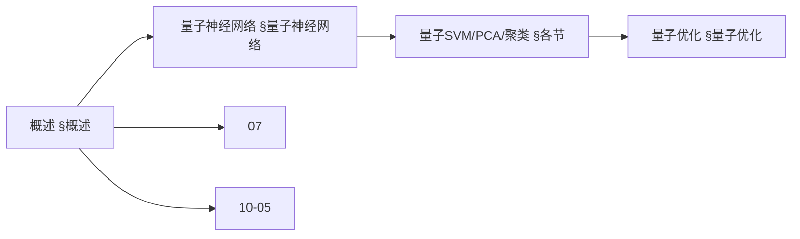
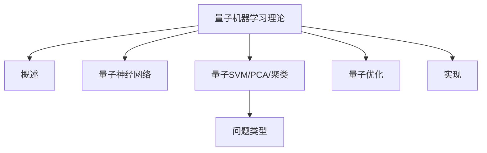
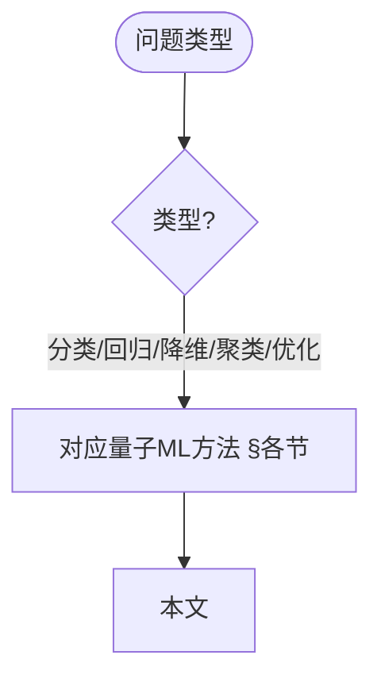
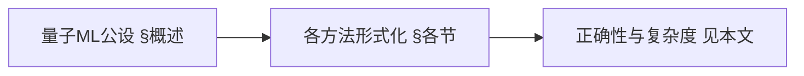
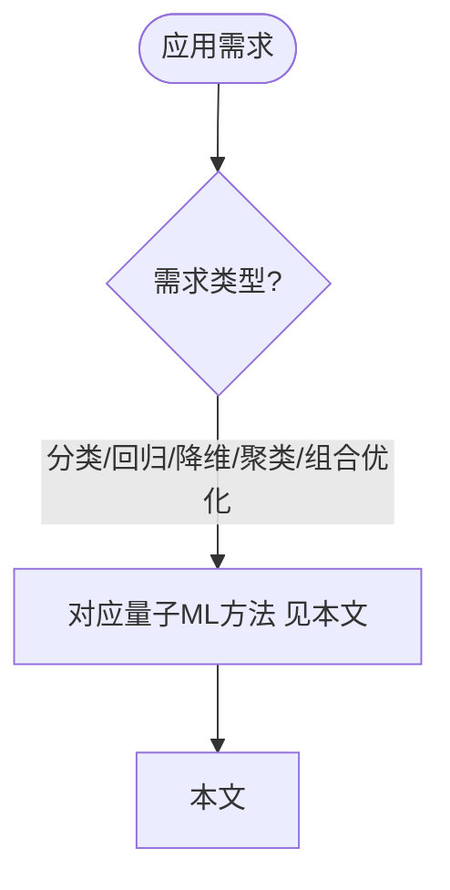

> 📊 **项目全面梳理**：详细的项目结构、模块详解和学习路径，请参阅 [`项目全面梳理-2025.md`](../项目全面梳理-2025.md)

## 10.19 量子机器学习理论 / Quantum Machine Learning Theory

### 摘要 / Executive Summary

- 统一量子机器学习理论，研究如何利用量子系统的特性来加速机器学习算法。
- 建立量子机器学习在高级主题中的核心地位。

### 关键术语与符号 / Glossary

- 量子机器学习、量子神经网络、量子支持向量机、量子主成分分析、量子优势、量子变分算法。
- 术语对齐与引用规范：`docs/术语与符号总表.md`，`01-基础理论/00-撰写规范与引用指南.md`

### 术语与符号规范 / Terminology & Notation

- 量子机器学习（Quantum Machine Learning）：结合量子计算与机器学习的领域。
- 量子神经网络（Quantum Neural Network）：基于量子计算的神经网络。
- 量子支持向量机（Quantum Support Vector Machine）：量子版本的SVM。
- 量子优势（Quantum Advantage）：量子算法相对于经典算法的优势。
- 记号约定：`|ψ⟩` 表示量子态，`U` 表示量子门，`θ` 表示参数，`L` 表示损失函数。

### 交叉引用导航 / Cross-References

- 量子机器学习：参见 `10-高级主题/05-量子机器学习.md`。
- 量子机器学习算法应用：参见 `12-应用领域/10-量子机器学习算法应用.md`。
- 神经网络算法：参见 `09-算法理论/01-算法基础/17-神经网络算法理论.md`。
- 项目导航与对标：见 [项目全面梳理-2025](../项目全面梳理-2025.md)、[项目扩展与持续推进任务编排](../项目扩展与持续推进任务编排.md)、[国际课程对标表](../国际课程对标表.md)。

### 快速导航 / Quick Links

- 基本概念
- 量子神经网络
- 量子支持向量机

## 目录 (Table of Contents)

- [10.19 量子机器学习理论 / Quantum Machine Learning Theory](#1019-量子机器学习理论--quantum-machine-learning-theory)
  - [摘要 / Executive Summary](#摘要--executive-summary)
  - [关键术语与符号 / Glossary](#关键术语与符号--glossary)
  - [术语与符号规范 / Terminology \& Notation](#术语与符号规范--terminology--notation)
  - [交叉引用导航 / Cross-References](#交叉引用导航--cross-references)
  - [快速导航 / Quick Links](#快速导航--quick-links)

## 概述 / Overview

量子机器学习理论结合量子计算和机器学习，研究如何利用量子系统的特性来加速机器学习算法，实现经典机器学习无法达到的性能。

Quantum machine learning theory combines quantum computing and machine learning, studying how to leverage quantum system properties to accelerate machine learning algorithms and achieve performance beyond classical machine learning.

### 内容补充与思维表征 / Content Supplement and Thinking Representation

> 本节按 [内容补充与思维表征全面计划方案](../内容补充与思维表征全面计划方案.md) **只补充、不删除**。标准见 [内容补充标准](../内容补充标准-概念定义属性关系解释论证形式证明.md)、[思维表征模板集](../思维表征模板集.md)。

#### 解释与直观 / Explanation and Intuition

量子机器学习理论结合量子计算与机器学习，利用量子叠加与纠缠加速学习；量子神经网络、量子SVM、量子PCA、量子聚类与量子优化构成方法谱系。与 07-量子计算模型、09-01-17 神经网络、10-05 量子机器学习衔接；§概述、§量子神经网络及后续各节形成完整表征。

#### 概念属性表 / Concept Attribute Table

| 属性名 | 类型/范围 | 含义 | 备注 |
|--------|-----------|------|------|
| 量子机器学习理论 | 理论框架 | §概述 | 与 10-05、10-28 对照 |
| 量子神经网络/量子SVM/PCA/聚类/量子优化 | 方法 | 问题类型、量子优势、复杂度 | §量子神经网络及后续各节 |

#### 概念关系 / Concept Relations

| 源概念 | 目标概念 | 关系类型 | 说明 |
|--------|----------|----------|------|
| 量子机器学习理论(10-19) | 07-量子计算模型、09-01-17 神经网络、10-05 量子机器学习 | depends_on | 计算与学习基础 |
| 量子机器学习理论(10-19) | 10-28 算法量子机器学习、04-复杂度 | relates_to | 专题衔接、学习复杂度 |

#### 概念依赖图 / Concept Dependency Graph



#### 论证与证明衔接 / Argumentation and Proof Link

各方法形式化见 §各节；与 07、09-01-17、10-05 论证衔接；正确性与复杂度见本文。

#### 思维导图：本章概念结构 / Mind Map



#### 多维矩阵：量子ML方法对比 / Multi-Dimensional Comparison

| 概念/方法 | 问题类型 | 量子优势 | 复杂度 | 备注 |
|-----------|----------|----------|--------|------|
| 量子神经网络/量子SVM/PCA/聚类/量子优化 | §各节 | §各节 | §各节 | 与 10-05 对照 |

#### 决策树：问题类型到方法选择 / Decision Tree



#### 公理定理推理证明决策树 / Axiom-Theorem-Proof Tree



#### 应用决策建模树 / Application Decision Modeling Tree



## 量子神经网络 / Quantum Neural Networks

### 基本概念 / Basic Concepts

量子神经网络是经典神经网络在量子计算框架下的推广，利用量子叠加和纠缠来增强计算能力。

Quantum neural networks are generalizations of classical neural networks in the quantum computing framework, leveraging quantum superposition and entanglement to enhance computational power.

#### 量子神经元 / Quantum Neuron

量子神经元是量子神经网络的基本单元：

Quantum neurons are the basic units of quantum neural networks:

$$|\psi_{out}\rangle = U(\theta)|\psi_{in}\rangle$$

其中 $U(\theta)$ 是参数化的酉算子。

Where $U(\theta)$ is a parameterized unitary operator.

```rust
// 量子神经元实现 / Quantum Neuron Implementation
pub struct QuantumNeuron {
    parameters: Vec<f64>,
    unitary_gates: Vec<UnitaryGate>,
}

impl QuantumNeuron {
    pub fn new(num_parameters: usize) -> Self {
        QuantumNeuron {
            parameters: vec![0.0; num_parameters],
            unitary_gates: Vec::new(),
        }
    }

    pub fn forward(&self, input_qubits: &[Qubit]) -> Vec<Qubit> {
        let mut output_qubits = input_qubits.to_vec();

        // 应用参数化酉算子 / Apply parameterized unitary operators
        for (i, gate) in self.unitary_gates.iter().enumerate() {
            let parameter = self.parameters[i];
            self.apply_parameterized_gate(gate, parameter, &mut output_qubits);
        }

        output_qubits
    }

    pub fn update_parameters(&mut self, gradients: &[f64], learning_rate: f64) {
        // 更新参数 / Update parameters
        for (param, grad) in self.parameters.iter_mut().zip(gradients.iter()) {
            *param -= learning_rate * grad;
        }
    }

    fn apply_parameterized_gate(&self, gate: &UnitaryGate, parameter: f64, qubits: &mut [Qubit]) {
        match gate {
            UnitaryGate::RotationX => {
                for qubit in qubits {
                    self.apply_rx_gate(qubit, parameter);
                }
            }
            UnitaryGate::RotationY => {
                for qubit in qubits {
                    self.apply_ry_gate(qubit, parameter);
                }
            }
            UnitaryGate::RotationZ => {
                for qubit in qubits {
                    self.apply_rz_gate(qubit, parameter);
                }
            }
        }
    }
}
```

### 量子神经网络架构 / Quantum Neural Network Architecture

#### 变分量子电路 / Variational Quantum Circuits

变分量子电路是量子神经网络的主要实现方式：

Variational quantum circuits are the main implementation of quantum neural networks.

```rust
// 变分量子电路实现 / Variational Quantum Circuit Implementation
pub struct VariationalQuantumCircuit {
    layers: Vec<QuantumLayer>,
    num_qubits: usize,
    num_parameters: usize,
}

impl VariationalQuantumCircuit {
    pub fn new(num_qubits: usize) -> Self {
        VariationalQuantumCircuit {
            layers: Vec::new(),
            num_qubits,
            num_parameters: 0,
        }
    }

    pub fn add_layer(&mut self, layer: QuantumLayer) {
        self.num_parameters += layer.num_parameters();
        self.layers.push(layer);
    }

    pub fn forward(&self, input_qubits: &[Qubit], parameters: &[f64]) -> Vec<Qubit> {
        let mut current_qubits = input_qubits.to_vec();
        let mut param_index = 0;

        // 逐层应用 / Apply layer by layer
        for layer in &self.layers {
            let layer_params = &parameters[param_index..param_index + layer.num_parameters()];
            current_qubits = layer.forward(&current_qubits, layer_params);
            param_index += layer.num_parameters();
        }

        current_qubits
    }

    pub fn backward(&self, gradients: &[f64]) -> Vec<f64> {
        // 计算参数梯度 / Calculate parameter gradients
        let mut all_gradients = Vec::new();

        for layer in self.layers.iter().rev() {
            let layer_gradients = layer.backward(gradients);
            all_gradients.extend(layer_gradients);
        }

        all_gradients.reverse();
        all_gradients
    }
}

// 量子层 / Quantum Layer
pub struct QuantumLayer {
    gates: Vec<ParameterizedGate>,
}

impl QuantumLayer {
    pub fn new() -> Self {
        QuantumLayer {
            gates: Vec::new(),
        }
    }

    pub fn add_gate(&mut self, gate: ParameterizedGate) {
        self.gates.push(gate);
    }

    pub fn num_parameters(&self) -> usize {
        self.gates.iter().map(|g| g.num_parameters()).sum()
    }

    pub fn forward(&self, qubits: &[Qubit], parameters: &[f64]) -> Vec<Qubit> {
        let mut output_qubits = qubits.to_vec();
        let mut param_index = 0;

        for gate in &self.gates {
            let gate_params = &parameters[param_index..param_index + gate.num_parameters()];
            output_qubits = gate.apply(&output_qubits, gate_params);
            param_index += gate.num_parameters();
        }

        output_qubits
    }

    pub fn backward(&self, gradients: &[f64]) -> Vec<f64> {
        // 计算层梯度 / Calculate layer gradients
        let mut layer_gradients = Vec::new();

        for gate in &self.gates {
            let gate_gradients = gate.calculate_gradients(gradients);
            layer_gradients.extend(gate_gradients);
        }

        layer_gradients
    }
}
```

## 量子支持向量机 / Quantum Support Vector Machine

### 1基本概念 / Basic Concepts

量子支持向量机利用量子计算来加速核函数的计算和优化过程：

Quantum support vector machines use quantum computing to accelerate kernel function computation and optimization processes.

#### 量子核函数 / Quantum Kernel Function

量子核函数利用量子系统的内积来计算相似性：

Quantum kernel functions use inner products of quantum systems to compute similarity:

$$K(x_i, x_j) = |\langle\phi(x_i)|\phi(x_j)\rangle|^2$$

其中 $|\phi(x)\rangle$ 是数据点 $x$ 的量子表示。

Where $|\phi(x)\rangle$ is the quantum representation of data point $x$.

```rust
// 量子核函数实现 / Quantum Kernel Function Implementation
pub struct QuantumKernel {
    feature_map: Box<dyn QuantumFeatureMap>,
    num_qubits: usize,
}

impl QuantumKernel {
    pub fn new(feature_map: Box<dyn QuantumFeatureMap>, num_qubits: usize) -> Self {
        QuantumKernel {
            feature_map,
            num_qubits,
        }
    }

    pub fn compute_kernel(&self, x1: &[f64], x2: &[f64]) -> f64 {
        // 将经典数据映射到量子态 / Map classical data to quantum states
        let phi_x1 = self.feature_map.map(x1);
        let phi_x2 = self.feature_map.map(x2);

        // 计算量子内积 / Compute quantum inner product
        let inner_product = self.compute_inner_product(&phi_x1, &phi_x2);

        // 返回核函数值 / Return kernel function value
        inner_product.norm_sqr()
    }

    fn compute_inner_product(&self, state1: &[Qubit], state2: &[Qubit]) -> Complex<f64> {
        // 使用SWAP测试计算内积 / Use SWAP test to compute inner product
        let mut ancilla = Qubit::new();

        // 准备Bell态 / Prepare Bell state
        self.apply_hadamard_gate(&mut ancilla);

        // 应用受控SWAP / Apply controlled SWAP
        for (q1, q2) in state1.iter().zip(state2.iter()) {
            self.apply_controlled_swap(&mut ancilla, q1, q2);
        }

        // 应用Hadamard门 / Apply Hadamard gate
        self.apply_hadamard_gate(&mut ancilla);

        // 测量ancilla / Measure ancilla
        let measurement = ancilla.measure();

        // 计算内积 / Calculate inner product
        if measurement {
            Complex::new(0.0, 0.0)
        } else {
            Complex::new(1.0, 0.0)
        }
    }
}

// 量子特征映射 / Quantum Feature Map
pub trait QuantumFeatureMap {
    fn map(&self, data: &[f64]) -> Vec<Qubit>;
}

pub struct AngleEncoding {
    num_qubits: usize,
}

impl AngleEncoding {
    pub fn new(num_qubits: usize) -> Self {
        AngleEncoding { num_qubits }
    }
}

impl QuantumFeatureMap for AngleEncoding {
    fn map(&self, data: &[f64]) -> Vec<Qubit> {
        let mut qubits = vec![Qubit::new(); self.num_qubits];

        for (i, qubit) in qubits.iter_mut().enumerate() {
            if i < data.len() {
                let angle = data[i] * std::f64::consts::PI;
                self.apply_ry_gate(qubit, angle);
            }
        }

        qubits
    }
}
```

### 量子SVM训练 / Quantum SVM Training

```rust
// 量子SVM实现 / Quantum SVM Implementation
pub struct QuantumSVM {
    kernel: QuantumKernel,
    support_vectors: Vec<Vec<f64>>,
    alpha: Vec<f64>,
    bias: f64,
}

impl QuantumSVM {
    pub fn new(kernel: QuantumKernel) -> Self {
        QuantumSVM {
            kernel,
            support_vectors: Vec::new(),
            alpha: Vec::new(),
            bias: 0.0,
        }
    }

    pub fn train(&mut self, data: &[Vec<f64>], labels: &[f64], c: f64) {
        let n = data.len();

        // 计算核矩阵 / Compute kernel matrix
        let mut kernel_matrix = Matrix::new(n, n);
        for i in 0..n {
            for j in 0..n {
                let k_ij = self.kernel.compute_kernel(&data[i], &data[j]);
                kernel_matrix.set(i, j, k_ij);
            }
        }

        // 使用量子优化求解对偶问题 / Use quantum optimization to solve dual problem
        let (alpha, bias) = self.solve_dual_problem(&kernel_matrix, labels, c);

        self.alpha = alpha;
        self.bias = bias;

        // 选择支持向量 / Select support vectors
        for (i, &alpha_i) in self.alpha.iter().enumerate() {
            if alpha_i.abs() > 1e-6 {
                self.support_vectors.push(data[i].clone());
            }
        }
    }

    pub fn predict(&self, x: &[f64]) -> f64 {
        let mut decision_value = 0.0;

        for (i, support_vector) in self.support_vectors.iter().enumerate() {
            let kernel_value = self.kernel.compute_kernel(x, support_vector);
            decision_value += self.alpha[i] * kernel_value;
        }

        decision_value + self.bias
    }

    fn solve_dual_problem(&self, kernel_matrix: &Matrix, labels: &[f64], c: f64) -> (Vec<f64>, f64) {
        // 使用量子近似优化算法求解 / Use quantum approximate optimization algorithm
        let mut optimizer = QuantumOptimizer::new();

        // 构造优化问题 / Construct optimization problem
        let problem = self.construct_dual_problem(kernel_matrix, labels, c);

        // 求解 / Solve
        let solution = optimizer.solve(&problem);

        // 提取解 / Extract solution
        let alpha = solution[..labels.len()].to_vec();
        let bias = solution[labels.len()];

        (alpha, bias)
    }
}
```

## 量子主成分分析 / Quantum Principal Component Analysis

### 2基本概念 / Basic Concepts

量子主成分分析利用量子计算来加速协方差矩阵的特征值分解：

Quantum principal component analysis uses quantum computing to accelerate eigenvalue decomposition of covariance matrices.

#### 量子相位估计 / Quantum Phase Estimation

量子相位估计是量子PCA的核心算法：

Quantum phase estimation is the core algorithm of quantum PCA.

```rust
// 量子相位估计实现 / Quantum Phase Estimation Implementation
pub struct QuantumPhaseEstimation {
    precision_qubits: usize,
}

impl QuantumPhaseEstimation {
    pub fn new(precision_qubits: usize) -> Self {
        QuantumPhaseEstimation { precision_qubits }
    }

    pub fn estimate_phase(&self, eigenvector: &[Qubit], unitary: &UnitaryOperator) -> f64 {
        let mut precision_register = vec![Qubit::new(); self.precision_qubits];
        let mut eigenvector_register = eigenvector.to_vec();

        // 初始化精度寄存器 / Initialize precision register
        for qubit in &mut precision_register {
            self.apply_hadamard_gate(qubit);
        }

        // 应用受控酉操作 / Apply controlled unitary operations
        for (i, qubit) in precision_register.iter().enumerate() {
            let power = 1 << i;
            for _ in 0..power {
                self.apply_controlled_unitary(qubit, unitary, &mut eigenvector_register);
            }
        }

        // 应用逆量子傅里叶变换 / Apply inverse quantum Fourier transform
        self.apply_inverse_qft(&mut precision_register);

        // 测量相位 / Measure phase
        let measurement = self.measure_register(&precision_register);
        let phase = measurement as f64 / (1 << self.precision_qubits) as f64;

        phase
    }

    fn apply_controlled_unitary(&self, control: &Qubit, unitary: &UnitaryOperator, target: &mut [Qubit]) {
        // 应用受控酉操作 / Apply controlled unitary operation
        if control.measure() {
            unitary.apply(target);
        }
    }

    fn apply_inverse_qft(&self, qubits: &mut [Qubit]) {
        // 应用逆量子傅里叶变换 / Apply inverse quantum Fourier transform
        let n = qubits.len();

        for i in 0..n {
            self.apply_hadamard_gate(&mut qubits[i]);

            for j in (i + 1)..n {
                let phase = -2.0 * std::f64::consts::PI / (1 << (j - i)) as f64;
                self.apply_controlled_phase(&mut qubits[j], &mut qubits[i], phase);
            }
        }
    }
}
```

### 量子PCA算法 / Quantum PCA Algorithm

```rust
// 量子PCA实现 / Quantum PCA Implementation
pub struct QuantumPCA {
    phase_estimation: QuantumPhaseEstimation,
    num_components: usize,
}

impl QuantumPCA {
    pub fn new(precision_qubits: usize, num_components: usize) -> Self {
        QuantumPCA {
            phase_estimation: QuantumPhaseEstimation::new(precision_qubits),
            num_components,
        }
    }

    pub fn fit_transform(&self, data: &[Vec<f64>]) -> (Vec<Vec<f64>>, Vec<f64>) {
        // 计算协方差矩阵 / Compute covariance matrix
        let covariance_matrix = self.compute_covariance_matrix(data);

        // 构造量子算子 / Construct quantum operator
        let unitary = self.construct_unitary_operator(&covariance_matrix);

        // 使用量子相位估计计算特征值 / Use quantum phase estimation to compute eigenvalues
        let eigenvalues = self.compute_eigenvalues(&unitary);

        // 选择前k个主成分 / Select top k principal components
        let top_eigenvalues = self.select_top_eigenvalues(&eigenvalues);

        // 计算投影 / Compute projection
        let projection = self.compute_projection(data, &top_eigenvalues);

        (projection, top_eigenvalues)
    }

    fn compute_covariance_matrix(&self, data: &[Vec<f64>]) -> Matrix {
        let n = data.len();
        let d = data[0].len();

        // 计算均值 / Compute mean
        let mut mean = vec![0.0; d];
        for row in data {
            for (i, &value) in row.iter().enumerate() {
                mean[i] += value;
            }
        }
        for i in 0..d {
            mean[i] /= n as f64;
        }

        // 计算协方差矩阵 / Compute covariance matrix
        let mut covariance = Matrix::new(d, d);
        for i in 0..d {
            for j in 0..d {
                let mut cov_ij = 0.0;
                for row in data {
                    cov_ij += (row[i] - mean[i]) * (row[j] - mean[j]);
                }
                covariance.set(i, j, cov_ij / (n - 1) as f64);
            }
        }

        covariance
    }

    fn construct_unitary_operator(&self, matrix: &Matrix) -> UnitaryOperator {
        // 将矩阵转换为酉算子 / Convert matrix to unitary operator
        let eigenvalues = matrix.eigenvalues();
        let eigenvectors = matrix.eigenvectors();

        UnitaryOperator::from_eigen_decomposition(&eigenvalues, &eigenvectors)
    }

    fn compute_eigenvalues(&self, unitary: &UnitaryOperator) -> Vec<f64> {
        let mut eigenvalues = Vec::new();

        // 对每个特征向量估计相位 / Estimate phase for each eigenvector
        for eigenvector in unitary.eigenvectors() {
            let phase = self.phase_estimation.estimate_phase(eigenvector, unitary);
            eigenvalues.push(phase);
        }

        eigenvalues
    }

    fn select_top_eigenvalues(&self, eigenvalues: &[f64]) -> Vec<f64> {
        let mut sorted_eigenvalues = eigenvalues.to_vec();
        sorted_eigenvalues.sort_by(|a, b| b.partial_cmp(a).unwrap());

        sorted_eigenvalues[..self.num_components].to_vec()
    }
}
```

## 量子聚类 / Quantum Clustering

### 量子K-means聚类 / Quantum K-means Clustering

量子K-means利用量子计算来加速距离计算和聚类中心更新：

Quantum K-means uses quantum computing to accelerate distance computation and cluster center updates.

```rust
// 量子K-means实现 / Quantum K-means Implementation
pub struct QuantumKMeans {
    k: usize,
    max_iterations: usize,
    tolerance: f64,
}

impl QuantumKMeans {
    pub fn new(k: usize, max_iterations: usize, tolerance: f64) -> Self {
        QuantumKMeans {
            k,
            max_iterations,
            tolerance,
        }
    }

    pub fn fit(&self, data: &[Vec<f64>]) -> (Vec<usize>, Vec<Vec<f64>>) {
        let n = data.len();
        let d = data[0].len();

        // 随机初始化聚类中心 / Randomly initialize cluster centers
        let mut centers = self.initialize_centers(data);
        let mut assignments = vec![0; n];

        for iteration in 0..self.max_iterations {
            let mut new_assignments = vec![0; n];
            let mut new_centers = vec![vec![0.0; d]; self.k];
            let mut cluster_sizes = vec![0; self.k];

            // 分配数据点到最近的聚类中心 / Assign data points to nearest cluster centers
            for (i, point) in data.iter().enumerate() {
                let nearest_cluster = self.find_nearest_cluster(point, &centers);
                new_assignments[i] = nearest_cluster;
                cluster_sizes[nearest_cluster] += 1;

                // 累加聚类中心 / Accumulate cluster centers
                for j in 0..d {
                    new_centers[nearest_cluster][j] += point[j];
                }
            }

            // 更新聚类中心 / Update cluster centers
            for i in 0..self.k {
                if cluster_sizes[i] > 0 {
                    for j in 0..d {
                        new_centers[i][j] /= cluster_sizes[i] as f64;
                    }
                }
            }

            // 检查收敛 / Check convergence
            let converged = self.check_convergence(&assignments, &new_assignments);
            if converged {
                break;
            }

            assignments = new_assignments;
            centers = new_centers;
        }

        (assignments, centers)
    }

    fn find_nearest_cluster(&self, point: &[f64], centers: &[Vec<f64>]) -> usize {
        let mut min_distance = f64::INFINITY;
        let mut nearest_cluster = 0;

        for (i, center) in centers.iter().enumerate() {
            let distance = self.quantum_distance(point, center);
            if distance < min_distance {
                min_distance = distance;
                nearest_cluster = i;
            }
        }

        nearest_cluster
    }

    fn quantum_distance(&self, point1: &[f64], point2: &[f64]) -> f64 {
        // 使用量子计算计算距离 / Use quantum computing to compute distance
        let mut qubits1 = self.encode_point(point1);
        let mut qubits2 = self.encode_point(point2);

        // 应用SWAP测试 / Apply SWAP test
        let mut ancilla = Qubit::new();
        self.apply_hadamard_gate(&mut ancilla);

        for (q1, q2) in qubits1.iter().zip(qubits2.iter()) {
            self.apply_controlled_swap(&mut ancilla, q1, q2);
        }

        self.apply_hadamard_gate(&mut ancilla);

        // 计算距离 / Compute distance
        let measurement = ancilla.measure();
        if measurement {
            1.0
        } else {
            0.0
        }
    }

    fn encode_point(&self, point: &[f64]) -> Vec<Qubit> {
        // 将经典数据编码为量子态 / Encode classical data to quantum states
        let mut qubits = vec![Qubit::new(); point.len()];

        for (i, &value) in point.iter().enumerate() {
            let angle = value * std::f64::consts::PI;
            self.apply_ry_gate(&mut qubits[i], angle);
        }

        qubits
    }

    fn initialize_centers(&self, data: &[Vec<f64>]) -> Vec<Vec<f64>> {
        // 随机选择初始聚类中心 / Randomly select initial cluster centers
        let mut rng = rand::thread_rng();
        let mut centers = Vec::new();

        for _ in 0..self.k {
            let random_index = rng.gen_range(0..data.len());
            centers.push(data[random_index].clone());
        }

        centers
    }

    fn check_convergence(&self, old_assignments: &[usize], new_assignments: &[usize]) -> bool {
        // 检查聚类分配是否收敛 / Check if cluster assignments have converged
        let mut changes = 0;
        for (old, new) in old_assignments.iter().zip(new_assignments.iter()) {
            if old != new {
                changes += 1;
            }
        }

        changes as f64 / old_assignments.len() as f64 < self.tolerance
    }
}
```

## 量子优化 / Quantum Optimization

### 量子近似优化算法 / Quantum Approximate Optimization Algorithm

QAOA是解决组合优化问题的量子算法：

QAOA is a quantum algorithm for solving combinatorial optimization problems.

```rust
// QAOA实现 / QAOA Implementation
pub struct QAOA {
    problem_hamiltonian: Hamiltonian,
    mixer_hamiltonian: Hamiltonian,
    num_layers: usize,
}

impl QAOA {
    pub fn new(problem_hamiltonian: Hamiltonian, num_layers: usize) -> Self {
        let mixer_hamiltonian = Hamiltonian::create_mixer(problem_hamiltonian.num_qubits());

        QAOA {
            problem_hamiltonian,
            mixer_hamiltonian,
            num_layers,
        }
    }

    pub fn solve(&self, gamma: &[f64], beta: &[f64]) -> (Vec<bool>, f64) {
        let n_qubits = self.problem_hamiltonian.num_qubits();

        // 初始化量子寄存器 / Initialize quantum register
        let mut qubits = vec![Qubit::new(); n_qubits];

        // 应用Hadamard门 / Apply Hadamard gates
        for qubit in &mut qubits {
            self.apply_hadamard_gate(qubit);
        }

        // 应用QAOA层 / Apply QAOA layers
        for layer in 0..self.num_layers {
            // 应用问题哈密顿量 / Apply problem Hamiltonian
            self.apply_hamiltonian(&mut qubits, &self.problem_hamiltonian, gamma[layer]);

            // 应用混合哈密顿量 / Apply mixer Hamiltonian
            self.apply_hamiltonian(&mut qubits, &self.mixer_hamiltonian, beta[layer]);
        }

        // 测量结果 / Measure result
        let measurement: Vec<bool> = qubits.iter().map(|q| q.measure()).collect();
        let energy = self.problem_hamiltonian.expectation_value(&measurement);

        (measurement, energy)
    }

    pub fn optimize_parameters(&self, initial_gamma: &[f64], initial_beta: &[f64]) -> (Vec<f64>, Vec<f64>) {
        let mut optimizer = QuantumOptimizer::new();

        // 构造优化问题 / Construct optimization problem
        let problem = self.construct_optimization_problem(initial_gamma, initial_beta);

        // 求解 / Solve
        let solution = optimizer.solve(&problem);

        // 分离参数 / Separate parameters
        let gamma = solution[..self.num_layers].to_vec();
        let beta = solution[self.num_layers..].to_vec();

        (gamma, beta)
    }

    fn apply_hamiltonian(&self, qubits: &mut [Qubit], hamiltonian: &Hamiltonian, parameter: f64) {
        // 应用哈密顿量 / Apply Hamiltonian
        let terms = hamiltonian.terms();

        for term in terms {
            match term {
                HamiltonianTerm::PauliZ(i) => {
                    self.apply_rz_gate(&mut qubits[*i], 2.0 * parameter);
                }
                HamiltonianTerm::PauliX(i) => {
                    self.apply_rx_gate(&mut qubits[*i], 2.0 * parameter);
                }
                HamiltonianTerm::PauliZZ(i, j) => {
                    self.apply_cz_gate(&mut qubits[*i], &mut qubits[*j]);
                    self.apply_rz_gate(&mut qubits[*i], parameter);
                }
            }
        }
    }
}

// 哈密顿量 / Hamiltonian
pub struct Hamiltonian {
    terms: Vec<HamiltonianTerm>,
    num_qubits: usize,
}

impl Hamiltonian {
    pub fn new(num_qubits: usize) -> Self {
        Hamiltonian {
            terms: Vec::new(),
            num_qubits,
        }
    }

    pub fn add_term(&mut self, term: HamiltonianTerm) {
        self.terms.push(term);
    }

    pub fn create_mixer(num_qubits: usize) -> Self {
        let mut mixer = Hamiltonian::new(num_qubits);

        for i in 0..num_qubits {
            mixer.add_term(HamiltonianTerm::PauliX(i));
        }

        mixer
    }

    pub fn expectation_value(&self, state: &[bool]) -> f64 {
        let mut energy = 0.0;

        for term in &self.terms {
            energy += term.expectation_value(state);
        }

        energy
    }

    pub fn terms(&self) -> &[HamiltonianTerm] {
        &self.terms
    }

    pub fn num_qubits(&self) -> usize {
        self.num_qubits
    }
}

// 哈密顿量项 / Hamiltonian Term
pub enum HamiltonianTerm {
    PauliZ(usize),
    PauliX(usize),
    PauliZZ(usize, usize),
}

impl HamiltonianTerm {
    pub fn expectation_value(&self, state: &[bool]) -> f64 {
        match self {
            HamiltonianTerm::PauliZ(i) => {
                if state[*i] { -1.0 } else { 1.0 }
            }
            HamiltonianTerm::PauliX(i) => {
                0.0 // 期望值为0 / Expectation value is 0
            }
            HamiltonianTerm::PauliZZ(i, j) => {
                let zi = if state[*i] { -1.0 } else { 1.0 };
                let zj = if state[*j] { -1.0 } else { 1.0 };
                zi * zj
            }
        }
    }
}
```

## 量子强化学习 / Quantum Reinforcement Learning

### 量子Q学习 / Quantum Q-Learning

量子Q学习利用量子计算来加速Q值更新和策略优化：

Quantum Q-learning uses quantum computing to accelerate Q-value updates and policy optimization.

```rust
// 量子Q学习实现 / Quantum Q-Learning Implementation
pub struct QuantumQLearning {
    num_states: usize,
    num_actions: usize,
    learning_rate: f64,
    discount_factor: f64,
    q_table: Matrix,
}

impl QuantumQLearning {
    pub fn new(num_states: usize, num_actions: usize, learning_rate: f64, discount_factor: f64) -> Self {
        QuantumQLearning {
            num_states,
            num_actions,
            learning_rate,
            discount_factor,
            q_table: Matrix::new(num_states, num_actions),
        }
    }

    pub fn update(&mut self, state: usize, action: usize, reward: f64, next_state: usize) {
        // 使用量子计算加速Q值更新 / Use quantum computing to accelerate Q-value update
        let current_q = self.q_table.get(state, action);

        // 计算最大Q值 / Compute maximum Q value
        let max_next_q = self.quantum_max_q_value(next_state);

        // 更新Q值 / Update Q value
        let new_q = current_q + self.learning_rate * (reward + self.discount_factor * max_next_q - current_q);
        self.q_table.set(state, action, new_q);
    }

    pub fn select_action(&self, state: usize, epsilon: f64) -> usize {
        if rand::random::<f64>() < epsilon {
            // 随机选择 / Random selection
            rand::thread_rng().gen_range(0..self.num_actions)
        } else {
            // 选择最优动作 / Select optimal action
            self.quantum_argmax(state)
        }
    }

    fn quantum_max_q_value(&self, state: usize) -> f64 {
        // 使用量子算法计算最大Q值 / Use quantum algorithm to compute maximum Q value
        let q_values = self.q_table.row(state);

        // 将Q值编码为量子态 / Encode Q values as quantum states
        let mut qubits = vec![Qubit::new(); q_values.len()];

        for (i, &value) in q_values.iter().enumerate() {
            let amplitude = (value + 1.0) / 2.0; // 归一化到[0,1] / Normalize to [0,1]
            self.apply_amplitude_encoding(&mut qubits[i], amplitude);
        }

        // 应用量子最大值算法 / Apply quantum maximum algorithm
        let max_value = self.quantum_maximum(&qubits);

        max_value * 2.0 - 1.0 // 反归一化 / Denormalize
    }

    fn quantum_argmax(&self, state: usize) -> usize {
        // 使用量子算法找到最优动作 / Use quantum algorithm to find optimal action
        let q_values = self.q_table.row(state);

        // 构造量子搜索问题 / Construct quantum search problem
        let mut oracle = QuantumOracle::new();

        for (i, &value) in q_values.iter().enumerate() {
            if value == q_values.iter().max_by(|a, b| a.partial_cmp(b).unwrap()).unwrap() {
                oracle.mark_solution(i);
            }
        }

        // 使用Grover算法搜索 / Use Grover's algorithm to search
        let mut grover = GroverAlgorithm::new(oracle, q_values.len());
        grover.search().unwrap_or(0)
    }

    fn quantum_maximum(&self, qubits: &[Qubit]) -> f64 {
        // 量子最大值算法 / Quantum maximum algorithm
        let mut max_qubit = Qubit::new();

        // 应用量子比较 / Apply quantum comparison
        for qubit in qubits {
            self.apply_quantum_comparison(&mut max_qubit, qubit);
        }

        // 测量最大值 / Measure maximum value
        max_qubit.measure() as f64
    }

    fn apply_quantum_comparison(&self, max_qubit: &mut Qubit, candidate_qubit: &Qubit) {
        // 量子比较操作 / Quantum comparison operation
        let candidate_amplitude = self.measure_amplitude(candidate_qubit);
        let max_amplitude = self.measure_amplitude(max_qubit);

        if candidate_amplitude > max_amplitude {
            self.apply_swap_gate(max_qubit, candidate_qubit);
        }
    }
}
```

## 实现示例 / Implementation Examples

### Rust实现 / Rust Implementation

```rust
use std::collections::HashMap;
use num_complex::Complex;

// 量子机器学习框架 / Quantum Machine Learning Framework
pub struct QuantumMLFramework {
    algorithms: HashMap<String, Box<dyn QuantumAlgorithm>>,
    quantum_backend: QuantumBackend,
}

impl QuantumMLFramework {
    pub fn new(backend: QuantumBackend) -> Self {
        QuantumMLFramework {
            algorithms: HashMap::new(),
            quantum_backend,
        }
    }

    pub fn register_algorithm(&mut self, name: String, algorithm: Box<dyn QuantumAlgorithm>) {
        self.algorithms.insert(name, algorithm);
    }

    pub fn train(&mut self, algorithm_name: &str, data: &TrainingData) -> TrainingResult {
        if let Some(algorithm) = self.algorithms.get_mut(algorithm_name) {
            algorithm.train(data, &mut self.quantum_backend)
        } else {
            panic!("Algorithm not found: {}", algorithm_name);
        }
    }

    pub fn predict(&self, algorithm_name: &str, input: &[f64]) -> Vec<f64> {
        if let Some(algorithm) = self.algorithms.get(algorithm_name) {
            algorithm.predict(input, &self.quantum_backend)
        } else {
            panic!("Algorithm not found: {}", algorithm_name);
        }
    }
}

// 量子算法特征 / Quantum Algorithm Trait
pub trait QuantumAlgorithm {
    fn train(&mut self, data: &TrainingData, backend: &mut QuantumBackend) -> TrainingResult;
    fn predict(&self, input: &[f64], backend: &QuantumBackend) -> Vec<f64>;
}

// 训练数据 / Training Data
pub struct TrainingData {
    features: Vec<Vec<f64>>,
    labels: Vec<f64>,
}

impl TrainingData {
    pub fn new(features: Vec<Vec<f64>>, labels: Vec<f64>) -> Self {
        TrainingData { features, labels }
    }
}

// 训练结果 / Training Result
pub struct TrainingResult {
    accuracy: f64,
    loss: f64,
    parameters: Vec<f64>,
}

// 量子后端 / Quantum Backend
pub struct QuantumBackend {
    num_qubits: usize,
    noise_model: Option<NoiseModel>,
}

impl QuantumBackend {
    pub fn new(num_qubits: usize) -> Self {
        QuantumBackend {
            num_qubits,
            noise_model: None,
        }
    }

    pub fn set_noise_model(&mut self, noise_model: NoiseModel) {
        self.noise_model = Some(noise_model);
    }

    pub fn execute_circuit(&self, circuit: &QuantumCircuit) -> Vec<f64> {
        // 执行量子电路 / Execute quantum circuit
        let mut qubits = vec![Qubit::new(); self.num_qubits];

        // 应用电路门 / Apply circuit gates
        for gate in circuit.gates() {
            self.apply_gate(gate, &mut qubits);
        }

        // 应用噪声模型 / Apply noise model
        if let Some(ref noise) = self.noise_model {
            self.apply_noise(noise, &mut qubits);
        }

        // 测量结果 / Measure results
        qubits.iter().map(|q| q.measure() as f64).collect()
    }
}

// 主函数示例 / Main Function Example
fn main() {
    // 创建量子后端 / Create quantum backend
    let mut backend = QuantumBackend::new(10);
    backend.set_noise_model(NoiseModel::depolarizing(0.01));

    // 创建量子机器学习框架 / Create quantum machine learning framework
    let mut framework = QuantumMLFramework::new(backend);

    // 注册算法 / Register algorithms
    framework.register_algorithm(
        "QuantumNeuralNetwork".to_string(),
        Box::new(QuantumNeuralNetwork::new(5, 3, 1)),
    );

    framework.register_algorithm(
        "QuantumSVM".to_string(),
        Box::new(QuantumSVM::new(QuantumKernel::new(Box::new(AngleEncoding::new(4)), 4))),
    );

    framework.register_algorithm(
        "QuantumKMeans".to_string(),
        Box::new(QuantumKMeans::new(3, 100, 1e-6)),
    );

    // 准备训练数据 / Prepare training data
    let features = vec![
        vec![1.0, 2.0, 3.0, 4.0],
        vec![2.0, 3.0, 4.0, 5.0],
        vec![3.0, 4.0, 5.0, 6.0],
    ];
    let labels = vec![0.0, 1.0, 0.0];
    let training_data = TrainingData::new(features, labels);

    // 训练量子神经网络 / Train quantum neural network
    let result = framework.train("QuantumNeuralNetwork", &training_data);
    println!("训练结果 / Training Result: {:?}", result);

    // 进行预测 / Make prediction
    let input = vec![1.5, 2.5, 3.5, 4.5];
    let prediction = framework.predict("QuantumNeuralNetwork", &input);
    println!("预测结果 / Prediction: {:?}", prediction);
}
```

## 总结 / Summary

量子机器学习理论为机器学习领域带来了革命性的变化：

Quantum machine learning theory brings revolutionary changes to the field of machine learning:

1. **量子神经网络 / Quantum Neural Networks**: 利用量子叠加和纠缠增强计算能力
2. **量子支持向量机 / Quantum Support Vector Machines**: 加速核函数计算和优化
3. **量子主成分分析 / Quantum Principal Component Analysis**: 加速特征值分解
4. **量子聚类 / Quantum Clustering**: 加速距离计算和聚类优化
5. **量子优化 / Quantum Optimization**: 解决复杂组合优化问题
6. **量子强化学习 / Quantum Reinforcement Learning**: 加速策略优化和Q值更新

这些量子算法在特定问题上展现出超越经典算法的潜力，为机器学习的发展开辟了新的方向。

These quantum algorithms demonstrate potential beyond classical algorithms on specific problems, opening new directions for the development of machine learning.

---

**参考文献 / References**:

1. Schuld, M., & Petruccione, F. (2018). Supervised learning with quantum computers.
2. Havlíček, V., et al. (2019). Supervised learning with quantum-enhanced feature spaces.
3. Farhi, E., Goldstone, J., & Gutmann, S. (2014). A quantum approximate optimization algorithm.
4. Biamonte, J., et al. (2017). Quantum machine learning.
5. Dunjko, V., & Briegel, H. J. (2018). Machine learning & artificial intelligence in the quantum domain.
