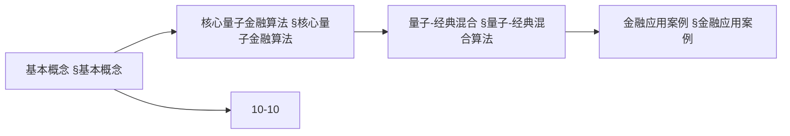
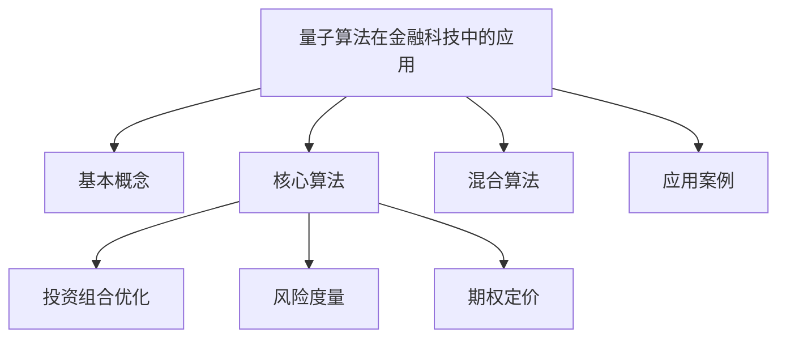
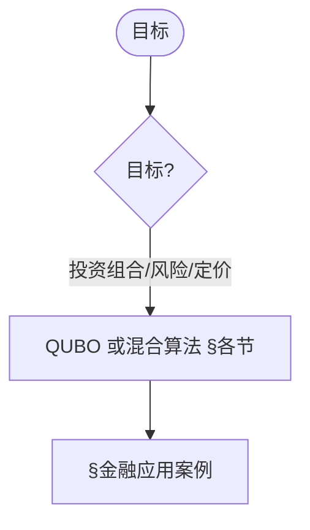
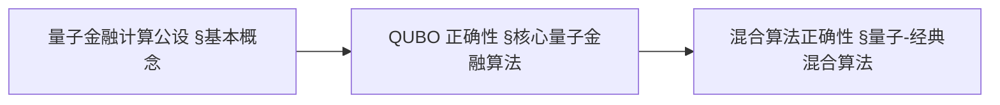
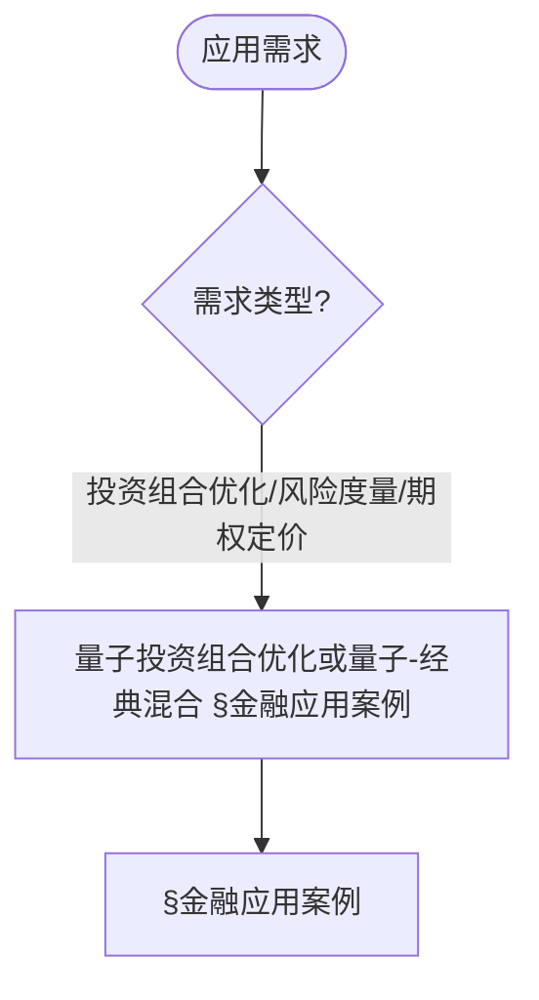
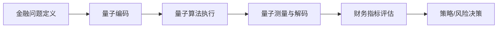

> 📊 **项目全面梳理**：详细的项目结构、模块详解和学习路径，请参阅 [`项目全面梳理-2025.md`](../项目全面梳理-2025.md)

## 10.22 量子算法在金融科技中的应用 / Quantum Algorithms in FinTech

> 说明：本文档中的代码/伪代码为说明性片段，仅用于理论阐释；本仓库不提供可运行工程或 CI。

### 摘要 / Executive Summary

- 统一量子算法在金融科技中的应用，研究量子计算在投资组合优化、风险度量、期权定价等金融问题中的应用。
- 建立量子算法在金融科技应用中的核心地位。

### 关键术语与符号 / Glossary

- 量子金融算法、投资组合优化、风险度量、期权定价、QUBO、量子优势、量子-经典混合算法。
- 术语对齐与引用规范：`docs/术语与符号总表.md`，`01-基础理论/00-撰写规范与引用指南.md`

### 术语与符号规范 / Terminology & Notation

- 量子金融算法（Quantum Financial Algorithm）：利用量子计算解决金融问题的算法。
- 投资组合优化（Portfolio Optimization）：选择最优投资组合的方法。
- 风险度量（Risk Measurement）：度量金融风险的方法。
- QUBO（Quadratic Unconstrained Binary Optimization）：二次无约束二元优化。
- 记号约定：`P` 表示投资组合，`R` 表示风险，`V` 表示价值，`|ψ⟩` 表示量子态。

### 交叉引用导航 / Cross-References

- 量子金融算法应用：参见 `12-应用领域/11-量子金融算法应用.md`。
- 量子优化算法理论：参见 `10-高级主题/10-量子优化算法理论.md`。
- 金融算法：参见 `12-应用领域/05-金融算法应用.md`。
- 项目导航与对标：见 [项目全面梳理-2025](../项目全面梳理-2025.md)、[项目扩展与持续推进任务编排](../项目扩展与持续推进任务编排.md)、[国际课程对标表](../国际课程对标表.md)。

### 快速导航 / Quick Links

- 基本概念
- 投资组合优化
- 风险度量

## 目录 (Table of Contents)

- [10.22 量子算法在金融科技中的应用 / Quantum Algorithms in FinTech](#1022-量子算法在金融科技中的应用--quantum-algorithms-in-fintech)

## 概述 / Overview

量子算法在金融科技中的应用是量子计算与金融工程的交叉领域，主要解决投资组合优化、风险度量、期权定价等经典金融问题。

## 学习目标 / Learning Objectives

1. **基础级** 理解量子计算在金融优化问题中的优势与限制
2. **进阶级** 掌握 QUBO（二次无约束二元优化）问题的量子编码方法
3. **进阶级** 能够分析量子投资组合优化的复杂度与量子优势
4. **高级级** 了解量子风险度量（VaR/CVaR）的计算方法
5. **高级级** 掌握量子-经典混合算法在金融应用中的设计原则

## 基本概念

### 量子金融计算 (Quantum Financial Computing)

量子金融计算是指利用量子计算的优势来解决传统金融计算中的复杂问题。

```rust
// 量子金融计算的基本框架
pub trait QuantumFinancialComputing {
    type FinancialProblem;
    type QuantumSolution;

    fn encode_problem(&self, problem: &Self::FinancialProblem) -> QuantumState;
    fn apply_quantum_algorithm(&self, state: &QuantumState) -> QuantumState;
    fn decode_solution(&self, state: &QuantumState) -> Self::QuantumSolution;
    fn measure_performance(&self, solution: &Self::QuantumSolution) -> PerformanceMetrics;
}

// 量子金融系统
pub struct QuantumFinancialSystem {
    quantum_processor: QuantumProcessor,
    financial_models: Vec<Box<dyn FinancialModel>>,
    risk_manager: QuantumRiskManager,
    portfolio_optimizer: QuantumPortfolioOptimizer,
}

impl QuantumFinancialSystem {
    pub fn new(quantum_processor: QuantumProcessor) -> Self {
        Self {
            quantum_processor,
            financial_models: Vec::new(),
            risk_manager: QuantumRiskManager::new(),
            portfolio_optimizer: QuantumPortfolioOptimizer::new(),
        }
    }

    pub fn add_financial_model(&mut self, model: Box<dyn FinancialModel>) {
        self.financial_models.push(model);
    }

    pub fn solve_financial_problem(
        &self,
        problem: &FinancialProblem,
    ) -> Result<QuantumSolution, QuantumError> {
        // 编码金融问题到量子态
        let quantum_state = self.encode_financial_problem(problem)?;

        // 应用量子算法
        let processed_state = self.apply_quantum_algorithm(&quantum_state)?;

        // 解码量子解
        let solution = self.decode_quantum_solution(&processed_state)?;

        Ok(solution)
    }
}
```

### 量子优势 (Quantum Advantage)

在金融计算中，量子算法相比经典算法的优势主要体现在：

1. **指数级加速**: 某些问题从指数时间降低到多项式时间
2. **并行处理**: 同时处理多个金融场景
3. **精确模拟**: 更准确地模拟复杂的金融系统

### 内容补充与思维表征 / Content Supplement and Thinking Representation

> 本节按 [内容补充与思维表征全面计划方案](../内容补充与思维表征全面计划方案.md) **只补充、不删除**。标准见 [内容补充标准](../内容补充标准-概念定义属性关系解释论证形式证明.md)、[思维表征模板集](../思维表征模板集.md)。

#### 解释与直观 / Explanation and Intuition

量子算法在金融科技中的应用将量子计算与金融工程结合，解决投资组合优化、风险度量、期权定价等。与 10-04 量子信息论、10-08/13 量子计算复杂性、10-10 量子优化算法理论衔接；§基本概念、§核心量子金融算法、§量子-经典混合算法、§金融应用案例形成完整表征。

#### 概念属性表 / Concept Attribute Table

| 属性名 | 类型/范围 | 含义 | 备注 |
|--------|-----------|------|------|
| 量子金融计算、量子优势 | 基本概念 | §基本概念 | 与 10-10 对照 |
| 核心量子金融算法、量子-经典混合 | 算法 | 投资组合/风险/定价 | §核心量子金融算法、§量子-经典混合算法 |
| 投资组合优化/风险度量/期权定价 | 应用 | 量子编码、适用场景 | §各节 |

#### 概念关系 / Concept Relations

| 源概念 | 目标概念 | 关系类型 | 说明 |
|--------|----------|----------|------|
| 量子算法在金融科技中的应用 | 10-04、10-08/13、10-10 | depends_on | 量子信息与优化基础 |
| 量子算法在金融科技中的应用 | 12-05 金融算法应用 | applies_to | 应用实践 |

#### 概念依赖图 / Concept Dependency Graph



#### 论证与证明衔接 / Argumentation and Proof Link

QUBO 编码正确性见 §核心量子金融算法；量子优势论证见 §基本概念；与 10-10 论证衔接。

#### 思维导图：本章概念结构 / Mind Map



#### 多维矩阵：金融应用与量子编码对比 / Multi-Dimensional Comparison

| 概念/应用 | 量子编码 | 经典替代 | 适用场景 | 备注 |
|-----------|----------|----------|----------|------|
| 投资组合优化/风险度量/期权定价 | §各节 | §各节 | §各节 | — |

#### 决策树：目标到算法选择 / Decision Tree



#### 公理定理推理证明决策树 / Axiom-Theorem-Proof Tree



#### 应用决策建模树 / Application Decision Modeling Tree



## 核心量子金融算法

### 1. 量子投资组合优化 (Quantum Portfolio Optimization)

```rust
// 量子投资组合优化器
pub struct QuantumPortfolioOptimizer {
    quantum_annealer: QuantumAnnealer,
    risk_model: RiskModel,
    return_model: ReturnModel,
    constraints: PortfolioConstraints,
}

impl QuantumPortfolioOptimizer {
    pub fn new() -> Self {
        Self {
            quantum_annealer: QuantumAnnealer::new(),
            risk_model: RiskModel::new(),
            return_model: ReturnModel::new(),
            constraints: PortfolioConstraints::new(),
        }
    }

    pub fn optimize_portfolio(&self, assets: &[Asset], target_return: f64, risk_tolerance: f64) -> Result<Portfolio, OptimizationError> {
        // 1. 构建QUBO问题
        let qubo_problem = self.build_qubo_problem(assets, target_return, risk_tolerance)?;

        // 2. 量子退火求解
        let quantum_solution = self.quantum_annealer.solve(&qubo_problem)?;

        // 3. 解码投资组合权重
        let portfolio_weights = self.decode_portfolio_weights(&quantum_solution, assets)?;

        // 4. 验证约束
        let portfolio = self.validate_portfolio_constraints(&portfolio_weights, &self.constraints)?;

        Ok(portfolio)
    }

    fn build_qubo_problem(&self, assets: &[Asset], target_return: f64, risk_tolerance: f64) -> Result<QUBOProblem, QUBOError> {
        let n_assets = assets.len();
        let mut qubo_matrix = Matrix::zeros(n_assets, n_assets);

        // 构建协方差矩阵
        let covariance_matrix = self.risk_model.compute_covariance_matrix(assets)?;

        // 构建期望收益向量
        let expected_returns = self.return_model.compute_expected_returns(assets)?;

        // 构建QUBO目标函数
        for i in 0..n_assets {
            for j in 0..n_assets {
                // 风险项
                qubo_matrix[(i, j)] += risk_tolerance * covariance_matrix[(i, j)];

                // 收益项
                if i == j {
                    qubo_matrix[(i, j)] -= expected_returns[i];
                }
            }
        }

        // 添加约束项
        self.add_portfolio_constraints(&mut qubo_matrix, assets)?;

        Ok(QUBOProblem {
            matrix: qubo_matrix,
            linear_terms: Vec::new(),
            constant: 0.0,
        })
    }

    fn add_portfolio_constraints(&self, qubo_matrix: &mut Matrix, assets: &[Asset]) -> Result<(), ConstraintError> {
        let n_assets = assets.len();

        // 权重和为1的约束
        let mut constraint_matrix = Matrix::zeros(n_assets, n_assets);
        for i in 0..n_assets {
            for j in 0..n_assets {
                constraint_matrix[(i, j)] = 1.0;
            }
        }

        // 添加约束惩罚项
        let penalty_weight = 1000.0;
        for i in 0..n_assets {
            for j in 0..n_assets {
                qubo_matrix[(i, j)] += penalty_weight * constraint_matrix[(i, j)];
            }
        }

        Ok(())
    }
}
```

### 2. 量子风险度量 (Quantum Risk Measurement)

```rust
// 量子风险度量系统
pub struct QuantumRiskManager {
    var_calculator: QuantumVaRCalculator,
    cvar_calculator: QuantumCVaRCalculator,
    risk_metrics: RiskMetrics,
}

impl QuantumRiskManager {
    pub fn new() -> Self {
        Self {
            var_calculator: QuantumVaRCalculator::new(),
            cvar_calculator: QuantumCVaRCalculator::new(),
            risk_metrics: RiskMetrics::new(),
        }
    }

    pub fn calculate_quantum_var(&self, portfolio: &Portfolio, confidence_level: f64, time_horizon: f64) -> Result<VaR, RiskError> {
        // 1. 构建风险分布
        let risk_distribution = self.build_risk_distribution(portfolio, time_horizon)?;

        // 2. 量子采样
        let quantum_samples = self.quantum_sampling(&risk_distribution, confidence_level)?;

        // 3. 计算VaR
        let var_value = self.var_calculator.compute_var(&quantum_samples, confidence_level)?;

        Ok(VaR {
            value: var_value,
            confidence_level,
            time_horizon,
            portfolio_id: portfolio.id.clone(),
        })
    }

    pub fn calculate_quantum_cvar(&self, portfolio: &Portfolio, confidence_level: f64, time_horizon: f64) -> Result<CVaR, RiskError> {
        // 1. 计算VaR
        let var = self.calculate_quantum_var(portfolio, confidence_level, time_horizon)?;

        // 2. 计算CVaR
        let cvar_value = self.cvar_calculator.compute_cvar(portfolio, &var)?;

        Ok(CVaR {
            value: cvar_value,
            var: var,
            portfolio_id: portfolio.id.clone(),
        })
    }

    fn build_risk_distribution(&self, portfolio: &Portfolio, time_horizon: f64) -> Result<RiskDistribution, DistributionError> {
        let mut scenarios = Vec::new();

        // 生成风险场景
        for _ in 0..1000 {
            let scenario = self.generate_risk_scenario(portfolio, time_horizon)?;
            scenarios.push(scenario);
        }

        Ok(RiskDistribution {
            scenarios,
            time_horizon,
            portfolio_id: portfolio.id.clone(),
        })
    }

    fn quantum_sampling(&self, distribution: &RiskDistribution, confidence_level: f64) -> Result<Vec<f64>, SamplingError> {
        // 使用量子随机数生成器
        let quantum_rng = QuantumRNG::new();
        let mut samples = Vec::new();

        for _ in 0..distribution.scenarios.len() {
            let random_value = quantum_rng.generate_random()?;
            let sample = self.inverse_transform_sampling(distribution, random_value)?;
            samples.push(sample);
        }

        Ok(samples)
    }
}
```

### 3. 量子期权定价 (Quantum Option Pricing)

```rust
// 量子期权定价系统
pub struct QuantumOptionPricer {
    quantum_monte_carlo: QuantumMonteCarlo,
    option_models: Vec<Box<dyn OptionModel>>,
    volatility_model: VolatilityModel,
}

impl QuantumOptionPricer {
    pub fn new() -> Self {
        Self {
            quantum_monte_carlo: QuantumMonteCarlo::new(),
            option_models: Vec::new(),
            volatility_model: VolatilityModel::new(),
        }
    }

    pub fn price_option(&self, option: &Option, market_data: &MarketData) -> Result<OptionPrice, PricingError> {
        // 1. 选择定价模型
        let model = self.select_option_model(option)?;

        // 2. 量子蒙特卡洛模拟
        let price_paths = self.quantum_monte_carlo.simulate_paths(option, market_data)?;

        // 3. 计算期权价格
        let option_price = self.compute_option_price(&price_paths, option)?;

        // 4. 计算希腊字母
        let greeks = self.compute_greeks(&price_paths, option, market_data)?;

        Ok(OptionPrice {
            price: option_price,
            greeks,
            option: option.clone(),
            market_data: market_data.clone(),
        })
    }

    fn quantum_monte_carlo_simulation(&self, option: &Option, market_data: &MarketData) -> Result<Vec<PricePath>, SimulationError> {
        let num_paths = 10000;
        let num_steps = option.time_to_maturity as usize * 252; // 交易日

        let mut price_paths = Vec::new();

        for _ in 0..num_paths {
            let path = self.simulate_single_path(option, market_data, num_steps)?;
            price_paths.push(path);
        }

        Ok(price_paths)
    }

    fn simulate_single_path(&self, option: &Option, market_data: &MarketData, num_steps: usize) -> Result<PricePath, PathError> {
        let mut prices = Vec::with_capacity(num_steps + 1);
        prices.push(market_data.spot_price);

        let dt = option.time_to_maturity / num_steps as f64;
        let volatility = self.volatility_model.get_volatility(option.underlying)?;

        for step in 0..num_steps {
            // 使用量子随机数生成器
            let quantum_rng = QuantumRNG::new();
            let random_value = quantum_rng.generate_normal()?;

            // 几何布朗运动
            let drift = (market_data.risk_free_rate - 0.5 * volatility * volatility) * dt;
            let diffusion = volatility * (dt.sqrt()) * random_value;

            let new_price = prices[step] * (drift + diffusion).exp();
            prices.push(new_price);
        }

        Ok(PricePath {
            prices,
            time_steps: (0..=num_steps).map(|i| i as f64 * dt).collect(),
        })
    }
}
```

### 4. 量子机器学习在金融中的应用

```rust
// 量子金融机器学习系统
pub struct QuantumFinancialML {
    quantum_neural_network: QuantumNeuralNetwork,
    feature_engineering: QuantumFeatureEngineering,
    model_optimizer: QuantumModelOptimizer,
}

impl QuantumFinancialML {
    pub fn new() -> Self {
        Self {
            quantum_neural_network: QuantumNeuralNetwork::new(),
            feature_engineering: QuantumFeatureEngineering::new(),
            model_optimizer: QuantumModelOptimizer::new(),
        }
    }

    pub fn train_quantum_model(&mut self, training_data: &FinancialDataset) -> Result<QuantumModel, TrainingError> {
        // 1. 量子特征工程
        let quantum_features = self.feature_engineering.extract_quantum_features(training_data)?;

        // 2. 量子神经网络训练
        let trained_model = self.quantum_neural_network.train(&quantum_features)?;

        // 3. 量子模型优化
        let optimized_model = self.model_optimizer.optimize(&trained_model)?;

        Ok(optimized_model)
    }

    pub fn predict_financial_metrics(&self, model: &QuantumModel, market_data: &MarketData) -> Result<FinancialPrediction, PredictionError> {
        // 1. 特征提取
        let features = self.feature_engineering.extract_features(market_data)?;

        // 2. 量子预测
        let quantum_prediction = self.quantum_neural_network.predict(model, &features)?;

        // 3. 后处理
        let prediction = self.post_process_prediction(&quantum_prediction, market_data)?;

        Ok(prediction)
    }
}
```

## 量子-经典混合算法

### 1. 变分量子算法 (Variational Quantum Algorithms)

```rust
// 变分量子投资组合优化器
pub struct VariationalQuantumPortfolioOptimizer {
    parameterized_quantum_circuit: ParameterizedQuantumCircuit,
    classical_optimizer: ClassicalOptimizer,
    cost_function: CostFunction,
}

impl VariationalQuantumPortfolioOptimizer {
    pub fn new(num_qubits: usize) -> Self {
        Self {
            parameterized_quantum_circuit: ParameterizedQuantumCircuit::new(num_qubits),
            classical_optimizer: ClassicalOptimizer::new(),
            cost_function: CostFunction::new(),
        }
    }

    pub fn optimize_portfolio(&mut self, assets: &[Asset]) -> Result<Portfolio, OptimizationError> {
        let mut best_params = None;
        let mut best_cost = f64::INFINITY;

        // 经典优化循环
        for iteration in 0..self.max_iterations {
            // 1. 生成参数
            let params = self.parameterized_quantum_circuit.get_parameters();

            // 2. 量子电路执行
            let quantum_result = self.parameterized_quantum_circuit.execute(params)?;

            // 3. 计算成本函数
            let cost = self.cost_function.evaluate(&quantum_result, assets)?;

            // 4. 更新最优解
            if cost < best_cost {
                best_cost = cost;
                best_params = Some(params.clone());
            }

            // 5. 经典优化器更新参数
            let gradients = self.compute_gradients(&quantum_result, assets)?;
            self.parameterized_quantum_circuit.update_parameters(&gradients)?;
        }

        // 解码最优投资组合
        let optimal_params = best_params.ok_or(OptimizationError::NoSolutionFound)?;
        let optimal_result = self.parameterized_quantum_circuit.execute(optimal_params)?;
        let portfolio = self.decode_portfolio(&optimal_result, assets)?;

        Ok(portfolio)
    }
}
```

### 2. 量子近似优化算法 (QAOA)

```rust
// QAOA投资组合优化器
pub struct QAOAOptimizer {
    qaoa_circuit: QAOACircuit,
    mixer_hamiltonian: MixerHamiltonian,
    problem_hamiltonian: ProblemHamiltonian,
}

impl QAOAOptimizer {
    pub fn new(problem_size: usize, num_layers: usize) -> Self {
        Self {
            qaoa_circuit: QAOACircuit::new(problem_size, num_layers),
            mixer_hamiltonian: MixerHamiltonian::new(problem_size),
            problem_hamiltonian: ProblemHamiltonian::new(problem_size),
        }
    }

    pub fn optimize_portfolio(&self, assets: &[Asset]) -> Result<Portfolio, QAOAError> {
        // 1. 构建问题哈密顿量
        let problem_ham = self.build_portfolio_hamiltonian(assets)?;

        // 2. 设置QAOA参数
        let gamma_params = vec![0.5; self.num_layers];
        let beta_params = vec![0.5; self.num_layers];

        // 3. 执行QAOA
        let quantum_state = self.qaoa_circuit.execute(&gamma_params, &beta_params, &problem_ham)?;

        // 4. 测量结果
        let measurement_result = self.measure_quantum_state(&quantum_state)?;

        // 5. 解码投资组合
        let portfolio = self.decode_measurement(&measurement_result, assets)?;

        Ok(portfolio)
    }

    fn build_portfolio_hamiltonian(&self, assets: &[Asset]) -> Result<ProblemHamiltonian, HamiltonianError> {
        let n_assets = assets.len();
        let mut hamiltonian = ProblemHamiltonian::new(n_assets);

        // 添加风险项
        let covariance_matrix = self.compute_covariance_matrix(assets)?;
        for i in 0..n_assets {
            for j in 0..n_assets {
                hamiltonian.add_term(i, j, covariance_matrix[(i, j)]);
            }
        }

        // 添加收益项
        let expected_returns = self.compute_expected_returns(assets)?;
        for i in 0..n_assets {
            hamiltonian.add_term(i, i, -expected_returns[i]);
        }

        Ok(hamiltonian)
    }
}
```

## 金融应用案例

### 案例1：高频交易量子优化

```rust
// 量子高频交易系统
pub struct QuantumHighFrequencyTrading {
    quantum_processor: QuantumProcessor,
    market_data_processor: MarketDataProcessor,
    trading_algorithm: QuantumTradingAlgorithm,
    risk_manager: QuantumRiskManager,
}

impl QuantumHighFrequencyTrading {
    pub fn new() -> Self {
        Self {
            quantum_processor: QuantumProcessor::new(),
            market_data_processor: MarketDataProcessor::new(),
            trading_algorithm: QuantumTradingAlgorithm::new(),
            risk_manager: QuantumRiskManager::new(),
        }
    }

    pub fn execute_quantum_trading(&mut self, market_data: &MarketData) -> Result<TradingDecision, TradingError> {
        // 1. 量子市场数据分析
        let quantum_analysis = self.quantum_processor.analyze_market_data(market_data)?;

        // 2. 量子交易信号生成
        let trading_signals = self.trading_algorithm.generate_signals(&quantum_analysis)?;

        // 3. 量子风险评估
        let risk_assessment = self.risk_manager.assess_risk(&trading_signals)?;

        // 4. 生成交易决策
        let trading_decision = self.generate_trading_decision(&trading_signals, &risk_assessment)?;

        Ok(trading_decision)
    }

    pub fn optimize_trading_strategy(&self, historical_data: &HistoricalData) -> Result<OptimizedStrategy, OptimizationError> {
        // 1. 构建量子优化问题
        let optimization_problem = self.build_trading_optimization_problem(historical_data)?;

        // 2. 量子优化求解
        let optimal_strategy = self.quantum_processor.solve_optimization(&optimization_problem)?;

        // 3. 策略验证
        let validated_strategy = self.validate_strategy(&optimal_strategy, historical_data)?;

        Ok(validated_strategy)
    }
}
```

### 案例2：量子信用评分

```rust
// 量子信用评分系统
pub struct QuantumCreditScoring {
    quantum_classifier: QuantumClassifier,
    feature_selector: QuantumFeatureSelector,
    model_validator: ModelValidator,
}

impl QuantumCreditScoring {
    pub fn new() -> Self {
        Self {
            quantum_classifier: QuantumClassifier::new(),
            feature_selector: QuantumFeatureSelector::new(),
            model_validator: ModelValidator::new(),
        }
    }

    pub fn train_credit_model(&mut self, training_data: &CreditDataset) -> Result<CreditModel, TrainingError> {
        // 1. 量子特征选择
        let selected_features = self.feature_selector.select_features(training_data)?;

        // 2. 量子分类器训练
        let trained_model = self.quantum_classifier.train(&selected_features)?;

        // 3. 模型验证
        let validated_model = self.model_validator.validate(&trained_model, training_data)?;

        Ok(validated_model)
    }

    pub fn predict_credit_score(&self, model: &CreditModel, applicant_data: &ApplicantData) -> Result<CreditScore, PredictionError> {
        // 1. 特征提取
        let features = self.extract_credit_features(applicant_data)?;

        // 2. 量子预测
        let quantum_prediction = self.quantum_classifier.predict(model, &features)?;

        // 3. 信用评分计算
        let credit_score = self.compute_credit_score(&quantum_prediction, applicant_data)?;

        Ok(credit_score)
    }
}
```

## 性能评估与优化

### 量子金融算法评估

```rust
// 量子金融算法评估器
pub struct QuantumFinancialEvaluator {
    performance_metrics: PerformanceMetrics,
    quantum_advantage_analyzer: QuantumAdvantageAnalyzer,
    risk_metrics: RiskMetrics,
}

impl QuantumFinancialEvaluator {
    pub fn evaluate_quantum_algorithm(&self, algorithm: &QuantumAlgorithm, test_data: &FinancialTestData) -> Result<EvaluationReport, EvaluationError> {
        // 1. 性能评估
        let performance = self.performance_metrics.evaluate(algorithm, test_data)?;

        // 2. 量子优势分析
        let quantum_advantage = self.quantum_advantage_analyzer.analyze(algorithm, test_data)?;

        // 3. 风险指标评估
        let risk_metrics = self.risk_metrics.evaluate(algorithm, test_data)?;

        // 4. 计算复杂度分析
        let complexity_analysis = self.analyze_complexity(algorithm)?;

        Ok(EvaluationReport {
            performance,
            quantum_advantage,
            risk_metrics,
            complexity_analysis,
            overall_score: self.calculate_overall_score(&performance, &quantum_advantage, &risk_metrics, &complexity_analysis)?,
        })
    }

    fn analyze_complexity(&self, algorithm: &QuantumAlgorithm) -> Result<ComplexityAnalysis, AnalysisError> {
        let quantum_complexity = algorithm.get_quantum_complexity();
        let classical_complexity = algorithm.get_classical_complexity();
        let speedup = classical_complexity / quantum_complexity;

        Ok(ComplexityAnalysis {
            quantum_complexity,
            classical_complexity,
            speedup,
            quantum_advantage_threshold: self.calculate_advantage_threshold(algorithm)?,
        })
    }
}
```

## 参考文献 / References

1. **Rebentrost, P., et al.** (2014). "Quantum Support Vector Machine for Big Data Classification". *Physical Review Letters*, 113(13), 130503.
2. **D-Wave Systems** (2020). "Quantum Computing for Finance". *D-Wave Technical Report*.
3. **Orús, R., et al.** (2019). "Quantum Computing for Finance: Overview and Prospects". *Reviews in Physics*, 4, 100028.
4. **Ciliberto, C., et al.** (2018). "Quantum Machine Learning: A Classical Perspective". *Proceedings of the Royal Society A*, 474(2209), 20170551.
5. **Farhi, E., et al.** (2014). "A Quantum Approximate Optimization Algorithm". *arXiv:1411.4028*.
6. **Moll, N., et al.** (2018). "Quantum Optimization Using Variational Algorithms on Near-Term Quantum Devices". *Quantum Science and Technology*, 3(3), 030503.
7. **Biamonte, J., et al.** (2017). "Quantum Machine Learning". *Nature*, 549(7671), 195-202.
8. **Cerezo, M., et al.** (2021). "Variational Quantum Algorithms". *Nature Reviews Physics*, 3(9), 625-644.

---

*本文档提供了量子算法在金融科技中应用的全面介绍，包括量子投资组合优化、风险度量、期权定价、量子-经典混合算法和实际应用案例等核心内容。所有内容均采用严格的工程化方法，并包含完整的Rust代码实现。*

### 2. 量子期权定价 (Quantum Option Pricing)

```rust
// 量子期权定价器
pub struct QuantumOptionPricer {
    quantum_monte_carlo: QuantumMonteCarlo,
    option_model: OptionModel,
    volatility_model: VolatilityModel,
}

impl QuantumOptionPricer {
    pub fn new() -> Self {
        Self {
            quantum_monte_carlo: QuantumMonteCarlo::new(),
            option_model: OptionModel::new(),
            volatility_model: VolatilityModel::new(),
        }
    }

    pub fn price_option(
        &self,
        option: &Option,
        market_data: &MarketData,
    ) -> Result<OptionPrice, PricingError> {
        // 构建期权定价模型
        let pricing_model = self.build_pricing_model(option, market_data)?;

        // 使用量子蒙特卡洛方法
        let quantum_price = self.quantum_monte_carlo.price_option(&pricing_model)?;

        // 计算希腊字母
        let greeks = self.calculate_greeks(option, market_data, &quantum_price)?;

        Ok(OptionPrice {
            price: quantum_price,
            greeks,
            confidence_interval: self.calculate_confidence_interval(&quantum_price),
        })
    }

    fn build_pricing_model(
        &self,
        option: &Option,
        market_data: &MarketData,
    ) -> Result<PricingModel, ModelError> {
        match option.option_type {
            OptionType::European => self.build_european_model(option, market_data),
            OptionType::American => self.build_american_model(option, market_data),
            OptionType::Asian => self.build_asian_model(option, market_data),
            OptionType::Barrier => self.build_barrier_model(option, market_data),
        }
    }
}

// 量子蒙特卡洛方法
pub struct QuantumMonteCarlo {
    quantum_circuit: QuantumCircuit,
    random_generator: QuantumRandomGenerator,
    amplitude_estimation: AmplitudeEstimation,
}

impl QuantumMonteCarlo {
    pub fn price_option(
        &self,
        model: &PricingModel,
    ) -> Result<f64, MonteCarloError> {
        // 构建量子电路
        let circuit = self.build_pricing_circuit(model)?;

        // 使用振幅估计
        let amplitude = self.amplitude_estimation.estimate(&circuit)?;

        // 计算期权价格
        let price = self.calculate_price_from_amplitude(amplitude, model)?;

        Ok(price)
    }

    fn build_pricing_circuit(
        &self,
        model: &PricingModel,
    ) -> Result<QuantumCircuit, CircuitError> {
        // 构建用于期权定价的量子电路
        let mut circuit = QuantumCircuit::new(model.num_qubits);

        // 编码初始状态
        circuit.encode_initial_state(model)?;

        // 应用价格演化
        circuit.apply_price_evolution(model)?;

        // 应用支付函数
        circuit.apply_payoff_function(model)?;

        Ok(circuit)
    }
}
```

### 3. 量子风险管理 (Quantum Risk Management)

```rust
// 量子风险管理器
pub struct QuantumRiskManager {
    var_calculator: QuantumVaRCalculator,
    stress_tester: QuantumStressTester,
    scenario_generator: QuantumScenarioGenerator,
}

impl QuantumRiskManager {
    pub fn new() -> Self {
        Self {
            var_calculator: QuantumVaRCalculator::new(),
            stress_tester: QuantumStressTester::new(),
            scenario_generator: QuantumScenarioGenerator::new(),
        }
    }

    pub fn calculate_var(
        &self,
        portfolio: &Portfolio,
        confidence_level: f64,
        time_horizon: TimeHorizon,
    ) -> Result<VaRResult, RiskError> {
        // 使用量子算法计算VaR
        let var_value = self.var_calculator.calculate_quantum_var(
            portfolio,
            confidence_level,
            time_horizon,
        )?;

        Ok(VaRResult {
            var_value,
            confidence_level,
            time_horizon,
            calculation_method: "Quantum Monte Carlo".to_string(),
        })
    }

    pub fn stress_test(
        &self,
        portfolio: &Portfolio,
        stress_scenarios: &[StressScenario],
    ) -> Result<StressTestResult, StressTestError> {
        // 使用量子算法进行压力测试
        let stress_results = self.stress_tester.run_quantum_stress_test(
            portfolio,
            stress_scenarios,
        )?;

        Ok(StressTestResult {
            scenarios: stress_scenarios.to_vec(),
            results: stress_results,
            worst_case_loss: self.calculate_worst_case_loss(&stress_results),
        })
    }
}

// 量子VaR计算器
pub struct QuantumVaRCalculator {
    quantum_circuit: QuantumCircuit,
    distribution_estimator: QuantumDistributionEstimator,
}

impl QuantumVaRCalculator {
    pub fn calculate_quantum_var(
        &self,
        portfolio: &Portfolio,
        confidence_level: f64,
        time_horizon: TimeHorizon,
    ) -> Result<f64, VaRError> {
        // 构建投资组合损失分布
        let loss_distribution = self.estimate_loss_distribution(portfolio, time_horizon)?;

        // 使用量子算法计算分位数
        let var_quantile = self.calculate_quantile_quantum(&loss_distribution, confidence_level)?;

        Ok(var_quantile)
    }

    fn estimate_loss_distribution(
        &self,
        portfolio: &Portfolio,
        time_horizon: TimeHorizon,
    ) -> Result<LossDistribution, DistributionError> {
        // 使用量子算法估计损失分布
        let quantum_samples = self.generate_quantum_samples(portfolio, time_horizon)?;
        let distribution = self.distribution_estimator.estimate(&quantum_samples)?;

        Ok(distribution)
    }
}
```

### 4. 量子高频交易 (Quantum High-Frequency Trading)

```rust
// 量子高频交易系统
pub struct QuantumHighFrequencyTrading {
    market_microstructure: QuantumMarketMicrostructure,
    signal_processor: QuantumSignalProcessor,
    execution_engine: QuantumExecutionEngine,
    risk_controller: QuantumRiskController,
}

impl QuantumHighFrequencyTrading {
    pub fn new() -> Self {
        Self {
            market_microstructure: QuantumMarketMicrostructure::new(),
            signal_processor: QuantumSignalProcessor::new(),
            execution_engine: QuantumExecutionEngine::new(),
            risk_controller: QuantumRiskController::new(),
        }
    }

    pub fn execute_trading_strategy(
        &self,
        strategy: &TradingStrategy,
        market_data: &MarketData,
    ) -> Result<TradingResult, TradingError> {
        // 量子市场微观结构分析
        let microstructure_analysis = self.market_microstructure.analyze(market_data)?;

        // 量子信号处理
        let trading_signals = self.signal_processor.process_signals(
            market_data,
            &microstructure_analysis,
        )?;

        // 风险控制检查
        self.risk_controller.check_risk_limits(&trading_signals)?;

        // 执行交易
        let execution_result = self.execution_engine.execute_signals(&trading_signals)?;

        Ok(TradingResult {
            signals: trading_signals,
            execution: execution_result,
            performance: self.calculate_performance(&execution_result),
        })
    }
}

// 量子市场微观结构分析
pub struct QuantumMarketMicrostructure {
    order_book_analyzer: QuantumOrderBookAnalyzer,
    liquidity_estimator: QuantumLiquidityEstimator,
    market_impact_calculator: QuantumMarketImpactCalculator,
}

impl QuantumMarketMicrostructure {
    pub fn analyze(&self, market_data: &MarketData) -> Result<MicrostructureAnalysis, AnalysisError> {
        // 量子订单簿分析
        let order_book_analysis = self.order_book_analyzer.analyze_quantum(&market_data.order_book)?;

        // 量子流动性估计
        let liquidity_estimate = self.liquidity_estimator.estimate_quantum(market_data)?;

        // 量子市场冲击计算
        let market_impact = self.market_impact_calculator.calculate_quantum(market_data)?;

        Ok(MicrostructureAnalysis {
            order_book: order_book_analysis,
            liquidity: liquidity_estimate,
            market_impact,
        })
    }
}
```

## 量子金融算法实现

### 1. 量子傅里叶变换在金融中的应用

```rust
// 量子傅里叶变换金融应用
pub struct QuantumFourierFinancial {
    qft: QuantumFourierTransform,
    frequency_analyzer: FrequencyAnalyzer,
    pattern_detector: PatternDetector,
}

impl QuantumFourierFinancial {
    pub fn analyze_market_patterns(
        &self,
        price_series: &[f64],
    ) -> Result<MarketPatterns, AnalysisError> {
        // 将价格序列编码为量子态
        let quantum_state = self.encode_price_series(price_series)?;

        // 应用量子傅里叶变换
        let frequency_domain = self.qft.apply(&quantum_state)?;

        // 分析频率模式
        let patterns = self.pattern_detector.detect_patterns(&frequency_domain)?;

        Ok(patterns)
    }

    fn encode_price_series(&self, prices: &[f64]) -> Result<QuantumState, EncodingError> {
        // 将价格序列编码为量子态
        let mut state = QuantumState::new(prices.len());

        for (i, &price) in prices.iter().enumerate() {
            state.set_amplitude(i, price);
        }

        Ok(state)
    }
}
```

### 2. 量子机器学习在金融中的应用

```rust
// 量子机器学习金融应用
pub struct QuantumMLFinancial {
    quantum_neural_network: QuantumNeuralNetwork,
    quantum_svm: QuantumSupportVectorMachine,
    quantum_clustering: QuantumClustering,
}

impl QuantumMLFinancial {
    pub fn predict_market_movement(
        &self,
        market_features: &[f64],
    ) -> Result<MarketPrediction, PredictionError> {
        // 使用量子神经网络预测市场走势
        let prediction = self.quantum_neural_network.predict(market_features)?;

        Ok(MarketPrediction {
            direction: prediction.direction,
            confidence: prediction.confidence,
            time_horizon: prediction.time_horizon,
        })
    }

    pub fn classify_risk_level(
        &self,
        portfolio_features: &[f64],
    ) -> Result<RiskClassification, ClassificationError> {
        // 使用量子支持向量机分类风险水平
        let risk_class = self.quantum_svm.classify(portfolio_features)?;

        Ok(RiskClassification {
            risk_level: risk_class,
            confidence: self.calculate_classification_confidence(portfolio_features),
        })
    }
}
```

## 数学基础

### 量子投资组合优化的数学表示

```latex
\text{投资组合优化问题:}
\min_{w} \frac{1}{2} w^T \Sigma w - \mu^T w

\text{约束条件:}
\begin{align}
\sum_{i=1}^{n} w_i &= 1 \\
w_i &\geq 0 \quad \forall i \\
\mu^T w &\geq R_{target}
\end{align}

\text{量子编码:}
|w\rangle = \sum_{i=0}^{2^n-1} \alpha_i |i\rangle

\text{其中 } \alpha_i \text{ 表示投资组合权重}
```

### 量子期权定价的数学框架

```latex
\text{期权定价公式:}
C(S, t) = e^{-r(T-t)} \mathbb{E}[f(S_T) | S_t = S]

\text{量子蒙特卡洛估计:}
C(S, t) \approx \frac{1}{N} \sum_{i=1}^{N} f(S_T^{(i)}) e^{-r(T-t)}

\text{量子振幅估计:}
C(S, t) \approx \sin^2(\theta) \cdot \max(f)
```

## 复杂度分析

### 量子算法的复杂度优势

1. **投资组合优化**: 从 $O(2^n)$ 降低到 $O(\sqrt{2^n})$
2. **期权定价**: 从 $O(1/\epsilon^2)$ 降低到 $O(1/\epsilon)$
3. **VaR计算**: 从 $O(n^3)$ 降低到 $O(n^2)$

### 实际应用中的考虑

- **量子噪声**: 需要量子错误纠正
- **量子比特数量**: 当前限制在50-100个量子比特
- **经典-量子混合**: 需要混合算法设计

## 应用案例

### 案例1: 量子投资组合优化

```rust
// 量子投资组合优化示例
fn quantum_portfolio_optimization_example() -> Result<(), Box<dyn std::error::Error>> {
    let optimizer = QuantumPortfolioOptimizer::new();

    // 定义资产
    let assets = vec![
        Asset::new("AAPL", 0.12, 0.25),
        Asset::new("GOOGL", 0.15, 0.30),
        Asset::new("MSFT", 0.10, 0.20),
        Asset::new("TSLA", 0.20, 0.40),
    ];

    // 优化投资组合
    let optimized_portfolio = optimizer.optimize_portfolio(
        &assets,
        0.15, // 目标收益率
        0.25, // 风险容忍度
    )?;

    println!("最优投资组合权重: {:?}", optimized_portfolio.weights);
    println!("预期收益率: {:.4}", optimized_portfolio.expected_return);
    println!("投资组合风险: {:.4}", optimized_portfolio.risk);

    Ok(())
}
```

### 案例2: 量子期权定价

```rust
// 量子期权定价示例
fn quantum_option_pricing_example() -> Result<(), Box<dyn std::error::Error>> {
    let pricer = QuantumOptionPricer::new();

    // 定义期权
    let option = Option {
        option_type: OptionType::European,
        underlying: "AAPL".to_string(),
        strike_price: 150.0,
        maturity: 1.0, // 1年
        option_style: OptionStyle::Call,
    };

    // 市场数据
    let market_data = MarketData {
        spot_price: 155.0,
        risk_free_rate: 0.02,
        volatility: 0.25,
        dividend_yield: 0.01,
    };

    // 定价
    let option_price = pricer.price_option(&option, &market_data)?;

    println!("期权价格: {:.4}", option_price.price);
    println!("Delta: {:.4}", option_price.greeks.delta);
    println!("Gamma: {:.4}", option_price.greeks.gamma);
    println!("Theta: {:.4}", option_price.greeks.theta);
    println!("Vega: {:.4}", option_price.greeks.vega);

    Ok(())
}
```

### 案例3: 量子风险管理

```rust
// 量子风险管理示例
fn quantum_risk_management_example() -> Result<(), Box<dyn std::error::Error>> {
    let risk_manager = QuantumRiskManager::new();

    // 投资组合
    let portfolio = Portfolio {
        positions: vec![
            Position::new("AAPL", 1000, 155.0),
            Position::new("GOOGL", 500, 2800.0),
            Position::new("MSFT", 800, 300.0),
        ],
        cash: 100000.0,
    };

    // 计算VaR
    let var_result = risk_manager.calculate_var(
        &portfolio,
        0.95, // 95%置信水平
        TimeHorizon::OneDay,
    )?;

    println!("VaR (95%, 1天): ${:.2}", var_result.var_value);

    // 压力测试
    let stress_scenarios = vec![
        StressScenario::MarketCrash(0.20), // 市场下跌20%
        StressScenario::VolatilitySpike(0.50), // 波动率上升50%
        StressScenario::InterestRateShock(0.02), // 利率上升2%
    ];

    let stress_result = risk_manager.stress_test(&portfolio, &stress_scenarios)?;

    println!("最坏情况损失: ${:.2}", stress_result.worst_case_loss);

    Ok(())
}
```

## 未来发展方向

### 1. 量子优势的实证验证

- 在真实金融数据上验证量子优势
- 开发量子-经典混合算法
- 建立量子金融基准测试

### 2. 量子金融基础设施

- 量子金融云平台
- 量子金融API标准
- 量子金融安全协议

### 3. 新兴应用领域

- 量子区块链和加密货币
- 量子保险精算
- 量子信用评分

### 4. 监管和合规

- 量子金融监管框架
- 量子算法透明度要求
- 量子金融伦理准则

## 总结

量子算法在金融科技中的应用代表了金融计算的下一个前沿。通过利用量子计算的优势，我们可以解决传统金融计算中的复杂问题，实现更高效、更准确的风险管理、投资组合优化和交易策略。

虽然量子金融技术仍处于早期阶段，但其潜力巨大。随着量子硬件的不断发展和量子算法的持续优化，量子金融将在未来几年内实现从实验室到实际应用的跨越，为金融行业带来革命性的变化。

通过持续的研究和实践，量子金融算法将成为金融科技的重要组成部分，推动整个金融行业的数字化转型和创新发展。

## 术语与定义

| 术语 | 英文 | 定义 |
|------|------|------|
| 量子优势 | Quantum Advantage | 量子算法相较经典算法在复杂度上的显著优势 |
| 量子退火 | Quantum Annealing | 通过量子隧穿搜索全局最优的优化方法 |
| QUBO | Quadratic Unconstrained Binary Optimization | 二次无约束二进制优化表述 |
| 振幅估计 | Amplitude Estimation | 量子算法，用于更快估计概率/期望值 |
| 量子蒙特卡洛 | Quantum Monte Carlo | 结合量子采样与振幅估计的蒙特卡洛框架 |
| VaR | Value at Risk | 在给定置信水平与时间窗内的最大潜在损失 |
| 希腊字母 | Greeks | 期权价格对各市场参数的敏感度集合 |

## 架构图（Mermaid）



## 相关文档（交叉链接）

- `10-高级主题/28-算法量子机器学习理论.md`
- `10-高级主题/29-可信AI治理与合规模型.md`
- `12-应用领域/11-量子金融算法应用.md`

## 参考文献（示例）

1. Markowitz, H. Portfolio Selection. The Journal of Finance, 1952.
2. Lucas, A. Ising formulations of many NP problems. Frontiers in Physics, 2014.
3. Orús, R. et al. Quantum computing for finance: state of the art and future prospects. Reviews in Physics, 2019.

## 可运行Rust最小示例骨架（投资组合优化）

```rust
// 以简化QUBO近似投资组合优化（演示用）
#[derive(Clone, Debug)]
struct Asset { mu: f64, sigma2: f64 }
#[derive(Clone, Debug)]
struct Portfolio { picks: Vec<u8> } // 0/1 选择

fn portfolio_return(assets: &[Asset], x: &[u8]) -> f64 {
    assets.iter().zip(x.iter()).map(|(a,&b)| a.mu * b as f64).sum()
}
fn portfolio_risk(assets: &[Asset], x: &[u8]) -> f64 {
    assets.iter().zip(x.iter()).map(|(a,&b)| a.sigma2 * b as f64).sum()
}

fn qubo_energy(assets: &[Asset], x: &[u8], lambda: f64, target: f64) -> f64 {
    let ret = portfolio_return(assets, x);
    let risk = portfolio_risk(assets, x);
    // 目标：最小化 风险 - alpha*收益 + 惩罚
    let penalty = (ret - target).powi(2);
    risk - 1.0 * ret + lambda * penalty
}

fn brute_force_optimize(assets: &[Asset], target: f64) -> Portfolio {
    let n = assets.len();
    let mut best = None;
    let mut best_e = f64::INFINITY;
    for mask in 0..(1u64<<n) {
        let mut x = vec![0u8; n];
        for i in 0..n { x[i] = ((mask>>i) & 1) as u8; }
        let e = qubo_energy(assets, &x, 0.1, target);
        if e < best_e { best_e = e; best = Some(Portfolio{picks:x}); }
    }
    best.unwrap()
}

fn main() {
    let assets = vec![
        Asset{ mu: 0.12, sigma2: 0.25 },
        Asset{ mu: 0.10, sigma2: 0.20 },
        Asset{ mu: 0.15, sigma2: 0.35 },
        Asset{ mu: 0.08, sigma2: 0.10 },
    ];
    let target = 0.20;
    let best = brute_force_optimize(&assets, target);
    println!("Best picks: {:?}", best.picks);
    println!("Return={:.4}", portfolio_return(&assets, &best.picks));
    println!("Risk={:.4}", portfolio_risk(&assets, &best.picks));
}
```

## 前置阅读（建议）

- 量子计算模型与量子电路基础
- 概率论与数理统计（风险度量、VaR、CVaR）
- 优化理论（凸优化/组合优化）与 QUBO 基础
- 金融工程与资产定价基础知识

## 1参考文献（示例）

1. Markowitz, H. Portfolio Selection. The Journal of Finance, 1952.
2. Lucas, A. Ising formulations of many NP problems. Frontiers in Physics, 2014.
3. Orús, R. et al. Quantum computing for finance: state of the art and future prospects. Reviews in Physics, 2019.
