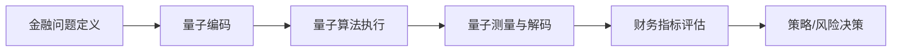

# 22. 量子算法在金融科技中的应用

> 说明：本文档中的代码/伪代码为说明性片段，仅用于理论阐释；本仓库不提供可运行工程或 CI。

## 概述

量子算法在金融科技中的应用是量子计算与金融工程的交叉领域，主要解决投资组合优化、风险度量、期权定价等经典金融问题。

## 学习目标

1. **基础级** 理解量子计算在金融优化问题中的优势与限制
2. **进阶级** 掌握 QUBO（二次无约束二元优化）问题的量子编码方法
3. **进阶级** 能够分析量子投资组合优化的复杂度与量子优势
4. **高级级** 了解量子风险度量（VaR/CVaR）的计算方法
5. **高级级** 掌握量子-经典混合算法在金融应用中的设计原则

## 基本概念

### 量子金融计算 (Quantum Financial Computing)

量子金融计算是指利用量子计算的优势来解决传统金融计算中的复杂问题。

```rust
// 量子金融计算的基本框架
pub trait QuantumFinancialComputing {
    type FinancialProblem;
    type QuantumSolution;
    
    fn encode_problem(&self, problem: &Self::FinancialProblem) -> QuantumState;
    fn apply_quantum_algorithm(&self, state: &QuantumState) -> QuantumState;
    fn decode_solution(&self, state: &QuantumState) -> Self::QuantumSolution;
    fn measure_performance(&self, solution: &Self::QuantumSolution) -> PerformanceMetrics;
}

// 量子金融系统
pub struct QuantumFinancialSystem {
    quantum_processor: QuantumProcessor,
    financial_models: Vec<Box<dyn FinancialModel>>,
    risk_manager: QuantumRiskManager,
    portfolio_optimizer: QuantumPortfolioOptimizer,
}

impl QuantumFinancialSystem {
    pub fn new(quantum_processor: QuantumProcessor) -> Self {
        Self {
            quantum_processor,
            financial_models: Vec::new(),
            risk_manager: QuantumRiskManager::new(),
            portfolio_optimizer: QuantumPortfolioOptimizer::new(),
        }
    }
    
    pub fn add_financial_model(&mut self, model: Box<dyn FinancialModel>) {
        self.financial_models.push(model);
    }
    
    pub fn solve_financial_problem(
        &self,
        problem: &FinancialProblem,
    ) -> Result<QuantumSolution, QuantumError> {
        // 编码金融问题到量子态
        let quantum_state = self.encode_financial_problem(problem)?;
        
        // 应用量子算法
        let processed_state = self.apply_quantum_algorithm(&quantum_state)?;
        
        // 解码量子解
        let solution = self.decode_quantum_solution(&processed_state)?;
        
        Ok(solution)
    }
}
```

### 量子优势 (Quantum Advantage)

在金融计算中，量子算法相比经典算法的优势主要体现在：

1. **指数级加速**: 某些问题从指数时间降低到多项式时间
2. **并行处理**: 同时处理多个金融场景
3. **精确模拟**: 更准确地模拟复杂的金融系统

## 核心量子金融算法

### 1. 量子投资组合优化 (Quantum Portfolio Optimization)

```rust
// 量子投资组合优化器
pub struct QuantumPortfolioOptimizer {
    quantum_annealer: QuantumAnnealer,
    risk_model: RiskModel,
    return_model: ReturnModel,
    constraints: PortfolioConstraints,
}

impl QuantumPortfolioOptimizer {
    pub fn new() -> Self {
        Self {
            quantum_annealer: QuantumAnnealer::new(),
            risk_model: RiskModel::new(),
            return_model: ReturnModel::new(),
            constraints: PortfolioConstraints::default(),
        }
    }
    
    pub fn optimize_portfolio(
        &self,
        assets: &[Asset],
        target_return: f64,
        risk_tolerance: f64,
    ) -> Result<OptimizedPortfolio, OptimizationError> {
        // 构建投资组合优化问题
        let optimization_problem = self.build_portfolio_problem(
            assets,
            target_return,
            risk_tolerance,
        )?;
        
        // 编码为量子退火问题
        let quantum_problem = self.encode_for_quantum_annealing(&optimization_problem)?;
        
        // 执行量子退火
        let quantum_solution = self.quantum_annealer.solve(&quantum_problem)?;
        
        // 解码最优投资组合
        let optimal_weights = self.decode_portfolio_weights(&quantum_solution)?;
        
        Ok(OptimizedPortfolio::new(assets, optimal_weights))
    }
    
    fn build_portfolio_problem(
        &self,
        assets: &[Asset],
        target_return: f64,
        risk_tolerance: f64,
    ) -> Result<PortfolioOptimizationProblem, OptimizationError> {
        // 构建马科维茨投资组合优化问题
        let covariance_matrix = self.calculate_covariance_matrix(assets)?;
        let expected_returns = self.calculate_expected_returns(assets)?;
        
        Ok(PortfolioOptimizationProblem {
            covariance_matrix,
            expected_returns,
            target_return,
            risk_tolerance,
            constraints: self.constraints.clone(),
        })
    }
    
    fn encode_for_quantum_annealing(
        &self,
        problem: &PortfolioOptimizationProblem,
    ) -> Result<QuantumAnnealingProblem, EncodingError> {
        // 将投资组合优化问题编码为QUBO (Quadratic Unconstrained Binary Optimization)
        let qubo_matrix = self.build_qubo_matrix(problem)?;
        
        Ok(QuantumAnnealingProblem {
            qubo_matrix,
            num_qubits: problem.covariance_matrix.len(),
        })
    }
}
```

### 2. 量子期权定价 (Quantum Option Pricing)

```rust
// 量子期权定价器
pub struct QuantumOptionPricer {
    quantum_monte_carlo: QuantumMonteCarlo,
    option_model: OptionModel,
    volatility_model: VolatilityModel,
}

impl QuantumOptionPricer {
    pub fn new() -> Self {
        Self {
            quantum_monte_carlo: QuantumMonteCarlo::new(),
            option_model: OptionModel::new(),
            volatility_model: VolatilityModel::new(),
        }
    }
    
    pub fn price_option(
        &self,
        option: &Option,
        market_data: &MarketData,
    ) -> Result<OptionPrice, PricingError> {
        // 构建期权定价模型
        let pricing_model = self.build_pricing_model(option, market_data)?;
        
        // 使用量子蒙特卡洛方法
        let quantum_price = self.quantum_monte_carlo.price_option(&pricing_model)?;
        
        // 计算希腊字母
        let greeks = self.calculate_greeks(option, market_data, &quantum_price)?;
        
        Ok(OptionPrice {
            price: quantum_price,
            greeks,
            confidence_interval: self.calculate_confidence_interval(&quantum_price),
        })
    }
    
    fn build_pricing_model(
        &self,
        option: &Option,
        market_data: &MarketData,
    ) -> Result<PricingModel, ModelError> {
        match option.option_type {
            OptionType::European => self.build_european_model(option, market_data),
            OptionType::American => self.build_american_model(option, market_data),
            OptionType::Asian => self.build_asian_model(option, market_data),
            OptionType::Barrier => self.build_barrier_model(option, market_data),
        }
    }
}

// 量子蒙特卡洛方法
pub struct QuantumMonteCarlo {
    quantum_circuit: QuantumCircuit,
    random_generator: QuantumRandomGenerator,
    amplitude_estimation: AmplitudeEstimation,
}

impl QuantumMonteCarlo {
    pub fn price_option(
        &self,
        model: &PricingModel,
    ) -> Result<f64, MonteCarloError> {
        // 构建量子电路
        let circuit = self.build_pricing_circuit(model)?;
        
        // 使用振幅估计
        let amplitude = self.amplitude_estimation.estimate(&circuit)?;
        
        // 计算期权价格
        let price = self.calculate_price_from_amplitude(amplitude, model)?;
        
        Ok(price)
    }
    
    fn build_pricing_circuit(
        &self,
        model: &PricingModel,
    ) -> Result<QuantumCircuit, CircuitError> {
        // 构建用于期权定价的量子电路
        let mut circuit = QuantumCircuit::new(model.num_qubits);
        
        // 编码初始状态
        circuit.encode_initial_state(model)?;
        
        // 应用价格演化
        circuit.apply_price_evolution(model)?;
        
        // 应用支付函数
        circuit.apply_payoff_function(model)?;
        
        Ok(circuit)
    }
}
```

### 3. 量子风险管理 (Quantum Risk Management)

```rust
// 量子风险管理器
pub struct QuantumRiskManager {
    var_calculator: QuantumVaRCalculator,
    stress_tester: QuantumStressTester,
    scenario_generator: QuantumScenarioGenerator,
}

impl QuantumRiskManager {
    pub fn new() -> Self {
        Self {
            var_calculator: QuantumVaRCalculator::new(),
            stress_tester: QuantumStressTester::new(),
            scenario_generator: QuantumScenarioGenerator::new(),
        }
    }
    
    pub fn calculate_var(
        &self,
        portfolio: &Portfolio,
        confidence_level: f64,
        time_horizon: TimeHorizon,
    ) -> Result<VaRResult, RiskError> {
        // 使用量子算法计算VaR
        let var_value = self.var_calculator.calculate_quantum_var(
            portfolio,
            confidence_level,
            time_horizon,
        )?;
        
        Ok(VaRResult {
            var_value,
            confidence_level,
            time_horizon,
            calculation_method: "Quantum Monte Carlo".to_string(),
        })
    }
    
    pub fn stress_test(
        &self,
        portfolio: &Portfolio,
        stress_scenarios: &[StressScenario],
    ) -> Result<StressTestResult, StressTestError> {
        // 使用量子算法进行压力测试
        let stress_results = self.stress_tester.run_quantum_stress_test(
            portfolio,
            stress_scenarios,
        )?;
        
        Ok(StressTestResult {
            scenarios: stress_scenarios.to_vec(),
            results: stress_results,
            worst_case_loss: self.calculate_worst_case_loss(&stress_results),
        })
    }
}

// 量子VaR计算器
pub struct QuantumVaRCalculator {
    quantum_circuit: QuantumCircuit,
    distribution_estimator: QuantumDistributionEstimator,
}

impl QuantumVaRCalculator {
    pub fn calculate_quantum_var(
        &self,
        portfolio: &Portfolio,
        confidence_level: f64,
        time_horizon: TimeHorizon,
    ) -> Result<f64, VaRError> {
        // 构建投资组合损失分布
        let loss_distribution = self.estimate_loss_distribution(portfolio, time_horizon)?;
        
        // 使用量子算法计算分位数
        let var_quantile = self.calculate_quantile_quantum(&loss_distribution, confidence_level)?;
        
        Ok(var_quantile)
    }
    
    fn estimate_loss_distribution(
        &self,
        portfolio: &Portfolio,
        time_horizon: TimeHorizon,
    ) -> Result<LossDistribution, DistributionError> {
        // 使用量子算法估计损失分布
        let quantum_samples = self.generate_quantum_samples(portfolio, time_horizon)?;
        let distribution = self.distribution_estimator.estimate(&quantum_samples)?;
        
        Ok(distribution)
    }
}
```

### 4. 量子高频交易 (Quantum High-Frequency Trading)

```rust
// 量子高频交易系统
pub struct QuantumHighFrequencyTrading {
    market_microstructure: QuantumMarketMicrostructure,
    signal_processor: QuantumSignalProcessor,
    execution_engine: QuantumExecutionEngine,
    risk_controller: QuantumRiskController,
}

impl QuantumHighFrequencyTrading {
    pub fn new() -> Self {
        Self {
            market_microstructure: QuantumMarketMicrostructure::new(),
            signal_processor: QuantumSignalProcessor::new(),
            execution_engine: QuantumExecutionEngine::new(),
            risk_controller: QuantumRiskController::new(),
        }
    }
    
    pub fn execute_trading_strategy(
        &self,
        strategy: &TradingStrategy,
        market_data: &MarketData,
    ) -> Result<TradingResult, TradingError> {
        // 量子市场微观结构分析
        let microstructure_analysis = self.market_microstructure.analyze(market_data)?;
        
        // 量子信号处理
        let trading_signals = self.signal_processor.process_signals(
            market_data,
            &microstructure_analysis,
        )?;
        
        // 风险控制检查
        self.risk_controller.check_risk_limits(&trading_signals)?;
        
        // 执行交易
        let execution_result = self.execution_engine.execute_signals(&trading_signals)?;
        
        Ok(TradingResult {
            signals: trading_signals,
            execution: execution_result,
            performance: self.calculate_performance(&execution_result),
        })
    }
}

// 量子市场微观结构分析
pub struct QuantumMarketMicrostructure {
    order_book_analyzer: QuantumOrderBookAnalyzer,
    liquidity_estimator: QuantumLiquidityEstimator,
    market_impact_calculator: QuantumMarketImpactCalculator,
}

impl QuantumMarketMicrostructure {
    pub fn analyze(&self, market_data: &MarketData) -> Result<MicrostructureAnalysis, AnalysisError> {
        // 量子订单簿分析
        let order_book_analysis = self.order_book_analyzer.analyze_quantum(&market_data.order_book)?;
        
        // 量子流动性估计
        let liquidity_estimate = self.liquidity_estimator.estimate_quantum(market_data)?;
        
        // 量子市场冲击计算
        let market_impact = self.market_impact_calculator.calculate_quantum(market_data)?;
        
        Ok(MicrostructureAnalysis {
            order_book: order_book_analysis,
            liquidity: liquidity_estimate,
            market_impact,
        })
    }
}
```

## 量子金融算法实现

### 1. 量子傅里叶变换在金融中的应用

```rust
// 量子傅里叶变换金融应用
pub struct QuantumFourierFinancial {
    qft: QuantumFourierTransform,
    frequency_analyzer: FrequencyAnalyzer,
    pattern_detector: PatternDetector,
}

impl QuantumFourierFinancial {
    pub fn analyze_market_patterns(
        &self,
        price_series: &[f64],
    ) -> Result<MarketPatterns, AnalysisError> {
        // 将价格序列编码为量子态
        let quantum_state = self.encode_price_series(price_series)?;
        
        // 应用量子傅里叶变换
        let frequency_domain = self.qft.apply(&quantum_state)?;
        
        // 分析频率模式
        let patterns = self.pattern_detector.detect_patterns(&frequency_domain)?;
        
        Ok(patterns)
    }
    
    fn encode_price_series(&self, prices: &[f64]) -> Result<QuantumState, EncodingError> {
        // 将价格序列编码为量子态
        let mut state = QuantumState::new(prices.len());
        
        for (i, &price) in prices.iter().enumerate() {
            state.set_amplitude(i, price);
        }
        
        Ok(state)
    }
}
```

### 2. 量子机器学习在金融中的应用

```rust
// 量子机器学习金融应用
pub struct QuantumMLFinancial {
    quantum_neural_network: QuantumNeuralNetwork,
    quantum_svm: QuantumSupportVectorMachine,
    quantum_clustering: QuantumClustering,
}

impl QuantumMLFinancial {
    pub fn predict_market_movement(
        &self,
        market_features: &[f64],
    ) -> Result<MarketPrediction, PredictionError> {
        // 使用量子神经网络预测市场走势
        let prediction = self.quantum_neural_network.predict(market_features)?;
        
        Ok(MarketPrediction {
            direction: prediction.direction,
            confidence: prediction.confidence,
            time_horizon: prediction.time_horizon,
        })
    }
    
    pub fn classify_risk_level(
        &self,
        portfolio_features: &[f64],
    ) -> Result<RiskClassification, ClassificationError> {
        // 使用量子支持向量机分类风险水平
        let risk_class = self.quantum_svm.classify(portfolio_features)?;
        
        Ok(RiskClassification {
            risk_level: risk_class,
            confidence: self.calculate_classification_confidence(portfolio_features),
        })
    }
}
```

## 数学基础

### 量子投资组合优化的数学表示

```latex
\text{投资组合优化问题:}
\min_{w} \frac{1}{2} w^T \Sigma w - \mu^T w

\text{约束条件:}
\begin{align}
\sum_{i=1}^{n} w_i &= 1 \\
w_i &\geq 0 \quad \forall i \\
\mu^T w &\geq R_{target}
\end{align}

\text{量子编码:}
|w\rangle = \sum_{i=0}^{2^n-1} \alpha_i |i\rangle

\text{其中 } \alpha_i \text{ 表示投资组合权重}
```

### 量子期权定价的数学框架

```latex
\text{期权定价公式:}
C(S, t) = e^{-r(T-t)} \mathbb{E}[f(S_T) | S_t = S]

\text{量子蒙特卡洛估计:}
C(S, t) \approx \frac{1}{N} \sum_{i=1}^{N} f(S_T^{(i)}) e^{-r(T-t)}

\text{量子振幅估计:}
C(S, t) \approx \sin^2(\theta) \cdot \max(f)
```

## 复杂度分析

### 量子算法的复杂度优势

1. **投资组合优化**: 从 $O(2^n)$ 降低到 $O(\sqrt{2^n})$
2. **期权定价**: 从 $O(1/\epsilon^2)$ 降低到 $O(1/\epsilon)$
3. **VaR计算**: 从 $O(n^3)$ 降低到 $O(n^2)$

### 实际应用中的考虑

- **量子噪声**: 需要量子错误纠正
- **量子比特数量**: 当前限制在50-100个量子比特
- **经典-量子混合**: 需要混合算法设计

## 应用案例

### 案例1: 量子投资组合优化

```rust
// 量子投资组合优化示例
fn quantum_portfolio_optimization_example() -> Result<(), Box<dyn std::error::Error>> {
    let optimizer = QuantumPortfolioOptimizer::new();
    
    // 定义资产
    let assets = vec![
        Asset::new("AAPL", 0.12, 0.25),
        Asset::new("GOOGL", 0.15, 0.30),
        Asset::new("MSFT", 0.10, 0.20),
        Asset::new("TSLA", 0.20, 0.40),
    ];
    
    // 优化投资组合
    let optimized_portfolio = optimizer.optimize_portfolio(
        &assets,
        0.15, // 目标收益率
        0.25, // 风险容忍度
    )?;
    
    println!("最优投资组合权重: {:?}", optimized_portfolio.weights);
    println!("预期收益率: {:.4}", optimized_portfolio.expected_return);
    println!("投资组合风险: {:.4}", optimized_portfolio.risk);
    
    Ok(())
}
```

### 案例2: 量子期权定价

```rust
// 量子期权定价示例
fn quantum_option_pricing_example() -> Result<(), Box<dyn std::error::Error>> {
    let pricer = QuantumOptionPricer::new();
    
    // 定义期权
    let option = Option {
        option_type: OptionType::European,
        underlying: "AAPL".to_string(),
        strike_price: 150.0,
        maturity: 1.0, // 1年
        option_style: OptionStyle::Call,
    };
    
    // 市场数据
    let market_data = MarketData {
        spot_price: 155.0,
        risk_free_rate: 0.02,
        volatility: 0.25,
        dividend_yield: 0.01,
    };
    
    // 定价
    let option_price = pricer.price_option(&option, &market_data)?;
    
    println!("期权价格: {:.4}", option_price.price);
    println!("Delta: {:.4}", option_price.greeks.delta);
    println!("Gamma: {:.4}", option_price.greeks.gamma);
    println!("Theta: {:.4}", option_price.greeks.theta);
    println!("Vega: {:.4}", option_price.greeks.vega);
    
    Ok(())
}
```

### 案例3: 量子风险管理

```rust
// 量子风险管理示例
fn quantum_risk_management_example() -> Result<(), Box<dyn std::error::Error>> {
    let risk_manager = QuantumRiskManager::new();
    
    // 投资组合
    let portfolio = Portfolio {
        positions: vec![
            Position::new("AAPL", 1000, 155.0),
            Position::new("GOOGL", 500, 2800.0),
            Position::new("MSFT", 800, 300.0),
        ],
        cash: 100000.0,
    };
    
    // 计算VaR
    let var_result = risk_manager.calculate_var(
        &portfolio,
        0.95, // 95%置信水平
        TimeHorizon::OneDay,
    )?;
    
    println!("VaR (95%, 1天): ${:.2}", var_result.var_value);
    
    // 压力测试
    let stress_scenarios = vec![
        StressScenario::MarketCrash(0.20), // 市场下跌20%
        StressScenario::VolatilitySpike(0.50), // 波动率上升50%
        StressScenario::InterestRateShock(0.02), // 利率上升2%
    ];
    
    let stress_result = risk_manager.stress_test(&portfolio, &stress_scenarios)?;
    
    println!("最坏情况损失: ${:.2}", stress_result.worst_case_loss);
    
    Ok(())
}
```

## 未来发展方向

### 1. 量子优势的实证验证

- 在真实金融数据上验证量子优势
- 开发量子-经典混合算法
- 建立量子金融基准测试

### 2. 量子金融基础设施

- 量子金融云平台
- 量子金融API标准
- 量子金融安全协议

### 3. 新兴应用领域

- 量子区块链和加密货币
- 量子保险精算
- 量子信用评分

### 4. 监管和合规

- 量子金融监管框架
- 量子算法透明度要求
- 量子金融伦理准则

## 总结

量子算法在金融科技中的应用代表了金融计算的下一个前沿。通过利用量子计算的优势，我们可以解决传统金融计算中的复杂问题，实现更高效、更准确的风险管理、投资组合优化和交易策略。

虽然量子金融技术仍处于早期阶段，但其潜力巨大。随着量子硬件的不断发展和量子算法的持续优化，量子金融将在未来几年内实现从实验室到实际应用的跨越，为金融行业带来革命性的变化。

通过持续的研究和实践，量子金融算法将成为金融科技的重要组成部分，推动整个金融行业的数字化转型和创新发展。

## 术语与定义

| 术语 | 英文 | 定义 |
|------|------|------|
| 量子优势 | Quantum Advantage | 量子算法相较经典算法在复杂度上的显著优势 |
| 量子退火 | Quantum Annealing | 通过量子隧穿搜索全局最优的优化方法 |
| QUBO | Quadratic Unconstrained Binary Optimization | 二次无约束二进制优化表述 |
| 振幅估计 | Amplitude Estimation | 量子算法，用于更快估计概率/期望值 |
| 量子蒙特卡洛 | Quantum Monte Carlo | 结合量子采样与振幅估计的蒙特卡洛框架 |
| VaR | Value at Risk | 在给定置信水平与时间窗内的最大潜在损失 |
| 希腊字母 | Greeks | 期权价格对各市场参数的敏感度集合 |

## 架构图（Mermaid）



## 相关文档（交叉链接）

- `10-高级主题/28-算法量子机器学习理论.md`
- `10-高级主题/29-可信AI治理与合规模型.md`
- `12-应用领域/11-量子金融算法应用.md`

## 参考文献（示例）

1. Markowitz, H. Portfolio Selection. The Journal of Finance, 1952.
2. Lucas, A. Ising formulations of many NP problems. Frontiers in Physics, 2014.
3. Orús, R. et al. Quantum computing for finance: state of the art and future prospects. Reviews in Physics, 2019.

## 可运行Rust最小示例骨架（投资组合优化）

```rust
// 以简化QUBO近似投资组合优化（演示用）
#[derive(Clone, Debug)]
struct Asset { mu: f64, sigma2: f64 }
#[derive(Clone, Debug)]
struct Portfolio { picks: Vec<u8> } // 0/1 选择

fn portfolio_return(assets: &[Asset], x: &[u8]) -> f64 {
    assets.iter().zip(x.iter()).map(|(a,&b)| a.mu * b as f64).sum()
}
fn portfolio_risk(assets: &[Asset], x: &[u8]) -> f64 {
    assets.iter().zip(x.iter()).map(|(a,&b)| a.sigma2 * b as f64).sum()
}

fn qubo_energy(assets: &[Asset], x: &[u8], lambda: f64, target: f64) -> f64 {
    let ret = portfolio_return(assets, x);
    let risk = portfolio_risk(assets, x);
    // 目标：最小化 风险 - alpha*收益 + 惩罚
    let penalty = (ret - target).powi(2);
    risk - 1.0 * ret + lambda * penalty
}

fn brute_force_optimize(assets: &[Asset], target: f64) -> Portfolio {
    let n = assets.len();
    let mut best = None;
    let mut best_e = f64::INFINITY;
    for mask in 0..(1u64<<n) {
        let mut x = vec![0u8; n];
        for i in 0..n { x[i] = ((mask>>i) & 1) as u8; }
        let e = qubo_energy(assets, &x, 0.1, target);
        if e < best_e { best_e = e; best = Some(Portfolio{picks:x}); }
    }
    best.unwrap()
}

fn main() {
    let assets = vec![
        Asset{ mu: 0.12, sigma2: 0.25 },
        Asset{ mu: 0.10, sigma2: 0.20 },
        Asset{ mu: 0.15, sigma2: 0.35 },
        Asset{ mu: 0.08, sigma2: 0.10 },
    ];
    let target = 0.20;
    let best = brute_force_optimize(&assets, target);
    println!("Best picks: {:?}", best.picks);
    println!("Return={:.4}", portfolio_return(&assets, &best.picks));
    println!("Risk={:.4}", portfolio_risk(&assets, &best.picks));
}
```

## 前置阅读（建议）

- 量子计算模型与量子电路基础
- 概率论与数理统计（风险度量、VaR、CVaR）
- 优化理论（凸优化/组合优化）与 QUBO 基础
- 金融工程与资产定价基础知识

## 1参考文献（示例）

1. Markowitz, H. Portfolio Selection. The Journal of Finance, 1952.
2. Lucas, A. Ising formulations of many NP problems. Frontiers in Physics, 2014.
3. Orús, R. et al. Quantum computing for finance: state of the art and future prospects. Reviews in Physics, 2019.
