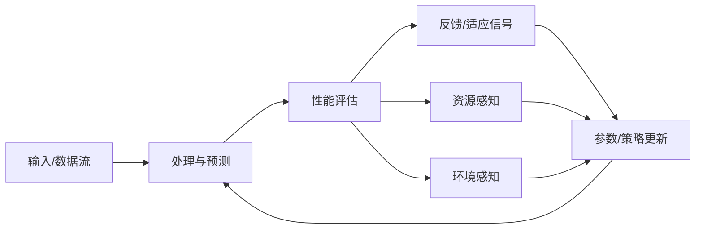

## 10.23 算法自适应学习理论 / Algorithm Adaptive Learning Theory

> 说明：本文档中的代码/伪代码为说明性片段，仅用于理论阐释；本仓库不提供可运行工程或 CI。

### 摘要 / Executive Summary

- 统一算法自适应学习理论，研究能够根据环境变化、数据分布漂移和性能反馈自动调整的算法。
- 建立算法自适应学习在高级主题中的核心地位。

### 关键术语与符号 / Glossary

- 算法自适应学习、概念漂移、在线学习、强化学习、元学习、快速适应、稳定性、收敛性。
- 术语对齐与引用规范：`docs/术语与符号总表.md`，`01-基础理论/00-撰写规范与引用指南.md`

### 术语与符号规范 / Terminology & Notation

- 算法自适应学习（Algorithm Adaptive Learning）：能够自动调整的算法学习理论。
- 概念漂移（Concept Drift）：数据分布随时间变化的现象。
- 在线学习（Online Learning）：从数据流中持续学习的方法。
- 元学习（Meta-Learning）：学习如何学习的方法。
- 记号约定：`A` 表示算法，`D` 表示数据，`E` 表示环境，`P` 表示性能。

### 交叉引用导航 / Cross-References

- 算法自适应理论：参见 `09-算法理论/04-高级算法理论/20-算法自适应理论.md`。
- 在线算法：参见 `09-算法理论/01-算法基础/13-在线算法理论.md`。
- 强化学习算法：参见 `09-算法理论/01-算法基础/18-强化学习算法理论.md`。

### 快速导航 / Quick Links

- 基本概念
- 概念漂移
- 在线学习

## 目录 (Table of Contents)

- [10.23 算法自适应学习理论 / Algorithm Adaptive Learning Theory](#1023-算法自适应学习理论--algorithm-adaptive-learning-theory)

## 概述 / Overview

算法自适应学习理论研究如何设计能够根据环境变化、数据分布漂移和性能反馈自动调整的算法，实现持续优化和适应。

## 学习目标 / Learning Objectives

1. **基础级** 理解概念漂移检测与适应机制的设计原理
2. **进阶级** 掌握在线学习与强化学习的自适应策略
3. **进阶级** 能够设计资源感知的自适应算法框架
4. **高级级** 了解元学习与快速适应的技术方法
5. **高级级** 掌握自适应算法的稳定性与收敛性分析

## 基本概念

### 自适应算法 (Adaptive Algorithm)

自适应算法是指能够根据输入数据、环境条件和性能反馈自动调整自身参数和策略的算法。

```rust
// 自适应算法的基本框架
pub trait AdaptiveAlgorithm {
    type Input;
    type Output;
    type Parameters;
    type Performance;
    
    fn process(&mut self, input: &Self::Input) -> Self::Output;
    fn adapt(&mut self, feedback: &AdaptiveFeedback) -> Result<(), AdaptationError>;
    fn get_parameters(&self) -> &Self::Parameters;
    fn set_parameters(&mut self, params: Self::Parameters);
    fn measure_performance(&self, input: &Self::Input, output: &Self::Output) -> Self::Performance;
}

// 自适应学习系统
pub struct AdaptiveLearningSystem {
    algorithm: Box<dyn AdaptiveAlgorithm>,
    learning_engine: LearningEngine,
    adaptation_strategy: AdaptationStrategy,
    performance_monitor: PerformanceMonitor,
}

impl AdaptiveLearningSystem {
    pub fn new(algorithm: Box<dyn AdaptiveAlgorithm>) -> Self {
        Self {
            algorithm,
            learning_engine: LearningEngine::new(),
            adaptation_strategy: AdaptationStrategy::default(),
            performance_monitor: PerformanceMonitor::new(),
        }
    }
    
    pub fn process_with_adaptation(
        &mut self,
        input: &Input,
    ) -> Result<Output, ProcessingError> {
        // 处理输入
        let output = self.algorithm.process(input);
        
        // 测量性能
        let performance = self.algorithm.measure_performance(input, &output);
        self.performance_monitor.record_performance(performance);
        
        // 生成反馈
        let feedback = self.generate_adaptive_feedback(input, &output, &performance);
        
        // 自适应调整
        self.algorithm.adapt(&feedback)?;
        
        Ok(output)
    }
    
    fn generate_adaptive_feedback(
        &self,
        input: &Input,
        output: &Output,
        performance: &Performance,
    ) -> AdaptiveFeedback {
        AdaptiveFeedback {
            input: input.clone(),
            output: output.clone(),
            performance: performance.clone(),
            adaptation_signal: self.adaptation_strategy.generate_signal(performance),
        }
    }
}
```

### 环境感知 (Environment Awareness)

环境感知是指算法能够感知和理解其运行环境的变化，并据此调整自身行为。

```rust
// 环境感知器
pub struct EnvironmentAwareness {
    sensors: Vec<Box<dyn Sensor>>,
    context_analyzer: ContextAnalyzer,
    change_detector: ChangeDetector,
}

impl EnvironmentAwareness {
    pub fn new() -> Self {
        Self {
            sensors: Vec::new(),
            context_analyzer: ContextAnalyzer::new(),
            change_detector: ChangeDetector::new(),
        }
    }
    
    pub fn add_sensor(&mut self, sensor: Box<dyn Sensor>) {
        self.sensors.push(sensor);
    }
    
    pub fn sense_environment(&self) -> Result<EnvironmentContext, SensingError> {
        // 收集传感器数据
        let sensor_data: Vec<SensorData> = self.sensors
            .iter()
            .map(|sensor| sensor.sense())
            .collect::<Result<Vec<_>, _>>()?;
        
        // 分析环境上下文
        let context = self.context_analyzer.analyze(&sensor_data)?;
        
        // 检测环境变化
        let changes = self.change_detector.detect_changes(&context)?;
        
        Ok(EnvironmentContext {
            data: sensor_data,
            context,
            changes,
            timestamp: std::time::SystemTime::now(),
        })
    }
}

// 传感器接口
pub trait Sensor {
    fn sense(&self) -> Result<SensorData, SensingError>;
    fn get_sensor_type(&self) -> SensorType;
}

// 数据分布传感器
pub struct DataDistributionSensor {
    window_size: usize,
    distribution_estimator: DistributionEstimator,
}

impl Sensor for DataDistributionSensor {
    fn sense(&self) -> Result<SensorData, SensingError> {
        // 估计当前数据分布
        let distribution = self.distribution_estimator.estimate_current_distribution()?;
        
        Ok(SensorData::Distribution(distribution))
    }
    
    fn get_sensor_type(&self) -> SensorType {
        SensorType::DataDistribution
    }
}
```

## 自适应学习策略

### 1. 在线学习 (Online Learning)

```rust
// 在线学习器
pub struct OnlineLearner {
    model: Box<dyn AdaptiveModel>,
    learning_rate: f64,
    update_strategy: UpdateStrategy,
    memory: LearningMemory,
}

impl OnlineLearner {
    pub fn new(model: Box<dyn AdaptiveModel>) -> Self {
        Self {
            model,
            learning_rate: 0.01,
            update_strategy: UpdateStrategy::GradientDescent,
            memory: LearningMemory::new(),
        }
    }
    
    pub fn learn_online(
        &mut self,
        sample: &TrainingSample,
    ) -> Result<LearningUpdate, LearningError> {
        // 预测
        let prediction = self.model.predict(&sample.input)?;
        
        // 计算损失
        let loss = self.calculate_loss(&prediction, &sample.target);
        
        // 计算梯度
        let gradients = self.model.compute_gradients(&sample.input, &loss)?;
        
        // 更新模型
        let update = self.update_model(gradients)?;
        
        // 记录学习历史
        self.memory.record_update(update.clone());
        
        Ok(update)
    }
    
    fn update_model(&mut self, gradients: Gradients) -> Result<LearningUpdate, LearningError> {
        match self.update_strategy {
            UpdateStrategy::GradientDescent => {
                self.gradient_descent_update(gradients)
            }
            UpdateStrategy::Adam => {
                self.adam_update(gradients)
            }
            UpdateStrategy::AdaGrad => {
                self.adagrad_update(gradients)
            }
        }
    }
}

// 自适应模型接口
pub trait AdaptiveModel {
    fn predict(&self, input: &Input) -> Result<Prediction, PredictionError>;
    fn compute_gradients(&self, input: &Input, loss: &Loss) -> Result<Gradients, GradientError>;
    fn update_parameters(&mut self, update: &ParameterUpdate);
    fn get_parameters(&self) -> &ModelParameters;
}
```

### 2. 元学习 (Meta-Learning)

```rust
// 元学习器
pub struct MetaLearner {
    meta_model: Box<dyn MetaModel>,
    task_encoder: TaskEncoder,
    adaptation_network: AdaptationNetwork,
}

impl MetaLearner {
    pub fn new(meta_model: Box<dyn MetaModel>) -> Self {
        Self {
            meta_model,
            task_encoder: TaskEncoder::new(),
            adaptation_network: AdaptationNetwork::new(),
        }
    }
    
    pub fn meta_learn(
        &mut self,
        tasks: &[LearningTask],
    ) -> Result<MetaLearningResult, MetaLearningError> {
        // 编码任务
        let task_embeddings: Vec<TaskEmbedding> = tasks
            .iter()
            .map(|task| self.task_encoder.encode(task))
            .collect::<Result<Vec<_>, _>>()?;
        
        // 元学习
        let meta_parameters = self.meta_model.learn_from_tasks(&task_embeddings)?;
        
        // 训练适应网络
        let adaptation_params = self.adaptation_network.train(&task_embeddings)?;
        
        Ok(MetaLearningResult {
            meta_parameters,
            adaptation_parameters: adaptation_params,
        })
    }
    
    pub fn adapt_to_new_task(
        &self,
        new_task: &LearningTask,
        adaptation_steps: usize,
    ) -> Result<AdaptedModel, AdaptationError> {
        // 编码新任务
        let task_embedding = self.task_encoder.encode(new_task)?;
        
        // 生成初始参数
        let initial_params = self.meta_model.generate_initial_params(&task_embedding)?;
        
        // 快速适应
        let adapted_params = self.adaptation_network.adapt(
            &initial_params,
            &task_embedding,
            adaptation_steps,
        )?;
        
        Ok(AdaptedModel::new(adapted_params))
    }
}

// 元模型接口
pub trait MetaModel {
    fn learn_from_tasks(&mut self, tasks: &[TaskEmbedding]) -> Result<MetaParameters, MetaLearningError>;
    fn generate_initial_params(&self, task: &TaskEmbedding) -> Result<ModelParameters, ParameterError>;
}
```

### 3. 强化学习自适应 (Reinforcement Learning Adaptation)

```rust
// 强化学习自适应器
pub struct RLAdaptiveLearner {
    policy: Box<dyn AdaptivePolicy>,
    value_function: Box<dyn ValueFunction>,
    exploration_strategy: ExplorationStrategy,
    adaptation_mechanism: AdaptationMechanism,
}

impl RLAdaptiveLearner {
    pub fn new(policy: Box<dyn AdaptivePolicy>, value_function: Box<dyn ValueFunction>) -> Self {
        Self {
            policy,
            value_function,
            exploration_strategy: ExplorationStrategy::EpsilonGreedy(0.1),
            adaptation_mechanism: AdaptationMechanism::new(),
        }
    }
    
    pub fn learn_from_experience(
        &mut self,
        experience: &Experience,
    ) -> Result<LearningUpdate, RLLearningError> {
        // 更新价值函数
        let value_update = self.value_function.update(experience)?;
        
        // 更新策略
        let policy_update = self.policy.update(experience, &value_update)?;
        
        // 自适应调整
        let adaptation_update = self.adaptation_mechanism.adapt(
            experience,
            &value_update,
            &policy_update,
        )?;
        
        Ok(LearningUpdate {
            value_update,
            policy_update,
            adaptation_update,
        })
    }
    
    pub fn select_action(&mut self, state: &State) -> Result<Action, ActionSelectionError> {
        // 根据当前策略选择动作
        let action = self.policy.select_action(state)?;
        
        // 应用探索策略
        let final_action = self.exploration_strategy.apply_exploration(action, state)?;
        
        Ok(final_action)
    }
}

// 自适应策略接口
pub trait AdaptivePolicy {
    fn select_action(&self, state: &State) -> Result<Action, ActionSelectionError>;
    fn update(&mut self, experience: &Experience, value_update: &ValueUpdate) -> Result<PolicyUpdate, PolicyUpdateError>;
    fn adapt_to_environment(&mut self, environment_changes: &EnvironmentChanges);
}
```

## 动态参数调整

### 1. 自适应学习率 (Adaptive Learning Rate)

```rust
// 自适应学习率调整器
pub struct AdaptiveLearningRate {
    base_learning_rate: f64,
    adaptation_strategy: LearningRateAdaptationStrategy,
    performance_history: VecDeque<Performance>,
    window_size: usize,
}

impl AdaptiveLearningRate {
    pub fn new(base_learning_rate: f64) -> Self {
        Self {
            base_learning_rate,
            adaptation_strategy: LearningRateAdaptationStrategy::AdaBelief,
            performance_history: VecDeque::new(),
            window_size: 100,
        }
    }
    
    pub fn get_current_learning_rate(&self) -> f64 {
        match self.adaptation_strategy {
            LearningRateAdaptationStrategy::AdaBelief => {
                self.adaptive_belief_rate()
            }
            LearningRateAdaptationStrategy::CosineAnnealing => {
                self.cosine_annealing_rate()
            }
            LearningRateAdaptationStrategy::Cyclical => {
                self.cyclical_learning_rate()
            }
        }
    }
    
    pub fn update_performance(&mut self, performance: Performance) {
        self.performance_history.push_back(performance);
        
        if self.performance_history.len() > self.window_size {
            self.performance_history.pop_front();
        }
    }
    
    fn adaptive_belief_rate(&self) -> f64 {
        // 基于性能历史自适应调整学习率
        if self.performance_history.len() < 2 {
            return self.base_learning_rate;
        }
        
        let recent_performance: Vec<f64> = self.performance_history
            .iter()
            .map(|p| p.accuracy)
            .collect();
        
        let trend = self.calculate_trend(&recent_performance);
        
        match trend {
            Trend::Improving => self.base_learning_rate * 1.1,
            Trend::Stable => self.base_learning_rate,
            Trend::Declining => self.base_learning_rate * 0.9,
        }
    }
}
```

### 2. 自适应正则化 (Adaptive Regularization)

```rust
// 自适应正则化器
pub struct AdaptiveRegularizer {
    regularization_type: RegularizationType,
    strength_adaptation: StrengthAdaptation,
    feature_importance: FeatureImportance,
}

impl AdaptiveRegularizer {
    pub fn new(regularization_type: RegularizationType) -> Self {
        Self {
            regularization_type,
            strength_adaptation: StrengthAdaptation::new(),
            feature_importance: FeatureImportance::new(),
        }
    }
    
    pub fn calculate_regularization(
        &self,
        parameters: &ModelParameters,
        training_data: &TrainingData,
    ) -> RegularizationTerm {
        let strength = self.strength_adaptation.get_current_strength(training_data);
        let importance = self.feature_importance.calculate_importance(parameters);
        
        match self.regularization_type {
            RegularizationType::L1 => {
                self.l1_regularization(parameters, strength, importance)
            }
            RegularizationType::L2 => {
                self.l2_regularization(parameters, strength, importance)
            }
            RegularizationType::ElasticNet => {
                self.elastic_net_regularization(parameters, strength, importance)
            }
        }
    }
    
    fn l1_regularization(
        &self,
        parameters: &ModelParameters,
        strength: f64,
        importance: &FeatureImportance,
    ) -> RegularizationTerm {
        let l1_norm: f64 = parameters
            .iter()
            .zip(importance.iter())
            .map(|(param, imp)| param.abs() * imp)
            .sum();
        
        RegularizationTerm::L1(strength * l1_norm)
    }
}
```

### 3. 自适应架构 (Adaptive Architecture)

```rust
// 自适应神经网络架构
pub struct AdaptiveNeuralNetwork {
    layers: Vec<Box<dyn AdaptiveLayer>>,
    architecture_optimizer: ArchitectureOptimizer,
    connection_importance: ConnectionImportance,
}

impl AdaptiveNeuralNetwork {
    pub fn new() -> Self {
        Self {
            layers: Vec::new(),
            architecture_optimizer: ArchitectureOptimizer::new(),
            connection_importance: ConnectionImportance::new(),
        }
    }
    
    pub fn add_layer(&mut self, layer: Box<dyn AdaptiveLayer>) {
        self.layers.push(layer);
    }
    
    pub fn adapt_architecture(
        &mut self,
        performance_metrics: &PerformanceMetrics,
    ) -> Result<ArchitectureUpdate, ArchitectureError> {
        // 分析当前性能
        let analysis = self.analyze_performance(performance_metrics)?;
        
        // 生成架构调整建议
        let suggestions = self.architecture_optimizer.generate_suggestions(&analysis)?;
        
        // 应用架构调整
        let update = self.apply_architecture_changes(&suggestions)?;
        
        Ok(update)
    }
    
    pub fn forward(&self, input: &Tensor) -> Result<Tensor, ForwardError> {
        let mut current_input = input.clone();
        
        for layer in &self.layers {
            current_input = layer.forward(&current_input)?;
        }
        
        Ok(current_input)
    }
}

// 自适应层接口
pub trait AdaptiveLayer {
    fn forward(&self, input: &Tensor) -> Result<Tensor, ForwardError>;
    fn adapt(&mut self, adaptation_signal: &AdaptationSignal);
    fn get_importance(&self) -> LayerImportance;
}
```

## 环境感知算法

### 1. 数据分布感知 (Data Distribution Awareness)

```rust
// 数据分布感知器
pub struct DataDistributionAwareness {
    distribution_estimator: DistributionEstimator,
    drift_detector: DriftDetector,
    adaptation_trigger: AdaptationTrigger,
}

impl DataDistributionAwareness {
    pub fn new() -> Self {
        Self {
            distribution_estimator: DistributionEstimator::new(),
            drift_detector: DriftDetector::new(),
            adaptation_trigger: AdaptationTrigger::new(),
        }
    }
    
    pub fn monitor_distribution(
        &mut self,
        data_stream: &DataStream,
    ) -> Result<DistributionAnalysis, AnalysisError> {
        // 估计当前数据分布
        let current_distribution = self.distribution_estimator.estimate(&data_stream)?;
        
        // 检测分布漂移
        let drift_detected = self.drift_detector.detect_drift(&current_distribution)?;
        
        // 触发适应
        if drift_detected {
            let adaptation_signal = self.adaptation_trigger.generate_signal(&current_distribution)?;
            return Ok(DistributionAnalysis::DriftDetected(adaptation_signal));
        }
        
        Ok(DistributionAnalysis::Stable)
    }
}

// 分布漂移检测器
pub struct DriftDetector {
    reference_distribution: Option<Distribution>,
    detection_method: DriftDetectionMethod,
    threshold: f64,
}

impl DriftDetector {
    pub fn detect_drift(&mut self, current_distribution: &Distribution) -> Result<bool, DetectionError> {
        match &self.reference_distribution {
            Some(ref_dist) => {
                let distance = self.calculate_distribution_distance(ref_dist, current_distribution)?;
                Ok(distance > self.threshold)
            }
            None => {
                self.reference_distribution = Some(current_distribution.clone());
                Ok(false)
            }
        }
    }
    
    fn calculate_distribution_distance(
        &self,
        dist1: &Distribution,
        dist2: &Distribution,
    ) -> Result<f64, DistanceError> {
        match self.detection_method {
            DriftDetectionMethod::KLDivergence => {
                self.kl_divergence(dist1, dist2)
            }
            DriftDetectionMethod::Wasserstein => {
                self.wasserstein_distance(dist1, dist2)
            }
            DriftDetectionMethod::MaximumMeanDiscrepancy => {
                self.mmd_distance(dist1, dist2)
            }
        }
    }
}
```

### 2. 资源感知 (Resource Awareness)

```rust
// 资源感知器
pub struct ResourceAwareness {
    cpu_monitor: CPUMonitor,
    memory_monitor: MemoryMonitor,
    network_monitor: NetworkMonitor,
    resource_optimizer: ResourceOptimizer,
}

impl ResourceAwareness {
    pub fn new() -> Self {
        Self {
            cpu_monitor: CPUMonitor::new(),
            memory_monitor: MemoryMonitor::new(),
            network_monitor: NetworkMonitor::new(),
            resource_optimizer: ResourceOptimizer::new(),
        }
    }
    
    pub fn monitor_resources(&self) -> Result<ResourceStatus, MonitoringError> {
        let cpu_usage = self.cpu_monitor.get_usage()?;
        let memory_usage = self.memory_monitor.get_usage()?;
        let network_status = self.network_monitor.get_status()?;
        
        Ok(ResourceStatus {
            cpu: cpu_usage,
            memory: memory_usage,
            network: network_status,
        })
    }
    
    pub fn optimize_for_resources(
        &self,
        algorithm: &mut Box<dyn AdaptiveAlgorithm>,
        resource_constraints: &ResourceConstraints,
    ) -> Result<OptimizationResult, OptimizationError> {
        let current_status = self.monitor_resources()?;
        
        let optimization_plan = self.resource_optimizer.create_plan(
            &current_status,
            resource_constraints,
        )?;
        
        self.apply_optimization(algorithm, &optimization_plan)
    }
}
```

## 实现示例

### 完整的自适应学习系统

```rust
// 完整的自适应学习系统
pub struct CompleteAdaptiveLearningSystem {
    algorithm: Box<dyn AdaptiveAlgorithm>,
    environment_awareness: EnvironmentAwareness,
    learning_engine: OnlineLearner,
    resource_awareness: ResourceAwareness,
    adaptation_coordinator: AdaptationCoordinator,
}

impl CompleteAdaptiveLearningSystem {
    pub fn new(algorithm: Box<dyn AdaptiveAlgorithm>) -> Self {
        Self {
            algorithm,
            environment_awareness: EnvironmentAwareness::new(),
            learning_engine: OnlineLearner::new(Box::new(AdaptiveModel::new())),
            resource_awareness: ResourceAwareness::new(),
            adaptation_coordinator: AdaptationCoordinator::new(),
        }
    }
    
    pub fn process_with_full_adaptation(
        &mut self,
        input: &Input,
    ) -> Result<Output, ProcessingError> {
        // 1. 环境感知
        let environment = self.environment_awareness.sense_environment()?;
        
        // 2. 资源监控
        let resources = self.resource_awareness.monitor_resources()?;
        
        // 3. 处理输入
        let output = self.algorithm.process(input);
        
        // 4. 性能测量
        let performance = self.algorithm.measure_performance(input, &output);
        
        // 5. 生成适应信号
        let adaptation_signal = self.adaptation_coordinator.generate_signal(
            &environment,
            &resources,
            &performance,
        )?;
        
        // 6. 执行适应
        self.execute_adaptation(&adaptation_signal)?;
        
        Ok(output)
    }
    
    fn execute_adaptation(&mut self, signal: &AdaptationSignal) -> Result<(), AdaptationError> {
        // 算法参数适应
        if let Some(param_adaptation) = &signal.parameter_adaptation {
            self.algorithm.set_parameters(param_adaptation.clone());
        }
        
        // 学习策略适应
        if let Some(learning_adaptation) = &signal.learning_adaptation {
            self.learning_engine.adapt_learning_strategy(learning_adaptation)?;
        }
        
        // 资源优化适应
        if let Some(resource_adaptation) = &signal.resource_adaptation {
            self.resource_awareness.optimize_for_resources(
                &mut self.algorithm,
                resource_adaptation,
            )?;
        }
        
        Ok(())
    }
}

// 使用示例
fn main() -> Result<(), Box<dyn std::error::Error>> {
    let mut adaptive_system = CompleteAdaptiveLearningSystem::new(
        Box::new(AdaptiveNeuralNetwork::new())
    );
    
    // 添加环境传感器
    adaptive_system.environment_awareness.add_sensor(
        Box::new(DataDistributionSensor::new(100))
    );
    
    // 处理数据流
    let data_stream = DataStream::from_file("data.csv")?;
    
    for batch in data_stream.batches(32) {
        let output = adaptive_system.process_with_full_adaptation(&batch)?;
        println!("处理结果: {:?}", output);
    }
    
    Ok(())
}
```

## 数学基础

### 自适应学习的形式化定义

```latex
\text{自适应学习问题:}
\mathcal{A} = \langle \mathcal{X}, \mathcal{Y}, \mathcal{H}, \mathcal{L}, \mathcal{A} \rangle

\text{其中:}
\begin{align}
\mathcal{X} &: \text{输入空间} \\
\mathcal{Y} &: \text{输出空间} \\
\mathcal{H} &: \text{假设空间} \\
\mathcal{L} &: \text{损失函数} \\
\mathcal{A} &: \text{适应算法}
\end{align}

\text{适应目标:}
\min_{h \in \mathcal{H}} \mathbb{E}_{(x,y) \sim \mathcal{D}_t}[\mathcal{L}(h(x), y)]

\text{其中 } \mathcal{D}_t \text{ 是时刻 } t \text{ 的数据分布}
```

### 环境感知的数学表示

```latex
\text{环境状态:}
s_t \in \mathcal{S}

\text{环境转移:}
P(s_{t+1} | s_t, a_t)

\text{适应策略:}
\pi: \mathcal{S} \rightarrow \mathcal{A}

\text{适应目标:}
\max_{\pi} \mathbb{E}[\sum_{t=0}^{\infty} \gamma^t r(s_t, a_t)]
```

## 复杂度分析

### 自适应算法的复杂度

- **时间复杂度**: $O(T \cdot |\mathcal{A}| \cdot |\mathcal{S}|)$
- **空间复杂度**: $O(|\mathcal{S}| + |\mathcal{A}|)$
- **适应速度**: 依赖于环境变化频率和算法复杂度

### 实际应用中的考虑

- **计算开销**: 适应过程需要额外的计算资源
- **稳定性**: 频繁适应可能导致算法不稳定
- **收敛性**: 需要保证适应过程的收敛性

## 应用案例

### 案例1: 自适应推荐系统

```rust
// 自适应推荐系统
fn adaptive_recommendation_example() -> Result<(), Box<dyn std::error::Error>> {
    let mut recommender = AdaptiveRecommender::new();
    
    // 处理用户交互数据
    let user_interactions = load_user_interactions()?;
    
    for interaction in user_interactions {
        // 生成推荐
        let recommendations = recommender.recommend(&interaction.user_id)?;
        
        // 记录用户反馈
        let feedback = record_user_feedback(&interaction);
        
        // 自适应调整
        recommender.adapt_to_feedback(&feedback)?;
    }
    
    Ok(())
}
```

### 案例2: 自适应异常检测

```rust
// 自适应异常检测
fn adaptive_anomaly_detection_example() -> Result<(), Box<dyn std::error::Error>> {
    let mut detector = AdaptiveAnomalyDetector::new();
    
    // 监控数据流
    let data_stream = DataStream::from_sensor("sensor_data.csv")?;
    
    for data_point in data_stream {
        // 检测异常
        let anomaly_score = detector.detect_anomaly(&data_point)?;
        
        if anomaly_score > 0.8 {
            println!("检测到异常: {:?}", data_point);
        }
        
        // 自适应调整检测阈值
        detector.adapt_to_data_distribution(&data_point)?;
    }
    
    Ok(())
}
```

### 案例3: 自适应资源调度

```rust
// 自适应资源调度
fn adaptive_resource_scheduling_example() -> Result<(), Box<dyn std::error::Error>> {
    let mut scheduler = AdaptiveResourceScheduler::new();
    
    // 监控系统负载
    let system_load = monitor_system_load()?;
    
    // 生成调度决策
    let scheduling_decision = scheduler.generate_decision(&system_load)?;
    
    // 执行调度
    execute_scheduling(&scheduling_decision)?;
    
    // 收集性能反馈
    let performance_feedback = collect_performance_feedback()?;
    
    // 自适应调整调度策略
    scheduler.adapt_to_performance(&performance_feedback)?;
    
    Ok(())
}
```

## 未来发展方向

### 1. 多智能体自适应学习

- 分布式自适应算法
- 协作式适应策略
- 竞争式适应机制

### 2. 元自适应学习

- 学习如何学习适应
- 自适应策略的自动生成
- 跨域适应能力

### 3. 可解释自适应学习

- 适应决策的可解释性
- 适应过程的透明度
- 适应结果的审计

### 4. 安全自适应学习

- 对抗性适应
- 鲁棒性保证
- 隐私保护适应

## 总结

算法自适应学习理论代表了人工智能和机器学习的重要发展方向。通过让算法具备环境感知、动态调整和持续学习的能力，我们可以构建更加智能、灵活和高效的算法系统。

自适应学习不仅能够提高算法的性能，还能够增强算法在不同环境和条件下的鲁棒性。随着技术的不断发展，自适应学习将在各个应用领域发挥越来越重要的作用，推动人工智能技术的整体进步。

通过持续的研究和实践，自适应学习理论将为构建更加智能和自主的算法系统奠定坚实的理论基础。

## 术语与定义

| 术语 | 英文 | 定义 |
|------|------|------|
| 自适应算法 | Adaptive Algorithm | 根据环境/数据变化与反馈动态调整参数与策略的算法 |
| 环境感知 | Environment Awareness | 感知上下文与变化并形成适应信号的能力 |
| 在线学习 | Online Learning | 数据流到达时即时更新模型的学习范式 |
| 元学习 | Meta-Learning | 跨任务“学会如何学习”的方法 |
| 漂移检测 | Drift Detection | 识别数据分布随时间变化的技术 |
| 自适应正则化 | Adaptive Regularization | 随模型/数据状态调节正则强度的机制 |
| 资源感知 | Resource Awareness | 感知算力/内存/带宽等资源并自适应优化 |

## 架构图（Mermaid）



## 相关文档（交叉链接）

- `10-高级主题/26-算法鲁棒性与对抗性防御理论.md`
- `10-高级主题/27-算法联邦学习与隐私保护理论.md`
- `09-算法理论/04-高级算法理论/20-算法自适应理论.md`

## 参考文献（示例）

1. Sutton, R. S., Barto, A. G. Reinforcement Learning: An Introduction. 2nd ed., 2018.
2. Gama, J. et al. A Survey on Concept Drift Adaptation. ACM Computing Surveys, 2014.
3. Hazan, E. Introduction to Online Convex Optimization. Foundations and Trends in Optimization, 2016.

## 可运行Rust最小示例骨架（闭环自适应控制）

```rust
#[derive(Clone, Debug)]
struct Params { lr: f64 }
#[derive(Clone, Debug)]
struct Perf { loss: f64 }

trait Adaptive {
    fn predict(&self, x: f64) -> f64;
    fn update(&mut self, x: f64, y: f64, params: &Params);
}

struct Linear { w: f64, b: f64 }
impl Adaptive for Linear {
    fn predict(&self, x: f64) -> f64 { self.w * x + self.b }
    fn update(&mut self, x: f64, y: f64, params: &Params) {
        let yhat = self.predict(x);
        let g_w = (yhat - y) * x; // d/dw MSE
        let g_b = (yhat - y);
        self.w -= params.lr * g_w;
        self.b -= params.lr * g_b;
    }
}

fn main() {
    let mut model = Linear { w: 0.0, b: 0.0 };
    let mut params = Params { lr: 0.05 };
    let data = (0..100).map(|i| i as f64 / 10.0).map(|x| (x, 2.0*x + 1.0));

    for (t, (x,y)) in data.enumerate() {
        let yhat = model.predict(x);
        let loss = 0.5 * (yhat - y).powi(2);
        let perf = Perf { loss };
        // 简化自适应：基于近期损失趋势调整学习率
        if t % 10 == 9 { params.lr = (params.lr * 0.95).max(0.001); }
        model.update(x, y, &params);
        if t % 20 == 0 { println!("step {:3}, loss={:.4}, lr={:.4}", t, perf.loss, params.lr); }
    }
    println!("w={:.3}, b={:.3}", model.w, model.b);
}
```

## 前置阅读（建议）

- 在线学习与概念漂移检测基础
- 强化学习与策略优化基本方法
- 资源感知与实时系统基础
- 统计学习理论与泛化误差分析
