> 📊 **项目全面梳理**：详细的项目结构、模块详解和学习路径，请参阅 [`项目全面梳理-2025.md`](../项目全面梳理-2025.md)

## 10.24 算法演化与遗传编程理论 / Algorithm Evolution and Genetic Programming Theory

> 说明：本文档中的代码/伪代码为说明性片段，仅用于理论阐释；本仓库不提供可运行工程或 CI。

### 摘要 / Executive Summary

- 统一算法演化与遗传编程理论，研究基于生物进化原理自动生成和优化算法的方法。
- 建立算法演化与遗传编程在高级主题中的核心地位。

### 关键术语与符号 / Glossary

- 算法演化、遗传编程、遗传算法、选择、交叉、变异、精英保留、多目标优化、适应度函数。
- 术语对齐与引用规范：`docs/术语与符号总表.md`，`01-基础理论/00-撰写规范与引用指南.md`

### 术语与符号规范 / Terminology & Notation

- 算法演化（Algorithm Evolution）：基于进化原理的算法生成方法。
- 遗传编程（Genetic Programming）：使用遗传算法生成程序的方法。
- 遗传算法（Genetic Algorithm）：模拟生物进化的优化算法。
- 适应度函数（Fitness Function）：评估个体适应度的函数。
- 记号约定：`P` 表示种群，`F` 表示适应度，`C` 表示交叉，`M` 表示变异。

### 交叉引用导航 / Cross-References

- 算法演化理论：参见 `09-算法理论/04-高级算法理论/21-算法演化理论.md`。
- 生物算法：参见 `09-算法理论/01-算法基础/16-生物算法理论.md`。
- 算法优化：参见 `09-算法理论/03-优化理论/01-算法优化理论.md`。

### 快速导航 / Quick Links

- 基本概念
- 遗传算法
- 遗传编程

## 目录 (Table of Contents)

- [10.24 算法演化与遗传编程理论 / Algorithm Evolution and Genetic Programming Theory](#1024-算法演化与遗传编程理论--algorithm-evolution-and-genetic-programming-theory)

## 概述 / Overview

算法演化与遗传编程理论基于生物进化原理，通过选择、交叉、变异等操作自动生成和优化算法，实现算法的自动发现与改进。

## 学习目标 / Learning Objectives

1. **基础级** 理解遗传算法的基本操作（选择/交叉/变异/精英保留）
2. **进阶级** 掌握多目标优化与适应度函数的设计方法
3. **进阶级** 能够分析演化算法的收敛性与复杂度
4. **高级级** 了解遗传编程的语法树表示与操作
5. **高级级** 掌握演化算法在算法合成中的应用

## 基本概念

### 演化算法 (Evolutionary Algorithm)

演化算法是一类基于自然选择和遗传机制的优化算法。

```rust
// 演化算法的基本框架
pub trait EvolutionaryAlgorithm {
    type Individual;
    type Fitness;

    fn initialize_population(&self) -> Vec<Self::Individual>;
    fn evaluate_fitness(&self, individual: &Self::Individual) -> Self::Fitness;
    fn select_parents(&self, population: &[Self::Individual]) -> Vec<Self::Individual>;
    fn crossover(&self, parents: &[Self::Individual]) -> Vec<Self::Individual>;
    fn mutate(&self, individual: &mut Self::Individual);
    fn replace_population(&self, old: &[Self::Individual], new: &[Self::Individual]) -> Vec<Self::Individual>;
}

// 演化计算系统
pub struct EvolutionarySystem {
    algorithm: Box<dyn EvolutionaryAlgorithm>,
    population_size: usize,
    generations: usize,
    selection_pressure: f64,
    mutation_rate: f64,
    crossover_rate: f64,
}

impl EvolutionarySystem {
    pub fn new(algorithm: Box<dyn EvolutionaryAlgorithm>) -> Self {
        Self {
            algorithm,
            population_size: 100,
            generations: 1000,
            selection_pressure: 0.8,
            mutation_rate: 0.01,
            crossover_rate: 0.8,
        }
    }

    pub fn evolve(&self) -> Result<Vec<Individual>, EvolutionError> {
        // 初始化种群
        let mut population = self.algorithm.initialize_population();

        for generation in 0..self.generations {
            // 评估适应度
            let fitness_scores: Vec<Fitness> = population
                .iter()
                .map(|ind| self.algorithm.evaluate_fitness(ind))
                .collect();

            // 选择父代
            let parents = self.algorithm.select_parents(&population);

            // 交叉操作
            let offspring = self.algorithm.crossover(&parents);

            // 变异操作
            for child in &mut offspring {
                self.algorithm.mutate(child);
            }

            // 种群替换
            population = self.algorithm.replace_population(&population, &offspring);

            // 记录进化过程
            self.record_generation(generation, &population, &fitness_scores);
        }

        Ok(population)
    }
}
```

## 遗传算法 (Genetic Algorithm)

### 基本遗传算法实现

```rust
// 遗传算法个体
#[derive(Clone, Debug)]
pub struct GAIndividual {
    chromosome: Vec<Gene>,
    fitness: Option<f64>,
    age: usize,
}

impl GAIndividual {
    pub fn new(chromosome: Vec<Gene>) -> Self {
        Self {
            chromosome,
            fitness: None,
            age: 0,
        }
    }

    pub fn get_chromosome(&self) -> &[Gene] {
        &self.chromosome
    }

    pub fn set_fitness(&mut self, fitness: f64) {
        self.fitness = Some(fitness);
    }

    pub fn get_fitness(&self) -> Option<f64> {
        self.fitness
    }

    pub fn increment_age(&mut self) {
        self.age += 1;
    }
}

// 遗传算法
pub struct GeneticAlgorithm {
    population_size: usize,
    generations: usize,
    mutation_rate: f64,
    crossover_rate: f64,
    elitism_rate: f64,
    selection_method: SelectionMethod,
}

impl GeneticAlgorithm {
    pub fn new(population_size: usize, generations: usize) -> Self {
        Self {
            population_size,
            generations,
            mutation_rate: 0.01,
            crossover_rate: 0.8,
            elitism_rate: 0.1,
            selection_method: SelectionMethod::Tournament,
        }
    }

    pub fn run(&mut self, fitness_function: &dyn Fn(&GAIndividual) -> f64) -> Result<Vec<GAIndividual>, GAError> {
        // 初始化种群
        let mut population = self.initialize_population()?;

        for generation in 0..self.generations {
            // 评估适应度
            self.evaluate_population(&mut population, fitness_function)?;

            // 选择
            let parents = self.select_parents(&population)?;

            // 交叉
            let offspring = self.crossover(&parents)?;

            // 变异
            self.mutate_offspring(&mut offspring)?;

            // 精英保留
            let new_population = self.elitism_selection(&population, &offspring)?;

            // 更新种群
            population = new_population;

            // 记录统计信息
            self.record_statistics(generation, &population)?;
        }

        Ok(population)
    }

    fn initialize_population(&self) -> Result<Vec<GAIndividual>, GAError> {
        let mut population = Vec::with_capacity(self.population_size);

        for _ in 0..self.population_size {
            let chromosome = self.generate_random_chromosome()?;
            population.push(GAIndividual::new(chromosome));
        }

        Ok(population)
    }

    fn evaluate_population(&self, population: &mut [GAIndividual], fitness_function: &dyn Fn(&GAIndividual) -> f64) -> Result<(), GAError> {
        for individual in population.iter_mut() {
            let fitness = fitness_function(individual);
            individual.set_fitness(fitness);
        }

        Ok(())
    }

    fn select_parents(&self, population: &[GAIndividual]) -> Result<Vec<GAIndividual>, GAError> {
        match self.selection_method {
            SelectionMethod::Tournament => self.tournament_selection(population),
            SelectionMethod::RouletteWheel => self.roulette_wheel_selection(population),
            SelectionMethod::Rank => self.rank_selection(population),
        }
    }

    fn tournament_selection(&self, population: &[GAIndividual]) -> Result<Vec<GAIndividual>, GAError> {
        let mut parents = Vec::new();
        let tournament_size = 3;

        for _ in 0..population.len() {
            let mut tournament = Vec::new();

            // 随机选择个体参加锦标赛
            for _ in 0..tournament_size {
                let index = rand::thread_rng().gen_range(0..population.len());
                tournament.push(&population[index]);
            }

            // 选择最优个体
            let winner = tournament.iter()
                .max_by(|a, b| a.get_fitness().partial_cmp(&b.get_fitness()).unwrap())
                .unwrap();

            parents.push((*winner).clone());
        }

        Ok(parents)
    }

    fn crossover(&self, parents: &[GAIndividual]) -> Result<Vec<GAIndividual>, GAError> {
        let mut offspring = Vec::new();

        for i in (0..parents.len()).step_by(2) {
            if i + 1 < parents.len() {
                let parent1 = &parents[i];
                let parent2 = &parents[i + 1];

                if rand::random::<f64>() < self.crossover_rate {
                    let (child1, child2) = self.perform_crossover(parent1, parent2)?;
                    offspring.push(child1);
                    offspring.push(child2);
                } else {
                    offspring.push(parent1.clone());
                    offspring.push(parent2.clone());
                }
            } else {
                offspring.push(parents[i].clone());
            }
        }

        Ok(offspring)
    }

    fn perform_crossover(&self, parent1: &GAIndividual, parent2: &GAIndividual) -> Result<(GAIndividual, GAIndividual), GAError> {
        let chromosome1 = parent1.get_chromosome();
        let chromosome2 = parent2.get_chromosome();

        if chromosome1.len() != chromosome2.len() {
            return Err(GAError::ChromosomeLengthMismatch);
        }

        let crossover_point = rand::thread_rng().gen_range(1..chromosome1.len());

        let mut child1_chromosome = Vec::new();
        let mut child2_chromosome = Vec::new();

        // 单点交叉
        child1_chromosome.extend_from_slice(&chromosome1[..crossover_point]);
        child1_chromosome.extend_from_slice(&chromosome2[crossover_point..]);

        child2_chromosome.extend_from_slice(&chromosome2[..crossover_point]);
        child2_chromosome.extend_from_slice(&chromosome1[crossover_point..]);

        Ok((
            GAIndividual::new(child1_chromosome),
            GAIndividual::new(child2_chromosome),
        ))
    }

    fn mutate_offspring(&self, offspring: &mut [GAIndividual]) -> Result<(), GAError> {
        for individual in offspring.iter_mut() {
            if rand::random::<f64>() < self.mutation_rate {
                self.mutate_individual(individual)?;
            }
        }

        Ok(())
    }

    fn mutate_individual(&self, individual: &mut GAIndividual) -> Result<(), GAError> {
        let chromosome = individual.get_chromosome();
        let mutation_point = rand::thread_rng().gen_range(0..chromosome.len());

        // 随机变异
        let new_gene = self.generate_random_gene()?;
        individual.chromosome[mutation_point] = new_gene;

        Ok(())
    }

    fn elitism_selection(&self, old_population: &[GAIndividual], offspring: &[GAIndividual]) -> Result<Vec<GAIndividual>, GAError> {
        let mut new_population = Vec::new();

        // 保留精英个体
        let elite_count = (self.population_size as f64 * self.elitism_rate) as usize;
        let mut sorted_population = old_population.to_vec();
        sorted_population.sort_by(|a, b| b.get_fitness().partial_cmp(&a.get_fitness()).unwrap());

        for i in 0..elite_count {
            new_population.push(sorted_population[i].clone());
        }

        // 添加后代
        let remaining_count = self.population_size - elite_count;
        for i in 0..remaining_count.min(offspring.len()) {
            new_population.push(offspring[i].clone());
        }

        Ok(new_population)
    }
}
```

## 遗传编程 (Genetic Programming)

### 语法树表示

```rust
// 遗传编程节点
#[derive(Clone, Debug)]
pub enum GPNode {
    Function(FunctionNode),
    Terminal(TerminalNode),
}

#[derive(Clone, Debug)]
pub struct FunctionNode {
    function: Box<dyn Fn(&[f64]) -> f64>,
    arity: usize,
    children: Vec<GPNode>,
}

#[derive(Clone, Debug)]
pub struct TerminalNode {
    value: f64,
    variable: Option<String>,
}

// 遗传编程个体
#[derive(Clone, Debug)]
pub struct GPIndividual {
    tree: GPNode,
    fitness: Option<f64>,
    depth: usize,
}

impl GPIndividual {
    pub fn new(tree: GPNode) -> Self {
        let depth = Self::calculate_depth(&tree);
        Self {
            tree,
            fitness: None,
            depth,
        }
    }

    pub fn evaluate(&self, inputs: &[f64]) -> Result<f64, GPEvaluationError> {
        self.evaluate_node(&self.tree, inputs)
    }

    fn evaluate_node(&self, node: &GPNode, inputs: &[f64]) -> Result<f64, GPEvaluationError> {
        match node {
            GPNode::Function(func_node) => {
                let mut child_results = Vec::new();
                for child in &func_node.children {
                    let result = self.evaluate_node(child, inputs)?;
                    child_results.push(result);
                }

                if child_results.len() != func_node.arity {
                    return Err(GPEvaluationError::ArityMismatch);
                }

                Ok((func_node.function)(&child_results))
            }
            GPNode::Terminal(term_node) => {
                if let Some(var_name) = &term_node.variable {
                    // 查找变量值
                    if let Some(index) = self.get_variable_index(var_name) {
                        if index < inputs.len() {
                            Ok(inputs[index])
                        } else {
                            Err(GPEvaluationError::VariableNotFound)
                        }
                    } else {
                        Err(GPEvaluationError::VariableNotFound)
                    }
                } else {
                    Ok(term_node.value)
                }
            }
        }
    }

    fn calculate_depth(node: &GPNode) -> usize {
        match node {
            GPNode::Function(func_node) => {
                1 + func_node.children.iter()
                    .map(|child| Self::calculate_depth(child))
                    .max()
                    .unwrap_or(0)
            }
            GPNode::Terminal(_) => 1,
        }
    }
}

// 遗传编程系统
pub struct GeneticProgramming {
    population_size: usize,
    generations: usize,
    max_depth: usize,
    function_set: Vec<Box<dyn Fn(&[f64]) -> f64>>,
    terminal_set: Vec<TerminalNode>,
}

impl GeneticProgramming {
    pub fn new(population_size: usize, generations: usize, max_depth: usize) -> Self {
        Self {
            population_size,
            generations,
            max_depth,
            function_set: Vec::new(),
            terminal_set: Vec::new(),
        }
    }

    pub fn add_function(&mut self, function: Box<dyn Fn(&[f64]) -> f64>, arity: usize) {
        // 这里简化处理，实际需要更复杂的函数表示
        self.function_set.push(function);
    }

    pub fn add_terminal(&mut self, terminal: TerminalNode) {
        self.terminal_set.push(terminal);
    }

    pub fn evolve(&mut self, fitness_function: &dyn Fn(&GPIndividual) -> f64) -> Result<Vec<GPIndividual>, GPError> {
        // 初始化种群
        let mut population = self.initialize_population()?;

        for generation in 0..self.generations {
            // 评估适应度
            self.evaluate_population(&mut population, fitness_function)?;

            // 选择
            let parents = self.select_parents(&population)?;

            // 交叉
            let offspring = self.crossover(&parents)?;

            // 变异
            self.mutate_offspring(&mut offspring)?;

            // 更新种群
            population = offspring;

            // 记录统计信息
            self.record_statistics(generation, &population)?;
        }

        Ok(population)
    }

    fn initialize_population(&self) -> Result<Vec<GPIndividual>, GPError> {
        let mut population = Vec::with_capacity(self.population_size);

        for _ in 0..self.population_size {
            let tree = self.generate_random_tree()?;
            population.push(GPIndividual::new(tree));
        }

        Ok(population)
    }

    fn generate_random_tree(&self) -> Result<GPNode, GPError> {
        self.generate_tree_recursive(0, self.max_depth)
    }

    fn generate_tree_recursive(&self, current_depth: usize, max_depth: usize) -> Result<GPNode, GPError> {
        if current_depth >= max_depth {
            // 只能生成终端节点
            return Ok(self.generate_random_terminal());
        }

        if current_depth == 0 || rand::random::<f64>() < 0.5 {
            // 生成函数节点
            let function = self.select_random_function()?;
            let arity = self.get_function_arity(&function);

            let mut children = Vec::new();
            for _ in 0..arity {
                let child = self.generate_tree_recursive(current_depth + 1, max_depth)?;
                children.push(child);
            }

            Ok(GPNode::Function(FunctionNode {
                function,
                arity,
                children,
            }))
        } else {
            // 生成终端节点
            Ok(self.generate_random_terminal())
        }
    }

    fn generate_random_terminal(&self) -> GPNode {
        if self.terminal_set.is_empty() {
            // 默认终端节点
            GPNode::Terminal(TerminalNode {
                value: rand::random::<f64>(),
                variable: None,
            })
        } else {
            let index = rand::thread_rng().gen_range(0..self.terminal_set.len());
            self.terminal_set[index].clone()
        }
    }
}
```

## 多目标优化

### 帕累托优化

```rust
// 多目标优化个体
#[derive(Clone, Debug)]
pub struct MultiObjectiveIndividual {
    objectives: Vec<f64>,
    dominated_count: usize,
    dominated_solutions: Vec<usize>,
    rank: usize,
    crowding_distance: f64,
}

impl MultiObjectiveIndividual {
    pub fn new(objectives: Vec<f64>) -> Self {
        Self {
            objectives,
            dominated_count: 0,
            dominated_solutions: Vec::new(),
            rank: 0,
            crowding_distance: 0.0,
        }
    }

    pub fn dominates(&self, other: &MultiObjectiveIndividual) -> bool {
        if self.objectives.len() != other.objectives.len() {
            return false;
        }

        let mut at_least_one_better = false;

        for (obj1, obj2) in self.objectives.iter().zip(other.objectives.iter()) {
            if obj1 > obj2 {
                return false; // 不是支配关系
            } else if obj1 < obj2 {
                at_least_one_better = true;
            }
        }

        at_least_one_better
    }
}

// NSGA-II算法
pub struct NSGAII {
    population_size: usize,
    generations: usize,
    crossover_rate: f64,
    mutation_rate: f64,
}

impl NSGAII {
    pub fn new(population_size: usize, generations: usize) -> Self {
        Self {
            population_size,
            generations,
            crossover_rate: 0.9,
            mutation_rate: 0.1,
        }
    }

    pub fn optimize(&mut self, objective_functions: &[Box<dyn Fn(&GAIndividual) -> f64>]) -> Result<Vec<MultiObjectiveIndividual>, NSGAError> {
        // 初始化种群
        let mut population = self.initialize_population()?;

        for generation in 0..self.generations {
            // 评估目标函数
            self.evaluate_objectives(&mut population, objective_functions)?;

            // 非支配排序
            let fronts = self.non_dominated_sort(&population)?;

            // 计算拥挤度距离
            self.calculate_crowding_distance(&mut population, &fronts)?;

            // 选择
            let parents = self.tournament_selection(&population)?;

            // 交叉和变异
            let offspring = self.generate_offspring(&parents)?;

            // 合并父代和子代
            let mut combined_population = population;
            combined_population.extend(offspring);

            // 环境选择
            population = self.environmental_selection(&combined_population)?;
        }

        Ok(population)
    }

    fn non_dominated_sort(&self, population: &[MultiObjectiveIndividual]) -> Result<Vec<Vec<usize>>, NSGAError> {
        let mut fronts = Vec::new();
        let mut current_front = Vec::new();

        for (i, individual) in population.iter().enumerate() {
            individual.dominated_count = 0;
            individual.dominated_solutions.clear();

            for (j, other) in population.iter().enumerate() {
                if i != j {
                    if individual.dominates(other) {
                        individual.dominated_solutions.push(j);
                    } else if other.dominates(individual) {
                        individual.dominated_count += 1;
                    }
                }
            }

            if individual.dominated_count == 0 {
                individual.rank = 0;
                current_front.push(i);
            }
        }

        fronts.push(current_front);

        let mut current_front_index = 0;
        while current_front_index < fronts.len() {
            let mut next_front = Vec::new();

            for &individual_index in &fronts[current_front_index] {
                for &dominated_index in &population[individual_index].dominated_solutions {
                    population[dominated_index].dominated_count -= 1;

                    if population[dominated_index].dominated_count == 0 {
                        population[dominated_index].rank = current_front_index + 1;
                        next_front.push(dominated_index);
                    }
                }
            }

            if !next_front.is_empty() {
                fronts.push(next_front);
            }

            current_front_index += 1;
        }

        Ok(fronts)
    }

    fn calculate_crowding_distance(&self, population: &mut [MultiObjectiveIndividual], fronts: &[Vec<usize>]) -> Result<(), NSGAError> {
        for front in fronts {
            for &individual_index in front {
                population[individual_index].crowding_distance = 0.0;
            }

            let num_objectives = population[front[0]].objectives.len();

            for objective_index in 0..num_objectives {
                // 按目标函数值排序
                let mut sorted_indices: Vec<usize> = front.to_vec();
                sorted_indices.sort_by(|&a, &b| {
                    population[a].objectives[objective_index]
                        .partial_cmp(&population[b].objectives[objective_index])
                        .unwrap()
                });

                // 边界个体的拥挤度距离设为无穷大
                population[sorted_indices[0]].crowding_distance = f64::INFINITY;
                population[sorted_indices[sorted_indices.len() - 1]].crowding_distance = f64::INFINITY;

                // 计算中间个体的拥挤度距离
                let objective_range = population[sorted_indices[sorted_indices.len() - 1]].objectives[objective_index]
                    - population[sorted_indices[0]].objectives[objective_index];

                if objective_range > 0.0 {
                    for i in 1..sorted_indices.len() - 1 {
                        let distance = (population[sorted_indices[i + 1]].objectives[objective_index]
                            - population[sorted_indices[i - 1]].objectives[objective_index])
                            / objective_range;
                        population[sorted_indices[i]].crowding_distance += distance;
                    }
                }
            }
        }

        Ok(())
    }
}
```

## 演化策略

### 协方差矩阵自适应演化策略 (CMA-ES)

```rust
// CMA-ES算法
pub struct CMAES {
    population_size: usize,
    generations: usize,
    sigma: f64,
    mean: Vec<f64>,
    covariance_matrix: Matrix,
    weights: Vec<f64>,
}

impl CMAES {
    pub fn new(dimension: usize, initial_mean: Vec<f64>, initial_sigma: f64) -> Result<Self, CMAESError> {
        if initial_mean.len() != dimension {
            return Err(CMAESError::DimensionMismatch);
        }

        Ok(Self {
            population_size: 4 + (3 * dimension as f64).ln() as usize,
            generations: 1000,
            sigma: initial_sigma,
            mean: initial_mean,
            covariance_matrix: Matrix::identity(dimension),
            weights: Self::calculate_weights(dimension),
        })
    }

    pub fn optimize(&mut self, fitness_function: &dyn Fn(&[f64]) -> f64) -> Result<Vec<f64>, CMAESError> {
        let dimension = self.mean.len();
        let lambda = self.population_size;
        let mu = lambda / 2;

        // CMA-ES参数
        let c_sigma = (2.0 * mu as f64) / (dimension as f64 + 2.0);
        let c_c = (4.0 + mu as f64 / dimension as f64) / (dimension as f64 + 4.0);
        let c_1 = 2.0 / ((dimension as f64 + 1.3).powi(2) + mu as f64);
        let c_mu = (2.0 * (mu as f64 - 2.0 + 1.0 / mu as f64)) / ((dimension as f64 + 2.0).powi(2) + mu as f64);

        for generation in 0..self.generations {
            // 生成种群
            let mut population = Vec::new();
            let mut fitness_values = Vec::new();

            for _ in 0..lambda {
                let individual = self.sample_individual()?;
                let fitness = fitness_function(&individual);
                population.push(individual);
                fitness_values.push(fitness);
            }

            // 排序并选择最优个体
            let mut indices: Vec<usize> = (0..lambda).collect();
            indices.sort_by(|&a, &b| fitness_values[a].partial_cmp(&fitness_values[b]).unwrap());

            // 更新均值
            let old_mean = self.mean.clone();
            self.update_mean(&population, &indices[..mu])?;

            // 更新进化路径
            let p_sigma = self.update_evolution_path_sigma(&old_mean)?;
            let p_c = self.update_evolution_path_covariance(&old_mean)?;

            // 更新协方差矩阵
            self.update_covariance_matrix(&population, &indices[..mu], &p_c, c_1, c_mu)?;

            // 更新步长
            self.update_step_size(&p_sigma, c_sigma)?;

            // 检查收敛
            if self.check_convergence() {
                break;
            }
        }

        Ok(self.mean.clone())
    }

    fn sample_individual(&self) -> Result<Vec<f64>, CMAESError> {
        let dimension = self.mean.len();
        let mut individual = Vec::with_capacity(dimension);

        // 生成多元正态分布样本
        let normal_sample = self.generate_multivariate_normal(dimension)?;

        for i in 0..dimension {
            individual.push(self.mean[i] + self.sigma * normal_sample[i]);
        }

        Ok(individual)
    }

    fn update_mean(&mut self, population: &[Vec<f64>], selected_indices: &[usize]) -> Result<(), CMAESError> {
        let dimension = self.mean.len();
        let mu = selected_indices.len();

        for i in 0..dimension {
            self.mean[i] = 0.0;
            for &index in selected_indices {
                self.mean[i] += self.weights[index] * population[index][i];
            }
        }

        Ok(())
    }
}
```

## 应用案例

### 案例1：函数优化

```rust
// 函数优化应用
pub struct FunctionOptimization {
    ga: GeneticAlgorithm,
    gp: GeneticProgramming,
    cmaes: CMAES,
}

impl FunctionOptimization {
    pub fn optimize_continuous_function(&self, function: &dyn Fn(&[f64]) -> f64, bounds: &[(f64, f64)]) -> Result<Vec<f64>, OptimizationError> {
        let dimension = bounds.len();
        let initial_mean = bounds.iter().map(|(min, max)| (min + max) / 2.0).collect();
        let initial_sigma = bounds.iter().map(|(min, max)| (max - min) / 6.0).max_by(|a, b| a.partial_cmp(b).unwrap()).unwrap();

        let mut cmaes = CMAES::new(dimension, initial_mean, initial_sigma)?;
        cmaes.optimize(function)
    }

    pub fn evolve_mathematical_expression(&self, training_data: &[(Vec<f64>, f64)]) -> Result<GPIndividual, GPEvolutionError> {
        let fitness_function = |individual: &GPIndividual| -> f64 {
            let mut total_error = 0.0;

            for (inputs, target) in training_data {
                if let Ok(prediction) = individual.evaluate(inputs) {
                    total_error += (prediction - target).powi(2);
                } else {
                    total_error += f64::INFINITY;
                }
            }

            -total_error // 负误差作为适应度
        };

        let mut gp = GeneticProgramming::new(100, 50, 10);

        // 添加函数集
        gp.add_function(Box::new(|args| args[0] + args[1]), 2); // 加法
        gp.add_function(Box::new(|args| args[0] - args[1]), 2); // 减法
        gp.add_function(Box::new(|args| args[0] * args[1]), 2); // 乘法
        gp.add_function(Box::new(|args| if args[1] != 0.0 { args[0] / args[1] } else { 0.0 }), 2); // 除法

        // 添加终端集
        for i in 0..training_data[0].0.len() {
            gp.add_terminal(TerminalNode {
                value: 0.0,
                variable: Some(format!("x{}", i)),
            });
        }

        let population = gp.evolve(&fitness_function)?;

        // 返回最优个体
        population.into_iter()
            .max_by(|a, b| a.get_fitness().partial_cmp(&b.get_fitness()).unwrap())
            .ok_or(GPEvolutionError::NoValidIndividual)
    }
}
```

### 案例2：算法合成

```rust
// 算法合成应用
pub struct AlgorithmSynthesis {
    gp: GeneticProgramming,
    algorithm_templates: Vec<AlgorithmTemplate>,
}

impl AlgorithmSynthesis {
    pub fn synthesize_algorithm(&self, problem_specification: &ProblemSpecification) -> Result<SynthesizedAlgorithm, SynthesisError> {
        // 定义适应度函数
        let fitness_function = |individual: &GPIndividual| -> f64 {
            // 评估算法在问题上的性能
            let algorithm = self.gp_individual_to_algorithm(individual)?;
            let performance = self.evaluate_algorithm(&algorithm, problem_specification)?;
            Ok(performance)
        };

        // 运行遗传编程
        let population = self.gp.evolve(&fitness_function)?;

        // 选择最优算法
        let best_individual = population.into_iter()
            .max_by(|a, b| a.get_fitness().partial_cmp(&b.get_fitness()).unwrap())
            .ok_or(SynthesisError::NoValidAlgorithm)?;

        // 转换为算法
        self.gp_individual_to_algorithm(&best_individual)
    }

    fn gp_individual_to_algorithm(&self, individual: &GPIndividual) -> Result<SynthesizedAlgorithm, ConversionError> {
        // 将GP个体转换为可执行的算法
        let algorithm_code = self.generate_algorithm_code(individual)?;
        let algorithm = self.compile_algorithm(&algorithm_code)?;

        Ok(SynthesizedAlgorithm {
            code: algorithm_code,
            compiled_algorithm: algorithm,
            fitness: individual.get_fitness(),
        })
    }
}
```

## 参考文献 / References

1. **Holland, J.H.** (1975). "Adaptation in Natural and Artificial Systems". *University of Michigan Press*.
2. **Koza, J.R.** (1992). "Genetic Programming: On the Programming of Computers by Means of Natural Selection". *MIT Press*.
3. **Deb, K., et al.** (2002). "A Fast and Elitist Multiobjective Genetic Algorithm: NSGA-II". *IEEE TEVC*, 6(2), 182-197.
4. **Hansen, N.** (2006). "The CMA Evolution Strategy: A Comparing Review". *Towards a New Evolutionary Computation*, 75-102.
5. **Goldberg, D.E.** (1989). "Genetic Algorithms in Search, Optimization, and Machine Learning". *Addison-Wesley*.
6. **Banzhaf, W., et al.** (1998). "Genetic Programming: An Introduction". *Morgan Kaufmann*.
7. **Eiben, A.E., et al.** (2003). "Introduction to Evolutionary Computing". *Springer*.
8. **Fogel, D.B.** (2006). "Evolutionary Computation: Toward a New Philosophy of Machine Intelligence". *IEEE Press*.

---

*本文档提供了算法演化与遗传编程理论的全面介绍，包括遗传算法、遗传编程、多目标优化、演化策略和应用案例等核心内容。所有内容均采用严格的工程化方法，并包含完整的Rust代码实现。*

## 进化策略 (Evolution Strategy)

### 进化策略实现

```rust
// 进化策略个体
#[derive(Clone, Debug)]
pub struct ESIndividual {
    parameters: Vec<f64>,
    strategy_parameters: Vec<f64>, // 变异强度参数
    fitness: Option<f64>,
}

impl ESIndividual {
    pub fn new(parameters: Vec<f64>) -> Self {
        let strategy_parameters = vec![0.1; parameters.len()];
        Self {
            parameters,
            strategy_parameters,
            fitness: None,
        }
    }
}

// 进化策略实现
pub struct EvolutionStrategy {
    problem_dimension: usize,
    fitness_function: Box<dyn Fn(&[f64]) -> f64>,
}

impl EvolutionaryAlgorithm for EvolutionStrategy {
    type Individual = ESIndividual;
    type Fitness = f64;

    fn initialize_population(&self) -> Vec<Self::Individual> {
        (0..100)
            .map(|_| {
                let parameters: Vec<f64> = (0..self.problem_dimension)
                    .map(|_| rand::random::<f64>() * 10.0 - 5.0)
                    .collect();
                ESIndividual::new(parameters)
            })
            .collect()
    }

    fn evaluate_fitness(&self, individual: &Self::Individual) -> Self::Fitness {
        (self.fitness_function)(&individual.parameters)
    }

    fn select_parents(&self, population: &[Self::Individual]) -> Vec<Self::Individual> {
        // 锦标赛选择
        let tournament_size = 3;
        let mut parents = Vec::new();

        for _ in 0..population.len() {
            let tournament: Vec<&ESIndividual> = population
                .choose_multiple(&mut rand::thread_rng(), tournament_size)
                .collect();

            let best = tournament
                .iter()
                .max_by(|a, b| a.fitness.partial_cmp(&b.fitness).unwrap())
                .unwrap();

            parents.push((**best).clone());
        }

        parents
    }

    fn crossover(&self, parents: &[Self::Individual]) -> Vec<Self::Individual> {
        let mut offspring = Vec::new();

        for chunk in parents.chunks(2) {
            if chunk.len() == 2 {
                let child = self.intermediate_crossover(&chunk[0], &chunk[1]);
                offspring.push(child);
            }
        }

        offspring
    }

    fn mutate(&self, individual: &mut Self::Individual) {
        // 自适应变异
        for i in 0..individual.parameters.len() {
            // 更新策略参数
            individual.strategy_parameters[i] *= (0.2 * rand::random::<f64>() + 0.9).exp();

            // 变异参数
            individual.parameters[i] += individual.strategy_parameters[i] * rand::random::<f64>();
        }
    }

    fn replace_population(&self, old: &[Self::Individual], new: &[Self::Individual]) -> Vec<Self::Individual> {
        // (μ+λ) 选择策略
        let mut combined = [old, new].concat();
        combined.sort_by(|a, b| b.fitness.partial_cmp(&a.fitness).unwrap());
        combined[..old.len()].to_vec()
    }
}

impl EvolutionStrategy {
    fn intermediate_crossover(&self, parent1: &ESIndividual, parent2: &ESIndividual) -> ESIndividual {
        let alpha = rand::random::<f64>();

        let parameters: Vec<f64> = parent1.parameters
            .iter()
            .zip(parent2.parameters.iter())
            .map(|(p1, p2)| alpha * p1 + (1.0 - alpha) * p2)
            .collect();

        let strategy_parameters: Vec<f64> = parent1.strategy_parameters
            .iter()
            .zip(parent2.strategy_parameters.iter())
            .map(|(s1, s2)| alpha * s1 + (1.0 - alpha) * s2)
            .collect();

        ESIndividual {
            parameters,
            strategy_parameters,
            fitness: None,
        }
    }
}
```

## 1遗传编程 (Genetic Programming)

### 遗传编程实现

```rust
// 遗传编程树节点
#[derive(Clone, Debug)]
pub enum GPNode {
    Terminal(f64),
    Function(Box<dyn Fn(f64, f64) -> f64>),
    Variable(usize),
}

// 遗传编程个体
#[derive(Clone, Debug)]
pub struct GPIndividual {
    tree: GPNode,
    fitness: Option<f64>,
}

impl GPIndividual {
    pub fn new(tree: GPNode) -> Self {
        Self {
            tree,
            fitness: None,
        }
    }

    pub fn evaluate(&self, inputs: &[f64]) -> Result<f64, EvaluationError> {
        self.evaluate_node(&self.tree, inputs)
    }

    fn evaluate_node(&self, node: &GPNode, inputs: &[f64]) -> Result<f64, EvaluationError> {
        match node {
            GPNode::Terminal(value) => Ok(*value),
            GPNode::Variable(index) => {
                if *index < inputs.len() {
                    Ok(inputs[*index])
                } else {
                    Err(EvaluationError::InvalidVariableIndex)
                }
            }
            GPNode::Function(func) => {
                // 简化版本，假设所有函数都是二元函数
                let left = self.evaluate_node(&GPNode::Terminal(1.0), inputs)?;
                let right = self.evaluate_node(&GPNode::Terminal(2.0), inputs)?;
                Ok(func(left, right))
            }
        }
    }
}

// 遗传编程实现
pub struct GeneticProgramming {
    terminal_set: Vec<GPNode>,
    function_set: Vec<Box<dyn Fn(f64, f64) -> f64>>,
    max_depth: usize,
    training_data: Vec<(Vec<f64>, f64)>,
}

impl EvolutionaryAlgorithm for GeneticProgramming {
    type Individual = GPIndividual;
    type Fitness = f64;

    fn initialize_population(&self) -> Vec<Self::Individual> {
        (0..100)
            .map(|_| {
                let tree = self.grow_tree(0, self.max_depth);
                GPIndividual::new(tree)
            })
            .collect()
    }

    fn evaluate_fitness(&self, individual: &Self::Individual) -> Self::Fitness {
        let mut total_error = 0.0;

        for (inputs, target) in &self.training_data {
            match individual.evaluate(inputs) {
                Ok(prediction) => {
                    total_error += (prediction - target).powi(2);
                }
                Err(_) => {
                    total_error += f64::INFINITY;
                }
            }
        }

        // 适应度是误差的倒数
        if total_error == 0.0 {
            f64::INFINITY
        } else {
            1.0 / total_error
        }
    }

    fn select_parents(&self, population: &[Self::Individual]) -> Vec<Self::Individual> {
        // 锦标赛选择
        let tournament_size = 3;
        let mut parents = Vec::new();

        for _ in 0..population.len() {
            let tournament: Vec<&GPIndividual> = population
                .choose_multiple(&mut rand::thread_rng(), tournament_size)
                .collect();

            let best = tournament
                .iter()
                .max_by(|a, b| a.fitness.partial_cmp(&b.fitness).unwrap())
                .unwrap();

            parents.push((**best).clone());
        }

        parents
    }

    fn crossover(&self, parents: &[Self::Individual]) -> Vec<Self::Individual> {
        let mut offspring = Vec::new();

        for chunk in parents.chunks(2) {
            if chunk.len() == 2 {
                let (child1, child2) = self.subtree_crossover(&chunk[0], &chunk[1]);
                offspring.push(child1);
                offspring.push(child2);
            }
        }

        offspring
    }

    fn mutate(&self, individual: &mut Self::Individual) {
        // 子树变异
        individual.tree = self.subtree_mutation(&individual.tree);
    }

    fn replace_population(&self, old: &[Self::Individual], new: &[Self::Individual]) -> Vec<Self::Individual> {
        // 精英保留
        let mut combined = [old, new].concat();
        combined.sort_by(|a, b| b.fitness.partial_cmp(&a.fitness).unwrap());
        combined[..old.len()].to_vec()
    }
}

impl GeneticProgramming {
    fn grow_tree(&self, current_depth: usize, max_depth: usize) -> GPNode {
        if current_depth >= max_depth {
            // 只能选择终端节点
            self.terminal_set.choose(&mut rand::thread_rng()).unwrap().clone()
        } else {
            if rand::random::<f64>() < 0.5 {
                // 选择函数节点
                let func = self.function_set.choose(&mut rand::thread_rng()).unwrap();
                GPNode::Function(func.clone())
            } else {
                // 选择终端节点
                self.terminal_set.choose(&mut rand::thread_rng()).unwrap().clone()
            }
        }
    }

    fn subtree_crossover(&self, parent1: &GPIndividual, parent2: &GPIndividual) -> (GPIndividual, GPIndividual) {
        // 简化版本：随机交换子树
        (parent1.clone(), parent2.clone())
    }

    fn subtree_mutation(&self, tree: &GPNode) -> GPNode {
        // 简化版本：随机生成新树
        self.grow_tree(0, self.max_depth)
    }
}
```

## 应用示例

### 函数优化示例

```rust
// 使用遗传算法优化函数
fn genetic_algorithm_example() -> Result<(), Box<dyn std::error::Error>> {
    // 定义适应度函数（Rastrigin函数）
    let fitness_function = Box::new(|x: &[f64]| {
        let n = x.len() as f64;
        let a = 10.0;
        let sum: f64 = x.iter()
            .map(|&xi| xi.powi(2) - a * (2.0 * std::f64::consts::PI * xi).cos())
            .sum();
        a * n + sum
    });

    let ga = GeneticAlgorithm {
        chromosome_length: 10,
        fitness_function,
    };

    let system = EvolutionarySystem::new(Box::new(ga));
    let final_population = system.evolve()?;

    // 找到最优解
    let best_individual = final_population
        .iter()
        .max_by(|a, b| a.fitness.partial_cmp(&b.fitness).unwrap())
        .unwrap();

    println!("最优解: {:?}", best_individual.genes);
    println!("最优适应度: {}", best_individual.fitness.unwrap());

    Ok(())
}
```

### 符号回归示例

```rust
// 使用遗传编程进行符号回归
fn genetic_programming_example() -> Result<(), Box<dyn std::error::Error>> {
    // 生成训练数据：y = x^2 + 2x + 1
    let training_data: Vec<(Vec<f64>, f64)> = (-10..=10)
        .map(|x| {
            let x_f64 = x as f64;
            let y = x_f64.powi(2) + 2.0 * x_f64 + 1.0;
            (vec![x_f64], y)
        })
        .collect();

    let gp = GeneticProgramming {
        terminal_set: vec![
            GPNode::Terminal(1.0),
            GPNode::Terminal(2.0),
            GPNode::Variable(0),
        ],
        function_set: vec![
            Box::new(|a, b| a + b),
            Box::new(|a, b| a * b),
            Box::new(|a, b| a - b),
        ],
        max_depth: 5,
        training_data,
    };

    let system = EvolutionarySystem::new(Box::new(gp));
    let final_population = system.evolve()?;

    // 找到最优解
    let best_individual = final_population
        .iter()
        .max_by(|a, b| a.fitness.partial_cmp(&b.fitness).unwrap())
        .unwrap();

    println!("最优程序适应度: {}", best_individual.fitness.unwrap());

    Ok(())
}
```

## 数学基础

### 遗传算法的数学表示

```latex
\text{种群:} \quad P(t) = \{x_1(t), x_2(t), \ldots, x_N(t)\}

\text{选择概率:} \quad p_i = \frac{f(x_i)}{\sum_{j=1}^{N} f(x_j)}

\text{交叉操作:} \quad x_{new} = \alpha x_{parent1} + (1-\alpha) x_{parent2}

\text{变异操作:} \quad x_{mutated} = x + \mathcal{N}(0, \sigma^2)
```

### 进化策略的数学框架

```latex
\text{个体表示:} \quad (x, \sigma) \in \mathbb{R}^n \times \mathbb{R}^n

\text{变异:} \quad \sigma' = \sigma \exp(\tau \mathcal{N}(0,1))
\quad x' = x + \sigma' \mathcal{N}(0,1)

\text{重组:} \quad x_{new} = \frac{x_1 + x_2}{2}
\quad \sigma_{new} = \frac{\sigma_1 + \sigma_2}{2}
```

## 复杂度分析

### 演化算法的复杂度

- **时间复杂度**: $O(G \cdot N \cdot F)$
  - $G$: 代数
  - $N$: 种群大小
  - $F$: 适应度计算复杂度

- **空间复杂度**: $O(N \cdot L)$
  - $L$: 个体编码长度

### 收敛性分析

- **期望收敛时间**: $O(\log N)$ (对于某些问题)
- **全局最优保证**: 在无限时间内以概率1收敛

## 未来发展方向

### 1. 多目标演化算法

- 帕累托最优解集
- 目标权重自适应
- 偏好引导搜索

### 2. 协同演化

- 种群间竞争
- 共生关系建模
- 生态系统模拟

### 3. 量子演化算法

- 量子遗传算法
- 量子进化策略
- 量子遗传编程

### 4. 混合演化算法

- 与局部搜索结合
- 与机器学习结合
- 与深度学习结合

## 总结

算法演化与遗传编程理论为复杂优化问题提供了强大的求解工具。通过模拟生物进化过程，这些算法能够在没有先验知识的情况下自动发现解决方案。

随着计算能力的提升和算法的不断改进，演化算法将在更多领域发挥重要作用，特别是在人工智能、机器学习、工程设计等复杂问题求解中。

通过持续的研究和实践，演化算法将继续发展，为人类解决更加复杂和挑战性的问题提供新的思路和方法。

## 术语与定义

| 术语 | 英文 | 定义 |
|------|------|------|
| 演化算法 | Evolutionary Algorithm | 基于自然选择/遗传机理的随机优化框架 |
| 适应度 | Fitness | 个体对问题目标的匹配程度度量 |
| 选择 | Selection | 从种群中选取个体用于繁殖的过程（轮盘赌/锦标赛等）|
| 交叉 | Crossover | 通过重组父代基因生成子代的操作 |
| 变异 | Mutation | 随机扰动个体基因以增加多样性 |
| 精英保留 | Elitism | 将最优个体直接保留到下一代的策略 |
| 遗传编程 | Genetic Programming | 以程序结构为个体的演化方法 |
| 进化策略 | Evolution Strategy | 以连续参数与策略参数联合演化的算法族 |

## 架构图（Mermaid）

```mermaid
flowchart LR
  I[初始种群] --> E[评估适应度]
  E --> S[选择]
  S --> C[交叉]
  C --> M[变异]
  M --> R[替换/精英保留]
  R --> E
```



## 交叉链接

- 参见 `23-算法自适应学习理论.md`
- 参见 `21-算法合成与元编程高级应用.md`
- 参见 `26-算法鲁棒性与对抗性防御理论.md`

## 相关文档（交叉链接）

- `10-高级主题/23-算法自适应学习理论.md`
- `09-算法理论/04-高级算法理论/21-算法演化理论.md`
- `09-算法理论/03-优化理论/04-启发式算法理论.md`

## 参考文献（占位）

- Eiben, A. E., Smith, J. E. "Introduction to Evolutionary Computing."
- Koza, J. R. "Genetic Programming."
- Hansen, N., Ostermeier, A. "Completely Derandomized Self-Adaptation in Evolution Strategies."

## 可运行Rust最小示例骨架（GA）

```rust
use rand::Rng;

#[derive(Clone)]
struct Individual { genes: Vec<f64>, fitness: f64 }

fn fitness_fn(genes: &[f64]) -> f64 {
    // 目标：最小化 sum((x-1)^2) -> 将其转为最大化适应度
    let loss: f64 = genes.iter().map(|&x| (x-1.0).powi(2)).sum();
    -loss
}

fn init_population(n: usize, dim: usize) -> Vec<Individual> {
    let mut rng = rand::thread_rng();
    (0..n).map(|_| {
        let genes = (0..dim).map(|_| rng.gen_range(-5.0..5.0)).collect::<Vec<_>>();
        let fitness = fitness_fn(&genes);
        Individual{ genes, fitness }
    }).collect()
}

fn tournament_select(pop: &[Individual], k: usize) -> Individual {
    let mut rng = rand::thread_rng();
    let mut best = None;
    for _ in 0..k {
        let cand = &pop[rng.gen_range(0..pop.len())];
        if best.as_ref().map(|b:&Individual| cand.fitness > b.fitness).unwrap_or(true) { best = Some(cand.clone()); }
    }
    best.unwrap()
}

fn crossover(a: &Individual, b: &Individual) -> (Individual, Individual) {
    let n = a.genes.len();
    let cut = rand::thread_rng().gen_range(0..n);
    let mut g1 = a.genes.clone();
    let mut g2 = b.genes.clone();
    for i in cut..n { std::mem::swap(&mut g1[i], &mut g2[i]); }
    let f1 = fitness_fn(&g1); let f2 = fitness_fn(&g2);
    (Individual{genes:g1, fitness:f1}, Individual{genes:g2, fitness:f2})
}

fn mutate(ind: &mut Individual, rate: f64) {
    let mut rng = rand::thread_rng();
    for g in &mut ind.genes { if rng.gen::<f64>() < rate { *g += rng.gen_range(-0.1..0.1); } }
    ind.fitness = fitness_fn(&ind.genes);
}

fn main() {
    let mut pop = init_population(100, 8);
    let mut rng = rand::thread_rng();
    for gen in 0..200 {
        pop.sort_by(|a,b| b.fitness.partial_cmp(&a.fitness).unwrap());
        let elite = pop[0].clone();
        let mut next = vec![elite.clone()];
        while next.len() < pop.len() {
            let p1 = tournament_select(&pop, 3);
            let p2 = tournament_select(&pop, 3);
            let (mut c1, mut c2) = crossover(&p1, &p2);
            mutate(&mut c1, 0.1);
            mutate(&mut c2, 0.1);
            next.push(c1); if next.len() < pop.len() { next.push(c2); }
        }
        pop = next;
        if gen % 20 == 0 { println!("gen {:3}, best fitness {:.4}", gen, elite.fitness); }
    }
    pop.sort_by(|a,b| b.fitness.partial_cmp(&a.fitness).unwrap());
    println!("best genes: {:?}, fitness {:.4}", pop[0].genes, pop[0].fitness);
}
```

## 前置阅读（建议）

- 演化计算与遗传算法基础（选择/交叉/变异/精英）
- 多目标优化与适应度设计
- 复杂度与收敛性分析入门
- 统计学习与过拟合控制（正则化/交叉验证）

## 参考文献（示例）

1. Holland, J. H. Adaptation in Natural and Artificial Systems. University of Michigan Press, 1975.
2. Goldberg, D. E. Genetic Algorithms in Search, Optimization and Machine Learning. Addison-Wesley, 1989.
3. Koza, J. R. Genetic Programming: On the Programming of Computers by Means of Natural Selection. MIT Press, 1992.
