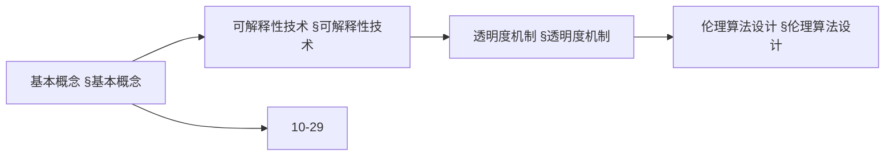
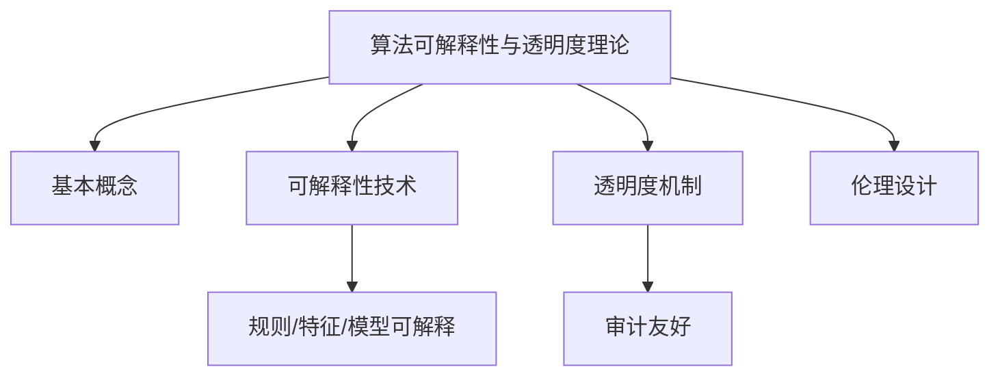
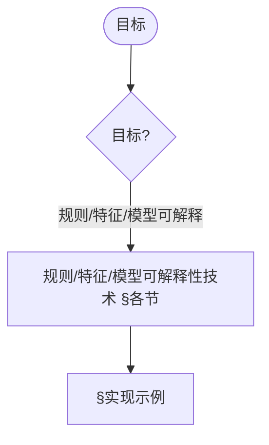
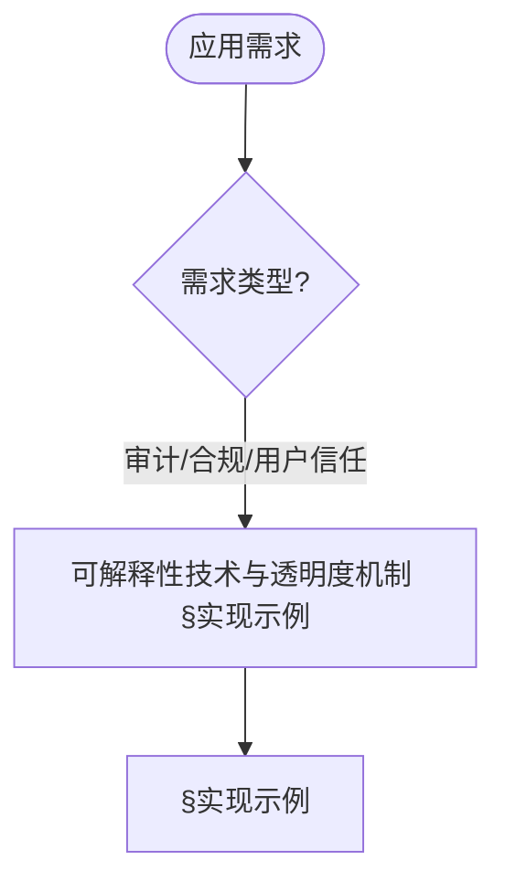
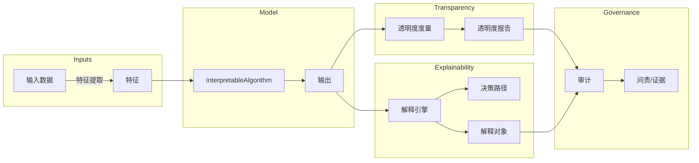

> 📊 **项目全面梳理**：详细的项目结构、模块详解和学习路径，请参阅 [`项目全面梳理-2025.md`](../项目全面梳理-2025.md)

## 10.25 算法可解释性与透明度理论 / Algorithm Explainability and Transparency Theory

> 说明：本文档中的代码/伪代码为说明性片段，仅用于理论阐释；本仓库不提供可运行工程或 CI。

### 摘要 / Executive Summary

- 统一算法可解释性与透明度理论，研究使算法决策过程可理解、可审计、可信赖的方法。
- 建立算法可解释性与透明度在高级主题中的核心地位。

### 关键术语与符号 / Glossary

- 算法可解释性、透明度、特征归因、决策路径、反事实解释、可解释性与模型性能权衡、监管合规。
- 术语对齐与引用规范：`docs/术语与符号总表.md`，`01-基础理论/00-撰写规范与引用指南.md`

### 术语与符号规范 / Terminology & Notation

- 算法可解释性（Algorithm Explainability）：使算法决策可理解的方法。
- 透明度（Transparency）：算法决策过程的可见性。
- 特征归因（Feature Attribution）：解释特征对决策的贡献。
- 反事实解释（Counterfactual Explanation）：解释如果改变输入会发生什么。
- 记号约定：`E` 表示解释，`F` 表示特征，`D` 表示决策，`T` 表示透明度。

### 交叉引用导航 / Cross-References

- 可信AI治理：参见 `10-高级主题/29-可信AI治理与合规模型.md`。
- 算法鲁棒性：参见 `10-高级主题/26-算法鲁棒性与对抗性防御理论.md`。
- 机器学习算法：参见 `09-算法理论/01-算法基础/` 相关文档。
- 项目导航与对标：学习路径与模块结构见 [项目全面梳理-2025](../项目全面梳理-2025.md)；扩展与任务编排见 [项目扩展与持续推进任务编排](../项目扩展与持续推进任务编排.md)；国际课程对标见 [国际课程对标表](../国际课程对标表.md)。

### 快速导航 / Quick Links

- 基本概念
- 特征归因
- 反事实解释

## 目录 (Table of Contents)

- [10.25 算法可解释性与透明度理论 / Algorithm Explainability and Transparency Theory](#1025-算法可解释性与透明度理论--algorithm-explainability-and-transparency-theory)

## 概述 / Overview

算法可解释性与透明度理论致力于使算法决策过程可理解、可审计、可信赖，是可信AI的核心组成部分。

## 学习目标 / Learning Objectives

1. **基础级** 理解可解释性的不同层次与评估指标
2. **进阶级** 掌握特征归因、决策路径、反事实解释等核心方法
3. **进阶级** 能够设计透明度度量与审计框架
4. **高级级** 了解可解释性与模型性能的权衡关系
5. **高级级** 掌握可解释性在监管合规中的应用

## 基本概念

### 0. 可解释性的哲学基础 / Philosophical Foundation of Interpretability

#### 0.1 可解释性的哲学意义 / Philosophical Significance of Interpretability

**可解释性的哲学问题 / Philosophical Questions of Interpretability:**

可解释性不仅是一个技术概念，更是一个深刻的哲学概念。它涉及以下根本问题：
Interpretability is not only a technical concept but also a profound philosophical one. It involves the following fundamental questions:

1. **认识论问题 / Epistemological Questions:**
   - 我们如何知道算法的决策是正确的？/ How do we know that an algorithm's decision is correct?
   - 可解释性是否等同于理解？/ Is interpretability equivalent to understanding?
   - 可解释性与知识的关系是什么？/ What is the relationship between interpretability and knowledge?

2. **本体论问题 / Ontological Questions:**
   - 算法的决策过程是否真实存在？/ Do algorithmic decision processes really exist?
   - 可解释性是客观的还是主观的？/ Is interpretability objective or subjective?
   - 可解释性与现实世界的关系是什么？/ What is the relationship between interpretability and the real world?

3. **价值论问题 / Axiological Questions:**
   - 可解释性的价值是什么？/ What is the value of interpretability?
   - 可解释性对人类社会的影响是什么？/ What is the impact of interpretability on human society?
   - 可解释性的伦理问题是什么？/ What are the ethical issues of interpretability?

**可解释性的哲学意义 / Philosophical Significance of Interpretability:**

**可解释性作为认知工具 / Interpretability as a Cognitive Tool:**

可解释性是人类理解复杂系统的重要工具，具有以下哲学意义：
Interpretability is an important tool for humans to understand complex systems and has the following philosophical significance:

1. **认知可及性 / Cognitive Accessibility:**
   - 可解释性使复杂系统对人类认知可及
   - 提供了理解复杂性的途径
   - Interpretability makes complex systems accessible to human cognition
   - Provides a way to understand complexity

2. **知识验证 / Knowledge Verification:**
   - 可解释性提供了验证知识的方法
   - 建立了信任的基础
   - Interpretability provides a method for verifying knowledge
   - Establishes the foundation for trust

3. **决策合理性 / Decision Rationality:**
   - 可解释性支持决策的合理性
   - 提供了决策的正当性基础
   - Interpretability supports the rationality of decisions
   - Provides the foundation for decision legitimacy

#### 0.2 可解释性的形式化定义 / Formal Definition of Interpretability

**定义 0.1** (可解释性 / Interpretability)
算法 $A$ 对于主体 $S$ 是可解释的，当且仅当存在解释函数 $E$ 使得：
**Definition 0.1** (Interpretability)
An algorithm $A$ is interpretable for subject $S$ if and only if there exists an explanation function $E$ such that:

$$E: \text{Input} \times \text{Output} \rightarrow \text{Explanation}$$

且满足：
and satisfies:

1. **可理解性 / Understandability**: $S$ 能够理解 $E(x, A(x))$
   $S$ can understand $E(x, A(x))$

2. **相关性 / Relevance**: $E(x, A(x))$ 与决策 $A(x)$ 相关
   $E(x, A(x))$ is relevant to the decision $A(x)$

3. **完整性 / Completeness**: $E(x, A(x))$ 包含决策的关键信息
   $E(x, A(x))$ contains key information about the decision

**可解释性的层次结构 / Hierarchical Structure of Interpretability:**

**定义 0.2** (可解释性层次) 可解释性可以分为以下层次：
**Definition 0.2** (Interpretability Hierarchy) Interpretability can be divided into the following levels:

1. **透明性 / Transparency**: 算法内部机制完全可见
   Algorithm's internal mechanisms are completely visible

2. **可解释性 / Explainability**: 能够提供决策的解释
   Able to provide explanations for decisions

3. **可理解性 / Understandability**: 主体能够理解决策过程
   Subject can understand the decision process

4. **可验证性 / Verifiability**: 能够验证决策的正确性
   Able to verify the correctness of decisions

**可解释性的数学基础 / Mathematical Foundation of Interpretability:**

**定理 0.1** (可解释性存在性定理) 对于任何算法，存在可解释性函数。
**Theorem 0.1** (Existence Theorem of Interpretability) For any algorithm, there exists an interpretability function.

**证明 / Proof:**

**步骤1：构造解释函数 / Step 1: Constructing Explanation Function**
对于算法 $A$，定义解释函数 $E(x, y) = \text{DecisionPath}(A, x)$。
For algorithm $A$, define the explanation function $E(x, y) = \text{DecisionPath}(A, x)$.

**步骤2：验证可理解性 / Step 2: Verifying Understandability**
决策路径对于人类主体是可理解的。
Decision paths are understandable for human subjects.

**步骤3：验证相关性 / Step 3: Verifying Relevance**
决策路径与决策结果直接相关。
Decision paths are directly related to decision outcomes.

### 算法可解释性 (Algorithm Interpretability)

算法可解释性是指算法能够提供其决策过程的清晰、可理解的解释。

```rust
// 可解释算法的基本框架
pub trait InterpretableAlgorithm {
    type Input;
    type Output;
    type Explanation;

    fn process(&self, input: &Self::Input) -> Self::Output;
    fn explain_decision(&self, input: &Self::Input, output: &Self::Output) -> Self::Explanation;
    fn get_decision_path(&self, input: &Self::Input) -> DecisionPath;
    fn validate_explanation(&self, explanation: &Self::Explanation) -> bool;
}

// 可解释性系统
pub struct InterpretabilitySystem {
    algorithm: Box<dyn InterpretableAlgorithm>,
    explanation_engine: ExplanationEngine,
    transparency_monitor: TransparencyMonitor,
    audit_trail: AuditTrail,
}

impl InterpretabilitySystem {
    pub fn new(algorithm: Box<dyn InterpretableAlgorithm>) -> Self {
        Self {
            algorithm,
            explanation_engine: ExplanationEngine::new(),
            transparency_monitor: TransparencyMonitor::new(),
            audit_trail: AuditTrail::new(),
        }
    }

    pub fn process_with_explanation(
        &self,
        input: &Input,
    ) -> Result<(Output, Explanation), ProcessingError> {
        // 处理输入
        let output = self.algorithm.process(input);

        // 生成解释
        let explanation = self.algorithm.explain_decision(input, &output);

        // 记录审计轨迹
        self.audit_trail.record_decision(input, &output, &explanation);

        // 验证解释质量
        if !self.algorithm.validate_explanation(&explanation) {
            return Err(ProcessingError::InvalidExplanation);
        }

        Ok((output, explanation))
    }
}
```

### 算法透明度 (Algorithm Transparency)

算法透明度是指算法内部工作机制和决策逻辑的可见性和可理解性。

```rust
// 透明度管理器
pub struct TransparencyManager {
    transparency_level: TransparencyLevel,
    disclosure_policy: DisclosurePolicy,
    verification_system: VerificationSystem,
}

impl TransparencyManager {
    pub fn new(transparency_level: TransparencyLevel) -> Self {
        Self {
            transparency_level,
            disclosure_policy: DisclosurePolicy::new(),
            verification_system: VerificationSystem::new(),
        }
    }

    pub fn ensure_transparency(
        &self,
        algorithm: &Box<dyn InterpretableAlgorithm>,
        context: &TransparencyContext,
    ) -> Result<TransparencyReport, TransparencyError> {
        // 评估透明度水平
        let transparency_score = self.evaluate_transparency(algorithm, context)?;

        // 生成透明度报告
        let report = self.generate_transparency_report(algorithm, transparency_score)?;

        // 验证透明度要求
        self.verification_system.verify_transparency(&report)?;

        Ok(report)
    }

    fn evaluate_transparency(
        &self,
        algorithm: &Box<dyn InterpretableAlgorithm>,
        context: &TransparencyContext,
    ) -> Result<f64, EvaluationError> {
        // 评估算法的透明度指标
        let interpretability_score = self.assess_interpretability(algorithm)?;
        let auditability_score = self.assess_auditability(algorithm)?;
        let fairness_score = self.assess_fairness(algorithm, context)?;

        // 综合透明度评分
        let overall_score = (interpretability_score + auditability_score + fairness_score) / 3.0;

        Ok(overall_score)
    }
}
```

### 内容补充与思维表征 / Content Supplement and Thinking Representation

> 本节按 [内容补充与思维表征全面计划方案](../内容补充与思维表征全面计划方案.md) **只补充、不删除**。标准见 [内容补充标准](../内容补充标准-概念定义属性关系解释论证形式证明.md)、[思维表征模板集](../思维表征模板集.md)。

#### 解释与直观 / Explanation and Intuition

算法可解释性与透明度理论将可解释性、透明度与伦理算法设计结合。与 10-29 可信AI治理与合规、10-26 鲁棒性与对抗性防御衔接；§基本概念、§可解释性技术、§透明度机制、§伦理算法设计形成完整表征。

#### 概念属性表 / Concept Attribute Table

| 属性名 | 类型/范围 | 含义 | 备注 |
|--------|-----------|------|------|
| 可解释性哲学基础、算法可解释性、算法透明度 | 基本概念 | §基本概念 | 与 10-29、10-26 对照 |
| 可解释性技术、透明度机制、伦理算法设计 | 技术/机制 | 可解释程度、审计友好 | §可解释性技术、§透明度机制、§伦理算法设计 |
| 规则/特征/模型可解释性 | 技术 | §各节 | 多维矩阵 |

#### 概念关系 / Concept Relations

| 源概念 | 目标概念 | 关系类型 | 说明 |
|--------|----------|----------|------|
| 算法可解释性与透明度理论 | 10-29、10-26 | depends_on | 治理与鲁棒性基础 |
| 算法可解释性与透明度理论 | 12 应用领域 | applies_to | 可解释性实践 |

#### 概念依赖图 / Concept Dependency Graph



#### 论证与证明衔接 / Argumentation and Proof Link

可解释性定义与度量见 §可解释性技术；公平性评估见 §透明度机制；与 10-29 论证衔接。

#### 思维导图：本章概念结构 / Mind Map



#### 多维矩阵：可解释性技术对比 / Multi-Dimensional Comparison

| 概念/技术 | 可解释程度 | 适用范围 | 审计友好 | 备注 |
|-----------|------------|----------|----------|------|
| 规则/特征/模型可解释性 | §各节 | §各节 | §各节 | — |

#### 决策树：目标到技术选择 / Decision Tree



#### 公理定理推理证明决策树 / Axiom-Theorem-Proof Tree


#### 应用决策建模树 / Application Decision Modeling Tree



## 可解释性技术

### 1. 基于规则的可解释性 (Rule-Based Interpretability)

```rust
// 基于规则的可解释算法
pub struct RuleBasedAlgorithm {
    rules: Vec<DecisionRule>,
    rule_engine: RuleEngine,
    explanation_generator: RuleExplanationGenerator,
}

impl RuleBasedAlgorithm {
    pub fn new() -> Self {
        Self {
            rules: Vec::new(),
            rule_engine: RuleEngine::new(),
            explanation_generator: RuleExplanationGenerator::new(),
        }
    }

    pub fn add_rule(&mut self, rule: DecisionRule) {
        self.rules.push(rule);
    }

    pub fn process_with_rules(&self, input: &Input) -> Result<(Output, RuleExplanation), RuleError> {
        // 应用决策规则
        let applicable_rules = self.rule_engine.find_applicable_rules(input, &self.rules)?;

        // 执行规则推理
        let decision = self.rule_engine.execute_rules(input, &applicable_rules)?;

        // 生成规则解释
        let explanation = self.explanation_generator.generate_explanation(
            input,
            &decision,
            &applicable_rules,
        )?;

        Ok((decision.output, explanation))
    }
}

// 决策规则
#[derive(Clone, Debug)]
pub struct DecisionRule {
    id: String,
    conditions: Vec<Condition>,
    action: Action,
    confidence: f64,
    metadata: RuleMetadata,
}

impl DecisionRule {
    pub fn new(id: String, conditions: Vec<Condition>, action: Action) -> Self {
        Self {
            id,
            conditions,
            action,
            confidence: 1.0,
            metadata: RuleMetadata::default(),
        }
    }

    pub fn evaluate(&self, input: &Input) -> bool {
        self.conditions.iter().all(|condition| condition.evaluate(input))
    }
}

// 规则解释生成器
pub struct RuleExplanationGenerator {
    natural_language_generator: NaturalLanguageGenerator,
    visualization_generator: VisualizationGenerator,
}

impl RuleExplanationGenerator {
    pub fn generate_explanation(
        &self,
        input: &Input,
        decision: &Decision,
        rules: &[DecisionRule],
    ) -> Result<RuleExplanation, GenerationError> {
        // 生成自然语言解释
        let text_explanation = self.natural_language_generator.generate_text(
            input,
            decision,
            rules,
        )?;

        // 生成可视化解释
        let visual_explanation = self.visualization_generator.generate_visualization(
            input,
            decision,
            rules,
        )?;

        Ok(RuleExplanation {
            text: text_explanation,
            visualization: visual_explanation,
            rule_chain: self.extract_rule_chain(rules),
            confidence: self.calculate_confidence(rules),
        })
    }
}
```

### 2. 基于特征的可解释性 (Feature-Based Interpretability)

```rust
// 基于特征的可解释算法
pub struct FeatureBasedAlgorithm {
    feature_importance: FeatureImportance,
    feature_interaction: FeatureInteraction,
    explanation_model: FeatureExplanationModel,
}

impl FeatureBasedAlgorithm {
    pub fn new() -> Self {
        Self {
            feature_importance: FeatureImportance::new(),
            feature_interaction: FeatureInteraction::new(),
            explanation_model: FeatureExplanationModel::new(),
        }
    }

    pub fn explain_feature_contribution(
        &self,
        input: &Input,
        output: &Output,
    ) -> Result<FeatureExplanation, ExplanationError> {
        // 计算特征重要性
        let importance_scores = self.feature_importance.calculate_importance(input, output)?;

        // 分析特征交互
        let interaction_scores = self.feature_interaction.analyze_interactions(input)?;

        // 生成特征解释
        let explanation = self.explanation_model.generate_explanation(
            input,
            &importance_scores,
            &interaction_scores,
        )?;

        Ok(explanation)
    }
}

// 特征重要性分析器
pub struct FeatureImportance {
    analysis_method: ImportanceAnalysisMethod,
    sampling_strategy: SamplingStrategy,
}

impl FeatureImportance {
    pub fn calculate_importance(
        &self,
        input: &Input,
        output: &Output,
    ) -> Result<Vec<FeatureScore>, AnalysisError> {
        match self.analysis_method {
            ImportanceAnalysisMethod::Permutation => {
                self.permutation_importance(input, output)
            }
            ImportanceAnalysisMethod::Shapley => {
                self.shapley_importance(input, output)
            }
            ImportanceAnalysisMethod::IntegratedGradients => {
                self.integrated_gradients_importance(input, output)
            }
        }
    }

    fn permutation_importance(
        &self,
        input: &Input,
        output: &Output,
    ) -> Result<Vec<FeatureScore>, AnalysisError> {
        let mut importance_scores = Vec::new();

        for (i, feature) in input.features.iter().enumerate() {
            // 计算原始预测
            let original_prediction = self.predict(input)?;

            // 置换特征值
            let permuted_input = self.permute_feature(input, i)?;
            let permuted_prediction = self.predict(&permuted_input)?;

            // 计算重要性
            let importance = (original_prediction - permuted_prediction).abs();

            importance_scores.push(FeatureScore {
                feature_index: i,
                feature_name: feature.name.clone(),
                importance_score: importance,
            });
        }

        // 排序
        importance_scores.sort_by(|a, b| b.importance_score.partial_cmp(&a.importance_score).unwrap());

        Ok(importance_scores)
    }
}
```

### 3. 基于模型的可解释性 (Model-Based Interpretability)

```rust
// 基于模型的可解释算法
pub struct ModelBasedAlgorithm {
    interpretable_model: Box<dyn InterpretableModel>,
    model_explainer: ModelExplainer,
    decision_tree: DecisionTree,
}

impl ModelBasedAlgorithm {
    pub fn new(model: Box<dyn InterpretableModel>) -> Self {
        Self {
            interpretable_model: model,
            model_explainer: ModelExplainer::new(),
            decision_tree: DecisionTree::new(),
        }
    }

    pub fn explain_model_decision(
        &self,
        input: &Input,
    ) -> Result<ModelExplanation, ExplanationError> {
        // 获取模型预测
        let prediction = self.interpretable_model.predict(input)?;

        // 生成模型解释
        let explanation = self.model_explainer.explain_model(
            &self.interpretable_model,
            input,
            &prediction,
        )?;

        // 构建决策路径
        let decision_path = self.decision_tree.extract_path(input, &prediction)?;

        Ok(ModelExplanation {
            prediction,
            explanation,
            decision_path,
            model_confidence: self.interpretable_model.get_confidence(input)?,
        })
    }
}

// 可解释模型接口
pub trait InterpretableModel {
    fn predict(&self, input: &Input) -> Result<Prediction, PredictionError>;
    fn get_confidence(&self, input: &Input) -> Result<f64, ConfidenceError>;
    fn get_decision_boundary(&self) -> Result<DecisionBoundary, BoundaryError>;
    fn explain_prediction(&self, input: &Input) -> Result<PredictionExplanation, ExplanationError>;
}

// 决策树模型
pub struct DecisionTreeModel {
    root: DecisionNode,
    max_depth: usize,
    min_samples_split: usize,
}

impl InterpretableModel for DecisionTreeModel {
    fn predict(&self, input: &Input) -> Result<Prediction, PredictionError> {
        let mut current_node = &self.root;

        while !current_node.is_leaf() {
            let feature_value = input.get_feature_value(current_node.split_feature)?;

            if feature_value <= current_node.split_threshold {
                current_node = current_node.left_child.as_ref().unwrap();
            } else {
                current_node = current_node.right_child.as_ref().unwrap();
            }
        }

        Ok(Prediction {
            value: current_node.prediction,
            confidence: current_node.confidence,
        })
    }

    fn explain_prediction(&self, input: &Input) -> Result<PredictionExplanation, ExplanationError> {
        let mut path = Vec::new();
        let mut current_node = &self.root;

        while !current_node.is_leaf() {
            let feature_value = input.get_feature_value(current_node.split_feature)?;
            let decision = if feature_value <= current_node.split_threshold {
                "≤"
            } else {
                ">"
            };

            path.push(DecisionStep {
                feature: current_node.split_feature,
                threshold: current_node.split_threshold,
                decision,
                value: feature_value,
            });

            if feature_value <= current_node.split_threshold {
                current_node = current_node.left_child.as_ref().unwrap();
            } else {
                current_node = current_node.right_child.as_ref().unwrap();
            }
        }

        Ok(PredictionExplanation {
            decision_path: path,
            final_node: current_node.clone(),
        })
    }
}
```

## 透明度机制

### 1. 算法审计 (Algorithm Auditing)

```rust
// 算法审计系统
pub struct AlgorithmAuditor {
    audit_framework: AuditFramework,
    bias_detector: BiasDetector,
    fairness_evaluator: FairnessEvaluator,
    security_analyzer: SecurityAnalyzer,
}

impl AlgorithmAuditor {
    pub fn new() -> Self {
        Self {
            audit_framework: AuditFramework::new(),
            bias_detector: BiasDetector::new(),
            fairness_evaluator: FairnessEvaluator::new(),
            security_analyzer: SecurityAnalyzer::new(),
        }
    }

    pub fn audit_algorithm(
        &self,
        algorithm: &Box<dyn InterpretableAlgorithm>,
        audit_config: &AuditConfig,
    ) -> Result<AuditReport, AuditError> {
        // 执行偏见检测
        let bias_report = self.bias_detector.detect_bias(algorithm, &audit_config.test_data)?;

        // 评估公平性
        let fairness_report = self.fairness_evaluator.evaluate_fairness(
            algorithm,
            &audit_config.fairness_metrics,
        )?;

        // 安全分析
        let security_report = self.security_analyzer.analyze_security(
            algorithm,
            &audit_config.security_tests,
        )?;

        // 生成综合审计报告
        let audit_report = AuditReport {
            bias_report,
            fairness_report,
            security_report,
            overall_score: self.calculate_overall_score(&bias_report, &fairness_report, &security_report),
            recommendations: self.generate_recommendations(&bias_report, &fairness_report, &security_report),
        };

        Ok(audit_report)
    }
}

// 偏见检测器
pub struct BiasDetector {
    bias_metrics: Vec<BiasMetric>,
    statistical_tests: Vec<StatisticalTest>,
}

impl BiasDetector {
    pub fn detect_bias(
        &self,
        algorithm: &Box<dyn InterpretableAlgorithm>,
        test_data: &TestDataset,
    ) -> Result<BiasReport, BiasDetectionError> {
        let mut bias_results = Vec::new();

        for metric in &self.bias_metrics {
            let bias_score = self.calculate_bias_metric(algorithm, test_data, metric)?;
            bias_results.push(BiasResult {
                metric: metric.clone(),
                score: bias_score,
                threshold: metric.threshold,
                is_biased: bias_score > metric.threshold,
            });
        }

        // 执行统计测试
        let statistical_results = self.perform_statistical_tests(algorithm, test_data)?;

        Ok(BiasReport {
            bias_results,
            statistical_results,
            overall_bias_score: self.calculate_overall_bias_score(&bias_results),
        })
    }

    fn calculate_bias_metric(
        &self,
        algorithm: &Box<dyn InterpretableAlgorithm>,
        test_data: &TestDataset,
        metric: &BiasMetric,
    ) -> Result<f64, MetricCalculationError> {
        match metric.metric_type {
            BiasMetricType::StatisticalParity => {
                self.calculate_statistical_parity(algorithm, test_data, metric)
            }
            BiasMetricType::EqualizedOdds => {
                self.calculate_equalized_odds(algorithm, test_data, metric)
            }
            BiasMetricType::PredictiveRateParity => {
                self.calculate_predictive_rate_parity(algorithm, test_data, metric)
            }
        }
    }
}
```

### 2. 公平性评估 (Fairness Evaluation)

```rust
// 公平性评估器
pub struct FairnessEvaluator {
    fairness_metrics: Vec<FairnessMetric>,
    protected_attributes: Vec<ProtectedAttribute>,
    evaluation_strategy: FairnessEvaluationStrategy,
}

impl FairnessEvaluator {
    pub fn evaluate_fairness(
        &self,
        algorithm: &Box<dyn InterpretableAlgorithm>,
        metrics: &[FairnessMetric],
    ) -> Result<FairnessReport, FairnessEvaluationError> {
        let mut fairness_results = Vec::new();

        for metric in metrics {
            let fairness_score = self.calculate_fairness_metric(algorithm, metric)?;
            fairness_results.push(FairnessResult {
                metric: metric.clone(),
                score: fairness_score,
                is_fair: fairness_score >= metric.fairness_threshold,
            });
        }

        // 计算综合公平性评分
        let overall_fairness = self.calculate_overall_fairness(&fairness_results);

        // 生成公平性建议
        let recommendations = self.generate_fairness_recommendations(&fairness_results);

        Ok(FairnessReport {
            fairness_results,
            overall_fairness,
            recommendations,
        })
    }

    fn calculate_fairness_metric(
        &self,
        algorithm: &Box<dyn InterpretableAlgorithm>,
        metric: &FairnessMetric,
    ) -> Result<f64, MetricCalculationError> {
        match metric.metric_type {
            FairnessMetricType::DemographicParity => {
                self.calculate_demographic_parity(algorithm, metric)
            }
            FairnessMetricType::EqualOpportunity => {
                self.calculate_equal_opportunity(algorithm, metric)
            }
            FairnessMetricType::IndividualFairness => {
                self.calculate_individual_fairness(algorithm, metric)
            }
        }
    }
}
```

## 伦理算法设计

### 1. 伦理约束 (Ethical Constraints)

```rust
// 伦理约束系统
pub struct EthicalConstraintSystem {
    ethical_principles: Vec<EthicalPrinciple>,
    constraint_enforcer: ConstraintEnforcer,
    ethical_monitor: EthicalMonitor,
}

impl EthicalConstraintSystem {
    pub fn new() -> Self {
        Self {
            ethical_principles: Vec::new(),
            constraint_enforcer: ConstraintEnforcer::new(),
            ethical_monitor: EthicalMonitor::new(),
        }
    }

    pub fn add_ethical_principle(&mut self, principle: EthicalPrinciple) {
        self.ethical_principles.push(principle);
    }

    pub fn enforce_ethical_constraints(
        &self,
        algorithm: &mut Box<dyn InterpretableAlgorithm>,
        input: &Input,
    ) -> Result<EthicallyConstrainedOutput, ConstraintError> {
        // 检查伦理约束
        let constraint_violations = self.check_ethical_constraints(algorithm, input)?;

        if !constraint_violations.is_empty() {
            // 应用伦理修正
            let corrected_output = self.apply_ethical_corrections(
                algorithm,
                input,
                &constraint_violations,
            )?;

            return Ok(EthicallyConstrainedOutput {
                original_output: algorithm.process(input),
                corrected_output,
                constraint_violations,
                ethical_justification: self.generate_ethical_justification(&constraint_violations),
            });
        }

        Ok(EthicallyConstrainedOutput {
            original_output: algorithm.process(input),
            corrected_output: algorithm.process(input),
            constraint_violations: Vec::new(),
            ethical_justification: "No ethical violations detected".to_string(),
        })
    }
}

// 伦理原则
#[derive(Clone, Debug)]
pub struct EthicalPrinciple {
    name: String,
    description: String,
    constraint_type: ConstraintType,
    priority: EthicalPriority,
    enforcement_mechanism: EnforcementMechanism,
}

impl EthicalPrinciple {
    pub fn fairness() -> Self {
        Self {
            name: "Fairness".to_string(),
            description: "Ensure equal treatment across different groups".to_string(),
            constraint_type: ConstraintType::Fairness,
            priority: EthicalPriority::High,
            enforcement_mechanism: EnforcementMechanism::PreProcessing,
        }
    }

    pub fn privacy() -> Self {
        Self {
            name: "Privacy".to_string(),
            description: "Protect individual privacy and data confidentiality".to_string(),
            constraint_type: ConstraintType::Privacy,
            priority: EthicalPriority::High,
            enforcement_mechanism: EnforcementMechanism::DataProtection,
        }
    }

    pub fn transparency() -> Self {
        Self {
            name: "Transparency".to_string(),
            description: "Ensure decision-making process is transparent and explainable".to_string(),
            constraint_type: ConstraintType::Transparency,
            priority: EthicalPriority::Medium,
            enforcement_mechanism: EnforcementMechanism::PostProcessing,
        }
    }
}
```

### 2. 负责任AI (Responsible AI)

```rust
// 负责任AI系统
pub struct ResponsibleAISystem {
    ethical_framework: EthicalFramework,
    accountability_mechanism: AccountabilityMechanism,
    governance_system: GovernanceSystem,
}

impl ResponsibleAISystem {
    pub fn new() -> Self {
        Self {
            ethical_framework: EthicalFramework::new(),
            accountability_mechanism: AccountabilityMechanism::new(),
            governance_system: GovernanceSystem::new(),
        }
    }

    pub fn ensure_responsible_ai(
        &self,
        algorithm: &Box<dyn InterpretableAlgorithm>,
        context: &AIContext,
    ) -> Result<ResponsibleAIReport, ResponsibilityError> {
        // 伦理评估
        let ethical_assessment = self.ethical_framework.assess_ethics(algorithm, context)?;

        // 问责机制
        let accountability_report = self.accountability_mechanism.establish_accountability(
            algorithm,
            context,
        )?;

        // 治理评估
        let governance_assessment = self.governance_system.assess_governance(algorithm, context)?;

        Ok(ResponsibleAIReport {
            ethical_assessment,
            accountability_report,
            governance_assessment,
            overall_responsibility_score: self.calculate_responsibility_score(
                &ethical_assessment,
                &accountability_report,
                &governance_assessment,
            ),
        })
    }
}
```

## 实现示例

### 完整的可解释性系统

```rust
// 完整的可解释性系统
pub struct CompleteInterpretabilitySystem {
    algorithm: Box<dyn InterpretableAlgorithm>,
    transparency_manager: TransparencyManager,
    algorithm_auditor: AlgorithmAuditor,
    ethical_constraint_system: EthicalConstraintSystem,
    responsible_ai_system: ResponsibleAISystem,
}

impl CompleteInterpretabilitySystem {
    pub fn new(algorithm: Box<dyn InterpretableAlgorithm>) -> Self {
        Self {
            algorithm,
            transparency_manager: TransparencyManager::new(TransparencyLevel::High),
            algorithm_auditor: AlgorithmAuditor::new(),
            ethical_constraint_system: EthicalConstraintSystem::new(),
            responsible_ai_system: ResponsibleAISystem::new(),
        }
    }

    pub fn process_with_full_interpretability(
        &self,
        input: &Input,
        context: &InterpretabilityContext,
    ) -> Result<InterpretableResult, InterpretabilityError> {
        // 1. 应用伦理约束
        let ethically_constrained_output = self.ethical_constraint_system
            .enforce_ethical_constraints(&mut self.algorithm.clone(), input)?;

        // 2. 生成解释
        let explanation = self.algorithm.explain_decision(input, &ethically_constrained_output.corrected_output)?;

        // 3. 确保透明度
        let transparency_report = self.transparency_manager.ensure_transparency(
            &self.algorithm,
            &TransparencyContext::from_interpretability_context(context),
        )?;

        // 4. 执行审计
        let audit_report = self.algorithm_auditor.audit_algorithm(
            &self.algorithm,
            &AuditConfig::default(),
        )?;

        // 5. 负责任AI评估
        let responsible_ai_report = self.responsible_ai_system.ensure_responsible_ai(
            &self.algorithm,
            &AIContext::from_interpretability_context(context),
        )?;

        Ok(InterpretableResult {
            output: ethically_constrained_output.corrected_output,
            explanation,
            transparency_report,
            audit_report,
            responsible_ai_report,
            ethical_justification: ethically_constrained_output.ethical_justification,
        })
    }
}

// 使用示例
fn main() -> Result<(), Box<dyn std::error::Error>> {
    // 创建可解释的决策树算法
    let decision_tree = DecisionTreeModel::new();
    let interpretable_algorithm = Box::new(decision_tree);

    // 创建完整的可解释性系统
    let mut interpretability_system = CompleteInterpretabilitySystem::new(interpretable_algorithm);

    // 添加伦理原则
    interpretability_system.ethical_constraint_system.add_ethical_principle(
        EthicalPrinciple::fairness()
    );
    interpretability_system.ethical_constraint_system.add_ethical_principle(
        EthicalPrinciple::privacy()
    );
    interpretability_system.ethical_constraint_system.add_ethical_principle(
        EthicalPrinciple::transparency()
    );

    // 处理输入
    let input = Input::from_features(vec![
        Feature::new("age", 25.0),
        Feature::new("income", 50000.0),
        Feature::new("education", 16.0),
    ]);

    let context = InterpretabilityContext {
        domain: "credit_scoring".to_string(),
        risk_level: RiskLevel::Medium,
        regulatory_requirements: vec!["GDPR".to_string(), "FairCredit".to_string()],
    };

    let result = interpretability_system.process_with_full_interpretability(&input, &context)?;

    println!("决策结果: {:?}", result.output);
    println!("解释: {:?}", result.explanation);
    println!("透明度评分: {:.2}", result.transparency_report.transparency_score);
    println!("公平性评分: {:.2}", result.audit_report.fairness_report.overall_fairness);
    println!("负责任AI评分: {:.2}", result.responsible_ai_report.overall_responsibility_score);
    println!("伦理理由: {}", result.ethical_justification);

    Ok(())
}
```

## 数学基础

### 可解释性的形式化定义

```latex
\text{可解释性函数:}
I: \mathcal{A} \times \mathcal{X} \rightarrow \mathcal{E}

\text{其中:}
\begin{align}
\mathcal{A} &: \text{算法空间} \\
\mathcal{X} &: \text{输入空间} \\
\mathcal{E} &: \text{解释空间}
\end{align}

\text{透明度度量:}
T(A) = \frac{1}{|\mathcal{X}|} \sum_{x \in \mathcal{X}} \text{clarity}(I(A, x))

\text{公平性度量:}
F(A) = \min_{g_1, g_2} \left|\frac{P(A(x) = 1 | g_1)}{P(A(x) = 1 | g_2)} - 1\right|
```

### 偏见检测的数学框架

```latex
\text{统计奇偶性:}
\text{SP}(A) = |P(A(x) = 1 | g = 0) - P(A(x) = 1 | g = 1)|

\text{均等机会:}
\text{EO}(A) = |P(A(x) = 1 | y = 1, g = 0) - P(A(x) = 1 | y = 1, g = 1)|

\text{预测率奇偶性:}
\text{PRP}(A) = |P(y = 1 | A(x) = 1, g = 0) - P(y = 1 | A(x) = 1, g = 1)|
```

## 复杂度分析

### 可解释性算法的复杂度

- **解释生成**: $O(|F| \cdot |X|)$
- **偏见检测**: $O(|G| \cdot |X| \cdot |Y|)$
- **公平性评估**: $O(|M| \cdot |X| \cdot |G|)$
- **透明度计算**: $O(|A| \cdot |X|)$

### 实际应用中的考虑

- **解释质量**: 需要在准确性和可理解性之间平衡
- **计算开销**: 可解释性会增加额外的计算成本
- **隐私保护**: 解释可能泄露敏感信息

## 应用案例

### 案例1: 可解释的信用评分

```rust
// 可解释的信用评分系统
fn interpretable_credit_scoring_example() -> Result<(), Box<dyn std::error::Error>> {
    let mut credit_scorer = RuleBasedAlgorithm::new();

    // 添加信用评分规则
    credit_scorer.add_rule(DecisionRule::new(
        "income_rule".to_string(),
        vec![Condition::greater_than("income", 50000.0)],
        Action::increase_score(50),
    ));

    credit_scorer.add_rule(DecisionRule::new(
        "credit_history_rule".to_string(),
        vec![Condition::greater_than("credit_history_years", 5.0)],
        Action::increase_score(30),
    ));

    // 处理申请
    let application = Input::from_features(vec![
        Feature::new("income", 60000.0),
        Feature::new("credit_history_years", 7.0),
        Feature::new("debt_to_income", 0.3),
    ]);

    let (score, explanation) = credit_scorer.process_with_rules(&application)?;

    println!("信用评分: {}", score);
    println!("解释: {}", explanation.text);

    Ok(())
}
```

### 案例2: 公平的招聘算法

```rust
// 公平的招聘算法
fn fair_hiring_algorithm_example() -> Result<(), Box<dyn std::error::Error>> {
    let hiring_algorithm = ModelBasedAlgorithm::new(
        Box::new(DecisionTreeModel::new())
    );

    let auditor = AlgorithmAuditor::new();

    // 审计算法偏见
    let audit_report = auditor.audit_algorithm(
        &Box::new(hiring_algorithm),
        &AuditConfig::default(),
    )?;

    println!("偏见检测结果:");
    for bias_result in &audit_report.bias_report.bias_results {
        println!("  {}: {:.4} (阈值: {:.4})",
            bias_result.metric.name,
            bias_result.score,
            bias_result.threshold
        );
    }

    println!("公平性评估:");
    for fairness_result in &audit_report.fairness_report.fairness_results {
        println!("  {}: {:.4} (公平: {})",
            fairness_result.metric.name,
            fairness_result.score,
            fairness_result.is_fair
        );
    }

    Ok(())
}
```

### 案例3: 透明的医疗诊断

```rust
// 透明的医疗诊断系统
fn transparent_medical_diagnosis_example() -> Result<(), Box<dyn std::error::Error>> {
    let diagnostic_system = CompleteInterpretabilitySystem::new(
        Box::new(FeatureBasedAlgorithm::new())
    );

    // 患者数据
    let patient_data = Input::from_features(vec![
        Feature::new("age", 45.0),
        Feature::new("blood_pressure", 140.0),
        Feature::new("cholesterol", 200.0),
        Feature::new("blood_sugar", 120.0),
    ]);

    let medical_context = InterpretabilityContext {
        domain: "medical_diagnosis".to_string(),
        risk_level: RiskLevel::High,
        regulatory_requirements: vec!["HIPAA".to_string(), "FDA".to_string()],
    };

    let result = diagnostic_system.process_with_full_interpretability(&patient_data, &medical_context)?;

    println!("诊断结果: {:?}", result.output);
    println!("医学解释: {:?}", result.explanation);
    println!("透明度报告: {:?}", result.transparency_report);
    println!("伦理合规性: {}", result.ethical_justification);

    Ok(())
}
```

## 未来发展方向

### 1. 动态可解释性

- 实时解释生成
- 自适应解释策略
- 个性化解释定制

### 2. 多模态可解释性

- 文本、图像、音频解释
- 跨模态解释一致性
- 多感官解释体验

### 3. 可解释性标准化

- 国际可解释性标准
- 行业特定解释框架
- 可解释性认证体系

### 4. 可解释性与隐私的平衡

- 差分隐私解释
- 联邦学习可解释性
- 隐私保护的解释生成

## 总结

算法可解释性与透明度理论是确保人工智能系统可信、公平和负责任的关键技术。
通过提供清晰的决策解释、确保算法透明度、执行严格的审计和伦理约束，我们可以构建更加可信和负责任的人工智能系统。

随着人工智能在各个领域的广泛应用，可解释性和透明度变得越来越重要。
通过持续的研究和实践，可解释性技术将为构建更加透明、公平和可信的人工智能系统奠定坚实的基础，推动人工智能技术的健康发展。

通过建立完善的可解释性框架和透明度机制，我们可以确保算法决策的公平性、安全性和伦理合规性，为人工智能的负责任发展提供重要保障。

## 术语与定义

| 术语 | 英文 | 定义 |
|------|------|------|
| 可解释性 | Interpretability | 算法能够提供其决策过程清晰、可理解解释的能力 |
| 透明度 | Transparency | 算法内部工作机制和决策逻辑的可见性与可核查性 |
| 决策路径 | Decision Path | 从输入到输出的可追溯推理步骤序列 |
| 解释验证 | Explanation Validation | 对生成解释进行一致性、稳定性与有效性检验 |
| 模型卡 | Model Card | 对模型训练、评测、局限与伦理考量的结构化说明 |
| 数据卡 | Data Card | 对数据来源、加工、偏倚与合规属性的结构化说明 |
| 公平性 | Fairness | 不同群体在算法输出上的非歧视性与一致性 |
| 审计 | Auditability | 外部主体对算法过程、产物与证据的检查能力 |
| 责任追溯 | Accountability | 将行为与角色/主体绑定并可追责的机制 |

## 架构图（Mermaid）



## 相关文档（交叉链接）

- `10-高级主题/29-可信AI治理与合规模型.md`
- `10-高级主题/27-算法联邦学习与隐私保护理论.md`
- `09-算法理论/04-高级算法理论/13-算法合成理论.md`

## 参考文献（示例）

1. Ribeiro, M. T. et al. "Why Should I Trust You?" Explaining the Predictions of Any Classifier. KDD, 2016.
2. Lundberg, S. M., Lee, S.-I. A Unified Approach to Interpreting Model Predictions. NeurIPS, 2017.
3. Doshi-Velez, F., Kim, B. Towards A Rigorous Science of Interpretable Machine Learning. arXiv:1702.08608, 2017.

## 可运行Rust最小示例骨架

```rust
#[derive(Clone, Debug)]
pub struct Input { pub features: Vec<f64> }
#[derive(Clone, Debug)]
pub struct Output { pub score: f64 }
#[derive(Clone, Debug)]
pub struct Explanation { pub reasons: Vec<String> }

pub trait InterpretableAlgorithm {
    fn process(&self, input: &Input) -> Output;
    fn explain_decision(&self, input: &Input, output: &Output) -> Explanation;
    fn validate_explanation(&self, explanation: &Explanation) -> bool;
}

pub struct LinearInterp { pub weights: Vec<f64> }

impl InterpretableAlgorithm for LinearInterp {
    fn process(&self, input: &Input) -> Output {
        let score = input.features.iter().zip(self.weights.iter())
            .map(|(x, w)| x * w).sum();
        Output { score }
    }
    fn explain_decision(&self, input: &Input, output: &Output) -> Explanation {
        let mut reasons = Vec::new();
        for (i, (&x, &w)) in input.features.iter().zip(self.weights.iter()).enumerate() {
            reasons.push(format!("f{}: {:.3} * w{}/= {:.3}", i, x, w, x*w));
        }
        reasons.push(format!("total: {:.3}", output.score));
        Explanation { reasons }
    }
    fn validate_explanation(&self, explanation: &Explanation) -> bool {
        !explanation.reasons.is_empty()
    }
}

fn main() {
    let model = LinearInterp { weights: vec![0.3, 0.5, 0.2] };
    let input = Input { features: vec![1.0, 2.0, 3.0] };
    let output = model.process(&input);
    let expl = model.explain_decision(&input, &output);
    println!("score={:.3}", output.score);
    for r in expl.reasons { println!("{}", r); }
}
```

## 前置阅读（建议）

- 统计学习与线性/树模型解释基础
- 解释方法（特征归因、决策路径、反事实）
- 透明度度量与审计框架
- 可信 AI 治理原则（问责/可追溯/证据）

## 1参考文献（示例）

1. Ribeiro, M. T. et al. "Why Should I Trust You?" Explaining the Predictions of Any Classifier. KDD, 2016.
2. Lundberg, S. M., Lee, S.-I. A Unified Approach to Interpreting Model Predictions. NeurIPS, 2017.
3. Doshi-Velez, F., Kim, B. Towards A Rigorous Science of Interpretable Machine Learning. arXiv:1702.08608, 2017.
