> 📊 **项目全面梳理**：详细的项目结构、模块详解和学习路径，请参阅 [`项目全面梳理-2025.md`](../项目全面梳理-2025.md)

## 10.26 算法鲁棒性与对抗性防御理论 / Algorithm Robustness and Adversarial Defense Theory

> 说明：本文档中的代码/伪代码为说明性片段，仅用于理论阐释；本仓库不提供可运行工程或 CI。

### 摘要 / Executive Summary

- 统一算法鲁棒性与对抗性防御理论，研究设计对噪声、扰动和对抗攻击具有鲁棒性的算法。
- 建立算法鲁棒性与对抗性防御在高级主题中的核心地位。

### 关键术语与符号 / Glossary

- 算法鲁棒性、对抗性防御、对抗攻击、白盒攻击、黑盒攻击、对抗训练、认证鲁棒性、检测与运行时防御。
- 术语对齐与引用规范：`docs/术语与符号总表.md`，`01-基础理论/00-撰写规范与引用指南.md`

### 术语与符号规范 / Terminology & Notation

- 算法鲁棒性（Algorithm Robustness）：算法对噪声和扰动的抵抗能力。
- 对抗性防御（Adversarial Defense）：防护对抗攻击的方法。
- 对抗攻击（Adversarial Attack）：针对算法的恶意攻击。
- 对抗训练（Adversarial Training）：使用对抗样本训练的方法。
- 记号约定：`R` 表示鲁棒性，`A` 表示攻击，`D` 表示防御，`N` 表示噪声。

### 交叉引用导航 / Cross-References

- 算法可解释性：参见 `10-高级主题/25-算法可解释性与透明度理论.md`。
- 可信AI治理：参见 `10-高级主题/29-可信AI治理与合规模型.md`。
- 网络安全算法：参见 `12-应用领域/03-网络安全算法应用.md`。
- 项目导航与对标：学习路径与模块结构见 [项目全面梳理-2025](../项目全面梳理-2025.md)；扩展与任务编排见 [项目扩展与持续推进任务编排](../项目扩展与持续推进任务编排.md)；国际课程对标见 [国际课程对标表](../国际课程对标表.md)。

### 快速导航 / Quick Links

- 基本概念
- 对抗攻击
- 对抗训练

## 目录 (Table of Contents)

- [10.26 算法鲁棒性与对抗性防御理论 / Algorithm Robustness and Adversarial Defense Theory](#1026-算法鲁棒性与对抗性防御理论--algorithm-robustness-and-adversarial-defense-theory)

## 概述 / Overview

算法鲁棒性与对抗性防御理论研究如何设计对噪声、扰动和对抗攻击具有鲁棒性的算法，确保系统在恶意环境下的可靠性。

## 学习目标 / Learning Objectives

1. **基础级** 理解对抗攻击的不同类型（白盒/黑盒/灰盒）与攻击目标
2. **进阶级** 掌握对抗训练、认证鲁棒性等防御方法
3. **进阶级** 能够分析鲁棒性与模型性能的权衡关系
4. **高级级** 了解检测与运行时防御机制的设计原理
5. **高级级** 掌握鲁棒性评估与测试的方法论

## 基本概念

### 算法鲁棒性 (Algorithm Robustness)

算法鲁棒性是指算法在面对输入扰动、噪声或恶意攻击时仍能保持正确性和稳定性的能力。

```rust
// 鲁棒算法的基本框架
pub trait RobustAlgorithm {
    type Input;
    type Output;
    type Perturbation;

    fn process(&self, input: &Self::Input) -> Self::Output;
    fn process_robust(&self, input: &Self::Input, perturbation: &Self::Perturbation) -> Self::Output;
    fn measure_robustness(&self, input: &Self::Input, perturbations: &[Self::Perturbation]) -> RobustnessScore;
    fn defend_against_attack(&self, input: &Self::Input, attack: &AdversarialAttack) -> DefendedOutput;
}

// 鲁棒性系统
pub struct RobustnessSystem {
    algorithm: Box<dyn RobustAlgorithm>,
    defense_mechanism: DefenseMechanism,
    attack_detector: AttackDetector,
    robustness_evaluator: RobustnessEvaluator,
}

impl RobustnessSystem {
    pub fn new(algorithm: Box<dyn RobustAlgorithm>) -> Self {
        Self {
            algorithm,
            defense_mechanism: DefenseMechanism::new(),
            attack_detector: AttackDetector::new(),
            robustness_evaluator: RobustnessEvaluator::new(),
        }
    }

    pub fn process_with_defense(
        &self,
        input: &Input,
    ) -> Result<DefendedOutput, DefenseError> {
        // 检测攻击
        let attack_detected = self.attack_detector.detect_attack(input)?;

        if attack_detected.is_some() {
            // 应用防御机制
            let defended_output = self.defense_mechanism.apply_defense(
                &self.algorithm,
                input,
                &attack_detected.unwrap(),
            )?;

            Ok(defended_output)
        } else {
            // 正常处理
            let output = self.algorithm.process(input);
            Ok(DefendedOutput::new(output, None))
        }
    }
}
```

### 对抗性攻击 (Adversarial Attacks)

对抗性攻击是指通过精心设计的输入扰动来误导算法产生错误输出的攻击方法。

```rust
// 对抗性攻击器
pub struct AdversarialAttacker {
    attack_method: AttackMethod,
    perturbation_budget: f64,
    optimization_strategy: OptimizationStrategy,
}

impl AdversarialAttacker {
    pub fn new(attack_method: AttackMethod, perturbation_budget: f64) -> Self {
        Self {
            attack_method,
            perturbation_budget,
            optimization_strategy: OptimizationStrategy::default(),
        }
    }

    pub fn generate_adversarial_example(
        &self,
        target_algorithm: &Box<dyn RobustAlgorithm>,
        original_input: &Input,
        target_output: Option<Output>,
    ) -> Result<AdversarialExample, AttackError> {
        match self.attack_method {
            AttackMethod::FGSM => {
                self.fast_gradient_sign_method(target_algorithm, original_input, target_output)
            }
            AttackMethod::PGD => {
                self.projected_gradient_descent(target_algorithm, original_input, target_output)
            }
            AttackMethod::CWL2 => {
                self.carlini_wagner_l2_attack(target_algorithm, original_input, target_output)
            }
            AttackMethod::DeepFool => {
                self.deepfool_attack(target_algorithm, original_input, target_output)
            }
        }
    }

    fn fast_gradient_sign_method(
        &self,
        target_algorithm: &Box<dyn RobustAlgorithm>,
        original_input: &Input,
        target_output: Option<Output>,
    ) -> Result<AdversarialExample, AttackError> {
        // 计算梯度
        let gradients = self.compute_gradients(target_algorithm, original_input, target_output)?;

        // 生成对抗性扰动
        let perturbation = self.generate_perturbation_from_gradients(&gradients)?;

        // 应用扰动
        let adversarial_input = self.apply_perturbation(original_input, &perturbation)?;

        Ok(AdversarialExample {
            original_input: original_input.clone(),
            adversarial_input,
            perturbation,
            attack_method: AttackMethod::FGSM,
            success: self.verify_attack_success(target_algorithm, &adversarial_input, target_output)?,
        })
    }
}
```

### 内容补充与思维表征 / Content Supplement and Thinking Representation

> 本节按 [内容补充与思维表征全面计划方案](../内容补充与思维表征全面计划方案.md) **只补充、不删除**。标准见 [内容补充标准](../内容补充标准-概念定义属性关系解释论证形式证明.md)、[思维表征模板集](../思维表征模板集.md)。

#### 解释与直观 / Explanation and Intuition

算法鲁棒性与对抗性防御理论将鲁棒性定义与对抗攻击、防御机制结合。与 10-25 可解释性与透明度、10-29 可信AI治理衔接；§基本概念、§对抗性攻击技术、§防御机制、§鲁棒性评估形成完整表征。

#### 概念属性表 / Concept Attribute Table

| 属性名 | 类型/范围 | 含义 | 备注 |
|--------|-----------|------|------|
| 算法鲁棒性、对抗性攻击 | 基本概念 | §基本概念 | 与 10-25、10-29 对照 |
| 对抗性攻击技术、防御机制、鲁棒性评估 | 技术/评估 | 威胁模型、防御强度、适用场景 | §对抗性攻击技术、§防御机制、§鲁棒性评估 |
| 白盒/黑盒、对抗训练/输入预处理/运行时防御 | 对比 | §各节 | 多维矩阵 |

#### 概念关系 / Concept Relations

| 源概念 | 目标概念 | 关系类型 | 说明 |
|--------|----------|----------|------|
| 算法鲁棒性与对抗性防御理论 | 10-25、10-29 | depends_on | 可解释性与治理基础 |
| 算法鲁棒性与对抗性防御理论 | 12 应用领域 | applies_to | 安全实践 |

#### 概念依赖图 / Concept Dependency Graph

```mermaid
graph LR
  BC[基本概念 §基本概念]
  Attack[对抗性攻击技术 §对抗性攻击技术]
  Def[防御机制 §防御机制]
  Eval[鲁棒性评估 §鲁棒性评估]
  BC --> Attack
  Attack --> Def
  Def --> Eval
  10_29[10-29]
  BC --> 10_29
```



#### 论证与证明衔接 / Argumentation and Proof Link

鲁棒性度量见 §鲁棒性评估；对抗训练收敛性见 §防御机制；与 10-25 论证衔接。

#### 思维导图：本章概念结构 / Mind Map

```mermaid
graph TD
  Robust[算法鲁棒性与对抗性防御理论]
  Robust --> BC[基本概念]
  Robust --> Attack[攻击技术]
  Robust --> Def[防御机制]
  Robust --> Eval[评估]
  Attack --> White[白盒/黑盒]
  Def --> Train[对抗训练/输入预处理/运行时]
```



#### 多维矩阵：攻击与防御对比 / Multi-Dimensional Comparison

| 概念/技术 | 威胁模型 | 防御强度 | 适用场景 | 备注 |
|-----------|----------|----------|----------|------|
| 白盒/黑盒攻击、对抗训练/输入预处理/运行时防御 | §各节 | §各节 | §各节 | — |

#### 决策树：威胁模型到防御选择 / Decision Tree

```mermaid
flowchart TD
  Start([威胁模型])
  Start --> Type{类型?}
  Type -->|白盒/黑盒| Def[对抗训练或输入预处理或运行时防御 §各节]
  Def --> Impl[§实现示例]
```



#### 公理定理推理证明决策树 / Axiom-Theorem-Proof Tree


#### 应用决策建模树 / Application Decision Modeling Tree

```mermaid
flowchart TD
  Need([应用需求])
  Need --> App{需求类型?}
  App -->|部署环境/威胁等级/成本约束| Meth[防御机制与鲁棒性评估方法 §实现示例]
  Meth --> Impl[§实现示例]
```



## 对抗性攻击技术

### 1. 白盒攻击 (White-Box Attacks)

```rust
// 白盒攻击器
pub struct WhiteBoxAttacker {
    gradient_access: GradientAccess,
    model_inversion: ModelInversion,
    membership_inference: MembershipInference,
}

impl WhiteBoxAttacker {
    pub fn new() -> Self {
        Self {
            gradient_access: GradientAccess::new(),
            model_inversion: ModelInversion::new(),
            membership_inference: MembershipInference::new(),
        }
    }

    pub fn perform_white_box_attack(
        &self,
        target_model: &Box<dyn RobustAlgorithm>,
        input: &Input,
        attack_type: WhiteBoxAttackType,
    ) -> Result<WhiteBoxAttackResult, WhiteBoxAttackError> {
        match attack_type {
            WhiteBoxAttackType::GradientBased => {
                self.gradient_based_attack(target_model, input)
            }
            WhiteBoxAttackType::ModelInversion => {
                self.model_inversion_attack(target_model, input)
            }
            WhiteBoxAttackType::MembershipInference => {
                self.membership_inference_attack(target_model, input)
            }
        }
    }

    fn gradient_based_attack(
        &self,
        target_model: &Box<dyn RobustAlgorithm>,
        input: &Input,
    ) -> Result<WhiteBoxAttackResult, WhiteBoxAttackError> {
        // 获取模型梯度
        let gradients = self.gradient_access.compute_gradients(target_model, input)?;

        // 基于梯度生成攻击
        let adversarial_input = self.generate_adversarial_from_gradients(input, &gradients)?;

        // 验证攻击效果
        let attack_success = self.verify_attack_effectiveness(target_model, input, &adversarial_input)?;

        Ok(WhiteBoxAttackResult {
            original_input: input.clone(),
            adversarial_input,
            gradients,
            attack_success,
            perturbation_norm: self.compute_perturbation_norm(input, &adversarial_input),
        })
    }
}

// 梯度访问器
pub struct GradientAccess {
    differentiation_method: DifferentiationMethod,
    gradient_approximation: GradientApproximation,
}

impl GradientAccess {
    pub fn compute_gradients(
        &self,
        model: &Box<dyn RobustAlgorithm>,
        input: &Input,
    ) -> Result<Gradients, GradientError> {
        match self.differentiation_method {
            DifferentiationMethod::Automatic => {
                self.automatic_differentiation(model, input)
            }
            DifferentiationMethod::Numerical => {
                self.numerical_differentiation(model, input)
            }
            DifferentiationMethod::Symbolic => {
                self.symbolic_differentiation(model, input)
            }
        }
    }

    fn automatic_differentiation(
        &self,
        model: &Box<dyn RobustAlgorithm>,
        input: &Input,
    ) -> Result<Gradients, GradientError> {
        // 使用自动微分计算梯度
        let computational_graph = self.build_computational_graph(model, input)?;
        let gradients = computational_graph.compute_gradients()?;

        Ok(gradients)
    }
}
```

### 2. 黑盒攻击 (Black-Box Attacks)

```rust
// 黑盒攻击器
pub struct BlackBoxAttacker {
    query_based_attack: QueryBasedAttack,
    transfer_attack: TransferAttack,
    decision_based_attack: DecisionBasedAttack,
}

impl BlackBoxAttacker {
    pub fn new() -> Self {
        Self {
            query_based_attack: QueryBasedAttack::new(),
            transfer_attack: TransferAttack::new(),
            decision_based_attack: DecisionBasedAttack::new(),
        }
    }

    pub fn perform_black_box_attack(
        &self,
        target_model: &Box<dyn RobustAlgorithm>,
        input: &Input,
        attack_type: BlackBoxAttackType,
    ) -> Result<BlackBoxAttackResult, BlackBoxAttackError> {
        match attack_type {
            BlackBoxAttackType::QueryBased => {
                self.query_based_attack.perform_attack(target_model, input)
            }
            BlackBoxAttackType::Transfer => {
                self.transfer_attack.perform_attack(target_model, input)
            }
            BlackBoxAttackType::DecisionBased => {
                self.decision_based_attack.perform_attack(target_model, input)
            }
        }
    }
}

// 基于查询的攻击
pub struct QueryBasedAttack {
    query_strategy: QueryStrategy,
    optimization_algorithm: OptimizationAlgorithm,
    query_budget: usize,
}

impl QueryBasedAttack {
    pub fn perform_attack(
        &self,
        target_model: &Box<dyn RobustAlgorithm>,
        input: &Input,
    ) -> Result<BlackBoxAttackResult, BlackBoxAttackError> {
        let mut current_input = input.clone();
        let mut query_count = 0;

        while query_count < self.query_budget {
            // 生成候选扰动
            let candidate_perturbations = self.generate_candidate_perturbations(&current_input)?;

            // 查询目标模型
            let query_results = self.query_target_model(target_model, &candidate_perturbations)?;
            query_count += candidate_perturbations.len();

            // 更新输入
            current_input = self.update_input_based_on_queries(&current_input, &query_results)?;

            // 检查攻击是否成功
            if self.check_attack_success(target_model, &current_input)? {
                break;
            }
        }

        Ok(BlackBoxAttackResult {
            original_input: input.clone(),
            adversarial_input: current_input,
            query_count,
            attack_success: self.check_attack_success(target_model, &current_input)?,
        })
    }
}
```

## 防御机制

### 1. 对抗性训练 (Adversarial Training)

```rust
// 对抗性训练器
pub struct AdversarialTrainer {
    training_strategy: AdversarialTrainingStrategy,
    attack_generator: AttackGenerator,
    robust_optimizer: RobustOptimizer,
}

impl AdversarialTrainer {
    pub fn new() -> Self {
        Self {
            training_strategy: AdversarialTrainingStrategy::default(),
            attack_generator: AttackGenerator::new(),
            robust_optimizer: RobustOptimizer::new(),
        }
    }

    pub fn train_robust_model(
        &self,
        model: &mut Box<dyn RobustAlgorithm>,
        training_data: &TrainingDataset,
        training_config: &AdversarialTrainingConfig,
    ) -> Result<RobustTrainingResult, TrainingError> {
        let mut training_history = Vec::new();

        for epoch in 0..training_config.epochs {
            // 生成对抗性样本
            let adversarial_examples = self.attack_generator.generate_training_attacks(
                model,
                &training_data,
                training_config.attack_config,
            )?;

            // 混合训练数据
            let mixed_training_data = self.mix_clean_and_adversarial_data(
                &training_data,
                &adversarial_examples,
                training_config.mixing_ratio,
            )?;

            // 鲁棒优化
            let training_loss = self.robust_optimizer.optimize_model(
                model,
                &mixed_training_data,
                training_config.optimization_config,
            )?;

            // 评估鲁棒性
            let robustness_score = self.evaluate_robustness(model, &training_data)?;

            training_history.push(TrainingEpoch {
                epoch,
                training_loss,
                robustness_score,
                adversarial_examples_count: adversarial_examples.len(),
            });
        }

        Ok(RobustTrainingResult {
            training_history,
            final_robustness: self.evaluate_robustness(model, &training_data)?,
        })
    }
}

// 鲁棒优化器
pub struct RobustOptimizer {
    optimization_method: RobustOptimizationMethod,
    loss_function: RobustLossFunction,
    regularization: RobustRegularization,
}

impl RobustOptimizer {
    pub fn optimize_model(
        &self,
        model: &mut Box<dyn RobustAlgorithm>,
        training_data: &TrainingDataset,
        config: &OptimizationConfig,
    ) -> Result<f64, OptimizationError> {
        match self.optimization_method {
            RobustOptimizationMethod::MinMax => {
                self.minmax_optimization(model, training_data, config)
            }
            RobustOptimizationMethod::DistributionallyRobust => {
                self.distributionally_robust_optimization(model, training_data, config)
            }
            RobustOptimizationMethod::CertifiedRobust => {
                self.certified_robust_optimization(model, training_data, config)
            }
        }
    }

    fn minmax_optimization(
        &self,
        model: &mut Box<dyn RobustAlgorithm>,
        training_data: &TrainingDataset,
        config: &OptimizationConfig,
    ) -> Result<f64, OptimizationError> {
        // 最小最大优化
        let mut total_loss = 0.0;

        for (input, target) in training_data.iter() {
            // 内层最大化：找到最坏情况的扰动
            let worst_case_perturbation = self.find_worst_case_perturbation(
                model,
                input,
                target,
                config.perturbation_budget,
            )?;

            // 外层最小化：优化模型参数
            let loss = self.compute_robust_loss(
                model,
                input,
                target,
                &worst_case_perturbation,
            )?;

            total_loss += loss;
        }

        Ok(total_loss / training_data.len() as f64)
    }
}
```

### 2. 输入预处理防御 (Input Preprocessing Defense)

```rust
// 输入预处理防御器
pub struct InputPreprocessingDefender {
    preprocessing_methods: Vec<Box<dyn PreprocessingMethod>>,
    denoising_network: DenoisingNetwork,
    input_validation: InputValidation,
}

impl InputPreprocessingDefender {
    pub fn new() -> Self {
        Self {
            preprocessing_methods: Vec::new(),
            denoising_network: DenoisingNetwork::new(),
            input_validation: InputValidation::new(),
        }
    }

    pub fn add_preprocessing_method(&mut self, method: Box<dyn PreprocessingMethod>) {
        self.preprocessing_methods.push(method);
    }

    pub fn defend_input(
        &self,
        input: &Input,
        defense_config: &PreprocessingDefenseConfig,
    ) -> Result<DefendedInput, DefenseError> {
        // 输入验证
        self.input_validation.validate_input(input)?;

        let mut defended_input = input.clone();

        // 应用预处理方法
        for method in &self.preprocessing_methods {
            defended_input = method.apply(&defended_input, defense_config)?;
        }

        // 去噪处理
        if defense_config.use_denoising {
            defended_input = self.denoising_network.denoise(&defended_input)?;
        }

        Ok(DefendedInput {
            original_input: input.clone(),
            processed_input: defended_input,
            applied_defenses: self.get_applied_defenses(),
        })
    }
}

// 预处理方法接口
pub trait PreprocessingMethod {
    fn apply(&self, input: &Input, config: &PreprocessingDefenseConfig) -> Result<Input, PreprocessingError>;
    fn get_defense_type(&self) -> DefenseType;
}

// 高斯噪声防御
pub struct GaussianNoiseDefense {
    noise_std: f64,
}

impl PreprocessingMethod for GaussianNoiseDefense {
    fn apply(&self, input: &Input, _config: &PreprocessingDefenseConfig) -> Result<Input, PreprocessingError> {
        let mut defended_input = input.clone();

        for feature in &mut defended_input.features {
            let noise = rand::distributions::Normal::new(0.0, self.noise_std)
                .unwrap()
                .sample(&mut rand::thread_rng());
            feature.value += noise;
        }

        Ok(defended_input)
    }

    fn get_defense_type(&self) -> DefenseType {
        DefenseType::NoiseInjection
    }
}

// 图像压缩防御
pub struct ImageCompressionDefense {
    compression_quality: f64,
}

impl PreprocessingMethod for ImageCompressionDefense {
    fn apply(&self, input: &Input, _config: &PreprocessingDefenseConfig) -> Result<Input, PreprocessingError> {
        // 实现图像压缩逻辑
        let compressed_input = self.compress_image(input, self.compression_quality)?;
        Ok(compressed_input)
    }

    fn get_defense_type(&self) -> DefenseType {
        DefenseType::Compression
    }
}
```

### 3. 运行时防御 (Runtime Defense)

```rust
// 运行时防御器
pub struct RuntimeDefender {
    anomaly_detector: AnomalyDetector,
    input_sanitizer: InputSanitizer,
    response_modifier: ResponseModifier,
}

impl RuntimeDefender {
    pub fn new() -> Self {
        Self {
            anomaly_detector: AnomalyDetector::new(),
            input_sanitizer: InputSanitizer::new(),
            response_modifier: ResponseModifier::new(),
        }
    }

    pub fn defend_at_runtime(
        &self,
        algorithm: &Box<dyn RobustAlgorithm>,
        input: &Input,
    ) -> Result<RuntimeDefendedOutput, RuntimeDefenseError> {
        // 异常检测
        let anomaly_score = self.anomaly_detector.detect_anomaly(input)?;

        if anomaly_score > self.anomaly_detector.threshold {
            // 输入清理
            let sanitized_input = self.input_sanitizer.sanitize(input)?;

            // 处理清理后的输入
            let output = algorithm.process(&sanitized_input);

            // 修改响应
            let modified_output = self.response_modifier.modify_response(
                &output,
                anomaly_score,
            )?;

            Ok(RuntimeDefendedOutput {
                original_output: algorithm.process(input),
                defended_output: modified_output,
                anomaly_score,
                defense_applied: true,
            })
        } else {
            // 正常处理
            let output = algorithm.process(input);
            Ok(RuntimeDefendedOutput {
                original_output: output.clone(),
                defended_output: output,
                anomaly_score,
                defense_applied: false,
            })
        }
    }
}

// 异常检测器
pub struct AnomalyDetector {
    detection_model: Box<dyn AnomalyDetectionModel>,
    threshold: f64,
    feature_extractor: FeatureExtractor,
}

impl AnomalyDetector {
    pub fn detect_anomaly(&self, input: &Input) -> Result<f64, AnomalyDetectionError> {
        // 提取特征
        let features = self.feature_extractor.extract_features(input)?;

        // 计算异常分数
        let anomaly_score = self.detection_model.compute_anomaly_score(&features)?;

        Ok(anomaly_score)
    }
}
```

## 鲁棒性评估

### 1. 鲁棒性度量 (Robustness Metrics)

```rust
// 鲁棒性评估器
pub struct RobustnessEvaluator {
    evaluation_metrics: Vec<Box<dyn RobustnessMetric>>,
    attack_suite: AttackSuite,
    evaluation_strategy: EvaluationStrategy,
}

impl RobustnessEvaluator {
    pub fn new() -> Self {
        Self {
            evaluation_metrics: Vec::new(),
            attack_suite: AttackSuite::new(),
            evaluation_strategy: EvaluationStrategy::default(),
        }
    }

    pub fn evaluate_robustness(
        &self,
        algorithm: &Box<dyn RobustAlgorithm>,
        test_data: &TestDataset,
    ) -> Result<RobustnessEvaluation, EvaluationError> {
        let mut evaluation_results = Vec::new();

        // 执行攻击套件
        let attack_results = self.attack_suite.run_attacks(algorithm, test_data)?;

        // 计算各种鲁棒性指标
        for metric in &self.evaluation_metrics {
            let metric_result = metric.compute_robustness_metric(
                algorithm,
                test_data,
                &attack_results,
            )?;

            evaluation_results.push(metric_result);
        }

        // 生成综合评估报告
        let overall_robustness = self.compute_overall_robustness(&evaluation_results)?;

        Ok(RobustnessEvaluation {
            evaluation_results,
            attack_results,
            overall_robustness,
            recommendations: self.generate_recommendations(&evaluation_results),
        })
    }
}

// 鲁棒性指标接口
pub trait RobustnessMetric {
    fn compute_robustness_metric(
        &self,
        algorithm: &Box<dyn RobustAlgorithm>,
        test_data: &TestDataset,
        attack_results: &[AttackResult],
    ) -> Result<MetricResult, MetricError>;
    fn get_metric_name(&self) -> String;
}

// 对抗性准确率
pub struct AdversarialAccuracy {
    perturbation_budgets: Vec<f64>,
}

impl RobustnessMetric for AdversarialAccuracy {
    fn compute_robustness_metric(
        &self,
        algorithm: &Box<dyn RobustAlgorithm>,
        test_data: &TestDataset,
        attack_results: &[AttackResult],
    ) -> Result<MetricResult, MetricError> {
        let mut accuracy_scores = Vec::new();

        for &budget in &self.perturbation_budgets {
            let budget_attacks: Vec<&AttackResult> = attack_results
                .iter()
                .filter(|attack| attack.perturbation_norm <= budget)
                .collect();

            let correct_predictions = budget_attacks
                .iter()
                .filter(|attack| attack.attack_success == false)
                .count();

            let accuracy = correct_predictions as f64 / budget_attacks.len() as f64;
            accuracy_scores.push((budget, accuracy));
        }

        Ok(MetricResult {
            metric_name: "AdversarialAccuracy".to_string(),
            metric_value: accuracy_scores,
        })
    }

    fn get_metric_name(&self) -> String {
        "AdversarialAccuracy".to_string()
    }
}
```

## 实现示例

### 完整的鲁棒性系统

```rust
// 完整的鲁棒性系统
pub struct CompleteRobustnessSystem {
    algorithm: Box<dyn RobustAlgorithm>,
    adversarial_trainer: AdversarialTrainer,
    input_preprocessing_defender: InputPreprocessingDefender,
    runtime_defender: RuntimeDefender,
    robustness_evaluator: RobustnessEvaluator,
}

impl CompleteRobustnessSystem {
    pub fn new(algorithm: Box<dyn RobustAlgorithm>) -> Self {
        let mut system = Self {
            algorithm,
            adversarial_trainer: AdversarialTrainer::new(),
            input_preprocessing_defender: InputPreprocessingDefender::new(),
            runtime_defender: RuntimeDefender::new(),
            robustness_evaluator: RobustnessEvaluator::new(),
        };

        // 添加预处理防御方法
        system.input_preprocessing_defender.add_preprocessing_method(
            Box::new(GaussianNoiseDefense::new(0.1))
        );
        system.input_preprocessing_defender.add_preprocessing_method(
            Box::new(ImageCompressionDefense::new(0.8))
        );

        system
    }

    pub fn process_with_full_defense(
        &self,
        input: &Input,
    ) -> Result<FullyDefendedOutput, DefenseError> {
        // 1. 输入预处理防御
        let preprocessed_input = self.input_preprocessing_defender.defend_input(
            input,
            &PreprocessingDefenseConfig::default(),
        )?;

        // 2. 运行时防御
        let runtime_defended = self.runtime_defender.defend_at_runtime(
            &self.algorithm,
            &preprocessed_input.processed_input,
        )?;

        // 3. 算法鲁棒处理
        let robust_output = self.algorithm.process_robust(
            &preprocessed_input.processed_input,
            &Perturbation::zero(),
        );

        Ok(FullyDefendedOutput {
            original_input: input.clone(),
            preprocessed_input,
            runtime_defended,
            robust_output,
            defense_layers: vec![
                DefenseLayer::InputPreprocessing,
                DefenseLayer::RuntimeDefense,
                DefenseLayer::RobustAlgorithm,
            ],
        })
    }

    pub fn train_robust_model(
        &mut self,
        training_data: &TrainingDataset,
    ) -> Result<RobustTrainingResult, TrainingError> {
        let training_config = AdversarialTrainingConfig {
            epochs: 100,
            attack_config: AttackConfig::default(),
            mixing_ratio: 0.5,
            optimization_config: OptimizationConfig::default(),
        };

        self.adversarial_trainer.train_robust_model(
            &mut self.algorithm,
            training_data,
            &training_config,
        )
    }

    pub fn evaluate_robustness(
        &self,
        test_data: &TestDataset,
    ) -> Result<RobustnessEvaluation, EvaluationError> {
        self.robustness_evaluator.evaluate_robustness(&self.algorithm, test_data)
    }
}

// 使用示例
fn main() -> Result<(), Box<dyn std::error::Error>> {
    // 创建鲁棒的神经网络算法
    let robust_algorithm = Box::new(RobustNeuralNetwork::new());

    // 创建完整的鲁棒性系统
    let mut robustness_system = CompleteRobustnessSystem::new(robust_algorithm);

    // 训练鲁棒模型
    let training_data = TrainingDataset::load("robust_training_data.csv")?;
    let training_result = robustness_system.train_robust_model(&training_data)?;

    println!("鲁棒训练完成，最终鲁棒性评分: {:.4}", training_result.final_robustness);

    // 评估鲁棒性
    let test_data = TestDataset::load("robust_test_data.csv")?;
    let evaluation = robustness_system.evaluate_robustness(&test_data)?;

    println!("鲁棒性评估结果:");
    println!("  整体鲁棒性: {:.4}", evaluation.overall_robustness);
    println!("  攻击成功率: {:.2}%",
        (1.0 - evaluation.attack_results.iter().filter(|r| !r.attack_success).count() as f64 / evaluation.attack_results.len() as f64) * 100.0);

    // 处理输入（带完整防御）
    let input = Input::from_features(vec![
        Feature::new("feature1", 0.5),
        Feature::new("feature2", 0.3),
        Feature::new("feature3", 0.8),
    ]);

    let defended_output = robustness_system.process_with_full_defense(&input)?;

    println!("防御输出: {:?}", defended_output.robust_output);
    println!("应用的防御层: {:?}", defended_output.defense_layers);

    Ok(())
}
```

## 数学基础

### 鲁棒性的形式化定义

```latex
\text{鲁棒性定义:}
R(f, \mathcal{X}, \epsilon) = \min_{x \in \mathcal{X}} \min_{\|\delta\| \leq \epsilon} \mathbb{I}[f(x) = f(x + \delta)]

\text{对抗性风险:}
\mathcal{R}_{adv}(f) = \mathbb{E}_{(x,y) \sim \mathcal{D}} \left[\max_{\|\delta\| \leq \epsilon} \mathcal{L}(f(x + \delta), y)\right]

\text{鲁棒性训练目标:}
\min_f \mathcal{R}_{adv}(f) + \lambda \mathcal{R}_{clean}(f)
```

### 对抗性攻击的数学表示

```latex
\text{FGSM攻击:}
x_{adv} = x + \epsilon \cdot \text{sign}(\nabla_x \mathcal{L}(f(x), y))

\text{PGD攻击:}
x_{adv}^{(t+1)} = \Pi_{B_\epsilon(x)} \left[x_{adv}^{(t)} + \alpha \cdot \text{sign}(\nabla_x \mathcal{L}(f(x_{adv}^{(t)}), y))\right]

\text{CW攻击:}
\min_{\delta} \|\delta\|_2^2 + c \cdot f(x + \delta)
```

## 复杂度分析

### 鲁棒性算法的复杂度

- **对抗性训练**: $O(T \cdot N \cdot |\mathcal{A}|)$
- **防御机制**: $O(|D| \cdot |I|)$
- **鲁棒性评估**: $O(|A| \cdot |T| \cdot |M|)$

### 实际应用中的考虑

- **计算开销**: 鲁棒性训练和防御会增加计算成本
- **性能权衡**: 鲁棒性和准确性之间的平衡
- **可扩展性**: 大规模模型和数据的鲁棒性挑战

## 应用案例

### 案例1: 鲁棒的图像分类

```rust
// 鲁棒的图像分类系统
fn robust_image_classification_example() -> Result<(), Box<dyn std::error::Error>> {
    let mut robust_classifier = CompleteRobustnessSystem::new(
        Box::new(RobustCNN::new())
    );

    // 加载图像数据
    let image_data = ImageDataset::load("cifar10_test.csv")?;

    // 生成对抗性攻击
    let attacker = AdversarialAttacker::new(AttackMethod::PGD, 0.3);

    let mut attack_success_count = 0;
    let mut total_images = 0;

    for (image, true_label) in image_data.iter().take(100) {
        // 生成对抗性样本
        let adversarial_example = attacker.generate_adversarial_example(
            &robust_classifier.algorithm,
            &image,
            Some(Output::from_label(true_label)),
        )?;

        // 使用鲁棒系统处理
        let defended_output = robust_classifier.process_with_full_defense(&adversarial_example.adversarial_input)?;

        // 检查攻击是否成功
        if defended_output.robust_output.predicted_label != true_label {
            attack_success_count += 1;
        }
        total_images += 1;
    }

    let attack_success_rate = attack_success_count as f64 / total_images as f64;
    println!("攻击成功率: {:.2}%", attack_success_rate * 100.0);

    Ok(())
}
```

### 案例2: 鲁棒的自然语言处理

```rust
// 鲁棒的自然语言处理系统
fn robust_nlp_example() -> Result<(), Box<dyn std::error::Error>> {
    let robust_nlp_system = CompleteRobustnessSystem::new(
        Box::new(RobustBERT::new())
    );

    // 文本分类任务
    let text = "这部电影非常精彩，强烈推荐观看！";
    let true_sentiment = Sentiment::Positive;

    // 生成文本对抗性攻击
    let text_attacker = TextAdversarialAttacker::new();
    let adversarial_text = text_attacker.generate_adversarial_text(
        &robust_nlp_system.algorithm,
        text,
        Some(Output::from_sentiment(Sentiment::Negative)),
    )?;

    println!("原始文本: {}", text);
    println!("对抗性文本: {}", adversarial_text.adversarial_text);

    // 使用鲁棒系统处理
    let defended_output = robust_nlp_system.process_with_full_defense(
        &Input::from_text(&adversarial_text.adversarial_text)
    )?;

    println!("预测情感: {:?}", defended_output.robust_output.predicted_sentiment);
    println!("攻击成功: {}", defended_output.robust_output.predicted_sentiment != true_sentiment);

    Ok(())
}
```

### 案例3: 鲁棒的推荐系统

```rust
// 鲁棒的推荐系统
fn robust_recommendation_example() -> Result<(), Box<dyn std::error::Error>> {
    let robust_recommender = CompleteRobustnessSystem::new(
        Box::new(RobustRecommendationSystem::new())
    );

    // 用户偏好数据
    let user_preferences = UserPreferences {
        user_id: "user123".to_string(),
        preferences: vec![
            Preference::new("genre", "action", 0.8),
            Preference::new("genre", "comedy", 0.6),
            Preference::new("rating", "high", 0.9),
        ],
    };

    // 生成对抗性用户偏好
    let preference_attacker = PreferenceAdversarialAttacker::new();
    let adversarial_preferences = preference_attacker.generate_adversarial_preferences(
        &robust_recommender.algorithm,
        &user_preferences,
    )?;

    // 使用鲁棒系统生成推荐
    let defended_recommendations = robust_recommender.process_with_full_defense(
        &Input::from_preferences(&adversarial_preferences)
    )?;

    println!("原始推荐: {:?}", defended_recommendations.original_output.recommendations);
    println!("鲁棒推荐: {:?}", defended_recommendations.robust_output.recommendations);

    Ok(())
}
```

## 未来发展方向

### 1. 可证明鲁棒性

- 形式化验证的鲁棒性保证
- 可证明的安全边界
- 鲁棒性证书

### 2. 自适应防御

- 动态防御策略
- 攻击模式学习
- 自适应鲁棒性调整

### 3. 多模态鲁棒性

- 跨模态鲁棒性
- 多模态攻击防御
- 统一鲁棒性框架

### 4. 联邦鲁棒性

- 分布式鲁棒性训练
- 联邦对抗性防御
- 隐私保护鲁棒性

## 总结

算法鲁棒性与对抗性防御理论是确保人工智能系统安全可靠的关键技术。
通过设计鲁棒的算法、实施多层防御机制和进行全面的鲁棒性评估，我们可以构建能够抵抗各种对抗性攻击的可靠系统。

随着人工智能技术的广泛应用，鲁棒性和安全性变得越来越重要。
通过持续的研究和实践，鲁棒性技术将为构建更加安全、可靠和可信的人工智能系统奠定坚实的基础，推动人工智能技术的健康发展。

通过建立完善的鲁棒性框架和防御机制，我们可以确保算法在各种攻击和扰动下的稳定性和可靠性，为人工智能的安全应用提供重要保障。

## 术语与定义

| 术语 | 英文 | 定义 |
|------|------|------|
| 对抗样本 | Adversarial Example | 通过微小扰动使模型产生错误输出的输入样本 |
| 扰动预算 | Perturbation Budget | 允许的扰动范数上界（如 \(\ell_\infty, \ell_2\) 范数）|
| 白盒攻击 | White-box Attack | 攻击者可获取模型结构与梯度的信息 |
| 黑盒攻击 | Black-box Attack | 攻击者只能查询模型输出，不知内部结构 |
| 对抗训练 | Adversarial Training | 在训练中混入对抗样本以提升鲁棒性 |
| 认证鲁棒 | Certified Robustness | 具有形式化可证明鲁棒性保证的模型 |
| 输入预处理 | Input Preprocessing | 在模型推理前对输入进行清洗/去噪等处理 |
| 运行时防御 | Runtime Defense | 推理时基于异常检测/响应修正的防御 |
| 鲁棒性评估 | Robustness Evaluation | 在攻击套件与指标下评估模型稳健性 |

## 架构图（Mermaid）

```mermaid
flowchart TB
  subgraph Attack
    A1[白盒攻击] --> AE[对抗样本]
    A2[黑盒攻击] --> AE
  end

  subgraph Defense
    D1[输入预处理]
    D2[对抗训练]
    D3[运行时防御]
  end

  AE -->|检测/清洗| D1 --> M[鲁棒模型]
  AE -->|训练增强| D2 --> M
  AE -->|推理时| D3 --> M
  M --> R[鲁棒性评估]
```



## 相关文档（交叉链接）

- `10-高级主题/25-算法可解释性与透明度理论.md`
- `10-高级主题/27-算法联邦学习与隐私保护理论.md`
- `09-算法理论/04-高级算法理论/19-算法形式化验证理论.md`

## 参考文献（示例）

1. Goodfellow, I. et al. Explaining and Harnessing Adversarial Examples. ICLR, 2015.
2. Madry, A. et al. Towards Deep Learning Models Resistant to Adversarial Attacks. ICLR, 2018.
3. Cohen, J. et al. Certified Adversarial Robustness via Randomized Smoothing. ICML, 2019.

## 可运行Rust最小示例骨架

```rust
#[derive(Clone, Debug)]
pub struct Input { pub x: Vec<f64> }
#[derive(Clone, Debug)]
pub struct Output { pub y: f64 }

pub trait RobustAlgorithm {
    fn process(&self, input: &Input) -> Output;
}

pub struct LinearModel { pub w: Vec<f64> }

impl RobustAlgorithm for LinearModel {
    fn process(&self, input: &Input) -> Output {
        let y = input.x.iter().zip(self.w.iter()).map(|(x,w)| x*w).sum();
        Output { y }
    }
}

// 简化FGSM
pub fn fgsm(input: &Input, grad: &[f64], eps: f64) -> Input {
    let x_adv = input.x.iter().zip(grad.iter())
        .map(|(x, g)| x + eps * g.signum()).collect();
    Input { x: x_adv }
}

fn main() {
    let model = LinearModel { w: vec![0.2, 0.4, 0.6] };
    let clean = Input { x: vec![1.0, 2.0, 3.0] };
    let out = model.process(&clean);
    println!("clean={:.3}", out.y);

    // 伪梯度用于演示
    let grad = vec![0.1, -0.2, 0.05];
    let adv = fgsm(&clean, &grad, 0.1);
    let out_adv = model.process(&adv);
    println!("adv={:.3}", out_adv.y);
}
```

## 前置阅读（建议）

- 概率论与鲁棒统计基础
- 对抗攻击范式（白盒/黑盒、FGSM/PGD）
- 对抗训练与认证鲁棒性方法
- 检测与运行时防御机制

## 1参考文献（示例）

1. Goodfellow, I. et al. Explaining and Harnessing Adversarial Examples. ICLR, 2015.
2. Madry, A. et al. Towards Deep Learning Models Resistant to Adversarial Attacks. ICLR, 2018.
3. Cohen, J. et al. Certified Adversarial Robustness via Randomized Smoothing. ICML, 2019.
