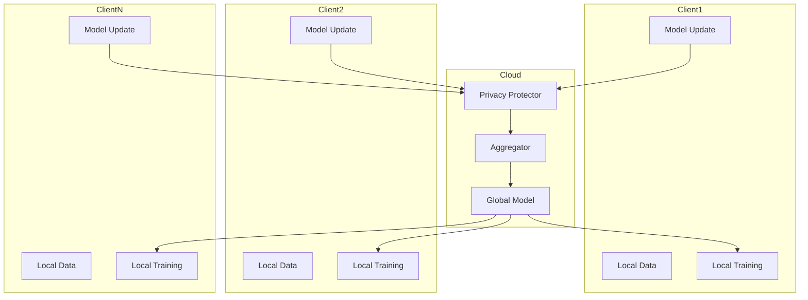

# 27. 算法联邦学习与隐私保护理论

> 说明：本文档中的代码/伪代码为说明性片段，仅用于理论阐释；本仓库不提供可运行工程或 CI。

## 概述

算法联邦学习与隐私保护理论研究在保护数据隐私的前提下实现分布式机器学习，通过本地训练和模型聚合实现协作学习。

## 学习目标

1. **基础级** 理解联邦学习的基本范式（FedAvg等）与通信机制
2. **进阶级** 掌握差分隐私、安全多方计算、同态加密等隐私保护技术
3. **进阶级** 能够分析联邦学习的收敛性与隐私-效用权衡
4. **高级级** 了解联邦学习中的安全威胁与防御方法
5. **高级级** 掌握联邦学习在跨域协作中的应用设计

## 术语与定义

| 术语 | 英文 | 定义 |
|------|------|------|
| 联邦学习 | Federated Learning | 分布式机器学习范式，允许多个参与方在不共享原始数据的情况下协作训练模型 |
| 联邦平均 | FedAvg | 通过加权平均本地模型参数实现全局模型更新的经典算法 |
| 差分隐私 | Differential Privacy | 通过添加噪声确保查询结果对单个数据点敏感性有限的隐私保护机制 |
| 安全多方计算 | Secure Multi-Party Computation | 允许多方在不泄露私有输入的情况下计算函数的技术 |
| 同态加密 | Homomorphic Encryption | 允许在加密数据上进行计算的加密方案 |
| 隐私预算 | Privacy Budget | 差分隐私中用于控制隐私保护强度的参数(ε, δ) |
| 本地训练 | Local Training | 参与方在本地数据上训练模型的过程 |
| 安全聚合 | Secure Aggregation | 保护参与方隐私的模型参数聚合协议 |
| 通信轮数 | Communication Rounds | 联邦学习中全局模型更新的次数 |
| 异构性 | Heterogeneity | 不同参与方数据分布差异的特性 |

## 联邦学习基础

联邦学习是一种分布式机器学习范式，允许多个参与方在不共享原始数据的情况下协作训练模型。

```rust
pub trait FederatedLearning {
    type Model;
    type Update;
    type Aggregation;
    
    fn train_local_model(&self, local_data: &LocalDataset) -> Self::Update;
    fn aggregate_updates(&self, updates: &[Self::Update]) -> Self::Aggregation;
    fn update_global_model(&self, model: &mut Self::Model, aggregation: &Self::Aggregation);
    fn evaluate_model(&self, model: &Self::Model, test_data: &TestDataset) -> ModelPerformance;
}

pub struct FederatedLearningSystem {
    global_model: Box<dyn FederatedModel>,
    aggregation_algorithm: AggregationAlgorithm,
    privacy_mechanism: PrivacyMechanism,
    communication_protocol: CommunicationProtocol,
}
```

## 联邦平均算法

联邦平均(FedAvg)是联邦学习的经典算法，通过加权平均本地模型参数实现全局模型更新。

```rust
pub struct FedAvgAlgorithm {
    learning_rate: f64,
    momentum: f64,
    weight_decay: f64,
}

impl FedAvgAlgorithm {
    pub fn aggregate(&self, local_models: &[LocalModel], weights: &[f64]) -> GlobalModel {
        let mut aggregated_params = Vec::new();
        
        for param_idx in 0..local_models[0].parameters().len() {
            let mut weighted_sum = 0.0;
            let total_weight: f64 = weights.iter().sum();
            
            for (model, weight) in local_models.iter().zip(weights.iter()) {
                weighted_sum += model.parameters()[param_idx] * weight;
            }
            
            aggregated_params.push(weighted_sum / total_weight);
        }
        
        GlobalModel::new(aggregated_params)
    }
}
```

## 隐私保护机制

### 差分隐私

差分隐私通过添加噪声确保查询结果对单个数据点的敏感性有限。

```rust
pub struct DifferentialPrivacy {
    epsilon: f64,
    delta: f64,
    sensitivity: f64,
}

impl DifferentialPrivacy {
    pub fn add_noise(&self, value: f64) -> f64 {
        let scale = self.sensitivity / self.epsilon;
        let noise = self.laplace_noise(scale);
        value + noise
    }
    
    fn laplace_noise(&self, scale: f64) -> f64 {
        // 拉普拉斯分布噪声生成
        let u = rand::random::<f64>() - 0.5;
        -scale * u.signum() * (1.0 - 2.0 * u.abs()).ln()
    }
}
```

### 安全多方计算

安全多方计算(MPC)允许多方在不泄露私有输入的情况下计算函数。

```rust
pub trait SecureMultiPartyComputation {
    type Input;
    type Output;
    type Protocol;
    
    fn setup(&self, parties: &[Party]) -> Self::Protocol;
    fn compute(&self, protocol: &Self::Protocol, inputs: &[Self::Input]) -> Self::Output;
    fn verify(&self, protocol: &Self::Protocol, output: &Self::Output) -> bool;
}

pub struct HomomorphicEncryption {
    public_key: PublicKey,
    private_key: PrivateKey,
}

impl HomomorphicEncryption {
    pub fn encrypt(&self, plaintext: f64) -> Ciphertext {
        // 同态加密实现
        Ciphertext::new(plaintext, &self.public_key)
    }
    
    pub fn add_ciphertexts(&self, a: &Ciphertext, b: &Ciphertext) -> Ciphertext {
        // 同态加法
        a.add(b)
    }
}
```

## 联邦学习优化

### 通信效率优化

```rust
pub struct CommunicationOptimizer {
    compression_ratio: f64,
    quantization_bits: u8,
    sparsification_threshold: f64,
}

impl CommunicationOptimizer {
    pub fn compress_gradients(&self, gradients: &[f64]) -> CompressedGradients {
        let mut compressed = Vec::new();
        
        for &grad in gradients {
            if grad.abs() > self.sparsification_threshold {
                let quantized = self.quantize(grad);
                compressed.push(quantized);
            } else {
                compressed.push(0.0);
            }
        }
        
        CompressedGradients::new(compressed)
    }
    
    fn quantize(&self, value: f64) -> f64 {
        let max_val = (1 << (self.quantization_bits - 1)) as f64;
        (value * max_val).round() / max_val
    }
}
```

### 个性化联邦学习

```rust
pub struct PersonalizedFederatedLearning {
    meta_learning_rate: f64,
    adaptation_steps: u32,
}

impl PersonalizedFederatedLearning {
    pub fn adapt_model(&self, global_model: &GlobalModel, local_data: &LocalDataset) -> PersonalizedModel {
        let mut personalized = global_model.clone();
        
        for _ in 0..self.adaptation_steps {
            let gradients = self.compute_gradients(&personalized, local_data);
            self.update_model(&mut personalized, &gradients);
        }
        
        PersonalizedModel::new(personalized)
    }
}
```

## 隐私预算管理

```rust
pub struct PrivacyBudgetManager {
    total_epsilon: f64,
    total_delta: f64,
    used_epsilon: f64,
    used_delta: f64,
}

impl PrivacyBudgetManager {
    pub fn can_use_privacy(&self, epsilon: f64, delta: f64) -> bool {
        self.used_epsilon + epsilon <= self.total_epsilon &&
        self.used_delta + delta <= self.total_delta
    }
    
    pub fn consume_privacy(&mut self, epsilon: f64, delta: f64) -> Result<(), PrivacyBudgetError> {
        if self.can_use_privacy(epsilon, delta) {
            self.used_epsilon += epsilon;
            self.used_delta += delta;
            Ok(())
        } else {
            Err(PrivacyBudgetError::InsufficientBudget)
        }
    }
}
```

## 联邦学习系统架构

```rust
pub struct FederatedLearningOrchestrator {
    participants: Vec<Participant>,
    global_model: GlobalModel,
    aggregation_algorithm: Box<dyn AggregationAlgorithm>,
    privacy_mechanism: Box<dyn PrivacyMechanism>,
    communication_protocol: Box<dyn CommunicationProtocol>,
}

impl FederatedLearningOrchestrator {
    pub async fn run_federated_round(&mut self) -> FederatedRoundResult {
        // 1. 分发全局模型
        let model_updates = self.distribute_model().await;
        
        // 2. 本地训练
        let local_updates = self.train_locally(model_updates).await;
        
        // 3. 安全聚合
        let aggregated_update = self.secure_aggregate(local_updates).await;
        
        // 4. 更新全局模型
        self.update_global_model(aggregated_update);
        
        FederatedRoundResult::new(self.global_model.clone())
    }
}
```

## 数学基础

### 差分隐私定义

对于任意相邻数据集 \(D\) 和 \(D'\)，以及任意输出集合 \(S\)：

\[
\Pr[\mathcal{M}(D) \in S] \leq e^{\epsilon} \cdot \Pr[\mathcal{M}(D') \in S] + \delta
\]

### 联邦平均收敛性

在凸优化假设下，联邦平均算法的收敛率为：

\[
\mathbb{E}[f(w_T) - f(w^*)] \leq O\left(\frac{1}{\sqrt{T}} + \frac{1}{\sqrt{K}}\right)
\]

其中 \(T\) 是通信轮数，\(K\) 是参与方数量。

## 应用场景

- **医疗健康**: 多医院协作训练诊断模型
- **金融服务**: 银行间反欺诈模型协作
- **移动设备**: 用户隐私保护的个性化推荐
- **物联网**: 边缘设备协作学习

## 挑战与展望

- **通信开销**: 减少模型传输和同步成本
- **异构性**: 处理不同参与方的数据分布差异
- **安全性**: 防御恶意参与者和推理攻击
- **可扩展性**: 支持大规模分布式训练

## 总结

联邦学习与隐私保护理论为分布式机器学习提供了安全、高效的解决方案，通过差分隐私、安全多方计算等技术，在保护数据隐私的同时实现模型性能的优化。

## 架构图（Mermaid）



## 交叉链接

- 参见 `28-算法量子机器学习理论.md`
- 参见 `29-可信AI治理与合规模型.md`
- 参见 `30-边缘计算中的算法系统.md`
- 参见 `25-算法可解释性与透明度理论.md`

## 相关文档（交叉链接）

- `10-高级主题/25-算法可解释性与透明度理论.md`
- `10-高级主题/29-可信AI治理与合规模型.md`
- `09-算法理论/01-算法基础/20-联邦学习算法理论.md`

## 参考文献（示例）

1. McMahan, B. et al. Communication-Efficient Learning of Deep Networks from Decentralized Data (FedAvg). AISTATS, 2017.
2. Kairouz, P. et al. Advances and Open Problems in Federated Learning. Foundations and Trends in Machine Learning, 2021.
3. Dwork, C., Roth, A. The Algorithmic Foundations of Differential Privacy. Foundations and Trends in Theoretical Computer Science, 2014.

## 可运行Rust示例骨架

```rust
use std::collections::HashMap;
use rand::Rng;

// 基础数据结构
#[derive(Clone, Debug)]
pub struct LocalDataset {
    pub features: Vec<Vec<f64>>,
    pub labels: Vec<f64>,
}

#[derive(Clone, Debug)]
pub struct LocalModel {
    pub parameters: Vec<f64>,
}

#[derive(Clone, Debug)]
pub struct GlobalModel {
    pub parameters: Vec<f64>,
}

// 联邦学习系统
pub struct FederatedLearningSystem {
    global_model: GlobalModel,
    participants: Vec<Participant>,
    privacy_budget: PrivacyBudget,
}

impl FederatedLearningSystem {
    pub fn new(num_parameters: usize) -> Self {
        Self {
            global_model: GlobalModel {
                parameters: vec![0.0; num_parameters],
            },
            participants: Vec::new(),
            privacy_budget: PrivacyBudget::new(1.0, 1e-5),
        }
    }
    
    pub fn add_participant(&mut self, participant: Participant) {
        self.participants.push(participant);
    }
    
    pub fn run_federated_round(&mut self) -> FederatedRoundResult {
        let mut local_updates = Vec::new();
        
        // 本地训练
        for participant in &mut self.participants {
            let update = participant.train_local_model(&self.global_model);
            local_updates.push(update);
        }
        
        // 安全聚合
        let aggregated_update = self.secure_aggregate(local_updates);
        
        // 更新全局模型
        self.update_global_model(aggregated_update);
        
        FederatedRoundResult::new(self.global_model.clone())
    }
    
    fn secure_aggregate(&self, updates: Vec<ModelUpdate>) -> ModelUpdate {
        let mut aggregated = vec![0.0; updates[0].parameters.len()];
        
        for update in updates {
            for (i, &param) in update.parameters.iter().enumerate() {
                aggregated[i] += param;
            }
        }
        
        let num_participants = updates.len() as f64;
        for param in &mut aggregated {
            *param /= num_participants;
        }
        
        ModelUpdate { parameters: aggregated }
    }
    
    fn update_global_model(&mut self, update: ModelUpdate) {
        for (i, &param) in update.parameters.iter().enumerate() {
            self.global_model.parameters[i] += param;
        }
    }
}

// 参与方
pub struct Participant {
    pub id: String,
    pub local_data: LocalDataset,
    pub privacy_mechanism: DifferentialPrivacy,
}

impl Participant {
    pub fn new(id: String, local_data: LocalDataset) -> Self {
        Self {
            id,
            local_data,
            privacy_mechanism: DifferentialPrivacy::new(0.1, 1e-5, 1.0),
        }
    }
    
    pub fn train_local_model(&self, global_model: &GlobalModel) -> ModelUpdate {
        // 简化的本地训练过程
        let mut local_model = global_model.clone();
        
        // 模拟训练过程
        for _ in 0..10 {
            let gradients = self.compute_gradients(&local_model);
            self.update_model(&mut local_model, &gradients);
        }
        
        // 计算更新
        let mut update = ModelUpdate {
            parameters: vec![0.0; local_model.parameters.len()],
        };
        
        for (i, (global_param, local_param)) in global_model.parameters
            .iter()
            .zip(local_model.parameters.iter())
            .enumerate()
        {
            update.parameters[i] = local_param - global_param;
        }
        
        // 应用差分隐私
        self.privacy_mechanism.add_noise_to_update(&mut update);
        
        update
    }
    
    fn compute_gradients(&self, model: &GlobalModel) -> Vec<f64> {
        // 简化的梯度计算
        model.parameters.iter().map(|&p| p * 0.01).collect()
    }
    
    fn update_model(&self, model: &mut GlobalModel, gradients: &[f64]) {
        for (param, &grad) in model.parameters.iter_mut().zip(gradients.iter()) {
            *param -= 0.1 * grad;
        }
    }
}

// 差分隐私
pub struct DifferentialPrivacy {
    pub epsilon: f64,
    pub delta: f64,
    pub sensitivity: f64,
}

impl DifferentialPrivacy {
    pub fn new(epsilon: f64, delta: f64, sensitivity: f64) -> Self {
        Self {
            epsilon,
            delta,
            sensitivity,
        }
    }
    
    pub fn add_noise_to_update(&self, update: &mut ModelUpdate) {
        for param in &mut update.parameters {
            let noise = self.laplace_noise();
            *param += noise;
        }
    }
    
    fn laplace_noise(&self) -> f64 {
        let mut rng = rand::thread_rng();
        let scale = self.sensitivity / self.epsilon;
        let u = rng.gen::<f64>() - 0.5;
        -scale * u.signum() * (1.0 - 2.0 * u.abs()).ln()
    }
}

// 辅助结构
#[derive(Clone, Debug)]
pub struct ModelUpdate {
    pub parameters: Vec<f64>,
}

#[derive(Clone, Debug)]
pub struct FederatedRoundResult {
    pub global_model: GlobalModel,
}

impl FederatedRoundResult {
    pub fn new(global_model: GlobalModel) -> Self {
        Self { global_model }
    }
}

pub struct PrivacyBudget {
    pub epsilon: f64,
    pub delta: f64,
}

impl PrivacyBudget {
    pub fn new(epsilon: f64, delta: f64) -> Self {
        Self { epsilon, delta }
    }
}

// 示例使用
fn main() {
    // 创建联邦学习系统
    let mut fl_system = FederatedLearningSystem::new(10);
    
    // 创建参与方
    let participant1 = Participant::new(
        "client1".to_string(),
        LocalDataset {
            features: vec![vec![1.0, 2.0, 3.0]; 100],
            labels: vec![1.0; 100],
        },
    );
    
    let participant2 = Participant::new(
        "client2".to_string(),
        LocalDataset {
            features: vec![vec![4.0, 5.0, 6.0]; 100],
            labels: vec![0.0; 100],
        },
    );
    
    fl_system.add_participant(participant1);
    fl_system.add_participant(participant2);
    
    // 运行联邦学习轮次
    for round in 0..5 {
        let result = fl_system.run_federated_round();
        println!("Round {}: Global model updated", round);
    }
}
