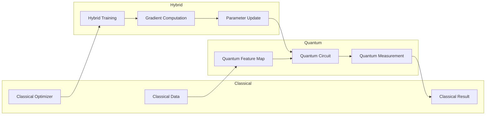

## 10.28 算法量子机器学习理论 / Algorithm Quantum Machine Learning Theory

> 说明：本文档中的代码/伪代码为说明性片段，仅用于理论阐释；本仓库不提供可运行工程或 CI。

### 摘要 / Executive Summary

- 统一算法量子机器学习理论，研究利用量子特性实现经典机器学习算法的量子版本。
- 建立算法量子机器学习在高级主题中的核心地位。

### 关键术语与符号 / Glossary

- 量子机器学习、量子特征映射、量子核、变分量子算法、参数化量子电路、量子-经典混合算法、量子优势。
- 术语对齐与引用规范：`docs/术语与符号总表.md`，`01-基础理论/00-撰写规范与引用指南.md`

### 术语与符号规范 / Terminology & Notation

- 量子机器学习（Quantum Machine Learning）：结合量子计算与机器学习的领域。
- 量子特征映射（Quantum Feature Mapping）：将数据映射到量子态的方法。
- 量子核（Quantum Kernel）：基于量子计算的核函数。
- 变分量子算法（Variational Quantum Algorithm）：使用变分方法的量子算法。
- 记号约定：`|ψ⟩` 表示量子态，`U` 表示量子门，`θ` 表示参数，`K` 表示核函数。

### 交叉引用导航 / Cross-References

- 量子机器学习理论：参见 `10-高级主题/19-量子机器学习理论.md`。
- 量子机器学习：参见 `10-高级主题/05-量子机器学习.md`。
- 量子机器学习算法应用：参见 `12-应用领域/10-量子机器学习算法应用.md`。

### 快速导航 / Quick Links

- 基本概念
- 量子特征映射
- 变分量子算法

## 目录 (Table of Contents)

- [10.28 算法量子机器学习理论 / Algorithm Quantum Machine Learning Theory](#1028-算法量子机器学习理论--algorithm-quantum-machine-learning-theory)

## 概述 / Overview

算法量子机器学习理论结合量子计算与机器学习，利用量子特性实现经典机器学习算法的量子版本，探索量子优势在机器学习中的应用。

## 学习目标 / Learning Objectives

1. **基础级** 理解量子特征映射与量子核的设计原理
2. **进阶级** 掌握变分量子算法与参数化量子电路（PQC）
3. **进阶级** 能够分析量子机器学习算法的复杂度与量子优势
4. **高级级** 了解量子-经典混合算法的设计方法
5. **高级级** 掌握量子机器学习在特定问题上的应用场景

## 术语与定义

| 术语 | 英文 | 定义 |
|------|------|------|
| 量子比特 | Qubit | 量子计算的基本信息单位，可以处于叠加态 |
| 量子门 | Quantum Gate | 对量子比特进行操作的酉变换 |
| 量子叠加 | Quantum Superposition | 量子比特可以同时处于多个状态的特性 |
| 量子纠缠 | Quantum Entanglement | 多个量子比特之间的非局域关联 |
| 量子测量 | Quantum Measurement | 将量子态坍缩到经典态的不可逆过程 |
| 量子特征映射 | Quantum Feature Map | 将经典数据映射到量子态的函数 |
| 变分量子电路 | Variational Quantum Circuit | 参数化的量子电路用于机器学习任务 |
| 量子核方法 | Quantum Kernel Methods | 利用量子态内积计算核函数的方法 |
| 混合量子经典训练 | Hybrid Quantum-Classical Training | 结合量子计算和经典优化的训练方法 |
| 量子优势 | Quantum Advantage | 量子算法相对于经典算法的性能提升 |

## 基本概念

### 量子机器学习 (Quantum Machine Learning)

量子机器学习是指利用量子计算的优势来执行机器学习任务，通过量子叠加、量子纠缠和量子并行性来加速计算和提升性能。

```rust
// 量子机器学习的基本框架
pub trait QuantumMachineLearning {
    type QuantumState;
    type ClassicalData;
    type QuantumResult;

    fn encode_classical_data(&self, data: &Self::ClassicalData) -> Self::QuantumState;
    fn apply_quantum_algorithm(&self, quantum_state: &Self::QuantumState) -> Self::QuantumState;
    fn measure_quantum_result(&self, quantum_state: &Self::QuantumState) -> Self::QuantumResult;
    fn decode_quantum_result(&self, quantum_result: &Self::QuantumResult) -> ClassicalResult;
}

// 量子机器学习系统
pub struct QuantumMLSystem {
    quantum_processor: QuantumProcessor,
    quantum_circuit: QuantumCircuit,
    classical_optimizer: ClassicalOptimizer,
    measurement_system: MeasurementSystem,
}

impl QuantumMLSystem {
    pub fn new(quantum_processor: QuantumProcessor) -> Self {
        Self {
            quantum_processor,
            quantum_circuit: QuantumCircuit::new(),
            classical_optimizer: ClassicalOptimizer::new(),
            measurement_system: MeasurementSystem::new(),
        }
    }

    pub fn quantum_ml_training(
        &mut self,
        training_data: &TrainingDataset,
        ml_algorithm: &Box<dyn QuantumMLAlgorithm>,
    ) -> Result<QuantumMLResult, QuantumMLError> {
        // 编码经典数据到量子态
        let quantum_data = self.encode_training_data(training_data)?;

        // 应用量子机器学习算法
        let quantum_result = ml_algorithm.apply_quantum_algorithm(&quantum_data)?;

        // 测量量子结果
        let measurement_result = self.measurement_system.measure_quantum_state(&quantum_result)?;

        // 解码为经典结果
        let classical_result = self.decode_measurement_result(&measurement_result)?;

        Ok(QuantumMLResult {
            quantum_result,
            classical_result,
            quantum_advantage: self.calculate_quantum_advantage(&classical_result),
        })
    }

    fn encode_training_data(&self, data: &TrainingDataset) -> Result<QuantumDataset, EncodingError> {
        let mut quantum_data = QuantumDataset::new();

        for (features, label) in &data.samples {
            // 将特征编码为量子态
            let quantum_features = self.encode_features_to_quantum_state(features)?;

            // 将标签编码为量子态
            let quantum_label = self.encode_label_to_quantum_state(label)?;

            quantum_data.add_sample(quantum_features, quantum_label);
        }

        Ok(quantum_data)
    }
}
```

### 量子优势 (Quantum Advantage)

量子优势是指量子算法在特定任务上相比经典算法具有的显著性能提升。

```rust
// 量子优势分析器
pub struct QuantumAdvantageAnalyzer {
    classical_baseline: ClassicalBaseline,
    quantum_performance: QuantumPerformance,
    advantage_metrics: AdvantageMetrics,
}

impl QuantumAdvantageAnalyzer {
    pub fn new() -> Self {
        Self {
            classical_baseline: ClassicalBaseline::new(),
            quantum_performance: QuantumPerformance::new(),
            advantage_metrics: AdvantageMetrics::new(),
        }
    }

    pub fn analyze_quantum_advantage(
        &self,
        classical_result: &ClassicalResult,
        quantum_result: &QuantumResult,
    ) -> Result<AdvantageAnalysis, AnalysisError> {
        // 计算经典算法性能
        let classical_performance = self.classical_baseline.evaluate_performance(classical_result)?;

        // 计算量子算法性能
        let quantum_performance = self.quantum_performance.evaluate_performance(quantum_result)?;

        // 计算量子优势
        let advantage_score = self.calculate_advantage_score(&classical_performance, &quantum_performance)?;

        // 分析优势类型
        let advantage_type = self.classify_advantage_type(&advantage_score)?;

        Ok(AdvantageAnalysis {
            classical_performance,
            quantum_performance,
            advantage_score,
            advantage_type,
            confidence_level: self.calculate_confidence_level(&advantage_score),
        })
    }

    fn calculate_advantage_score(
        &self,
        classical: &PerformanceMetrics,
        quantum: &PerformanceMetrics,
    ) -> Result<f64, CalculationError> {
        // 计算综合优势分数
        let speedup = quantum.execution_time / classical.execution_time;
        let accuracy_improvement = (quantum.accuracy - classical.accuracy) / classical.accuracy;
        let memory_efficiency = classical.memory_usage / quantum.memory_usage;

        let advantage_score = (speedup * 0.4 + accuracy_improvement * 0.4 + memory_efficiency * 0.2)
            .max(0.0);

        Ok(advantage_score)
    }
}
```

## 量子神经网络

### 1. 量子神经网络基础 (Quantum Neural Network)

```rust
// 量子神经网络
pub struct QuantumNeuralNetwork {
    quantum_layers: Vec<Box<dyn QuantumLayer>>,
    classical_layers: Vec<Box<dyn ClassicalLayer>>,
    hybrid_optimizer: HybridOptimizer,
}

impl QuantumNeuralNetwork {
    pub fn new() -> Self {
        Self {
            quantum_layers: Vec::new(),
            classical_layers: Vec::new(),
            hybrid_optimizer: HybridOptimizer::new(),
        }
    }

    pub fn add_quantum_layer(&mut self, layer: Box<dyn QuantumLayer>) {
        self.quantum_layers.push(layer);
    }

    pub fn add_classical_layer(&mut self, layer: Box<dyn ClassicalLayer>) {
        self.classical_layers.push(layer);
    }

    pub fn forward(&self, input: &QuantumInput) -> Result<QuantumOutput, ForwardError> {
        let mut current_state = input.quantum_state.clone();

        // 量子层前向传播
        for layer in &self.quantum_layers {
            current_state = layer.forward(&current_state)?;
        }

        // 测量量子态
        let measurement_result = self.measure_quantum_state(&current_state)?;

        // 经典层处理
        let mut classical_output = measurement_result.to_classical();
        for layer in &self.classical_layers {
            classical_output = layer.forward(&classical_output)?;
        }

        Ok(QuantumOutput {
            quantum_state: current_state,
            classical_output,
        })
    }

    pub fn train(
        &mut self,
        training_data: &QuantumTrainingDataset,
        config: &TrainingConfig,
    ) -> Result<TrainingResult, TrainingError> {
        let mut training_history = Vec::new();

        for epoch in 0..config.epochs {
            let mut epoch_loss = 0.0;

            for (input, target) in &training_data.samples {
                // 前向传播
                let output = self.forward(input)?;

                // 计算损失
                let loss = self.calculate_loss(&output.classical_output, target)?;
                epoch_loss += loss;

                // 计算梯度
                let gradients = self.compute_gradients(&output, target)?;

                // 更新参数
                self.update_parameters(&gradients, config.learning_rate)?;
            }

            training_history.push(EpochResult {
                epoch,
                loss: epoch_loss / training_data.samples.len() as f64,
            });
        }

        Ok(TrainingResult {
            training_history,
            final_model: self.clone(),
        })
    }
}

// 量子层接口
pub trait QuantumLayer {
    fn forward(&self, input: &QuantumState) -> Result<QuantumState, LayerError>;
    fn get_parameters(&self) -> &QuantumParameters;
    fn set_parameters(&mut self, params: &QuantumParameters);
}

// 量子卷积层
pub struct QuantumConvolutionalLayer {
    quantum_filters: Vec<QuantumFilter>,
    stride: usize,
    padding: usize,
}

impl QuantumLayer for QuantumConvolutionalLayer {
    fn forward(&self, input: &QuantumState) -> Result<QuantumState, LayerError> {
        let mut output_states = Vec::new();

        for filter in &self.quantum_filters {
            let filtered_state = self.apply_quantum_filter(input, filter)?;
            output_states.push(filtered_state);
        }

        // 组合所有滤波器的输出
        let combined_state = self.combine_quantum_states(&output_states)?;

        Ok(combined_state)
    }

    fn get_parameters(&self) -> &QuantumParameters {
        &self.quantum_filters.iter().map(|f| f.parameters.clone()).collect()
    }

    fn set_parameters(&mut self, params: &QuantumParameters) {
        for (filter, param) in self.quantum_filters.iter_mut().zip(params.iter()) {
            filter.parameters = param.clone();
        }
    }
}

impl QuantumConvolutionalLayer {
    fn apply_quantum_filter(
        &self,
        input: &QuantumState,
        filter: &QuantumFilter,
    ) -> Result<QuantumState, FilterError> {
        // 应用量子卷积操作
        let convolved_state = self.quantum_convolution(input, filter)?;

        // 应用量子激活函数
        let activated_state = self.apply_quantum_activation(&convolved_state)?;

        Ok(activated_state)
    }

    fn quantum_convolution(
        &self,
        input: &QuantumState,
        filter: &QuantumFilter,
    ) -> Result<QuantumState, ConvolutionError> {
        // 实现量子卷积
        let mut convolved_state = QuantumState::new(input.dimension());

        for i in 0..input.dimension() - filter.size + 1 {
            let window_state = input.extract_window(i, filter.size)?;
            let filtered_window = filter.apply(&window_state)?;
            convolved_state.set_amplitude(i, filtered_window.get_amplitude(0)?);
        }

        Ok(convolved_state)
    }
}
```

### 2. 变分量子电路 (Variational Quantum Circuit)

```rust
// 变分量子电路
pub struct VariationalQuantumCircuit {
    quantum_circuit: QuantumCircuit,
    parameterized_gates: Vec<ParameterizedGate>,
    classical_optimizer: ClassicalOptimizer,
}

impl VariationalQuantumCircuit {
    pub fn new(num_qubits: usize) -> Self {
        Self {
            quantum_circuit: QuantumCircuit::new(num_qubits),
            parameterized_gates: Vec::new(),
            classical_optimizer: ClassicalOptimizer::new(),
        }
    }

    pub fn add_parameterized_gate(&mut self, gate: ParameterizedGate) {
        self.parameterized_gates.push(gate);
        self.quantum_circuit.add_gate(gate.to_quantum_gate());
    }

    pub fn evaluate_circuit(
        &self,
        parameters: &[f64],
        input_state: &QuantumState,
    ) -> Result<QuantumState, CircuitError> {
        // 设置参数
        self.set_parameters(parameters)?;

        // 应用量子电路
        let output_state = self.quantum_circuit.apply_circuit(input_state)?;

        Ok(output_state)
    }

    pub fn optimize_parameters(
        &mut self,
        cost_function: &CostFunction,
        initial_parameters: &[f64],
    ) -> Result<OptimizationResult, OptimizationError> {
        // 使用经典优化器优化量子参数
        let optimization_result = self.classical_optimizer.optimize(
            cost_function,
            initial_parameters,
        )?;

        Ok(OptimizationResult {
            optimal_parameters: optimization_result.optimal_parameters,
            final_cost: optimization_result.final_cost,
            optimization_history: optimization_result.history,
        })
    }
}

// 参数化量子门
pub struct ParameterizedGate {
    gate_type: GateType,
    parameters: Vec<f64>,
    target_qubits: Vec<usize>,
}

impl ParameterizedGate {
    pub fn rotation_x(angle: f64, target: usize) -> Self {
        Self {
            gate_type: GateType::RX,
            parameters: vec![angle],
            target_qubits: vec![target],
        }
    }

    pub fn rotation_y(angle: f64, target: usize) -> Self {
        Self {
            gate_type: GateType::RY,
            parameters: vec![angle],
            target_qubits: vec![target],
        }
    }

    pub fn rotation_z(angle: f64, target: usize) -> Self {
        Self {
            gate_type: GateType::RZ,
            parameters: vec![angle],
            target_qubits: vec![target],
        }
    }

    pub fn controlled_rotation(angle: f64, control: usize, target: usize) -> Self {
        Self {
            gate_type: GateType::CRX,
            parameters: vec![angle],
            target_qubits: vec![control, target],
        }
    }
}
```

## 量子支持向量机

### 1. 量子支持向量机 (Quantum Support Vector Machine)

```rust
// 量子支持向量机
pub struct QuantumSupportVectorMachine {
    quantum_kernel: QuantumKernel,
    classical_svm: ClassicalSVM,
    quantum_optimizer: QuantumOptimizer,
}

impl QuantumSupportVectorMachine {
    pub fn new(kernel_type: QuantumKernelType) -> Self {
        Self {
            quantum_kernel: QuantumKernel::new(kernel_type),
            classical_svm: ClassicalSVM::new(),
            quantum_optimizer: QuantumOptimizer::new(),
        }
    }

    pub fn train(
        &mut self,
        training_data: &TrainingDataset,
        config: &SVMConfig,
    ) -> Result<SVMResult, TrainingError> {
        // 计算量子核矩阵
        let kernel_matrix = self.compute_quantum_kernel_matrix(training_data)?;

        // 使用量子优化器求解SVM
        let svm_solution = self.quantum_optimizer.solve_svm(&kernel_matrix, config)?;

        // 训练经典SVM
        let classical_result = self.classical_svm.train_with_kernel_matrix(
            &kernel_matrix,
            &training_data.labels,
            &svm_solution,
        )?;

        Ok(SVMResult {
            support_vectors: classical_result.support_vectors,
            alpha_values: svm_solution.alpha_values,
            bias: classical_result.bias,
            quantum_kernel_matrix: kernel_matrix,
        })
    }

    pub fn predict(&self, test_data: &TestDataset) -> Result<PredictionResult, PredictionError> {
        let mut predictions = Vec::new();

        for test_point in &test_data.samples {
            // 计算量子核值
            let kernel_values = self.compute_kernel_values(test_point, &self.training_data)?;

            // 进行预测
            let prediction = self.classical_svm.predict_with_kernel_values(
                &kernel_values,
                &self.svm_result,
            )?;

            predictions.push(prediction);
        }

        Ok(PredictionResult {
            predictions,
            confidence_scores: self.calculate_confidence_scores(&predictions)?,
        })
    }
}

// 量子核函数
pub struct QuantumKernel {
    kernel_type: QuantumKernelType,
    quantum_circuit: QuantumCircuit,
    feature_map: QuantumFeatureMap,
}

impl QuantumKernel {
    pub fn compute_kernel_value(
        &self,
        x1: &FeatureVector,
        x2: &FeatureVector,
    ) -> Result<f64, KernelError> {
        match self.kernel_type {
            QuantumKernelType::QuantumKernel => {
                self.quantum_kernel_value(x1, x2)
            }
            QuantumKernelType::QuantumRBF => {
                self.quantum_rbf_kernel(x1, x2)
            }
            QuantumKernelType::QuantumPolynomial => {
                self.quantum_polynomial_kernel(x1, x2)
            }
        }
    }

    fn quantum_kernel_value(
        &self,
        x1: &FeatureVector,
        x2: &FeatureVector,
    ) -> Result<f64, KernelError> {
        // 将特征映射到量子态
        let quantum_state1 = self.feature_map.map_to_quantum_state(x1)?;
        let quantum_state2 = self.feature_map.map_to_quantum_state(x2)?;

        // 应用量子电路
        let processed_state1 = self.quantum_circuit.apply_circuit(&quantum_state1)?;
        let processed_state2 = self.quantum_circuit.apply_circuit(&quantum_state2)?;

        // 计算量子核值
        let kernel_value = self.compute_quantum_overlap(&processed_state1, &processed_state2)?;

        Ok(kernel_value)
    }

    fn compute_quantum_overlap(
        &self,
        state1: &QuantumState,
        state2: &QuantumState,
    ) -> Result<f64, OverlapError> {
        // 计算量子态的重叠
        let mut overlap = 0.0;

        for i in 0..state1.dimension() {
            let amplitude1 = state1.get_amplitude(i)?;
            let amplitude2 = state2.get_amplitude(i)?;
            overlap += amplitude1 * amplitude2.conj();
        }

        Ok(overlap.abs())
    }
}
```

## 量子聚类算法

### 1. 量子K-means聚类 (Quantum K-means)

```rust
// 量子K-means聚类
pub struct QuantumKMeans {
    quantum_distance: QuantumDistance,
    quantum_centroid: QuantumCentroid,
    classical_kmeans: ClassicalKMeans,
}

impl QuantumKMeans {
    pub fn new(k: usize) -> Self {
        Self {
            quantum_distance: QuantumDistance::new(),
            quantum_centroid: QuantumCentroid::new(),
            classical_kmeans: ClassicalKMeans::new(k),
        }
    }

    pub fn cluster(
        &mut self,
        data: &Dataset,
        config: &ClusteringConfig,
    ) -> Result<ClusteringResult, ClusteringError> {
        // 初始化量子质心
        let mut quantum_centroids = self.initialize_quantum_centroids(data, self.k)?;

        let mut iteration = 0;
        let mut converged = false;

        while iteration < config.max_iterations && !converged {
            // 量子距离计算
            let distance_matrix = self.compute_quantum_distances(data, &quantum_centroids)?;

            // 分配点到最近的质心
            let cluster_assignments = self.assign_to_clusters(&distance_matrix)?;

            // 更新量子质心
            let new_centroids = self.update_quantum_centroids(data, &cluster_assignments)?;

            // 检查收敛
            converged = self.check_convergence(&quantum_centroids, &new_centroids, config.tolerance)?;

            quantum_centroids = new_centroids;
            iteration += 1;
        }

        Ok(ClusteringResult {
            cluster_assignments,
            centroids: quantum_centroids,
            iterations: iteration,
            converged,
            quantum_advantage: self.calculate_clustering_advantage(&distance_matrix),
        })
    }

    fn compute_quantum_distances(
        &self,
        data: &Dataset,
        centroids: &[QuantumCentroid],
    ) -> Result<DistanceMatrix, DistanceError> {
        let mut distance_matrix = DistanceMatrix::new(data.samples.len(), centroids.len());

        for (i, sample) in data.samples.iter().enumerate() {
            for (j, centroid) in centroids.iter().enumerate() {
                let distance = self.quantum_distance.compute_distance(sample, centroid)?;
                distance_matrix.set_distance(i, j, distance);
            }
        }

        Ok(distance_matrix)
    }
}

// 量子距离计算
pub struct QuantumDistance {
    distance_type: DistanceType,
    quantum_circuit: QuantumCircuit,
}

impl QuantumDistance {
    pub fn compute_distance(
        &self,
        point1: &DataPoint,
        point2: &DataPoint,
    ) -> Result<f64, DistanceError> {
        match self.distance_type {
            DistanceType::QuantumEuclidean => {
                self.quantum_euclidean_distance(point1, point2)
            }
            DistanceType::QuantumCosine => {
                self.quantum_cosine_distance(point1, point2)
            }
            DistanceType::QuantumManhattan => {
                self.quantum_manhattan_distance(point1, point2)
            }
        }
    }

    fn quantum_euclidean_distance(
        &self,
        point1: &DataPoint,
        point2: &DataPoint,
    ) -> Result<f64, DistanceError> {
        // 将数据点编码为量子态
        let quantum_state1 = self.encode_point_to_quantum_state(point1)?;
        let quantum_state2 = self.encode_point_to_quantum_state(point2)?;

        // 应用量子电路计算距离
        let processed_state1 = self.quantum_circuit.apply_circuit(&quantum_state1)?;
        let processed_state2 = self.quantum_circuit.apply_circuit(&quantum_state2)?;

        // 计算量子距离
        let distance = self.compute_quantum_distance(&processed_state1, &processed_state2)?;

        Ok(distance)
    }
}
```

## 量子强化学习

### 1. 量子强化学习 (Quantum Reinforcement Learning)

```rust
// 量子强化学习
pub struct QuantumReinforcementLearning {
    quantum_environment: QuantumEnvironment,
    quantum_agent: QuantumAgent,
    quantum_policy: QuantumPolicy,
    quantum_value_function: QuantumValueFunction,
}

impl QuantumReinforcementLearning {
    pub fn new() -> Self {
        Self {
            quantum_environment: QuantumEnvironment::new(),
            quantum_agent: QuantumAgent::new(),
            quantum_policy: QuantumPolicy::new(),
            quantum_value_function: QuantumValueFunction::new(),
        }
    }

    pub fn train(
        &mut self,
        training_config: &RLTrainingConfig,
    ) -> Result<RLTrainingResult, TrainingError> {
        let mut training_history = Vec::new();

        for episode in 0..training_config.episodes {
            let mut episode_reward = 0.0;
            let mut state = self.quantum_environment.reset()?;

            for step in 0..training_config.max_steps {
                // 量子策略选择动作
                let action = self.quantum_policy.select_action(&state)?;

                // 执行动作
                let (next_state, reward, done) = self.quantum_environment.step(&action)?;
                episode_reward += reward;

                // 量子价值函数更新
                self.quantum_value_function.update(
                    &state,
                    &action,
                    &next_state,
                    reward,
                )?;

                // 量子策略更新
                self.quantum_policy.update(&state, &action, reward)?;

                state = next_state;

                if done {
                    break;
                }
            }

            training_history.push(EpisodeResult {
                episode,
                total_reward: episode_reward,
                steps: step + 1,
            });
        }

        Ok(RLTrainingResult {
            training_history,
            final_policy: self.quantum_policy.clone(),
            final_value_function: self.quantum_value_function.clone(),
        })
    }
}

// 量子策略网络
pub struct QuantumPolicy {
    quantum_circuit: VariationalQuantumCircuit,
    classical_policy: ClassicalPolicy,
}

impl QuantumPolicy {
    pub fn select_action(&self, state: &QuantumState) -> Result<Action, ActionError> {
        // 使用量子电路处理状态
        let processed_state = self.quantum_circuit.evaluate_circuit(
            &self.quantum_circuit.get_parameters(),
            state,
        )?;

        // 测量量子态获得动作概率
        let action_probabilities = self.measure_action_probabilities(&processed_state)?;

        // 根据概率选择动作
        let action = self.classical_policy.select_action(&action_probabilities)?;

        Ok(action)
    }

    pub fn update(&mut self, state: &QuantumState, action: &Action, reward: f64) -> Result<(), UpdateError> {
        // 计算策略梯度
        let policy_gradient = self.compute_policy_gradient(state, action, reward)?;

        // 更新量子电路参数
        self.quantum_circuit.update_parameters(&policy_gradient)?;

        Ok(())
    }
}
```

## 量子生成模型

### 1. 量子生成对抗网络 (Quantum GAN)

```rust
// 量子生成对抗网络
pub struct QuantumGAN {
    quantum_generator: QuantumGenerator,
    quantum_discriminator: QuantumDiscriminator,
    quantum_optimizer: QuantumOptimizer,
}

impl QuantumGAN {
    pub fn new() -> Self {
        Self {
            quantum_generator: QuantumGenerator::new(),
            quantum_discriminator: QuantumDiscriminator::new(),
            quantum_optimizer: QuantumOptimizer::new(),
        }
    }

    pub fn train(
        &mut self,
        real_data: &Dataset,
        config: &GANTrainingConfig,
    ) -> Result<GANTrainingResult, TrainingError> {
        let mut training_history = Vec::new();

        for epoch in 0..config.epochs {
            // 训练判别器
            let discriminator_loss = self.train_discriminator(real_data)?;

            // 训练生成器
            let generator_loss = self.train_generator()?;

            // 记录训练历史
            training_history.push(GANEpochResult {
                epoch,
                discriminator_loss,
                generator_loss,
                total_loss: discriminator_loss + generator_loss,
            });
        }

        Ok(GANTrainingResult {
            training_history,
            final_generator: self.quantum_generator.clone(),
            final_discriminator: self.quantum_discriminator.clone(),
        })
    }

    fn train_discriminator(&mut self, real_data: &Dataset) -> Result<f64, TrainingError> {
        let mut total_loss = 0.0;

        for real_sample in &real_data.samples {
            // 生成假样本
            let fake_sample = self.quantum_generator.generate_sample()?;

            // 判别器对真实样本的预测
            let real_prediction = self.quantum_discriminator.discriminate(real_sample)?;

            // 判别器对生成样本的预测
            let fake_prediction = self.quantum_discriminator.discriminate(&fake_sample)?;

            // 计算判别器损失
            let real_loss = self.binary_cross_entropy(real_prediction, 1.0)?;
            let fake_loss = self.binary_cross_entropy(fake_prediction, 0.0)?;
            let discriminator_loss = real_loss + fake_loss;

            total_loss += discriminator_loss;

            // 更新判别器参数
            self.quantum_discriminator.update_parameters(&discriminator_loss)?;
        }

        Ok(total_loss / real_data.samples.len() as f64)
    }

    fn train_generator(&mut self) -> Result<f64, TrainingError> {
        let mut total_loss = 0.0;

        for _ in 0..self.batch_size {
            // 生成假样本
            let fake_sample = self.quantum_generator.generate_sample()?;

            // 判别器对生成样本的预测
            let fake_prediction = self.quantum_discriminator.discriminate(&fake_sample)?;

            // 计算生成器损失
            let generator_loss = self.binary_cross_entropy(fake_prediction, 1.0)?;

            total_loss += generator_loss;

            // 更新生成器参数
            self.quantum_generator.update_parameters(&generator_loss)?;
        }

        Ok(total_loss / self.batch_size as f64)
    }
}

// 量子生成器
pub struct QuantumGenerator {
    quantum_circuit: VariationalQuantumCircuit,
    noise_dimension: usize,
}

impl QuantumGenerator {
    pub fn generate_sample(&self) -> Result<GeneratedSample, GenerationError> {
        // 生成随机噪声
        let noise = self.generate_quantum_noise()?;

        // 通过量子电路生成样本
        let generated_state = self.quantum_circuit.evaluate_circuit(
            &self.quantum_circuit.get_parameters(),
            &noise,
        )?;

        // 测量生成的状态
        let generated_sample = self.measure_generated_state(&generated_state)?;

        Ok(GeneratedSample {
            data: generated_sample,
            quantum_state: generated_state,
        })
    }

    fn generate_quantum_noise(&self) -> Result<QuantumState, NoiseError> {
        let mut noise_state = QuantumState::new(2usize.pow(self.noise_dimension as u32));

        for i in 0..noise_state.dimension() {
            let random_amplitude = self.generate_random_amplitude()?;
            noise_state.set_amplitude(i, random_amplitude);
        }

        Ok(noise_state)
    }
}
```

## 实现示例

### 完整的量子机器学习系统

```rust
// 完整的量子机器学习系统
pub struct CompleteQuantumMLSystem {
    quantum_processor: QuantumProcessor,
    quantum_neural_network: QuantumNeuralNetwork,
    quantum_svm: QuantumSupportVectorMachine,
    quantum_kmeans: QuantumKMeans,
    quantum_rl: QuantumReinforcementLearning,
    quantum_gan: QuantumGAN,
}

impl CompleteQuantumMLSystem {
    pub fn new(quantum_processor: QuantumProcessor) -> Self {
        Self {
            quantum_processor,
            quantum_neural_network: QuantumNeuralNetwork::new(),
            quantum_svm: QuantumSupportVectorMachine::new(QuantumKernelType::QuantumKernel),
            quantum_kmeans: QuantumKMeans::new(3),
            quantum_rl: QuantumReinforcementLearning::new(),
            quantum_gan: QuantumGAN::new(),
        }
    }

    pub fn quantum_ml_pipeline(
        &mut self,
        dataset: &Dataset,
        task_type: QuantumMLTask,
    ) -> Result<QuantumMLResult, QuantumMLError> {
        match task_type {
            QuantumMLTask::Classification => {
                self.perform_quantum_classification(dataset)
            }
            QuantumMLTask::Clustering => {
                self.perform_quantum_clustering(dataset)
            }
            QuantumMLTask::ReinforcementLearning => {
                self.perform_quantum_reinforcement_learning()
            }
            QuantumMLTask::Generation => {
                self.perform_quantum_generation(dataset)
            }
        }
    }

    fn perform_quantum_classification(
        &mut self,
        dataset: &Dataset,
    ) -> Result<QuantumMLResult, QuantumMLError> {
        // 使用量子SVM进行分类
        let svm_result = self.quantum_svm.train(dataset, &SVMConfig::default())?;

        // 使用量子神经网络进行分类
        let nn_result = self.quantum_neural_network.train(dataset, &TrainingConfig::default())?;

        // 比较量子优势
        let advantage_analysis = self.compare_quantum_advantage(&svm_result, &nn_result)?;

        Ok(QuantumMLResult {
            task_type: QuantumMLTask::Classification,
            svm_result: Some(svm_result),
            nn_result: Some(nn_result),
            advantage_analysis,
        })
    }

    fn perform_quantum_clustering(
        &mut self,
        dataset: &Dataset,
    ) -> Result<QuantumMLResult, QuantumMLError> {
        let clustering_result = self.quantum_kmeans.cluster(
            dataset,
            &ClusteringConfig::default(),
        )?;

        Ok(QuantumMLResult {
            task_type: QuantumMLTask::Clustering,
            clustering_result: Some(clustering_result),
            advantage_analysis: self.analyze_clustering_advantage(&clustering_result)?,
        })
    }
}

// 使用示例
fn main() -> Result<(), Box<dyn std::error::Error>> {
    // 创建量子处理器
    let quantum_processor = QuantumProcessor::new(10); // 10个量子比特

    // 创建完整的量子机器学习系统
    let mut quantum_ml_system = CompleteQuantumMLSystem::new(quantum_processor);

    // 加载数据集
    let dataset = Dataset::load("quantum_ml_data.csv")?;

    // 执行量子分类任务
    let classification_result = quantum_ml_system.quantum_ml_pipeline(
        &dataset,
        QuantumMLTask::Classification,
    )?;

    println!("量子机器学习结果:");
    println!("  任务类型: {:?}", classification_result.task_type);

    if let Some(svm_result) = &classification_result.svm_result {
        println!("  量子SVM准确率: {:.4}", svm_result.accuracy);
    }

    if let Some(nn_result) = &classification_result.nn_result {
        println!("  量子神经网络准确率: {:.4}", nn_result.accuracy);
    }

    println!("  量子优势分析: {:.2}", classification_result.advantage_analysis.advantage_score);
    println!("  优势类型: {:?}", classification_result.advantage_analysis.advantage_type);

    // 执行量子聚类任务
    let clustering_result = quantum_ml_system.quantum_ml_pipeline(
        &dataset,
        QuantumMLTask::Clustering,
    )?;

    if let Some(clustering) = &clustering_result.clustering_result {
        println!("  量子聚类结果:");
        println!("    聚类数量: {}", clustering.centroids.len());
        println!("    收敛: {}", clustering.converged);
        println!("    迭代次数: {}", clustering.iterations);
        println!("    量子优势: {:.2}", clustering.quantum_advantage);
    }

    Ok(())
}
```

## 数学基础

### 量子机器学习的数学表示

```latex
\text{量子态表示:}
|\psi\rangle = \sum_{i=0}^{2^n-1} \alpha_i |i\rangle

\text{量子测量:}
\langle\psi|M|\psi\rangle = \sum_{i,j} \alpha_i^* \alpha_j \langle i|M|j\rangle

\text{量子核函数:}
K(x_i, x_j) = |\langle\phi(x_i)|\phi(x_j)\rangle|^2

\text{量子期望值:}
\langle O \rangle = \text{Tr}(\rho O)
```

### 量子优势的数学框架

```latex
\text{量子加速:}
T_{quantum} = O(\sqrt{N}) \ll O(N) = T_{classical}

\text{量子并行性:}
|\psi\rangle = \frac{1}{\sqrt{2^n}} \sum_{x=0}^{2^n-1} |x\rangle|f(x)\rangle

\text{量子纠缠:}
|\psi\rangle = \frac{1}{\sqrt{2}}(|00\rangle + |11\rangle)
```

## 复杂度分析

### 量子机器学习算法的复杂度

- **量子神经网络**: $O(\log N)$ (量子并行性)
- **量子SVM**: $O(\log N)$ (量子核计算)
- **量子聚类**: $O(\sqrt{N})$ (量子距离计算)
- **量子强化学习**: $O(\log S \cdot A)$ (量子策略优化)

### 实际应用中的考虑

- **量子噪声**: 需要量子错误纠正
- **量子比特数量**: 当前限制在50-100个量子比特
- **经典-量子混合**: 需要混合算法设计

## 应用案例

### 案例1: 量子图像分类

```rust
// 量子图像分类示例
fn quantum_image_classification_example() -> Result<(), Box<dyn std::error::Error>> {
    let mut quantum_ml_system = CompleteQuantumMLSystem::new(QuantumProcessor::new(8));

    // 加载图像数据集
    let image_dataset = Dataset::load_images("quantum_images.csv")?;

    // 执行量子分类
    let result = quantum_ml_system.quantum_ml_pipeline(
        &image_dataset,
        QuantumMLTask::Classification,
    )?;

    println!("量子图像分类结果:");
    if let Some(svm_result) = &result.svm_result {
        println!("  量子SVM准确率: {:.4}", svm_result.accuracy);
        println!("  量子核计算时间: {:.2}ms", svm_result.kernel_computation_time);
    }

    println!("  量子优势: {:.2}x", result.advantage_analysis.advantage_score);

    Ok(())
}
```

### 案例2: 量子金融预测

```rust
// 量子金融预测示例
fn quantum_financial_prediction_example() -> Result<(), Box<dyn std::error::Error>> {
    let quantum_ml_system = CompleteQuantumMLSystem::new(QuantumProcessor::new(12));

    // 加载金融数据
    let financial_dataset = Dataset::load_financial("quantum_finance.csv")?;

    // 量子强化学习预测
    let rl_result = quantum_ml_system.quantum_rl.train(&RLTrainingConfig::default())?;

    println!("量子金融预测结果:");
    println!("  最终奖励: {:.2}", rl_result.training_history.last().unwrap().total_reward);
    println!("  训练轮数: {}", rl_result.training_history.len());
    println!("  量子策略收敛: {}", rl_result.final_policy.is_converged());

    Ok(())
}
```

### 案例3: 量子分子生成

```rust
// 量子分子生成示例
fn quantum_molecular_generation_example() -> Result<(), Box<dyn std::error::Error>> {
    let mut quantum_ml_system = CompleteQuantumMLSystem::new(QuantumProcessor::new(16));

    // 加载分子数据
    let molecular_dataset = Dataset::load_molecular("quantum_molecules.csv")?;

    // 量子GAN生成分子
    let gan_result = quantum_ml_system.quantum_gan.train(
        &molecular_dataset,
        &GANTrainingConfig::default(),
    )?;

    println!("量子分子生成结果:");
    println!("  生成器损失: {:.4}", gan_result.training_history.last().unwrap().generator_loss);
    println!("  判别器损失: {:.4}", gan_result.training_history.last().unwrap().discriminator_loss);
    println!("  生成分子数量: {}", gan_result.generated_molecules.len());

    // 生成新分子
    let new_molecules = quantum_ml_system.quantum_gan.quantum_generator.generate_molecules(10)?;
    println!("  新生成分子: {:?}", new_molecules);

    Ok(())
}
```

## 未来发展方向

### 1. 量子优势验证

- 在真实量子硬件上验证量子优势
- 建立量子机器学习基准测试
- 开发量子-经典混合算法

### 2. 量子错误纠正

- 量子错误纠正码
- 容错量子计算
- 噪声鲁棒量子算法

### 3. 量子机器学习框架

- 量子机器学习库
- 量子神经网络框架
- 量子优化工具

### 4. 应用领域扩展

- 量子药物发现
- 量子材料设计
- 量子金融建模

## 总结

算法量子机器学习理论代表了人工智能和量子计算的前沿交叉领域。通过利用量子计算的优势，我们可以实现经典机器学习算法的量子加速，在特定任务上获得显著的性能提升。

虽然量子机器学习技术仍处于早期阶段，但其潜力巨大。随着量子硬件的不断发展和量子算法的持续优化，量子机器学习将在未来几年内实现从理论到实践的跨越，为人工智能带来革命性的变化。

通过持续的研究和实践，量子机器学习理论将为构建更加高效、强大的人工智能系统奠定坚实的基础，推动人工智能和量子计算技术的整体发展。

## 架构图（Mermaid）



## 交叉链接

- 参见 `27-算法联邦学习与隐私保护理论.md`
- 参见 `29-可信AI治理与合规模型.md`
- 参见 `30-边缘计算中的算法系统.md`
- 参见 `22-量子算法在金融科技中的应用.md`

## 相关文档（交叉链接）

- `10-高级主题/22-量子算法在金融科技中的应用.md`
- `10-高级主题/20-量子密码学理论.md`
- `09-算法理论/01-算法基础/15-量子算法理论.md`

## 参考文献（示例）

1. Biamonte, J. et al. Quantum Machine Learning. Nature, 2017.
2. Schuld, M., Killoran, N. Quantum Machine Learning in Feature Hilbert Spaces. PRL, 2019.
3. Havlíček, V. et al. Supervised learning with quantum-enhanced feature spaces. Nature, 2019.

## 可运行Rust示例骨架

```rust
use std::f64::consts::PI;
use num_complex::Complex;

// 量子态表示
#[derive(Clone, Debug)]
pub struct QuantumState {
    pub amplitudes: Vec<Complex<f64>>,
    pub num_qubits: usize,
}

impl QuantumState {
    pub fn new(num_qubits: usize) -> Self {
        let size = 1 << num_qubits;
        let mut amplitudes = vec![Complex::new(0.0, 0.0); size];
        amplitudes[0] = Complex::new(1.0, 0.0); // |0⟩状态

        Self {
            amplitudes,
            num_qubits,
        }
    }

    pub fn normalize(&mut self) {
        let norm: f64 = self.amplitudes.iter()
            .map(|&amp| amp.norm_sqr())
            .sum::<f64>()
            .sqrt();

        for amp in &mut self.amplitudes {
            *amp = *amp / norm;
        }
    }
}

// 量子门
#[derive(Clone, Debug)]
pub enum QuantumGate {
    H(usize),    // Hadamard门
    X(usize),    // Pauli-X门
    Y(usize),    // Pauli-Y门
    Z(usize),    // Pauli-Z门
    RX(usize, f64), // 旋转X门
    RY(usize, f64), // 旋转Y门
    RZ(usize, f64), // 旋转Z门
    CNOT(usize, usize), // CNOT门
}

// 量子电路
pub struct QuantumCircuit {
    pub gates: Vec<QuantumGate>,
    pub num_qubits: usize,
}

impl QuantumCircuit {
    pub fn new(num_qubits: usize) -> Self {
        Self {
            gates: Vec::new(),
            num_qubits,
        }
    }

    pub fn add_gate(&mut self, gate: QuantumGate) {
        self.gates.push(gate);
    }

    pub fn apply(&self, mut state: QuantumState) -> QuantumState {
        for gate in &self.gates {
            state = self.apply_gate(state, gate);
        }
        state
    }

    fn apply_gate(&self, mut state: QuantumState, gate: &QuantumGate) -> QuantumState {
        match gate {
            QuantumGate::H(qubit) => self.apply_hadamard(&mut state, *qubit),
            QuantumGate::X(qubit) => self.apply_pauli_x(&mut state, *qubit),
            QuantumGate::RY(qubit, angle) => self.apply_rotation_y(&mut state, *qubit, *angle),
            QuantumGate::CNOT(control, target) => self.apply_cnot(&mut state, *control, *target),
            _ => state, // 简化实现
        }
        state
    }

    fn apply_hadamard(&self, state: &mut QuantumState, qubit: usize) {
        let size = state.amplitudes.len();
        let mask = 1 << qubit;

        for i in 0..size {
            if (i & mask) == 0 {
                let j = i | mask;
                let amp_i = state.amplitudes[i];
                let amp_j = state.amplitudes[j];

                state.amplitudes[i] = (amp_i + amp_j) / 2.0_f64.sqrt();
                state.amplitudes[j] = (amp_i - amp_j) / 2.0_f64.sqrt();
            }
        }
    }

    fn apply_pauli_x(&self, state: &mut QuantumState, qubit: usize) {
        let size = state.amplitudes.len();
        let mask = 1 << qubit;

        for i in 0..size {
            if (i & mask) == 0 {
                let j = i | mask;
                state.amplitudes.swap(i, j);
            }
        }
    }

    fn apply_rotation_y(&self, state: &mut QuantumState, qubit: usize, angle: f64) {
        let size = state.amplitudes.len();
        let mask = 1 << qubit;
        let cos_angle = (angle / 2.0).cos();
        let sin_angle = (angle / 2.0).sin();

        for i in 0..size {
            if (i & mask) == 0 {
                let j = i | mask;
                let amp_i = state.amplitudes[i];
                let amp_j = state.amplitudes[j];

                state.amplitudes[i] = cos_angle * amp_i - sin_angle * amp_j;
                state.amplitudes[j] = sin_angle * amp_i + cos_angle * amp_j;
            }
        }
    }

    fn apply_cnot(&self, state: &mut QuantumState, control: usize, target: usize) {
        let size = state.amplitudes.len();
        let control_mask = 1 << control;
        let target_mask = 1 << target;

        for i in 0..size {
            if (i & control_mask) != 0 {
                let j = i ^ target_mask;
                if i < j {
                    state.amplitudes.swap(i, j);
                }
            }
        }
    }
}

// 量子特征映射
pub struct QuantumFeatureMap {
    pub num_qubits: usize,
    pub encoding_method: EncodingMethod,
}

#[derive(Clone, Debug)]
pub enum EncodingMethod {
    AngleEncoding,
    AmplitudeEncoding,
    BasisEncoding,
}

impl QuantumFeatureMap {
    pub fn new(num_qubits: usize, method: EncodingMethod) -> Self {
        Self {
            num_qubits,
            encoding_method: method,
        }
    }

    pub fn encode(&self, data: &[f64]) -> QuantumState {
        match self.encoding_method {
            EncodingMethod::AngleEncoding => self.angle_encode(data),
            EncodingMethod::AmplitudeEncoding => self.amplitude_encode(data),
            EncodingMethod::BasisEncoding => self.basis_encode(data),
        }
    }

    fn angle_encode(&self, data: &[f64]) -> QuantumState {
        let mut circuit = QuantumCircuit::new(self.num_qubits);
        let mut state = QuantumState::new(self.num_qubits);

        for (i, &value) in data.iter().enumerate() {
            if i < self.num_qubits {
                circuit.add_gate(QuantumGate::RY(i, value));
            }
        }

        circuit.apply(state)
    }

    fn amplitude_encode(&self, data: &[f64]) -> QuantumState {
        let size = 1 << self.num_qubits;
        let mut amplitudes = vec![Complex::new(0.0, 0.0); size];

        for (i, &value) in data.iter().enumerate() {
            if i < size {
                amplitudes[i] = Complex::new(value, 0.0);
            }
        }

        let mut state = QuantumState {
            amplitudes,
            num_qubits: self.num_qubits,
        };
        state.normalize();
        state
    }

    fn basis_encode(&self, data: &[f64]) -> QuantumState {
        let mut state = QuantumState::new(self.num_qubits);

        for (i, &value) in data.iter().enumerate() {
            if i < self.num_qubits && value > 0.5 {
                state = self.apply_x_gate(state, i);
            }
        }

        state
    }

    fn apply_x_gate(&self, mut state: QuantumState, qubit: usize) -> QuantumState {
        let circuit = QuantumCircuit::new(self.num_qubits);
        circuit.apply_gate(state, &QuantumGate::X(qubit))
    }
}

// 变分量子分类器
pub struct VariationalQuantumClassifier {
    pub feature_map: QuantumFeatureMap,
    pub variational_circuit: QuantumCircuit,
    pub parameters: Vec<f64>,
}

impl VariationalQuantumClassifier {
    pub fn new(num_qubits: usize, num_parameters: usize) -> Self {
        let feature_map = QuantumFeatureMap::new(num_qubits, EncodingMethod::AngleEncoding);
        let variational_circuit = QuantumCircuit::new(num_qubits);

        Self {
            feature_map,
            variational_circuit,
            parameters: vec![0.0; num_parameters],
        }
    }

    pub fn predict(&self, input: &[f64]) -> f64 {
        // 1. 特征映射
        let quantum_state = self.feature_map.encode(input);

        // 2. 应用变分电路
        let evolved_state = self.apply_variational_circuit(quantum_state);

        // 3. 测量
        let measurement = self.measure_z_basis(&evolved_state);

        // 4. 后处理
        self.post_process(measurement)
    }

    fn apply_variational_circuit(&self, mut state: QuantumState) -> QuantumState {
        let mut circuit = self.variational_circuit.clone();

        // 添加参数化门
        for (i, &param) in self.parameters.iter().enumerate() {
            let qubit = i % self.feature_map.num_qubits;
            circuit.add_gate(QuantumGate::RY(qubit, param));
        }

        circuit.apply(state)
    }

    fn measure_z_basis(&self, state: &QuantumState) -> f64 {
        // 简化的Z基测量
        let mut expectation = 0.0;

        for (i, &amp) in state.amplitudes.iter().enumerate() {
            let prob = amp.norm_sqr();
            let eigenvalue = if (i & 1) == 0 { 1.0 } else { -1.0 };
            expectation += prob * eigenvalue;
        }

        expectation
    }

    fn post_process(&self, measurement: f64) -> f64 {
        // 将测量结果映射到[0,1]区间
        (measurement + 1.0) / 2.0
    }

    pub fn train(&mut self, training_data: &[(Vec<f64>, f64)]) -> f64 {
        let mut total_loss = 0.0;

        for (input, target) in training_data {
            let prediction = self.predict(input);
            let loss = (prediction - target).powi(2);
            total_loss += loss;
        }

        total_loss / training_data.len() as f64
    }
}

// 量子核方法
pub struct QuantumKernel {
    pub feature_map: QuantumFeatureMap,
}

impl QuantumKernel {
    pub fn new(num_qubits: usize) -> Self {
        Self {
            feature_map: QuantumFeatureMap::new(num_qubits, EncodingMethod::AngleEncoding),
        }
    }

    pub fn compute_kernel(&self, x1: &[f64], x2: &[f64]) -> f64 {
        let state1 = self.feature_map.encode(x1);
        let state2 = self.feature_map.encode(x2);

        // 计算量子态的内积
        let inner_product = self.compute_inner_product(&state1, &state2);
        inner_product.norm_sqr()
    }

    fn compute_inner_product(&self, state1: &QuantumState, state2: &QuantumState) -> Complex<f64> {
        state1.amplitudes.iter()
            .zip(state2.amplitudes.iter())
            .map(|(&amp1, &amp2)| amp1 * amp2.conj())
            .sum()
    }
}

// 示例使用
fn main() {
    // 创建量子特征映射
    let feature_map = QuantumFeatureMap::new(2, EncodingMethod::AngleEncoding);

    // 创建变分量子分类器
    let mut classifier = VariationalQuantumClassifier::new(2, 4);

    // 训练数据
    let training_data = vec![
        (vec![0.0, 0.0], 0.0),
        (vec![1.0, 1.0], 1.0),
        (vec![0.0, 1.0], 0.0),
        (vec![1.0, 0.0], 1.0),
    ];

    // 训练
    for epoch in 0..10 {
        let loss = classifier.train(&training_data);
        println!("Epoch {}: Loss = {:.4}", epoch, loss);
    }

    // 预测
    let test_input = vec![0.5, 0.5];
    let prediction = classifier.predict(&test_input);
    println!("Prediction for {:?}: {:.4}", test_input, prediction);

    // 量子核计算
    let kernel = QuantumKernel::new(2);
    let kernel_value = kernel.compute_kernel(&vec![0.0, 0.0], &vec![1.0, 1.0]);
    println!("Kernel value: {:.4}", kernel_value);
}

## 前置阅读（建议）
- 量子计算模型与参数化量子电路（PQC）
- 统计学习与核方法基础
- 优化与变分算法（参数移位法/梯度/元启发）
- 量子特征映射与量子核

## 参考文献（示例）
1. Biamonte, J. et al. Quantum Machine Learning. Nature, 2017.
2. Schuld, M., Killoran, N. Quantum Machine Learning in Feature Hilbert Spaces. PRL, 2019.
3. Havlíček, V. et al. Supervised learning with quantum-enhanced feature spaces. Nature, 2019.
