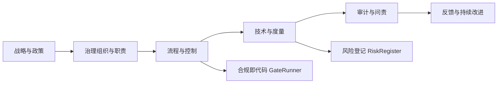

# 29. 可信AI治理与合规模型

> 说明：本文档中的代码/伪代码为说明性片段，仅用于理论阐释；本仓库不提供可运行工程或 CI。

## 概述

可信AI治理与合规模型致力于建立AI系统的治理框架，确保AI系统可控、可审计、可问责，满足法律法规和行业标准要求。

## 学习目标

1. **基础级** 理解AI治理框架（NIST RMF、ISO标准等）的核心要素
2. **进阶级** 掌握风险识别、评估与管理的系统方法
3. **进阶级** 能够设计合规检查与审计追踪机制
4. **高级级** 了解AI伦理原则与治理最佳实践
5. **高级级** 掌握治理框架在AI系统全生命周期的应用

## 术语与定义

| 术语 | 英文 | 定义 |
|------|------|------|
| AI治理 | AI Governance | 对AI系统全生命周期的管理、监督和控制框架 |
| 治理控制点 | Governance Control Point | 在AI系统生命周期中需要验证和检查的关键节点 |
| 风险管理 | Risk Management | 识别、评估、缓解和监控AI系统相关风险的过程 |
| 合规策略 | Compliance Policy | 确保AI系统符合法律法规和行业标准的策略 |
| 审计轨迹 | Audit Trail | 记录AI系统所有操作和决策的完整历史 |
| 隐私预算 | Privacy Budget | 差分隐私中控制隐私保护强度的参数 |
| 可解释性 | Interpretability | AI系统决策过程的可理解和可解释程度 |
| 透明度 | Transparency | AI系统内部机制和决策逻辑的开放程度 |
| 问责机制 | Accountability | 明确AI系统责任归属和追责的机制 |
| 合规即代码 | Compliance-as-Code | 将合规要求以代码形式实现和验证的方法 |

## 治理框架

- 治理目标: 安全、公平、透明、隐私、稳健、可持续
- 治理维度: 策略、组织、流程、技术、度量、改进
- 生命周期: 立项-数据-模型-部署-监控-退役

```rust
// 治理控制点定义
pub struct GovernanceControlPoint {
    name: String,
    description: String,
    phase: LifecyclePhase,
    required_checks: Vec<CheckItem>,
    evidence: Vec<EvidenceSpec>,
}

pub struct GovernanceRegistry {
    controls: Vec<GovernanceControlPoint>,
}

impl GovernanceRegistry {
    pub fn verify_phase(&self, phase: LifecyclePhase, artifacts: &Artifacts) -> GovernanceReport {
        let mut findings = Vec::new();
        for c in self.controls.iter().filter(|c| c.phase == phase) {
            for check in &c.required_checks {
                findings.push(check.run(artifacts));
            }
        }
        GovernanceReport { phase, findings }
    }
}
```

## 风险管理

- 风险类型: 模型风险、数据风险、隐私风险、鲁棒性风险、合规风险、操作风险
- 识别-评估-缓解-监控-复盘闭环

```rust
// 风险登记与缓解
pub struct RiskItem { id: String, category: RiskCategory, likelihood: f64, impact: f64, mitigation: Vec<Mitigation> }

pub struct RiskRegister { items: Vec<RiskItem> }

impl RiskRegister {
    pub fn risk_score(&self) -> f64 { self.items.iter().map(|i| i.likelihood * i.impact).sum() }
    pub fn apply_mitigation(&mut self, id: &str, m: Mitigation) { if let Some(it) = self.items.iter_mut().find(|x| x.id==id){ it.mitigation.push(m); } }
}
```

## 合规策略

- 法规与标准: GDPR/CCPA、HIPAA、ISO/IEC 23894(人工智能风险管理)、ISO/IEC 42001(AI管理体系)、NIST AI RMF、EU AI Act（草案）
- 策略类型: 数据治理、模型治理、第三方治理、供应链治理、变更管理

```rust
// 合规策略与控制映射
pub struct CompliancePolicy { id: String, refs: Vec<RegRef>, controls: Vec<Control> }

pub struct ComplianceMapper;
impl ComplianceMapper {
    pub fn map_to_controls(policies: &[CompliancePolicy]) -> Vec<GovernanceControlPoint> { /* 生成控制点 */ vec![] }
}
```

## 审计与问责

- 审计类型: 流程审计、模型审计、数据审计、安全审计
- 证据要求: 数据血缘、模型卡(Model Card)、数据卡(Data Card)、评测记录、变更记录
- 问责机制: 角色职责、审批门禁、签名与追溯

```rust
// 审计轨迹
pub struct AuditEvent { ts: u64, actor: String, action: String, target: String, hash: String }

pub struct AuditTrail { events: Vec<AuditEvent> }
impl AuditTrail { pub fn record(&mut self, e: AuditEvent){ self.events.push(e) } }
```

## 合规即代码 (Compliance-as-Code)

```rust
// 以代码定义的门禁
pub struct GateRule { name: String, predicate: Box<dyn Fn(&Artifacts)->bool>, severity: Severity }

pub struct GateRunner { rules: Vec<GateRule> }
impl GateRunner {
    pub fn run(&self, artifacts: &Artifacts) -> Vec<GateFinding> { self.rules.iter().map(|r| GateFinding{ name: r.name.clone(), passed: (r.predicate)(artifacts), severity: r.severity }).collect() }
}
```

## 治理度量与看板

- 关键指标(KPI): 隐私预算消耗、漂移报警、对抗攻击成功率、可解释性覆盖、数据缺陷率、合规通过率
- 看板: 实时风险热力图、合规通过趋势、模型健康度

## 数学与形式化

- 风险期望: \( R = \sum_i p_i \cdot c_i \)
- 合规覆盖率: \( C = \frac{|Controls_{passed}|}{|Controls_{total}|} \)
- 证据完备度: \( E = f(\text{traceability}, \text{integrity}, \text{timeliness}) \)

## 实践蓝图

- 组织: 设立AI治理委员会、明确RACI
- 流程: 需求评审→数据审查→模型评估→上线审批→运行监控→退役
- 技术: 数据血缘、模型卡、评测框架、策略引擎、审计溯源

## 应用案例

- 金融信贷AI合规
- 医疗诊断可追溯审计
- 政务公共服务透明度

## 总结

通过治理框架、风险管理、合规即代码与度量看板的系统化建设，可实现AI系统“可控、可证、可信”。

## 架构图（Mermaid）



## 交叉链接

- 参见 `25-算法可解释性与透明度理论.md`
- 参见 `26-算法鲁棒性与对抗性防御理论.md`
- 参见 `27-算法联邦学习与隐私保护理论.md`
- 参见 `28-算法量子机器学习理论.md`

## 相关文档（交叉链接）

- `10-高级主题/25-算法可解释性与透明度理论.md`
- `10-高级主题/27-算法联邦学习与隐私保护理论.md`
- `10-高级主题/26-算法鲁棒性与对抗性防御理论.md`

## 参考文献（示例）

1. NIST AI Risk Management Framework (AI RMF 1.0), 2023.
2. ISO/IEC 23894:2023 Information technology — Artificial intelligence — Risk management.
3. Floridi, L. et al. AI4People—An Ethical Framework for a Good AI Society. Minds and Machines, 2018.

## 可运行Rust示例骨架

```rust
use std::collections::HashMap;
use chrono::{DateTime, Utc};
use serde::{Deserialize, Serialize};

// 治理控制点
#[derive(Clone, Debug, Serialize, Deserialize)]
pub struct GovernanceControlPoint {
    pub name: String,
    pub description: String,
    pub phase: LifecyclePhase,
    pub required_checks: Vec<CheckItem>,
    pub evidence: Vec<EvidenceSpec>,
}

#[derive(Clone, Debug, Serialize, Deserialize)]
pub enum LifecyclePhase {
    Planning,
    DataCollection,
    ModelDevelopment,
    Deployment,
    Monitoring,
    Retirement,
}

#[derive(Clone, Debug, Serialize, Deserialize)]
pub struct CheckItem {
    pub id: String,
    pub description: String,
    pub severity: Severity,
    pub automated: bool,
}

#[derive(Clone, Debug, Serialize, Deserialize)]
pub enum Severity {
    Low,
    Medium,
    High,
    Critical,
}

// 治理注册表
pub struct GovernanceRegistry {
    pub controls: Vec<GovernanceControlPoint>,
}

impl GovernanceRegistry {
    pub fn new() -> Self {
        Self {
            controls: Vec::new(),
        }
    }
    
    pub fn add_control(&mut self, control: GovernanceControlPoint) {
        self.controls.push(control);
    }
    
    pub fn verify_phase(&self, phase: LifecyclePhase, artifacts: &Artifacts) -> GovernanceReport {
        let mut findings = Vec::new();
        
        for control in self.controls.iter().filter(|c| c.phase == phase) {
            for check in &control.required_checks {
                let result = self.run_check(check, artifacts);
                findings.push(result);
            }
        }
        
        GovernanceReport {
            phase,
            findings,
            timestamp: Utc::now(),
        }
    }
    
    fn run_check(&self, check: &CheckItem, artifacts: &Artifacts) -> CheckResult {
        // 简化的检查逻辑
        let passed = match check.id.as_str() {
            "data_quality" => self.check_data_quality(artifacts),
            "model_fairness" => self.check_model_fairness(artifacts),
            "privacy_compliance" => self.check_privacy_compliance(artifacts),
            "security_audit" => self.check_security_audit(artifacts),
            _ => true, // 默认通过
        };
        
        CheckResult {
            check_id: check.id.clone(),
            passed,
            severity: check.severity.clone(),
            details: format!("Check {} {}", check.id, if passed { "passed" } else { "failed" }),
        }
    }
    
    fn check_data_quality(&self, _artifacts: &Artifacts) -> bool {
        // 数据质量检查逻辑
        true
    }
    
    fn check_model_fairness(&self, _artifacts: &Artifacts) -> bool {
        // 模型公平性检查逻辑
        true
    }
    
    fn check_privacy_compliance(&self, _artifacts: &Artifacts) -> bool {
        // 隐私合规检查逻辑
        true
    }
    
    fn check_security_audit(&self, _artifacts: &Artifacts) -> bool {
        // 安全审计检查逻辑
        true
    }
}

// 风险管理
#[derive(Clone, Debug, Serialize, Deserialize)]
pub struct RiskItem {
    pub id: String,
    pub category: RiskCategory,
    pub likelihood: f64,
    pub impact: f64,
    pub mitigation: Vec<Mitigation>,
}

#[derive(Clone, Debug, Serialize, Deserialize)]
pub enum RiskCategory {
    ModelRisk,
    DataRisk,
    PrivacyRisk,
    RobustnessRisk,
    ComplianceRisk,
    OperationalRisk,
}

#[derive(Clone, Debug, Serialize, Deserialize)]
pub struct Mitigation {
    pub description: String,
    pub effectiveness: f64,
    pub cost: f64,
}

pub struct RiskRegister {
    pub items: Vec<RiskItem>,
}

impl RiskRegister {
    pub fn new() -> Self {
        Self {
            items: Vec::new(),
        }
    }
    
    pub fn add_risk(&mut self, risk: RiskItem) {
        self.items.push(risk);
    }
    
    pub fn risk_score(&self) -> f64 {
        self.items.iter()
            .map(|risk| risk.likelihood * risk.impact)
            .sum()
    }
    
    pub fn apply_mitigation(&mut self, risk_id: &str, mitigation: Mitigation) -> Result<(), String> {
        if let Some(risk) = self.items.iter_mut().find(|r| r.id == risk_id) {
            risk.mitigation.push(mitigation);
            Ok(())
        } else {
            Err(format!("Risk {} not found", risk_id))
        }
    }
    
    pub fn get_high_risks(&self) -> Vec<&RiskItem> {
        self.items.iter()
            .filter(|risk| risk.likelihood * risk.impact > 0.7)
            .collect()
    }
}

// 合规策略
#[derive(Clone, Debug, Serialize, Deserialize)]
pub struct CompliancePolicy {
    pub id: String,
    pub name: String,
    pub refs: Vec<RegRef>,
    pub controls: Vec<Control>,
}

#[derive(Clone, Debug, Serialize, Deserialize)]
pub struct RegRef {
    pub regulation: String,
    pub section: String,
    pub description: String,
}

#[derive(Clone, Debug, Serialize, Deserialize)]
pub struct Control {
    pub id: String,
    pub description: String,
    pub implementation: String,
}

pub struct ComplianceMapper;

impl ComplianceMapper {
    pub fn map_to_controls(policies: &[CompliancePolicy]) -> Vec<GovernanceControlPoint> {
        let mut controls = Vec::new();
        
        for policy in policies {
            for control in &policy.controls {
                let control_point = GovernanceControlPoint {
                    name: control.id.clone(),
                    description: control.description.clone(),
                    phase: LifecyclePhase::ModelDevelopment, // 简化
                    required_checks: vec![
                        CheckItem {
                            id: control.id.clone(),
                            description: control.description.clone(),
                            severity: Severity::Medium,
                            automated: true,
                        }
                    ],
                    evidence: Vec::new(),
                };
                controls.push(control_point);
            }
        }
        
        controls
    }
}

// 审计轨迹
#[derive(Clone, Debug, Serialize, Deserialize)]
pub struct AuditEvent {
    pub timestamp: DateTime<Utc>,
    pub actor: String,
    pub action: String,
    pub target: String,
    pub hash: String,
    pub metadata: HashMap<String, String>,
}

pub struct AuditTrail {
    pub events: Vec<AuditEvent>,
}

impl AuditTrail {
    pub fn new() -> Self {
        Self {
            events: Vec::new(),
        }
    }
    
    pub fn record(&mut self, event: AuditEvent) {
        self.events.push(event);
    }
    
    pub fn get_events_by_actor(&self, actor: &str) -> Vec<&AuditEvent> {
        self.events.iter()
            .filter(|event| event.actor == actor)
            .collect()
    }
    
    pub fn get_events_by_target(&self, target: &str) -> Vec<&AuditEvent> {
        self.events.iter()
            .filter(|event| event.target == target)
            .collect()
    }
    
    pub fn verify_integrity(&self) -> bool {
        // 简化的完整性验证
        for event in &self.events {
            let expected_hash = self.compute_hash(event);
            if event.hash != expected_hash {
                return false;
            }
        }
        true
    }
    
    fn compute_hash(&self, event: &AuditEvent) -> String {
        // 简化的哈希计算
        format!("hash_{}_{}", event.actor, event.timestamp.timestamp())
    }
}

// 合规即代码
#[derive(Clone, Debug)]
pub struct GateRule {
    pub name: String,
    pub predicate: Box<dyn Fn(&Artifacts) -> bool>,
    pub severity: Severity,
}

pub struct GateRunner {
    pub rules: Vec<GateRule>,
}

impl GateRunner {
    pub fn new() -> Self {
        Self {
            rules: Vec::new(),
        }
    }
    
    pub fn add_rule(&mut self, rule: GateRule) {
        self.rules.push(rule);
    }
    
    pub fn run(&self, artifacts: &Artifacts) -> Vec<GateFinding> {
        self.rules.iter()
            .map(|rule| {
                let passed = (rule.predicate)(artifacts);
                GateFinding {
                    name: rule.name.clone(),
                    passed,
                    severity: rule.severity.clone(),
                }
            })
            .collect()
    }
}

// 辅助结构
#[derive(Clone, Debug)]
pub struct Artifacts {
    pub data_quality_metrics: HashMap<String, f64>,
    pub model_performance: HashMap<String, f64>,
    pub privacy_metrics: HashMap<String, f64>,
    pub security_metrics: HashMap<String, f64>,
}

#[derive(Clone, Debug)]
pub struct GovernanceReport {
    pub phase: LifecyclePhase,
    pub findings: Vec<CheckResult>,
    pub timestamp: DateTime<Utc>,
}

#[derive(Clone, Debug)]
pub struct CheckResult {
    pub check_id: String,
    pub passed: bool,
    pub severity: Severity,
    pub details: String,
}

#[derive(Clone, Debug)]
pub struct GateFinding {
    pub name: String,
    pub passed: bool,
    pub severity: Severity,
}

// 示例使用
fn main() {
    // 创建治理注册表
    let mut registry = GovernanceRegistry::new();
    
    // 添加治理控制点
    let data_quality_control = GovernanceControlPoint {
        name: "Data Quality Check".to_string(),
        description: "Verify data quality metrics".to_string(),
        phase: LifecyclePhase::DataCollection,
        required_checks: vec![
            CheckItem {
                id: "data_quality".to_string(),
                description: "Check data completeness and accuracy".to_string(),
                severity: Severity::High,
                automated: true,
            }
        ],
        evidence: Vec::new(),
    };
    
    registry.add_control(data_quality_control);
    
    // 创建风险登记
    let mut risk_register = RiskRegister::new();
    
    let privacy_risk = RiskItem {
        id: "privacy_breach".to_string(),
        category: RiskCategory::PrivacyRisk,
        likelihood: 0.3,
        impact: 0.8,
        mitigation: Vec::new(),
    };
    
    risk_register.add_risk(privacy_risk);
    
    // 创建审计轨迹
    let mut audit_trail = AuditTrail::new();
    
    let event = AuditEvent {
        timestamp: Utc::now(),
        actor: "data_scientist".to_string(),
        action: "model_training".to_string(),
        target: "fraud_detection_model".to_string(),
        hash: "hash_123".to_string(),
        metadata: HashMap::new(),
    };
    
    audit_trail.record(event);
    
    // 创建门禁规则
    let mut gate_runner = GateRunner::new();
    
    let data_quality_gate = GateRule {
        name: "Data Quality Gate".to_string(),
        predicate: Box::new(|artifacts| {
            artifacts.data_quality_metrics.get("completeness").unwrap_or(&0.0) > &0.9
        }),
        severity: Severity::High,
    };
    
    gate_runner.add_rule(data_quality_gate);
    
    // 运行治理检查
    let artifacts = Artifacts {
        data_quality_metrics: {
            let mut map = HashMap::new();
            map.insert("completeness".to_string(), 0.95);
            map
        },
        model_performance: HashMap::new(),
        privacy_metrics: HashMap::new(),
        security_metrics: HashMap::new(),
    };
    
    let report = registry.verify_phase(LifecyclePhase::DataCollection, &artifacts);
    println!("Governance report: {:?}", report);
    
    let findings = gate_runner.run(&artifacts);
    println!("Gate findings: {:?}", findings);
    
    println!("Risk score: {:.2}", risk_register.risk_score());
    println!("Audit trail integrity: {}", audit_trail.verify_integrity());
}

## 前置阅读（建议）
- 法规与行业标准（治理框架/风险管理）
- 可解释性与透明度方法论
- 隐私保护与安全合规（DP/SMPC/HE）
- 审计与问责机制（证据与追溯）

## 参考文献（示例）
1. NIST AI Risk Management Framework (AI RMF 1.0), 2023.
2. ISO/IEC 23894:2023 Information technology — Artificial intelligence — Risk management.
3. Floridi, L. et al. AI4People—An Ethical Framework for a Good AI Society. Minds and Machines, 2018.
