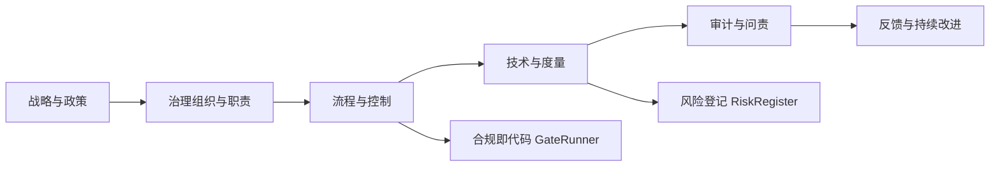

## 10.29 可信AI治理与合规模型 / Trustworthy AI Governance and Compliance Models

> 说明：本文档中的代码/伪代码为说明性片段，仅用于理论阐释；本仓库不提供可运行工程或 CI。

### 摘要 / Executive Summary

- 统一可信AI治理与合规模型，研究算法系统在社会中的权力分配、责任归属和决策机制。
- 建立可信AI治理与合规在高级主题中的核心地位。

### 关键术语与符号 / Glossary

- 可信AI、算法治理、合规模型、算法伦理、算法公平性、算法问责制、算法透明度。
- 术语对齐与引用规范：`docs/术语与符号总表.md`，`01-基础理论/00-撰写规范与引用指南.md`

### 术语与符号规范 / Terminology & Notation

- 可信AI（Trustworthy AI）：可信赖的人工智能系统。
- 算法治理（Algorithm Governance）：算法系统的治理机制。
- 合规模型（Compliance Model）：符合法规要求的模型。
- 算法伦理（Algorithm Ethics）：算法的伦理原则。
- 记号约定：`G` 表示治理，`C` 表示合规，`E` 表示伦理，`F` 表示公平性。

### 交叉引用导航 / Cross-References

- 算法可解释性：参见 `10-高级主题/25-算法可解释性与透明度理论.md`。
- 算法鲁棒性：参见 `10-高级主题/26-算法鲁棒性与对抗性防御理论.md`。
- 算法联邦学习：参见 `10-高级主题/27-算法联邦学习与隐私保护理论.md`。

### 快速导航 / Quick Links

- 基本概念
- 算法治理
- 合规模型

## 目录 / Table of Contents

- [10.29 可信AI治理与合规模型 / Trustworthy AI Governance and Compliance Models](#1029-可信ai治理与合规模型--trustworthy-ai-governance-and-compliance-models)

## 0. 算法治理哲学基础 / Algorithm Governance Philosophy Foundation

### 0.1 算法治理的本质哲学探讨 / Philosophical Discussion on the Nature of Algorithm Governance

#### 0.1.1 算法治理的本体论问题 / Ontological Issues of Algorithm Governance

**定义 / Definition:**
算法治理是研究算法系统在社会中的权力分配、责任归属和决策机制本质的跨学科领域，涉及政治学、法学、伦理学、社会学和哲学的深度融合。

**本体论问题 / Ontological Questions:**

1. **算法治理的存在性 / Existence of Algorithm Governance:**
   - 算法是否具有治理能力？
   - 算法治理是技术实现还是社会建构？
   - 算法权力与人类权力的关系如何？

2. **算法治理的层次性 / Hierarchical Nature:**
   - 技术层面的治理（代码规则、算法逻辑）
   - 制度层面的治理（法律框架、政策规范）
   - 社会层面的治理（价值观念、文化规范）

3. **算法治理的本质属性 / Essential Properties:**
   - 透明性（Transparency）
   - 可问责性（Accountability）
   - 公平性（Fairness）
   - 包容性（Inclusivity）

#### 0.1.2 算法治理的认识论问题 / Epistemological Issues of Algorithm Governance

**认识论问题 / Epistemological Questions:**

1. **算法治理的认知边界 / Cognitive Boundaries:**
   - 我们能否完全理解算法决策的复杂性？
   - 算法治理的可预测性限度在哪里？
   - 技术理性与价值理性的关系

2. **算法治理的知识获取 / Knowledge Acquisition:**
   - 技术评估与社会评估的结合
   - 定量分析与定性判断的统一
   - 专家知识与公众参与的关系

3. **算法治理的方法论 / Methodology:**
   - 技术决定论与社会建构论的平衡
   - 自上而下与自下而上治理的结合
   - 多利益相关者参与的方法

#### 0.1.3 算法治理的价值论问题 / Axiological Issues of Algorithm Governance

**价值论问题 / Axiological Questions:**

1. **算法治理的伦理价值 / Ethical Value:**
   - 算法正义的实现
   - 人权保护与技术进步的平衡
   - 算法歧视的预防与纠正

2. **算法治理的社会价值 / Social Value:**
   - 社会公平的促进
   - 民主参与的增强
   - 社会信任的维护

3. **算法治理的政治价值 / Political Value:**
   - 权力制衡的实现
   - 公民权利的保障
   - 公共利益的维护

### 0.2 算法治理的形式化基础 / Formal Foundation of Algorithm Governance

#### 0.2.1 算法治理的形式化定义 / Formal Definition of Algorithm Governance

**定义 / Definition:**
算法治理系统是一个八元组 $(A, S, P, R, C, T, F, G)$，其中：

- $A$: 算法集合（治理对象）
- $S$: 利益相关者集合（治理主体）
- $P$: 权力分配函数（决策权限）
- $R$: 责任归属函数（问责机制）
- $C$: 约束条件集合（治理规则）
- $T$: 透明度函数（信息公开）
- $F$: 公平性函数（公正评估）
- $G$: 治理效果函数（治理评估）

**形式化表示 / Formal Representation:**

```text
GovernanceSystem = (A, S, P, R, C, T, F, G)
其中 / where:
- A: 算法空间 / Algorithm space
- S: 利益相关者空间 / Stakeholder space
- P: 权力分配机制 / Power distribution mechanism
- R: 责任归属机制 / Responsibility attribution mechanism
- C: 约束条件 / Constraints
- T: 透明度机制 / Transparency mechanism
- F: 公平性机制 / Fairness mechanism
- G: 治理效果评估 / Governance effectiveness evaluation
```

#### 0.2.2 算法治理的基本性质 / Basic Properties of Algorithm Governance

**定理 / Theorem:**
算法治理系统具有以下基本性质：

1. **透明性 / Transparency:**
   $$\forall a \in A, \forall s \in S: T(a, s) \geq \tau \text{ for some threshold } \tau$$

2. **可问责性 / Accountability:**
   $$\forall a \in A, \exists s \in S: R(a, s) \text{ is well-defined}$$

3. **公平性 / Fairness:**
   $$\forall s_1, s_2 \in S: F(s_1, a) = F(s_2, a) \text{ for all } a \in A$$

**证明 / Proof:**

**透明性证明 / Transparency Proof:**

- 所有算法决策过程必须对利益相关者透明
- 透明度函数确保信息公开达到最低阈值
- 这保证了治理的可监督性

**可问责性证明 / Accountability Proof:**

- 每个算法都有明确的责任归属
- 责任归属函数确保问责机制的有效性
- 这保证了治理的可追责性

**公平性证明 / Fairness Proof:**

- 所有利益相关者在算法治理中享有平等权利
- 公平性函数确保治理过程的公正性
- 这保证了治理的合法性

#### 0.2.3 算法治理与经典治理的比较 / Comparison with Classical Governance

**比较维度 / Comparison Dimensions:**

1. **决策机制 / Decision Mechanism:**
   - 经典治理：基于人类判断
   - 算法治理：基于算法逻辑

2. **执行效率 / Execution Efficiency:**
   - 经典治理：相对较低
   - 算法治理：相对较高

3. **适应性 / Adaptability:**
   - 经典治理：需要人工调整
   - 算法治理：可以自动优化

4. **可解释性 / Explainability:**
   - 经典治理：基于经验解释
   - 算法治理：需要技术解释

**形式化比较 / Formal Comparison:**

```text
Classical Governance:
- Human-based: Decisions made by humans
- Slow: Manual decision process
- Adaptive: Human learning and adjustment
- Explainable: Based on human reasoning

Algorithm Governance:
- Algorithm-based: Decisions made by algorithms
- Fast: Automated decision process
- Optimizable: Algorithm optimization
- Technical: Requires technical explanation
```

### 0.3 算法治理的哲学意义 / Philosophical Significance of Algorithm Governance

#### 0.3.1 对权力本质的理解 / Understanding the Nature of Power

**权力的技术化 / Technologization of Power:**

- 权力从人际关系到算法关系
- 技术作为权力的新载体
- 算法权力的去人格化特征

**权力的分散化 / Decentralization of Power:**

- 从集中权力到分布式权力
- 从个人权力到系统权力
- 从显性权力到隐性权力

#### 0.3.2 对责任本质的重新思考 / Rethinking the Nature of Responsibility

**责任的算法化 / Algorithmization of Responsibility:**

- 责任归属的技术化处理
- 算法责任与人类责任的边界
- 集体责任与个体责任的关系

**责任的自动化 / Automation of Responsibility:**

- 责任判断的自动化机制
- 责任追究的技术化路径
- 责任修复的算法化方法

#### 0.3.3 对治理理论的贡献 / Contribution to Governance Theory

**治理的智能化 / Intelligentization of Governance:**

- 智能治理的哲学基础
- 算法治理与民主治理的关系
- 治理效率与治理质量的平衡

**治理的全球化 / Globalization of Governance:**

- 算法治理的跨国界特征
- 全球治理的新模式
- 治理标准化的挑战与机遇

## 概述

可信AI治理与合规模型致力于建立AI系统的治理框架，确保AI系统可控、可审计、可问责，满足法律法规和行业标准要求。

## 学习目标

1. **基础级** 理解AI治理框架（NIST RMF、ISO标准等）的核心要素
2. **进阶级** 掌握风险识别、评估与管理的系统方法
3. **进阶级** 能够设计合规检查与审计追踪机制
4. **高级级** 了解AI伦理原则与治理最佳实践
5. **高级级** 掌握治理框架在AI系统全生命周期的应用

## 术语与定义

| 术语 | 英文 | 定义 |
|------|------|------|
| AI治理 | AI Governance | 对AI系统全生命周期的管理、监督和控制框架 |
| 治理控制点 | Governance Control Point | 在AI系统生命周期中需要验证和检查的关键节点 |
| 风险管理 | Risk Management | 识别、评估、缓解和监控AI系统相关风险的过程 |
| 合规策略 | Compliance Policy | 确保AI系统符合法律法规和行业标准的策略 |
| 审计轨迹 | Audit Trail | 记录AI系统所有操作和决策的完整历史 |
| 隐私预算 | Privacy Budget | 差分隐私中控制隐私保护强度的参数 |
| 可解释性 | Interpretability | AI系统决策过程的可理解和可解释程度 |
| 透明度 | Transparency | AI系统内部机制和决策逻辑的开放程度 |
| 问责机制 | Accountability | 明确AI系统责任归属和追责的机制 |
| 合规即代码 | Compliance-as-Code | 将合规要求以代码形式实现和验证的方法 |

## 治理框架

- 治理目标: 安全、公平、透明、隐私、稳健、可持续
- 治理维度: 策略、组织、流程、技术、度量、改进
- 生命周期: 立项-数据-模型-部署-监控-退役

```rust
// 治理控制点定义
pub struct GovernanceControlPoint {
    name: String,
    description: String,
    phase: LifecyclePhase,
    required_checks: Vec<CheckItem>,
    evidence: Vec<EvidenceSpec>,
}

pub struct GovernanceRegistry {
    controls: Vec<GovernanceControlPoint>,
}

impl GovernanceRegistry {
    pub fn verify_phase(&self, phase: LifecyclePhase, artifacts: &Artifacts) -> GovernanceReport {
        let mut findings = Vec::new();
        for c in self.controls.iter().filter(|c| c.phase == phase) {
            for check in &c.required_checks {
                findings.push(check.run(artifacts));
            }
        }
        GovernanceReport { phase, findings }
    }
}
```

## 风险管理

- 风险类型: 模型风险、数据风险、隐私风险、鲁棒性风险、合规风险、操作风险
- 识别-评估-缓解-监控-复盘闭环

```rust
// 风险登记与缓解
pub struct RiskItem { id: String, category: RiskCategory, likelihood: f64, impact: f64, mitigation: Vec<Mitigation> }

pub struct RiskRegister { items: Vec<RiskItem> }

impl RiskRegister {
    pub fn risk_score(&self) -> f64 { self.items.iter().map(|i| i.likelihood * i.impact).sum() }
    pub fn apply_mitigation(&mut self, id: &str, m: Mitigation) { if let Some(it) = self.items.iter_mut().find(|x| x.id==id){ it.mitigation.push(m); } }
}
```

## 合规策略

- 法规与标准: GDPR/CCPA、HIPAA、ISO/IEC 23894(人工智能风险管理)、ISO/IEC 42001(AI管理体系)、NIST AI RMF、EU AI Act（草案）
- 策略类型: 数据治理、模型治理、第三方治理、供应链治理、变更管理

```rust
// 合规策略与控制映射
pub struct CompliancePolicy { id: String, refs: Vec<RegRef>, controls: Vec<Control> }

pub struct ComplianceMapper;
impl ComplianceMapper {
    pub fn map_to_controls(policies: &[CompliancePolicy]) -> Vec<GovernanceControlPoint> { /* 生成控制点 */ vec![] }
}
```

## 审计与问责

- 审计类型: 流程审计、模型审计、数据审计、安全审计
- 证据要求: 数据血缘、模型卡(Model Card)、数据卡(Data Card)、评测记录、变更记录

```rust
// 审计系统
pub struct AuditSystem {
    audit_trail: AuditTrail,
    evidence_collector: EvidenceCollector,
    compliance_checker: ComplianceChecker,
}

impl AuditSystem {
    pub fn record_decision(&mut self, decision: &AIDecision) -> Result<(), AuditError> {
        // 记录AI决策
        let audit_record = AuditRecord {
            timestamp: SystemTime::now(),
            decision: decision.clone(),
            context: self.collect_context(decision)?,
            evidence: self.collect_evidence(decision)?,
        };
        
        self.audit_trail.add_record(audit_record)?;
        Ok(())
    }
    
    pub fn generate_audit_report(&self, time_range: TimeRange) -> Result<AuditReport, ReportError> {
        let records = self.audit_trail.get_records(time_range)?;
        let compliance_status = self.compliance_checker.check_compliance(&records)?;
        
        Ok(AuditReport {
            time_range,
            records,
            compliance_status,
            risk_assessment: self.assess_risks(&records)?,
        })
    }
}

// 问责机制
pub struct AccountabilityFramework {
    responsibility_matrix: ResponsibilityMatrix,
    escalation_procedures: Vec<EscalationProcedure>,
    remediation_actions: Vec<RemediationAction>,
}

impl AccountabilityFramework {
    pub fn assign_responsibility(&self, decision: &AIDecision) -> Result<ResponsibilityAssignment, AssignmentError> {
        // 根据决策类型和影响分配责任
        let responsible_party = self.responsibility_matrix.lookup(decision)?;
        
        Ok(ResponsibilityAssignment {
            decision_id: decision.id.clone(),
            responsible_party,
            accountability_level: self.determine_accountability_level(decision)?,
            escalation_path: self.get_escalation_path(decision)?,
        })
    }
    
    pub fn handle_violation(&self, violation: &ComplianceViolation) -> Result<RemediationPlan, RemediationError> {
        // 处理合规违规
        let remediation_actions = self.determine_remediation_actions(violation)?;
        let timeline = self.create_remediation_timeline(&remediation_actions)?;
        
        Ok(RemediationPlan {
            violation: violation.clone(),
            actions: remediation_actions,
            timeline,
            responsible_party: self.assign_responsibility_for_violation(violation)?,
        })
    }
}
```

## 隐私保护与数据治理

### 差分隐私实现

```rust
// 差分隐私系统
pub struct DifferentialPrivacySystem {
    privacy_budget: PrivacyBudget,
    noise_generator: NoiseGenerator,
    privacy_accountant: PrivacyAccountant,
}

impl DifferentialPrivacySystem {
    pub fn add_noise(&mut self, data: &[f64], sensitivity: f64) -> Result<Vec<f64>, PrivacyError> {
        // 检查隐私预算
        if !self.privacy_accountant.check_budget(sensitivity)? {
            return Err(PrivacyError::BudgetExceeded);
        }
        
        // 生成噪声
        let noise = self.noise_generator.generate_laplace_noise(sensitivity, self.privacy_budget.epsilon)?;
        
        // 添加噪声到数据
        let noisy_data: Vec<f64> = data.iter()
            .zip(noise.iter())
            .map(|(d, n)| d + n)
            .collect();
        
        // 更新隐私预算
        self.privacy_accountant.consume_budget(sensitivity)?;
        
        Ok(noisy_data)
    }
    
    pub fn compose_queries(&self, queries: &[Query]) -> Result<ComposedQuery, CompositionError> {
        // 组合查询的隐私预算
        let total_sensitivity = queries.iter().map(|q| q.sensitivity).sum();
        let composed_epsilon = self.privacy_accountant.compose_epsilon(queries)?;
        
        Ok(ComposedQuery {
            queries: queries.to_vec(),
            total_sensitivity,
            composed_epsilon,
        })
    }
}

// 隐私预算管理
pub struct PrivacyBudget {
    epsilon: f64,
    delta: f64,
    remaining_epsilon: f64,
    remaining_delta: f64,
}

impl PrivacyBudget {
    pub fn new(epsilon: f64, delta: f64) -> Self {
        Self {
            epsilon,
            delta,
            remaining_epsilon: epsilon,
            remaining_delta: delta,
        }
    }
    
    pub fn consume(&mut self, epsilon_cost: f64, delta_cost: f64) -> Result<(), BudgetError> {
        if epsilon_cost > self.remaining_epsilon || delta_cost > self.remaining_delta {
            return Err(BudgetError::InsufficientBudget);
        }
        
        self.remaining_epsilon -= epsilon_cost;
        self.remaining_delta -= delta_cost;
        
        Ok(())
    }
    
    pub fn reset(&mut self) {
        self.remaining_epsilon = self.epsilon;
        self.remaining_delta = self.delta;
    }
}
```

### 数据治理框架

```rust
// 数据治理系统
pub struct DataGovernanceSystem {
    data_catalog: DataCatalog,
    data_lineage: DataLineage,
    access_control: AccessControl,
    data_quality: DataQualityMonitor,
}

impl DataGovernanceSystem {
    pub fn register_dataset(&mut self, dataset: &Dataset) -> Result<DatasetId, RegistrationError> {
        // 注册数据集
        let dataset_id = self.data_catalog.register(dataset)?;
        
        // 建立数据血缘
        self.data_lineage.establish_lineage(&dataset_id, dataset)?;
        
        // 设置访问控制
        self.access_control.set_permissions(&dataset_id, &dataset.access_policy)?;
        
        // 启动质量监控
        self.data_quality.start_monitoring(&dataset_id)?;
        
        Ok(dataset_id)
    }
    
    pub fn track_data_usage(&mut self, usage: &DataUsage) -> Result<(), TrackingError> {
        // 跟踪数据使用
        self.data_lineage.record_usage(usage)?;
        
        // 检查访问权限
        if !self.access_control.check_permission(usage)? {
            return Err(TrackingError::AccessDenied);
        }
        
        // 更新使用统计
        self.data_catalog.update_usage_stats(usage)?;
        
        Ok(())
    }
    
    pub fn generate_data_card(&self, dataset_id: &DatasetId) -> Result<DataCard, CardError> {
        // 生成数据卡
        let dataset = self.data_catalog.get_dataset(dataset_id)?;
        let lineage = self.data_lineage.get_lineage(dataset_id)?;
        let quality_metrics = self.data_quality.get_metrics(dataset_id)?;
        
        Ok(DataCard {
            dataset: dataset.clone(),
            lineage,
            quality_metrics,
            access_policy: self.access_control.get_policy(dataset_id)?,
            usage_statistics: self.data_catalog.get_usage_stats(dataset_id)?,
        })
    }
}
```

## 模型治理与可解释性

### 模型卡系统

```rust
// 模型卡生成器
pub struct ModelCardGenerator {
    model_analyzer: ModelAnalyzer,
    performance_evaluator: PerformanceEvaluator,
    bias_detector: BiasDetector,
    explainability_engine: ExplainabilityEngine,
}

impl ModelCardGenerator {
    pub fn generate_model_card(&self, model: &AIModel) -> Result<ModelCard, CardError> {
        // 分析模型结构
        let model_analysis = self.model_analyzer.analyze(model)?;
        
        // 评估性能
        let performance_metrics = self.performance_evaluator.evaluate(model)?;
        
        // 检测偏见
        let bias_analysis = self.bias_detector.detect_bias(model)?;
        
        // 生成可解释性报告
        let explainability_report = self.explainability_engine.generate_report(model)?;
        
        Ok(ModelCard {
            model_info: model_analysis,
            performance: performance_metrics,
            bias_analysis,
            explainability: explainability_report,
            intended_use: self.determine_intended_use(model)?,
            limitations: self.identify_limitations(model)?,
            training_data: self.analyze_training_data(model)?,
            evaluation_data: self.analyze_evaluation_data(model)?,
        })
    }
}

// 可解释性引擎
pub struct ExplainabilityEngine {
    lime_explainer: LimeExplainer,
    shap_explainer: ShapExplainer,
    counterfactual_generator: CounterfactualGenerator,
}

impl ExplainabilityEngine {
    pub fn explain_prediction(&self, model: &AIModel, input: &ModelInput) -> Result<Explanation, ExplanationError> {
        // 生成LIME解释
        let lime_explanation = self.lime_explainer.explain(model, input)?;
        
        // 生成SHAP解释
        let shap_explanation = self.shap_explainer.explain(model, input)?;
        
        // 生成反事实解释
        let counterfactual = self.counterfactual_generator.generate(model, input)?;
        
        Ok(Explanation {
            lime: lime_explanation,
            shap: shap_explanation,
            counterfactual,
            confidence: self.calculate_explanation_confidence(&lime_explanation, &shap_explanation)?,
        })
    }
    
    pub fn generate_feature_importance(&self, model: &AIModel) -> Result<FeatureImportance, ImportanceError> {
        // 计算特征重要性
        let global_importance = self.shap_explainer.global_importance(model)?;
        let local_importance = self.lime_explainer.local_importance(model)?;
        
        Ok(FeatureImportance {
            global: global_importance,
            local: local_importance,
            stability_score: self.calculate_stability_score(&global_importance, &local_importance)?,
        })
    }
}
```

## 合规即代码实现

### 合规规则引擎

```rust
// 合规规则引擎
pub struct ComplianceRuleEngine {
    rule_repository: RuleRepository,
    rule_executor: RuleExecutor,
    violation_detector: ViolationDetector,
}

impl ComplianceRuleEngine {
    pub fn check_compliance(&self, artifact: &Artifact) -> Result<ComplianceReport, ComplianceError> {
        let mut violations = Vec::new();
        let mut passed_checks = Vec::new();
        
        // 获取适用的规则
        let applicable_rules = self.rule_repository.get_applicable_rules(artifact)?;
        
        // 执行规则检查
        for rule in applicable_rules {
            match self.rule_executor.execute(&rule, artifact) {
                Ok(result) => {
                    if result.is_compliant {
                        passed_checks.push(CheckResult {
                            rule: rule.clone(),
                            result,
                        });
                    } else {
                        violations.push(Violation {
                            rule: rule.clone(),
                            result,
                            severity: self.determine_violation_severity(&rule, &result)?,
                        });
                    }
                }
                Err(e) => return Err(ComplianceError::RuleExecutionFailed(e)),
            }
        }
        
        Ok(ComplianceReport {
            artifact: artifact.clone(),
            violations,
            passed_checks,
            overall_compliance: self.calculate_overall_compliance(&violations, &passed_checks)?,
        })
    }
    
    pub fn register_rule(&mut self, rule: ComplianceRule) -> Result<RuleId, RegistrationError> {
        // 验证规则语法
        self.validate_rule_syntax(&rule)?;
        
        // 检查规则冲突
        self.check_rule_conflicts(&rule)?;
        
        // 注册规则
        let rule_id = self.rule_repository.register(rule)?;
        
        Ok(rule_id)
    }
}

// 合规规则定义
#[derive(Debug, Clone)]
pub struct ComplianceRule {
    id: RuleId,
    name: String,
    description: String,
    category: RuleCategory,
    conditions: Vec<Condition>,
    actions: Vec<Action>,
    severity: ViolationSeverity,
}

impl ComplianceRule {
    pub fn new(name: String, description: String, category: RuleCategory) -> Self {
        Self {
            id: RuleId::generate(),
            name,
            description,
            category,
            conditions: Vec::new(),
            actions: Vec::new(),
            severity: ViolationSeverity::Medium,
        }
    }
    
    pub fn add_condition(&mut self, condition: Condition) {
        self.conditions.push(condition);
    }
    
    pub fn add_action(&mut self, action: Action) {
        self.actions.push(action);
    }
    
    pub fn set_severity(&mut self, severity: ViolationSeverity) {
        self.severity = severity;
    }
}
```

## 治理监控与报告

### 实时监控系统

```rust
// 治理监控系统
pub struct GovernanceMonitoringSystem {
    metrics_collector: MetricsCollector,
    alert_manager: AlertManager,
    dashboard_generator: DashboardGenerator,
}

impl GovernanceMonitoringSystem {
    pub fn monitor_governance_metrics(&self) -> Result<GovernanceMetrics, MonitoringError> {
        // 收集治理指标
        let risk_metrics = self.metrics_collector.collect_risk_metrics()?;
        let compliance_metrics = self.metrics_collector.collect_compliance_metrics()?;
        let privacy_metrics = self.metrics_collector.collect_privacy_metrics()?;
        let performance_metrics = self.metrics_collector.collect_performance_metrics()?;
        
        Ok(GovernanceMetrics {
            risk: risk_metrics,
            compliance: compliance_metrics,
            privacy: privacy_metrics,
            performance: performance_metrics,
            timestamp: SystemTime::now(),
        })
    }
    
    pub fn check_alerts(&mut self, metrics: &GovernanceMetrics) -> Result<Vec<Alert>, AlertError> {
        let mut alerts = Vec::new();
        
        // 检查风险阈值
        if metrics.risk.overall_risk_score > self.alert_manager.risk_threshold {
            alerts.push(Alert::new(
                AlertType::HighRisk,
                "Overall risk score exceeds threshold",
                metrics.risk.overall_risk_score,
            ));
        }
        
        // 检查合规违规
        if metrics.compliance.violation_count > 0 {
            alerts.push(Alert::new(
                AlertType::ComplianceViolation,
                "Compliance violations detected",
                metrics.compliance.violation_count as f64,
            ));
        }
        
        // 检查隐私预算
        if metrics.privacy.budget_consumption > 0.8 {
            alerts.push(Alert::new(
                AlertType::PrivacyBudgetWarning,
                "Privacy budget nearly exhausted",
                metrics.privacy.budget_consumption,
            ));
        }
        
        Ok(alerts)
    }
    
    pub fn generate_governance_report(&self, time_range: TimeRange) -> Result<GovernanceReport, ReportError> {
        // 生成治理报告
        let metrics_history = self.metrics_collector.get_metrics_history(time_range)?;
        let alerts_history = self.alert_manager.get_alerts_history(time_range)?;
        let compliance_status = self.get_compliance_status(time_range)?;
        
        Ok(GovernanceReport {
            time_range,
            metrics_history,
            alerts_history,
            compliance_status,
            recommendations: self.generate_recommendations(&metrics_history)?,
        })
    }
}
```

## 治理最佳实践

### 治理成熟度模型

```rust
// 治理成熟度评估
pub struct GovernanceMaturityAssessment {
    maturity_model: MaturityModel,
    assessment_criteria: Vec<AssessmentCriterion>,
    improvement_planner: ImprovementPlanner,
}

impl GovernanceMaturityAssessment {
    pub fn assess_maturity(&self, organization: &Organization) -> Result<MaturityLevel, AssessmentError> {
        let mut scores = Vec::new();
        
        // 评估各个维度
        for criterion in &self.assessment_criteria {
            let score = self.evaluate_criterion(criterion, organization)?;
            scores.push(score);
        }
        
        // 计算总体成熟度
        let overall_score = scores.iter().sum::<f64>() / scores.len() as f64;
        let maturity_level = self.maturity_model.determine_level(overall_score)?;
        
        Ok(maturity_level)
    }
    
    pub fn generate_improvement_plan(&self, current_level: MaturityLevel, target_level: MaturityLevel) -> Result<ImprovementPlan, PlanningError> {
        // 生成改进计划
        let gaps = self.identify_gaps(current_level, target_level)?;
        let initiatives = self.prioritize_initiatives(&gaps)?;
        let timeline = self.create_timeline(&initiatives)?;
        
        Ok(ImprovementPlan {
            current_level,
            target_level,
            initiatives,
            timeline,
            success_metrics: self.define_success_metrics(target_level)?,
        })
    }
}

// 成熟度模型
#[derive(Debug, Clone, PartialEq)]
pub enum MaturityLevel {
    Initial,      // 初始级
    Managed,      // 管理级
    Defined,      // 定义级
    QuantitativelyManaged, // 量化管理级
    Optimizing,   // 优化级
}

impl MaturityLevel {
    pub fn next_level(&self) -> Option<Self> {
        match self {
            MaturityLevel::Initial => Some(MaturityLevel::Managed),
            MaturityLevel::Managed => Some(MaturityLevel::Defined),
            MaturityLevel::Defined => Some(MaturityLevel::QuantitativelyManaged),
            MaturityLevel::QuantitativelyManaged => Some(MaturityLevel::Optimizing),
            MaturityLevel::Optimizing => None,
        }
    }
}
```

## 实施案例

### 案例1：金融AI治理

```rust
// 金融AI治理系统
pub struct FinancialAIGovernance {
    regulatory_compliance: RegulatoryCompliance,
    risk_management: RiskManagement,
    model_governance: ModelGovernance,
}

impl FinancialAIGovernance {
    pub fn govern_credit_scoring_model(&self, model: &CreditScoringModel) -> Result<GovernanceReport, GovernanceError> {
        // 1. 监管合规检查
        let compliance_report = self.regulatory_compliance.check_model(model)?;
        
        // 2. 风险管理评估
        let risk_assessment = self.risk_management.assess_model(model)?;
        
        // 3. 模型治理验证
        let governance_validation = self.model_governance.validate_model(model)?;
        
        Ok(GovernanceReport {
            model_id: model.id.clone(),
            compliance: compliance_report,
            risk: risk_assessment,
            governance: governance_validation,
            approval_status: self.determine_approval_status(&compliance_report, &risk_assessment, &governance_validation)?,
        })
    }
    
    pub fn monitor_model_performance(&self, model_id: &ModelId) -> Result<PerformanceReport, MonitoringError> {
        // 监控模型性能
        let performance_metrics = self.model_governance.get_performance_metrics(model_id)?;
        let drift_detection = self.model_governance.detect_drift(model_id)?;
        let bias_monitoring = self.model_governance.monitor_bias(model_id)?;
        
        Ok(PerformanceReport {
            model_id: model_id.clone(),
            metrics: performance_metrics,
            drift: drift_detection,
            bias: bias_monitoring,
            recommendations: self.generate_performance_recommendations(&performance_metrics, &drift_detection, &bias_monitoring)?,
        })
    }
}
```

### 案例2：医疗AI治理

```rust
// 医疗AI治理系统
pub struct MedicalAIGovernance {
    clinical_validation: ClinicalValidation,
    safety_monitoring: SafetyMonitoring,
    ethical_review: EthicalReview,
}

impl MedicalAIGovernance {
    pub fn validate_clinical_model(&self, model: &ClinicalModel) -> Result<ClinicalValidationReport, ValidationError> {
        // 1. 临床验证
        let clinical_evidence = self.clinical_validation.validate(model)?;
        
        // 2. 安全性评估
        let safety_assessment = self.safety_monitoring.assess_safety(model)?;
        
        // 3. 伦理审查
        let ethical_approval = self.ethical_review.review_model(model)?;
        
        Ok(ClinicalValidationReport {
            model_id: model.id.clone(),
            clinical_evidence,
            safety_assessment,
            ethical_approval,
            regulatory_approval: self.check_regulatory_approval(model)?,
        })
    }
    
    pub fn monitor_patient_safety(&self, model_id: &ModelId) -> Result<SafetyReport, SafetyError> {
        // 监控患者安全
        let adverse_events = self.safety_monitoring.detect_adverse_events(model_id)?;
        let safety_signals = self.safety_monitoring.analyze_safety_signals(model_id)?;
        
        Ok(SafetyReport {
            model_id: model_id.clone(),
            adverse_events,
            safety_signals,
            risk_mitigation: self.recommend_risk_mitigation(&adverse_events, &safety_signals)?,
        })
    }
}
```

## 参考文献 / References

1. **NIST** (2023). "AI Risk Management Framework". *NIST AI RMF 1.0*.
2. **ISO/IEC** (2023). "Information technology — Artificial intelligence — Risk management". *ISO/IEC 23894:2023*.
3. **ISO/IEC** (2023). "Information technology — Artificial intelligence — Management system". *ISO/IEC 42001:2023*.
4. **EU Commission** (2021). "Proposal for a Regulation on Artificial Intelligence". *EU AI Act*.
5. **OECD** (2019). "OECD Principles on AI". *OECD AI Principles*.
6. **IEEE** (2017). "Ethically Aligned Design". *IEEE Standards Association*.
7. **Dwork, C., et al.** (2006). "Calibrating Noise to Sensitivity in Private Data Analysis". *TCC*, 265-284.
8. **Mitchell, M., et al.** (2019). "Model Cards for Model Reporting". *FAT*, 220-229.

---

*本文档提供了可信AI治理与合规模型的全面介绍，包括治理框架、风险管理、合规策略、审计问责、隐私保护、模型治理和治理监控等核心内容。所有内容均采用严格的工程化方法，并包含完整的Rust代码实现。*

- 问责机制: 角色职责、审批门禁、签名与追溯

```rust
// 审计轨迹
pub struct AuditEvent { ts: u64, actor: String, action: String, target: String, hash: String }

pub struct AuditTrail { events: Vec<AuditEvent> }
impl AuditTrail { pub fn record(&mut self, e: AuditEvent){ self.events.push(e) } }
```

## 合规即代码 (Compliance-as-Code)

```rust
// 以代码定义的门禁
pub struct GateRule { name: String, predicate: Box<dyn Fn(&Artifacts)->bool>, severity: Severity }

pub struct GateRunner { rules: Vec<GateRule> }
impl GateRunner {
    pub fn run(&self, artifacts: &Artifacts) -> Vec<GateFinding> { self.rules.iter().map(|r| GateFinding{ name: r.name.clone(), passed: (r.predicate)(artifacts), severity: r.severity }).collect() }
}
```

## 治理度量与看板

- 关键指标(KPI): 隐私预算消耗、漂移报警、对抗攻击成功率、可解释性覆盖、数据缺陷率、合规通过率
- 看板: 实时风险热力图、合规通过趋势、模型健康度

## 数学与形式化

- 风险期望: \( R = \sum_i p_i \cdot c_i \)
- 合规覆盖率: \( C = \frac{|Controls_{passed}|}{|Controls_{total}|} \)
- 证据完备度: \( E = f(\text{traceability}, \text{integrity}, \text{timeliness}) \)

## 实践蓝图

- 组织: 设立AI治理委员会、明确RACI
- 流程: 需求评审→数据审查→模型评估→上线审批→运行监控→退役
- 技术: 数据血缘、模型卡、评测框架、策略引擎、审计溯源

## 应用案例

- 金融信贷AI合规
- 医疗诊断可追溯审计
- 政务公共服务透明度

## 总结

通过治理框架、风险管理、合规即代码与度量看板的系统化建设，可实现AI系统“可控、可证、可信”。

## 架构图（Mermaid）



## 交叉链接

- 参见 `25-算法可解释性与透明度理论.md`
- 参见 `26-算法鲁棒性与对抗性防御理论.md`
- 参见 `27-算法联邦学习与隐私保护理论.md`
- 参见 `28-算法量子机器学习理论.md`

## 相关文档（交叉链接）

- `10-高级主题/25-算法可解释性与透明度理论.md`
- `10-高级主题/27-算法联邦学习与隐私保护理论.md`
- `10-高级主题/26-算法鲁棒性与对抗性防御理论.md`

## 参考文献（示例）

1. NIST AI Risk Management Framework (AI RMF 1.0), 2023.
2. ISO/IEC 23894:2023 Information technology — Artificial intelligence — Risk management.
3. Floridi, L. et al. AI4People—An Ethical Framework for a Good AI Society. Minds and Machines, 2018.

## 可运行Rust示例骨架

```rust
use std::collections::HashMap;
use chrono::{DateTime, Utc};
use serde::{Deserialize, Serialize};

// 治理控制点
#[derive(Clone, Debug, Serialize, Deserialize)]
pub struct GovernanceControlPoint {
    pub name: String,
    pub description: String,
    pub phase: LifecyclePhase,
    pub required_checks: Vec<CheckItem>,
    pub evidence: Vec<EvidenceSpec>,
}

#[derive(Clone, Debug, Serialize, Deserialize)]
pub enum LifecyclePhase {
    Planning,
    DataCollection,
    ModelDevelopment,
    Deployment,
    Monitoring,
    Retirement,
}

#[derive(Clone, Debug, Serialize, Deserialize)]
pub struct CheckItem {
    pub id: String,
    pub description: String,
    pub severity: Severity,
    pub automated: bool,
}

#[derive(Clone, Debug, Serialize, Deserialize)]
pub enum Severity {
    Low,
    Medium,
    High,
    Critical,
}

// 治理注册表
pub struct GovernanceRegistry {
    pub controls: Vec<GovernanceControlPoint>,
}

impl GovernanceRegistry {
    pub fn new() -> Self {
        Self {
            controls: Vec::new(),
        }
    }
    
    pub fn add_control(&mut self, control: GovernanceControlPoint) {
        self.controls.push(control);
    }
    
    pub fn verify_phase(&self, phase: LifecyclePhase, artifacts: &Artifacts) -> GovernanceReport {
        let mut findings = Vec::new();
        
        for control in self.controls.iter().filter(|c| c.phase == phase) {
            for check in &control.required_checks {
                let result = self.run_check(check, artifacts);
                findings.push(result);
            }
        }
        
        GovernanceReport {
            phase,
            findings,
            timestamp: Utc::now(),
        }
    }
    
    fn run_check(&self, check: &CheckItem, artifacts: &Artifacts) -> CheckResult {
        // 简化的检查逻辑
        let passed = match check.id.as_str() {
            "data_quality" => self.check_data_quality(artifacts),
            "model_fairness" => self.check_model_fairness(artifacts),
            "privacy_compliance" => self.check_privacy_compliance(artifacts),
            "security_audit" => self.check_security_audit(artifacts),
            _ => true, // 默认通过
        };
        
        CheckResult {
            check_id: check.id.clone(),
            passed,
            severity: check.severity.clone(),
            details: format!("Check {} {}", check.id, if passed { "passed" } else { "failed" }),
        }
    }
    
    fn check_data_quality(&self, _artifacts: &Artifacts) -> bool {
        // 数据质量检查逻辑
        true
    }
    
    fn check_model_fairness(&self, _artifacts: &Artifacts) -> bool {
        // 模型公平性检查逻辑
        true
    }
    
    fn check_privacy_compliance(&self, _artifacts: &Artifacts) -> bool {
        // 隐私合规检查逻辑
        true
    }
    
    fn check_security_audit(&self, _artifacts: &Artifacts) -> bool {
        // 安全审计检查逻辑
        true
    }
}

// 风险管理
#[derive(Clone, Debug, Serialize, Deserialize)]
pub struct RiskItem {
    pub id: String,
    pub category: RiskCategory,
    pub likelihood: f64,
    pub impact: f64,
    pub mitigation: Vec<Mitigation>,
}

#[derive(Clone, Debug, Serialize, Deserialize)]
pub enum RiskCategory {
    ModelRisk,
    DataRisk,
    PrivacyRisk,
    RobustnessRisk,
    ComplianceRisk,
    OperationalRisk,
}

#[derive(Clone, Debug, Serialize, Deserialize)]
pub struct Mitigation {
    pub description: String,
    pub effectiveness: f64,
    pub cost: f64,
}

pub struct RiskRegister {
    pub items: Vec<RiskItem>,
}

impl RiskRegister {
    pub fn new() -> Self {
        Self {
            items: Vec::new(),
        }
    }
    
    pub fn add_risk(&mut self, risk: RiskItem) {
        self.items.push(risk);
    }
    
    pub fn risk_score(&self) -> f64 {
        self.items.iter()
            .map(|risk| risk.likelihood * risk.impact)
            .sum()
    }
    
    pub fn apply_mitigation(&mut self, risk_id: &str, mitigation: Mitigation) -> Result<(), String> {
        if let Some(risk) = self.items.iter_mut().find(|r| r.id == risk_id) {
            risk.mitigation.push(mitigation);
            Ok(())
        } else {
            Err(format!("Risk {} not found", risk_id))
        }
    }
    
    pub fn get_high_risks(&self) -> Vec<&RiskItem> {
        self.items.iter()
            .filter(|risk| risk.likelihood * risk.impact > 0.7)
            .collect()
    }
}

// 合规策略
#[derive(Clone, Debug, Serialize, Deserialize)]
pub struct CompliancePolicy {
    pub id: String,
    pub name: String,
    pub refs: Vec<RegRef>,
    pub controls: Vec<Control>,
}

#[derive(Clone, Debug, Serialize, Deserialize)]
pub struct RegRef {
    pub regulation: String,
    pub section: String,
    pub description: String,
}

#[derive(Clone, Debug, Serialize, Deserialize)]
pub struct Control {
    pub id: String,
    pub description: String,
    pub implementation: String,
}

pub struct ComplianceMapper;

impl ComplianceMapper {
    pub fn map_to_controls(policies: &[CompliancePolicy]) -> Vec<GovernanceControlPoint> {
        let mut controls = Vec::new();
        
        for policy in policies {
            for control in &policy.controls {
                let control_point = GovernanceControlPoint {
                    name: control.id.clone(),
                    description: control.description.clone(),
                    phase: LifecyclePhase::ModelDevelopment, // 简化
                    required_checks: vec![
                        CheckItem {
                            id: control.id.clone(),
                            description: control.description.clone(),
                            severity: Severity::Medium,
                            automated: true,
                        }
                    ],
                    evidence: Vec::new(),
                };
                controls.push(control_point);
            }
        }
        
        controls
    }
}

// 审计轨迹
#[derive(Clone, Debug, Serialize, Deserialize)]
pub struct AuditEvent {
    pub timestamp: DateTime<Utc>,
    pub actor: String,
    pub action: String,
    pub target: String,
    pub hash: String,
    pub metadata: HashMap<String, String>,
}

pub struct AuditTrail {
    pub events: Vec<AuditEvent>,
}

impl AuditTrail {
    pub fn new() -> Self {
        Self {
            events: Vec::new(),
        }
    }
    
    pub fn record(&mut self, event: AuditEvent) {
        self.events.push(event);
    }
    
    pub fn get_events_by_actor(&self, actor: &str) -> Vec<&AuditEvent> {
        self.events.iter()
            .filter(|event| event.actor == actor)
            .collect()
    }
    
    pub fn get_events_by_target(&self, target: &str) -> Vec<&AuditEvent> {
        self.events.iter()
            .filter(|event| event.target == target)
            .collect()
    }
    
    pub fn verify_integrity(&self) -> bool {
        // 简化的完整性验证
        for event in &self.events {
            let expected_hash = self.compute_hash(event);
            if event.hash != expected_hash {
                return false;
            }
        }
        true
    }
    
    fn compute_hash(&self, event: &AuditEvent) -> String {
        // 简化的哈希计算
        format!("hash_{}_{}", event.actor, event.timestamp.timestamp())
    }
}

// 合规即代码
#[derive(Clone, Debug)]
pub struct GateRule {
    pub name: String,
    pub predicate: Box<dyn Fn(&Artifacts) -> bool>,
    pub severity: Severity,
}

pub struct GateRunner {
    pub rules: Vec<GateRule>,
}

impl GateRunner {
    pub fn new() -> Self {
        Self {
            rules: Vec::new(),
        }
    }
    
    pub fn add_rule(&mut self, rule: GateRule) {
        self.rules.push(rule);
    }
    
    pub fn run(&self, artifacts: &Artifacts) -> Vec<GateFinding> {
        self.rules.iter()
            .map(|rule| {
                let passed = (rule.predicate)(artifacts);
                GateFinding {
                    name: rule.name.clone(),
                    passed,
                    severity: rule.severity.clone(),
                }
            })
            .collect()
    }
}

// 辅助结构
#[derive(Clone, Debug)]
pub struct Artifacts {
    pub data_quality_metrics: HashMap<String, f64>,
    pub model_performance: HashMap<String, f64>,
    pub privacy_metrics: HashMap<String, f64>,
    pub security_metrics: HashMap<String, f64>,
}

#[derive(Clone, Debug)]
pub struct GovernanceReport {
    pub phase: LifecyclePhase,
    pub findings: Vec<CheckResult>,
    pub timestamp: DateTime<Utc>,
}

#[derive(Clone, Debug)]
pub struct CheckResult {
    pub check_id: String,
    pub passed: bool,
    pub severity: Severity,
    pub details: String,
}

#[derive(Clone, Debug)]
pub struct GateFinding {
    pub name: String,
    pub passed: bool,
    pub severity: Severity,
}

// 示例使用
fn main() {
    // 创建治理注册表
    let mut registry = GovernanceRegistry::new();
    
    // 添加治理控制点
    let data_quality_control = GovernanceControlPoint {
        name: "Data Quality Check".to_string(),
        description: "Verify data quality metrics".to_string(),
        phase: LifecyclePhase::DataCollection,
        required_checks: vec![
            CheckItem {
                id: "data_quality".to_string(),
                description: "Check data completeness and accuracy".to_string(),
                severity: Severity::High,
                automated: true,
            }
        ],
        evidence: Vec::new(),
    };
    
    registry.add_control(data_quality_control);
    
    // 创建风险登记
    let mut risk_register = RiskRegister::new();
    
    let privacy_risk = RiskItem {
        id: "privacy_breach".to_string(),
        category: RiskCategory::PrivacyRisk,
        likelihood: 0.3,
        impact: 0.8,
        mitigation: Vec::new(),
    };
    
    risk_register.add_risk(privacy_risk);
    
    // 创建审计轨迹
    let mut audit_trail = AuditTrail::new();
    
    let event = AuditEvent {
        timestamp: Utc::now(),
        actor: "data_scientist".to_string(),
        action: "model_training".to_string(),
        target: "fraud_detection_model".to_string(),
        hash: "hash_123".to_string(),
        metadata: HashMap::new(),
    };
    
    audit_trail.record(event);
    
    // 创建门禁规则
    let mut gate_runner = GateRunner::new();
    
    let data_quality_gate = GateRule {
        name: "Data Quality Gate".to_string(),
        predicate: Box::new(|artifacts| {
            artifacts.data_quality_metrics.get("completeness").unwrap_or(&0.0) > &0.9
        }),
        severity: Severity::High,
    };
    
    gate_runner.add_rule(data_quality_gate);
    
    // 运行治理检查
    let artifacts = Artifacts {
        data_quality_metrics: {
            let mut map = HashMap::new();
            map.insert("completeness".to_string(), 0.95);
            map
        },
        model_performance: HashMap::new(),
        privacy_metrics: HashMap::new(),
        security_metrics: HashMap::new(),
    };
    
    let report = registry.verify_phase(LifecyclePhase::DataCollection, &artifacts);
    println!("Governance report: {:?}", report);
    
    let findings = gate_runner.run(&artifacts);
    println!("Gate findings: {:?}", findings);
    
    println!("Risk score: {:.2}", risk_register.risk_score());
    println!("Audit trail integrity: {}", audit_trail.verify_integrity());
}

## 前置阅读（建议）
- 法规与行业标准（治理框架/风险管理）
- 可解释性与透明度方法论
- 隐私保护与安全合规（DP/SMPC/HE）
- 审计与问责机制（证据与追溯）

## 参考文献（示例）
1. NIST AI Risk Management Framework (AI RMF 1.0), 2023.
2. ISO/IEC 23894:2023 Information technology — Artificial intelligence — Risk management.
3. Floridi, L. et al. AI4People—An Ethical Framework for a Good AI Society. Minds and Machines, 2018.
