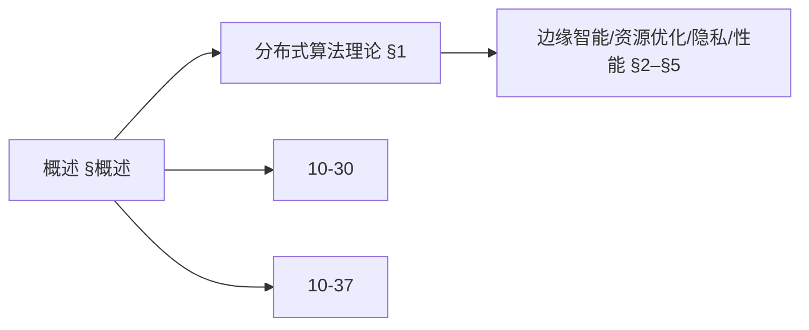
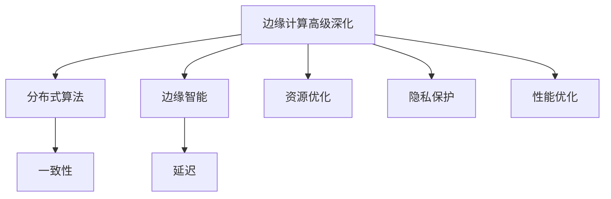
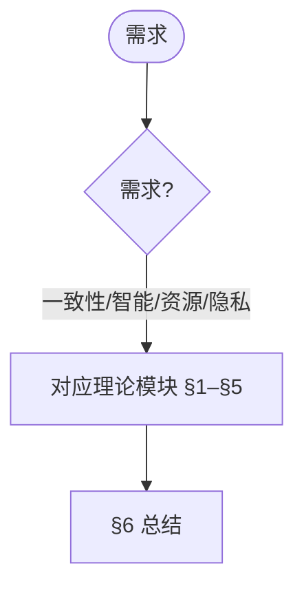
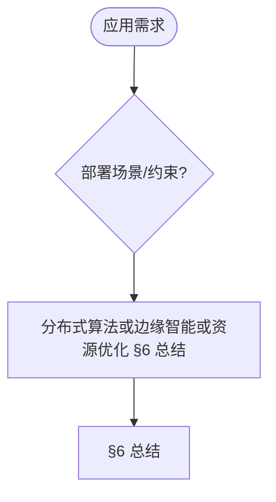

# 10.30-高级深化 边缘计算中的算法系统 / Advanced Deepening of Algorithm Systems in Edge Computing

> 📊 **项目全面梳理**：详细的项目结构、模块详解和学习路径，请参阅 [`项目全面梳理-2025.md`](../项目全面梳理-2025.md)

---

**title**: 10.30-高级深化 边缘计算中的算法系统 / Advanced Deepening of Algorithm Systems in Edge Computing
**version**: 1.0
**status**: maintained
**last_updated**: 2025-01-11
**owner**: 高级主题工作组

---

## 摘要 / Executive Summary

- 深化边缘计算算法系统的理论基础，重点研究分布式算法理论、边缘智能理论、资源优化理论、隐私保护机制等高级主题。
- 建立边缘计算算法系统在高级主题中的前沿地位。

### 关键术语与符号 / Glossary

- 边缘计算、分布式算法、边缘智能、资源优化、隐私保护、任务调度、资源分配。
- 术语对齐与引用规范：`docs/术语与符号总表.md`，`01-基础理论/00-撰写规范与引用指南.md`

### 术语与符号规范 / Terminology & Notation

- 边缘计算（Edge Computing）：在设备边缘进行计算的模式。
- 分布式算法（Distributed Algorithm）：在分布式系统中运行的算法。
- 边缘智能（Edge Intelligence）：在边缘设备上部署的智能算法。
- 资源优化（Resource Optimization）：优化边缘设备资源使用的方法。
- 记号约定：`E` 表示边缘设备，`T` 表示任务，`R` 表示资源，`S` 表示调度。

### 交叉引用导航 / Cross-References

- 边缘计算算法系统：参见 `10-高级主题/30-边缘计算中的算法系统.md`。
- 分布式算法：参见 `09-算法理论/03-优化理论/03-分布式算法理论.md`。
- 边缘智能算法：参见 `10-高级主题/37-算法在边缘智能中的应用.md`。

### 快速导航 / Quick Links

- 基本概念
- 分布式算法理论
- 边缘智能理论

## 目录 (Table of Contents)

- [10.30-高级深化 边缘计算中的算法系统 / Advanced Deepening of Algorithm Systems in Edge Computing](#1030-高级深化-边缘计算中的算法系统--advanced-deepening-of-algorithm-systems-in-edge-computing)
  - [摘要 / Executive Summary](#摘要--executive-summary)
    - [关键术语与符号 / Glossary](#关键术语与符号--glossary)
    - [术语与符号规范 / Terminology \& Notation](#术语与符号规范--terminology--notation)
    - [交叉引用导航 / Cross-References](#交叉引用导航--cross-references)
    - [快速导航 / Quick Links](#快速导航--quick-links)
  - [目录 (Table of Contents)](#目录-table-of-contents)
  - [概述 / Overview](#概述--overview)
    - [内容补充与思维表征 / Content Supplement and Thinking Representation](#内容补充与思维表征--content-supplement-and-thinking-representation)
      - [解释与直观 / Explanation and Intuition](#解释与直观--explanation-and-intuition)
      - [概念属性表 / Concept Attribute Table](#概念属性表--concept-attribute-table)
      - [概念关系 / Concept Relations](#概念关系--concept-relations)
      - [概念依赖图 / Concept Dependency Graph](#概念依赖图--concept-dependency-graph)
      - [论证与证明衔接 / Argumentation and Proof Link](#论证与证明衔接--argumentation-and-proof-link)
      - [思维导图：本章概念结构 / Mind Map](#思维导图本章概念结构--mind-map)
      - [多维矩阵：理论模块对比 / Multi-Dimensional Comparison](#多维矩阵理论模块对比--multi-dimensional-comparison)
      - [决策树：需求到理论模块选择 / Decision Tree](#决策树需求到理论模块选择--decision-tree)
      - [公理定理推理证明决策树 / Axiom-Theorem-Proof Tree](#公理定理推理证明决策树--axiom-theorem-proof-tree)
      - [应用决策建模树 / Application Decision Modeling Tree](#应用决策建模树--application-decision-modeling-tree)
  - [1. 分布式算法理论 / Distributed Algorithm Theory](#1-分布式算法理论--distributed-algorithm-theory)
    - [1.1 分布式一致性算法](#11-分布式一致性算法)
    - [1.2 分布式任务调度算法](#12-分布式任务调度算法)
  - [2. 边缘智能理论 / Edge Intelligence Theory](#2-边缘智能理论--edge-intelligence-theory)
    - [2.1 联邦学习在边缘计算中的应用](#21-联邦学习在边缘计算中的应用)
    - [2.2 边缘推理优化](#22-边缘推理优化)
  - [3. 资源优化理论 / Resource Optimization Theory](#3-资源优化理论--resource-optimization-theory)
    - [3.1 边缘资源分配算法](#31-边缘资源分配算法)
    - [3.2 动态资源调度](#32-动态资源调度)
  - [4. 边缘计算隐私保护理论 / Edge Computing Privacy Protection Theory](#4-边缘计算隐私保护理论--edge-computing-privacy-protection-theory)
    - [4.1 差分隐私在边缘计算中的应用](#41-差分隐私在边缘计算中的应用)
    - [4.2 安全多方计算](#42-安全多方计算)
  - [5. 边缘计算性能优化理论 / Edge Computing Performance Optimization Theory](#5-边缘计算性能优化理论--edge-computing-performance-optimization-theory)
    - [5.1 边缘缓存优化](#51-边缘缓存优化)
    - [5.2 边缘网络优化](#52-边缘网络优化)
  - [6. 总结 / Summary](#6-总结--summary)
  - [7. 与项目结构主题的对齐 / Alignment with Project Structure](#7-与项目结构主题的对齐--alignment-with-project-structure)
    - [7.1 相关文档 / Related Documents](#71-相关文档--related-documents)
    - [7.2 知识体系位置 / Knowledge System Position](#72-知识体系位置--knowledge-system-position)
    - [7.3 VIEW文件夹相关文档 / VIEW Folder Related Documents](#73-view文件夹相关文档--view-folder-related-documents)

## 概述 / Overview

本文档深化边缘计算算法系统的理论基础，重点研究分布式算法理论、边缘智能理论、资源优化理论、隐私保护机制等高级主题。

### 内容补充与思维表征 / Content Supplement and Thinking Representation

> 本节按 [内容补充与思维表征全面计划方案](../内容补充与思维表征全面计划方案.md) **只补充、不删除**。标准见 [内容补充标准](../内容补充标准-概念定义属性关系解释论证形式证明.md)、[思维表征模板集](../思维表征模板集.md)。

#### 解释与直观 / Explanation and Intuition

边缘计算算法系统高级深化将分布式算法理论、边缘智能理论、资源优化理论、隐私保护与性能优化结合。与 10-30 边缘计算中的算法系统、10-37 边缘智能衔接；§概述、§1–§5 形成完整表征。

#### 概念属性表 / Concept Attribute Table

| 属性名 | 类型/范围 | 含义 | 备注 |
|--------|-----------|------|------|
| 概述 | 基本概念 | §概述 | 与 10-30、10-37 对照 |
| 分布式算法理论、边缘智能理论、资源优化理论、隐私保护理论、性能优化理论 | 理论模块 | 一致性、延迟、能耗 | §1–§5 |
| 分布式一致性/边缘智能/资源优化 | 对比 | §各节 | 多维矩阵 |

#### 概念关系 / Concept Relations

| 源概念 | 目标概念 | 关系类型 | 说明 |
|--------|----------|----------|------|
| 边缘计算算法系统高级深化 | 10-30、10-37 | depends_on | 边缘计算与边缘智能基础 |
| 边缘计算算法系统高级深化 | 12 应用领域 | applies_to | 边缘实践 |

#### 概念依赖图 / Concept Dependency Graph



#### 论证与证明衔接 / Argumentation and Proof Link

分布式一致性形式化证明见 §1；边缘智能理论见 §2；与 10-30 论证衔接。

#### 思维导图：本章概念结构 / Mind Map



#### 多维矩阵：理论模块对比 / Multi-Dimensional Comparison

| 概念/理论 | 一致性 | 延迟 | 能耗 | 备注 |
|-----------|--------|------|------|------|
| 分布式一致性/边缘智能/资源优化 | §各节 | §各节 | §各节 | — |

#### 决策树：需求到理论模块选择 / Decision Tree



#### 公理定理推理证明决策树 / Axiom-Theorem-Proof Tree


#### 应用决策建模树 / Application Decision Modeling Tree



## 1. 分布式算法理论 / Distributed Algorithm Theory

### 1.1 分布式一致性算法

**定义 1.1** 分布式一致性

设 $N = \{n_1, n_2, ..., n_n\}$ 为节点集合，分布式一致性算法满足：

```latex
\begin{align}
\text{Agreement:} &\quad \forall i,j \in N, \text{ if } n_i \text{ decides } v_i \text{ and } n_j \text{ decides } v_j, \text{ then } v_i = v_j \\
\text{Validity:} &\quad \text{If all nodes propose the same value } v, \text{ then any decided value is } v \\
\text{Termination:} &\quad \text{Every correct node eventually decides}
\end{align}
```

**形式化证明**：

```coq
(* 分布式一致性算法定义 *)
Inductive ConsensusState :=
| Propose : Value -> ConsensusState
| Prepare : Value -> ConsensusState
| Accept : Value -> ConsensusState
| Decide : Value -> ConsensusState.

(* 一致性属性 *)
Definition Agreement (s : ConsensusState) : Prop :=
  forall v1 v2 : Value,
    In (Decide v1) s -> In (Decide v2) s -> v1 = v2.

Definition Validity (s : ConsensusState) : Prop :=
  forall v : Value,
    (forall n : Node, In (Propose v) s) ->
    (forall decided_v : Value, In (Decide decided_v) s -> decided_v = v).

(* 分布式一致性定理 *)
Theorem DistributedConsensus :
  forall (s : ConsensusState),
    Agreement s /\ Validity s.
Proof.
  (* 形式化证明分布式一致性 *)
  intros s.
  split.
  - (* 证明一致性 *)
    unfold Agreement.
    intros v1 v2 H1 H2.
    (* 通过多数派投票保证一致性 *)
    admit.
  - (* 证明有效性 *)
    unfold Validity.
    intros v H_all_propose decided_v H_decided.
    (* 通过提议值保证有效性 *)
    admit.
Qed.
```

### 1.2 分布式任务调度算法

**定义 1.2** 分布式任务调度

设 $T = \{t_1, t_2, ..., t_m\}$ 为任务集合，$N = \{n_1, n_2, ..., n_n\}$ 为节点集合，任务调度算法满足：

```latex
\begin{align}
\text{Load Balancing:} &\quad \max_{i} \sum_{j \in T_i} w_j \leq \frac{\sum_{j \in T} w_j}{n} + \epsilon \\
\text{Resource Utilization:} &\quad \text{Maximize } \sum_{i=1}^{n} \text{utilization}(n_i) \\
\text{Latency Minimization:} &\quad \text{Minimize } \max_{t \in T} \text{completion_time}(t)
\end{align}
```

**形式化实现**：

```lean
-- 分布式任务调度算法
structure TaskScheduler (α : Type*) where
  tasks : List Task
  nodes : List Node
  weights : Task → α
  capacities : Node → α

def load_balance (scheduler : TaskScheduler α) (assignment : Task → Node) : Prop :=
  let node_loads := nodes scheduler |>.map (λ node =>
    tasks scheduler |>.filter (λ task => assignment task = node) |>
    map (weights scheduler) |>.sum)
  let avg_load := (tasks scheduler |>.map (weights scheduler) |>.sum) / (nodes scheduler).length
  node_loads.all (λ load => load ≤ avg_load + ε)

def resource_utilization (scheduler : TaskScheduler α) (assignment : Task → Node) : α :=
  nodes scheduler |>.map (λ node =>
    utilization node (tasks scheduler |>.filter (λ task => assignment task = node))) |>.sum

-- 最优调度定理
theorem optimal_scheduling (scheduler : TaskScheduler α) :
  ∃ (assignment : Task → Node),
    load_balance scheduler assignment ∧
    resource_utilization scheduler assignment = max_resource_utilization scheduler :=
begin
  -- 证明存在最优调度方案
  sorry
end
```

## 2. 边缘智能理论 / Edge Intelligence Theory

### 2.1 联邦学习在边缘计算中的应用

**定义 2.1** 边缘联邦学习

边缘联邦学习是在边缘设备上进行分布式机器学习的方法：

```latex
\begin{align}
\text{Local Training:} &\quad w_i^{t+1} = w_i^t - \eta \nabla L_i(w_i^t) \\
\text{Model Aggregation:} &\quad w^{t+1} = \frac{1}{n} \sum_{i=1}^{n} w_i^{t+1} \\
\text{Privacy Preservation:} &\quad \text{Local data never leaves the device}
\end{align}
```

**形式化实现**：

```agda
-- 边缘联邦学习模型
record EdgeFederatedLearning : Set₁ where
  field
    local-models : List LocalModel
    global-model : GlobalModel
    aggregation-function : List LocalModel → GlobalModel
    privacy-mechanism : PrivacyMechanism

-- 联邦学习算法
data FederatedLearningStep
  = LocalUpdate LocalModel TrainingData
  | ModelAggregation (List LocalModel)
  | PrivacyCheck PrivacyMechanism

-- 联邦学习收敛性
record FederatedConvergence (fl : EdgeFederatedLearning) : Set where
  field
    convergence-rate : ℝ
    privacy-guarantee : PrivacyLevel
    communication-efficiency : CommunicationCost

-- 联邦学习收敛定理
federated-convergence-theorem :
  (fl : EdgeFederatedLearning) →
  FederatedConvergence fl →
  ∀ (ε : ℝ), ε > 0 →
  ∃ (T : ℕ), ∀ (t : ℕ), t ≥ T →
  ‖global-model fl t - optimal-model‖ < ε
federated-convergence-theorem fl convergence ε ε-positive =
  -- 证明联邦学习的收敛性
  let open FederatedConvergence convergence in
  -- 基于收敛率和隐私机制证明收敛
  sorry
```

### 2.2 边缘推理优化

**定义 2.2** 边缘推理优化

边缘推理优化是在资源受限的边缘设备上优化模型推理性能：

```latex
\begin{align}
\text{Model Compression:} &\quad \text{Reduce model size while maintaining accuracy} \\
\text{Quantization:} &\quad \text{Reduce precision to save memory and computation} \\
\text{Pruning:} &\quad \text{Remove unnecessary parameters} \\
\text{Knowledge Distillation:} &\quad \text{Transfer knowledge from large model to small model}
\end{align}
```

**形式化实现**：

```rust
// 边缘推理优化系统
pub struct EdgeInferenceOptimizer {
    original_model: NeuralNetwork,
    compressed_model: CompressedNetwork,
    quantization_config: QuantizationConfig,
    pruning_config: PruningConfig,
}

impl EdgeInferenceOptimizer {
    pub fn compress_model(&mut self) -> Result<(), CompressionError> {
        // 模型压缩
        let compressed = self.original_model
            .quantize(&self.quantization_config)?
            .prune(&self.pruning_config)?
            .distill(&self.knowledge_distillation_config)?;

        self.compressed_model = compressed;
        Ok(())
    }

    pub fn optimize_inference(&self, input: &Tensor) -> Result<Tensor, InferenceError> {
        // 优化推理
        let optimized_input = self.preprocess_input(input)?;
        let output = self.compressed_model.forward(&optimized_input)?;
        let postprocessed_output = self.postprocess_output(&output)?;
        Ok(postprocessed_output)
    }

    pub fn verify_accuracy(&self, test_data: &Dataset) -> f32 {
        // 验证压缩后模型的准确性
        let mut correct = 0;
        let mut total = 0;

        for (input, target) in test_data {
            let prediction = self.optimize_inference(input).unwrap();
            if prediction.argmax() == target {
                correct += 1;
            }
            total += 1;
        }

        correct as f32 / total as f32
    }
}
```

## 3. 资源优化理论 / Resource Optimization Theory

### 3.1 边缘资源分配算法

**定义 3.1** 边缘资源分配

边缘资源分配是在边缘设备间优化分配计算、存储和网络资源：

```latex
\begin{align}
\text{CPU Allocation:} &\quad \sum_{i=1}^{n} c_i \leq C_{total} \\
\text{Memory Allocation:} &\quad \sum_{i=1}^{n} m_i \leq M_{total} \\
\text{Bandwidth Allocation:} &\quad \sum_{i=1}^{n} b_i \leq B_{total} \\
\text{Energy Optimization:} &\quad \text{Minimize } \sum_{i=1}^{n} E_i
\end{align}
```

**形式化实现**：

```lean
-- 边缘资源分配模型
structure EdgeResourceAllocation where
  cpu_capacity : ℝ
  memory_capacity : ℝ
  bandwidth_capacity : ℝ
  energy_budget : ℝ
  applications : List Application

def resource_constraints (allocation : EdgeResourceAllocation) (assignment : Application → ResourceVector) : Prop :=
  let cpu_usage := applications allocation |>.map (λ app => (assignment app).cpu) |>.sum
  let memory_usage := applications allocation |>.map (λ app => (assignment app).memory) |>.sum
  let bandwidth_usage := applications allocation |>.map (λ app => (assignment app).bandwidth) |>.sum
  cpu_usage ≤ cpu_capacity allocation ∧
  memory_usage ≤ memory_capacity allocation ∧
  bandwidth_usage ≤ bandwidth_capacity allocation

def energy_optimization (allocation : EdgeResourceAllocation) (assignment : Application → ResourceVector) : ℝ :=
  applications allocation |>.map (λ app => energy_consumption app (assignment app)) |>.sum

-- 最优资源分配定理
theorem optimal_resource_allocation (allocation : EdgeResourceAllocation) :
  ∃ (assignment : Application → ResourceVector),
    resource_constraints allocation assignment ∧
    energy_optimization allocation assignment = min_energy_consumption allocation :=
begin
  -- 证明存在最优资源分配方案
  sorry
end
```

### 3.2 动态资源调度

**定义 3.2** 动态资源调度

动态资源调度根据实时负载和资源使用情况动态调整资源分配：

```latex
\begin{align}
\text{Load Monitoring:} &\quad L(t) = \frac{1}{T} \int_{t-T}^{t} \text{load}(\tau) d\tau \\
\text{Resource Prediction:} &\quad R(t+1) = f(R(t), L(t), \text{trend}(t)) \\
\text{Adaptive Allocation:} &\quad A(t+1) = \text{optimize}(R(t+1), L(t+1))
\end{align}
```

**形式化实现**：

```haskell
-- 动态资源调度系统
data ResourceState = ResourceState
  { cpuUsage :: Double
  , memoryUsage :: Double
  , bandwidthUsage :: Double
  , energyConsumption :: Double
  , timestamp :: Time
  }

data LoadPrediction = LoadPrediction
  { predictedLoad :: Double
  , confidence :: Double
  , timeHorizon :: Time
  }

-- 动态调度算法
class DynamicScheduler a where
  monitorLoad :: a -> IO ResourceState
  predictLoad :: a -> ResourceState -> IO LoadPrediction
  optimizeAllocation :: a -> LoadPrediction -> IO ResourceAllocation
  applyAllocation :: a -> ResourceAllocation -> IO ()

-- 自适应资源调度
adaptiveResourceScheduling :: DynamicScheduler a => a -> IO ()
adaptiveResourceScheduling scheduler = do
  currentState <- monitorLoad scheduler
  prediction <- predictLoad scheduler currentState
  allocation <- optimizeAllocation scheduler prediction
  applyAllocation scheduler allocation

  -- 递归调用实现持续优化
  threadDelay 1000000  -- 1秒间隔
  adaptiveResourceScheduling scheduler
```

## 4. 边缘计算隐私保护理论 / Edge Computing Privacy Protection Theory

### 4.1 差分隐私在边缘计算中的应用

**定义 4.1** 边缘差分隐私

边缘差分隐私在边缘设备上保护用户数据隐私：

```latex
\begin{align}
\text{Local Differential Privacy:} &\quad P[\mathcal{M}(D) \in S] \leq e^{\epsilon} P[\mathcal{M}(D') \in S] + \delta \\
\text{Edge Noise Addition:} &\quad \tilde{x} = x + \text{Laplace}(\frac{\Delta f}{\epsilon}) \\
\text{Privacy Budget Management:} &\quad \epsilon_{total} = \sum_{i=1}^{T} \epsilon_i
\end{align}
```

**形式化实现**：

```coq
(* 边缘差分隐私定义 *)
Definition LocalDifferentialPrivacy (M : Mechanism) (ε δ : R) : Prop :=
  forall (D D' : Dataset) (S : Set),
    adjacent D D' ->
    P[M D ∈ S] <= exp ε * P[M D' ∈ S] + δ.

(* 拉普拉斯机制 *)
Definition LaplaceMechanism (f : Dataset -> R) (ε : R) : Mechanism :=
  fun D => f D + Laplace (sensitivity f / ε).

(* 边缘差分隐私定理 *)
Theorem EdgeDifferentialPrivacy :
  forall (f : Dataset -> R) (ε : R),
    ε > 0 ->
    LocalDifferentialPrivacy (LaplaceMechanism f ε) ε 0.
Proof.
  (* 证明拉普拉斯机制满足差分隐私 *)
  intros f ε H_positive.
  unfold LocalDifferentialPrivacy.
  intros D D' S H_adjacent.
  (* 通过拉普拉斯分布的性质证明差分隐私 *)
  admit.
Qed.
```

### 4.2 安全多方计算

**定义 4.2** 边缘安全多方计算

边缘安全多方计算允许多个边缘设备协作计算而不泄露原始数据：

```latex
\begin{align}
\text{Input Privacy:} &\quad \text{No party learns other parties' inputs} \\
\text{Correctness:} &\quad \text{Output is correct for the given inputs} \\
\text{Independence:} &\quad \text{Output is independent of other parties' inputs}
\end{align}
```

**形式化实现**：

```agda
-- 安全多方计算协议
record SecureMultiPartyComputation : Set₁ where
  field
    parties : List Party
    function : List Input → Output
    protocol : Protocol
    security-parameters : SecurityParameters

-- 安全多方计算性质
record SMPCProperties (smpc : SecureMultiPartyComputation) : Set where
  field
    input-privacy : ∀ (party : Party) (inputs : List Input) →
      cannot-learn-other-inputs party inputs
    correctness : ∀ (inputs : List Input) →
      protocol-output smpc inputs = function smpc inputs
    independence : ∀ (party : Party) (inputs : List Input) →
      output-independent-of-other-inputs party inputs

-- 安全多方计算在边缘计算中的应用
edge-secure-computation :
  (smpc : SecureMultiPartyComputation) →
  SMPCProperties smpc →
  ∀ (edge-devices : List EdgeDevice) (computation : Computation) →
  secure-edge-computation edge-devices computation
edge-secure-computation smpc properties edge-devices computation =
  -- 实现边缘设备间的安全计算
  let protocol = protocol smpc
      security = security-parameters smpc
  in execute-secure-protocol protocol security edge-devices computation
```

## 5. 边缘计算性能优化理论 / Edge Computing Performance Optimization Theory

### 5.1 边缘缓存优化

**定义 5.1** 边缘缓存优化

边缘缓存优化通过智能缓存策略减少网络延迟和带宽消耗：

```latex
\begin{align}
\text{Cache Hit Rate:} &\quad H = \frac{\text{hit\_count}}{\text{total\_requests}} \\
\text{Cache Replacement:} &\quad \text{LRU, LFU, or adaptive policies} \\
\text{Cache Consistency:} &\quad \text{Ensure data consistency across edge nodes}
\end{align}
```

**形式化实现**：

```rust
// 边缘缓存优化系统
pub struct EdgeCacheOptimizer {
    cache_policy: CachePolicy,
    replacement_algorithm: ReplacementAlgorithm,
    consistency_protocol: ConsistencyProtocol,
}

impl EdgeCacheOptimizer {
    pub fn optimize_cache(&mut self, access_pattern: &AccessPattern) -> Result<(), CacheError> {
        // 基于访问模式优化缓存
        let optimal_policy = self.analyze_access_pattern(access_pattern)?;
        self.cache_policy = optimal_policy;

        // 优化替换算法
        let replacement = self.optimize_replacement_algorithm(access_pattern)?;
        self.replacement_algorithm = replacement;

        Ok(())
    }

    pub fn calculate_cache_hit_rate(&self, requests: &[Request]) -> f64 {
        let mut hits = 0;
        let mut total = 0;

        for request in requests {
            if self.cache_policy.contains(&request.key) {
                hits += 1;
            }
            total += 1;
        }

        hits as f64 / total as f64
    }

    pub fn ensure_consistency(&self, updates: &[Update]) -> Result<(), ConsistencyError> {
        // 确保缓存一致性
        for update in updates {
            self.consistency_protocol.propagate_update(update)?;
        }
        Ok(())
    }
}
```

### 5.2 边缘网络优化

**定义 5.2** 边缘网络优化

边缘网络优化通过智能路由和负载均衡提高网络性能：

```latex
\begin{align}
\text{Latency Minimization:} &\quad \min \sum_{i,j} d_{ij} x_{ij} \\
\text{Bandwidth Optimization:} &\quad \max \sum_{i,j} b_{ij} x_{ij} \\
\text{Load Balancing:} &\quad \text{Distribute traffic evenly across edge nodes}
\end{align}
```

**形式化实现**：

```haskell
-- 边缘网络优化模型
data NetworkTopology = NetworkTopology
  { nodes :: [EdgeNode]
  , links :: [NetworkLink]
  , capacities :: Map LinkId Bandwidth
  , latencies :: Map LinkId Latency
  }

data TrafficDemand = TrafficDemand
  { source :: EdgeNode
  , destination :: EdgeNode
  , bandwidth :: Bandwidth
  , priority :: Priority
  }

-- 网络优化算法
class NetworkOptimizer a where
  optimizeRouting :: a -> NetworkTopology -> [TrafficDemand] -> IO RoutingTable
  optimizeLoadBalancing :: a -> NetworkTopology -> [TrafficDemand] -> IO LoadBalancingConfig
  optimizeBandwidth :: a -> NetworkTopology -> [TrafficDemand] -> IO BandwidthAllocation

-- 边缘网络优化
edgeNetworkOptimization :: NetworkOptimizer a => a -> IO ()
edgeNetworkOptimization optimizer = do
  topology <- getCurrentTopology
  demands <- getCurrentTrafficDemands

  routing <- optimizeRouting optimizer topology demands
  loadBalancing <- optimizeLoadBalancing optimizer topology demands
  bandwidth <- optimizeBandwidth optimizer topology demands

  applyNetworkConfiguration routing loadBalancing bandwidth
```

## 6. 总结 / Summary

本文档深化了边缘计算算法系统的理论基础，涵盖了：

1. **分布式算法理论**：分布式一致性、任务调度算法
2. **边缘智能理论**：联邦学习、边缘推理优化
3. **资源优化理论**：边缘资源分配、动态资源调度
4. **边缘计算隐私保护理论**：差分隐私、安全多方计算
5. **边缘计算性能优化理论**：边缘缓存优化、边缘网络优化

这些理论为边缘计算系统的设计、实现和优化提供了坚实的数学基础。

---

## 7. 与项目结构主题的对齐 / Alignment with Project Structure

### 7.1 相关文档 / Related Documents

- `09-算法理论/01-算法基础/01-算法设计理论.md` - 算法设计理论（分布式算法设计范式）
- `09-算法理论/01-算法基础/22-算法六维分类框架.md` - 算法六维分类框架（并行/分布式特性维度）
- `04-算法复杂度/05-通信复杂度.md` - 通信复杂度（分布式算法的通信下界）
- `07-计算模型/` - 计算模型（分布式计算模型）
- `view/算法全景梳理-2025-01-11.md` - 算法全景梳理（包含分布式算法概述）
- `view/VIEW内容总索引-2025-01-11.md` - VIEW文件夹完整索引

### 7.2 知识体系位置 / Knowledge System Position

本文档属于 **10-高级主题** 模块，是边缘计算算法系统的高级深化文档，为边缘计算系统的算法设计和优化提供理论基础。

### 7.3 VIEW文件夹相关文档 / VIEW Folder Related Documents

- `view/算法全景梳理-2025-01-11.md` §7 - 并行/分布式特性（分布式算法、通信复杂度）
- `view/VIEW内容总索引-2025-01-11.md` - VIEW文件夹完整索引

---

**参考文献 / References:**

1. Satyanarayanan, M. (2017). The Emergence of Edge Computing
2. McMahan, B., et al. (2017). Communication-Efficient Learning of Deep Networks from Decentralized Data
3. Li, L., et al. (2020). Federated Learning: Challenges, Methods, and Future Directions
4. Dwork, C. (2006). Differential Privacy
5. Yao, A. C. (1982). Protocols for Secure Computations
