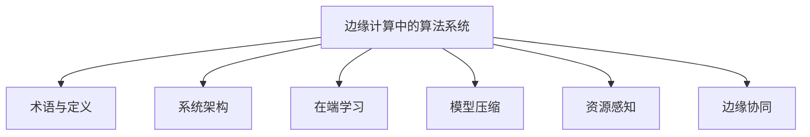
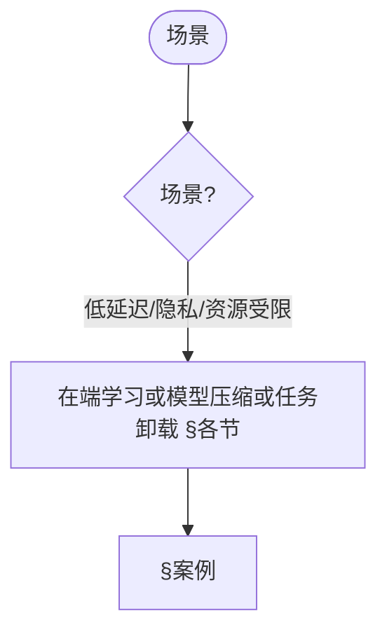
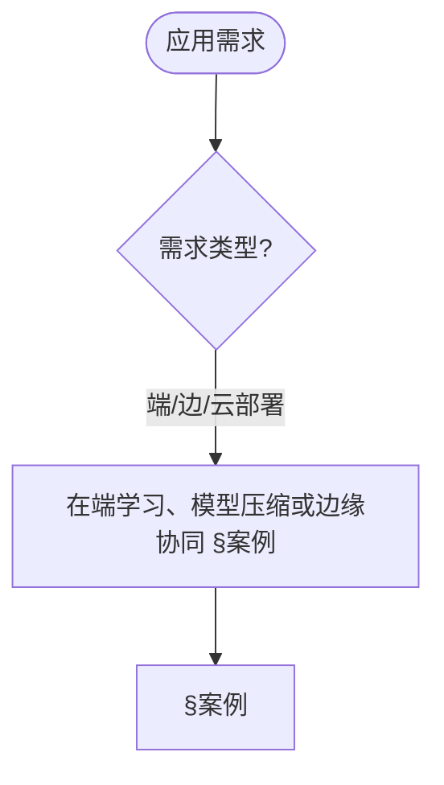
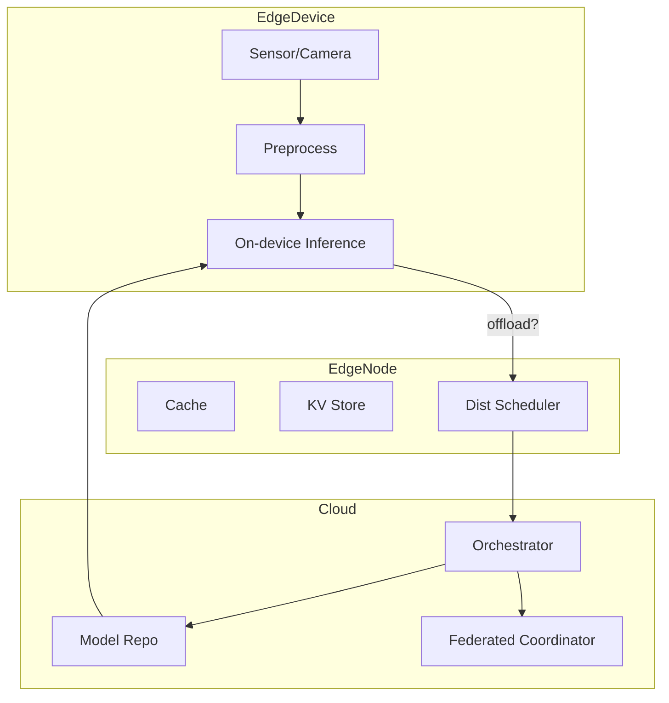

> 📊 **项目全面梳理**：详细的项目结构、模块详解和学习路径，请参阅 [`项目全面梳理-2025.md`](../项目全面梳理-2025.md)

## 10.30 边缘计算中的算法系统 / Algorithm Systems in Edge Computing

> 说明：本文档中的代码/伪代码为说明性片段，仅用于理论阐释；本仓库不提供可运行工程或 CI。

### 摘要 / Executive Summary

- 统一边缘计算中的算法系统，研究如何在资源受限的边缘设备上部署智能算法。
- 建立边缘计算算法系统在高级主题中的核心地位。

### 关键术语与符号 / Glossary

- 边缘计算、边缘设备、资源约束、任务调度、资源分配、边缘-云协同、隐私保护。
- 术语对齐与引用规范：`docs/术语与符号总表.md`，`01-基础理论/00-撰写规范与引用指南.md`

### 术语与符号规范 / Terminology & Notation

- 边缘计算（Edge Computing）：在设备边缘进行计算的模式。
- 边缘设备（Edge Device）：部署在边缘的计算设备。
- 资源约束（Resource Constraint）：边缘设备的资源限制。
- 任务调度（Task Scheduling）：在边缘设备上调度任务的方法。
- 记号约定：`E` 表示边缘设备，`T` 表示任务，`R` 表示资源，`S` 表示调度。

### 交叉引用导航 / Cross-References

- 物联网算法：参见 `12-应用领域/07-物联网算法应用.md`。
- 分布式算法：参见 `09-算法理论/03-优化理论/03-分布式算法理论.md`。
- 在线算法：参见 `09-算法理论/01-算法基础/13-在线算法理论.md`。
- 项目导航与对标：见 [项目全面梳理-2025](../项目全面梳理-2025.md)、[项目扩展与持续推进任务编排](../项目扩展与持续推进任务编排.md)、[国际课程对标表](../国际课程对标表.md)。

### 快速导航 / Quick Links

- 基本概念
- 任务调度
- 资源分配

## 目录 (Table of Contents)

- [10.30 边缘计算中的算法系统 / Algorithm Systems in Edge Computing](#1030-边缘计算中的算法系统--algorithm-systems-in-edge-computing)

## 概述 / Overview

边缘计算中的算法系统研究如何在资源受限的边缘设备上部署智能算法，实现低延迟、高可靠、隐私保护的分布式智能计算。

## 学习目标 / Learning Objectives

1. **基础级** 理解边缘计算架构与资源约束下的算法设计
2. **进阶级** 掌握任务调度与资源分配算法
3. **进阶级** 能够设计边缘-云协同的算法框架
4. **高级级** 了解边缘计算中的隐私保护与安全机制
5. **高级级** 掌握边缘智能在物联网与实时系统中的应用

## 术语与定义

| 术语 | 英文 | 定义 |
|------|------|------|
| 边缘计算 | Edge Computing | 在数据源附近进行数据处理和计算的计算模式 |
| 端设备 | Edge Device | 位于网络边缘的计算设备，如传感器、摄像头等 |
| 边缘节点 | Edge Node | 位于边缘网络中的计算节点，提供本地处理能力 |
| 在端学习 | On-device Learning | 在边缘设备上进行模型训练和更新的过程 |
| 模型压缩 | Model Compression | 减少模型大小和计算复杂度的技术 |
| 任务卸载 | Task Offloading | 将计算任务从边缘设备转移到云端的过程 |
| 资源感知 | Resource Awareness | 算法对计算资源状态的感知和适应能力 |
| 自适应推理 | Adaptive Inference | 根据资源约束动态调整推理策略的方法 |
| 边缘协同 | Edge Collaboration | 多个边缘节点之间的协作和资源共享 |
| 时延敏感 | Latency Sensitive | 对响应时间有严格要求的应用场景 |

### 内容补充与思维表征 / Content Supplement and Thinking Representation

> 本节按 [内容补充与思维表征全面计划方案](../内容补充与思维表征全面计划方案.md) **只补充、不删除**。标准见 [内容补充标准](../内容补充标准-概念定义属性关系解释论证形式证明.md)、[思维表征模板集](../思维表征模板集.md)。

#### 解释与直观 / Explanation and Intuition

边缘计算中的算法系统将术语与定义与系统架构、在端学习、模型压缩与分发、资源感知与边缘协同结合。与 10-30 高级深化、10-37 边缘智能衔接；§术语与定义、§系统架构、各节形成完整表征。

#### 概念属性表 / Concept Attribute Table

| 属性名 | 类型/范围 | 含义 | 备注 |
|--------|-----------|------|------|
| 术语与定义 | 基本概念 | §术语与定义 | 与 10-37 对照 |
| 系统架构、在端学习、模型压缩与分发、资源感知与鲁棒性、边缘协同与调度 | 架构/算法 | 延迟、带宽、隐私 | §各节 |
| 在端学习/模型压缩/资源感知 | 对比 | §各节 | 多维矩阵 |

#### 概念关系 / Concept Relations

| 源概念 | 目标概念 | 关系类型 | 说明 |
|--------|----------|----------|------|
| 边缘计算中的算法系统 | 10-30 高级深化、10-37 | depends_on | 边缘深化与智能衔接 |
| 边缘计算中的算法系统 | 12 应用领域 | applies_to | 边缘实践 |

#### 概念依赖图 / Concept Dependency Graph


#### 论证与证明衔接 / Argumentation and Proof Link

任务调度正确性见 §系统架构；在端学习收敛性见 §在端学习；与 10-37 论证衔接。

#### 思维导图：本章概念结构 / Mind Map



#### 多维矩阵：边缘算法对比 / Multi-Dimensional Comparison

| 概念/技术 | 延迟 | 带宽 | 隐私 | 备注 |
|-----------|------|------|------|------|
| 在端学习/模型压缩/资源感知 | §各节 | §各节 | §各节 | — |

#### 决策树：场景到技术选择 / Decision Tree



#### 公理定理推理证明决策树 / Axiom-Theorem-Proof Tree


#### 应用决策建模树 / Application Decision Modeling Tree



## 系统架构

- 层次: 端设备(Edge Device) — 边缘节点(Edge Node) — 区域汇聚(Aggregator) — 云(Cloud)
- 数据流: 采集→预处理→本地推理/训练→协作同步→聚合

```rust
// 任务抽象与调度
pub struct EdgeTask { id: String, deadline_ms: u64, size_bytes: u64, priority: u8, model_id: String }

pub trait EdgeScheduler { fn schedule(&self, tasks: &[EdgeTask], resources: &EdgeResources) -> SchedulePlan }

pub struct EDFScheduler;
impl EdgeScheduler for EDFScheduler { fn schedule(&self, tasks: &[EdgeTask], _r: &EdgeResources) -> SchedulePlan { /* earliest-deadline-first */ SchedulePlan::new(tasks) } }
```

## 在端学习 (On-device / On-edge Learning)

- 增量/在线学习、蒸馏学习、少样本微调
- 联邦学习在边缘的资源约束：算力、能耗、网络

```rust
pub struct EdgeLearner { optimizer: EdgeOptimizer, budget: EnergyBudget }
impl EdgeLearner { pub fn train_step(&mut self, batch: &MiniBatch) -> TrainStat { /* 预算约束下梯度步 */ TrainStat::default() } }
```

## 模型压缩与分发

- 量化(PTQ/QAT)、剪枝、蒸馏、结构重参数化
- 分发: 切片分发、差分更新、分阶段灰度

```rust
pub struct ModelDistributor { delta_encoder: DeltaEncoder, rollout: RolloutStrategy }
impl ModelDistributor { pub fn rollout(&self, model: &EdgeModel, fleet: &[Device]) -> RolloutPlan { /* 分层灰度 */ RolloutPlan::new() } }
```

## 资源感知与鲁棒性

- 资源监控: CPU/GPU、内存、功耗、网络
- 自适应推理: 动态深度、早退出、多分辨率
- 鲁棒性: 噪声/抖动、丢包、断连、设备漂移

```rust
pub struct AdaptiveInference { policies: Vec<Policy> }
impl AdaptiveInference { pub fn infer(&self, x: &Tensor, budget: &LatencyBudget) -> Output { /* 早停/多分辨率 */ Output::default() } }
```

## 边缘协同与调度

- 边-边协同: 邻域互助、分布式缓存、任务迁移
- 边-云协同: 云控编排、函数卸载、弹性伸缩

```rust
pub struct OffloadOrchestrator { estimator: OffloadEstimator }
impl OffloadOrchestrator { pub fn decide(&self, task: &EdgeTask, ctx: &Context) -> OffloadPlan { /* 估计端到端时延与能耗 */ OffloadPlan::local() } }
```

## 度量与SLA

- 关键指标: 端到端时延、任务完成率、能耗/每瓦性能、可用性、鲁棒性指数
- SLA合约: 违约检测、弹性重试、补偿策略

## 数学与优化

- 任务调度: \( \min \sum_i w_i T_i \) s.t. 资源与时限约束
- 卸载决策: \( \min E[latency+energy] \) over partition/placement
- 压缩-精度权衡: \( \max Acc(q,p) - \lambda C(q,p) \)

## 实现蓝图

- 端侧: TFLite/ONNX Runtime/TVM + 简化调度器
- 节点: 部署缓存、滚动升级、遥测
- 云侧: 编排器(K8s)、联邦协调器、监控看板

## 案例

- 视频分析: 分辨率自适应+早退出
- 工业视觉: 断连鲁棒推理与本地重试
- 车路协同: 低时延路径规划与卸载

## 总结

边缘算法系统需在严格约束下实现“够用的智能”，通过调度、压缩、协同与自适应，提高时延敏感与隐私敏感场景的可用性与可靠性。

## 架构图（Mermaid）



## 交叉链接

- 参见 `27-算法联邦学习与隐私保护理论.md`
- 参见 `30-算法鲁棒性与对抗性防御理论.md`
- 参见 `25-算法可解释性与透明度理论.md`

## 相关文档（交叉链接）

- `10-高级主题/27-算法联邦学习与隐私保护理论.md`
- `10-高级主题/26-算法鲁棒性与对抗性防御理论.md`
- `09-算法理论/03-优化理论/02-并行算法理论.md`

## 参考文献（示例）

1. Satyanarayanan, M. The Emergence of Edge Computing. Computer, 2017.
2. Mao, Y. et al. A Survey on Mobile Edge Computing: The Communication Perspective. IEEE Communications Surveys & Tutorials, 2017.
3. Li, E. et al. Learning and Inferencing on the Edge: A Survey. Proceedings of the IEEE, 2018.

## 可运行Rust示例骨架

```rust
use std::collections::HashMap;
use std::time::{Duration, Instant};
use tokio::time::sleep;

// 边缘任务
#[derive(Clone, Debug)]
pub struct EdgeTask {
    pub id: String,
    pub deadline_ms: u64,
    pub size_bytes: u64,
    pub priority: u8,
    pub model_id: String,
    pub task_type: TaskType,
}

#[derive(Clone, Debug)]
pub enum TaskType {
    Inference,
    Training,
    Compression,
    Offload,
}

// 边缘资源
#[derive(Clone, Debug)]
pub struct EdgeResources {
    pub cpu_cores: u32,
    pub memory_mb: u64,
    pub storage_gb: u64,
    pub bandwidth_mbps: u64,
    pub battery_level: f64,
}

// 边缘调度器
pub trait EdgeScheduler {
    fn schedule(&self, tasks: &[EdgeTask], resources: &EdgeResources) -> SchedulePlan;
}

pub struct EDFScheduler;

impl EdgeScheduler for EDFScheduler {
    fn schedule(&self, tasks: &[EdgeTask], _resources: &EdgeResources) -> SchedulePlan {
        let mut sorted_tasks = tasks.to_vec();
        sorted_tasks.sort_by_key(|task| task.deadline_ms);

        SchedulePlan {
            tasks: sorted_tasks,
            estimated_completion_time: Instant::now(),
        }
    }
}

pub struct PriorityScheduler;

impl EdgeScheduler for PriorityScheduler {
    fn schedule(&self, tasks: &[EdgeTask], _resources: &EdgeResources) -> SchedulePlan {
        let mut sorted_tasks = tasks.to_vec();
        sorted_tasks.sort_by_key(|task| std::cmp::Reverse(task.priority));

        SchedulePlan {
            tasks: sorted_tasks,
            estimated_completion_time: Instant::now(),
        }
    }
}

// 边缘学习器
pub struct EdgeLearner {
    pub optimizer: EdgeOptimizer,
    pub budget: EnergyBudget,
    pub local_data: LocalDataset,
}

impl EdgeLearner {
    pub fn new(optimizer: EdgeOptimizer, budget: EnergyBudget) -> Self {
        Self {
            optimizer,
            budget,
            local_data: LocalDataset::new(),
        }
    }

    pub async fn train_step(&mut self, batch: &MiniBatch) -> Result<TrainStat, TrainingError> {
        if !self.budget.can_afford_training() {
            return Err(TrainingError::InsufficientBudget);
        }

        let start_time = Instant::now();
        let gradients = self.compute_gradients(batch);

        // 应用差分隐私
        let noisy_gradients = self.add_differential_privacy(gradients);

        // 更新模型
        self.optimizer.update(&noisy_gradients);

        // 消耗预算
        self.budget.consume_training_energy();

        let duration = start_time.elapsed();

        Ok(TrainStat {
            loss: self.compute_loss(batch),
            accuracy: self.compute_accuracy(batch),
            duration,
            energy_consumed: self.budget.get_last_consumption(),
        })
    }

    fn compute_gradients(&self, batch: &MiniBatch) -> Vec<f64> {
        // 简化的梯度计算
        batch.features.iter()
            .flat_map(|feature| feature.iter().map(|&x| x * 0.01))
            .collect()
    }

    fn add_differential_privacy(&self, gradients: Vec<f64>) -> Vec<f64> {
        use rand::Rng;
        let mut rng = rand::thread_rng();

        gradients.into_iter()
            .map(|g| g + rng.gen_range(-0.1..0.1))
            .collect()
    }

    fn compute_loss(&self, batch: &MiniBatch) -> f64 {
        // 简化的损失计算
        batch.features.iter()
            .zip(batch.labels.iter())
            .map(|(feature, &label)| {
                let prediction = feature.iter().sum::<f64>();
                (prediction - label).powi(2)
            })
            .sum::<f64>() / batch.features.len() as f64
    }

    fn compute_accuracy(&self, batch: &MiniBatch) -> f64 {
        // 简化的准确率计算
        let correct = batch.features.iter()
            .zip(batch.labels.iter())
            .filter(|(feature, &label)| {
                let prediction = feature.iter().sum::<f64>();
                (prediction > 0.5) == (label > 0.5)
            })
            .count();

        correct as f64 / batch.features.len() as f64
    }
}

// 模型分发器
pub struct ModelDistributor {
    pub delta_encoder: DeltaEncoder,
    pub rollout: RolloutStrategy,
    pub compression: ModelCompression,
}

impl ModelDistributor {
    pub fn new() -> Self {
        Self {
            delta_encoder: DeltaEncoder::new(),
            rollout: RolloutStrategy::Gradual,
            compression: ModelCompression::Quantization,
        }
    }

    pub fn distribute_model(&self, model: &EdgeModel, devices: &[EdgeDevice]) -> DistributionPlan {
        let mut plan = DistributionPlan::new();

        for device in devices {
            let compressed_model = self.compress_model(model, device);
            let delta = self.delta_encoder.encode_delta(model, &compressed_model);

            plan.add_distribution(Distribution {
                device_id: device.id.clone(),
                model_delta: delta,
                compression_ratio: self.compression.get_compression_ratio(),
                estimated_transfer_time: self.estimate_transfer_time(&delta, device),
            });
        }

        plan
    }

    fn compress_model(&self, model: &EdgeModel, device: &EdgeDevice) -> CompressedModel {
        match self.compression {
            ModelCompression::Quantization => self.quantize_model(model, 8),
            ModelCompression::Pruning => self.prune_model(model, 0.5),
            ModelCompression::Distillation => self.distill_model(model),
        }
    }

    fn quantize_model(&self, model: &EdgeModel, bits: u8) -> CompressedModel {
        let scale = (1 << (bits - 1)) as f64;
        let quantized_params = model.parameters.iter()
            .map(|&p| (p * scale).round() / scale)
            .collect();

        CompressedModel {
            parameters: quantized_params,
            compression_type: ModelCompression::Quantization,
        }
    }

    fn prune_model(&self, model: &EdgeModel, sparsity: f64) -> CompressedModel {
        let mut params = model.parameters.clone();
        let threshold = self.compute_pruning_threshold(&params, sparsity);

        for param in &mut params {
            if param.abs() < threshold {
                *param = 0.0;
            }
        }

        CompressedModel {
            parameters: params,
            compression_type: ModelCompression::Pruning,
        }
    }

    fn distill_model(&self, _model: &EdgeModel) -> CompressedModel {
        // 简化的知识蒸馏
        CompressedModel {
            parameters: vec![0.0; 10], // 简化
            compression_type: ModelCompression::Distillation,
        }
    }

    fn compute_pruning_threshold(&self, params: &[f64], sparsity: f64) -> f64 {
        let mut sorted = params.iter().map(|&p| p.abs()).collect::<Vec<_>>();
        sorted.sort_by(|a, b| a.partial_cmp(b).unwrap());
        let index = (sorted.len() as f64 * sparsity) as usize;
        sorted.get(index).copied().unwrap_or(0.0)
    }

    fn estimate_transfer_time(&self, delta: &ModelDelta, device: &EdgeDevice) -> Duration {
        let size_bytes = delta.size_bytes as u64;
        let bandwidth_bps = device.bandwidth_mbps * 1_000_000;
        let transfer_time_ms = (size_bytes * 8 * 1000) / bandwidth_bps;
        Duration::from_millis(transfer_time_ms)
    }
}

// 自适应推理
pub struct AdaptiveInference {
    pub policies: Vec<InferencePolicy>,
    pub resource_monitor: ResourceMonitor,
}

impl AdaptiveInference {
    pub fn new() -> Self {
        Self {
            policies: vec![
                InferencePolicy::EarlyExit,
                InferencePolicy::DynamicDepth,
                InferencePolicy::MultiResolution,
            ],
            resource_monitor: ResourceMonitor::new(),
        }
    }

    pub async fn infer(&self, input: &Tensor, budget: &LatencyBudget) -> Output {
        let resources = self.resource_monitor.get_current_resources();
        let policy = self.select_policy(&resources, budget);

        match policy {
            InferencePolicy::EarlyExit => self.early_exit_inference(input, budget),
            InferencePolicy::DynamicDepth => self.dynamic_depth_inference(input, budget),
            InferencePolicy::MultiResolution => self.multi_resolution_inference(input, budget),
        }
    }

    fn select_policy(&self, resources: &EdgeResources, budget: &LatencyBudget) -> InferencePolicy {
        if resources.battery_level < 0.2 {
            InferencePolicy::EarlyExit
        } else if budget.max_latency_ms < 100 {
            InferencePolicy::DynamicDepth
        } else {
            InferencePolicy::MultiResolution
        }
    }

    fn early_exit_inference(&self, input: &Tensor, budget: &LatencyBudget) -> Output {
        let start_time = Instant::now();
        let mut confidence = 0.0;
        let mut prediction = 0.0;

        // 简化的早退推理
        for layer in 0..5 {
            prediction = self.forward_layer(input, layer);
            confidence = self.compute_confidence(prediction);

            if confidence > 0.9 || start_time.elapsed() > budget.max_latency {
                break;
            }
        }

        Output {
            prediction,
            confidence,
            inference_time: start_time.elapsed(),
            layers_used: 5,
        }
    }

    fn dynamic_depth_inference(&self, input: &Tensor, budget: &LatencyBudget) -> Output {
        // 简化的动态深度推理
        let start_time = Instant::now();
        let mut prediction = 0.0;

        for layer in 0..10 {
            prediction = self.forward_layer(input, layer);

            if start_time.elapsed() > budget.max_latency {
                break;
            }
        }

        Output {
            prediction,
            confidence: 0.8,
            inference_time: start_time.elapsed(),
            layers_used: 10,
        }
    }

    fn multi_resolution_inference(&self, input: &Tensor, _budget: &LatencyBudget) -> Output {
        // 简化的多分辨率推理
        let resized_input = self.resize_tensor(input, 0.5);
        let prediction = self.forward_layer(&resized_input, 0);

        Output {
            prediction,
            confidence: 0.7,
            inference_time: Duration::from_millis(50),
            layers_used: 1,
        }
    }

    fn forward_layer(&self, input: &Tensor, layer: usize) -> f64 {
        // 简化的前向传播
        input.data.iter().sum::<f64>() * (layer as f64 + 1.0)
    }

    fn compute_confidence(&self, prediction: f64) -> f64 {
        // 简化的置信度计算
        prediction.abs().min(1.0)
    }

    fn resize_tensor(&self, tensor: &Tensor, scale: f64) -> Tensor {
        let new_size = (tensor.data.len() as f64 * scale) as usize;
        Tensor {
            data: tensor.data.iter().take(new_size).copied().collect(),
        }
    }
}

// 卸载编排器
pub struct OffloadOrchestrator {
    pub estimator: OffloadEstimator,
    pub decision_maker: OffloadDecisionMaker,
}

impl OffloadOrchestrator {
    pub fn new() -> Self {
        Self {
            estimator: OffloadEstimator::new(),
            decision_maker: OffloadDecisionMaker::new(),
        }
    }

    pub async fn decide(&self, task: &EdgeTask, context: &EdgeContext) -> OffloadPlan {
        let local_estimate = self.estimator.estimate_local_execution(task, context);
        let cloud_estimate = self.estimator.estimate_cloud_execution(task, context);

        let decision = self.decision_maker.make_decision(
            task,
            &local_estimate,
            &cloud_estimate,
            context,
        );

        match decision {
            OffloadDecision::Local => OffloadPlan::local(local_estimate),
            OffloadDecision::Cloud => OffloadPlan::cloud(cloud_estimate),
            OffloadDecision::Hybrid => OffloadPlan::hybrid(local_estimate, cloud_estimate),
        }
    }
}

// 辅助结构
#[derive(Clone, Debug)]
pub struct SchedulePlan {
    pub tasks: Vec<EdgeTask>,
    pub estimated_completion_time: Instant,
}

#[derive(Clone, Debug)]
pub struct EdgeOptimizer {
    pub learning_rate: f64,
    pub momentum: f64,
}

impl EdgeOptimizer {
    pub fn new() -> Self {
        Self {
            learning_rate: 0.01,
            momentum: 0.9,
        }
    }

    pub fn update(&mut self, gradients: &[f64]) {
        // 简化的优化器更新
    }
}

#[derive(Clone, Debug)]
pub struct EnergyBudget {
    pub total_energy: f64,
    pub consumed_energy: f64,
    pub training_cost: f64,
    pub inference_cost: f64,
}

impl EnergyBudget {
    pub fn new(total_energy: f64) -> Self {
        Self {
            total_energy,
            consumed_energy: 0.0,
            training_cost: 0.1,
            inference_cost: 0.01,
        }
    }

    pub fn can_afford_training(&self) -> bool {
        self.consumed_energy + self.training_cost <= self.total_energy
    }

    pub fn consume_training_energy(&mut self) {
        self.consumed_energy += self.training_cost;
    }

    pub fn get_last_consumption(&self) -> f64 {
        self.training_cost
    }
}

#[derive(Clone, Debug)]
pub struct LocalDataset {
    pub features: Vec<Vec<f64>>,
    pub labels: Vec<f64>,
}

impl LocalDataset {
    pub fn new() -> Self {
        Self {
            features: Vec::new(),
            labels: Vec::new(),
        }
    }
}

#[derive(Clone, Debug)]
pub struct MiniBatch {
    pub features: Vec<Vec<f64>>,
    pub labels: Vec<f64>,
}

#[derive(Clone, Debug)]
pub struct TrainStat {
    pub loss: f64,
    pub accuracy: f64,
    pub duration: Duration,
    pub energy_consumed: f64,
}

#[derive(Clone, Debug)]
pub enum TrainingError {
    InsufficientBudget,
    InvalidData,
    ModelError,
}

#[derive(Clone, Debug)]
pub struct EdgeModel {
    pub parameters: Vec<f64>,
}

#[derive(Clone, Debug)]
pub struct CompressedModel {
    pub parameters: Vec<f64>,
    pub compression_type: ModelCompression,
}

#[derive(Clone, Debug)]
pub enum ModelCompression {
    Quantization,
    Pruning,
    Distillation,
}

impl ModelCompression {
    pub fn get_compression_ratio(&self) -> f64 {
        match self {
            ModelCompression::Quantization => 0.25,
            ModelCompression::Pruning => 0.5,
            ModelCompression::Distillation => 0.1,
        }
    }
}

#[derive(Clone, Debug)]
pub struct ModelDelta {
    pub size_bytes: usize,
    pub data: Vec<u8>,
}

#[derive(Clone, Debug)]
pub struct Distribution {
    pub device_id: String,
    pub model_delta: ModelDelta,
    pub compression_ratio: f64,
    pub estimated_transfer_time: Duration,
}

#[derive(Clone, Debug)]
pub struct DistributionPlan {
    pub distributions: Vec<Distribution>,
}

impl DistributionPlan {
    pub fn new() -> Self {
        Self {
            distributions: Vec::new(),
        }
    }

    pub fn add_distribution(&mut self, distribution: Distribution) {
        self.distributions.push(distribution);
    }
}

#[derive(Clone, Debug)]
pub enum InferencePolicy {
    EarlyExit,
    DynamicDepth,
    MultiResolution,
}

#[derive(Clone, Debug)]
pub struct ResourceMonitor {
    pub resources: EdgeResources,
}

impl ResourceMonitor {
    pub fn new() -> Self {
        Self {
            resources: EdgeResources {
                cpu_cores: 4,
                memory_mb: 8192,
                storage_gb: 64,
                bandwidth_mbps: 100,
                battery_level: 0.8,
            },
        }
    }

    pub fn get_current_resources(&self) -> EdgeResources {
        self.resources.clone()
    }
}

#[derive(Clone, Debug)]
pub struct Tensor {
    pub data: Vec<f64>,
}

#[derive(Clone, Debug)]
pub struct LatencyBudget {
    pub max_latency_ms: u64,
}

#[derive(Clone, Debug)]
pub struct Output {
    pub prediction: f64,
    pub confidence: f64,
    pub inference_time: Duration,
    pub layers_used: usize,
}

#[derive(Clone, Debug)]
pub struct EdgeDevice {
    pub id: String,
    pub bandwidth_mbps: u64,
}

#[derive(Clone, Debug)]
pub struct EdgeContext {
    pub network_condition: NetworkCondition,
    pub device_resources: EdgeResources,
}

#[derive(Clone, Debug)]
pub enum NetworkCondition {
    Good,
    Fair,
    Poor,
}

#[derive(Clone, Debug)]
pub struct OffloadEstimator;

impl OffloadEstimator {
    pub fn new() -> Self {
        Self
    }

    pub fn estimate_local_execution(&self, task: &EdgeTask, context: &EdgeContext) -> ExecutionEstimate {
        ExecutionEstimate {
            time_ms: task.size_bytes as u64 / 1000,
            energy: task.size_bytes as f64 * 0.001,
            cost: 0.0,
        }
    }

    pub fn estimate_cloud_execution(&self, task: &EdgeTask, context: &EdgeContext) -> ExecutionEstimate {
        let network_factor = match context.network_condition {
            NetworkCondition::Good => 1.0,
            NetworkCondition::Fair => 2.0,
            NetworkCondition::Poor => 5.0,
        };

        ExecutionEstimate {
            time_ms: (task.size_bytes as u64 / 1000) * network_factor as u64,
            energy: task.size_bytes as f64 * 0.0001,
            cost: task.size_bytes as f64 * 0.00001,
        }
    }
}

#[derive(Clone, Debug)]
pub struct OffloadDecisionMaker;

impl OffloadDecisionMaker {
    pub fn new() -> Self {
        Self
    }

    pub fn make_decision(
        &self,
        task: &EdgeTask,
        local: &ExecutionEstimate,
        cloud: &ExecutionEstimate,
        context: &EdgeContext,
    ) -> OffloadDecision {
        if local.time_ms <= task.deadline_ms && context.device_resources.battery_level > 0.3 {
            OffloadDecision::Local
        } else if cloud.time_ms <= task.deadline_ms {
            OffloadDecision::Cloud
        } else {
            OffloadDecision::Hybrid
        }
    }
}

#[derive(Clone, Debug)]
pub struct ExecutionEstimate {
    pub time_ms: u64,
    pub energy: f64,
    pub cost: f64,
}

#[derive(Clone, Debug)]
pub enum OffloadDecision {
    Local,
    Cloud,
    Hybrid,
}

#[derive(Clone, Debug)]
pub enum OffloadPlan {
    Local(ExecutionEstimate),
    Cloud(ExecutionEstimate),
    Hybrid(ExecutionEstimate, ExecutionEstimate),
}

impl OffloadPlan {
    pub fn local(estimate: ExecutionEstimate) -> Self {
        OffloadPlan::Local(estimate)
    }

    pub fn cloud(estimate: ExecutionEstimate) -> Self {
        OffloadPlan::Cloud(estimate)
    }

    pub fn hybrid(local: ExecutionEstimate, cloud: ExecutionEstimate) -> Self {
        OffloadPlan::Hybrid(local, cloud)
    }
}

#[derive(Clone, Debug)]
pub struct DeltaEncoder;

impl DeltaEncoder {
    pub fn new() -> Self {
        Self
    }

    pub fn encode_delta(&self, original: &EdgeModel, compressed: &CompressedModel) -> ModelDelta {
        // 简化的增量编码
        let delta_data = original.parameters.iter()
            .zip(compressed.parameters.iter())
            .map(|(orig, comp)| ((orig - comp) * 1000.0) as u8)
            .collect();

        ModelDelta {
            size_bytes: delta_data.len(),
            data: delta_data,
        }
    }
}

#[derive(Clone, Debug)]
pub enum RolloutStrategy {
    Gradual,
    Immediate,
    Staged,
}

// 示例使用
#[tokio::main]
async fn main() {
    // 创建边缘学习器
    let optimizer = EdgeOptimizer::new();
    let budget = EnergyBudget::new(100.0);
    let mut learner = EdgeLearner::new(optimizer, budget);

    // 创建边缘任务
    let tasks = vec![
        EdgeTask {
            id: "task1".to_string(),
            deadline_ms: 1000,
            size_bytes: 1024,
            priority: 8,
            model_id: "model1".to_string(),
            task_type: TaskType::Inference,
        },
        EdgeTask {
            id: "task2".to_string(),
            deadline_ms: 500,
            size_bytes: 2048,
            priority: 9,
            model_id: "model2".to_string(),
            task_type: TaskType::Training,
        },
    ];

    // 边缘调度
    let scheduler = EDFScheduler;
    let resources = EdgeResources {
        cpu_cores: 4,
        memory_mb: 8192,
        storage_gb: 64,
        bandwidth_mbps: 100,
        battery_level: 0.8,
    };

    let schedule = scheduler.schedule(&tasks, &resources);
    println!("Scheduled tasks: {:?}", schedule.tasks);

    // 边缘学习
    let batch = MiniBatch {
        features: vec![vec![1.0, 2.0, 3.0]; 10],
        labels: vec![1.0; 10],
    };

    match learner.train_step(&batch).await {
        Ok(stat) => println!("Training completed: {:?}", stat),
        Err(e) => println!("Training failed: {:?}", e),
    }

    // 自适应推理
    let adaptive_inference = AdaptiveInference::new();
    let input = Tensor {
        data: vec![1.0, 2.0, 3.0, 4.0, 5.0],
    };
    let budget = LatencyBudget { max_latency_ms: 100 };

    let output = adaptive_inference.infer(&input, &budget).await;
    println!("Inference result: {:?}", output);

    // 卸载决策
    let orchestrator = OffloadOrchestrator::new();
    let context = EdgeContext {
        network_condition: NetworkCondition::Good,
        device_resources: resources,
    };

    let offload_plan = orchestrator.decide(&tasks[0], &context).await;
    println!("Offload plan: {:?}", offload_plan);
}

## 前置阅读（建议）
- 分布式系统与网络基础（带宽/时延/一致性）
- 实时系统与调度（截止期/优先级/资源管理）
- 隐私与安全（端侧数据/加密/访问控制）
- 联邦学习与协同推理基础

## 参考文献（示例）
1. Satyanarayanan, M. The Emergence of Edge Computing. Computer, 2017.
2. Mao, Y. et al. A Survey on Mobile Edge Computing: The Communication Perspective. IEEE Communications Surveys & Tutorials, 2017.
3. Li, E. et al. Learning and Inferencing on the Edge: A Survey. Proceedings of the IEEE, 2018.
