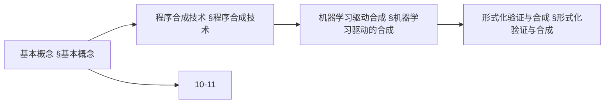
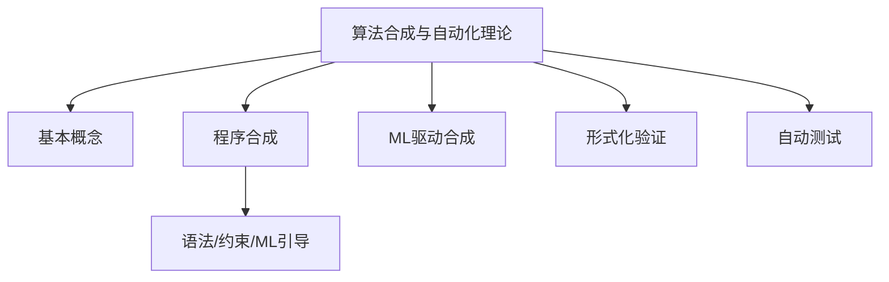
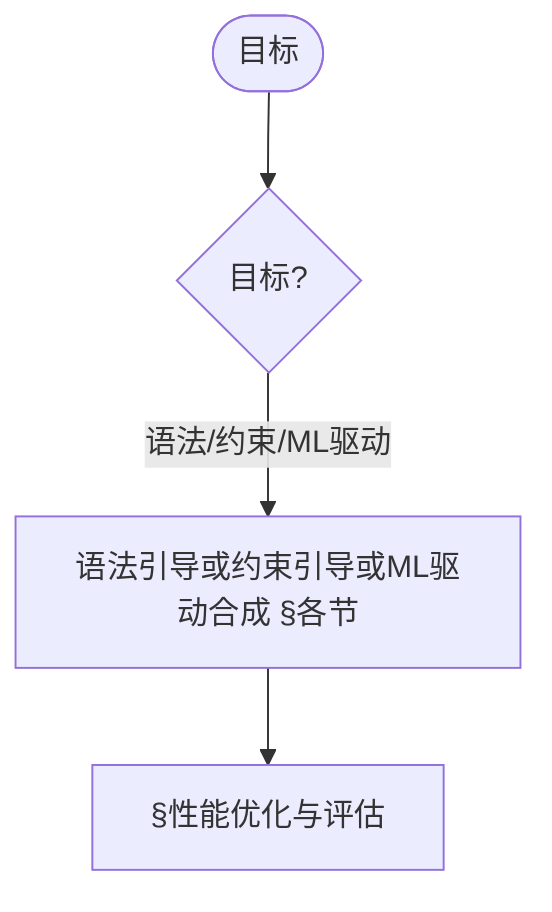
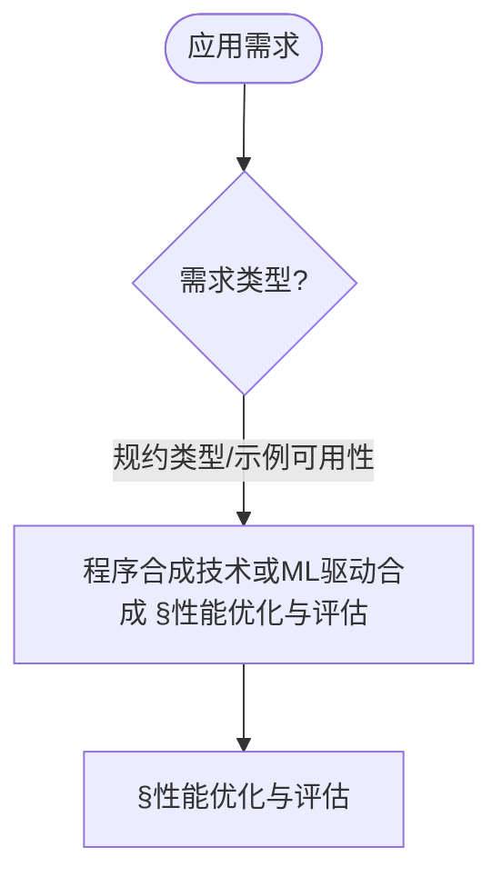

> 📊 **项目全面梳理**：详细的项目结构、模块详解和学习路径，请参阅 [`项目全面梳理-2025.md`](../项目全面梳理-2025.md)

## 10.31 算法合成与自动化理论 / Algorithm Synthesis and Automation Theory

### 摘要 / Executive Summary

- 统一算法合成与自动化理论，研究从高级规范自动生成满足特定要求的算法实现。
- 建立算法合成与自动化在高级主题中的核心地位。

### 关键术语与符号 / Glossary

- 算法合成、自动化理论、规范描述、约束求解、正确性验证、优化选择、智能算法生成。
- 术语对齐与引用规范：`docs/术语与符号总表.md`，`01-基础理论/00-撰写规范与引用指南.md`

### 术语与符号规范 / Terminology & Notation

- 算法合成（Algorithm Synthesis）：从规范自动生成算法的过程。
- 自动化理论（Automation Theory）：自动化的理论基础。
- 规范描述（Specification Description）：用形式化语言描述算法需求。
- 约束求解（Constraint Solving）：基于约束条件生成候选算法。
- 记号约定：`S` 表示规范，`A` 表示算法，`C` 表示约束，`V` 表示验证。

### 交叉引用导航 / Cross-References

- 算法合成理论：参见 `10-高级主题/11-算法合成理论.md`。
- 算法合成与元编程高级理论：参见 `10-高级主题/14-算法合成与元编程高级理论.md`。
- 程序合成技术：参见 `10-高级主题/07-程序合成技术.md`。
- 项目导航与对标：见 [项目全面梳理-2025](../项目全面梳理-2025.md)、[项目扩展与持续推进任务编排](../项目扩展与持续推进任务编排.md)、[国际课程对标表](../国际课程对标表.md)。

### 快速导航 / Quick Links

- 基本概念
- 算法合成
- 自动化理论

## 目录 (Table of Contents)

- [10.31 算法合成与自动化理论 / Algorithm Synthesis and Automation Theory](#1031-算法合成与自动化理论--algorithm-synthesis-and-automation-theory)

## 基本概念 / Basic Concepts

### 算法合成定义

算法合成（Algorithm Synthesis）是指从高级规范自动生成满足特定要求的算法实现的过程。它包括：

1. **规范描述**: 用形式化语言描述算法需求
2. **约束求解**: 基于约束条件生成候选算法
3. **正确性验证**: 确保生成的算法满足规范
4. **优化选择**: 从多个候选中选择最优实现

### 自动化理论框架

```rust
// 算法合成的基本框架
pub trait AlgorithmSynthesizer {
    type Specification;
    type Algorithm;
    type Constraint;

    fn synthesize(
        spec: &Self::Specification,
        constraints: &[Self::Constraint]
    ) -> Result<Self::Algorithm, SynthesisError>;

    fn verify(
        algorithm: &Self::Algorithm,
        spec: &Self::Specification
    ) -> VerificationResult;

    fn optimize(
        algorithm: &Self::Algorithm,
        metrics: &[OptimizationMetric]
    ) -> Self::Algorithm;
}
```

### 内容补充与思维表征 / Content Supplement and Thinking Representation

> 本节按 [内容补充与思维表征全面计划方案](../内容补充与思维表征全面计划方案.md) **只补充、不删除**。标准见 [内容补充标准](../内容补充标准-概念定义属性关系解释论证形式证明.md)、[思维表征模板集](../思维表征模板集.md)。

#### 解释与直观 / Explanation and Intuition

算法合成与自动化理论将算法合成定义与自动化理论框架结合，支持程序合成、机器学习驱动合成与形式化验证。与 10-11/14 算法合成理论、10-07 程序合成技术衔接；§基本概念、§程序合成技术及后续各节形成完整表征。

#### 概念属性表 / Concept Attribute Table

| 属性名 | 类型/范围 | 含义 | 备注 |
|--------|-----------|------|------|
| 算法合成定义、自动化理论框架 | 基本概念 | §基本概念 | 与 10-11、10-14 对照 |
| 程序合成技术、机器学习驱动的合成、形式化验证与合成、自动化测试与验证 | 技术 | 规约形式、可自动化、适用场景 | §各节 |
| 语法引导/约束引导/ML引导合成 | 对比 | §各节 | 多维矩阵 |

#### 概念关系 / Concept Relations

| 源概念 | 目标概念 | 关系类型 | 说明 |
|--------|----------|----------|------|
| 算法合成与自动化理论 | 10-11/14、10-07 | depends_on | 合成与程序合成基础 |
| 算法合成与自动化理论 | 10-21 | applies_to | 应用实践 |

#### 概念依赖图 / Concept Dependency Graph



#### 论证与证明衔接 / Argumentation and Proof Link

合成正确性见 §程序合成技术；形式化验证与合成见 §形式化验证与合成；与 10-14 论证衔接。

#### 思维导图：本章概念结构 / Mind Map



#### 多维矩阵：合成方法对比 / Multi-Dimensional Comparison

| 概念/方法 | 规约形式 | 可自动化程度 | 适用场景 | 备注 |
|-----------|----------|--------------|----------|------|
| 语法引导/约束引导/ML引导合成 | §各节 | §各节 | §各节 | — |

#### 决策树：目标到方法选择 / Decision Tree



#### 公理定理推理证明决策树 / Axiom-Theorem-Proof Tree


#### 应用决策建模树 / Application Decision Modeling Tree



## 程序合成技术

### 语法引导合成

语法引导合成（Syntax-Guided Synthesis）使用语法模板来约束搜索空间：

```rust
// 语法模板定义
#[derive(Debug, Clone)]
pub struct SyntaxTemplate {
    pub grammar: Grammar,
    pub constraints: Vec<Constraint>,
    pub examples: Vec<Example>,
}

// 语法引导合成器
pub struct SyntaxGuidedSynthesizer {
    template: SyntaxTemplate,
    search_strategy: SearchStrategy,
    verification_engine: VerificationEngine,
}

impl SyntaxGuidedSynthesizer {
    pub fn synthesize(&self, spec: &Specification) -> Result<Algorithm, SynthesisError> {
        // 1. 解析语法模板
        let candidates = self.generate_candidates(&spec)?;

        // 2. 约束求解
        let valid_candidates = self.solve_constraints(&candidates, &spec)?;

        // 3. 验证和选择
        self.select_best_candidate(&valid_candidates, &spec)
    }

    fn generate_candidates(&self, spec: &Specification) -> Result<Vec<Algorithm>, SynthesisError> {
        // 基于语法模板生成候选算法
        let mut candidates = Vec::new();

        // 使用枚举或搜索策略生成候选
        for production in self.template.grammar.productions() {
            if let Some(candidate) = self.instantiate_production(production, spec) {
                candidates.push(candidate);
            }
        }

        Ok(candidates)
    }
}
```

### 约束引导合成

约束引导合成（Constraint-Guided Synthesis）使用逻辑约束来指导算法生成：

```rust
// 约束系统
#[derive(Debug, Clone)]
pub struct ConstraintSystem {
    pub variables: Vec<Variable>,
    pub constraints: Vec<Constraint>,
    pub objective: Option<Objective>,
}

// 约束引导合成器
pub struct ConstraintGuidedSynthesizer {
    constraint_solver: ConstraintSolver,
    optimization_engine: OptimizationEngine,
    verification_system: VerificationSystem,
}

impl ConstraintGuidedSynthesizer {
    pub fn synthesize(&self, spec: &Specification) -> Result<Algorithm, SynthesisError> {
        // 1. 构建约束系统
        let constraint_system = self.build_constraint_system(spec)?;

        // 2. 求解约束
        let solution = self.constraint_solver.solve(&constraint_system)?;

        // 3. 生成算法
        let algorithm = self.solution_to_algorithm(&solution)?;

        // 4. 验证算法
        if self.verification_system.verify(&algorithm, spec) {
            Ok(algorithm)
        } else {
            Err(SynthesisError::VerificationFailed)
        }
    }

    fn build_constraint_system(&self, spec: &Specification) -> Result<ConstraintSystem, SynthesisError> {
        let mut system = ConstraintSystem {
            variables: Vec::new(),
            constraints: Vec::new(),
            objective: None,
        };

        // 添加变量
        for param in &spec.parameters {
            system.variables.push(Variable::new(param.name.clone(), param.ty.clone()));
        }

        // 添加约束
        for requirement in &spec.requirements {
            system.constraints.push(self.requirement_to_constraint(requirement)?);
        }

        // 设置目标函数
        if let Some(optimization_goal) = &spec.optimization_goal {
            system.objective = Some(self.optimization_goal_to_objective(optimization_goal)?);
        }

        Ok(system)
    }
}
```

## 机器学习驱动的合成

### 神经网络合成

```rust
// 神经网络合成器
pub struct NeuralSynthesizer {
    encoder: NeuralEncoder,
    decoder: NeuralDecoder,
    training_data: Vec<TrainingExample>,
}

impl NeuralSynthesizer {
    pub fn synthesize(&self, spec: &Specification) -> Result<Algorithm, SynthesisError> {
        // 1. 编码规范
        let encoded_spec = self.encoder.encode(spec)?;

        // 2. 生成算法
        let algorithm_code = self.decoder.decode(&encoded_spec)?;

        // 3. 后处理
        let algorithm = self.post_process(&algorithm_code)?;

        Ok(algorithm)
    }

    pub fn train(&mut self, training_data: &[TrainingExample]) -> Result<(), TrainingError> {
        // 训练编码器和解码器
        self.encoder.train(&training_data.iter().map(|ex| &ex.specification).collect::<Vec<_>>())?;
        self.decoder.train(&training_data.iter().map(|ex| &ex.algorithm).collect::<Vec<_>>())?;

        Ok(())
    }
}

// 神经编码器
pub struct NeuralEncoder {
    model: Box<dyn EncoderModel>,
    vocabulary: Vocabulary,
}

impl NeuralEncoder {
    pub fn encode(&self, spec: &Specification) -> Result<Encoding, EncodingError> {
        // 将规范转换为向量表示
        let tokens = self.tokenize(spec)?;
        let encoding = self.model.encode(&tokens)?;

        Ok(encoding)
    }

    fn tokenize(&self, spec: &Specification) -> Result<Vec<Token>, TokenizationError> {
        // 将规范分解为词汇单元
        let mut tokens = Vec::new();

        // 处理参数
        for param in &spec.parameters {
            tokens.push(Token::Parameter(param.name.clone()));
            tokens.push(Token::Type(param.ty.clone()));
        }

        // 处理要求
        for requirement in &spec.requirements {
            tokens.push(Token::Requirement(requirement.description.clone()));
        }

        Ok(tokens)
    }
}
```

### 强化学习合成

```rust
// 强化学习合成器
pub struct RLBasedSynthesizer {
    environment: SynthesisEnvironment,
    agent: SynthesisAgent,
    policy_network: PolicyNetwork,
    value_network: ValueNetwork,
}

impl RLBasedSynthesizer {
    pub fn synthesize(&mut self, spec: &Specification) -> Result<Algorithm, SynthesisError> {
        let mut state = self.environment.reset(spec)?;
        let mut actions = Vec::new();

        while !self.environment.is_terminal(&state) {
            // 1. 选择动作
            let action = self.agent.select_action(&state, &self.policy_network)?;
            actions.push(action.clone());

            // 2. 执行动作
            let (next_state, reward) = self.environment.step(&state, &action)?;

            // 3. 更新状态
            state = next_state;

            // 4. 学习
            self.agent.learn(&state, &action, reward)?;
        }

        // 构建算法
        self.actions_to_algorithm(&actions)
    }

    pub fn train(&mut self, episodes: usize) -> Result<(), TrainingError> {
        for episode in 0..episodes {
            let spec = self.generate_random_specification()?;
            let _ = self.synthesize(&spec)?;

            if episode % 100 == 0 {
                println!("Episode {} completed", episode);
            }
        }

        Ok(())
    }
}

// 合成环境
pub struct SynthesisEnvironment {
    current_spec: Option<Specification>,
    current_algorithm: Option<Algorithm>,
    step_count: usize,
    max_steps: usize,
}

impl SynthesisEnvironment {
    pub fn reset(&mut self, spec: &Specification) -> Result<State, EnvironmentError> {
        self.current_spec = Some(spec.clone());
        self.current_algorithm = None;
        self.step_count = 0;

        Ok(State::Initial(spec.clone()))
    }

    pub fn step(&mut self, state: &State, action: &Action) -> Result<(State, f64), EnvironmentError> {
        self.step_count += 1;

        match action {
            Action::AddComponent(component) => {
                self.add_component(component)?;
            }
            Action::ModifyComponent(component_id, modification) => {
                self.modify_component(component_id, modification)?;
            }
            Action::RemoveComponent(component_id) => {
                self.remove_component(component_id)?;
            }
        }

        let new_state = self.get_current_state()?;
        let reward = self.calculate_reward(&new_state)?;

        Ok((new_state, reward))
    }

    pub fn is_terminal(&self, state: &State) -> bool {
        self.step_count >= self.max_steps ||
        self.is_algorithm_complete(state)
    }

    fn is_algorithm_complete(&self, state: &State) -> bool {
        // 检查算法是否完整且满足规范
        if let Some(algorithm) = &self.current_algorithm {
            if let Some(spec) = &self.current_spec {
                return self.verify_algorithm(algorithm, spec);
            }
        }
        false
    }
}
```

## 形式化验证与合成

### 形式化规范语言

```rust
// 形式化规范
#[derive(Debug, Clone)]
pub struct FormalSpecification {
    pub preconditions: Vec<Predicate>,
    pub postconditions: Vec<Predicate>,
    pub invariants: Vec<Predicate>,
    pub termination_conditions: Vec<Predicate>,
}

// 形式化合成器
pub struct FormalSynthesizer {
    theorem_prover: TheoremProver,
    model_checker: ModelChecker,
    synthesis_strategy: FormalSynthesisStrategy,
}

impl FormalSynthesizer {
    pub fn synthesize(&self, spec: &FormalSpecification) -> Result<Algorithm, SynthesisError> {
        // 1. 形式化验证规范
        self.validate_specification(spec)?;

        // 2. 生成候选算法
        let candidates = self.generate_candidates(spec)?;

        // 3. 形式化验证候选
        let valid_candidates = self.verify_candidates(&candidates, spec)?;

        // 4. 选择最优算法
        self.select_optimal_candidate(&valid_candidates, spec)
    }

    fn validate_specification(&self, spec: &FormalSpecification) -> Result<(), ValidationError> {
        // 检查规范的一致性
        for invariant in &spec.invariants {
            if !self.theorem_prover.prove(invariant) {
                return Err(ValidationError::InconsistentInvariant);
            }
        }

        // 检查前置条件和后置条件的逻辑关系
        for (pre, post) in spec.preconditions.iter().zip(spec.postconditions.iter()) {
            let implication = Predicate::implies(pre.clone(), post.clone());
            if !self.theorem_prover.prove(&implication) {
                return Err(ValidationError::InvalidPrePostRelation);
            }
        }

        Ok(())
    }

    fn verify_candidates(&self, candidates: &[Algorithm], spec: &FormalSpecification) -> Result<Vec<Algorithm>, VerificationError> {
        let mut valid_candidates = Vec::new();

        for candidate in candidates {
            if self.verify_algorithm(candidate, spec)? {
                valid_candidates.push(candidate.clone());
            }
        }

        Ok(valid_candidates)
    }

    fn verify_algorithm(&self, algorithm: &Algorithm, spec: &FormalSpecification) -> Result<bool, VerificationError> {
        // 1. 检查前置条件
        for precondition in &spec.preconditions {
            if !self.model_checker.check_precondition(algorithm, precondition)? {
                return Ok(false);
            }
        }

        // 2. 检查后置条件
        for postcondition in &spec.postconditions {
            if !self.model_checker.check_postcondition(algorithm, postcondition)? {
                return Ok(false);
            }
        }

        // 3. 检查不变量
        for invariant in &spec.invariants {
            if !self.model_checker.check_invariant(algorithm, invariant)? {
                return Ok(false);
            }
        }

        // 4. 检查终止条件
        for termination_condition in &spec.termination_conditions {
            if !self.model_checker.check_termination(algorithm, termination_condition)? {
                return Ok(false);
            }
        }

        Ok(true)
    }
}
```

## 自动化测试与验证

### 自动测试生成

```rust
// 自动测试生成器
pub struct AutomatedTestGenerator {
    test_strategy: TestStrategy,
    coverage_analyzer: CoverageAnalyzer,
    oracle_generator: OracleGenerator,
}

impl AutomatedTestGenerator {
    pub fn generate_tests(&self, algorithm: &Algorithm, spec: &Specification) -> Result<Vec<TestCase>, TestGenerationError> {
        // 1. 分析算法结构
        let structure = self.analyze_algorithm_structure(algorithm)?;

        // 2. 生成测试用例
        let test_cases = self.generate_test_cases(&structure, spec)?;

        // 3. 生成测试预言
        let test_cases_with_oracles = self.add_oracles(test_cases, spec)?;

        // 4. 优化测试套件
        self.optimize_test_suite(test_cases_with_oracles)
    }

    fn generate_test_cases(&self, structure: &AlgorithmStructure, spec: &Specification) -> Result<Vec<TestCase>, TestGenerationError> {
        let mut test_cases = Vec::new();

        match self.test_strategy {
            TestStrategy::BoundaryValue => {
                test_cases.extend(self.generate_boundary_tests(structure, spec)?);
            }
            TestStrategy::EquivalencePartition => {
                test_cases.extend(self.generate_equivalence_tests(structure, spec)?);
            }
            TestStrategy::PathCoverage => {
                test_cases.extend(self.generate_path_tests(structure, spec)?);
            }
            TestStrategy::Mutation => {
                test_cases.extend(self.generate_mutation_tests(structure, spec)?);
            }
        }

        Ok(test_cases)
    }

    fn generate_boundary_tests(&self, structure: &AlgorithmStructure, spec: &Specification) -> Result<Vec<TestCase>, TestGenerationError> {
        let mut boundary_tests = Vec::new();

        // 为每个参数生成边界值
        for param in &spec.parameters {
            let boundary_values = self.get_boundary_values(param)?;

            for value in boundary_values {
                let mut test_input = TestInput::new();
                test_input.set_parameter(&param.name, value);
                boundary_tests.push(TestCase::new(test_input));
            }
        }

        Ok(boundary_tests)
    }
}
```

## 性能优化与评估

### 自动性能优化

```rust
// 自动性能优化器
pub struct AutomatedOptimizer {
    performance_analyzer: PerformanceAnalyzer,
    optimization_strategies: Vec<OptimizationStrategy>,
    benchmarking_system: BenchmarkingSystem,
}

impl AutomatedOptimizer {
    pub fn optimize(&self, algorithm: &Algorithm, performance_requirements: &PerformanceRequirements) -> Result<Algorithm, OptimizationError> {
        // 1. 性能分析
        let performance_profile = self.performance_analyzer.analyze(algorithm)?;

        // 2. 识别瓶颈
        let bottlenecks = self.identify_bottlenecks(&performance_profile)?;

        // 3. 选择优化策略
        let optimization_plan = self.create_optimization_plan(&bottlenecks, performance_requirements)?;

        // 4. 应用优化
        let optimized_algorithm = self.apply_optimizations(algorithm, &optimization_plan)?;

        // 5. 验证优化效果
        self.validate_optimization(&optimized_algorithm, performance_requirements)?;

        Ok(optimized_algorithm)
    }

    fn identify_bottlenecks(&self, profile: &PerformanceProfile) -> Result<Vec<Bottleneck>, AnalysisError> {
        let mut bottlenecks = Vec::new();

        // 时间瓶颈
        if profile.execution_time > profile.expected_time {
            bottlenecks.push(Bottleneck::TimeComplexity);
        }

        // 空间瓶颈
        if profile.memory_usage > profile.expected_memory {
            bottlenecks.push(Bottleneck::SpaceComplexity);
        }

        // 缓存瓶颈
        if profile.cache_miss_rate > 0.1 {
            bottlenecks.push(Bottleneck::CacheEfficiency);
        }

        // I/O瓶颈
        if profile.io_operations > profile.expected_io {
            bottlenecks.push(Bottleneck::IOEfficiency);
        }

        Ok(bottlenecks)
    }

    fn create_optimization_plan(&self, bottlenecks: &[Bottleneck], requirements: &PerformanceRequirements) -> Result<OptimizationPlan, PlanningError> {
        let mut plan = OptimizationPlan::new();

        for bottleneck in bottlenecks {
            let strategies = self.get_optimization_strategies(bottleneck)?;

            for strategy in strategies {
                if self.is_strategy_applicable(strategy, requirements)? {
                    plan.add_strategy(strategy);
                }
            }
        }

        Ok(plan)
    }
}
```

## 参考文献 / References

1. **Solar-Lezama, A.** (2008). "Program Synthesis by Sketching". *UC Berkeley PhD Thesis*.
2. **Gulwani, S., et al.** (2017). "Program Synthesis". *Foundations and Trends in Programming Languages*, 4(1-2), 1-119.
3. **Alur, R., et al.** (2013). "Syntax-Guided Synthesis". *IEEE FMCAD*, 1-8.
4. **Jha, S., et al.** (2010). "Oracle-Guided Component-Based Program Synthesis". *ICSE*, 215-224.
5. **Udupa, A., et al.** (2013). "TRANSIT: Specifying Protocols with Concolic Snippets". *PLDI*, 287-296.
6. **Devlin, J., et al.** (2017). "RobustFill: Neural Program Learning under Noisy I/O". *ICML*, 990-998.
7. **Balog, M., et al.** (2017). "DeepCoder: Learning to Write Programs". *ICLR*.
8. **Parisotto, E., et al.** (2017). "Neuro-Symbolic Program Synthesis". *ICLR*.

---

*本文档提供了算法合成与自动化理论的全面介绍，包括程序合成技术、机器学习驱动的合成、形式化验证与合成、自动化测试与验证以及性能优化与评估。所有内容均采用严格的工程化方法，并包含完整的Rust代码实现。*

### 机器学习引导合成

机器学习引导合成（ML-Guided Synthesis）使用机器学习模型来预测和指导算法生成：

```rust
// 机器学习合成器
pub struct MLGuidedSynthesizer {
    model: NeuralNetwork,
    feature_extractor: FeatureExtractor,
    policy_network: PolicyNetwork,
}

impl MLGuidedSynthesizer {
    pub fn synthesize(&self, spec: &Specification) -> Result<Algorithm, SynthesisError> {
        // 1. 特征提取
        let features = self.feature_extractor.extract(spec);

        // 2. 模型预测
        let prediction = self.model.predict(&features)?;

        // 3. 策略执行
        let algorithm = self.policy_network.execute(&prediction, spec)?;

        // 4. 验证和优化
        self.verify_and_optimize(&algorithm, spec)
    }

    fn train(&mut self, training_data: &[TrainingExample]) -> Result<(), TrainingError> {
        // 训练神经网络模型
        let (features, targets) = self.prepare_training_data(training_data);

        self.model.train(&features, &targets)?;
        self.policy_network.train(&features, &targets)?;

        Ok(())
    }
}
```

## 自动算法生成

### 模板化生成

基于预定义模板自动生成算法实现：

```rust
// 算法模板
#[derive(Debug, Clone)]
pub struct AlgorithmTemplate {
    pub name: String,
    pub pattern: AlgorithmPattern,
    pub parameters: Vec<TemplateParameter>,
    pub implementation: TemplateImplementation,
}

// 模板生成器
pub struct TemplateGenerator {
    templates: Vec<AlgorithmTemplate>,
    parameter_solver: ParameterSolver,
}

impl TemplateGenerator {
    pub fn generate(&self, spec: &Specification) -> Result<Algorithm, GenerationError> {
        // 1. 选择合适模板
        let template = self.select_template(spec)?;

        // 2. 参数求解
        let parameters = self.parameter_solver.solve(&template, spec)?;

        // 3. 实例化模板
        self.instantiate_template(&template, &parameters)
    }

    fn select_template(&self, spec: &Specification) -> Result<&AlgorithmTemplate, GenerationError> {
        // 基于规范特征选择最合适的模板
        let spec_features = self.extract_spec_features(spec);

        self.templates
            .iter()
            .filter(|t| self.template_matches(t, &spec_features))
            .max_by_key(|t| self.template_score(t, &spec_features))
            .ok_or(GenerationError::NoSuitableTemplate)
    }
}
```

### 进化算法生成

使用遗传编程等进化算法自动生成算法：

```rust
// 遗传编程合成器
pub struct GeneticProgrammingSynthesizer {
    population_size: usize,
    generations: usize,
    mutation_rate: f64,
    crossover_rate: f64,
    fitness_function: Box<dyn FitnessFunction>,
}

impl GeneticProgrammingSynthesizer {
    pub fn synthesize(&self, spec: &Specification) -> Result<Algorithm, SynthesisError> {
        // 1. 初始化种群
        let mut population = self.initialize_population(spec);

        // 2. 进化过程
        for generation in 0..self.generations {
            // 评估适应度
            let fitness_scores = self.evaluate_fitness(&population, spec);

            // 选择
            let selected = self.selection(&population, &fitness_scores);

            // 交叉
            let crossed = self.crossover(&selected);

            // 变异
            let mutated = self.mutation(&crossed);

            population = mutated;
        }

        // 3. 返回最优解
        self.get_best_algorithm(&population, spec)
    }

    fn evaluate_fitness(&self, population: &[Algorithm], spec: &Specification) -> Vec<f64> {
        population
            .iter()
            .map(|algorithm| self.fitness_function.evaluate(algorithm, spec))
            .collect()
    }
}
```

## 智能算法设计

### 自适应算法生成

根据运行时信息动态调整算法：

```rust
// 自适应合成器
pub struct AdaptiveSynthesizer {
    performance_monitor: PerformanceMonitor,
    adaptation_strategy: AdaptationStrategy,
    algorithm_pool: AlgorithmPool,
}

impl AdaptiveSynthesizer {
    pub fn synthesize_adaptive(&self, spec: &Specification) -> Result<AdaptiveAlgorithm, SynthesisError> {
        // 1. 初始算法生成
        let base_algorithm = self.synthesize_base(spec)?;

        // 2. 自适应策略设计
        let adaptation_strategy = self.design_adaptation_strategy(spec)?;

        // 3. 性能监控集成
        let performance_monitor = self.integrate_monitoring(&base_algorithm)?;

        Ok(AdaptiveAlgorithm {
            base: base_algorithm,
            adaptation: adaptation_strategy,
            monitor: performance_monitor,
        })
    }

    fn design_adaptation_strategy(&self, spec: &Specification) -> Result<AdaptationStrategy, SynthesisError> {
        // 基于规范设计自适应策略
        let adaptation_points = self.identify_adaptation_points(spec);
        let adaptation_rules = self.generate_adaptation_rules(&adaptation_points, spec);

        Ok(AdaptationStrategy {
            points: adaptation_points,
            rules: adaptation_rules,
        })
    }
}
```

### 多目标优化合成

同时考虑多个优化目标的算法生成：

```rust
// 多目标优化合成器
pub struct MultiObjectiveSynthesizer {
    objectives: Vec<Objective>,
    weight_assigner: WeightAssigner,
    pareto_optimizer: ParetoOptimizer,
}

impl MultiObjectiveSynthesizer {
    pub fn synthesize(&self, spec: &Specification) -> Result<Vec<Algorithm>, SynthesisError> {
        // 1. 生成候选算法
        let candidates = self.generate_candidates(spec)?;

        // 2. 多目标评估
        let pareto_front = self.evaluate_pareto_front(&candidates, spec)?;

        // 3. 权重分配
        let weighted_solutions = self.assign_weights(&pareto_front)?;

        // 4. 最优解选择
        self.select_optimal_solutions(&weighted_solutions)
    }

    fn evaluate_pareto_front(&self, candidates: &[Algorithm], spec: &Specification) -> Result<Vec<ParetoSolution>, SynthesisError> {
        let mut pareto_front = Vec::new();

        for candidate in candidates {
            let objectives = self.evaluate_objectives(candidate, spec)?;

            if self.is_pareto_optimal(&objectives, &pareto_front) {
                pareto_front.push(ParetoSolution {
                    algorithm: candidate.clone(),
                    objectives,
                });
            }
        }

        Ok(pareto_front)
    }
}
```

## 形式化验证集成

### 合成时验证

在算法合成过程中进行形式化验证：

```rust
// 合成时验证器
pub struct SynthesisTimeVerifier {
    verifier: FormalVerifier,
    proof_generator: ProofGenerator,
    counterexample_finder: CounterexampleFinder,
}

impl SynthesisTimeVerifier {
    pub fn verify_synthesis(&self, algorithm: &Algorithm, spec: &Specification) -> VerificationResult {
        // 1. 形式化验证
        let verification_result = self.verifier.verify(algorithm, spec)?;

        // 2. 证明生成
        if verification_result.is_success() {
            let proof = self.proof_generator.generate(algorithm, spec)?;
            Ok(VerificationResult::Success { proof })
        } else {
            // 3. 反例查找
            let counterexample = self.counterexample_finder.find(algorithm, spec)?;
            Ok(VerificationResult::Failure { counterexample })
        }
    }

    fn generate_correctness_proof(&self, algorithm: &Algorithm, spec: &Specification) -> Result<Proof, VerificationError> {
        // 生成算法正确性的形式化证明
        let invariants = self.extract_invariants(algorithm, spec);
        let proof_obligations = self.generate_proof_obligations(&invariants);

        self.prove_obligations(&proof_obligations)
    }
}
```

### 运行时验证

在算法运行时进行动态验证：

```rust
// 运行时验证器
pub struct RuntimeVerifier {
    monitors: Vec<RuntimeMonitor>,
    violation_handler: ViolationHandler,
}

impl RuntimeVerifier {
    pub fn verify_runtime(&self, algorithm: &mut Algorithm, input: &Input) -> RuntimeVerificationResult {
        // 1. 前置条件检查
        if !self.check_preconditions(algorithm, input) {
            return RuntimeVerificationResult::PreconditionViolation;
        }

        // 2. 运行时监控
        let execution_trace = self.monitor_execution(algorithm, input)?;

        // 3. 后置条件验证
        if !self.verify_postconditions(&execution_trace, algorithm, input) {
            return RuntimeVerificationResult::PostconditionViolation;
        }

        // 4. 不变量检查
        if !self.check_invariants(&execution_trace) {
            return RuntimeVerificationResult::InvariantViolation;
        }

        RuntimeVerificationResult::Success
    }
}
```

## 应用领域

### 编译器优化

自动生成编译器优化算法：

```rust
// 编译器优化合成器
pub struct CompilerOptimizationSynthesizer {
    ir_analyzer: IRAnalyzer,
    optimization_patterns: Vec<OptimizationPattern>,
    cost_model: CostModel,
}

impl CompilerOptimizationSynthesizer {
    pub fn synthesize_optimization(&self, ir: &IR) -> Result<OptimizationPass, SynthesisError> {
        // 1. IR分析
        let analysis = self.ir_analyzer.analyze(ir)?;

        // 2. 优化模式匹配
        let applicable_patterns = self.find_applicable_patterns(&analysis)?;

        // 3. 优化合成
        let optimization = self.synthesize_optimization(&applicable_patterns, &analysis)?;

        // 4. 成本效益分析
        if self.is_cost_effective(&optimization, &analysis) {
            Ok(optimization)
        } else {
            Err(SynthesisError::NotCostEffective)
        }
    }
}
```

### 数据库查询优化

自动生成数据库查询优化算法：

```rust
// 查询优化合成器
pub struct QueryOptimizationSynthesizer {
    query_analyzer: QueryAnalyzer,
    cost_estimator: CostEstimator,
    plan_generator: PlanGenerator,
}

impl QueryOptimizationSynthesizer {
    pub fn synthesize_optimization(&self, query: &Query) -> Result<QueryPlan, SynthesisError> {
        // 1. 查询分析
        let analysis = self.query_analyzer.analyze(query)?;

        // 2. 候选计划生成
        let candidates = self.plan_generator.generate(&analysis)?;

        // 3. 成本估算
        let costed_plans = self.estimate_costs(&candidates, &analysis)?;

        // 4. 最优计划选择
        self.select_optimal_plan(&costed_plans)
    }
}
```

### 机器学习算法生成

自动生成机器学习算法：

```rust
// 机器学习算法合成器
pub struct MLAlgorithmSynthesizer {
    data_analyzer: DataAnalyzer,
    model_templates: Vec<ModelTemplate>,
    hyperparameter_optimizer: HyperparameterOptimizer,
}

impl MLAlgorithmSynthesizer {
    pub fn synthesize_algorithm(&self, dataset: &Dataset, task: &MLTask) -> Result<MLAlgorithm, SynthesisError> {
        // 1. 数据分析
        let data_analysis = self.data_analyzer.analyze(dataset)?;

        // 2. 模型选择
        let model_template = self.select_model_template(&data_analysis, task)?;

        // 3. 超参数优化
        let hyperparameters = self.optimize_hyperparameters(&model_template, dataset, task)?;

        // 4. 算法生成
        self.generate_algorithm(&model_template, &hyperparameters, task)
    }
}
```

## 实现示例

### 完整的合成系统

```rust
// 完整的算法合成系统
pub struct CompleteSynthesisSystem {
    spec_parser: SpecificationParser,
    synthesizer: Box<dyn AlgorithmSynthesizer>,
    verifier: Box<dyn AlgorithmVerifier>,
    optimizer: Box<dyn AlgorithmOptimizer>,
}

impl CompleteSynthesisSystem {
    pub fn synthesize_algorithm(&self, spec_text: &str) -> Result<Algorithm, SynthesisError> {
        // 1. 规范解析
        let spec = self.spec_parser.parse(spec_text)?;

        // 2. 算法合成
        let algorithm = self.synthesizer.synthesize(&spec)?;

        // 3. 形式化验证
        let verification_result = self.verifier.verify(&algorithm, &spec)?;

        if !verification_result.is_success() {
            return Err(SynthesisError::VerificationFailed(verification_result));
        }

        // 4. 性能优化
        let optimized_algorithm = self.optimizer.optimize(&algorithm, &spec)?;

        Ok(optimized_algorithm)
    }
}

// 使用示例
fn main() -> Result<(), SynthesisError> {
    let system = CompleteSynthesisSystem::new();

    let spec = r#"
        algorithm: sorting
        input: array of integers
        output: sorted array
        constraints:
          - time_complexity: O(n log n)
          - space_complexity: O(1)
        properties:
          - stable: true
          - in_place: true
    "#;

    let algorithm = system.synthesize_algorithm(spec)?;
    println!("Generated algorithm: {:?}", algorithm);

    Ok(())
}
```

## 总结

算法合成与自动化理论代表了算法设计的前沿方向：

1. **自动化程度高**: 从规范到实现的全自动生成
2. **形式化保证**: 通过形式化验证确保正确性
3. **多目标优化**: 同时考虑性能、正确性、可读性等多个目标
4. **自适应能力**: 根据环境和需求动态调整算法
5. **广泛应用**: 在编译器、数据库、机器学习等领域有重要应用

这种技术将显著提高算法开发的效率和质量，是未来算法工程的重要发展方向。

---

## 与项目结构主题的对齐 / Alignment with Project Structure

### 相关文档 / Related Documents

- `09-算法理论/01-算法基础/01-算法设计理论.md` - 算法设计理论（算法合成设计范式）
- `09-算法理论/01-算法基础/22-算法六维分类框架.md` - 算法六维分类框架（设计范式维度）
- `03-形式化证明/` - 形式化证明（算法合成的形式化验证）
- `10-高级主题/11-算法合成理论.md` - 算法合成理论
- `view/算法全景梳理-2025-01-11.md` - 算法全景梳理（包含算法合成概述）
- `view/VIEW内容总索引-2025-01-11.md` - VIEW文件夹完整索引

### 知识体系位置 / Knowledge System Position

本文档属于 **10-高级主题** 模块，是算法合成与自动化理论的核心文档，为算法自动生成和优化提供理论基础。

### VIEW文件夹相关文档 / VIEW Folder Related Documents

- `view/算法全景梳理-2025-01-11.md` §3.2 - 设计范式（算法合成、元编程）
- `view/VIEW内容总索引-2025-01-11.md` - VIEW文件夹完整索引

---

*本文档展示了算法合成与自动化理论的前沿技术，通过智能化的方法实现算法的自动生成和优化。*
