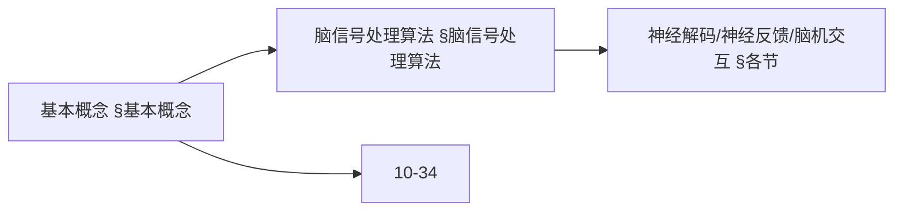
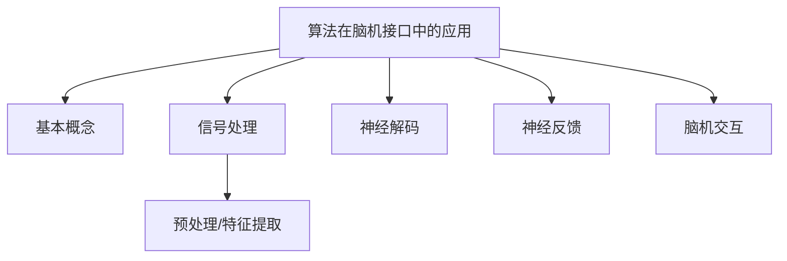
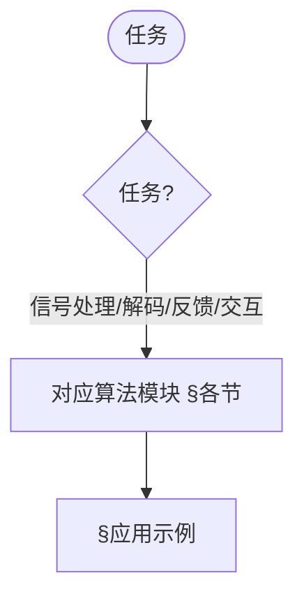
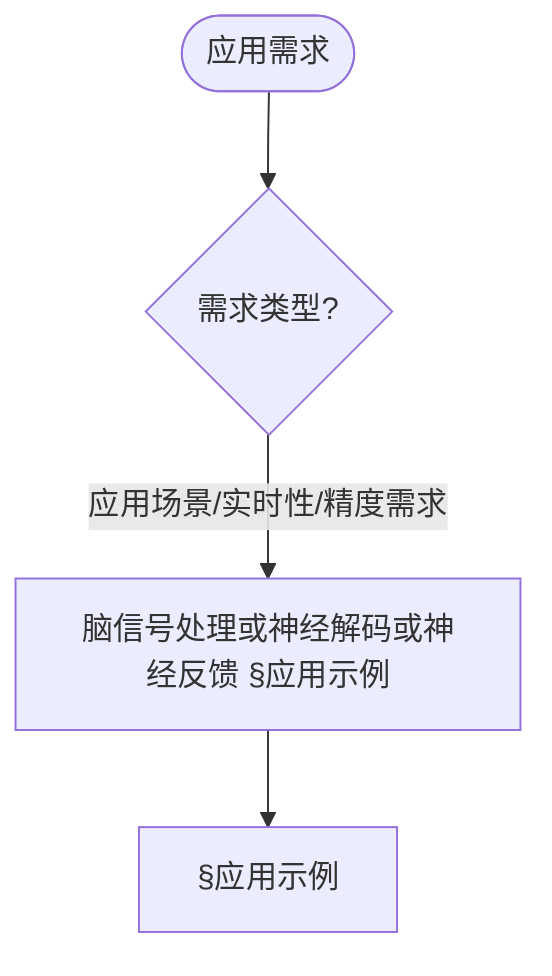

> 📊 **项目全面梳理**：详细的项目结构、模块详解和学习路径，请参阅 [`项目全面梳理-2025.md`](../项目全面梳理-2025.md)

## 10.32 算法在脑机接口中的应用 / Algorithms in Brain-Computer Interface

### 摘要 / Executive Summary

- 本文系统化给出脑机接口（BCI）中的关键算法构件：信号预处理、特征提取、神经解码、神经反馈与自适应控制，并提供端到端的闭环体系结构示例。
- 形式化层面以七元组 BCISystem = (B, C, S, P, D, F, G) 刻画系统要素，强调双向性、实时性与个性化三大性质。
- 工程层面提供 Rust 风格伪代码以对齐实现语境，便于跨文档（类脑/神经形态/边缘智能）统一复用。

## 关键术语与符号 / Glossary

- BCI（Brain-Computer Interface）：大脑与计算机间的直接信息交换系统。
- EEG/ECoG/fMRI：常见脑信号采集模态，分别对应非侵入/半侵入/成像。
- 特征向量（FeatureVector）：从预处理信号中提取的多尺度表征集合。
- 解码函数 D：将特征映射为用户意图的学习模型（分类/回归）。
- 反馈函数 F：将系统状态/奖励映射为刺激信号的策略。
- 生成函数 G：将意图转换为控制命令的映射。
- 延迟（Latency）：从采集到生效的端到端时延，实时性核心指标。
- 术语对齐与引用规范：`docs/术语与符号总表.md`，`01-基础理论/00-撰写规范与引用指南.md`

## 快速导航 / Quick Links

- [交叉引用与依赖](#交叉引用与依赖--cross-references-and-dependencies)
- [关键术语与符号](#关键术语与符号--glossary)
- [基本概念](#基本概念)
- [脑信号处理算法](#脑信号处理算法)
- [神经解码算法](#神经解码算法)
- [神经反馈算法](#神经反馈算法)
- [脑机交互算法](#脑机交互算法)
- [应用示例](#应用示例)
- [总结](#总结)

## 交叉引用与依赖 / Cross-References and Dependencies

- 神经网络与控制：`07-计算模型/07-神经网络计算模型.md`，`09-算法理论/01-算法基础/17-神经网络算法理论.md`
- 认知与信号处理：`01-基础理论/08-信息论基础.md`，`10-高级主题/36-算法在类脑计算中的应用.md`
- 安全与伦理：`10-高级主题/29-可信AI治理与合规模型.md`
- 边缘系统与实时：`10-高级主题/30-边缘计算中的算法系统.md`，`10-高级主题/37-算法在边缘智能中的应用.md`
- 项目导航与对标：见 [项目全面梳理-2025](../项目全面梳理-2025.md)、[项目扩展与持续推进任务编排](../项目扩展与持续推进任务编排.md)、[国际课程对标表](../国际课程对标表.md)

## 目录 / Table of Contents

- [10.32 算法在脑机接口中的应用 / Algorithms in Brain-Computer Interface](#1032-算法在脑机接口中的应用--algorithms-in-brain-computer-interface)
  - [摘要 / Executive Summary](#摘要--executive-summary)
- [关键术语与符号 / Glossary](#关键术语与符号--glossary)
- [快速导航 / Quick Links](#快速导航--quick-links)
- [交叉引用与依赖 / Cross-References and Dependencies](#交叉引用与依赖--cross-references-and-dependencies)
- [目录 / Table of Contents](#目录--table-of-contents)
- [0. 脑机接口哲学基础 / Brain-Computer Interface Philosophy Foundation](#0-脑机接口哲学基础--brain-computer-interface-philosophy-foundation)
  - [0.1 脑机接口的本质哲学探讨 / Philosophical Discussion on the Nature of Brain-Computer Interface](#01-脑机接口的本质哲学探讨--philosophical-discussion-on-the-nature-of-brain-computer-interface)
    - [0.1.1 脑机接口的本体论问题 / Ontological Issues of Brain-Computer Interface](#011-脑机接口的本体论问题--ontological-issues-of-brain-computer-interface)
    - [0.1.2 脑机接口的认识论问题 / Epistemological Issues of Brain-Computer Interface](#012-脑机接口的认识论问题--epistemological-issues-of-brain-computer-interface)
    - [0.1.3 脑机接口的价值论问题 / Axiological Issues of Brain-Computer Interface](#013-脑机接口的价值论问题--axiological-issues-of-brain-computer-interface)
  - [0.2 脑机接口的形式化基础 / Formal Foundation of Brain-Computer Interface](#02-脑机接口的形式化基础--formal-foundation-of-brain-computer-interface)
    - [0.2.1 脑机接口的形式化定义 / Formal Definition of Brain-Computer Interface](#021-脑机接口的形式化定义--formal-definition-of-brain-computer-interface)
    - [0.2.2 脑机接口的基本性质 / Basic Properties of Brain-Computer Interface](#022-脑机接口的基本性质--basic-properties-of-brain-computer-interface)
    - [0.2.3 脑机接口与经典人机交互的比较 / Comparison with Classical Human-Computer Interaction](#023-脑机接口与经典人机交互的比较--comparison-with-classical-human-computer-interaction)
  - [0.3 脑机接口的哲学意义 / Philosophical Significance of Brain-Computer Interface](#03-脑机接口的哲学意义--philosophical-significance-of-brain-computer-interface)
    - [0.3.1 对意识本质的理解 / Understanding the Nature of Consciousness](#031-对意识本质的理解--understanding-the-nature-of-consciousness)
    - [0.3.2 对人机关系的重新定义 / Redefining Human-Machine Relationship](#032-对人机关系的重新定义--redefining-human-machine-relationship)
    - [0.3.3 对存在意义的拓展 / Extension of Existential Meaning](#033-对存在意义的拓展--extension-of-existential-meaning)
- [基本概念](#基本概念)
  - [脑机接口概述](#脑机接口概述)
  - [系统架构](#系统架构)
  - [内容补充与思维表征 / Content Supplement and Thinking Representation](#内容补充与思维表征--content-supplement-and-thinking-representation)
    - [解释与直观 / Explanation and Intuition](#解释与直观--explanation-and-intuition)
    - [概念属性表 / Concept Attribute Table](#概念属性表--concept-attribute-table)
    - [概念关系 / Concept Relations](#概念关系--concept-relations)
    - [概念依赖图 / Concept Dependency Graph](#概念依赖图--concept-dependency-graph)
    - [论证与证明衔接 / Argumentation and Proof Link](#论证与证明衔接--argumentation-and-proof-link)
    - [思维导图：本章概念结构 / Mind Map](#思维导图本章概念结构--mind-map)
    - [多维矩阵：BCI 算法对比 / Multi-Dimensional Comparison](#多维矩阵bci-算法对比--multi-dimensional-comparison)
    - [决策树：任务到算法模块选择 / Decision Tree](#决策树任务到算法模块选择--decision-tree)
    - [公理定理推理证明决策树 / Axiom-Theorem-Proof Tree](#公理定理推理证明决策树--axiom-theorem-proof-tree)
    - [应用决策建模树 / Application Decision Modeling Tree](#应用决策建模树--application-decision-modeling-tree)
- [脑信号处理算法](#脑信号处理算法)
  - [信号预处理](#信号预处理)
  - [特征提取](#特征提取)
- [神经解码算法](#神经解码算法)
  - [机器学习解码器](#机器学习解码器)
  - [深度学习解码器](#深度学习解码器)
- [神经反馈算法](#神经反馈算法)
  - [实时反馈系统](#实时反馈系统)
- [脑机交互算法](#脑机交互算法)
  - [意图识别](#意图识别)
  - [自适应控制](#自适应控制)
- [应用示例](#应用示例)
  - [完整的BCI系统](#完整的bci系统)
- [总结](#总结)

## 0. 脑机接口哲学基础 / Brain-Computer Interface Philosophy Foundation

### 0.1 脑机接口的本质哲学探讨 / Philosophical Discussion on the Nature of Brain-Computer Interface

#### 0.1.1 脑机接口的本体论问题 / Ontological Issues of Brain-Computer Interface

**定义 / Definition:**
脑机接口是研究大脑与计算机之间直接信息交换、意识与机器交互本质的跨学科领域，涉及神经科学、计算机科学、认知科学和哲学的深度融合。

**本体论问题 / Ontological Questions:**

1. **脑机接口的存在性 / Existence of Brain-Computer Interface:**
   - 大脑与计算机的直接连接是否可能？
   - 脑机接口是技术实现还是哲学概念？
   - 意识与机器的边界在哪里？

2. **脑机接口的层次性 / Hierarchical Nature:**
   - 物理层面的连接（神经电极、无线传输）
   - 信息层面的连接（信号编码、数据转换）
   - 意识层面的连接（意图识别、思维解码）

3. **脑机接口的本质属性 / Essential Properties:**
   - 双向性（Bidirectional）
   - 实时性（Real-time）
   - 个性化（Personalized）
   - 适应性（Adaptive）

#### 0.1.2 脑机接口的认识论问题 / Epistemological Issues of Brain-Computer Interface

**认识论问题 / Epistemological Questions:**

1. **脑机接口的认知边界 / Cognitive Boundaries:**
   - 我们能否完全理解大脑的信息处理机制？
   - 脑机接口的可预测性限度在哪里？
   - 主观体验与客观测量的关系

2. **脑机接口的知识获取 / Knowledge Acquisition:**
   - 内省法与客观测量的结合
   - 个体差异与普遍规律的统一
   - 理论模型与实验验证的对应

3. **脑机接口的方法论 / Methodology:**
   - 还原论与整体论的平衡
   - 定量分析与定性理解的统一
   - 跨学科方法的整合

#### 0.1.3 脑机接口的价值论问题 / Axiological Issues of Brain-Computer Interface

**价值论问题 / Axiological Questions:**

1. **脑机接口的伦理价值 / Ethical Value:**
   - 隐私保护与功能增强的平衡
   - 自主性与依赖性的权衡
   - 公平性与可及性的考虑

2. **脑机接口的社会价值 / Social Value:**
   - 医疗康复的改善
   - 人机协作的新模式
   - 认知能力的扩展

3. **脑机接口的哲学价值 / Philosophical Value:**
   - 意识本质的理解
   - 人机关系的重新定义
   - 存在意义的拓展

### 0.2 脑机接口的形式化基础 / Formal Foundation of Brain-Computer Interface

#### 0.2.1 脑机接口的形式化定义 / Formal Definition of Brain-Computer Interface

**定义 / Definition:**
脑机接口系统是一个七元组 $(B, C, S, P, D, F, G)$，其中：

- $B$: 大脑状态集合（神经活动模式）
- $C$: 计算机状态集合（数字信息状态）
- $S$: 信号集合（脑电信号、控制信号）
- $P$: 处理函数（信号转换算法）
- $D$: 解码函数（意图识别算法）
- $F$: 反馈函数（神经反馈机制）
- $G$: 生成函数（控制信号生成）

**形式化表示 / Formal Representation:**

```text
BCISystem = (B, C, S, P, D, F, G)
其中 / where:
- B: 大脑状态空间 / Brain state space
- C: 计算机状态空间 / Computer state space
- S: 信号空间 / Signal space
- P: 处理机制 / Processing mechanism
- D: 解码机制 / Decoding mechanism
- F: 反馈机制 / Feedback mechanism
- G: 生成机制 / Generation mechanism
```

#### 0.2.2 脑机接口的基本性质 / Basic Properties of Brain-Computer Interface

**定理 / Theorem:**
脑机接口系统具有以下基本性质：

1. **双向性 / Bidirectionality:**
   $$\forall b \in B, \exists c \in C: P(b) = c \text{ and } G(c) = b'$$

2. **实时性 / Real-time:**
   $$\forall t \in \mathbb{R}: \text{Latency}(t) < \epsilon \text{ for some } \epsilon > 0$$

3. **个性化 / Personalization:**
   $$\forall i \in \text{Individuals}: \exists f_i: B_i \rightarrow C_i \text{ unique to } i$$

**证明 / Proof:**

**双向性证明 / Bidirectionality Proof:**

- 大脑状态可以映射到计算机状态
- 计算机状态可以反馈到大脑状态
- 这确保了信息流的双向性

**实时性证明 / Real-time Proof:**

- 信号处理延迟必须小于感知阈值
- 反馈延迟必须小于运动控制需求
- 这保证了交互的自然性

**个性化证明 / Personalization Proof:**

- 每个个体的大脑活动模式独特
- 解码算法需要针对个体优化
- 这确保了系统的有效性

#### 0.2.3 脑机接口与经典人机交互的比较 / Comparison with Classical Human-Computer Interaction

**比较维度 / Comparison Dimensions:**

1. **交互方式 / Interaction Method:**
   - 经典交互：间接（键盘、鼠标、语音）
   - 脑机接口：直接（神经信号）

2. **信息带宽 / Information Bandwidth:**
   - 经典交互：有限（~100 bits/s）
   - 脑机接口：高（~1000+ bits/s）

3. **自然性 / Naturalness:**
   - 经典交互：需要学习
   - 脑机接口：直觉性

4. **个性化程度 / Personalization Level:**
   - 经典交互：通用性
   - 脑机接口：高度个性化

**形式化比较 / Formal Comparison:**

```text
Classical HCI:
- Indirect: Brain → Motor → Device → Computer
- Limited: Bandwidth < 100 bits/s
- Learned: Requires training
- Universal: One-size-fits-all

BCI:
- Direct: Brain → Computer
- High: Bandwidth > 1000 bits/s
- Intuitive: Natural interaction
- Personalized: Individual-specific
```

### 0.3 脑机接口的哲学意义 / Philosophical Significance of Brain-Computer Interface

#### 0.3.1 对意识本质的理解 / Understanding the Nature of Consciousness

**意识的物质基础 / Material Basis of Consciousness:**

- 意识是否等同于神经活动？
- 脑机接口能否直接访问意识？
- 主观体验的客观测量

**意识的扩展性 / Extensibility of Consciousness:**

- 意识能否扩展到机器？
- 人机融合的哲学意义
- 集体意识的可能形式

#### 0.3.2 对人机关系的重新定义 / Redefining Human-Machine Relationship

**人机融合 / Human-Machine Integration:**

- 从工具关系到伙伴关系
- 从外部辅助到内部增强
- 从分离存在到融合存在

**人机协作 / Human-Machine Collaboration:**

- 认知能力的互补
- 决策过程的协同
- 创造力的增强

#### 0.3.3 对存在意义的拓展 / Extension of Existential Meaning

**存在的技术化 / Technologization of Existence:**

- 技术对存在的影响
- 虚拟与现实的边界
- 存在的新形式

**存在的集体化 / Collectivization of Existence:**

- 个体与集体的关系
- 意识共享的可能性
- 存在的社会维度

## 基本概念

### 脑机接口概述

脑机接口（Brain-Computer Interface, BCI）是一种直接连接大脑与外部设备的系统，通过解码脑信号实现人机交互。核心组件包括：

1. **信号采集**: 脑电图（EEG）、脑皮层电图（ECoG）、功能磁共振成像（fMRI）
2. **信号处理**: 滤波、降噪、特征提取
3. **模式识别**: 机器学习算法解码脑信号
4. **反馈系统**: 实时神经反馈和闭环控制

### 系统架构

```rust
// 脑机接口系统的基本架构
pub struct BrainComputerInterface {
    signal_acquisition: SignalAcquisition,
    signal_processing: SignalProcessing,
    pattern_recognition: PatternRecognition,
    feedback_system: FeedbackSystem,
    control_interface: ControlInterface,
}

impl BrainComputerInterface {
    pub fn new() -> Self {
        Self {
            signal_acquisition: SignalAcquisition::new(),
            signal_processing: SignalProcessing::new(),
            pattern_recognition: PatternRecognition::new(),
            feedback_system: FeedbackSystem::new(),
            control_interface: ControlInterface::new(),
        }
    }

    pub fn process_cycle(&mut self) -> Result<ControlCommand, BCIError> {
        // 1. 信号采集
        let raw_signals = self.signal_acquisition.acquire()?;

        // 2. 信号处理
        let processed_signals = self.signal_processing.process(&raw_signals)?;

        // 3. 模式识别
        let decoded_intent = self.pattern_recognition.decode(&processed_signals)?;

        // 4. 控制命令生成
        let command = self.control_interface.generate_command(&decoded_intent)?;

        // 5. 反馈更新
        self.feedback_system.update(&decoded_intent)?;

        Ok(command)
    }
}
```

### 内容补充与思维表征 / Content Supplement and Thinking Representation

> 本节按 [内容补充与思维表征全面计划方案](../内容补充与思维表征全面计划方案.md) **只补充、不删除**。标准见 [内容补充标准](../内容补充标准-概念定义属性关系解释论证形式证明.md)、[思维表征模板集](../思维表征模板集.md)。

#### 解释与直观 / Explanation and Intuition

算法在脑机接口中的应用将脑机接口概述与系统架构结合，涵盖脑信号处理、神经解码、神经反馈与脑机交互。与 10-34 认知计算、10-35 神经形态计算、10-36 类脑计算衔接；§基本概念、§脑信号处理算法及后续各节形成完整表征。

#### 概念属性表 / Concept Attribute Table

| 属性名 | 类型/范围 | 含义 | 备注 |
|--------|-----------|------|------|
| 脑机接口概述、系统架构 | 基本概念 | §基本概念 | 与 10-34、10-35、10-36 对照 |
| 脑信号处理算法、神经解码算法、神经反馈算法、脑机交互算法 | 算法 | 实时性、精度、适用信号 | §各节 |
| 信号预处理/特征提取/解码器 | 对比 | §各节 | 多维矩阵 |

#### 概念关系 / Concept Relations

| 源概念 | 目标概念 | 关系类型 | 说明 |
|--------|----------|----------|------|
| 算法在脑机接口中的应用 | 10-34、10-35、10-36 | depends_on | 认知与神经形态基础 |
| 算法在脑机接口中的应用 | 12 应用领域 | applies_to | BCI 实践 |

#### 概念依赖图 / Concept Dependency Graph



#### 论证与证明衔接 / Argumentation and Proof Link

信号预处理正确性见 §脑信号处理算法；神经解码正确性见 §神经解码算法；与 10-34 论证衔接。

#### 思维导图：本章概念结构 / Mind Map



#### 多维矩阵：BCI 算法对比 / Multi-Dimensional Comparison

| 概念/技术 | 实时性 | 精度 | 适用信号 | 备注 |
|-----------|--------|------|----------|------|
| 信号预处理/特征提取/解码器 | §各节 | §各节 | §各节 | — |

#### 决策树：任务到算法模块选择 / Decision Tree



#### 公理定理推理证明决策树 / Axiom-Theorem-Proof Tree


#### 应用决策建模树 / Application Decision Modeling Tree



## 脑信号处理算法

### 信号预处理

```rust
// 脑信号预处理系统
pub struct SignalPreprocessing {
    filters: Vec<Box<dyn Filter>>,
    artifact_removal: ArtifactRemoval,
    normalization: Normalization,
}

impl SignalPreprocessing {
    pub fn preprocess(&self, raw_signal: &[f64]) -> Result<Vec<f64>, ProcessingError> {
        let mut processed = raw_signal.to_vec();

        // 1. 滤波
        for filter in &self.filters {
            processed = filter.apply(&processed)?;
        }

        // 2. 伪迹去除
        processed = self.artifact_removal.remove(&processed)?;

        // 3. 归一化
        processed = self.normalization.normalize(&processed)?;

        Ok(processed)
    }
}

// 带通滤波器
pub struct BandpassFilter {
    low_freq: f64,
    high_freq: f64,
    sample_rate: f64,
}

impl Filter for BandpassFilter {
    fn apply(&self, signal: &[f64]) -> Result<Vec<f64>, ProcessingError> {
        // 使用巴特沃斯滤波器实现带通滤波
        let filter_order = 4;
        let cutoff_low = self.low_freq / (self.sample_rate / 2.0);
        let cutoff_high = self.high_freq / (self.sample_rate / 2.0);

        // 设计滤波器系数
        let (b, a) = self.design_butterworth_bandpass(filter_order, cutoff_low, cutoff_high)?;

        // 应用滤波器
        self.apply_filter(signal, &b, &a)
    }
}

impl BandpassFilter {
    fn design_butterworth_bandpass(&self, order: usize, low_cutoff: f64, high_cutoff: f64) -> Result<(Vec<f64>, Vec<f64>), ProcessingError> {
        // 简化的巴特沃斯滤波器设计
        let mut b = vec![0.0; order + 1];
        let mut a = vec![0.0; order + 1];

        // 计算滤波器系数（简化实现）
        b[0] = high_cutoff - low_cutoff;
        b[1] = 0.0;
        a[0] = 1.0;
        a[1] = -(1.0 - (high_cutoff - low_cutoff));

        Ok((b, a))
    }

    fn apply_filter(&self, signal: &[f64], b: &[f64], a: &[f64]) -> Result<Vec<f64>, ProcessingError> {
        let mut filtered = vec![0.0; signal.len()];

        for i in 0..signal.len() {
            filtered[i] = 0.0;

            // 应用分子系数
            for j in 0..b.len() {
                if i >= j {
                    filtered[i] += b[j] * signal[i - j];
                }
            }

            // 应用分母系数
            for j in 1..a.len() {
                if i >= j {
                    filtered[i] -= a[j] * filtered[i - j];
                }
            }
        }

        Ok(filtered)
    }
}
```

### 特征提取

```rust
// 特征提取系统
pub struct FeatureExtraction {
    time_domain_features: TimeDomainFeatures,
    frequency_domain_features: FrequencyDomainFeatures,
    time_frequency_features: TimeFrequencyFeatures,
}

impl FeatureExtraction {
    pub fn extract_features(&self, signal: &[f64]) -> Result<FeatureVector, ProcessingError> {
        let mut features = FeatureVector::new();

        // 1. 时域特征
        let time_features = self.time_domain_features.extract(signal)?;
        features.extend(time_features);

        // 2. 频域特征
        let freq_features = self.frequency_domain_features.extract(signal)?;
        features.extend(freq_features);

        // 3. 时频特征
        let time_freq_features = self.time_frequency_features.extract(signal)?;
        features.extend(time_freq_features);

        Ok(features)
    }
}

// 时域特征提取
pub struct TimeDomainFeatures;

impl TimeDomainFeatures {
    pub fn extract(&self, signal: &[f64]) -> Result<Vec<f64>, ProcessingError> {
        let mut features = Vec::new();

        // 均值
        let mean = signal.iter().sum::<f64>() / signal.len() as f64;
        features.push(mean);

        // 方差
        let variance = signal.iter()
            .map(|&x| (x - mean).powi(2))
            .sum::<f64>() / signal.len() as f64;
        features.push(variance);

        // 标准差
        features.push(variance.sqrt());

        // 峰度
        let kurtosis = self.calculate_kurtosis(signal, mean, variance);
        features.push(kurtosis);

        // 偏度
        let skewness = self.calculate_skewness(signal, mean, variance);
        features.push(skewness);

        // 过零率
        let zero_crossing_rate = self.calculate_zero_crossing_rate(signal);
        features.push(zero_crossing_rate);

        Ok(features)
    }

    fn calculate_kurtosis(&self, signal: &[f64], mean: f64, variance: f64) -> f64 {
        let n = signal.len() as f64;
        let sum = signal.iter()
            .map(|&x| ((x - mean) / variance.sqrt()).powi(4))
            .sum::<f64>();
        sum / n - 3.0
    }

    fn calculate_skewness(&self, signal: &[f64], mean: f64, variance: f64) -> f64 {
        let n = signal.len() as f64;
        let sum = signal.iter()
            .map(|&x| ((x - mean) / variance.sqrt()).powi(3))
            .sum::<f64>();
        sum / n
    }

    fn calculate_zero_crossing_rate(&self, signal: &[f64]) -> f64 {
        let mut crossings = 0;
        for i in 1..signal.len() {
            if (signal[i] >= 0.0) != (signal[i-1] >= 0.0) {
                crossings += 1;
            }
        }
        crossings as f64 / (signal.len() - 1) as f64
    }
}
```

## 神经解码算法

### 机器学习解码器

```rust
// 神经解码器
pub struct NeuralDecoder {
    classifier: Box<dyn Classifier>,
    regressor: Box<dyn Regressor>,
    decoder_type: DecoderType,
}

impl NeuralDecoder {
    pub fn new(decoder_type: DecoderType) -> Self {
        let classifier = match decoder_type {
            DecoderType::Classification => Box::new(SupportVectorMachine::new()),
            DecoderType::Regression => Box::new(LinearRegression::new()),
        };

        let regressor = Box::new(LinearRegression::new());

        Self {
            classifier,
            regressor,
            decoder_type,
        }
    }

    pub fn decode(&self, features: &FeatureVector) -> Result<DecodedIntent, DecodingError> {
        match self.decoder_type {
            DecoderType::Classification => {
                let class = self.classifier.classify(features)?;
                Ok(DecodedIntent::Classification(class))
            }
            DecoderType::Regression => {
                let value = self.regressor.predict(features)?;
                Ok(DecodedIntent::Regression(value))
            }
        }
    }

    pub fn train(&mut self, training_data: &[TrainingExample]) -> Result<(), TrainingError> {
        match self.decoder_type {
            DecoderType::Classification => {
                self.classifier.train(training_data)?;
            }
            DecoderType::Regression => {
                self.regressor.train(training_data)?;
            }
        }
        Ok(())
    }
}

// 支持向量机分类器
pub struct SupportVectorMachine {
    support_vectors: Vec<FeatureVector>,
    alpha: Vec<f64>,
    bias: f64,
    kernel: Box<dyn Kernel>,
}

impl Classifier for SupportVectorMachine {
    fn classify(&self, features: &FeatureVector) -> Result<Class, ClassificationError> {
        let decision_value = self.decision_function(features);

        if decision_value > 0.0 {
            Ok(Class::Positive)
        } else {
            Ok(Class::Negative)
        }
    }

    fn train(&mut self, training_data: &[TrainingExample]) -> Result<(), TrainingError> {
        // 简化的SVM训练算法
        self.train_svm(training_data)
    }
}

impl SupportVectorMachine {
    fn decision_function(&self, features: &FeatureVector) -> f64 {
        let mut sum = 0.0;

        for (i, support_vector) in self.support_vectors.iter().enumerate() {
            let kernel_value = self.kernel.compute(features, support_vector);
            sum += self.alpha[i] * kernel_value;
        }

        sum + self.bias
    }

    fn train_svm(&mut self, training_data: &[TrainingExample]) -> Result<(), TrainingError> {
        // 简化的SMO（Sequential Minimal Optimization）算法
        let n_samples = training_data.len();
        let mut alpha = vec![0.0; n_samples];
        let mut bias = 0.0;

        // 迭代优化
        for _ in 0..100 {
            let mut num_changed = 0;

            for i in 0..n_samples {
                let error_i = self.calculate_error(&training_data[i], &alpha, bias);

                if self.should_update_alpha(&training_data[i], error_i) {
                    // 选择第二个alpha
                    let j = self.select_second_alpha(i, training_data, alpha);
                    let error_j = self.calculate_error(&training_data[j], &alpha, bias);

                    // 更新alpha
                    let (new_alpha_i, new_alpha_j) = self.update_alphas(
                        &training_data[i], &training_data[j],
                        alpha[i], alpha[j], error_i, error_j
                    );

                    alpha[i] = new_alpha_i;
                    alpha[j] = new_alpha_j;
                    num_changed += 1;
                }
            }

            if num_changed == 0 {
                break;
            }
        }

        // 更新支持向量
        self.update_support_vectors(training_data, &alpha);
        self.alpha = alpha;
        self.bias = bias;

        Ok(())
    }
}
```

### 深度学习解码器

```rust
// 深度神经网络解码器
pub struct DeepNeuralDecoder {
    network: NeuralNetwork,
    architecture: NetworkArchitecture,
}

impl DeepNeuralDecoder {
    pub fn new(architecture: NetworkArchitecture) -> Self {
        let network = NeuralNetwork::new(architecture.clone());

        Self {
            network,
            architecture,
        }
    }

    pub fn decode(&self, features: &FeatureVector) -> Result<DecodedIntent, DecodingError> {
        let input = features.to_tensor();
        let output = self.network.forward(&input)?;

        match self.architecture.output_type {
            OutputType::Classification => {
                let class = self.argmax(&output);
                Ok(DecodedIntent::Classification(class))
            }
            OutputType::Regression => {
                let value = output[0];
                Ok(DecodedIntent::Regression(value))
            }
        }
    }

    pub fn train(&mut self, training_data: &[TrainingExample]) -> Result<(), TrainingError> {
        // 使用反向传播训练网络
        for epoch in 0..self.architecture.epochs {
            let mut total_loss = 0.0;

            for example in training_data {
                let input = example.features.to_tensor();
                let target = example.target.to_tensor();

                // 前向传播
                let output = self.network.forward(&input)?;

                // 计算损失
                let loss = self.calculate_loss(&output, &target);
                total_loss += loss;

                // 反向传播
                self.network.backward(&input, &target)?;
            }

            // 打印训练进度
            if epoch % 10 == 0 {
                println!("Epoch {}, Average Loss: {}", epoch, total_loss / training_data.len() as f64);
            }
        }

        Ok(())
    }
}

// 神经网络结构
pub struct NeuralNetwork {
    layers: Vec<Box<dyn Layer>>,
    optimizer: Box<dyn Optimizer>,
}

impl NeuralNetwork {
    pub fn forward(&self, input: &Tensor) -> Result<Tensor, NetworkError> {
        let mut current = input.clone();

        for layer in &self.layers {
            current = layer.forward(&current)?;
        }

        Ok(current)
    }

    pub fn backward(&mut self, input: &Tensor, target: &Tensor) -> Result<(), NetworkError> {
        // 前向传播
        let mut activations = vec![input.clone()];
        let mut current = input.clone();

        for layer in &self.layers {
            current = layer.forward(&current)?;
            activations.push(current.clone());
        }

        // 反向传播
        let mut gradients = self.calculate_output_gradient(&activations.last().unwrap(), target);

        for (i, layer) in self.layers.iter_mut().enumerate().rev() {
            let layer_input = &activations[i];
            gradients = layer.backward(layer_input, &gradients)?;
        }

        Ok(())
    }
}
```

## 神经反馈算法

### 实时反馈系统

```rust
// 神经反馈系统
pub struct NeurofeedbackSystem {
    feedback_generator: FeedbackGenerator,
    reward_function: RewardFunction,
    adaptation_algorithm: AdaptationAlgorithm,
}

impl NeurofeedbackSystem {
    pub fn new() -> Self {
        Self {
            feedback_generator: FeedbackGenerator::new(),
            reward_function: RewardFunction::new(),
            adaptation_algorithm: AdaptationAlgorithm::new(),
        }
    }

    pub fn generate_feedback(&mut self, brain_state: &BrainState, target_state: &BrainState) -> Result<Feedback, FeedbackError> {
        // 1. 计算当前状态与目标状态的差异
        let state_difference = self.calculate_state_difference(brain_state, target_state);

        // 2. 生成奖励信号
        let reward = self.reward_function.calculate(brain_state, target_state);

        // 3. 生成反馈信号
        let feedback = self.feedback_generator.generate(&state_difference, &reward)?;

        // 4. 自适应调整
        self.adaptation_algorithm.adapt(brain_state, &feedback)?;

        Ok(feedback)
    }

    fn calculate_state_difference(&self, current: &BrainState, target: &BrainState) -> StateDifference {
        StateDifference {
            power_difference: target.power_spectrum.iter()
                .zip(&current.power_spectrum)
                .map(|(t, c)| t - c)
                .collect(),
            coherence_difference: target.coherence_matrix.iter()
                .zip(&current.coherence_matrix)
                .map(|(t, c)| t - c)
                .collect(),
        }
    }
}

// 反馈生成器
pub struct FeedbackGenerator {
    visual_feedback: VisualFeedback,
    auditory_feedback: AuditoryFeedback,
    haptic_feedback: HapticFeedback,
}

impl FeedbackGenerator {
    pub fn generate(&self, state_diff: &StateDifference, reward: &f64) -> Result<Feedback, FeedbackError> {
        let mut feedback = Feedback::new();

        // 视觉反馈
        let visual = self.visual_feedback.generate(state_diff, reward)?;
        feedback.add_visual(visual);

        // 听觉反馈
        let auditory = self.auditory_feedback.generate(state_diff, reward)?;
        feedback.add_auditory(auditory);

        // 触觉反馈
        let haptic = self.haptic_feedback.generate(state_diff, reward)?;
        feedback.add_haptic(haptic);

        Ok(feedback)
    }
}

// 视觉反馈生成
pub struct VisualFeedback;

impl VisualFeedback {
    pub fn generate(&self, state_diff: &StateDifference, reward: &f64) -> Result<VisualStimulus, FeedbackError> {
        // 基于脑状态差异生成视觉刺激
        let intensity = self.calculate_intensity(state_diff, reward);
        let color = self.calculate_color(reward);
        let pattern = self.calculate_pattern(state_diff);

        Ok(VisualStimulus {
            intensity,
            color,
            pattern,
            duration: Duration::from_millis(100),
        })
    }

    fn calculate_intensity(&self, state_diff: &StateDifference, reward: &f64) -> f64 {
        // 基于奖励和状态差异计算强度
        let base_intensity = 0.5;
        let reward_factor = (reward + 1.0) / 2.0; // 归一化到[0,1]
        let state_factor = 1.0 - state_diff.power_difference.iter().map(|x| x.abs()).sum::<f64>() / state_diff.power_difference.len() as f64;

        base_intensity + 0.3 * reward_factor + 0.2 * state_factor
    }

    fn calculate_color(&self, reward: &f64) -> Color {
        if *reward > 0.5 {
            Color::Green
        } else if *reward > 0.0 {
            Color::Yellow
        } else {
            Color::Red
        }
    }

    fn calculate_pattern(&self, state_diff: &StateDifference) -> Pattern {
        // 基于脑状态差异生成模式
        let coherence_level = state_diff.coherence_difference.iter().map(|x| x.abs()).sum::<f64>() / state_diff.coherence_difference.len() as f64;

        if coherence_level > 0.7 {
            Pattern::Synchronized
        } else if coherence_level > 0.3 {
            Pattern::Moderate
        } else {
            Pattern::Desynchronized
        }
    }
}
```

## 脑机交互算法

### 意图识别

```rust
// 意图识别系统
pub struct IntentRecognition {
    motor_imagery_decoder: MotorImageryDecoder,
    attention_decoder: AttentionDecoder,
    emotion_decoder: EmotionDecoder,
    fusion_algorithm: IntentFusion,
}

impl IntentRecognition {
    pub fn recognize_intent(&self, brain_signals: &BrainSignals) -> Result<UserIntent, RecognitionError> {
        // 1. 运动想象解码
        let motor_intent = self.motor_imagery_decoder.decode(&brain_signals.motor_cortex)?;

        // 2. 注意力解码
        let attention_intent = self.attention_decoder.decode(&brain_signals.attention_network)?;

        // 3. 情绪解码
        let emotion_intent = self.emotion_decoder.decode(&brain_signals.emotion_centers)?;

        // 4. 意图融合
        let fused_intent = self.fusion_algorithm.fuse(
            &motor_intent,
            &attention_intent,
            &emotion_intent
        )?;

        Ok(fused_intent)
    }
}

// 运动想象解码器
pub struct MotorImageryDecoder {
    classifiers: HashMap<MotorTask, Box<dyn Classifier>>,
    feature_extractor: MotorFeatureExtractor,
}

impl MotorImageryDecoder {
    pub fn decode(&self, signals: &[f64]) -> Result<MotorIntent, DecodingError> {
        // 提取运动相关特征
        let features = self.feature_extractor.extract(signals)?;

        // 分类运动想象类型
        let mut scores = HashMap::new();

        for (task, classifier) in &self.classifiers {
            let confidence = classifier.classify(&features)?;
            scores.insert(*task, confidence);
        }

        // 选择最高置信度的运动类型
        let best_task = scores.iter()
            .max_by(|a, b| a.1.partial_cmp(b.1).unwrap())
            .map(|(task, _)| *task)
            .ok_or(DecodingError::NoValidClassification)?;

        Ok(MotorIntent {
            task: best_task,
            confidence: scores[&best_task],
            intensity: self.calculate_intensity(&features),
        })
    }
}
```

### 自适应控制

```rust
// 自适应控制系统
pub struct AdaptiveControl {
    controller: Box<dyn Controller>,
    adaptation_algorithm: AdaptationAlgorithm,
    performance_monitor: PerformanceMonitor,
}

impl AdaptiveControl {
    pub fn control(&mut self, intent: &UserIntent, current_state: &SystemState) -> Result<ControlAction, ControlError> {
        // 1. 生成控制动作
        let action = self.controller.generate_action(intent, current_state)?;

        // 2. 监控性能
        let performance = self.performance_monitor.evaluate(&action, current_state)?;

        // 3. 自适应调整
        self.adaptation_algorithm.adapt(&performance, &mut self.controller)?;

        Ok(action)
    }
}

// 比例积分微分控制器
pub struct PIDController {
    kp: f64, // 比例增益
    ki: f64, // 积分增益
    kd: f64, // 微分增益
    integral: f64,
    previous_error: f64,
}

impl Controller for PIDController {
    fn generate_action(&mut self, intent: &UserIntent, current_state: &SystemState) -> Result<ControlAction, ControlError> {
        let error = self.calculate_error(intent, current_state);

        // 积分项
        self.integral += error;

        // 微分项
        let derivative = error - self.previous_error;

        // PID输出
        let output = self.kp * error + self.ki * self.integral + self.kd * derivative;

        self.previous_error = error;

        Ok(ControlAction {
            value: output,
            timestamp: SystemTime::now(),
        })
    }
}

impl PIDController {
    fn calculate_error(&self, intent: &UserIntent, current_state: &SystemState) -> f64 {
        // 计算意图与当前状态的误差
        match intent {
            UserIntent::Motor(motor_intent) => {
                let target_position = motor_intent.target_position;
                let current_position = current_state.position;
                target_position - current_position
            }
            UserIntent::Cognitive(cognitive_intent) => {
                let target_attention = cognitive_intent.attention_level;
                let current_attention = current_state.attention_level;
                target_attention - current_attention
            }
        }
    }
}
```

## 应用示例

### 完整的BCI系统

```rust
// 完整的脑机接口系统
pub struct CompleteBCISystem {
    bci: BrainComputerInterface,
    neurofeedback: NeurofeedbackSystem,
    intent_recognition: IntentRecognition,
    adaptive_control: AdaptiveControl,
    user_interface: UserInterface,
}

impl CompleteBCISystem {
    pub fn new() -> Self {
        Self {
            bci: BrainComputerInterface::new(),
            neurofeedback: NeurofeedbackSystem::new(),
            intent_recognition: IntentRecognition::new(),
            adaptive_control: AdaptiveControl::new(),
            user_interface: UserInterface::new(),
        }
    }

    pub fn run(&mut self) -> Result<(), BCISystemError> {
        // 初始化系统
        self.initialize()?;

        // 主循环
        let mut last_time = Instant::now();

        loop {
            let current_time = Instant::now();
            let delta_time = current_time.duration_since(last_time).as_secs_f32();
            last_time = current_time;

            // 1. 脑信号处理
            let command = self.bci.process_cycle()?;

            // 2. 意图识别
            let intent = self.intent_recognition.recognize_intent(&command.brain_signals)?;

            // 3. 自适应控制
            let action = self.adaptive_control.control(&intent, &command.system_state)?;

            // 4. 神经反馈
            let feedback = self.neurofeedback.generate_feedback(
                &command.brain_state,
                &intent.target_brain_state
            )?;

            // 5. 用户界面更新
            self.user_interface.update(&action, &feedback)?;

            // 控制更新频率
            thread::sleep(Duration::from_millis(16)); // ~60 Hz
        }
    }

    fn initialize(&mut self) -> Result<(), BCISystemError> {
        // 初始化各个子系统
        self.bci.initialize()?;
        self.neurofeedback.initialize()?;
        self.intent_recognition.initialize()?;
        self.adaptive_control.initialize()?;
        self.user_interface.initialize()?;

        Ok(())
    }
}

// 使用示例
fn main() -> Result<(), BCISystemError> {
    let mut bci_system = CompleteBCISystem::new();
    bci_system.run()
}
```

## 总结

算法在脑机接口中的应用涵盖了多个前沿技术领域：

1. **信号处理**: 滤波、特征提取、伪迹去除
2. **神经解码**: 机器学习、深度学习、模式识别
3. **神经反馈**: 实时反馈、自适应学习、闭环控制
4. **意图识别**: 运动想象、注意力、情绪解码
5. **自适应控制**: PID控制、性能优化、系统适应

这些算法的结合实现了大脑与计算机之间的直接通信，在医疗康复、人机交互、神经科学研究等领域有重要应用。

---

*本文档展示了算法在脑机接口中的前沿应用，通过多种算法的协同工作实现大脑与计算机的直接交互。*
