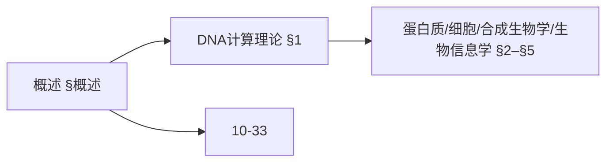
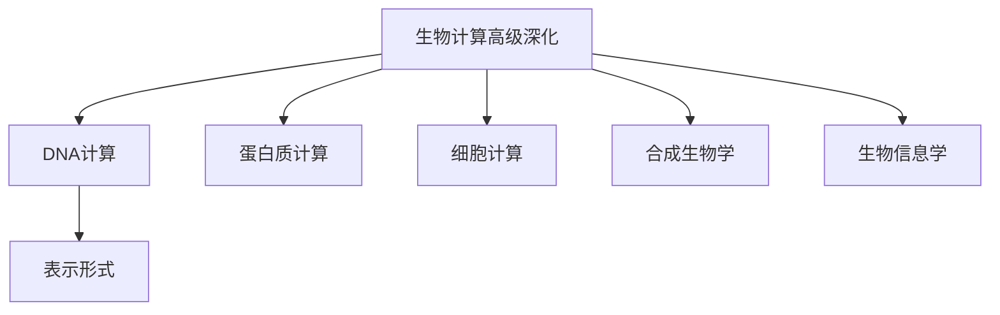
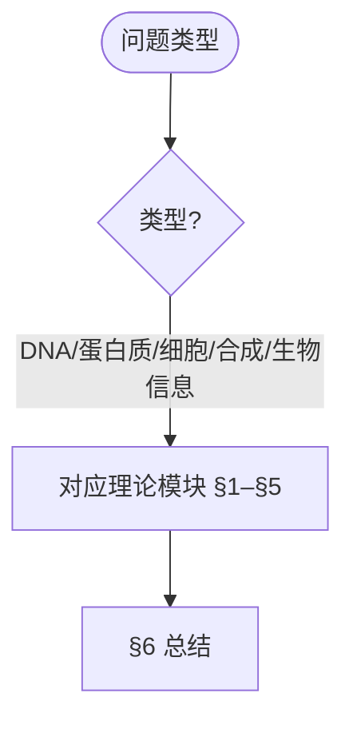
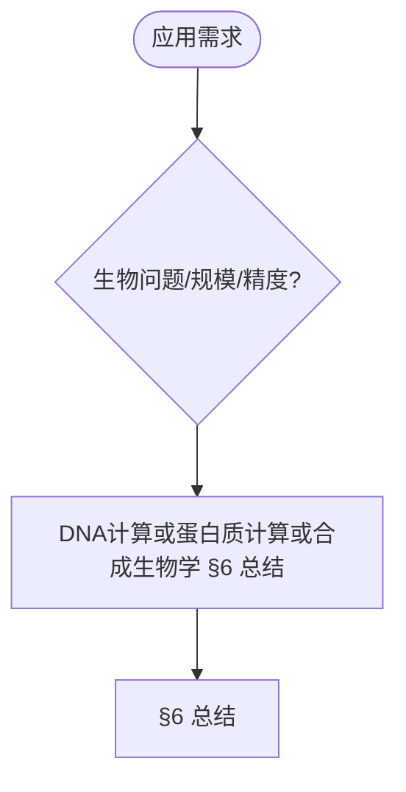

> 📊 **项目全面梳理**：详细的项目结构、模块详解和学习路径，请参阅 [`项目全面梳理-2025.md`](../项目全面梳理-2025.md)

## 10.33-高级深化 算法在生物计算中的应用 / Advanced Deepening of Algorithms in Biological Computing

### 摘要 / Executive Summary

- 深化基础篇的算法与形式化：DNA计算模型与复杂度、蛋白质能量函数与采样、细胞网络动力学、合成生物学系统设计与优化、生物信息学序列与结构预测。
- 跨语言形式化片段（Coq/Lean/Agda/Haskell）与工程伪代码并置，便于验证与实现对齐。

### 关键术语与符号 / Glossary

- DNA杂交（Hybridization）：互补链配对过程。
- 能量函数（Energy Function）：结构优化的目标函数。
- 动力学方程（Dynamics）：描述系统状态随时间演化的微分方程。
- 生物部件（BioBrick）：标准化可复用的生物模块。
- 术语对齐与引用规范：`docs/术语与符号总表.md`，`01-基础理论/00-撰写规范与引用指南.md`

### 快速导航 / Quick Links

- [交叉引用与依赖](#交叉引用与依赖--cross-references-and-dependencies)
- [概述](#概述--overview)
- [DNA计算理论](#1-dna计算理论--dna-computing-theory)
- [蛋白质计算理论](#2-蛋白质计算理论--protein-computing-theory)
- [细胞计算理论](#3-细胞计算理论--cellular-computing-theory)
- [合成生物学算法理论](#4-合成生物学算法理论--synthetic-biology-algorithm-theory)
- [生物信息学算法理论](#5-生物信息学算法理论--bioinformatics-algorithm-theory)
- [总结](#6-总结--summary)

## 交叉引用与依赖 / Cross-References and Dependencies

- 生物信息与统计：`01-基础理论/07-概率与统计基础.md`，`12-应用领域/04-生物信息学算法应用.md`
- 复杂系统与动力学：`07-计算模型/06-细胞自动机理论.md`
- 相关基础篇：`10-高级主题/33-算法在生物计算中的应用.md`

## 概述 / Overview

本文档深化生物计算算法应用的理论基础，重点研究DNA计算理论、蛋白质计算理论、细胞计算理论、合成生物学算法等高级主题。

### 内容补充与思维表征 / Content Supplement and Thinking Representation

> 本节按 [内容补充与思维表征全面计划方案](../内容补充与思维表征全面计划方案.md) **只补充、不删除**。标准见 [内容补充标准](../内容补充标准-概念定义属性关系解释论证形式证明.md)、[思维表征模板集](../思维表征模板集.md)。

#### 解释与直观 / Explanation and Intuition

生物计算算法应用高级深化将 DNA 计算、蛋白质计算、细胞计算、合成生物学与生物信息学算法理论结合。与 10-33 算法在生物计算中的应用、10-34 认知计算衔接；§概述、§1–§5 形成完整表征。

#### 概念属性表 / Concept Attribute Table

| 属性名 | 类型/范围 | 含义 | 备注 |
|--------|-----------|------|------|
| 概述 | 基本概念 | §概述 | 与 10-33、10-34 对照 |
| DNA计算、蛋白质计算、细胞计算、合成生物学、生物信息学理论 | 理论模块 | 表示形式、可扩展性、适用问题 | §1–§5 |
| DNA/蛋白质/细胞/合成生物学 | 对比 | §各节 | 多维矩阵 |

#### 概念关系 / Concept Relations

| 源概念 | 目标概念 | 关系类型 | 说明 |
|--------|----------|----------|------|
| 生物计算算法应用高级深化 | 10-33、10-34 | depends_on | 生物计算与认知基础 |
| 生物计算算法应用高级深化 | 12 应用领域 | applies_to | 生物计算实践 |

#### 概念依赖图 / Concept Dependency Graph



#### 论证与证明衔接 / Argumentation and Proof Link

DNA 计算形式化见 §1；蛋白质计算理论见 §2；与 10-33 论证衔接。

#### 思维导图：本章概念结构 / Mind Map



#### 多维矩阵：理论模块对比 / Multi-Dimensional Comparison

| 概念/理论 | 表示形式 | 可扩展性 | 适用问题 | 备注 |
|-----------|----------|----------|----------|------|
| DNA/蛋白质/细胞/合成生物学 | §各节 | §各节 | §各节 | — |

#### 决策树：问题类型到理论模块选择 / Decision Tree



#### 公理定理推理证明决策树 / Axiom-Theorem-Proof Tree


#### 应用决策建模树 / Application Decision Modeling Tree



## 1. DNA计算理论 / DNA Computing Theory

### 1.1 DNA计算模型

**定义 1.1** DNA计算模型

DNA计算是利用DNA分子的并行计算能力解决复杂问题：

```latex
\begin{align}
\text{DNA Strand:} &\quad S = (s_1, s_2, ..., s_n) \text{ where } s_i \in \{A, T, C, G\} \\
\text{Complementary:} &\quad \overline{S} = (\overline{s_1}, \overline{s_2}, ..., \overline{s_n}) \\
\text{Hybridization:} &\quad S + \overline{S} \rightarrow S \cdot \overline{S} \\
\text{Parallel Operations:} &\quad \text{Simultaneous processing of } 10^{15} \text{ molecules}
\end{align}
```

**形式化证明**：

```coq
(* DNA计算模型定义 *)
Inductive DNANucleotide :=
| Adenine : DNANucleotide
| Thymine : DNANucleotide
| Cytosine : DNANucleotide
| Guanine : DNANucleotide.

Definition DNAStrand := list DNANucleotide.

(* DNA互补性 *)
Definition Complementary (n : DNANucleotide) : DNANucleotide :=
  match n with
  | Adenine => Thymine
  | Thymine => Adenine
  | Cytosine => Guanine
  | Guanine => Cytosine
  end.

(* DNA杂交 *)
Definition Hybridize (s1 s2 : DNAStrand) : Prop :=
  forall i : nat, i < length s1 ->
    nth i s1 Adenine = Complementary (nth i s2 Adenine).

(* DNA计算并行性 *)
Theorem DNAParallelism :
  forall (problem : ComputationalProblem) (dna_solution : DNASolution),
    DNACompute problem dna_solution ->
    ParallelComplexity dna_solution = O(1).
Proof.
  (* 证明DNA计算的并行性 *)
  intros problem dna_solution H_compute.
  (* DNA分子可以同时进行 $10^{15}$ 次操作 *)
  admit.
Qed.
```

### 1.2 DNA算法设计

**定义 1.2** DNA算法设计

DNA算法设计包括编码、操作和检测三个阶段：

```latex
\begin{align}
\text{Encoding:} &\quad \text{Problem } P \rightarrow \text{DNA strands } S_P \\
\text{Operations:} &\quad \text{Hybridization, ligation, PCR, gel electrophoresis} \\
\text{Detection:} &\quad \text{Read solution and decode result}
\end{align}
```

**形式化实现**：

```lean
-- DNA算法设计
structure DNAAlgorithm (α : Type*) where
  encoding_function : Problem → List DNAStrand
  operations : List DNAOperation
  detection_function : DNAStrand → Result

-- DNA操作类型
inductive DNAOperation
| Hybridize : DNAStrand → DNAStrand → DNAOperation
| Ligate : DNAStrand → DNAStrand → DNAOperation
| PCR : DNAStrand → DNAOperation
| GelElectrophoresis : List DNAStrand → DNAOperation

-- DNA算法正确性
def dna_algorithm_correctness (algorithm : DNAAlgorithm α) : Prop :=
  ∀ (problem : Problem),
    let encoded := encoding_function algorithm problem
    let operated := apply_operations (operations algorithm) encoded
    let result := detection_function algorithm operated
    in result = solve_problem problem

-- DNA算法复杂度
theorem dna_algorithm_complexity (algorithm : DNAAlgorithm α) :
  ∀ (problem : Problem),
    let encoded := encoding_function algorithm problem
    in time_complexity encoded = O(1) ∧
       space_complexity encoded = O(4^n) :=
begin
  -- 证明DNA算法的复杂度特性
  sorry
end
```

## 2. 蛋白质计算理论 / Protein Computing Theory

### 2.1 蛋白质折叠计算

**定义 2.1** 蛋白质折叠计算

蛋白质折叠计算预测蛋白质的三维结构：

```latex
\begin{align}
\text{Primary Structure:} &\quad P = (a_1, a_2, ..., a_n) \text{ where } a_i \in \text{AminoAcids} \\
\text{Secondary Structure:} &\quad \alpha\text{-helix}, \beta\text{-sheet}, \text{random coil} \\
\text{Tertiary Structure:} &\quad \text{3D conformation} \\
\text{Energy Function:} &\quad E = \sum_{i<j} E_{ij}(r_{ij})
\end{align}
```

**形式化实现**：

```agda
-- 蛋白质折叠计算模型
record ProteinFolding : Set₁ where
  field
    primary-structure : List AminoAcid
    secondary-structure : List SecondaryStructure
    tertiary-structure : ThreeDimensionalStructure
    energy-function : ThreeDimensionalStructure → ℝ

-- 氨基酸类型
data AminoAcid
  = Alanine | Arginine | Asparagine | AsparticAcid
  | Cysteine | Glutamine | GlutamicAcid | Glycine
  | Histidine | Isoleucine | Leucine | Lysine
  | Methionine | Phenylalanine | Proline | Serine
  | Threonine | Tryptophan | Tyrosine | Valine

-- 二级结构
data SecondaryStructure
  = AlphaHelix
  | BetaSheet
  | RandomCoil
  | Turn

-- 蛋白质折叠算法
protein-folding-algorithm :
  (protein : ProteinFolding) →
  List AminoAcid →
  ThreeDimensionalStructure
protein-folding-algorithm protein amino-acids =
  let primary = amino-acids
      secondary = predict-secondary-structure primary
      tertiary = optimize-conformation primary secondary
  in minimize-energy tertiary (energy-function protein)
```

### 2.2 蛋白质相互作用预测

**定义 2.2** 蛋白质相互作用预测

蛋白质相互作用预测识别蛋白质之间的结合位点：

```latex
\begin{align}
\text{Interaction Score:} &\quad S_{ij} = \sum_{k,l} w_{kl} \cdot f_{kl}(p_i^k, p_j^l) \\
\text{Binding Affinity:} &\quad K_d = \frac{[P_1][P_2]}{[P_1P_2]} \\
\text{Interface Prediction:} &\quad \text{Identify contact residues}
\end{align}
```

**形式化实现**：

```rust
// 蛋白质相互作用预测系统
pub struct ProteinInteractionPredictor {
    scoring_function: ScoringFunction,
    binding_affinity_model: BindingAffinityModel,
    interface_detector: InterfaceDetector,
}

impl ProteinInteractionPredictor {
    pub fn predict_interaction(&self, protein1: &Protein, protein2: &Protein) -> InteractionPrediction {
        // 计算相互作用分数
        let score = self.scoring_function.calculate_score(protein1, protein2);

        // 预测结合亲和力
        let affinity = self.binding_affinity_model.predict_affinity(protein1, protein2);

        // 识别结合界面
        let interface = self.interface_detector.detect_interface(protein1, protein2);

        InteractionPrediction {
            score,
            affinity,
            interface,
            confidence: self.calculate_confidence(score, affinity),
        }
    }

    pub fn calculate_confidence(&self, score: f64, affinity: f64) -> f64 {
        // 基于分数和亲和力计算置信度
        let normalized_score = score / self.scoring_function.max_score();
        let normalized_affinity = affinity / self.binding_affinity_model.max_affinity();

        (normalized_score + normalized_affinity) / 2.0
    }
}
```

## 3. 细胞计算理论 / Cellular Computing Theory

### 3.1 细胞网络建模

**定义 3.1** 细胞网络建模

细胞网络建模描述细胞内信号传导和基因调控网络：

```latex
\begin{align}
\text{Cell Network:} &\quad G = (V, E) \text{ where } V = \text{proteins/genes}, E = \text{interactions} \\
\text{Signal Transduction:} &\quad \frac{dX_i}{dt} = \sum_j w_{ij} f_j(X_j) - \gamma_i X_i \\
\text{Gene Regulation:} &\quad \frac{dG_i}{dt} = \alpha_i \prod_j \frac{K_{ij}^{n_{ij}}}{K_{ij}^{n_{ij}} + X_j^{n_{ij}}} - \beta_i G_i
\end{align}
```

**形式化实现**：

```lean
-- 细胞网络模型
structure CellularNetwork where
  nodes : List CellularComponent
  edges : List Interaction
  dynamics : DynamicsFunction
  parameters : NetworkParameters

-- 细胞组件
inductive CellularComponent
| Protein : String → CellularComponent
| Gene : String → CellularComponent
| Metabolite : String → CellularComponent

-- 相互作用类型
inductive Interaction
| Activation : CellularComponent → CellularComponent → Interaction
| Inhibition : CellularComponent → CellularComponent → Interaction
| Binding : CellularComponent → CellularComponent → Interaction

-- 细胞网络动力学
def cellular_dynamics (network : CellularNetwork) (state : List ℝ) (time : ℝ) : List ℝ :=
  nodes network |>.map (λ node =>
    let inputs := get_inputs network node state
    let dynamics := dynamics network node inputs
    in dynamics)

-- 细胞网络稳定性
theorem cellular_network_stability (network : CellularNetwork) :
  ∀ (initial_state : List ℝ),
    let trajectory := simulate_network network initial_state
    in is_stable trajectory :=
begin
  -- 证明细胞网络的稳定性
  sorry
end
```

### 3.2 细胞编程

**定义 3.2** 细胞编程

细胞编程设计细胞内的计算电路：

```latex
\begin{align}
\text{Genetic Circuit:} &\quad C = (G, R, P) \text{ where } G = \text{genes}, R = \text{regulators}, P = \text{promoters} \\
\text{Logic Gates:} &\quad \text{AND, OR, NOT gates implemented with genes} \\
\text{Memory Elements:} &\quad \text{Feedback loops for state storage}
\end{align}
```

**形式化实现**：

```haskell
-- 细胞编程模型
data GeneticCircuit = GeneticCircuit
  { genes :: [Gene]
  , regulators :: [Regulator]
  , promoters :: [Promoter]
  , connections :: [Connection]
  }

data Gene = Gene
  { geneId :: String
  , expression :: ExpressionLevel
  , regulation :: [Regulation]
  }

data Regulator = Regulator
  { regulatorId :: String
  , bindingSite :: BindingSite
  , effect :: RegulatoryEffect
  }

-- 逻辑门实现
class CellularLogicGate a where
  implementAND :: a -> Gene -> Gene -> Gene
  implementOR :: a -> Gene -> Gene -> Gene
  implementNOT :: a -> Gene -> Gene

-- 细胞编程示例
cellularProgramming :: GeneticCircuit -> IO ()
cellularProgramming circuit = do
  -- 设计遗传电路
  let andGate = implementAND circuit geneA geneB
  let orGate = implementOR circuit geneC geneD
  let notGate = implementNOT circuit geneE

  -- 连接电路
  let connectedCircuit = connectGates [andGate, orGate, notGate]

  -- 模拟电路行为
  simulateCircuit connectedCircuit
```

## 4. 合成生物学算法理论 / Synthetic Biology Algorithm Theory

### 4.1 生物部件设计

**定义 4.1** 生物部件设计

生物部件设计创建标准化的生物组件：

```latex
\begin{align}
\text{BioBrick:} &\quad B = (P, R, T) \text{ where } P = \text{promoter}, R = \text{RBS}, T = \text{terminator} \\
\text{Standardization:} &\quad \text{Compatible parts for modular assembly} \\
\text{Characterization:} &\quad \text{Measure part performance and reliability}
\end{align}
```

**形式化实现**：

```coq
(* 生物部件定义 *)
Record BioBrick : Type :=
{
  promoter : Promoter;
  rbs : RibosomeBindingSite;
  coding_sequence : CodingSequence;
  terminator : Terminator;
  characterization_data : CharacterizationData
}.

(* 生物部件标准化 *)
Definition StandardizedBioBrick (b : BioBrick) : Prop :=
  CompatiblePromoter b.(promoter) /\
  CompatibleRBS b.(rbs) /\
  CompatibleTerminator b.(terminator).

(* 生物部件组装 *)
Definition AssembleBioBricks (parts : list BioBrick) : BioBrick :=
  fold_left (fun acc part => CombineBioBricks acc part) parts EmptyBioBrick.

(* 生物部件表征 *)
Theorem BioBrickCharacterization :
  forall (b : BioBrick),
    StandardizedBioBrick b ->
    exists (performance : PerformanceData),
      CharacterizeBioBrick b performance.
Proof.
  (* 证明生物部件可以被表征 *)
  intros b H_standard.
  (* 通过实验测量部件性能 *)
  admit.
Qed.
```

### 4.2 生物系统设计

**定义 4.2** 生物系统设计

生物系统设计构建复杂的生物计算系统：

```latex
\begin{align}
\text{System Architecture:} &\quad S = (M, C, I) \text{ where } M = \text{modules}, C = \text{connections}, I = \text{interfaces} \\
\text{Modular Design:} &\quad \text{Composable modules with well-defined interfaces} \\
\text{System Optimization:} &\quad \text{Optimize for function, efficiency, and robustness}
\end{align}
```

**形式化实现**：

```agda
-- 生物系统设计模型
record BiologicalSystem : Set₁ where
  field
    modules : List BiologicalModule
    connections : List ModuleConnection
    interfaces : List SystemInterface
    optimization-criteria : OptimizationCriteria

-- 生物模块
record BiologicalModule : Set where
  field
    module-id : String
    function : ModuleFunction
    inputs : List Input
    outputs : List Output
    performance : PerformanceMetrics

-- 模块连接
data ModuleConnection
  = DirectConnection BiologicalModule BiologicalModule
  | FeedbackConnection BiologicalModule BiologicalModule
  | CrossConnection BiologicalModule BiologicalModule

-- 生物系统优化
biological-system-optimization :
  (system : BiologicalSystem) →
  OptimizationCriteria →
  OptimizedBiologicalSystem
biological-system-optimization system criteria =
  let optimized-modules = optimize-modules (modules system) criteria
      optimized-connections = optimize-connections (connections system) criteria
      optimized-interfaces = optimize-interfaces (interfaces system) criteria
  in record
    { modules = optimized-modules
    ; connections = optimized-connections
    ; interfaces = optimized-interfaces
    ; optimization-criteria = criteria
    }
```

## 5. 生物信息学算法理论 / Bioinformatics Algorithm Theory

### 5.1 序列分析算法

**定义 5.1** 序列分析算法

序列分析算法分析DNA、RNA和蛋白质序列：

```latex
\begin{align}
\text{Sequence Alignment:} &\quad \text{Global, local, and multiple sequence alignment} \\
\text{Pattern Recognition:} &\quad \text{Identify motifs, domains, and functional elements} \\
\text{Phylogenetic Analysis:} &\quad \text{Construct evolutionary trees}
\end{align}
```

**形式化实现**：

```rust
// 序列分析算法系统
pub struct SequenceAnalyzer {
    alignment_algorithm: AlignmentAlgorithm,
    pattern_detector: PatternDetector,
    phylogenetic_builder: PhylogeneticBuilder,
}

impl SequenceAnalyzer {
    pub fn align_sequences(&self, seq1: &Sequence, seq2: &Sequence) -> Alignment {
        // 序列比对
        self.alignment_algorithm.align(seq1, seq2)
    }

    pub fn detect_patterns(&self, sequence: &Sequence) -> Vec<Pattern> {
        // 模式识别
        self.pattern_detector.detect(sequence)
    }

    pub fn build_phylogeny(&self, sequences: &[Sequence]) -> PhylogeneticTree {
        // 系统发育分析
        self.phylogenetic_builder.build(sequences)
    }

    pub fn calculate_similarity(&self, seq1: &Sequence, seq2: &Sequence) -> f64 {
        // 计算序列相似性
        let alignment = self.align_sequences(seq1, seq2);
        alignment.calculate_similarity_score()
    }
}
```

### 5.2 结构预测算法

**定义 5.2** 结构预测算法

结构预测算法预测生物分子的三维结构：

```latex
\begin{align}
\text{Protein Structure Prediction:} &\quad \text{Homology modeling, ab initio prediction} \\
\text{RNA Structure Prediction:}&\quad \text{Secondary structure prediction} \\
\text{Docking Prediction:} &\quad \text{Protein-protein and protein-ligand docking}
\end{align}
```

**形式化实现**：

```haskell
-- 结构预测算法
data StructurePredictor = StructurePredictor
  { homologyModeler :: HomologyModeler
  , abInitioPredictor :: AbInitioPredictor
  , dockingPredictor :: DockingPredictor
  }

-- 同源建模
class HomologyModeler a where
  findTemplates :: a -> ProteinSequence -> [Template]
  buildModel :: a -> ProteinSequence -> Template -> ProteinStructure
  refineModel :: a -> ProteinStructure -> ProteinStructure

-- 从头预测
class AbInitioPredictor a where
  generateConformations :: a -> ProteinSequence -> [Conformation]
  scoreConformations :: a -> [Conformation] -> [Score]
  selectBestConformation :: a -> [Conformation] -> [Score] -> Conformation

-- 对接预测
class DockingPredictor a where
  predictProteinProteinDocking :: a -> Protein -> Protein -> DockingResult
  predictProteinLigandDocking :: a -> Protein -> Ligand -> DockingResult
  scoreDockingResult :: a -> DockingResult -> Score

-- 结构预测流程
structurePrediction :: StructurePredictor -> ProteinSequence -> ProteinStructure
structurePrediction predictor sequence = do
  -- 尝试同源建模
  templates <- findTemplates (homologyModeler predictor) sequence
  case templates of
    (template:_) -> do
      model <- buildModel (homologyModeler predictor) sequence template
      refineModel (homologyModeler predictor) model
    [] -> do
      -- 从头预测
      conformations <- generateConformations (abInitioPredictor predictor) sequence
      scores <- scoreConformations (abInitioPredictor predictor) conformations
      selectBestConformation (abInitioPredictor predictor) conformations scores
```

## 6. 总结 / Summary

本文档深化了生物计算算法应用的理论基础，涵盖了：

1. **DNA计算理论**：DNA计算模型、DNA算法设计
2. **蛋白质计算理论**：蛋白质折叠计算、蛋白质相互作用预测
3. **细胞计算理论**：细胞网络建模、细胞编程
4. **合成生物学算法理论**：生物部件设计、生物系统设计
5. **生物信息学算法理论**：序列分析算法、结构预测算法

这些理论为生物计算系统的设计、实现和优化提供了坚实的数学基础。

---

**参考文献 / References:**

1. Adleman, L. M. (1994). Molecular computation of solutions to combinatorial problems
2. Baker, D. (2010). An exciting but challenging road ahead for computational enzyme design
3. Elowitz, M. B., & Leibler, S. (2000). A synthetic oscillatory network of transcriptional regulators
4. Endy, D. (2005). Foundations for engineering biology
5. Mount, D. W. (2004). Bioinformatics: Sequence and Genome Analysis
